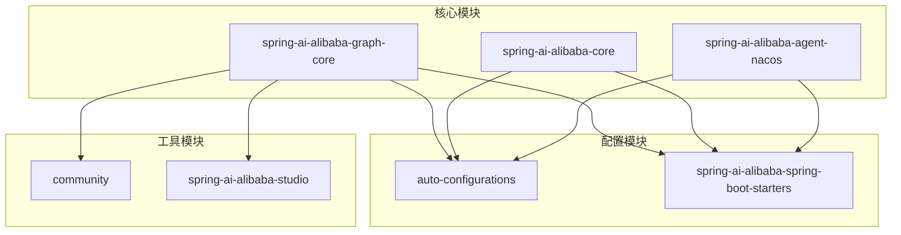
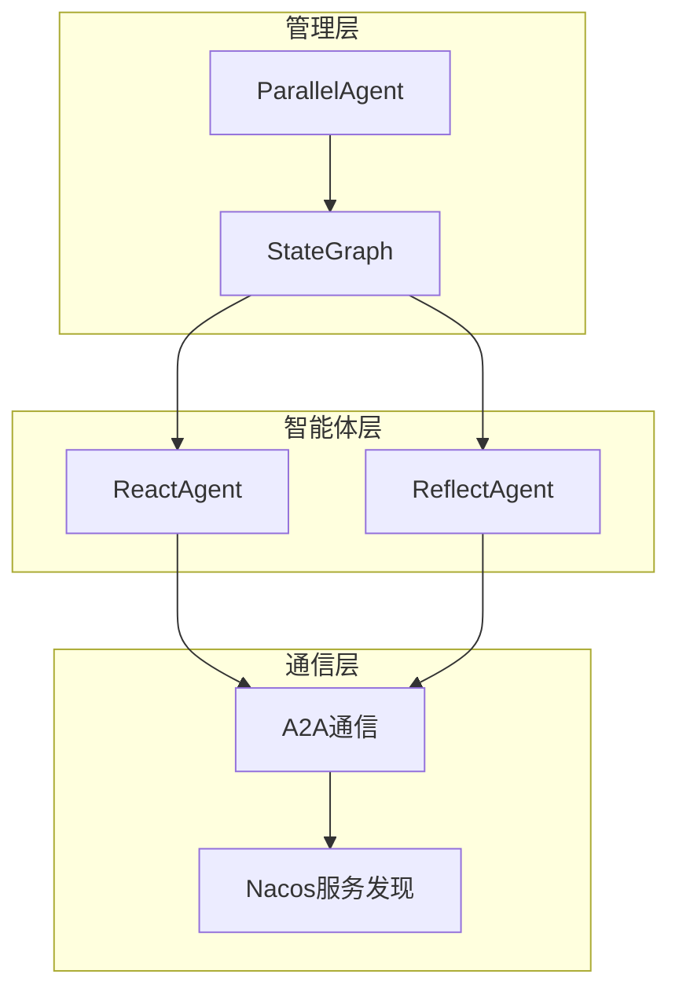
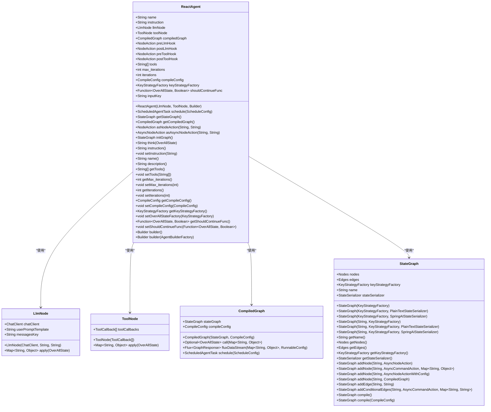
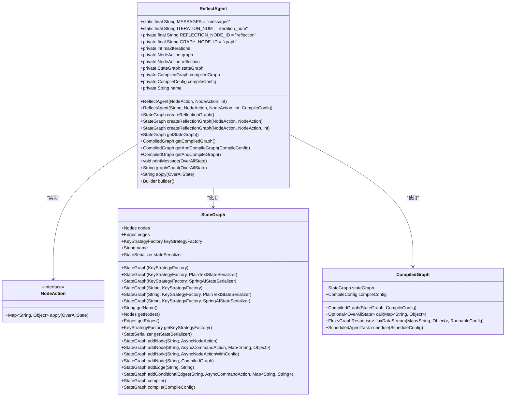
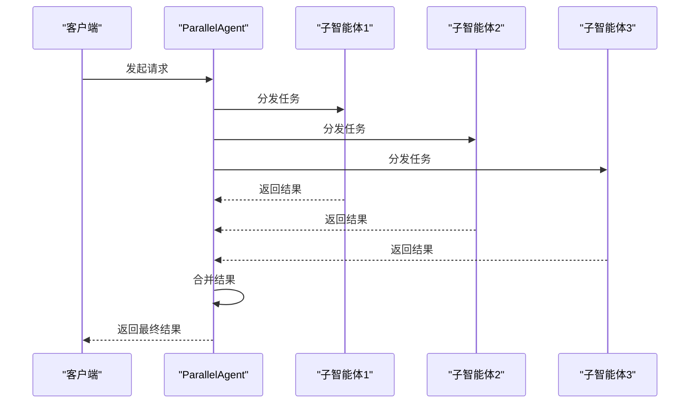
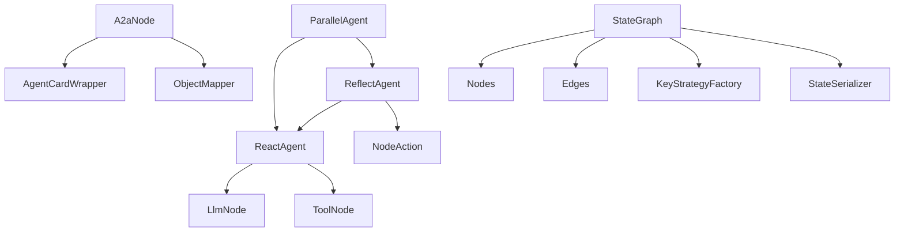

# 多智能体模式

<cite>
**本文档引用的文件**
- [ReActAgent.java](file://spring-ai-alibaba-graph-core/src/main/java/com/alibaba/cloud/ai/graph/agent/ReactAgent.java)
- [ReflectAgent.java](file://spring-ai-alibaba-graph-core/src/main/java/com/alibaba/cloud/ai/graph/agent/ReflectAgent.java)
- [AgentTool.java](file://spring-ai-alibaba-graph-core/src/main/java/com/alibaba/cloud/ai/graph/agent/AgentTool.java)
- [A2aNode.java](file://spring-ai-alibaba-graph-core/src/main/java/com/alibaba/cloud/ai/graph/agent/a2a/A2aNode.java)
- [ParallelAgent.java](file://spring-ai-alibaba-graph-core/src/main/java/com/alibaba/cloud/ai/graph/agent/flow/agent/ParallelAgent.java)
- [StateGraph.java](file://spring-ai-alibaba-graph-core/src/main/java/com/alibaba/cloud/ai/graph/StateGraph.java)
</cite>

## 目录
1. [引言](#引言)
2. [项目结构](#项目结构)
3. [核心组件](#核心组件)
4. [架构概述](#架构概述)
5. [详细组件分析](#详细组件分析)
6. [依赖分析](#依赖分析)
7. [性能考虑](#性能考虑)
8. [故障排除指南](#故障排除指南)
9. [结论](#结论)

## 引言
本文档深入探讨了多智能体系统中ReactAgent和ReflectAgent的实现原理及其在协作工作流中的应用。我们将详细解释ReAct模式（推理与行动）如何通过Thought、Action、Observation循环实现智能决策，并展示其在复杂任务分解中的优势。同时，文档将描述ReflectAgent的自我反思机制，包括如何评估自身表现并调整后续行为。通过实际案例，展示多个智能体如何通过消息传递和状态共享协同完成任务。此外，我们还将记录智能体间的通信协议和协调机制，包括如何处理竞争条件和死锁。最后，为开发者提供设计高效多智能体系统的最佳实践，包括角色分配、责任划分和容错处理。

## 项目结构
该项目采用模块化设计，主要分为以下几个部分：auto-configurations、community、spring-ai-alibaba-a2a、spring-ai-alibaba-agent-nacos、spring-ai-alibaba-bom、spring-ai-alibaba-core、spring-ai-alibaba-deepresearch、spring-ai-alibaba-graph-core、spring-ai-alibaba-jmanus、spring-ai-alibaba-mcp、spring-ai-alibaba-nl2sql、spring-ai-alibaba-observation-extension、spring-ai-alibaba-prompt、spring-ai-alibaba-spring-boot-starters、spring-ai-alibaba-studio、tools等。每个模块负责不同的功能，如自动配置、社区贡献、A2A通信、Nacos集成、BOM管理、核心AI功能、深度研究、图计算核心、JManus协调器、MCP协议、NL2SQL转换、观察扩展、提示管理、Spring Boot启动器、Studio工具等。

**图表来源**
- [ReActAgent.java](file://spring-ai-alibaba-graph-core/src/main/java/com/alibaba/cloud/ai/graph/agent/ReactAgent.java)
- [ReflectAgent.java](file://spring-ai-alibaba-graph-core/src/main/java/com/alibaba/cloud/ai/graph/agent/ReflectAgent.java)

**章节来源**
- [ReActAgent.java](file://spring-ai-alibaba-graph-core/src/main/java/com/alibaba/cloud/ai/graph/agent/ReactAgent.java)
- [ReflectAgent.java](file://spring-ai-alibaba-graph-core/src/main/java/com/alibaba/cloud/ai/graph/agent/ReflectAgent.java)

## 核心组件
本节将深入分析ReactAgent和ReflectAgent这两个核心组件的实现原理。

**章节来源**
- [ReActAgent.java](file://spring-ai-alibaba-graph-core/src/main/java/com/alibaba/cloud/ai/graph/agent/ReactAgent.java)
- [ReflectAgent.java](file://spring-ai-alibaba-graph-core/src/main/java/com/alibaba/cloud/ai/graph/agent/ReflectAgent.java)

## 架构概述
该多智能体系统的架构基于ReAct模式，通过Thought、Action、Observation循环实现智能决策。ReactAgent作为基础智能体，负责执行具体的任务；而ReflectAgent则在此基础上增加了自我反思的能力，能够评估自身表现并调整后续行为。整个系统通过A2A（Agent-to-Agent）通信协议实现智能体之间的协作，利用Nacos进行服务发现和注册，确保系统的高可用性和可扩展性。

**图表来源**
- [ReActAgent.java](file://spring-ai-alibaba-graph-core/src/main/java/com/alibaba/cloud/ai/graph/agent/ReactAgent.java)
- [ReflectAgent.java](file://spring-ai-alibaba-graph-core/src/main/java/com/alibaba/cloud/ai/graph/agent/ReflectAgent.java)
- [A2aNode.java](file://spring-ai-alibaba-graph-core/src/main/java/com/alibaba/cloud/ai/graph/agent/a2a/A2aNode.java)

## 详细组件分析
### ReactAgent分析
ReactAgent是基于ReAct模式实现的基础智能体，它通过Thought、Action、Observation循环来完成任务。具体来说，当接收到用户请求时，ReactAgent首先生成一个思考（Thought），然后根据这个思考选择一个合适的行动（Action），执行完行动后观察结果（Observation），再根据观察结果生成新的思考，如此循环直到任务完成。

#### 类图

**图表来源**
- [ReActAgent.java](file://spring-ai-alibaba-graph-core/src/main/java/com/alibaba/cloud/ai/graph/agent/ReactAgent.java)

### ReflectAgent分析
ReflectAgent是在ReactAgent基础上增加自我反思能力的智能体。它不仅能够执行任务，还能评估自己的表现，并根据评估结果调整后续的行为。这种自我反思机制使得ReflectAgent能够在复杂的环境中更好地适应变化，提高任务完成的质量。

#### 类图

**图表来源**
- [ReflectAgent.java](file://spring-ai-alibaba-graph-core/src/main/java/com/alibaba/cloud/ai/graph/agent/ReflectAgent.java)

### 并行执行分析
ParallelAgent用于实现多个智能体的并行执行，通过Fan-Out模式分发任务，再通过Gather模式收集结果。这种方式可以显著提高任务处理的效率，特别是在需要同时处理多个独立子任务的场景下。

#### 序列图

**图表来源**
- [ParallelAgent.java](file://spring-ai-alibaba-graph-core/src/main/java/com/alibaba/cloud/ai/graph/agent/flow/agent/ParallelAgent.java)

## 依赖分析
本系统中的各个组件之间存在紧密的依赖关系。ReactAgent和ReflectAgent都依赖于LlmNode和ToolNode来执行具体的任务，而ParallelAgent则依赖于多个ReactAgent或ReflectAgent实例来实现并行处理。此外，所有智能体都通过A2A通信协议与外部系统交互，利用Nacos进行服务发现和注册。

**图表来源**
- [ReActAgent.java](file://spring-ai-alibaba-graph-core/src/main/java/com/alibaba/cloud/ai/graph/agent/ReactAgent.java)
- [ReflectAgent.java](file://spring-ai-alibaba-graph-core/src/main/java/com/alibaba/cloud/ai/graph/agent/ReflectAgent.java)
- [ParallelAgent.java](file://spring-ai-alibaba-graph-core/src/main/java/com/alibaba/cloud/ai/graph/agent/flow/agent/ParallelAgent.java)
- [A2aNode.java](file://spring-ai-alibaba-graph-core/src/main/java/com/alibaba/cloud/ai/graph/agent/a2a/A2aNode.java)
- [StateGraph.java](file://spring-ai-alibaba-graph-core/src/main/java/com/alibaba/cloud/ai/graph/StateGraph.java)

**章节来源**
- [ReActAgent.java](file://spring-ai-alibaba-graph-core/src/main/java/com/alibaba/cloud/ai/graph/agent/ReactAgent.java)
- [ReflectAgent.java](file://spring-ai-alibaba-graph-core/src/main/java/com/alibaba/cloud/ai/graph/agent/ReflectAgent.java)
- [ParallelAgent.java](file://spring-ai-alibaba-graph-core/src/main/java/com/alibaba/cloud/ai/graph/agent/flow/agent/ParallelAgent.java)
- [A2aNode.java](file://spring-ai-alibaba-graph-core/src/main/java/com/alibaba/cloud/ai/graph/agent/a2a/A2aNode.java)
- [StateGraph.java](file://spring-ai-alibaba-graph-core/src/main/java/com/alibaba/cloud/ai/graph/StateGraph.java)

## 性能考虑
在设计多智能体系统时，性能是一个重要的考量因素。为了提高系统的响应速度和吞吐量，我们采用了多种优化策略：
1. **并行执行**：通过ParallelAgent实现多个智能体的并行执行，充分利用多核处理器的优势。
2. **异步通信**：使用A2A通信协议的异步特性，减少等待时间，提高整体效率。
3. **缓存机制**：对于频繁访问的数据，采用内存缓存或分布式缓存（如Redis）来减少数据库查询次数。
4. **负载均衡**：通过Nacos的服务发现和负载均衡功能，合理分配请求到不同的智能体实例，避免单点过载。

## 故障排除指南
在使用多智能体系统时，可能会遇到各种问题。以下是一些常见的故障及其解决方法：
1. **智能体无法启动**：检查Nacos服务是否正常运行，确认智能体的配置信息是否正确。
2. **任务执行超时**：增加任务的最大迭代次数，或者优化任务逻辑以减少执行时间。
3. **通信失败**：检查网络连接，确保A2A通信端口未被防火墙阻止。
4. **数据不一致**：使用事务管理或分布式锁来保证数据的一致性。

**章节来源**
- [ReActAgent.java](file://spring-ai-alibaba-graph-core/src/main/java/com/alibaba/cloud/ai/graph/agent/ReactAgent.java)
- [ReflectAgent.java](file://spring-ai-alibaba-graph-core/src/main/java/com/alibaba/cloud/ai/graph/agent/ReflectAgent.java)
- [A2aNode.java](file://spring-ai-alibaba-graph-core/src/main/java/com/alibaba/cloud/ai/graph/agent/a2a/A2aNode.java)

## 结论
本文档详细介绍了多智能体系统中ReactAgent和ReflectAgent的实现原理及其在协作工作流中的应用。通过ReAct模式，智能体能够通过Thought、Action、Observation循环实现智能决策，而在ReflectAgent中加入的自我反思机制进一步提升了系统的适应能力和任务完成质量。通过A2A通信协议和Nacos服务发现，实现了智能体之间的高效协作。希望这些内容能帮助开发者更好地理解和使用多智能体系统，构建更加智能和高效的AI应用。