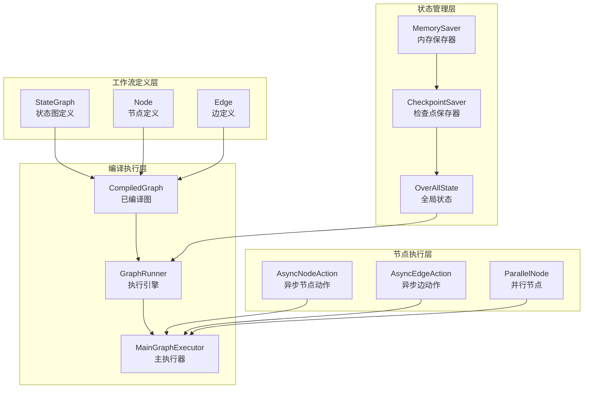
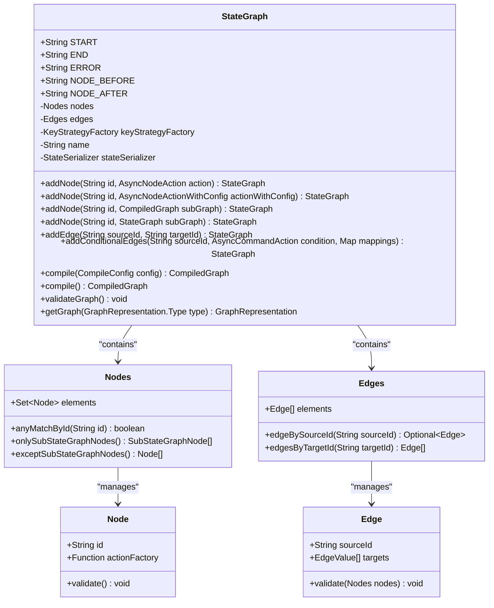
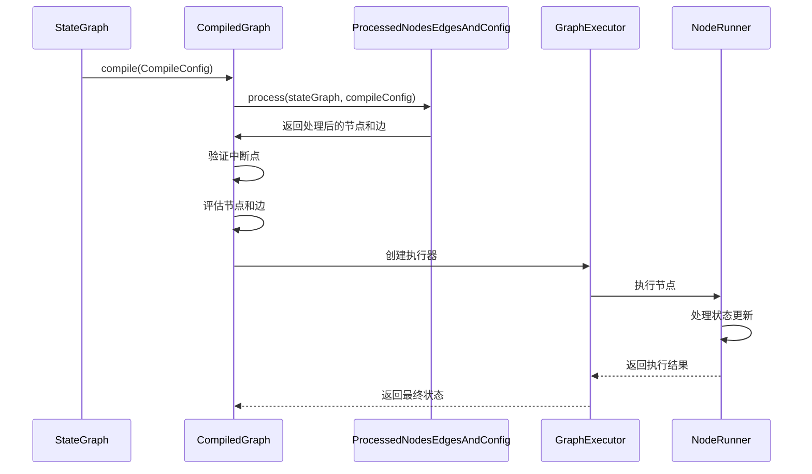
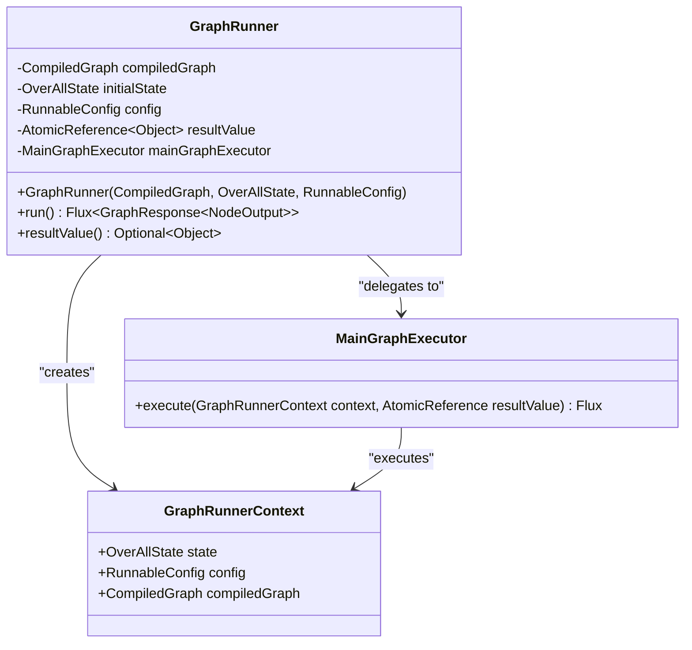
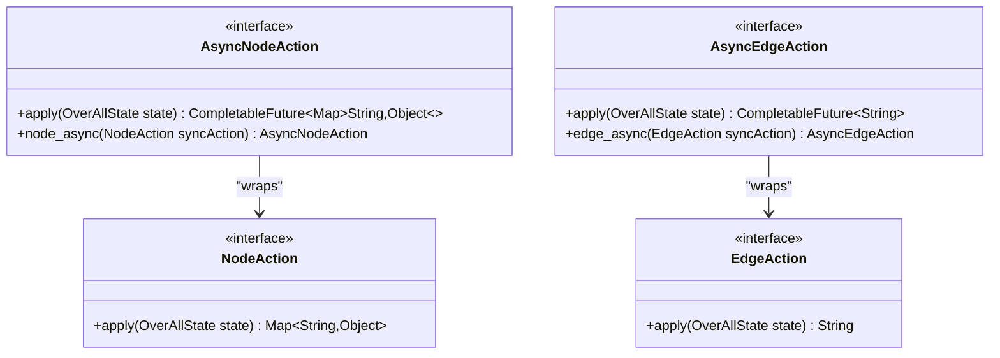
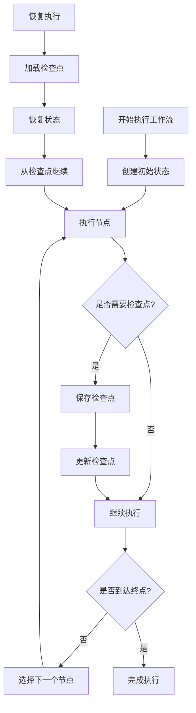

# 工作流编排

<cite>
**本文档引用的文件**
- [StateGraph.java](file://spring-ai-alibaba-graph-core/src/main/java/com/alibaba/cloud/ai/graph/StateGraph.java)
- [CompiledGraph.java](file://spring-ai-alibaba-graph-core/src/main/java/com/alibaba/cloud/ai/graph/CompiledGraph.java)
- [GraphRunner.java](file://spring-ai-alibaba-graph-core/src/main/java/com/alibaba/cloud/ai/graph/GraphRunner.java)
- [AsyncNodeAction.java](file://spring-ai-alibaba-graph-core/src/main/java/com/alibaba/cloud/ai/graph/action/AsyncNodeAction.java)
- [AsyncEdgeAction.java](file://spring-ai-alibaba-graph-core/src/main/java/com/alibaba/cloud/ai/graph/action/AsyncEdgeAction.java)
- [MemorySaver.java](file://spring-ai-alibaba-graph-core/src/main/java/com/alibaba/cloud/ai/graph/checkpoint/savers/MemorySaver.java)
- [DeepResearchConfiguration.java](file://spring-ai-alibaba-deepresearch/src/main/java/com/alibaba/cloud/ai/example/deepresearch/config/DeepResearchConfiguration.java)
- [README-zh.md](file://spring-ai-alibaba-graph-core/README-zh.md)
</cite>

## 目录
1. [简介](#简介)
2. [核心概念](#核心概念)
3. [架构概览](#架构概览)
4. [详细组件分析](#详细组件分析)
5. [工作流构建示例](#工作流构建示例)
6. [检查点与状态管理](#检查点与状态管理)
7. [性能优化与最佳实践](#性能优化与最佳实践)
8. [故障排除指南](#故障排除指南)
9. [总结](#总结)

## 简介

Spring AI Alibaba Graph 是一款面向 Java 开发者的**工作流、多智能体框架**，专门用于构建由多个 AI 模型或步骤组成的复杂应用。该框架基于 Spring Boot 生态进行深度集成，提供声明式的 API 来编排工作流，让开发者能将 AI 应用的各个步骤抽象为节点（Node），并通过有向图（Graph）的形式连接这些节点，形成可定制的执行流程。

与传统单 Agent（一问一答式）方案相比，Spring AI Alibaba Graph 支持更复杂的多步骤任务流程，有助于解决**单一大模型对复杂任务力不从心**的问题。框架核心包括：
- **StateGraph**（状态图，用于定义节点和边）
- **Node**（节点，封装具体操作或模型调用）
- **Edge**（边，表示节点间的跳转关系）
- **OverAllState**（全局状态，贯穿流程共享数据）

这些设计使开发者能够方便地管理工作流中的状态和逻辑流转。

## 核心概念

### StateGraph（状态图/工作流图）
StateGraph 是整个工作流的主类，支持添加节点（addNode）、边（addEdge、addConditionalEdges）、条件分支、子图等功能。它可以校验图结构，最终编译为 CompiledGraph 以供执行。

### Node（节点）
表示工作流中的单个步骤，如模型调用、数据处理等。支持异步节点，可封装大模型调用或自定义逻辑。

### Edge（边）
表示节点之间的转移关系，支持条件分支（根据状态决定下一个节点）。

### OverAllState（全局状态）
可序列化的全局状态对象，贯穿整个工作流，支持按 key 注册不同的合并/更新策略（如替换、合并等），用于数据传递、断点续跑、人工干预等。

### CompiledGraph（已编译图）
StateGraph 的可执行版本，负责实际的节点执行、状态流转、结果流式输出，支持中断、并行节点、检查点等高级特性。

## 架构概览



**图表来源**
- [StateGraph.java](file://spring-ai-alibaba-graph-core/src/main/java/com/alibaba/cloud/ai/graph/StateGraph.java#L427-L459)
- [CompiledGraph.java](file://spring-ai-alibaba-graph-core/src/main/java/com/alibaba/cloud/ai/graph/CompiledGraph.java#L89-L126)
- [GraphRunner.java](file://spring-ai-alibaba-graph-core/src/main/java/com/alibaba/cloud/ai/graph/GraphRunner.java#L39-L67)

## 详细组件分析

### StateGraph 类分析

StateGraph 是工作流编排的核心类，提供了完整的图结构定义能力。



**图表来源**
- [StateGraph.java](file://spring-ai-alibaba-graph-core/src/main/java/com/alibaba/cloud/ai/graph/StateGraph.java#L42-L601)

**章节来源**
- [StateGraph.java](file://spring-ai-alibaba-graph-core/src/main/java/com/alibaba/cloud/ai/graph/StateGraph.java#L42-L601)

### CompiledGraph 编译优化分析

CompiledGraph 是 StateGraph 的可执行版本，负责实际的节点执行和状态流转。



**图表来源**
- [CompiledGraph.java](file://spring-ai-alibaba-graph-core/src/main/java/com/alibaba/cloud/ai/graph/CompiledGraph.java#L89-L126)

**章节来源**
- [CompiledGraph.java](file://spring-ai-alibaba-graph-core/src/main/java/com/alibaba/cloud/ai/graph/CompiledGraph.java#L89-L200)

### GraphRunner 执行引擎分析

GraphRunner 是基于 Project Reactor 的响应式图执行引擎，采用了面向对象原则进行重构。



**图表来源**
- [GraphRunner.java](file://spring-ai-alibaba-graph-core/src/main/java/com/alibaba/cloud/ai/graph/GraphRunner.java#L39-L67)

**章节来源**
- [GraphRunner.java](file://spring-ai-alibaba-graph-core/src/main/java/com/alibaba/cloud/ai/graph/GraphRunner.java#L39-L67)

### 异步节点和边动作分析



**图表来源**
- [AsyncNodeAction.java](file://spring-ai-alibaba-graph-core/src/main/java/com/alibaba/cloud/ai/graph/action/AsyncNodeAction.java#L28-L59)
- [AsyncEdgeAction.java](file://spring-ai-alibaba-graph-core/src/main/java/com/alibaba/cloud/ai/graph/action/AsyncEdgeAction.java#L28-L58)

**章节来源**
- [AsyncNodeAction.java](file://spring-ai-alibaba-graph-core/src/main/java/com/alibaba/cloud/ai/graph/action/AsyncNodeAction.java#L28-L59)
- [AsyncEdgeAction.java](file://spring-ai-alibaba-graph-core/src/main/java/com/alibaba/cloud/ai/graph/action/AsyncEdgeAction.java#L28-L58)

## 工作流构建示例

### 基础线性工作流示例

以下是一个简单的线性工作流示例，展示了如何使用 StateGraph 构建基本的工作流：

```java
// 创建状态图实例
StateGraph workflow = new StateGraph(() -> {
    HashMap<String, KeyStrategy> keyStrategyHashMap = new HashMap<>();
    keyStrategyHashMap.put("prop1", (o, o2) -> o2);
    return keyStrategyHashMap;
})
// 添加起始边
.addEdge(START, "agent_1")
// 添加节点
.addNode("agent_1", node_async(state -> {
    System.out.println("agent_1");
    return Map.of("prop1", "test");
}))
// 添加结束边
.addEdge("agent_1", END);

// 编译工作流
CompiledGraph app = workflow.compile();

// 执行工作流
Optional<OverAllState> result = app.call(Map.of(OverAllState.DEFAULT_INPUT_KEY, "test1"));
```

### 条件分支工作流示例

```java
// 创建带条件分支的工作流
StateGraph workflow = new StateGraph(createKeyStrategyFactory())
    .addNode("agent_1", node_async(state -> {
        System.out.println("agent_1");
        return Map.of("messages", "message1");
    }))
    .addNode("agent_2", node_async(state -> {
        System.out.println("agent_2");
        return Map.of("messages", new String[] { "message2" });
    }))
    .addNode("agent_3", node_async(state -> {
        System.out.println("agent_3");
        List<String> messages = Optional.ofNullable(state.value("messages").get())
            .filter(List.class::isInstance)
            .map(List.class::cast)
            .orElse(new ArrayList<>());
        messages.add("message3");
        return Map.of("messages", messages);
    }))
    // 添加条件边
    .addConditionalEdges("agent_1", edge_async(state -> {
        // 根据状态决定下一个节点
        return state.value("decision").orElse("agent_2");
    }), Map.of("agent_2", "agent_2", "agent_3", "agent_3"))
    .addEdge("agent_2", "agent_3")
    .addEdge("agent_3", END);
```

### 子图嵌套工作流示例

```java
// 创建子图
var workflowChild = new StateGraph(createKeyStrategyFactory())
    .addNode("step_1", _makeNode("child:step1"))
    .addNode("step_2", _makeNode("child:step2"))
    .addNode("step_3", _makeNode("child:step3"))
    .addEdge(START, "step_1")
    .addEdge("step_1", "step_2")
    .addEdge("step_2", "step_3")
    .addEdge("step_3", END);

// 创建父图并嵌套子图
var workflowParent = new StateGraph(createKeyStrategyFactory())
    .addNode("step_1", _makeNode("step1"))
    .addNode("step_2", _makeNode("step2"))
    .addNode("step_3", _makeNode("step3"))
    .addNode("subgraph", workflowChild)  // 嵌套子图
    .addEdge(START, "step_1")
    .addEdge("step_1", "step_2")
    .addEdge("step_2", "subgraph")
    .addEdge("subgraph", "step_3")
    .addEdge("step_3", END)
    .compile(compileConfig);
```

**章节来源**
- [StateGraphTest.java](file://spring-ai-alibaba-graph-core/src/test/java/com/alibaba/cloud/ai/graph/StateGraphTest.java#L130-L199)
- [DeepResearchConfiguration.java](file://spring-ai-alibaba-deepresearch/src/main/java/com/alibaba/cloud/ai/example/deepresearch/config/DeepResearchConfiguration.java#L246-L263)

## 检查点与状态管理

### 检查点保存机制

Spring AI Alibaba Graph 提供了完整的检查点保存和恢复功能，通过 BaseCheckpointSaver 接口实现持久化。



**图表来源**
- [MemorySaver.java](file://spring-ai-alibaba-graph-core/src/main/java/com/alibaba/cloud/ai/graph/checkpoint/savers/MemorySaver.java#L89-L164)

### 内存保存器实现

MemorySaver 是默认的检查点保存器实现，使用内存存储检查点数据：

```java
public class MemorySaver implements BaseCheckpointSaver {
    final Map<String, LinkedList<Checkpoint>> _checkpointsByThread = new HashMap<>();
    private final ReentrantLock _lock = new ReentrantLock();
    
    @Override
    public final RunnableConfig put(RunnableConfig config, Checkpoint checkpoint) throws Exception {
        return loadOrInitCheckpoints(config, checkpoints -> {
            if (config.checkPointId().isPresent()) {
                // 替换检查点
                String checkPointId = config.checkPointId().get();
                int index = IntStream.range(0, checkpoints.size())
                    .filter(i -> checkpoints.get(i).getId().equals(checkPointId))
                    .findFirst()
                    .orElseThrow(() -> new NoSuchElementException(
                        format("Checkpoint with id %s not found!", checkPointId)));
                checkpoints.set(index, checkpoint);
                return config;
            }
            
            // 添加新的检查点
            checkpoints.push(checkpoint);
            return RunnableConfig.builder(config).checkPointId(checkpoint.getId()).build();
        });
    }
}
```

**章节来源**
- [MemorySaver.java](file://spring-ai-alibaba-graph-core/src/main/java/com/alibaba/cloud/ai/graph/checkpoint/savers/MemorySaver.java#L89-L164)

## 性能优化与最佳实践

### 并行节点执行

Spring AI Alibaba Graph 支持并行节点执行，通过 ParallelNode 实现：

```java
// 并行执行多个节点
var parallelNode = new ParallelNode(e.sourceId(), actions, keyStrategyMap, compileConfig);
nodes.put(parallelNode.id(), parallelNode.actionFactory().apply(compileConfig));
edges.put(e.sourceId(), new EdgeValue(parallelNode.id()));
edges.put(parallelNode.id(), new EdgeValue(parallelNodeTargets.iterator().next()));
```

### 流式执行模式

```java
// 使用流式执行模式
Flux<NodeOutput> stream = compiledGraph.fluxStream(input, runnableConfig);
stream.subscribe(nodeOutput -> {
    // 处理每个节点的输出
    System.out.println("Node executed: " + nodeOutput.nodeId());
});
```

### 最佳实践建议

1. **合理设计节点职责**：每个节点应专注于单一功能，避免过于复杂的逻辑
2. **使用适当的同步策略**：根据业务需求选择合适的 KeyStrategy（ReplaceStrategy、AppendStrategy 等）
3. **实施检查点机制**：对于长时间运行的工作流，定期保存检查点以支持断点续跑
4. **监控执行状态**：使用 GraphRunner 的流式输出监控工作流执行进度
5. **错误处理策略**：实现完善的异常处理和重试机制

## 故障排除指南

### 常见错误类型

1. **GraphStateException**：图结构验证失败
   - 缺少入口点（START）
   - 节点标识符无效
   - 边的目标节点不存在

2. **GraphRunnerException**：执行时异常
   - 节点执行超时
   - 状态序列化失败
   - 检查点加载失败

### 调试技巧

```java
// 启用调试日志
logger.debug("Executing node: {}", nodeId);
logger.debug("State before execution: {}", state.data());

// 获取工作流图表示
GraphRepresentation plantUml = workflow.getGraph(GraphRepresentation.Type.PLANTUML, "Debug Workflow");
System.out.println(plantUml.content());
```

### 性能监控

```java
// 监控执行时间
long startTime = System.currentTimeMillis();
try {
    Optional<OverAllState> result = compiledGraph.call(input);
    long duration = System.currentTimeMillis() - startTime;
    logger.info("Execution completed in {} ms", duration);
} catch (Exception e) {
    logger.error("Execution failed", e);
}
```

## 总结

Spring AI Alibaba Graph 提供了一套完整的 AI 工作流编排解决方案，通过 StateGraph、CompiledGraph 和 GraphRunner 等核心组件，实现了从工作流定义到执行的完整生命周期管理。

### 主要优势

1. **声明式 API**：通过直观的 API 设计，简化了复杂工作流的构建过程
2. **响应式执行**：基于 Project Reactor 的响应式编程模型，支持高并发和流式处理
3. **灵活的状态管理**：支持多种状态合并策略和检查点机制
4. **强大的扩展性**：支持子图嵌套、并行执行、条件路由等高级特性
5. **完善的错误处理**：提供详细的异常信息和恢复机制

### 适用场景

- 多步骤 AI 应用编排
- 复杂业务流程自动化
- 多智能体协作系统
- 数据处理管道
- 机器学习工作流

通过合理使用这些组件和遵循最佳实践，开发者可以构建出高效、可靠且易于维护的 AI 工作流应用。