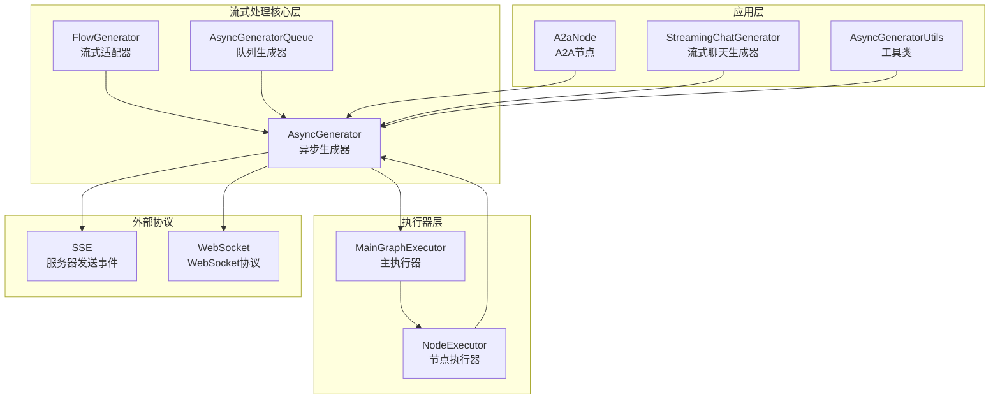
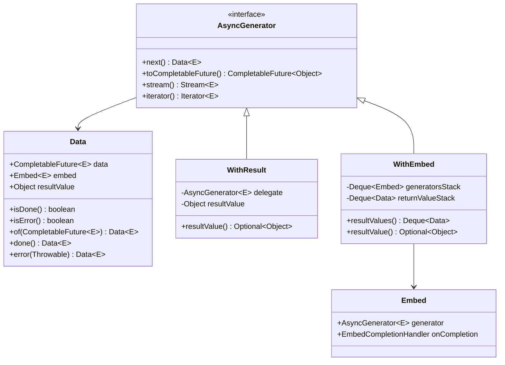
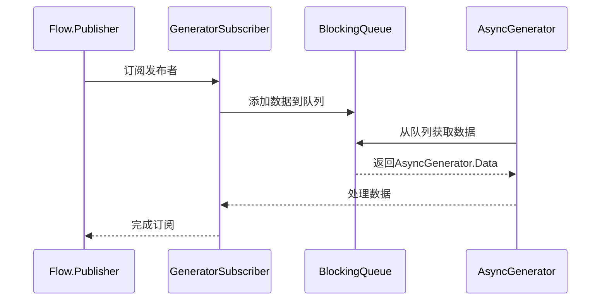
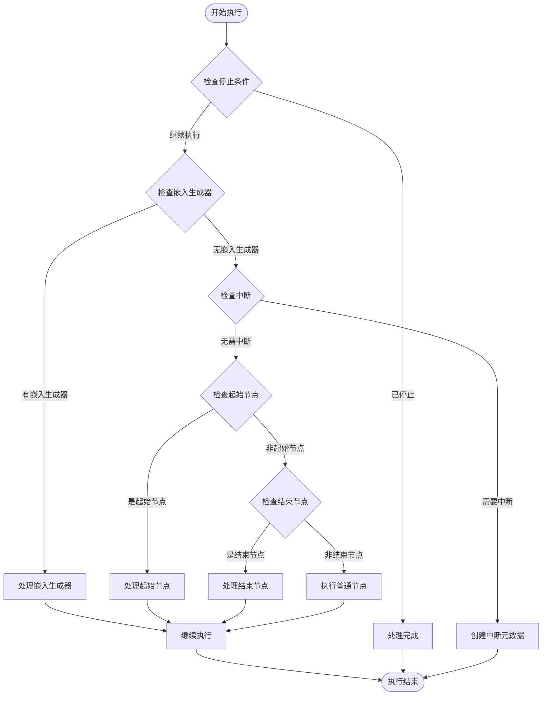
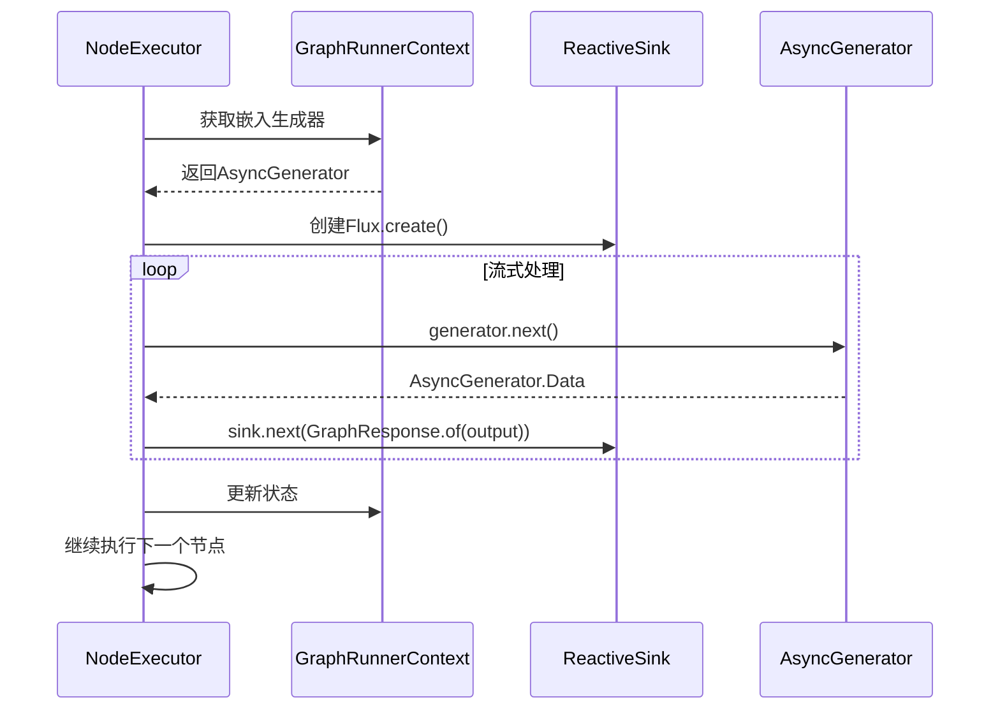
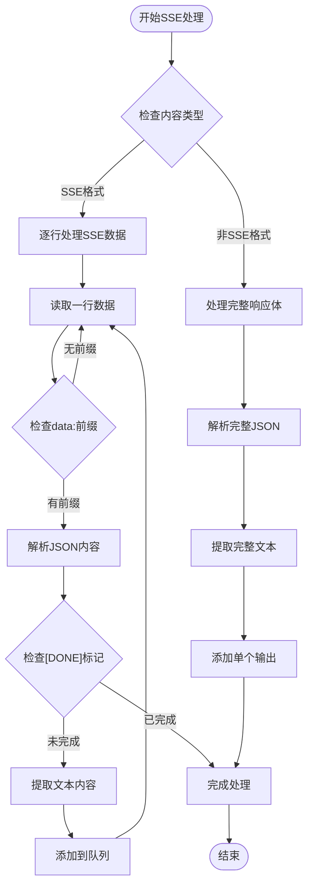
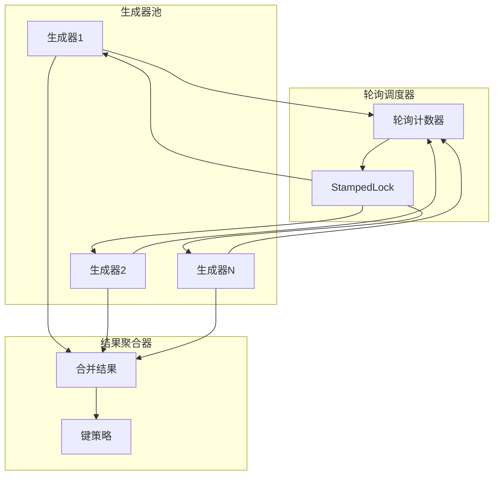
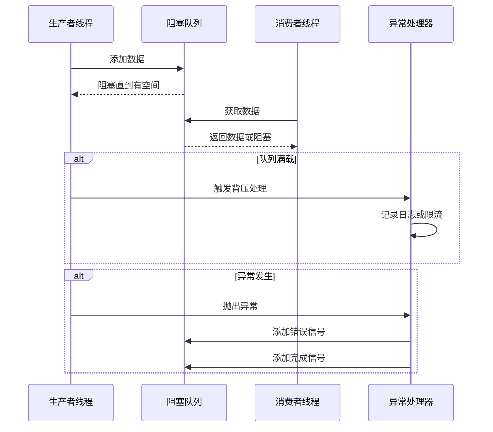

# 流式支持

<cite>
**本文档引用的文件**
- [AsyncGenerator.java](file://spring-ai-alibaba-graph-core/src/main/java/com/alibaba/cloud/ai/graph/async/AsyncGenerator.java)
- [FlowGenerator.java](file://spring-ai-alibaba-graph-core/src/main/java/com/alibaba/cloud/ai/graph/async/FlowGenerator.java)
- [AsyncGeneratorQueue.java](file://spring-ai-alibaba-graph-core/src/main/java/com/alibaba/cloud/ai/graph/async/AsyncGeneratorQueue.java)
- [MainGraphExecutor.java](file://spring-ai-alibaba-graph-core/src/main/java/com/alibaba/cloud/ai/graph/executor/MainGraphExecutor.java)
- [NodeExecutor.java](file://spring-ai-alibaba-graph-core/src/main/java/com/alibaba/cloud/ai/graph/executor/NodeExecutor.java)
- [A2aNode.java](file://spring-ai-alibaba-graph-core/src/main/java/com/alibaba/cloud/ai/graph/agent/a2a/A2aNode.java)
- [AsyncGeneratorUtils.java](file://spring-ai-alibaba-graph-core/src/main/java/com/alibaba/cloud/ai/graph/streaming/AsyncGeneratorUtils.java)
- [StreamingChatGenerator.java](file://spring-ai-alibaba-graph-core/src/main/java/com/alibaba/cloud/ai/graph/streaming/StreamingChatGenerator.java)
- [StateGraphStreamTest.java](file://spring-ai-alibaba-graph-core/src/test/java/com/alibaba/cloud/ai/graph/StateGraphStreamTest.java)
</cite>

## 目录
1. [简介](#简介)
2. [核心架构](#核心架构)
3. [AsyncGenerator异步生成器](#asyncgenerator异步生成器)
4. [FlowGenerator流式生成器](#flowgenerator流式生成器)
5. [MainGraphExecutor主执行器](#maingraphexecutor主执行器)
6. [流式执行流程](#流式执行流程)
7. [A2A节点流式处理](#a2a节点流式处理)
8. [流式合并与聚合](#流式合并与聚合)
9. [背压与流量控制](#背压与流量控制)
10. [性能优化策略](#性能优化策略)
11. [最佳实践](#最佳实践)
12. [故障排除](#故障排除)

## 简介

Spring AI Alibaba的流式支持系统是一个基于响应式编程模型的异步流式处理框架，专门设计用于实现实时反馈和渐进式结果呈现。该系统通过AsyncGenerator接口、FlowGenerator适配器和MainGraphExecutor执行器的协同工作，提供了低延迟的流式输出能力，支持SSE（Server-Sent Events）和WebSocket协议。

流式支持的核心目标是：
- 实现毫秒级的响应延迟
- 支持实时数据流处理
- 提供渐进式结果展示
- 确保系统的可扩展性和稳定性

## 核心架构



**图表来源**
- [AsyncGenerator.java](file://spring-ai-alibaba-graph-core/src/main/java/com/alibaba/cloud/ai/graph/async/AsyncGenerator.java#L44-L486)
- [MainGraphExecutor.java](file://spring-ai-alibaba-graph-core/src/main/java/com/alibaba/cloud/ai/graph/executor/MainGraphExecutor.java#L39-L161)

## AsyncGenerator异步生成器

AsyncGenerator是整个流式系统的核心接口，它定义了异步元素生成的标准模式。该接口继承自Iterable，提供了完整的异步迭代能力。

### 核心特性

```java
@Deprecated
public interface AsyncGenerator<E> extends Iterable<E>, AsyncGeneratorOperators<E> {
    // 异步获取下一个元素
    Data<E> next();
    
    // 转换为CompletableFuture
    default CompletableFuture<Object> toCompletableFuture();
    
    // 返回流式序列
    default Stream<E> stream();
    
    // 返回迭代器
    default Iterator<E> iterator();
}
```

### 数据结构

AsyncGenerator.Data类封装了异步生成的数据元素：

```java
class Data<E> {
    final CompletableFuture<E> data;     // 异步数据
    final Embed<E> embed;               // 嵌入生成器
    final Object resultValue;           // 结果值
    
    // 静态工厂方法
    public static <E> Data<E> of(CompletableFuture<E> data);
    public static <E> Data<E> done();
    public static <E> Data<E> error(Throwable exception);
}
```

### 装饰器模式

系统提供了多种装饰器来增强AsyncGenerator的功能：

1. **WithResult装饰器**：添加结果值检索能力
2. **WithEmbed装饰器**：支持生成器嵌套组合
3. **Embed装饰器**：管理生成器组合逻辑



**图表来源**
- [AsyncGenerator.java](file://spring-ai-alibaba-graph-core/src/main/java/com/alibaba/cloud/ai/graph/async/AsyncGenerator.java#L44-L486)

**章节来源**
- [AsyncGenerator.java](file://spring-ai-alibaba-graph-core/src/main/java/com/alibaba/cloud/ai/graph/async/AsyncGenerator.java#L44-L486)

## FlowGenerator流式适配器

FlowGenerator提供了Java Flow API与AsyncGenerator之间的桥梁，实现了响应式流式处理的无缝集成。

### 核心功能

```java
@Deprecated
public interface FlowGenerator {
    // 从Flow.Publisher创建AsyncGenerator
    static <T, P extends Flow.Publisher<T>, R> AsyncGenerator<T> 
        fromPublisher(P publisher, Supplier<R> mapResult);
    
    // 将AsyncGenerator转换为Flow.Publisher
    static <T> Flow.Publisher<T> toPublisher(AsyncGenerator<T> generator);
}
```

### 实现原理

FlowGenerator通过GeneratorSubscriber和GeneratorPublisher两个内部类实现流式适配：



**图表来源**
- [FlowGenerator.java](file://spring-ai-alibaba-graph-core/src/main/java/com/alibaba/cloud/ai/graph/async/FlowGenerator.java#L44-L69)

**章节来源**
- [FlowGenerator.java](file://spring-ai-alibaba-graph-core/src/main/java/com/alibaba/cloud/ai/graph/async/FlowGenerator.java#L44-L69)

## MainGraphExecutor主执行器

MainGraphExecutor是流式执行的核心调度器，负责协调整个图的执行流程，特别是处理嵌入式AsyncGenerator的流式输出。

### 执行流程



**图表来源**
- [MainGraphExecutor.java](file://spring-ai-alibaba-graph-core/src/main/java/com/alibaba/cloud/ai/graph/executor/MainGraphExecutor.java#L54-L115)

### 关键方法

MainGraphExecutor的核心方法包括：

1. **execute()**：主要执行入口，处理各种执行场景
2. **handleStartNode()**：处理起始节点的特殊逻辑
3. **handleEndNode()**：处理结束节点的清理工作

```java
@Override
public Flux<GraphResponse<NodeOutput>> execute(GraphRunnerContext context, 
                                             AtomicReference<Object> resultValue) {
    try {
        // 检查停止条件
        if (context.shouldStop() || context.isMaxIterationsReached()) {
            return handleCompletion(context, resultValue);
        }
        
        // 处理嵌入生成器
        final var returnFromEmbed = context.getReturnFromEmbedAndReset();
        if (returnFromEmbed.isPresent()) {
            // 处理中断或完成情况
            return Flux.just(GraphResponse.done(context.buildCurrentNodeOutput()));
        }
        
        // 处理其他执行逻辑...
        
    } catch (Exception e) {
        return Flux.just(GraphResponse.error(e));
    }
}
```

**章节来源**
- [MainGraphExecutor.java](file://spring-ai-alibaba-graph-core/src/main/java/com/alibaba/cloud/ai/graph/executor/MainGraphExecutor.java#L54-L161)

## 流式执行流程

流式执行的核心在于NodeExecutor如何处理嵌入式AsyncGenerator，确保流式输出能够正确传递到上层调用者。

### 处理嵌入式生成器



**图表来源**
- [NodeExecutor.java](file://spring-ai-alibaba-graph-core/src/main/java/com/alibaba/cloud/ai/graph/executor/NodeExecutor.java#L351-L411)

### 状态更新机制

当AsyncGenerator完成时，系统会自动更新上下文状态：

```java
private Flux<GraphResponse<NodeOutput>> handleEmbeddedGenerator(
        GraphRunnerContext context, AsyncGenerator<NodeOutput> generator, 
        Map<String, Object> partialState, AtomicReference<Object> resultValue) {
    
    return Flux.<GraphResponse<NodeOutput>>create(sink -> {
        try {
            // 流式处理生成器输出
            generator.stream().peek(output -> {
                if (output != null) {
                    output.setSubGraph(true);
                    sink.next(GraphResponse.of(output));
                }
            });
            
            // 处理生成器结果值
            var iteratorResult = AsyncGenerator.resultValue(generator);
            if (iteratorResult.isPresent()) {
                // 更新上下文状态
                updateContextState(context, partialState, iteratorResult.get());
            }
            
            sink.complete();
        } catch (Exception e) {
            sink.error(e);
        }
    }).concatWith(Flux.defer(() -> {
        // 继续执行下一个节点
        return mainGraphExecutor.execute(context, resultValue);
    }));
}
```

**章节来源**
- [NodeExecutor.java](file://spring-ai-alibaba-graph-core/src/main/java/com/alibaba/cloud/ai/graph/executor/NodeExecutor.java#L351-L411)

## A2A节点流式处理

A2aNode是系统中最重要的流式处理组件之一，它实现了与远程A2A服务器的实时通信，支持SSE和WebSocket协议。

### 流式生成器创建

```java
private AsyncGenerator<NodeOutput> createStreamingGenerator(OverAllState state) throws Exception {
    final String requestPayload = buildSendStreamingMessageRequest(state, this.inputKeyFromParent);
    final BlockingQueue<AsyncGenerator.Data<NodeOutput>> queue = new LinkedBlockingQueue<>(1000);
    final StringBuilder accumulated = new StringBuilder();

    return AsyncGeneratorQueue.of(queue, q -> {
        String baseUrl = resolveAgentBaseUrl(this.agentCard);
        
        try (CloseableHttpClient httpClient = HttpClients.createDefault()) {
            HttpPost post = new HttpPost(baseUrl);
            post.setHeader("Content-Type", "application/json");
            post.setHeader("Accept", "text/event-stream");
            
            try (CloseableHttpResponse response = httpClient.execute(post)) {
                // 处理SSE响应
                if (isEventStream) {
                    processSSEStream(response, queue, accumulated, state);
                } else {
                    processNonSSEStream(response, queue, accumulated, state);
                }
            }
        } catch (Exception e) {
            queue.add(AsyncGenerator.Data.of(new StreamingOutput(
                "Error: " + e.getMessage(), "a2aNode", state)));
        } finally {
            queue.add(AsyncGenerator.Data.done(
                Map.of(outputKey, accumulated.toString())));
        }
    });
}
```

### SSE流式处理



**图表来源**
- [A2aNode.java](file://spring-ai-alibaba-graph-core/src/main/java/com/alibaba/cloud/ai/graph/agent/a2a/A2aNode.java#L141-L315)

### 实时流式处理

对于SSE格式的响应，系统采用实时处理策略：

```java
private AsyncGenerator<NodeOutput> createRealTimeSseStreamingGenerator(
        String sseResponseText, OverAllState state) {
    
    BlockingQueue<AsyncGenerator.Data<NodeOutput>> queue = new LinkedBlockingQueue<>(1000);
    
    return AsyncGeneratorQueue.of(queue, executor -> {
        try {
            String[] lines = sseResponseText.split("\n");
            
            for (String line : lines) {
                line = line.trim();
                if (line.startsWith("data: ")) {
                    try {
                        String jsonContent = line.substring(6);
                        
                        if ("[DONE]".equals(jsonContent)) {
                            break;
                        }
                        
                        Map<String, Object> parsed = JSON.parseObject(jsonContent,
                            new TypeReference<Map<String, Object>>() {});
                        Map<String, Object> result = (Map<String, Object>) parsed.get("result");
                        
                        if (result != null) {
                            StreamingOutput streamingOutput = createStreamingOutputFromResult(result, state);
                            if (streamingOutput != null) {
                                queue.add(AsyncGenerator.Data.of(streamingOutput));
                            }
                        }
                    } catch (Exception e) {
                        continue; // 忽略解析错误，继续处理
                    }
                }
            }
            
            queue.add(AsyncGenerator.Data.done(Map.of(outputKey, accumulated.toString())));
            
        } catch (Exception e) {
            queue.add(AsyncGenerator.Data.of(new StreamingOutput(
                "Error: " + e.getMessage(), "a2aNode", state)));
            queue.add(AsyncGenerator.Data.done(Map.of(outputKey, accumulated.toString())));
        }
    });
}
```

**章节来源**
- [A2aNode.java](file://spring-ai-alibaba-graph-core/src/main/java/com/alibaba/cloud/ai/graph/agent/a2a/A2aNode.java#L141-L683)

## 流式合并与聚合

AsyncGeneratorUtils提供了强大的多生成器合并功能，支持多个流式源的并发处理和结果聚合。

### 合并生成器实现

```java
public static <T> AsyncGenerator<T> createMergedGenerator(
        List<AsyncGenerator<T>> generators, Map<String, KeyStrategy> keyStrategyMap) {
    
    return new AsyncGenerator<>() {
        private final StampedLock lock = new StampedLock();
        private AtomicInteger pollCounter = new AtomicInteger(0);
        private Map<String, Object> mergedResult = new HashMap<>();
        private final List<AsyncGenerator<T>> activeGenerators = new CopyOnWriteArrayList<>(generators);
        
        @Override
        public Data<T> next() {
            while (true) {
                // 乐观读取锁
                long stamp = lock.tryOptimisticRead();
                boolean empty = activeGenerators.isEmpty();
                
                if (!lock.validate(stamp)) {
                    stamp = lock.readLock();
                    try {
                        empty = activeGenerators.isEmpty();
                    } finally {
                        lock.unlockRead(stamp);
                    }
                }
                
                if (empty) {
                    return Data.done(mergedResult);
                }
                
                // 轮询选择活跃生成器
                final int currentIdx;
                AsyncGenerator<T> current;
                long writeStamp = lock.writeLock();
                try {
                    final int size = activeGenerators.size();
                    if (size == 0) return Data.done(mergedResult);
                    
                    currentIdx = pollCounter.updateAndGet(i -> (i + 1) % size);
                    current = activeGenerators.get(currentIdx);
                } finally {
                    lock.unlockWrite(writeStamp);
                }
                
                // 执行生成器next()方法
                Data<T> data = current.next();
                
                writeStamp = lock.writeLock();
                try {
                    if (!activeGenerators.contains(current)) {
                        continue;
                    }
                    
                    if (data.isDone() || data.isError()) {
                        handleCompletedGenerator(current, data);
                        if (activeGenerators.isEmpty()) {
                            return Data.done(mergedResult);
                        }
                        continue;
                    }
                    
                    handleCompletedGenerator(current, data);
                    return data;
                } finally {
                    lock.unlockWrite(writeStamp);
                }
            }
        }
    };
}
```

### 并发处理策略



**图表来源**
- [AsyncGeneratorUtils.java](file://spring-ai-alibaba-graph-core/src/main/java/com/alibaba/cloud/ai/graph/streaming/AsyncGeneratorUtils.java#L67-L166)

**章节来源**
- [AsyncGeneratorUtils.java](file://spring-ai-alibaba-graph-core/src/main/java/com/alibaba/cloud/ai/graph/streaming/AsyncGeneratorUtils.java#L67-L169)

## 背压与流量控制

系统通过多种机制实现背压控制和流量管理，确保在高负载情况下系统的稳定性。

### 队列缓冲策略

```java
// A2A节点中的队列配置
final BlockingQueue<AsyncGenerator.Data<NodeOutput>> queue = new LinkedBlockingQueue<>(1000);

// AsyncGeneratorQueue中的队列使用
public static <E, Q extends BlockingQueue<AsyncGenerator.Data<E>>> AsyncGenerator<E> of(
        Q queue, Consumer<Q> consumer, Executor executor) {
    
    executor.execute(() -> {
        try {
            consumer.accept(queue);
        } catch (Throwable ex) {
            CompletableFuture<E> error = new CompletableFuture<>();
            error.completeExceptionally(ex);
            queue.add(AsyncGenerator.Data.of(error));
        } finally {
            queue.add(AsyncGenerator.Data.done());
        }
    });
    
    return new Generator<>(queue);
}
```

### 流量控制机制

1. **队列大小限制**：通过LinkedBlockingQueue设置最大容量
2. **背压检测**：监控队列满载情况
3. **异常处理**：优雅处理生产者/消费者不匹配的情况
4. **资源释放**：确保在异常情况下正确释放资源



## 性能优化策略

### 内存管理优化

1. **对象池化**：重用AsyncGenerator.Data对象
2. **弱引用**：避免内存泄漏
3. **及时清理**：主动清理不再使用的生成器

### 线程池优化

```java
// 使用有界弹性线程池
Schedulers.boundedElastic().schedule(() -> {
    try {
        AsyncGenerator.Data<E> data;
        while (!(data = generator.next()).isDone()) {
            // 处理数据
        }
    } catch (Exception e) {
        sink.error(e);
    }
});
```

### 缓冲策略

1. **批量处理**：将小块数据合并为批次
2. **预加载**：提前加载可能需要的数据
3. **缓存机制**：缓存频繁访问的结果

## 最佳实践

### 1. 流式管道配置

```java
// 推荐的流式管道配置
public Flux<ServerSentEvent<String>> stream(String name, GraphStreamParam param, InputStream inputStream) {
    // 1. 创建持久化配置
    var persistentConfig = new PersistentConfig(param.getSessionId(), param.getThread());
    var stateGraph = stateGraphMap.get(name);
    var compiledGraph = graphCache.get(name).get(persistentConfig);
    
    // 2. 解析输入数据
    var dataMap = parseInputData(inputStream);
    
    // 3. 创建流式生成器
    AsyncGenerator<? extends NodeOutput> generator = createStreamingGenerator(compiledGraph, dataMap, persistentConfig);
    
    // 4. 设置背压缓冲
    Sinks.Many<ServerSentEvent<String>> sink = Sinks.many().unicast().onBackpressureBuffer();
    
    // 5. 启动异步流处理
    generator.forEachAsync(s -> {
        try {
            String output = serializeOutput(param.getThread(), s);
            sink.tryEmitNext(ServerSentEvent.builder(output).build());
            TimeUnit.MILLISECONDS.sleep(50); // 控制发送频率
        } catch (InterruptedException e) {
            throw new CompletionException(e);
        }
    }).thenAccept(v -> sink.tryEmitComplete())
      .exceptionally(e -> {
          sink.tryEmitError(e);
          return null;
      });
    
    return sink.asFlux();
}
```

### 2. 错误恢复机制

```java
// 健壮的错误处理
private AsyncGenerator<NodeOutput> createRobustGenerator(OverAllState state) {
    return AsyncGeneratorQueue.of(queue, q -> {
        try {
            // 主要业务逻辑
            processStreamingData(q, state);
        } catch (Exception e) {
            // 1. 记录详细错误信息
            logger.error("Streaming generator failed at state: {}", state, e);
            
            // 2. 发送错误信号
            queue.add(AsyncGenerator.Data.of(new StreamingOutput(
                "Error: " + e.getMessage(), "robustNode", state)));
            
            // 3. 尝试恢复
            if (canRecover(e)) {
                tryRecovery(q, state);
            }
        } finally {
            // 4. 确保资源释放
            queue.add(AsyncGenerator.Data.done());
        }
    });
}
```

### 3. 连接保持机制

```java
// WebSocket连接保持
public void maintainConnection(Session session, AsyncGenerator<NodeOutput> generator) {
    CompletableFuture<Void> connectionFuture = generator.forEachAsync(output -> {
        try {
            if (session.isOpen()) {
                String serializedOutput = serializeOutput(output);
                session.getBasicRemote().sendText(serializedOutput);
                
                // 保持连接心跳
                if (needsHeartbeat(output)) {
                    session.getBasicRemote().sendText("PING");
                }
            }
        } catch (IOException e) {
            logger.warn("Failed to send output, closing connection", e);
            closeSession(session);
        }
    });
    
    // 设置超时处理
    connectionFuture.orTimeout(30, TimeUnit.SECONDS)
                   .exceptionally(e -> {
                       logger.warn("Connection timeout or error", e);
                       closeSession(session);
                       return null;
                   });
}
```

## 故障排除

### 常见问题及解决方案

#### 1. 流式输出丢失

**问题现象**：部分流式输出没有到达客户端

**排查步骤**：
```java
// 1. 检查队列状态
public void diagnoseQueueStatus(BlockingQueue<?> queue) {
    logger.info("Queue size: {}, remaining capacity: {}", 
               queue.size(), queue.remainingCapacity());
    
    // 2. 检查是否有异常数据
    if (queue instanceof LinkedBlockingQueue) {
        LinkedBlockingQueue<?> lbq = (LinkedBlockingQueue<?>) queue;
        logger.info("Queue statistics: takeCount={}, putCount={}", 
                   lbq.takeCount(), lbq.putCount());
    }
}

// 3. 监控生成器状态
public void monitorGenerator(AsyncGenerator<?> generator) {
    AsyncGenerator.Data<?> data = generator.next();
    if (data.isError()) {
        logger.error("Generator encountered error", data.getData().exceptionally(null));
    }
}
```

#### 2. 内存泄漏

**问题现象**：长时间运行后内存持续增长

**解决方案**：
```java
// 1. 定期清理过期生成器
public void cleanupExpiredGenerators() {
    synchronized (activeGenerators) {
        activeGenerators.removeIf(generator -> {
            if (generator.isExpired()) {
                generator.close();
                return true;
            }
            return false;
        });
    }
}

// 2. 使用弱引用管理生成器
private final WeakHashMap<AsyncGenerator<?>, Boolean> weakGenerators = new WeakHashMap<>();

public void registerWeakGenerator(AsyncGenerator<?> generator) {
    weakGenerators.put(generator, Boolean.TRUE);
}
```

#### 3. 连接超时

**问题现象**：流式连接在特定时间后断开

**解决方案**：
```java
// 1. 实现心跳机制
public void enableHeartbeat(Session session) {
    ScheduledExecutorService scheduler = Executors.newScheduledThreadPool(1);
    
    scheduler.scheduleAtFixedRate(() -> {
        if (session.isOpen()) {
            try {
                session.getBasicRemote().sendText("HEARTBEAT");
            } catch (IOException e) {
                scheduler.shutdown();
            }
        } else {
            scheduler.shutdown();
        }
    }, 0, 30, TimeUnit.SECONDS);
}

// 2. 设置合理的超时时间
@ServerEndpoint(value = "/stream", configurator = CustomConfigurator.class)
public class StreamingEndpoint {
    @OnOpen
    public void onOpen(Session session) {
        session.setMaxIdleTimeout(60000); // 60秒超时
    }
}
```

### 监控指标

建议监控以下关键指标：

1. **队列指标**：
   - 队列大小
   - 入队/出队速率
   - 队列满载次数

2. **生成器指标**：
   - 活跃生成器数量
   - 生成器完成率
   - 错误率

3. **网络指标**：
   - 连接建立时间
   - 数据传输速率
   - 连接断开次数

4. **系统指标**：
   - CPU使用率
   - 内存使用量
   - GC频率

通过这些监控指标，可以及时发现和解决流式处理中的潜在问题，确保系统的稳定性和可靠性。