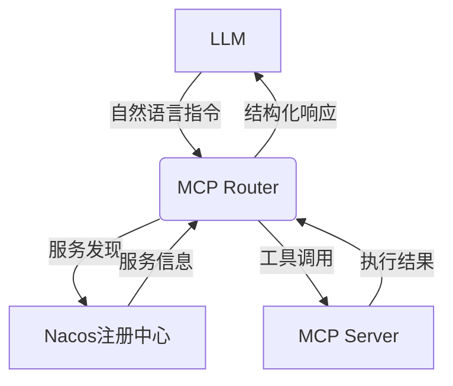
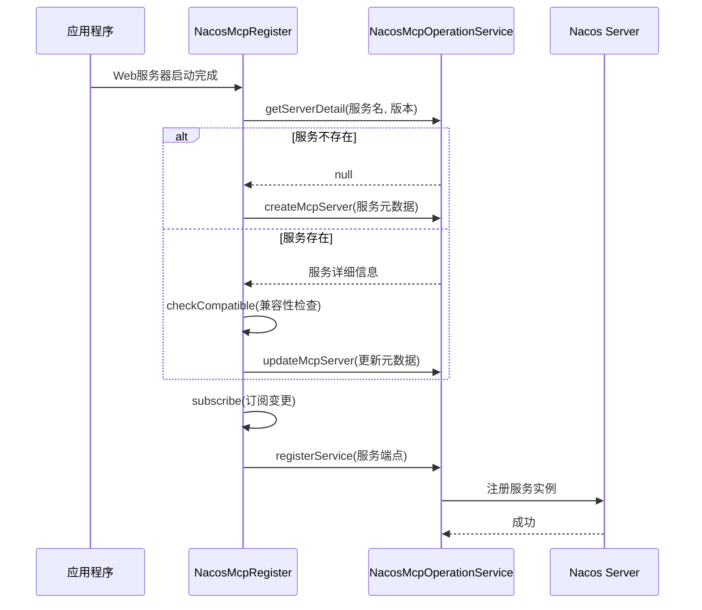
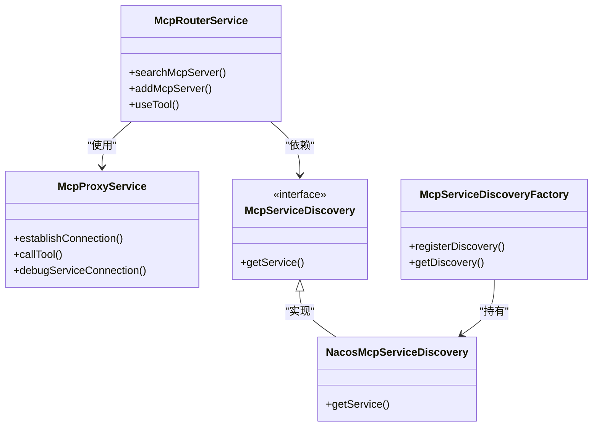
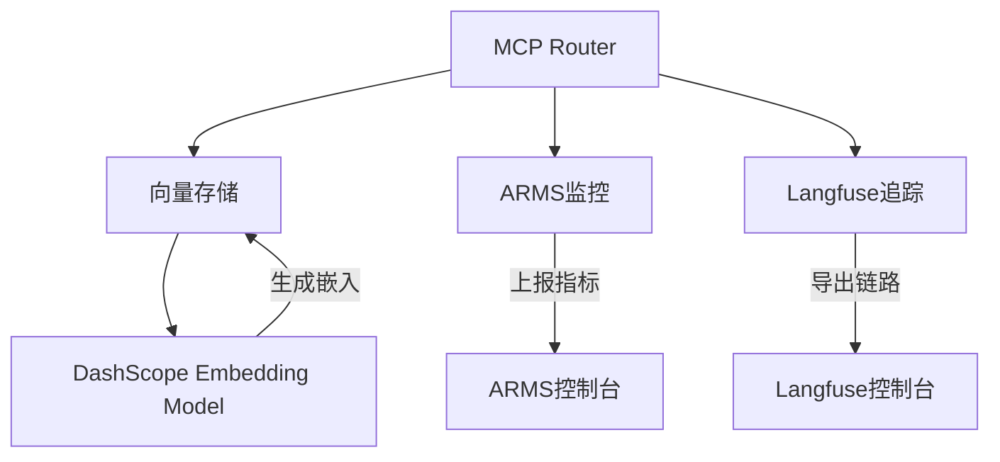

# MCP集成

<cite>
**本文档引用的文件**
- [NacosMcpProperties.java](file://spring-ai-alibaba-mcp/spring-ai-alibaba-mcp-common/src/main/java/com/alibaba/cloud/ai/mcp/nacos/NacosMcpProperties.java)
- [NacosMcpRegisterAutoConfiguration.java](file://auto-configurations/spring-ai-alibaba-autoconfigure-mcp-registry/src/main/java/com/alibaba/cloud/ai/autoconfigure/mcp/register/NacosMcpRegisterAutoConfiguration.java)
- [NacosMcpRegister.java](file://spring-ai-alibaba-mcp/spring-ai-alibaba-mcp-registry/src/main/java/com/alibaba/cloud/ai/mcp/register/NacosMcpRegister.java)
- [NacosMcpOperationService.java](file://spring-ai-alibaba-mcp/spring-ai-alibaba-mcp-common/src/main/java/com/alibaba/cloud/ai/mcp/nacos/service/NacosMcpOperationService.java)
- [NacosMcpRouterAutoConfiguration.java](file://auto-configurations/spring-ai-alibaba-autoconfigure-mcp-router/src/main/java/com/alibaba/cloud/ai/autoconfigure/mcp/router/NacosMcpRouterAutoConfiguration.java)
- [McpRouterService.java](file://spring-ai-alibaba-mcp/spring-ai-alibaba-mcp-router/src/main/java/com/alibaba/cloud/ai/mcp/router/service/McpRouterService.java)
- [McpGatewayToolDefinition.java](file://spring-ai-alibaba-mcp/spring-ai-alibaba-mcp-router/src/main/java/com/alibaba/cloud/ai/mcp/gateway/core/McpGatewayToolDefinition.java)
- [McpGatewayToolManager.java](file://spring-ai-alibaba-mcp/spring-ai-alibaba-mcp-router/src/main/java/com/alibaba/cloud/ai/mcp/gateway/core/McpGatewayToolManager.java)
- [NacosMcpGatewayToolCallback.java](file://spring-ai-alibaba-agent-nacos/src/main/java/com/alibaba/cloud/ai/agent/nacos/tools/NacosMcpGatewayToolCallback.java)
- [spring-configuration-metadata.json](file://auto-configurations/spring-ai-alibaba-autoconfigure-mcp-registry/src/main/resources/META-INF/spring-configuration-metadata.json)
</cite>

## 目录
1. [引言](#引言)
2. [核心概念](#核心概念)
3. [工具注册与发现](#工具注册与发现)
4. [服务路由与负载均衡](#服务路由与负载均衡)
5. [配置选项](#配置选项)
6. [端到端使用示例](#端到端使用示例)
7. [系统集成](#系统集成)
8. [故障排除指南](#故障排除指南)
9. [安全性考虑](#安全性考虑)
10. [结论](#结论)

## 引言

MCP（Model Control Protocol）集成文档旨在阐明MCP在统一管理外部工具和服务中的核心作用。本系统通过Nacos作为服务注册与发现中心，实现了MCP服务的自动化注册、发现和调用。MCP协议为大语言模型（LLM）与外部工具之间的交互提供了标准化接口，使得AI应用能够动态地发现和使用各种功能服务。

该集成方案主要由三个核心组件构成：`NacosMcpRegisterAutoConfiguration`负责将本地MCP服务注册到Nacos；`NacosMcpRouterAutoConfiguration`实现了服务的发现、路由和代理；`NacosMcpProperties`则提供了统一的配置管理。通过这种设计，系统实现了服务的动态编排和智能路由，极大地提升了AI应用的灵活性和可扩展性。

**Section sources**
- [NacosMcpRegisterAutoConfiguration.java](file://auto-configurations/spring-ai-alibaba-autoconfigure-mcp-registry/src/main/java/com/alibaba/cloud/ai/autoconfigure/mcp/register/NacosMcpRegisterAutoConfiguration.java)
- [NacosMcpRouterAutoConfiguration.java](file://auto-configurations/spring-ai-alibaba-autoconfigure-mcp-router/src/main/java/com/alibaba/cloud/ai/autoconfigure/mcp/router/NacosMcpRouterAutoConfiguration.java)

## 核心概念

MCP（Model Control Protocol）是一种用于连接大语言模型（LLM）与外部工具的标准化协议。其核心概念包括工具注册、服务发现和动态调用。

**工具注册**是MCP服务向Nacos注册中心声明自身存在和能力的过程。当一个MCP服务启动时，`NacosMcpRegister`组件会将其基本信息（如服务名称、版本、协议类型）和可用工具列表（包括工具名称、描述和输入参数模式）注册到Nacos。这使得服务能够被其他系统发现和使用。

**服务发现**是客户端查找和定位可用MCP服务的过程。`NacosMcpOperationService`提供了从Nacos获取服务详细信息的接口。客户端可以通过服务名称和版本号查询到服务的端点信息（IP地址和端口），从而建立连接。

**动态调用**是MCP的核心功能，允许LLM通过自然语言指令调用外部工具。`NacosMcpGatewayToolCallback`作为工具回调的实现，负责解析LLM的调用请求，通过Nacos发现目标服务，并使用MCP客户端协议（如SSE）与远程服务进行通信，最终将执行结果返回给LLM。



**Diagram sources**
- [NacosMcpRegister.java](file://spring-ai-alibaba-mcp/spring-ai-alibaba-mcp-registry/src/main/java/com/alibaba/cloud/ai/mcp/register/NacosMcpRegister.java)
- [NacosMcpOperationService.java](file://spring-ai-alibaba-mcp/spring-ai-alibaba-mcp-common/src/main/java/com/alibaba/cloud/ai/mcp/nacos/service/NacosMcpOperationService.java)
- [NacosMcpGatewayToolCallback.java](file://spring-ai-alibaba-agent-nacos/src/main/java/com/alibaba/cloud/ai/agent/nacos/tools/NacosMcpGatewayToolCallback.java)

## 工具注册与发现

MCP工具的注册与发现机制是系统动态性的基础，它确保了服务的可发现性和兼容性。

`NacosMcpRegisterAutoConfiguration`是服务注册的自动配置类。当应用启动时，它会根据配置条件（`spring.ai.alibaba.mcp.nacos.register.enabled=true`）创建`NacosMcpRegister`实例。该实例实现了`ApplicationListener<WebServerInitializedEvent>`接口，这意味着它会在Web服务器初始化完成后执行注册逻辑。

注册过程分为两个阶段：**服务元数据注册**和**服务端点注册**。首先，`NacosMcpRegister`通过`NacosMcpOperationService`的`createMcpServer`方法，将MCP服务的基本信息（名称、版本、描述）、工具规范（工具列表和输入模式）以及端点规范（协议类型和引用信息）注册到Nacos的AI维护者服务中。如果服务已存在，则会进行更新。



**Diagram sources**
- [NacosMcpRegister.java](file://spring-ai-alibaba-mcp/spring-ai-alibaba-mcp-registry/src/main/java/com/alibaba/cloud/ai/mcp/register/NacosMcpRegister.java)
- [NacosMcpOperationService.java](file://spring-ai-alibaba-mcp/spring-ai-alibaba-mcp-common/src/main/java/com/alibaba/cloud/ai/mcp/nacos/service/NacosMcpOperationService.java)

**Section sources**
- [NacosMcpRegisterAutoConfiguration.java](file://auto-configurations/spring-ai-alibaba-autoconfigure-mcp-registry/src/main/java/com/alibaba/cloud/ai/autoconfigure/mcp/register/NacosMcpRegisterAutoConfiguration.java)
- [NacosMcpRegister.java](file://spring-ai-alibaba-mcp/spring-ai-alibaba-mcp-registry/src/main/java/com/alibaba/cloud/ai/mcp/register/NacosMcpRegister.java)

## 服务路由与负载均衡

MCP服务路由与负载均衡由`NacosMcpRouterAutoConfiguration`和`McpRouterService`共同实现，为客户端提供了一个智能的、统一的访问入口。

`NacosMcpRouterAutoConfiguration`是路由功能的自动配置入口。它在应用启动时会创建`McpRouterService`、`McpProxyService`等核心组件。`McpRouterService`作为MCP路由器的核心服务，暴露了多个`@Tool`注解的方法，如`searchMcpServer`、`addMcpServer`和`useTool`，这些方法可以被LLM直接调用。

服务发现的核心是`McpServiceDiscovery`工厂模式。`NacosMcpRouterAutoConfiguration`通过`NacosMcpServiceDiscoveryRegistrar`将`NacosMcpServiceDiscovery`注册到`McpServiceDiscoveryFactory`中。当`McpRouterService`需要获取服务信息时，它会通过工厂获取Nacos发现器，从而从Nacos获取服务的详细配置。

负载均衡是通过Nacos客户端的`selectOneHealthyInstance`方法实现的。`McpProxyService`在代理工具调用时，会调用`NacosMcpOperationService`的`selectEndpoint`方法。该方法会根据服务引用（`McpServiceRef`）从Nacos的服务列表中选择一个健康的实例，从而实现了客户端的负载均衡。



**Diagram sources**
- [NacosMcpRouterAutoConfiguration.java](file://auto-configurations/spring-ai-alibaba-autoconfigure-mcp-router/src/main/java/com/alibaba/cloud/ai/autoconfigure/mcp/router/NacosMcpRouterAutoConfiguration.java)
- [McpRouterService.java](file://spring-ai-alibaba-mcp/spring-ai-alibaba-mcp-router/src/main/java/com/alibaba/cloud/ai/mcp/router/service/McpRouterService.java)
- [McpProxyService.java](file://spring-ai-alibaba-mcp/spring-ai-alibaba-mcp-router/src/main/java/com/alibaba/cloud/ai/mcp/router/service/McpProxyService.java)

**Section sources**
- [NacosMcpRouterAutoConfiguration.java](file://auto-configurations/spring-ai-alibaba-autoconfigure-mcp-router/src/main/java/com/alibaba/cloud/ai/autoconfigure/mcp/router/NacosMcpRouterAutoConfiguration.java)
- [McpRouterService.java](file://spring-ai-alibaba-mcp/spring-ai-alibaba-mcp-router/src/main/java/com/alibaba/cloud/ai/mcp/router/service/McpRouterService.java)

## 配置选项

MCP系统的配置通过`NacosMcpProperties`类集中管理，所有配置项均以`spring.ai.alibaba.mcp.nacos`为前缀。

**Nacos连接配置**定义了与Nacos服务器的连接信息：
- `server-addr`: Nacos服务器地址，默认为`localhost:8848`。
- `namespace`: Nacos命名空间，用于隔离不同环境的服务，默认为`public`。
- `username`/`password`: 用于Nacos基本认证的用户名和密码。
- `access-key`/`secret-key`: 用于Nacos AK/SK认证的密钥对。
- `endpoint`: Nacos的接入点地址，用于云环境。

**服务注册配置**（`spring.ai.alibaba.mcp.nacos.register.*`）控制MCP服务的注册行为：
- `enabled`: 是否启用服务注册，默认为`false`。
- `service-name`: 注册到Nacos的服务名称，如果未指定，则默认为`{mcpServerName}::{mcpServerVersion}`。
- `service-group`: 注册到Nacos的服务分组，默认为`DEFAULT_GROUP`。
- `sse-export-context-path`: SSE协议的导出上下文路径，默认为`/mcp`。

**客户端配置**（`spring.ai.alibaba.mcp.nacos.client.*`）用于配置MCP客户端：
- `enabled`: 是否启用MCP客户端功能。
- `sse.connections`: 定义SSE客户端连接的参数，包括目标服务的URL、超时时间等。

这些配置项通过`@ConfigurationProperties`注解绑定到相应的Java Bean中，并在自动配置类中被注入和使用。

**Section sources**
- [NacosMcpProperties.java](file://spring-ai-alibaba-mcp/spring-ai-alibaba-mcp-common/src/main/java/com/alibaba/cloud/ai/mcp/nacos/NacosMcpProperties.java)
- [spring-configuration-metadata.json](file://auto-configurations/spring-ai-alibaba-autoconfigure-mcp-registry/src/main/resources/META-INF/spring-configuration-metadata.json)

## 端到端使用示例

以下是一个完整的端到端使用示例，展示如何开发、注册一个MCP工具，并从另一个服务中发现和调用它。

**步骤1: 开发MCP服务**
首先，创建一个提供天气查询功能的MCP服务。在服务中定义一个`WeatherTool`，并使用`@Tool`注解暴露给MCP框架。

```java
@McpServer(name = "weather-service", version = "1.0.0")
public class WeatherMcpServer {
    
    @Tool(description = "根据城市名称查询当前天气")
    public String getWeather(@ToolParam(description = "城市名称") String city) {
        // 实现天气查询逻辑
        return "晴天，25°C";
    }
}
```

**步骤2: 注册MCP服务**
在服务的配置文件中启用MCP注册：
```yaml
spring:
  ai:
    mcp:
      server:
        enabled: true
    alibaba:
      mcp:
        nacos:
          server-addr: localhost:8848
          namespace: public
        register:
          enabled: true
          service-name: weather-mcp-service
          service-group: DEFAULT_GROUP
```
当服务启动时，`NacosMcpRegisterAutoConfiguration`会自动生效，将`WeatherMcpServer`及其`getWeather`工具注册到Nacos。

**步骤3: 发现和调用MCP服务**
在客户端应用中，使用`McpRouterService`来发现和调用远程服务。
```java
// 1. 搜索服务
McpServerSearchResponse searchResponse = mcpRouterService.searchMcpServer("查询天气", "weather", 5);

// 2. 添加并初始化服务
McpServerAddResponse addResponse = mcpRouterService.addMcpServer("weather-service");

// 3. 调用工具
McpToolExecutionResponse toolResponse = mcpRouterService.useTool(
    "weather-service", 
    "getWeather", 
    "{\"city\": \"北京\"}"
);

// 输出: "晴天，25°C"
System.out.println(toolResponse.getResult().getContent());
```

**Section sources**
- [NacosMcpRegisterAutoConfiguration.java](file://auto-configurations/spring-ai-alibaba-autoconfigure-mcp-registry/src/main/java/com/alibaba/cloud/ai/autoconfigure/mcp/register/NacosMcpRegisterAutoConfiguration.java)
- [McpRouterService.java](file://spring-ai-alibaba-mcp/spring-ai-alibaba-mcp-router/src/main/java/com/alibaba/cloud/ai/mcp/router/service/McpRouterService.java)

## 系统集成

MCP系统设计为可扩展的，能够与其他观测和追踪系统无缝集成。

**与ARMS观测集成**：`spring-ai-alibaba-autoconfigure-arms-observation`模块提供了与阿里云ARMS（Application Real-Time Monitoring Service）的集成。通过`ArmsAutoConfiguration`，MCP服务的调用可以被自动埋点，将关键指标（如调用延迟、成功率）上报到ARMS，实现对MCP服务性能的实时监控。

**与Langfuse追踪集成**：虽然项目中未直接包含Langfuse的集成代码，但MCP的设计遵循了OpenTelemetry标准。`McpTraceExchangeFilterFunction`组件可以用于在MCP客户端请求中注入追踪上下文。通过实现自定义的`TracingAutoConfiguration`，可以将MCP的调用链路信息导出到Langfuse等第三方追踪系统，实现端到端的调用链追踪。

**与向量存储集成**：`McpRouterService`使用`McpServerVectorStore`来存储和检索MCP服务的元数据。`SimpleMcpServerVectorStore`是一个基于嵌入模型的实现，它使用`DashScopeEmbeddingModel`将服务描述向量化，从而支持基于语义相似度的搜索。这使得LLM可以通过自然语言描述来发现最匹配的MCP服务，而不仅仅是精确的名称匹配。



**Diagram sources**
- [McpRouterService.java](file://spring-ai-alibaba-mcp/spring-ai-alibaba-mcp-router/src/main/java/com/alibaba/cloud/ai/mcp/router/service/McpRouterService.java)
- [ArmsAutoConfiguration.java](file://auto-configurations/spring-ai-alibaba-autoconfigure-arms-observation/src/main/java/com/alibaba/cloud/ai/autoconfigure/arms/ArmsAutoConfiguration.java)

## 故障排除指南

在使用MCP集成时，可能会遇到连接问题、序列化错误和超时异常等常见问题。以下是详细的故障排除指南。

**连接问题**：最常见的原因是Nacos服务不可达或服务未正确注册。
- **检查Nacos连接**：确认`spring.ai.alibaba.mcp.nacos.server-addr`配置正确，并且网络可达。
- **检查服务注册**：使用Nacos控制台检查MCP服务是否已注册。如果`NacosMcpRegister`的日志显示“Failed to register mcp server to nacos”，请检查Nacos的认证信息（用户名/密码或AK/SK）是否正确。
- **检查服务端点**：确保MCP服务的Web服务器已成功启动，并且端口未被占用。

**序列化错误**：通常发生在工具参数的JSON序列化/反序列化过程中。
- **检查输入模式**：确保工具的`@ToolParam`注解和输入参数的JSON结构匹配。
- **检查特殊字符**：避免在参数值中使用未转义的特殊字符。
- **查看日志**：`NacosMcpGatewayToolCallback`的日志会记录详细的输入和解析过程，有助于定位问题。

**超时异常**：当MCP服务响应过慢时会发生。
- **增加超时时间**：在`NacosSseParameters`中配置`readTimeout`和`connectTimeout`。
- **优化服务性能**：检查目标MCP服务的性能瓶颈。
- **使用调试工具**：调用`McpRouterService`的`debugMcpService`方法，它可以提供详细的连接诊断信息，包括端点可达性、HTTP状态码等。

**Section sources**
- [NacosMcpRegister.java](file://spring-ai-alibaba-mcp/spring-ai-alibaba-mcp-registry/src/main/java/com/alibaba/cloud/ai/mcp/register/NacosMcpRegister.java)
- [NacosMcpGatewayToolCallback.java](file://spring-ai-alibaba-agent-nacos/src/main/java/com/alibaba/cloud/ai/agent/nacos/tools/NacosMcpGatewayToolCallback.java)
- [McpRouterService.java](file://spring-ai-alibaba-mcp/spring-ai-alibaba-mcp-router/src/main/java/com/alibaba/cloud/ai/mcp/router/service/McpRouterService.java)

## 安全性考虑

MCP集成在设计时充分考虑了安全性，主要体现在认证授权和敏感信息保护两个方面。

**认证授权**：系统支持多种Nacos认证方式，确保只有授权的服务才能注册和发现。
- **基本认证**：通过`username`和`password`配置进行HTTP基本认证。
- **AK/SK认证**：通过`access-key`和`secret-key`进行更安全的密钥对认证，适用于云环境。
- **服务级权限**：Nacos的命名空间（`namespace`）和分组（`group`）可以用来实现服务的逻辑隔离，不同环境（开发、测试、生产）的服务可以部署在不同的命名空间中。

**敏感信息保护**：系统通过多种机制保护敏感信息。
- **配置加密**：建议将`password`、`secret-key`等敏感配置存储在加密的配置中心（如KMS）中，而不是明文写在配置文件里。
- **Nacos配置引用**：`NacosMcpGatewayToolCallback`支持`{{ ${nacos.dataId/group} }}`语法，允许工具参数从Nacos的配置中心动态获取，避免在代码中硬编码敏感信息。
- **HTTPS传输**：建议在生产环境中使用HTTPS协议，并在`McpServiceRef`中配置`transportProtocol=https`，以加密客户端与MCP服务之间的通信。

**Section sources**
- [NacosMcpProperties.java](file://spring-ai-alibaba-mcp/spring-ai-alibaba-mcp-common/src/main/java/com/alibaba/cloud/ai/mcp/nacos/NacosMcpProperties.java)
- [NacosMcpGatewayToolCallback.java](file://spring-ai-alibaba-agent-nacos/src/main/java/com/alibaba/cloud/ai/agent/nacos/tools/NacosMcpGatewayToolCallback.java)

## 结论

本文档详细阐述了Spring AI Alibaba项目中MCP（Model Control Protocol）集成的核心机制。通过`NacosMcpRegisterAutoConfiguration`，本地工具可以被自动注册为MCP服务；通过`NacosMcpRouterAutoConfiguration`，客户端可以实现智能的服务发现、路由和负载均衡。`NacosMcpProperties`提供了灵活的配置选项，使得系统能够适应不同的部署环境。

该集成方案成功地将MCP协议与Nacos服务发现能力相结合，为构建动态、可扩展的AI应用提供了一个强大的基础设施。开发者可以轻松地开发和注册新的工具服务，而LLM客户端则可以通过统一的`McpRouterService`接口发现和调用这些服务，极大地简化了AI应用的开发和维护。

未来，该系统可以通过增强与ARMS和Langfuse等观测系统的集成，提供更全面的监控和追踪能力，进一步提升系统的可观测性和可维护性。