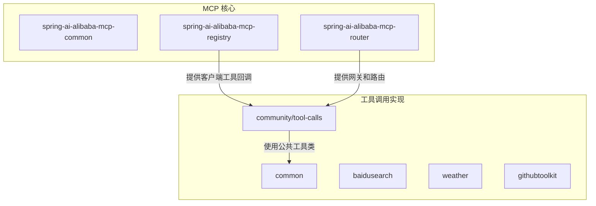
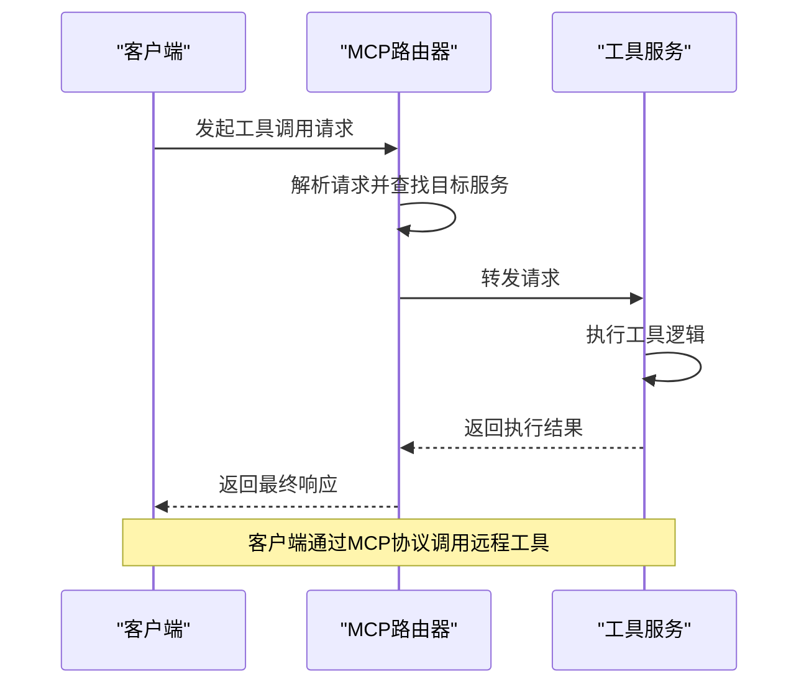
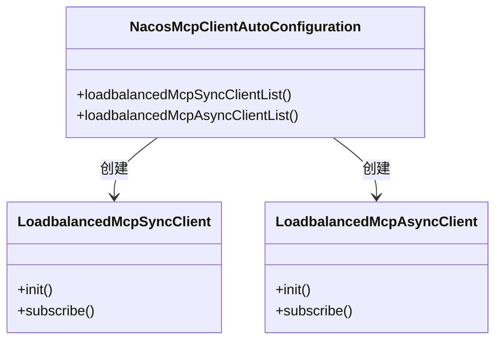
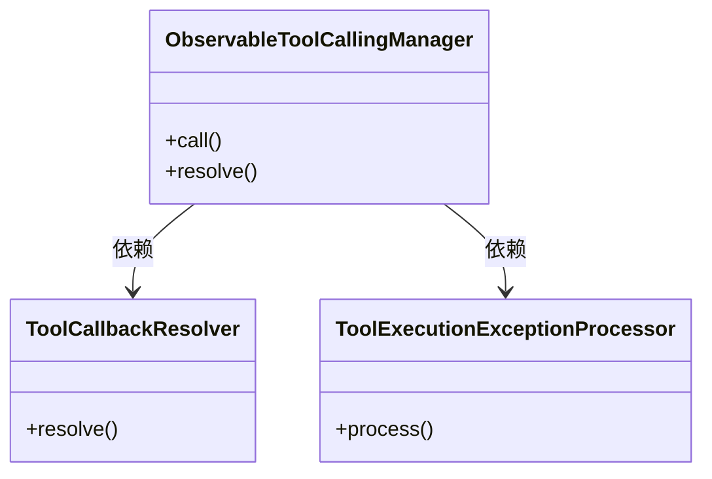
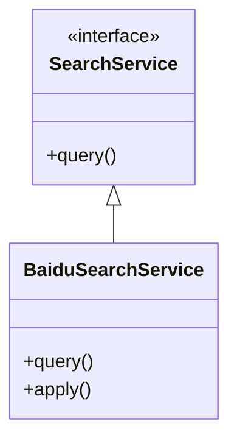
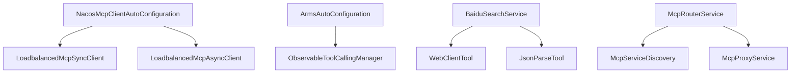

# 工具调用

<cite>
**本文档引用的文件**
- [McpTraceExchangeFilterFunction.java](file://spring-ai-alibaba-mcp/spring-ai-alibaba-mcp-common/src/main/java/com/alibaba/cloud/ai/mcp/common/tracing/McpTraceExchangeFilterFunction.java)
- [LoadbalancedAsyncMcpToolCallback.java](file://spring-ai-alibaba-mcp/spring-ai-alibaba-mcp-registry/src/main/java/com/alibaba/cloud/ai/mcp/discovery/client/tool/LoadbalancedAsyncMcpToolCallback.java)
- [McpGatewayToolManager.java](file://spring-ai-alibaba-mcp/spring-ai-alibaba-mcp-router/src/main/java/com/alibaba/cloud/ai/mcp/gateway/core/McpGatewayToolManager.java)
- [McpRouterService.java](file://spring-ai-alibaba-mcp/spring-ai-alibaba-mcp-router/src/main/java/com/alibaba/cloud/ai/mcp/router/service/McpRouterService.java)
- [McpGatewayToolsInitializer.java](file://spring-ai-alibaba-mcp/spring-ai-alibaba-mcp-router/src/main/java/com/alibaba/cloud/ai/mcp/gateway/core/McpGatewayToolsInitializer.java)
- [CommonToolCallAutoConfiguration.java](file://community/tool-calls/spring-ai-alibaba-starter-tool-calling-common/src/main/java/com/alibaba/cloud/ai/toolcalling/common/CommonToolCallAutoConfiguration.java)
- [WebClientTool.java](file://community/tool-calls/spring-ai-alibaba-starter-tool-calling-common/src/main/java/com/alibaba/cloud/ai/toolcalling/common/WebClientTool.java)
- [SearchService.java](file://community/tool-calls/spring-ai-alibaba-starter-tool-calling-common/src/main/java/com/alibaba/cloud/ai/toolcalling/common/interfaces/SearchService.java)
- [BaiduSearchService.java](file://community/tool-calls/spring-ai-alibaba-starter-tool-calling-baidusearch/src/main/java/com/alibaba/cloud/ai/toolcalling/baidusearch/BaiduSearchService.java)
- [NacosMcpClientAutoConfiguration.java](file://auto-configurations/spring-ai-alibaba-autoconfigure-mcp-registry/src/main/java/com/alibaba/cloud/ai/autoconfigure/mcp/client/NacosMcpClientAutoConfiguration.java)
- [ArmsAutoConfiguration.java](file://auto-configurations/spring-ai-alibaba-autoconfigure-arms-observation/src/main/java/com/alibaba/cloud/ai/autoconfigure/arms/ArmsAutoConfiguration.java)
</cite>

## 目录
1. [简介](#简介)
2. [项目结构](#项目结构)
3. [核心组件](#核心组件)
4. [架构概述](#架构概述)
5. [详细组件分析](#详细组件分析)
6. [依赖分析](#依赖分析)
7. [性能考虑](#性能考虑)
8. [故障排除指南](#故障排除指南)
9. [结论](#结论)

## 简介
本文档详细描述了如何通过MCP协议在Spring AI Alibaba框架中进行远程工具调用。文档涵盖了客户端调用远程工具的机制，具体工具服务（如SearchService）的接口定义和调用流程，以及ObservableToolCallingManager在管理工具调用生命周期中的作用。同时，文档还阐述了如何处理异步响应、超时和错误，提供了从发起搜索请求到接收并解析响应的端到端示例，并讨论了工具调用的安全性及利用ARMS观测和Langfuse追踪来监控性能和成功率的方法。

## 项目结构
本项目的工具调用功能主要分布在`spring-ai-alibaba-mcp`和`community/tool-calls`两个模块中。`spring-ai-alibaba-mcp`模块负责MCP协议的实现、服务发现、路由和网关功能，而`community/tool-calls`模块则包含了各种具体的工具调用实现，如百度搜索、天气查询等。

**Diagram sources**
- [McpTraceExchangeFilterFunction.java](file://spring-ai-alibaba-mcp/spring-ai-alibaba-mcp-common/src/main/java/com/alibaba/cloud/ai/mcp/common/tracing/McpTraceExchangeFilterFunction.java)
- [LoadbalancedAsyncMcpToolCallback.java](file://spring-ai-alibaba-mcp/spring-ai-alibaba-mcp-registry/src/main/java/com/alibaba/cloud/ai/mcp/discovery/client/tool/LoadbalancedAsyncMcpToolCallback.java)
- [McpGatewayToolManager.java](file://spring-ai-alibaba-mcp/spring-ai-alibaba-mcp-router/src/main/java/com/alibaba/cloud/ai/mcp/gateway/core/McpGatewayToolManager.java)

**Section sources**
- [McpTraceExchangeFilterFunction.java](file://spring-ai-alibaba-mcp/spring-ai-alibaba-mcp-common/src/main/java/com/alibaba/cloud/ai/mcp/common/tracing/McpTraceExchangeFilterFunction.java)
- [LoadbalancedAsyncMcpToolCallback.java](file://spring-ai-alibaba-mcp/spring-ai-alibaba-mcp-registry/src/main/java/com/alibaba/cloud/ai/mcp/discovery/client/tool/LoadbalancedAsyncMcpToolCallback.java)
- [McpGatewayToolManager.java](file://spring-ai-alibaba-mcp/spring-ai-alibaba-mcp-router/src/main/java/com/alibaba/cloud/ai/mcp/gateway/core/McpGatewayToolManager.java)

## 核心组件
本节将深入分析工具调用的核心组件，包括MCP协议的实现、工具调用的管理器以及具体的工具服务实现。

**Section sources**
- [McpRouterService.java](file://spring-ai-alibaba-mcp/spring-ai-alibaba-mcp-router/src/main/java/com/alibaba/cloud/ai/mcp/router/service/McpRouterService.java)
- [WebClientTool.java](file://community/tool-calls/spring-ai-alibaba-starter-tool-calling-common/src/main/java/com/alibaba/cloud/ai/toolcalling/common/WebClientTool.java)
- [SearchService.java](file://community/tool-calls/spring-ai-alibaba-starter-tool-calling-common/src/main/java/com/alibaba/cloud/ai/toolcalling/common/interfaces/SearchService.java)

## 架构概述
系统架构采用分层设计，客户端通过MCP协议与远程工具服务进行交互。MCP路由器负责服务发现和请求代理，而具体的工具调用由各个工具服务实现。

**Diagram sources**
- [McpRouterService.java](file://spring-ai-alibaba-mcp/spring-ai-alibaba-mcp-router/src/main/java/com/alibaba/cloud/ai/mcp/router/service/McpRouterService.java)
- [BaiduSearchService.java](file://community/tool-calls/spring-ai-alibaba-starter-tool-calling-baidusearch/src/main/java/com/alibaba/cloud/ai/toolcalling/baidusearch/BaiduSearchService.java)

## 详细组件分析
### MCP客户端配置
MCP客户端的自动配置类`NacosMcpClientAutoConfiguration`负责创建同步和异步的MCP客户端实例，这些实例用于与远程MCP服务器进行通信。

**Diagram sources**
- [NacosMcpClientAutoConfiguration.java](file://auto-configurations/spring-ai-alibaba-autoconfigure-mcp-registry/src/main/java/com/alibaba/cloud/ai/autoconfigure/mcp/client/NacosMcpClientAutoConfiguration.java)
- [LoadbalancedMcpSyncClient.java](file://spring-ai-alibaba-mcp/spring-ai-alibaba-mcp-registry/src/main/java/com/alibaba/cloud/ai/mcp/discovery/client/transport/LoadbalancedMcpSyncClient.java)
- [LoadbalancedMcpAsyncClient.java](file://spring-ai-alibaba-mcp/spring-ai-alibaba-mcp-registry/src/main/java/com/alibaba/cloud/ai/mcp/discovery/client/transport/LoadbalancedMcpAsyncClient.java)

**Section sources**
- [NacosMcpClientAutoConfiguration.java](file://auto-configurations/spring-ai-alibaba-autoconfigure-mcp-registry/src/main/java/com/alibaba/cloud/ai/autoconfigure/mcp/client/NacosMcpClientAutoConfiguration.java)

### 工具调用管理
`ObservableToolCallingManager`是工具调用的核心管理器，它负责调用前的准备、调用中的监控和调用后的结果处理。

**Diagram sources**
- [ArmsAutoConfiguration.java](file://auto-configurations/spring-ai-alibaba-autoconfigure-arms-observation/src/main/java/com/alibaba/cloud/ai/autoconfigure/arms/ArmsAutoConfiguration.java)
- [ObservableToolCallingManager.java](file://spring-ai-alibaba-core/src/main/java/com/alibaba/cloud/ai/tool/ObservableToolCallingManager.java)

**Section sources**
- [ArmsAutoConfiguration.java](file://auto-configurations/spring-ai-alibaba-autoconfigure-arms-observation/src/main/java/com/alibaba/cloud/ai/autoconfigure/arms/ArmsAutoConfiguration.java)

### 搜索服务实现
以`BaiduSearchService`为例，该服务实现了`SearchService`接口，提供了具体的搜索功能。

**Diagram sources**
- [SearchService.java](file://community/tool-calls/spring-ai-alibaba-starter-tool-calling-common/src/main/java/com/alibaba/cloud/ai/toolcalling/common/interfaces/SearchService.java)
- [BaiduSearchService.java](file://community/tool-calls/spring-ai-alibaba-starter-tool-calling-baidusearch/src/main/java/com/alibaba/cloud/ai/toolcalling/baidusearch/BaiduSearchService.java)

**Section sources**
- [BaiduSearchService.java](file://community/tool-calls/spring-ai-alibaba-starter-tool-calling-baidusearch/src/main/java/com/alibaba/cloud/ai/toolcalling/baidusearch/BaiduSearchService.java)

## 依赖分析
系统各组件之间的依赖关系如下图所示：

**Diagram sources**
- [NacosMcpClientAutoConfiguration.java](file://auto-configurations/spring-ai-alibaba-autoconfigure-mcp-registry/src/main/java/com/alibaba/cloud/ai/autoconfigure/mcp/client/NacosMcpClientAutoConfiguration.java)
- [ArmsAutoConfiguration.java](file://auto-configurations/spring-ai-alibaba-autoconfigure-arms-observation/src/main/java/com/alibaba/cloud/ai/autoconfigure/arms/ArmsAutoConfiguration.java)
- [BaiduSearchService.java](file://community/tool-calls/spring-ai-alibaba-starter-tool-calling-baidusearch/src/main/java/com/alibaba/cloud/ai/toolcalling/baidusearch/BaiduSearchService.java)
- [McpRouterService.java](file://spring-ai-alibaba-mcp/spring-ai-alibaba-mcp-router/src/main/java/com/alibaba/cloud/ai/mcp/router/service/McpRouterService.java)

**Section sources**
- [NacosMcpClientAutoConfiguration.java](file://auto-configurations/spring-ai-alibaba-autoconfigure-mcp-registry/src/main/java/com/alibaba/cloud/ai/autoconfigure/mcp/client/NacosMcpClientAutoConfiguration.java)
- [ArmsAutoConfiguration.java](file://auto-configurations/spring-ai-alibaba-autoconfigure-arms-observation/src/main/java/com/alibaba/cloud/ai/autoconfigure/arms/ArmsAutoConfiguration.java)
- [BaiduSearchService.java](file://community/tool-calls/spring-ai-alibaba-starter-tool-calling-baidusearch/src/main/java/com/alibaba/cloud/ai/toolcalling/baidusearch/BaiduSearchService.java)
- [McpRouterService.java](file://spring-ai-alibaba-mcp/spring-ai-alibaba-mcp-router/src/main/java/com/alibaba/cloud/ai/mcp/router/service/McpRouterService.java)

## 性能考虑
在工具调用过程中，应考虑以下性能因素：
- 使用异步调用以提高响应速度
- 合理设置超时时间以避免长时间等待
- 利用缓存减少重复请求
- 监控调用性能并进行优化

## 故障排除指南
当遇到工具调用问题时，可以参考以下步骤进行排查：
1. 检查MCP服务器是否正常运行
2. 验证网络连接是否畅通
3. 查看日志以获取详细的错误信息
4. 确认配置是否正确

**Section sources**
- [McpRouterService.java](file://spring-ai-alibaba-mcp/spring-ai-alibaba-mcp-router/src/main/java/com/alibaba/cloud/ai/mcp/router/service/McpRouterService.java)

## 结论
本文档详细介绍了Spring AI Alibaba框架中工具调用的实现机制。通过MCP协议，客户端可以方便地调用远程工具服务。系统提供了完善的工具调用管理、安全性和监控功能，确保了工具调用的可靠性和高效性。