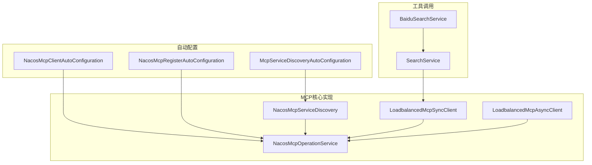
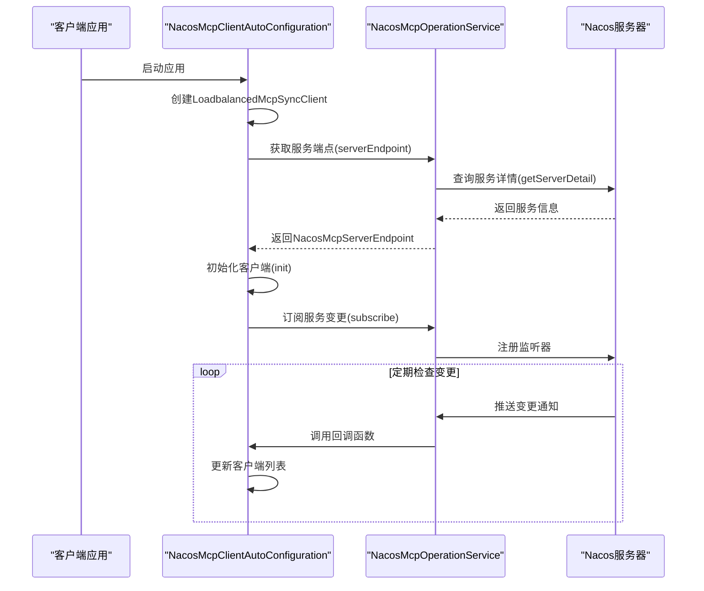
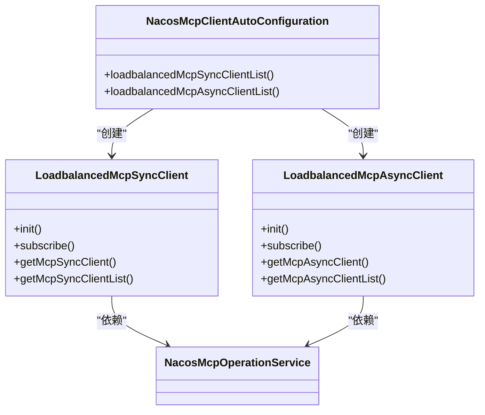
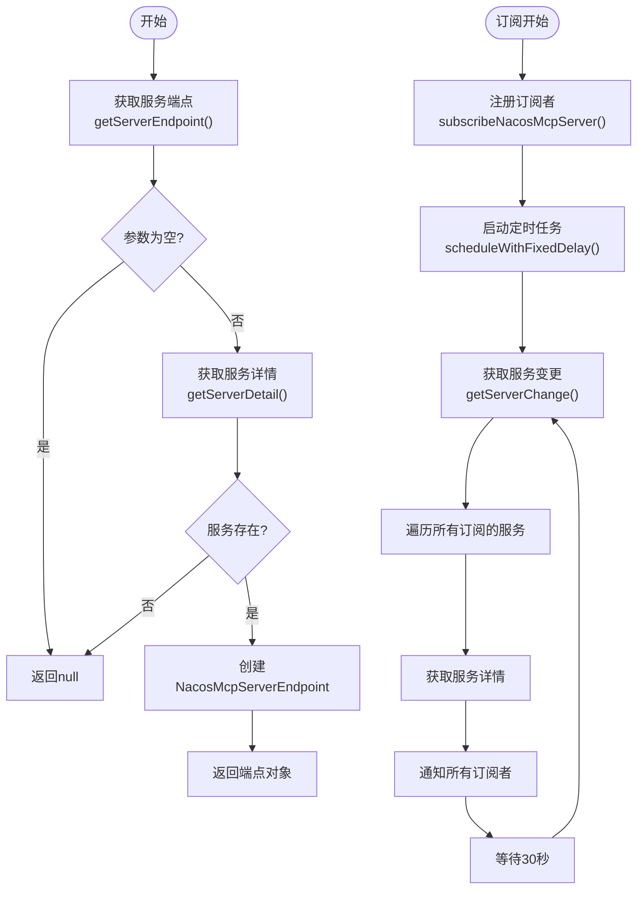
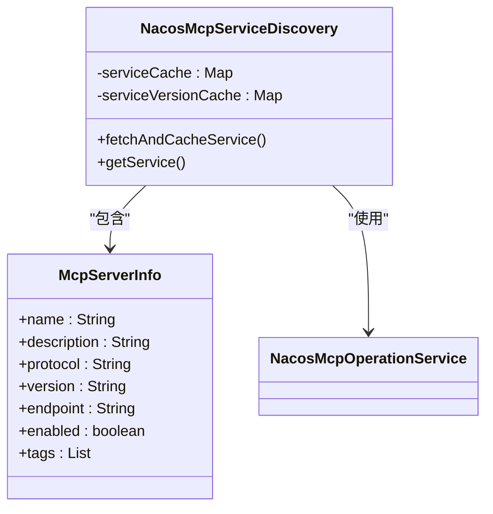
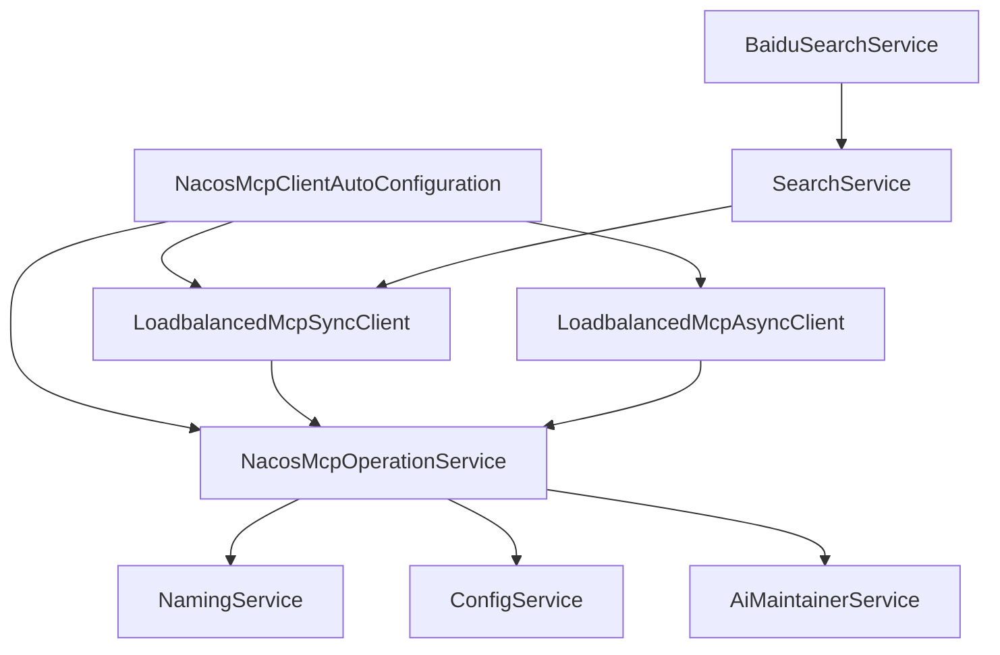

# 服务发现

<cite>
**本文档引用的文件**
- [NacosMcpClientAutoConfiguration.java](file://auto-configurations/spring-ai-alibaba-autoconfigure-mcp-registry/src/main/java/com/alibaba/cloud/ai/autoconfigure/mcp/client/NacosMcpClientAutoConfiguration.java)
- [NacosMcpOperationService.java](file://spring-ai-alibaba-mcp/spring-ai-alibaba-mcp-common/src/main/java/com/alibaba/cloud/ai/mcp/nacos/service/NacosMcpOperationService.java)
- [NacosMcpServiceDiscovery.java](file://spring-ai-alibaba-mcp/spring-ai-alibaba-mcp-router/src/main/java/com/alibaba/cloud/ai/mcp/router/nacos/NacosMcpServiceDiscovery.java)
- [LoadbalancedMcpSyncClient.java](file://spring-ai-alibaba-mcp/spring-ai-alibaba-mcp-registry/src/main/java/com/alibaba/cloud/ai/mcp/discovery/client/transport/LoadbalancedMcpSyncClient.java)
- [LoadbalancedMcpAsyncClient.java](file://spring-ai-alibaba-mcp/spring-ai-alibaba-mcp-registry/src/main/java/com/alibaba/cloud/ai/mcp/discovery/client/transport/LoadbalancedMcpAsyncClient.java)
- [NacosMcpProperties.java](file://spring-ai-alibaba-mcp/spring-ai-alibaba-mcp-common/src/main/java/com/alibaba/cloud/ai/mcp/nacos/NacosMcpProperties.java)
- [SearchService.java](file://community/tool-calls/spring-ai-alibaba-starter-tool-calling-common/src/main/java/com/alibaba/cloud/ai/toolcalling/common/interfaces/SearchService.java)
- [BaiduSearchService.java](file://community/tool-calls/spring-ai-alibaba-starter-tool-calling-baidusearch/src/main/java/com/alibaba/cloud/ai/toolcalling/baidusearch/BaiduSearchService.java)
</cite>

## 目录
1. [简介](#简介)
2. [项目结构](#项目结构)
3. [核心组件](#核心组件)
4. [架构概述](#架构概述)
5. [详细组件分析](#详细组件分析)
6. [依赖关系分析](#依赖关系分析)
7. [性能考虑](#性能考虑)
8. [故障排除指南](#故障排除指南)
9. [结论](#结论)

## 简介
本文档深入探讨了Spring AI Alibaba项目中的服务发现机制，重点介绍客户端如何动态发现可用的MCP（Model Context Protocol）服务。文档详细描述了`NacosMcpClientAutoConfiguration`的初始化流程，以及它如何创建和配置服务发现客户端。同时，深入分析了`NacosMcpRegister`的服务发现机制，包括服务列表获取、缓存策略和健康状态检查。此外，还说明了`SearchService`等工具服务如何利用服务发现来定位和调用远程工具，并提供实际代码示例展示如何编写客户端应用查询服务目录并选择合适的服务实例。最后，讨论了服务发现过程中的挑战及相应的容错和重试策略。

## 项目结构
本项目的结构围绕多个模块组织，主要分为自动配置、社区扩展、A2A通信、代理集成、MCP协议支持等部分。服务发现功能主要集中在`auto-configurations`和`spring-ai-alibaba-mcp`两个顶级目录下。

**图表来源**
- [NacosMcpClientAutoConfiguration.java](file://auto-configurations/spring-ai-alibaba-autoconfigure-mcp-registry/src/main/java/com/alibaba/cloud/ai/autoconfigure/mcp/client/NacosMcpClientAutoConfiguration.java)
- [NacosMcpOperationService.java](file://spring-ai-alibaba-mcp/spring-ai-alibaba-mcp-common/src/main/java/com/alibaba/cloud/ai/mcp/nacos/service/NacosMcpOperationService.java)
- [NacosMcpServiceDiscovery.java](file://spring-ai-alibaba-mcp/spring-ai-alibaba-mcp-router/src/main/java/com/alibaba/cloud/ai/mcp/router/nacos/NacosMcpServiceDiscovery.java)
- [LoadbalancedMcpSyncClient.java](file://spring-ai-alibaba-mcp/spring-ai-alibaba-mcp-registry/src/main/java/com/alibaba/cloud/ai/mcp/discovery/client/transport/LoadbalancedMcpSyncClient.java)
- [SearchService.java](file://community/tool-calls/spring-ai-alibaba-starter-tool-calling-common/src/main/java/com/alibaba/cloud/ai/toolcalling/common/interfaces/SearchService.java)
- [BaiduSearchService.java](file://community/tool-calls/spring-ai-alibaba-starter-tool-calling-baidusearch/src/main/java/com/alibaba/cloud/ai/toolcalling/baidusearch/BaiduSearchService.java)

**章节来源**
- [NacosMcpClientAutoConfiguration.java](file://auto-configurations/spring-ai-alibaba-autoconfigure-mcp-registry/src/main/java/com/alibaba/cloud/ai/autoconfigure/mcp/client/NacosMcpClientAutoConfiguration.java)
- [NacosMcpOperationService.java](file://spring-ai-alibaba-mcp/spring-ai-alibaba-mcp-common/src/main/java/com/alibaba/cloud/ai/mcp/nacos/service/NacosMcpOperationService.java)

## 核心组件
本系统的核心组件包括服务发现客户端配置器、Nacos操作服务、服务发现实现和服务端点负载均衡客户端。这些组件协同工作，实现了动态服务发现和调用的功能。

**章节来源**
- [NacosMcpClientAutoConfiguration.java](file://auto-configurations/spring-ai-alibaba-autoconfigure-mcp-registry/src/main/java/com/alibaba/cloud/ai/autoconfigure/mcp/client/NacosMcpClientAutoConfiguration.java)
- [NacosMcpOperationService.java](file://spring-ai-alibaba-mcp/spring-ai-alibaba-mcp-common/src/main/java/com/alibaba/cloud/ai/mcp/nacos/service/NacosMcpOperationService.java)
- [NacosMcpServiceDiscovery.java](file://spring-ai-alibaba-mcp/spring-ai-alibaba-mcp-router/src/main/java/com/alibaba/cloud/ai/mcp/router/nacos/NacosMcpServiceDiscovery.java)

## 架构概述
整个服务发现系统的架构基于Spring Boot自动配置和Nacos注册中心。客户端通过`NacosMcpClientAutoConfiguration`进行初始化，创建并配置服务发现所需的各个组件。`NacosMcpOperationService`作为与Nacos交互的核心服务，负责获取服务信息、订阅变更等操作。`NacosMcpServiceDiscovery`实现了具体的服务发现逻辑，而`LoadbalancedMcpSyncClient`和`LoadbalancedMcpAsyncClient`则提供了同步和异步两种方式来调用远程MCP服务。

**图表来源**
- [NacosMcpClientAutoConfiguration.java](file://auto-configurations/spring-ai-alibaba-autoconfigure-mcp-registry/src/main/java/com/alibaba/cloud/ai/autoconfigure/mcp/client/NacosMcpClientAutoConfiguration.java)
- [NacosMcpOperationService.java](file://spring-ai-alibaba-mcp/spring-ai-alibaba-mcp-common/src/main/java/com/alibaba/cloud/ai/mcp/nacos/service/NacosMcpOperationService.java)

## 详细组件分析

### NacosMcpClientAutoConfiguration 分析
`NacosMcpClientAutoConfiguration`是服务发现客户端的自动配置类，负责创建和配置同步和异步的MCP客户端。

#### 配置类结构

**图表来源**
- [NacosMcpClientAutoConfiguration.java](file://auto-configurations/spring-ai-alibaba-autoconfigure-mcp-registry/src/main/java/com/alibaba/cloud/ai/autoconfigure/mcp/client/NacosMcpClientAutoConfiguration.java)
- [LoadbalancedMcpSyncClient.java](file://spring-ai-alibaba-mcp/spring-ai-alibaba-mcp-registry/src/main/java/com/alibaba/cloud/ai/mcp/discovery/client/transport/LoadbalancedMcpSyncClient.java)
- [LoadbalancedMcpAsyncClient.java](file://spring-ai-alibaba-mcp/spring-ai-alibaba-mcp-registry/src/main/java/com/alibaba/cloud/ai/mcp/discovery/client/transport/LoadbalancedMcpAsyncClient.java)

**章节来源**
- [NacosMcpClientAutoConfiguration.java](file://auto-configurations/spring-ai-alibaba-autoconfigure-mcp-registry/src/main/java/com/alibaba/cloud/ai/autoconfigure/mcp/client/NacosMcpClientAutoConfiguration.java)

### NacosMcpOperationService 分析
`NacosMcpOperationService`是与Nacos交互的核心服务类，封装了所有与服务发现相关的操作。

#### 服务发现流程

**图表来源**
- [NacosMcpOperationService.java](file://spring-ai-alibaba-mcp/spring-ai-alibaba-mcp-common/src/main/java/com/alibaba/cloud/ai/mcp/nacos/service/NacosMcpOperationService.java)

**章节来源**
- [NacosMcpOperationService.java](file://spring-ai-alibaba-mcp/spring-ai-alibaba-mcp-common/src/main/java/com/alibaba/cloud/ai/mcp/nacos/service/NacosMcpOperationService.java)

### NacosMcpServiceDiscovery 分析
`NacosMcpServiceDiscovery`实现了MCP服务发现接口，提供了服务获取和缓存功能。

#### 缓存机制

**图表来源**
- [NacosMcpServiceDiscovery.java](file://spring-ai-alibaba-mcp/spring-ai-alibaba-mcp-router/src/main/java/com/alibaba/cloud/ai/mcp/router/nacos/NacosMcpServiceDiscovery.java)
- [McpServerInfo.java](file://spring-ai-alibaba-mcp/spring-ai-alibaba-mcp-router/src/main/java/com/alibaba/cloud/ai/mcp/router/model/McpServerInfo.java)

**章节来源**
- [NacosMcpServiceDiscovery.java](file://spring-ai-alibaba-mcp/spring-ai-alibaba-mcp-router/src/main/java/com/alibaba/cloud/ai/mcp/router/nacos/NacosMcpServiceDiscovery.java)

## 依赖关系分析
通过对代码库的分析，可以清晰地看到各组件之间的依赖关系。`NacosMcpClientAutoConfiguration`依赖于`NacosMcpOperationService`来获取服务信息，而`NacosMcpOperationService`又依赖于Nacos客户端API进行实际的服务发现操作。

**图表来源**
- [NacosMcpClientAutoConfiguration.java](file://auto-configurations/spring-ai-alibaba-autoconfigure-mcp-registry/src/main/java/com/alibaba/cloud/ai/autoconfigure/mcp/client/NacosMcpClientAutoConfiguration.java)
- [NacosMcpOperationService.java](file://spring-ai-alibaba-mcp/spring-ai-alibaba-mcp-common/src/main/java/com/alibaba/cloud/ai/mcp/nacos/service/NacosMcpOperationService.java)
- [LoadbalancedMcpSyncClient.java](file://spring-ai-alibaba-mcp/spring-ai-alibaba-mcp-registry/src/main/java/com/alibaba/cloud/ai/mcp/discovery/client/transport/LoadbalancedMcpSyncClient.java)
- [SearchService.java](file://community/tool-calls/spring-ai-alibaba-starter-tool-calling-common/src/main/java/com/alibaba/cloud/ai/toolcalling/common/interfaces/SearchService.java)
- [BaiduSearchService.java](file://community/tool-calls/spring-ai-alibaba-starter-tool-calling-baidusearch/src/main/java/com/alibaba/cloud/ai/toolcalling/baidusearch/BaiduSearchService.java)

**章节来源**
- [NacosMcpClientAutoConfiguration.java](file://auto-configurations/spring-ai-alibaba-autoconfigure-mcp-registry/src/main/java/com/alibaba/cloud/ai/autoconfigure/mcp/client/NacosMcpClientAutoConfiguration.java)
- [NacosMcpOperationService.java](file://spring-ai-alibaba-mcp/spring-ai-alibaba-mcp-common/src/main/java/com/alibaba/cloud/ai/mcp/nacos/service/NacosMcpOperationService.java)

## 性能考虑
在服务发现过程中，性能是一个关键因素。系统通过多种机制来优化性能：

1. **本地缓存**: `NacosMcpServiceDiscovery`使用ConcurrentHashMap对服务信息进行缓存，避免频繁调用远程服务。
2. **定期轮询**: `NacosMcpOperationService`使用ScheduledThreadPoolExecutor每30秒检查一次服务变更，平衡了实时性和性能开销。
3. **连接复用**: `LoadbalancedMcpSyncClient`和`LoadbalancedMcpAsyncClient`在初始化时创建客户端实例，并在整个生命周期内复用。
4. **异步处理**: 提供了异步客户端选项，允许非阻塞的服务调用。

这些设计决策确保了服务发现在高并发场景下的稳定性和响应性。

## 故障排除指南
在使用服务发现功能时可能会遇到一些常见问题，以下是相应的解决方案：

**章节来源**
- [NacosMcpOperationService.java](file://spring-ai-alibaba-mcp/spring-ai-alibaba-mcp-common/src/main/java/com/alibaba/cloud/ai/mcp/nacos/service/NacosMcpOperationService.java)
- [LoadbalancedMcpSyncClient.java](file://spring-ai-alibaba-mcp/spring-ai-alibaba-mcp-registry/src/main/java/com/alibaba/cloud/ai/mcp/discovery/client/transport/LoadbalancedMcpSyncClient.java)

### 常见问题及解决方案
| 问题现象 | 可能原因 | 解决方案 |
|--------|--------|--------|
| 无法找到服务 | 服务未正确注册到Nacos | 检查`NacosMcpRegisterAutoConfiguration`配置，确认服务已成功注册 |
| 服务调用超时 | 网络分区或DNS解析问题 | 检查网络连接，验证Nacos服务器地址可达性 |
| 服务列表过期 | 缓存更新延迟 | 确认`getServerChange`定时任务正常运行，检查日志中的错误信息 |
| 认证失败 | Nacos凭据配置错误 | 验证`NacosMcpProperties`中的username/password/accessKey/secretKey配置 |

## 结论
本文档全面介绍了Spring AI Alibaba项目中的服务发现机制。通过`NacosMcpClientAutoConfiguration`的自动配置，系统能够动态发现和调用MCP服务。`NacosMcpOperationService`作为核心服务，提供了与Nacos交互的所有必要功能，包括服务查询、订阅和健康检查。`NacosMcpServiceDiscovery`实现了高效的缓存机制，减少了对远程服务的频繁调用。工具服务如`SearchService`可以通过这些机制轻松集成和调用远程服务。整体设计充分考虑了性能、可靠性和易用性，为构建分布式AI应用提供了坚实的基础。