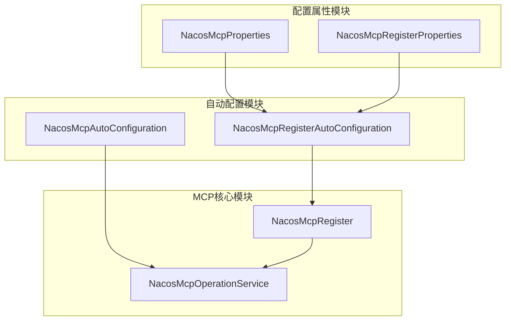
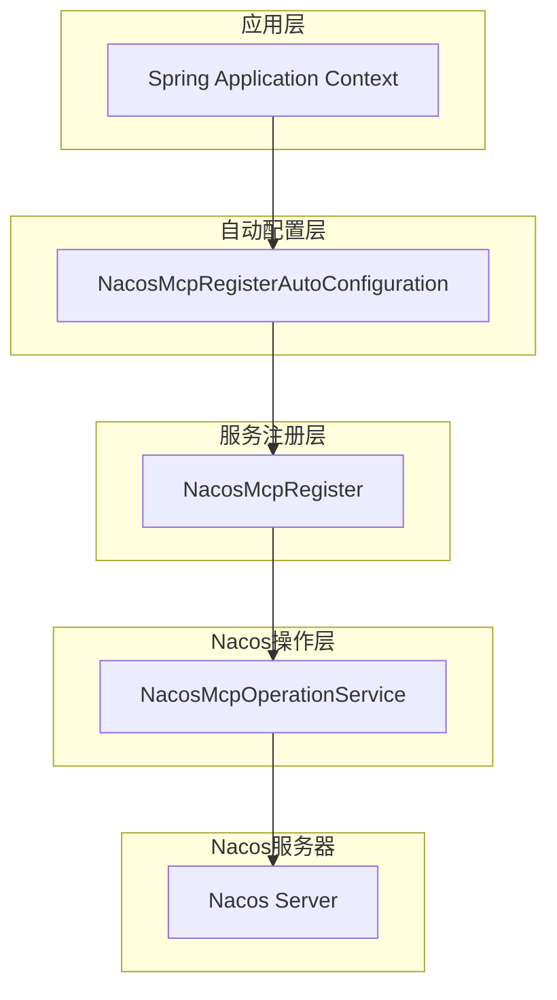
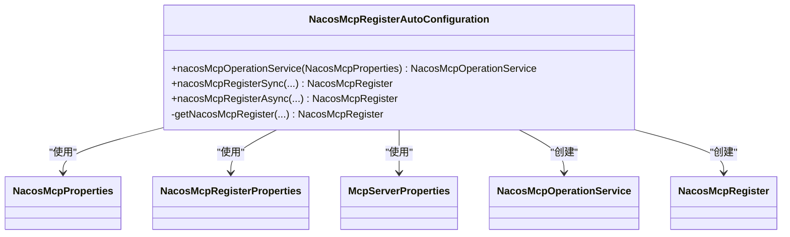
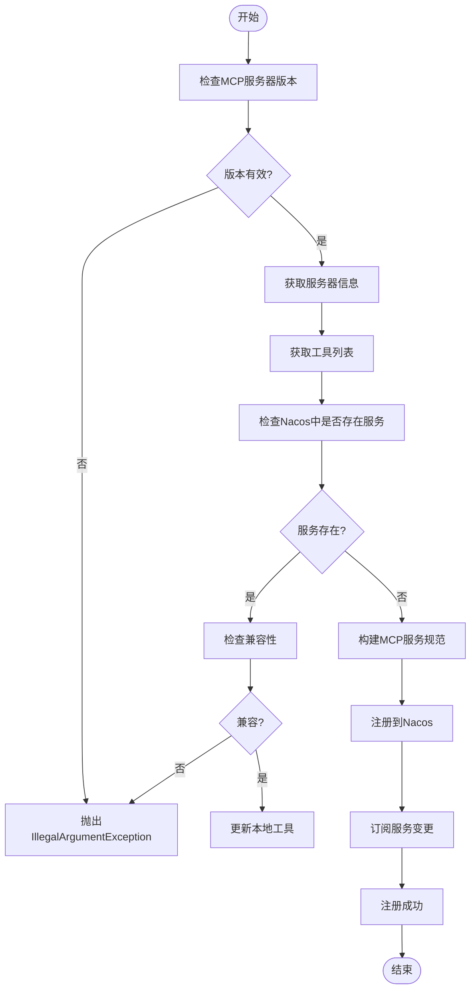
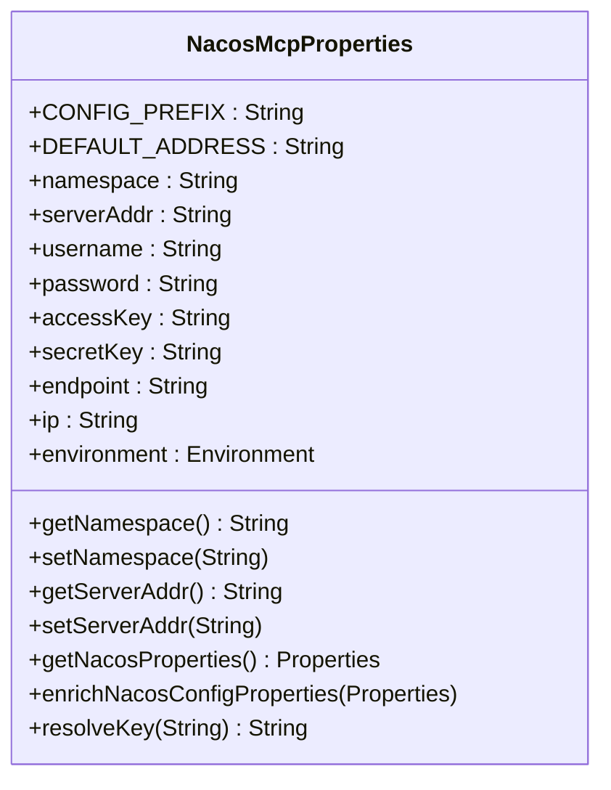
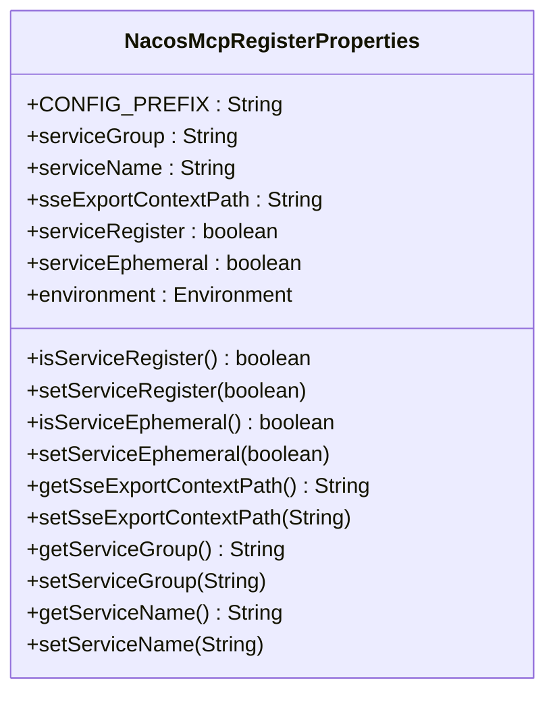
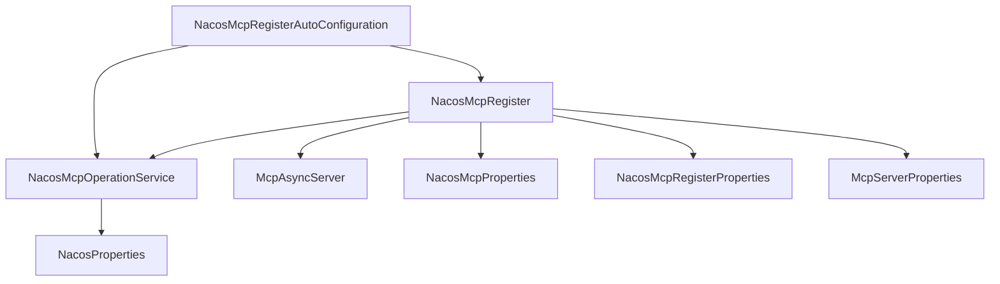

# 服务注册

<cite>
**本文档引用的文件**  
- [NacosMcpRegisterAutoConfiguration.java](file://auto-configurations/spring-ai-alibaba-autoconfigure-mcp-registry/src/main/java/com/alibaba/cloud/ai/autoconfigure/mcp/register/NacosMcpRegisterAutoConfiguration.java)
- [NacosMcpRegister.java](file://spring-ai-alibaba-mcp/spring-ai-alibaba-mcp-registry/src/main/java/com/alibaba/cloud/ai/mcp/register/NacosMcpRegister.java)
- [NacosMcpProperties.java](file://spring-ai-alibaba-mcp/spring-ai-alibaba-mcp-common/src/main/java/com/alibaba/cloud/ai/mcp/nacos/NacosMcpProperties.java)
- [NacosMcpRegisterProperties.java](file://spring-ai-alibaba-mcp/spring-ai-alibaba-mcp-registry/src/main/java/com/alibaba/cloud/ai/mcp/register/NacosMcpRegisterProperties.java)
</cite>

## 目录
1. [简介](#简介)
2. [项目结构](#项目结构)
3. [核心组件](#核心组件)
4. [架构概述](#架构概述)
5. [详细组件分析](#详细组件分析)
6. [依赖分析](#依赖分析)
7. [性能考虑](#性能考虑)
8. [故障排除指南](#故障排除指南)
9. [结论](#结论)

## 简介
本文档详细阐述了如何将本地工具暴露为MCP服务，重点介绍NacosMcpRegisterAutoConfiguration的自动装配机制及其与Spring容器的集成方式。深入分析NacosMcpRegister的实现细节，包括服务元数据的构建、序列化和在Nacos中的注册过程。说明NacosMcpProperties中各项配置参数的具体作用和最佳实践，并提供具体的代码示例展示服务注册方法。

## 项目结构
本项目的MCP服务注册功能主要分布在auto-configurations和spring-ai-alibaba-mcp模块中，通过Spring Boot自动配置机制实现服务的自动发现和注册。

**图源**
- [NacosMcpRegisterAutoConfiguration.java](file://auto-configurations/spring-ai-alibaba-autoconfigure-mcp-registry/src/main/java/com/alibaba/cloud/ai/autoconfigure/mcp/register/NacosMcpRegisterAutoConfiguration.java)
- [NacosMcpRegister.java](file://spring-ai-alibaba-mcp/spring-ai-alibaba-mcp-registry/src/main/java/com/alibaba/cloud/ai/mcp/register/NacosMcpRegister.java)
- [NacosMcpProperties.java](file://spring-ai-alibaba-mcp/spring-ai-alibaba-mcp-common/src/main/java/com/alibaba/cloud/ai/mcp/nacos/NacosMcpProperties.java)

**章节来源**
- [NacosMcpRegisterAutoConfiguration.java](file://auto-configurations/spring-ai-alibaba-autoconfigure-mcp-registry/src/main/java/com/alibaba/cloud/ai/autoconfigure/mcp/register/NacosMcpRegisterAutoConfiguration.java)
- [NacosMcpRegister.java](file://spring-ai-alibaba-mcp/spring-ai-alibaba-mcp-registry/src/main/java/com/alibaba/cloud/ai/mcp/register/NacosMcpRegister.java)

## 核心组件
核心组件包括NacosMcpRegisterAutoConfiguration（自动配置类）、NacosMcpRegister（服务注册器）、NacosMcpOperationService（Nacos操作服务）以及相关的配置属性类。这些组件协同工作，实现了MCP服务在Nacos中的自动注册和管理。

**章节来源**
- [NacosMcpRegisterAutoConfiguration.java](file://auto-configurations/spring-ai-alibaba-autoconfigure-mcp-registry/src/main/java/com/alibaba/cloud/ai/autoconfigure/mcp/register/NacosMcpRegisterAutoConfiguration.java)
- [NacosMcpRegister.java](file://spring-ai-alibaba-mcp/spring-ai-alibaba-mcp-registry/src/main/java/com/alibaba/cloud/ai/mcp/register/NacosMcpRegister.java)

## 架构概述
系统采用分层架构设计，上层为自动配置层，负责条件化地创建和注入必要的Bean；中间层为服务注册层，负责具体的注册逻辑；底层为Nacos操作层，负责与Nacos服务器进行通信。

**图源**
- [NacosMcpRegisterAutoConfiguration.java](file://auto-configurations/spring-ai-alibaba-autoconfigure-mcp-registry/src/main/java/com/alibaba/cloud/ai/autoconfigure/mcp/register/NacosMcpRegisterAutoConfiguration.java)
- [NacosMcpRegister.java](file://spring-ai-alibaba-mcp/spring-ai-alibaba-mcp-registry/src/main/java/com/alibaba/cloud/ai/mcp/register/NacosMcpRegister.java)

## 详细组件分析

### NacosMcpRegisterAutoConfiguration 分析
该自动配置类是MCP服务注册的入口点，通过Spring Boot的自动配置机制，在满足特定条件时自动创建并注册相关Bean。

#### 自动装配机制

**图源**
- [NacosMcpRegisterAutoConfiguration.java](file://auto-configurations/spring-ai-alibaba-autoconfigure-mcp-registry/src/main/java/com/alibaba/cloud/ai/autoconfigure/mcp/register/NacosMcpRegisterAutoConfiguration.java)

**章节来源**
- [NacosMcpRegisterAutoConfiguration.java](file://auto-configurations/spring-ai-alibaba-autoconfigure-mcp-registry/src/main/java/com/alibaba/cloud/ai/autoconfigure/mcp/register/NacosMcpRegisterAutoConfiguration.java)

### NacosMcpRegister 实现分析
NacosMcpRegister是服务注册的核心实现类，负责处理MCP服务在Nacos中的注册、更新和订阅逻辑。

#### 服务注册流程

**图源**
- [NacosMcpRegister.java](file://spring-ai-alibaba-mcp/spring-ai-alibaba-mcp-registry/src/main/java/com/alibaba/cloud/ai/mcp/register/NacosMcpRegister.java)

**章节来源**
- [NacosMcpRegister.java](file://spring-ai-alibaba-mcp/spring-ai-alibaba-mcp-registry/src/main/java/com/alibaba/cloud/ai/mcp/register/NacosMcpRegister.java)

### 配置属性分析
#### NacosMcpProperties 配置
该类定义了连接Nacos服务器所需的基本配置参数。

**图源**
- [NacosMcpProperties.java](file://spring-ai-alibaba-mcp/spring-ai-alibaba-mcp-common/src/main/java/com/alibaba/cloud/ai/mcp/nacos/NacosMcpProperties.java)

**章节来源**
- [NacosMcpProperties.java](file://spring-ai-alibaba-mcp/spring-ai-alibaba-mcp-common/src/main/java/com/alibaba/cloud/ai/mcp/nacos/NacosMcpProperties.java)

#### NacosMcpRegisterProperties 配置
该类定义了MCP服务注册相关的配置参数。

**图源**
- [NacosMcpRegisterProperties.java](file://spring-ai-alibaba-mcp/spring-ai-alibaba-mcp-registry/src/main/java/com/alibaba/cloud/ai/mcp/register/NacosMcpRegisterProperties.java)

**章节来源**
- [NacosMcpRegisterProperties.java](file://spring-ai-alibaba-mcp/spring-ai-alibaba-mcp-registry/src/main/java/com/alibaba/cloud/ai/mcp/register/NacosMcpRegisterProperties.java)

## 依赖分析
系统各组件之间的依赖关系清晰，遵循了依赖倒置原则，高层模块依赖于抽象而非具体实现。

**图源**
- [NacosMcpRegisterAutoConfiguration.java](file://auto-configurations/spring-ai-alibaba-autoconfigure-mcp-registry/src/main/java/com/alibaba/cloud/ai/autoconfigure/mcp/register/NacosMcpRegisterAutoConfiguration.java)
- [NacosMcpRegister.java](file://spring-ai-alibaba-mcp/spring-ai-alibaba-mcp-registry/src/main/java/com/alibaba/cloud/ai/mcp/register/NacosMcpRegister.java)

**章节来源**
- [NacosMcpRegisterAutoConfiguration.java](file://auto-configurations/spring-ai-alibaba-autoconfigure-mcp-registry/src/main/java/com/alibaba/cloud/ai/autoconfigure/mcp/register/NacosMcpRegisterAutoConfiguration.java)
- [NacosMcpRegister.java](file://spring-ai-alibaba-mcp/spring-ai-alibaba-mcp-registry/src/main/java/com/alibaba/cloud/ai/mcp/register/NacosMcpRegister.java)

## 性能考虑
服务注册过程中的性能考虑主要包括：
1. 使用CopyOnWriteArrayList保证工具列表的线程安全
2. 在注册前进行兼容性检查，避免不必要的网络调用
3. 采用异步事件监听机制处理Web服务器初始化后的端点注册
4. 缓存Nacos连接配置，减少重复创建开销

## 故障排除指南
### 常见问题及解决方案
1. **注册失败**: 检查Nacos服务器地址、端口、命名空间等配置是否正确
2. **元数据不完整**: 确保McpServerProperties中设置了正确的版本号和描述信息
3. **服务冲突**: 检查服务名称和版本号是否与其他服务冲突
4. **连接超时**: 调整Nacos客户端超时配置或检查网络连通性

**章节来源**
- [NacosMcpRegister.java](file://spring-ai-alibaba-mcp/spring-ai-alibaba-mcp-registry/src/main/java/com/alibaba/cloud/ai/mcp/register/NacosMcpRegister.java)
- [NacosMcpProperties.java](file://spring-ai-alibaba-mcp/spring-ai-alibaba-mcp-common/src/main/java/com/alibaba/cloud/ai/mcp/nacos/NacosMcpProperties.java)

## 结论
本文档详细介绍了MCP服务注册的实现机制，包括自动配置、服务注册、配置管理等方面。通过NacosMcpRegisterAutoConfiguration和NacosMcpRegister的协同工作，实现了MCP服务的自动化注册和管理，为微服务架构下的服务发现提供了可靠的支持。