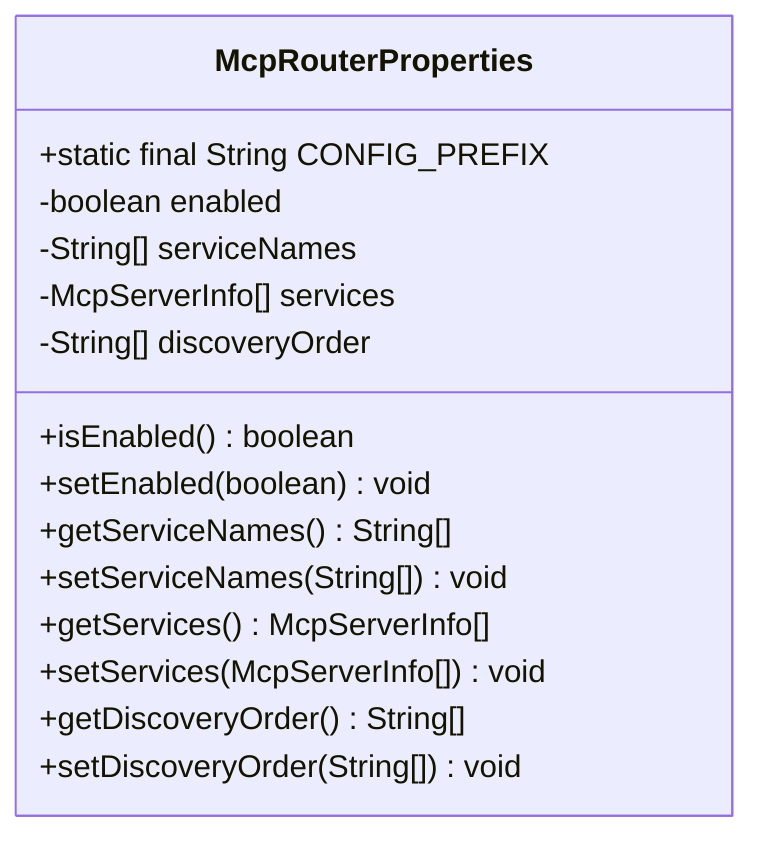
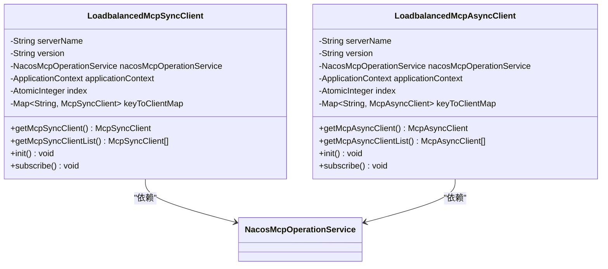
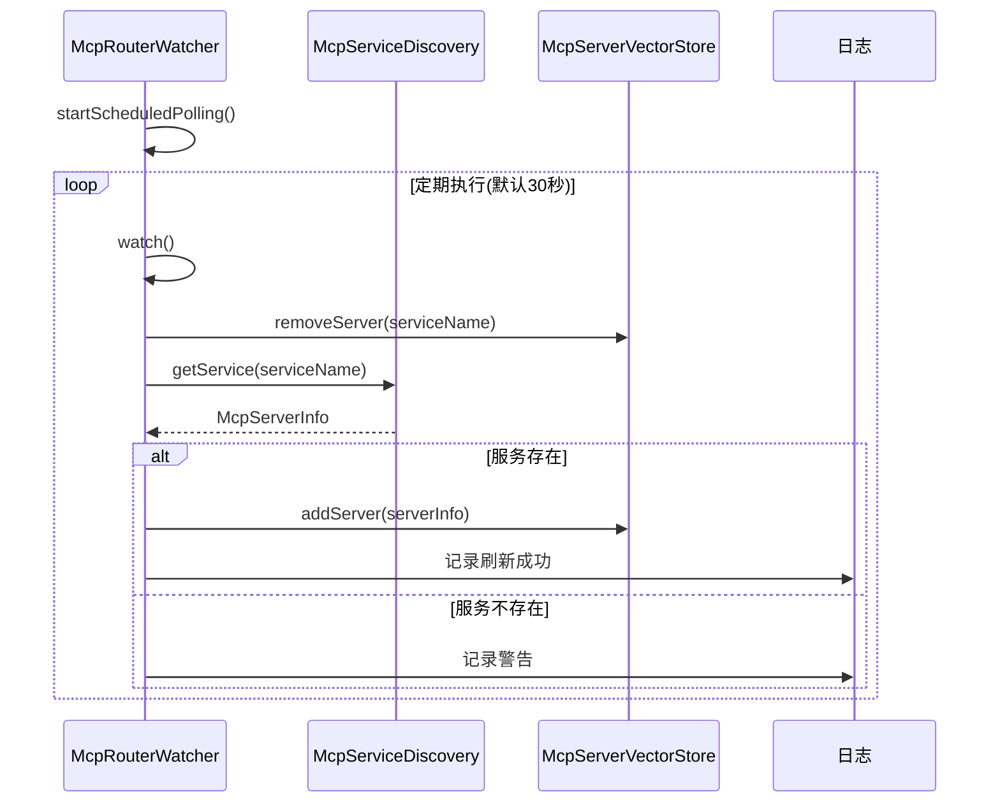

# 服务路由与负载均衡

<cite>
**本文档引用的文件**  
- [McpRouterProperties.java](file://spring-ai-alibaba-mcp/spring-ai-alibaba-mcp-router/src/main/java/com/alibaba/cloud/ai/mcp/router/config/McpRouterProperties.java)
- [NacosMcpRouterAutoConfiguration.java](file://auto-configurations/spring-ai-alibaba-autoconfigure-mcp-router/src/main/java/com/alibaba/cloud/ai/autoconfigure/mcp/router/NacosMcpRouterAutoConfiguration.java)
- [McpServiceDiscoveryAutoConfiguration.java](file://auto-configurations/spring-ai-alibaba-autoconfigure-mcp-router/src/main/java/com/alibaba/cloud/ai/autoconfigure/mcp/router/McpServiceDiscoveryAutoConfiguration.java)
- [NacosMcpServiceDiscovery.java](file://spring-ai-alibaba-mcp/spring-ai-alibaba-mcp-router/src/main/java/com/alibaba/cloud/ai/mcp/router/nacos/NacosMcpServiceDiscovery.java)
- [LoadbalancedMcpSyncClient.java](file://spring-ai-alibaba-mcp/spring-ai-alibaba-mcp-registry/src/main/java/com/alibaba/cloud/ai/mcp/discovery/client/transport/LoadbalancedMcpSyncClient.java)
- [LoadbalancedMcpAsyncClient.java](file://spring-ai-alibaba-mcp/spring-ai-alibaba-mcp-registry/src/main/java/com/alibaba/cloud/ai/mcp/discovery/client/transport/LoadbalancedMcpAsyncClient.java)
- [CompositeMcpServiceDiscovery.java](file://spring-ai-alibaba-mcp/spring-ai-alibaba-mcp-router/src/main/java/com/alibaba/cloud/ai/mcp/router/core/discovery/CompositeMcpServiceDiscovery.java)
- [McpRouterWatcher.java](file://spring-ai-alibaba-mcp/spring-ai-alibaba-mcp-router/src/main/java/com/alibaba/cloud/ai/mcp/router/core/McpRouterWatcher.java)
- [McpRouterService.java](file://spring-ai-alibaba-mcp/spring-ai-alibaba-mcp-router/src/main/java/com/alibaba/cloud/ai/mcp/router/service/McpRouterService.java)
</cite>

## 目录
1. [引言](#引言)
2. [核心配置属性](#核心配置属性)
3. [服务发现机制](#服务发现机制)
4. [负载均衡策略](#负载均衡策略)
5. [路由监控与刷新](#路由监控与刷新)
6. [故障转移机制](#故障转移机制)
7. [配置示例](#配置示例)
8. [性能影响分析](#性能影响分析)
9. [结论](#结论)

## 引言

本文档详细阐述了Spring AI Alibaba框架中服务路由与负载均衡的核心机制。系统通过智能分发请求到后端服务实例，实现了高可用性和可扩展性。核心组件包括`NacosMcpRouterAutoConfiguration`和`McpServiceDiscoveryAutoConfiguration`，它们协同工作以提供动态的服务发现、灵活的路由规则和高效的负载均衡策略。该架构支持基于轮询、随机等多种算法，并具备自动故障转移能力，确保在服务实例不可用时流量能无缝重定向到健康节点。

## 核心配置属性

`McpRouterProperties`类定义了MCP路由器的所有配置选项，这些属性通过`@ConfigurationProperties`注解绑定到`spring.ai.alibaba.mcp.router`前缀下。



**图源**
- [McpRouterProperties.java](file://spring-ai-alibaba-mcp/spring-ai-alibaba-mcp-router/src/main/java/com/alibaba/cloud/ai/mcp/router/config/McpRouterProperties.java)

### 配置项说明

| 配置项 | 描述 |
|-------|------|
| `enabled` | 是否启用MCP路由器，默认为true |
| `serviceNames` | 要路由的MCP服务名称列表 |
| `services` | MCP路由器服务的具体配置信息列表 |
| `discoveryOrder` | 服务发现搜索顺序，支持多种方式同时使用，按指定顺序查找服务 |

**节源**
- [McpRouterProperties.java](file://spring-ai-alibaba-mcp/spring-ai-alibaba-mcp-router/src/main/java/com/alibaba/cloud/ai/mcp/router/config/McpRouterProperties.java)

## 服务发现机制

`McpServiceDiscoveryAutoConfiguration`负责注册`McpServiceDiscovery`到`McpServiceDiscoveryFactory`，并创建一个复合型的服务发现器`CompositeMcpServiceDiscovery`。

```mermaid
sequenceDiagram
participant App as 应用程序
participant Config as McpServiceDiscoveryAutoConfiguration
participant Factory as McpServiceDiscoveryFactory
participant Composite as CompositeMcpServiceDiscovery
App->>Config : 启动应用
Config->>Factory : 创建工厂实例
Config->>Composite : 创建复合发现器
Note over Config,Composite : 使用discoveryOrder配置决定搜索顺序
Composite->>Factory : 获取具体发现实现
loop 按顺序尝试每种发现方式
Composite->>Factory : getDiscovery(type)
alt 找到实现
Factory-->>Composite : 返回McpServiceDiscovery
Composite->>具体发现器 : getService(serviceName)
具体发现器-->>Composite : 返回McpServerInfo
break 找到服务
else 未找到
Composite->>Factory : 尝试下一种类型
end
end
Composite-->>App : 返回服务信息或null
```

**图源**
- [McpServiceDiscoveryAutoConfiguration.java](file://auto-configurations/spring-ai-alibaba-autoconfigure-mcp-router/src/main/java/com/alibaba/cloud/ai/autoconfigure/mcp/router/McpServiceDiscoveryAutoConfiguration.java)
- [CompositeMcpServiceDiscovery.java](file://spring-ai-alibaba-mcp/spring-ai-alibaba-mcp-router/src/main/java/com/alibaba/cloud/ai/mcp/router/core/discovery/CompositeMcpServiceDiscovery.java)

### Nacos服务发现实现

`NacosMcpServiceDiscovery`是基于Nacos的服务发现具体实现，它利用`NacosMcpOperationService`从Nacos服务器获取服务详情，并进行本地缓存以提高性能。

```mermaid
flowchart TD
A[开始] --> B{serviceName为空?}
B -- 是 --> C[返回null]
B -- 否 --> D[调用nacosMcpOperationService.getServerDetail()]
D --> E{获取成功?}
E -- 否 --> F[返回null]
E -- 是 --> G[检查版本是否变更]
G -- 未变更 --> H[返回缓存的McpServerInfo]
G -- 已变更 --> I[创建新的McpServerInfo对象]
I --> J[更新serviceCache和服务版本缓存]
J --> K[返回新创建的McpServerInfo]
```

**图源**
- [NacosMcpServiceDiscovery.java](file://spring-ai-alibaba-mcp/spring-ai-alibaba-mcp-router/src/main/java/com/alibaba/cloud/ai/mcp/router/nacos/NacosMcpServiceDiscovery.java)

**节源**
- [NacosMcpServiceDiscovery.java](file://spring-ai-alibaba-mcp/spring-ai-alibaba-mcp-router/src/main/java/com/alibaba/cloud/ai/mcp/router/nacos/NacosMcpServiceDiscovery.java)

## 负载均衡策略

系统提供了同步和异步两种客户端实现，均采用轮询（Round Robin）算法作为默认的负载均衡策略。

### 同步客户端负载均衡

`LoadbalancedMcpSyncClient`通过`AtomicInteger`索引实现简单的轮询算法：

```java
public McpSyncClient getMcpSyncClient() {
    List<McpSyncClient> syncClients = getMcpSyncClientList();
    if (syncClients.isEmpty()) {
        throw new IllegalStateException("No McpSyncClient available");
    }
    int currentIndex = index.getAndUpdate(index -> (index + 1) % syncClients.size());
    return syncClients.get(currentIndex);
}
```

### 异步客户端负载均衡

`LoadbalancedMcpAsyncClient`采用了相同的轮询策略：

```java
public McpAsyncClient getMcpAsyncClient() {
    List<McpAsyncClient> asynClients = getMcpAsyncClientList();
    if (asynClients.isEmpty()) {
        throw new IllegalStateException("No McpAsyncClient available");
    }

    int currentIndex = index.getAndUpdate(index -> (index + 1) % asynClients.size());
    return asynClients.get(currentIndex);
}
```



**图源**
- [LoadbalancedMcpSyncClient.java](file://spring-ai-alibaba-mcp/spring-ai-alibaba-mcp-registry/src/main/java/com/alibaba/cloud/ai/mcp/discovery/client/transport/LoadbalancedMcpSyncClient.java)
- [LoadbalancedMcpAsyncClient.java](file://spring-ai-alibaba-mcp/spring-ai-alibaba-mcp-registry/src/main/java/com/alibaba/cloud/ai/mcp/discovery/client/transport/LoadbalancedMcpAsyncClient.java)

**节源**
- [LoadbalancedMcpSyncClient.java](file://spring-ai-alibaba-mcp/spring-ai-alibaba-mcp-registry/src/main/java/com/alibaba/cloud/ai/mcp/discovery/client/transport/LoadbalancedMcpSyncClient.java)
- [LoadbalancedMcpAsyncClient.java](file://spring-ai-alibaba-mcp/spring-ai-alibaba-mcp-registry/src/main/java/com/alibaba/cloud/ai/mcp/discovery/client/transport/LoadbalancedMcpAsyncClient.java)

## 路由监控与刷新

`McpRouterWatcher`负责定期监控和刷新MCP服务的状态，确保路由信息始终是最新的。



**图源**
- [McpRouterWatcher.java](file://spring-ai-alibaba-mcp/spring-ai-alibaba-mcp-router/src/main/java/com/alibaba/cloud/ai/mcp/router/core/McpRouterWatcher.java)

**节源**
- [McpRouterWatcher.java](file://spring-ai-alibaba-mcp/spring-ai-alibaba-mcp-router/src/main/java/com/alibaba/cloud/ai/mcp/router/core/McpRouterWatcher.java)

## 故障转移机制

当某个服务实例不可用时，系统通过以下机制实现自动故障转移：

1. **服务发现层**：`NacosMcpServiceDiscovery`会从Nacos获取最新的服务实例列表，自动排除已下线或不健康的实例。
2. **客户端层**：`LoadbalancedMcpSyncClient`和`LoadbalancedMcpAsyncClient`维护着当前可用的服务端点列表，当某个端点失败时，在下次轮询中会被跳过。
3. **订阅机制**：客户端通过`subscribe()`方法监听Nacos上的服务变更事件，一旦服务拓扑发生变化，立即更新本地的客户端列表。

这种多层级的故障转移机制确保了即使在部分服务实例宕机的情况下，系统仍能继续正常处理请求，将流量自动重定向到健康的实例上。

**节源**
- [NacosMcpServiceDiscovery.java](file://spring-ai-alibaba-mcp/spring-ai-alibaba-mcp-router/src/main/java/com/alibaba/cloud/ai/mcp/router/nacos/NacosMcpServiceDiscovery.java)
- [LoadbalancedMcpSyncClient.java](file://spring-ai-alibaba-mcp/spring-ai-alibaba-mcp-registry/src/main/java/com/alibaba/cloud/ai/mcp/discovery/client/transport/LoadbalancedMcpSyncClient.java)
- [LoadbalancedMcpAsyncClient.java](file://spring-ai-alibaba-mcp/spring-ai-alibaba-mcp-registry/src/main/java/com/alibaba/cloud/ai/mcp/discovery/client/transport/LoadbalancedMcpAsyncClient.java)

## 配置示例

以下是典型的配置示例，展示如何定义复杂的路由规则：

```yaml
spring:
  ai:
    alibaba:
      mcp:
        router:
          enabled: true
          # 要路由的服务名称列表
          service-names:
            - my-mcp-service-v1
            - another-service
          # 服务发现搜索顺序
          discovery-order:
            - nacos
            - file
            - database
```

对于文件配置发现，还可以直接在配置文件中定义服务：

```yaml
spring:
  ai:
    alibaba:
      mcp:
        router:
          services:
            - name: static-service
              description: "A statically configured service"
              protocol: sse
              version: "1.0"
              endpoint: "static-service@DEFAULT_GROUP"
              tags:
                - static
                - test
```

**节源**
- [McpRouterProperties.java](file://spring-ai-alibaba-mcp/spring-ai-alibaba-mcp-router/src/main/java/com/alibaba/cloud/ai/mcp/router/config/McpRouterProperties.java)
- [FileMcpRouterAutoConfiguration.java](file://auto-configurations/spring-ai-alibaba-autoconfigure-mcp-router/src/main/java/com/alibaba/cloud/ai/autoconfigure/mcp/router/FileMcpRouterAutoConfiguration.java)

## 性能影响分析

不同的负载均衡算法对系统性能和可用性有不同的影响：

| 算法 | 性能特点 | 适用场景 |
|------|---------|----------|
| 轮询(Round Robin) | 实现简单，分布均匀 | 服务实例性能相近的场景 |
| 随机(Random) | 无状态，扩展性好 | 大规模集群环境 |
| 最少连接(Least Connections) | 能更好应对请求处理时间差异大的情况 | 请求处理时间差异较大的混合工作负载 |

当前实现采用轮询算法，具有以下优势：
- **低开销**：仅需一个原子整数进行索引管理
- **公平性**：保证每个实例获得大致相等的请求量
- **简单可靠**：逻辑清晰，易于维护和调试

然而，在服务实例处理能力差异较大的情况下，可能需要考虑更智能的负载均衡策略。

**节源**
- [LoadbalancedMcpSyncClient.java](file://spring-ai-alibaba-mcp/spring-ai-alibaba-mcp-registry/src/main/java/com/alibaba/cloud/ai/mcp/discovery/client/transport/LoadbalancedMcpSyncClient.java)

## 结论

本文档全面介绍了Spring AI Alibaba框架中的服务路由与负载均衡机制。通过`NacosMcpRouterAutoConfiguration`和`McpServiceDiscoveryAutoConfiguration`的协同工作，系统实现了智能化的请求分发。核心特性包括：
- 基于Nacos的动态服务发现
- 支持多种发现方式的复合搜索策略
- 轮询算法实现的负载均衡
- 自动化的故障转移机制
- 可配置的路由规则

这些特性共同构成了一个高可用、可扩展的服务路由解决方案，能够有效应对微服务架构中的各种挑战。