# 核心功能

<cite>
**本文档引用的文件**
- [StateGraph.java](file://spring-ai-alibaba-graph-core/src/main/java/com/alibaba/cloud/ai/graph/StateGraph.java)
- [A2aAgentCardProperties.java](file://spring-ai-alibaba-a2a/spring-ai-alibaba-a2a-common/src/main/java/com/alibaba/cloud/ai/a2a/A2aAgentCardProperties.java)
- [McpNode.java](file://spring-ai-alibaba-graph-core/src/main/java/com/alibaba/cloud/ai/graph/node/McpNode.java)
- [A2aClientAgentCardProviderAutoConfiguration.java](file://auto-configurations/spring-ai-alibaba-autoconfigure-a2a-client/src/main/java/com/alibaba/cloud/ai/autoconfigure/a2a/client/A2aClientAgentCardProviderAutoConfiguration.java)
- [A2aServerAgentCardAutoConfiguration.java](file://auto-configurations/spring-ai-alibaba-autoconfigure-a2a-server/src/main/java/com/alibaba/cloud/ai/autoconfigure/a2a/server/A2aServerAgentCardAutoConfiguration.java)
- [GraphObservationAutoConfiguration.java](file://auto-configurations/spring-ai-alibaba-autoconfigure-graph-observation/src/main/java/com/alibaba/cloud/ai/autoconfigure/graph/GraphObservationAutoConfiguration.java)
- [McpAssignNodeConfiguration.java](file://spring-ai-alibaba-deepresearch/src/main/java/com/alibaba/cloud/ai/example/deepresearch/agents/McpAssignNodeConfiguration.java)
- [BaseAgent.java](file://spring-ai-alibaba-graph-core/src/main/java/com/alibaba/cloud/ai/graph/agent/BaseAgent.java)
- [CompiledGraph.java](file://spring-ai-alibaba-graph-core/src/main/java/com/alibaba/cloud/ai/graph/CompiledGraph.java)
</cite>

## 目录
1. [简介](#简介)
2. [项目结构概览](#项目结构概览)
3. [Graph多智能体框架](#graph多智能体框架)
4. [A2A协议](#a2a协议)
5. [MCP集成](#mcp集成)
6. [核心组件架构](#核心组件架构)
7. [功能协同机制](#功能协同机制)
8. [配置与使用](#配置与使用)
9. [最佳实践](#最佳实践)
10. [总结](#总结)

## 简介

spring-ai-alibaba框架是阿里巴巴开源的AI应用开发平台，其核心功能围绕三大支柱构建：Graph多智能体框架、A2A协议和MCP集成。这三大功能相互协作，为开发者提供了完整的AI应用开发解决方案。

- **Graph多智能体框架**：提供状态图驱动的智能体编排能力，支持复杂的业务流程管理和多智能体协作
- **A2A协议**：实现智能体之间的标准化通信和互操作，确保不同智能体系统间的无缝集成
- **MCP集成**：提供模型上下文协议支持，实现与各种AI工具和服务的统一接入

## 项目结构概览

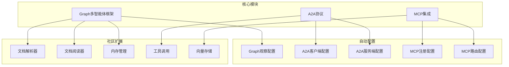

**图表来源**
- [StateGraph.java](file://spring-ai-alibaba-graph-core/src/main/java/com/alibaba/cloud/ai/graph/StateGraph.java#L1-L50)
- [A2aClientAgentCardProviderAutoConfiguration.java](file://auto-configurations/spring-ai-alibaba-autoconfigure-a2a-client/src/main/java/com/alibaba/cloud/ai/autoconfigure/a2a/client/A2aClientAgentCardProviderAutoConfiguration.java#L1-L30)
- [GraphObservationAutoConfiguration.java](file://auto-configurations/spring-ai-alibaba-autoconfigure-graph-observation/src/main/java/com/alibaba/cloud/ai/autoconfigure/graph/GraphObservationAutoConfiguration.java#L1-L40)

## Graph多智能体框架

### 核心概念

Graph多智能体框架是spring-ai-alibaba的核心功能之一，它基于状态图的概念，为AI应用提供了强大的编排能力。

#### StateGraph类设计

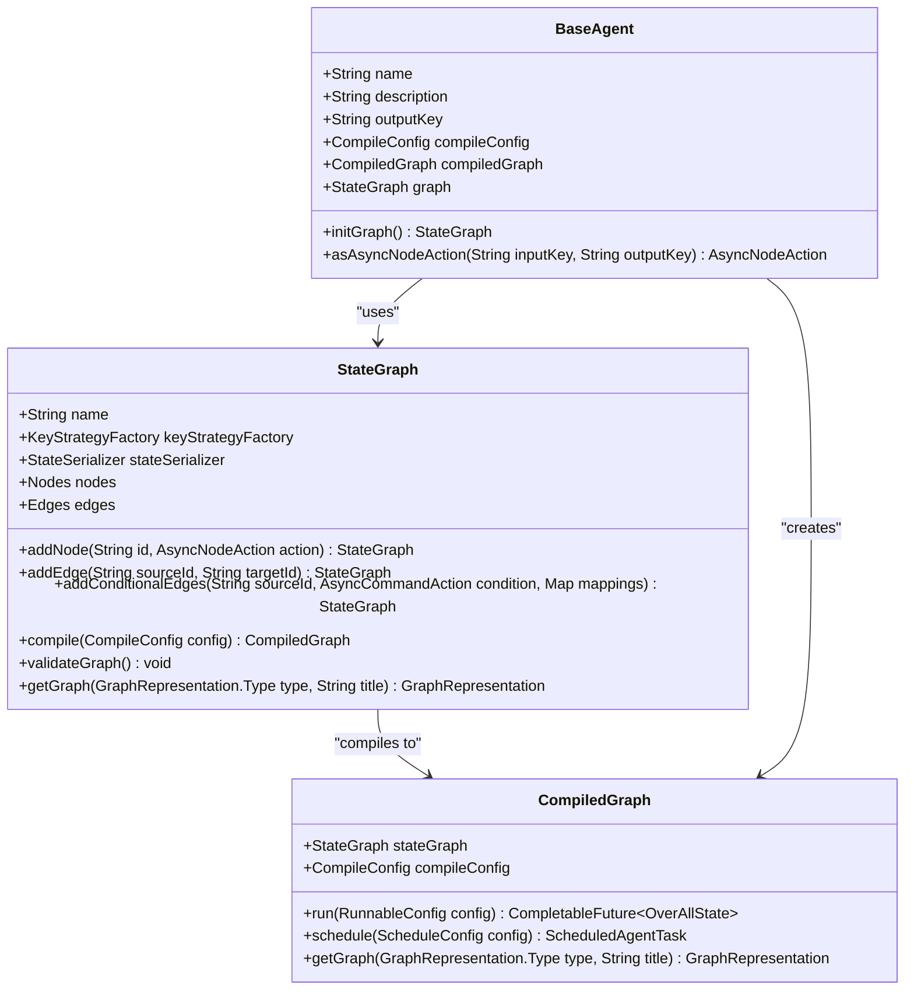

**图表来源**
- [StateGraph.java](file://spring-ai-alibaba-graph-core/src/main/java/com/alibaba/cloud/ai/graph/StateGraph.java#L50-L150)
- [CompiledGraph.java](file://spring-ai-alibaba-graph-core/src/main/java/com/alibaba/cloud/ai/graph/CompiledGraph.java#L89-L150)
- [BaseAgent.java](file://spring-ai-alibaba-graph-core/src/main/java/com/alibaba/cloud/ai/graph/agent/BaseAgent.java#L36-L88)

### 主要特性

#### 1. 状态图构建

StateGraph类提供了灵活的状态图构建能力：

```java
// 创建状态图实例
StateGraph graph = new StateGraph(keyStrategyFactory);

// 添加节点
graph.addNode("planner", this::plannerNodeAction)
     .addNode("executor", this::executorNodeAction)
     .addNode("reviewer", this::reviewerNodeAction);

// 添加边
graph.addEdge(START, "planner")
     .addEdge("planner", "executor")
     .addEdge("executor", "reviewer")
     .addEdge("reviewer", END);
```

#### 2. 条件边支持

支持基于条件的动态路由：

```java
// 添加条件边
graph.addConditionalEdges("planner", this::decisionCondition, 
    Map.of("continue", "executor", END, END));
```

#### 3. 子图嵌套

支持子图嵌套，实现复杂业务流程的模块化：

```java
// 嵌套子图
StateGraph subGraph = new StateGraph(keyStrategyFactory)
    .addNode("task1", this::task1Action)
    .addNode("task2", this::task2Action)
    .addEdge(START, "task1")
    .addEdge("task1", "task2")
    .addEdge("task2", END);

graph.addNode("workflow", subGraph);
```

**章节来源**
- [StateGraph.java](file://spring-ai-alibaba-graph-core/src/main/java/com/alibaba/cloud/ai/graph/StateGraph.java#L150-L350)

### 编译与执行

#### 编译过程

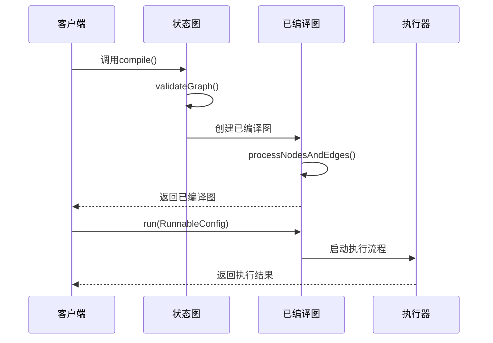

**图表来源**
- [StateGraph.java](file://spring-ai-alibaba-graph-core/src/main/java/com/alibaba/cloud/ai/graph/StateGraph.java#L427-L459)
- [CompiledGraph.java](file://spring-ai-alibaba-graph-core/src/main/java/com/alibaba/cloud/ai/graph/CompiledGraph.java#L89-L150)

#### 执行配置

```java
// 创建编译配置
CompileConfig compileConfig = CompileConfig.builder()
    .saverConfig(saverConfig)
    .interruptsBefore(List.of("reviewer"))
    .interruptsAfter(List.of("executor"))
    .build();

// 编译并执行
CompiledGraph compiledGraph = stateGraph.compile(compileConfig);
OverAllState result = compiledGraph.run(RunnableConfig.builder().build()).join();
```

**章节来源**
- [CompiledGraph.java](file://spring-ai-alibaba-graph-core/src/main/java/com/alibaba/cloud/ai/graph/CompiledGraph.java#L561-L593)

## A2A协议

### 协议概述

A2A（Agent-to-Agent）协议是spring-ai-alibaba实现智能体间通信的标准协议，确保不同智能体系统间的互操作性。

#### Agent卡片结构

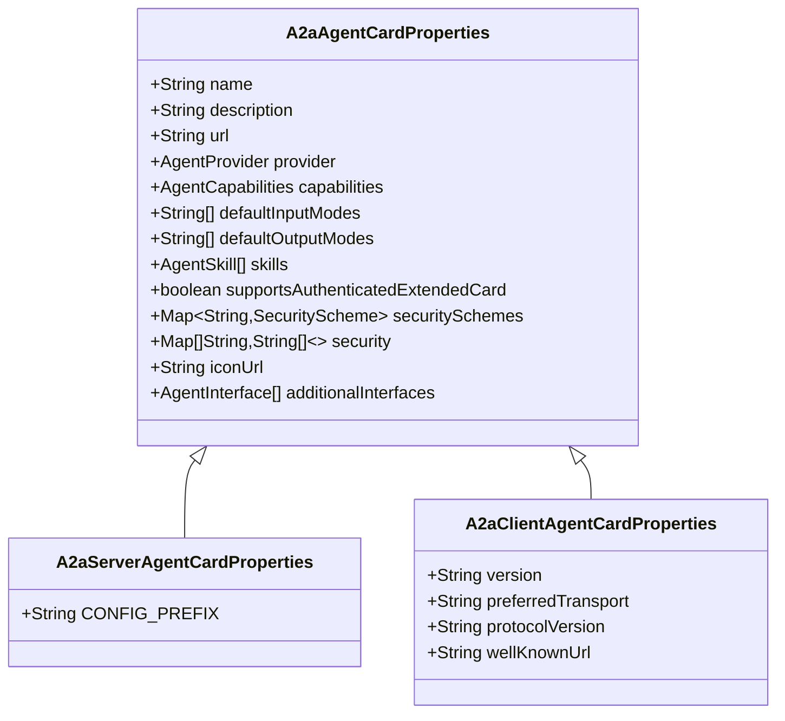

**图表来源**
- [A2aAgentCardProperties.java](file://spring-ai-alibaba-a2a/spring-ai-alibaba-a2a-common/src/main/java/com/alibaba/cloud/ai/a2a/A2aAgentCardProperties.java#L25-L50)

### 服务端配置

#### 自动配置机制

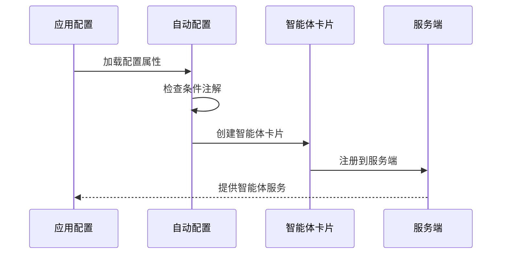

**图表来源**
- [A2aServerAgentCardAutoConfiguration.java](file://auto-configurations/spring-ai-alibaba-autoconfigure-a2a-server/src/main/java/com/alibaba/cloud/ai/autoconfigure/a2a/server/A2aServerAgentCardAutoConfiguration.java#L46-L69)

#### 卡片属性配置

```java
@Bean
@ConditionalOnMissingBean
@ConditionalOnBean({ BaseAgent.class })
public AgentCard agentCard(BaseAgent rootAgent, A2aServerProperties a2aServerProperties,
        A2aServerAgentCardProperties a2AServerAgentCardProperties) {
    return new AgentCard.Builder()
        .name(getName(rootAgent, a2AServerAgentCardProperties))
        .description(getDescription(rootAgent, a2AServerAgentCardProperties))
        .defaultInputModes(getDefaultInputModes(rootAgent, a2AServerAgentCardProperties))
        .defaultOutputModes(getDefaultOutputModes(rootAgent, a2AServerAgentCardProperties))
        .capabilities(getCapabilities(rootAgent, a2AServerAgentCardProperties))
        .version(a2aServerProperties.getVersion())
        .protocolVersion(A2aConstants.DEFAULT_A2A_PROTOCOL_VERSION)
        .preferredTransport(a2aServerProperties.getType())
        .url(getUrl(a2aServerProperties, a2AServerAgentCardProperties))
        .supportsAuthenticatedExtendedCard(a2AServerAgentCardProperties.isSupportsAuthenticatedExtendedCard())
        .skills(getAgentSkills(rootAgent, a2AServerAgentCardProperties))
        .provider(a2AServerAgentCardProperties.getProvider())
        .build();
}
```

**章节来源**
- [A2aServerAgentCardAutoConfiguration.java](file://auto-configurations/spring-ai-alibaba-autoconfigure-a2a-server/src/main/java/com/alibaba/cloud/ai/autoconfigure/a2a/server/A2aServerAgentCardAutoConfiguration.java#L46-L69)

### 客户端配置

#### 远程代理卡提供者

```java
@Bean
@ConditionalOnClass({ AgentCardProvider.class })
@Conditional(A2aClientAgentCardWellKnownCondition.class)
public AgentCardProvider remoteAgentCardProvider(A2aClientAgentCardProperties a2aClientAgentCardProperties) {
    return RemoteAgentCardProvider.newProvider(a2aClientAgentCardProperties.getWellKnownUrl());
}
```

#### 本地代理卡提供者

```java
@Bean
@ConditionalOnClass({ AgentCardProvider.class })
@ConditionalOnProperty(prefix = A2aClientAgentCardProperties.CONFIG_PREFIX, value = "name")
public AgentCardProvider localAgentCardProvider(A2aClientAgentCardProperties a2aClientAgentCardProperties) {
    AgentCard agentCard = new AgentCard.Builder()
        .name(a2aClientAgentCardProperties.getName())
        .description(a2aClientAgentCardProperties.getDescription())
        .url(a2aClientAgentCardProperties.getUrl())
        .provider(a2aClientAgentCardProperties.getProvider())
        .capabilities(a2aClientAgentCardProperties.getCapabilities())
        .version(a2aClientAgentCardProperties.getVersion())
        .protocolVersion(a2aClientAgentCardProperties.getProtocolVersion())
        .preferredTransport(a2aClientAgentCardProperties.getPreferredTransport())
        .build();
    return () -> new AgentCardWrapper(agentCard);
}
```

**章节来源**
- [A2aClientAgentCardProviderAutoConfiguration.java](file://auto-configurations/spring-ai-alibaba-autoconfigure-a2a-client/src/main/java/com/alibaba/cloud/ai/autoconfigure/a2a/client/A2aClientAgentCardProviderAutoConfiguration.java#L32-L71)

## MCP集成

### MCP协议概述

MCP（Model Context Protocol）是spring-ai-alibaba实现的模型上下文协议，用于统一接入各种AI工具和服务。

#### MCP节点设计

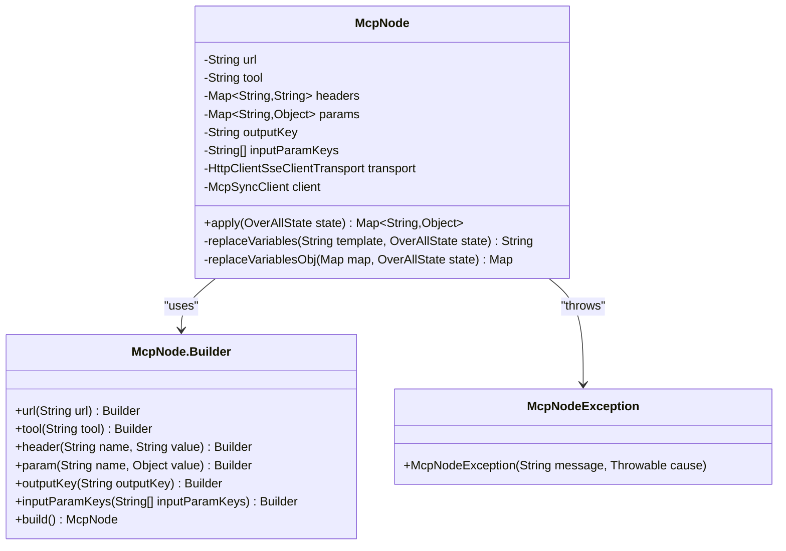

**图表来源**
- [McpNode.java](file://spring-ai-alibaba-graph-core/src/main/java/com/alibaba/cloud/ai/graph/node/McpNode.java#L40-L100)

### MCP客户端配置

#### 动态配置提供者

```java
@Bean(name = "agent2mcpConfigWithRuntime")
public Function<OverAllState, Map<String, McpAssignNodeProperties.McpServerConfig>> agent2mcpConfigWithRuntime(
        @Qualifier("agent2mcpConfig") Map<String, McpAssignNodeProperties.McpServerConfig> staticConfig) {

    return state -> {
        // 获取运行时MCP设置
        Map<String, Object> runtimeMcpSettings = state.value("mcp_settings", Map.class)
            .orElse(Collections.emptyMap());
        return McpConfigMergeUtil.mergeAgent2McpConfigs(staticConfig, runtimeMcpSettings, objectMapper);
    };
}
```

#### MCP配置合并

```java
private McpAssignNodeProperties.McpServerConfig mergeAgent2McpConfigs(
        Map<String, McpAssignNodeProperties.McpServerConfig> staticConfig,
        Map<String, Object> runtimeMcpSettings,
        ObjectMapper objectMapper) {
    
    // 合并静态配置和运行时配置
    // 支持动态调整MCP服务器配置
    // 实现配置的热更新
}
```

**章节来源**
- [McpAssignNodeConfiguration.java](file://spring-ai-alibaba-deepresearch/src/main/java/com/alibaba/cloud/ai/example/deepresearch/agents/McpAssignNodeConfiguration.java#L86-L108)

### MCP节点执行流程

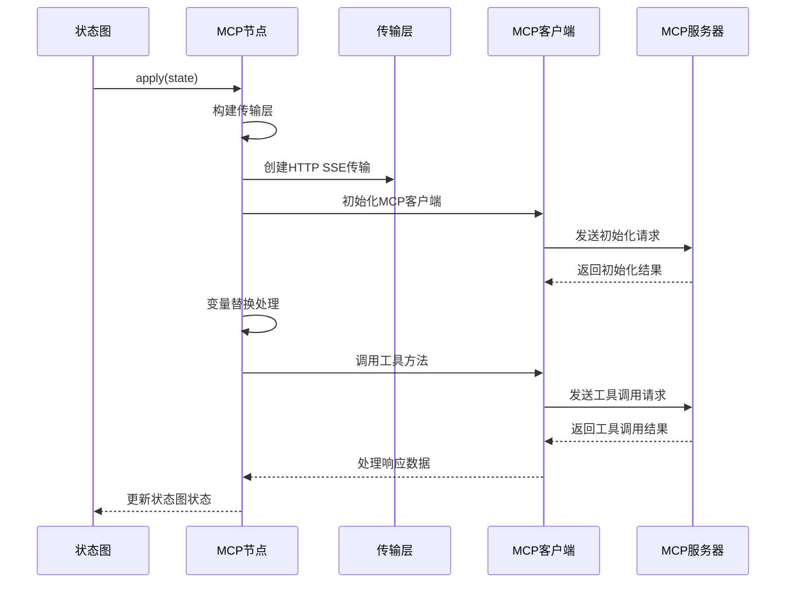

**图表来源**
- [McpNode.java](file://spring-ai-alibaba-graph-core/src/main/java/com/alibaba/cloud/ai/graph/node/McpNode.java#L70-L150)

### MCP配置管理

#### 静态配置加载

```java
@Bean(name = "agent2mcpConfig")
public Map<String, McpAssignNodeProperties.McpServerConfig> agent2mcpConfig() {
    try {
        Resource resource = resourceLoader.getResource(mcpAssignNodeProperties.getConfigLocation());
        if (!resource.exists()) {
            return new HashMap<>();
        }

        try (InputStream inputStream = resource.getInputStream()) {
            TypeReference<Map<String, McpAssignNodeProperties.McpServerConfig>> typeRef = new TypeReference<>() {};
            return objectMapper.readValue(inputStream, typeRef);
        }
    }
    catch (IOException e) {
        logger.error("读取MCP配置失败", e);
        return new HashMap<>();
    }
}
```

**章节来源**
- [McpAssignNodeConfiguration.java](file://spring-ai-alibaba-deepresearch/src/main/java/com/alibaba/cloud/ai/example/deepresearch/agents/McpAssignNodeConfiguration.java#L50-L80)

## 核心组件架构

### 整体架构设计

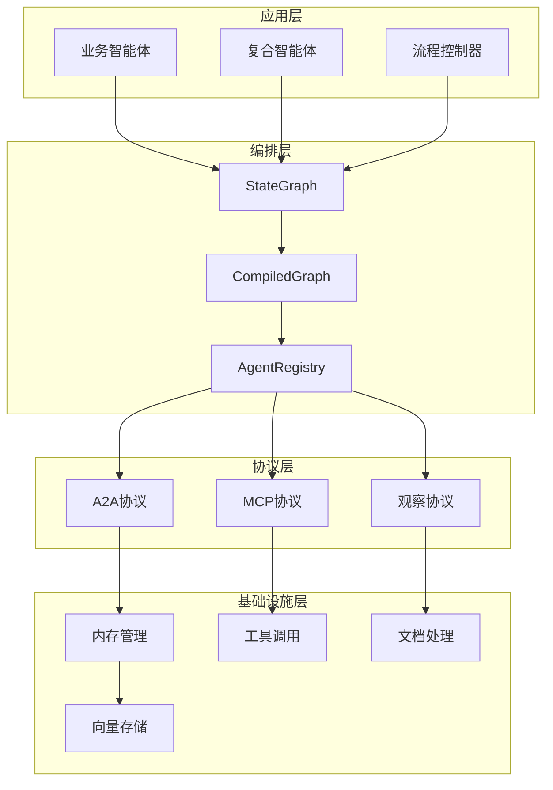

### 组件交互关系

#### 观察系统集成

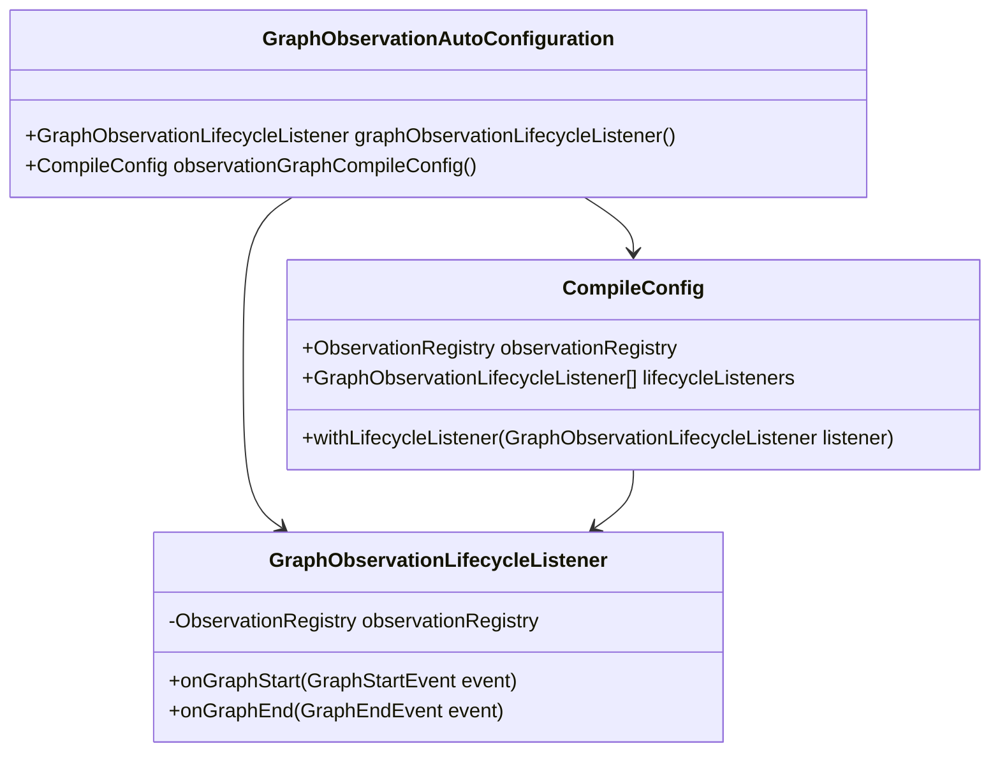

**图表来源**
- [GraphObservationAutoConfiguration.java](file://auto-configurations/spring-ai-alibaba-autoconfigure-graph-observation/src/main/java/com/alibaba/cloud/ai/autoconfigure/graph/GraphObservationAutoConfiguration.java#L40-L80)

**章节来源**
- [GraphObservationAutoConfiguration.java](file://auto-configurations/spring-ai-alibaba-autoconfigure-graph-observation/src/main/java/com/alibaba/cloud/ai/autoconfigure/graph/GraphObservationAutoConfiguration.java#L1-L129)

## 功能协同机制

### 多功能集成架构

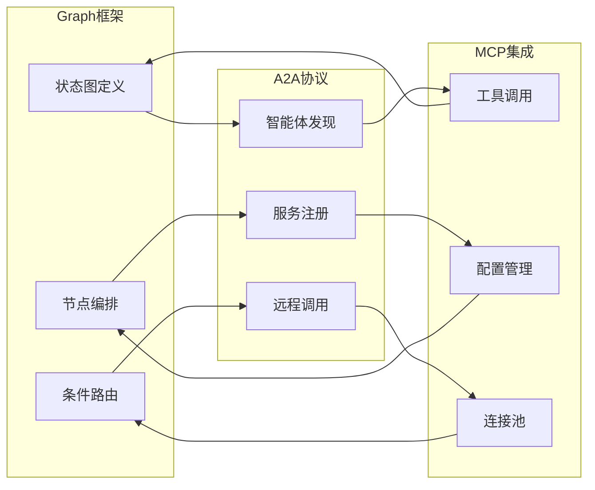

### 数据流转机制

#### 状态图执行流程

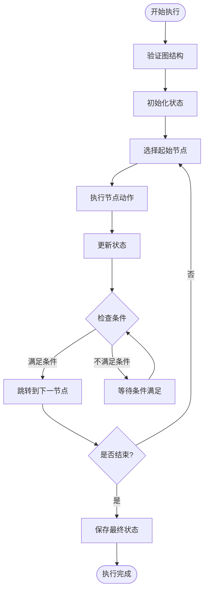

### 性能优化策略

#### 并发执行支持

```java
// 并行分支执行
StateGraph workflow = new StateGraph(keyStrategyFactory)
    .addNode("branch1", this::branch1Action)
    .addNode("branch2", this::branch2Action)
    .addNode("branch3", this::branch3Action)
    .addNode("merge", this::mergeAction)
    .addEdge(START, "branch1")
    .addEdge(START, "branch2")
    .addEdge(START, "branch3")
    .addEdge("branch1", "merge")
    .addEdge("branch2", "merge")
    .addEdge("branch3", "merge")
    .addEdge("merge", END);
```

#### 中断点支持

```java
// 设置中断点
CompileConfig compileConfig = CompileConfig.builder()
    .interruptsBefore(List.of("reviewer"))
    .interruptsAfter(List.of("executor"))
    .build();
```

## 配置与使用

### 基础配置

#### Maven依赖

```xml
<!-- Graph多智能体框架 -->
<dependency>
    <groupId>com.alibaba.cloud.ai</groupId>
    <artifactId>spring-ai-alibaba-graph-core</artifactId>
</dependency>

<!-- A2A协议支持 -->
<dependency>
    <groupId>com.alibaba.cloud.ai</groupId>
    <artifactId>spring-ai-alibaba-autoconfigure-a2a-server</artifactId>
</dependency>

<!-- MCP集成 -->
<dependency>
    <groupId>com.alibaba.cloud.ai</groupId>
    <artifactId>spring-ai-alibaba-autoconfigure-mcp-router</artifactId>
</dependency>
```

#### YAML配置

```yaml
spring:
  ai:
    alibaba:
      a2a:
        server:
          card:
            name: "my-agent"
            description: "My AI Agent"
            url: "http://localhost:8080"
            provider:
              name: "Alibaba Cloud"
              url: "https://www.alibabacloud.com"
            capabilities:
              inputModes: ["text"]
              outputModes: ["text"]
            skills:
              - name: "web_search"
                description: "Web search capability"
          type: "http"
          address: "localhost"
          port: 8080
          message-url: "/api/message"
```

### 高级配置

#### 观察配置

```yaml
spring:
  ai:
    alibaba:
      graph:
        observation:
          enabled: true
      arms:
        enabled: true
```

#### MCP配置

```yaml
spring:
  ai:
    alibaba:
      mcp:
        router:
          servers:
            - name: "calculator"
              description: "Math calculation service"
              protocol: "http"
              version: "1.0"
              endpoint: "http://localhost:8081/calculate"
              enabled: true
              tags: ["math", "calculation"]
```

### 使用示例

#### 创建简单智能体

```java
@Component
public class SimpleAgent extends BaseAgent {
    
    public SimpleAgent() throws GraphStateException {
        super("simple-agent", "A simple AI agent", "result");
    }
    
    @Override
    protected StateGraph initGraph() throws GraphStateException {
        return new StateGraph(keyStrategyFactory)
            .addNode("think", this::thinkAction)
            .addNode("act", this::actAction)
            .addEdge(START, "think")
            .addEdge("think", "act")
            .addEdge("act", END);
    }
    
    private Map<String, Object> thinkAction(OverAllState state) {
        // 智能体思考逻辑
        return Map.of("thought", "Thinking about the problem...");
    }
    
    private Map<String, Object> actAction(OverAllState state) {
        // 智能体行动逻辑
        return Map.of("action", "Taking action...");
    }
}
```

#### 使用MCP节点

```java
@Component
public class McpAgent extends BaseAgent {
    
    public McpAgent() throws GraphStateException {
        super("mcp-agent", "An agent with MCP integration", "result");
    }
    
    @Override
    protected StateGraph initGraph() throws GraphStateException {
        return new StateGraph(keyStrategyFactory)
            .addNode("mcp-call", McpNode.builder()
                .url("http://localhost:8081/sse")
                .tool("calculate")
                .param("expression", "${expression}")
                .outputKey("result")
                .build())
            .addEdge(START, "mcp-call")
            .addEdge("mcp-call", END);
    }
}
```

## 最佳实践

### 设计原则

#### 1. 单一职责原则

每个智能体应该专注于特定的任务领域：

```java
// 推荐：专注于文档分析的智能体
@Component
public class DocumentAnalyzerAgent extends BaseAgent {
    // 专门处理文档分析任务
}

// 不推荐：混合多种功能的智能体
@Component
public class GeneralPurposeAgent extends BaseAgent {
    // 同时处理文档分析、计算和对话
}
```

#### 2. 开放封闭原则

通过配置而非修改来扩展功能：

```java
// 使用配置文件扩展MCP服务器
@Bean
public Map<String, McpServerConfig> additionalMcpServers() {
    return Map.of(
        "custom-calculator", McpServerConfig.builder()
            .url("http://localhost:8082/custom-calc")
            .build()
    );
}
```

#### 3. 依赖倒置原则

依赖抽象而非具体实现：

```java
@Component
public class IntelligentAgent extends BaseAgent {
    
    @Autowired
    private ToolRegistry toolRegistry; // 依赖抽象
    
    @Override
    protected StateGraph initGraph() throws GraphStateException {
        return new StateGraph(keyStrategyFactory)
            .addNode("tool-call", (state) -> {
                // 使用抽象的工具注册表
                Tool tool = toolRegistry.getTool("calculator");
                return tool.execute(state);
            });
    }
}
```

### 性能优化

#### 1. 异步执行

充分利用异步能力：

```java
StateGraph graph = new StateGraph(keyStrategyFactory)
    .addNode("async-task", node_async(this::asyncTask))
    .addEdge(START, "async-task")
    .addEdge("async-task", END);

CompiledGraph compiled = graph.compile();
compiled.run(RunnableConfig.builder().build());
```

#### 2. 内存优化

合理使用检查点机制：

```java
SaverConfig saverConfig = SaverConfig.builder()
    .register(SaverEnum.MEMORY.getValue(), new MemorySaver())
    .register(SaverEnum.FILESYSTEM.getValue(), new FileSystemSaver())
    .build();

CompileConfig compileConfig = CompileConfig.builder()
    .saverConfig(saverConfig)
    .checkpointInterval(10) // 每10个步骤保存一次
    .build();
```

#### 3. 并发控制

限制并发执行数量：

```java
CompileConfig compileConfig = CompileConfig.builder()
    .maxConcurrency(5) // 限制最大并发数
    .timeout(Duration.ofMinutes(5)) // 设置超时时间
    .build();
```

### 错误处理

#### 1. 异常捕获

```java
StateGraph graph = new StateGraph(keyStrategyFactory)
    .addNode("safe-task", (state) -> {
        try {
            return executeTask(state);
        } catch (Exception e) {
            logger.error("Task execution failed", e);
            return Map.of("error", e.getMessage());
        }
    });
```

#### 2. 重试机制

```java
StateGraph graph = new StateGraph(keyStrategyFactory)
    .addNode("retryable-task", (state) -> {
        RetryTemplate retryTemplate = RetryTemplate.builder()
            .maxAttempts(3)
            .exponentialBackoff(1000, 2, 10000)
            .retryOn(Exception.class)
            .build();
            
        return retryTemplate.execute(ctx -> executeTask(state));
    });
```

### 监控与调试

#### 1. 观察配置

```yaml
spring:
  ai:
    alibaba:
      graph:
        observation:
          enabled: true
      arms:
        enabled: true
        trace-id: "${random.uuid}"
```

#### 2. 日志配置

```java
@Component
public class LoggingAgent extends BaseAgent {
    
    private static final Logger logger = LoggerFactory.getLogger(LoggingAgent.class);
    
    @Override
    protected StateGraph initGraph() throws GraphStateException {
        return new StateGraph(keyStrategyFactory)
            .addNode("log-task", (state) -> {
                logger.info("Executing task with state: {}", state);
                Map<String, Object> result = executeTask(state);
                logger.info("Task completed with result: {}", result);
                return result;
            });
    }
}
```

## 总结

spring-ai-alibaba框架的三大核心功能——Graph多智能体框架、A2A协议和MCP集成——形成了一个完整而强大的AI应用开发生态系统。

### 核心优势

1. **模块化设计**：三大功能相对独立又紧密协作，便于按需使用
2. **高度可扩展**：支持自定义节点、工具和服务
3. **生产就绪**：内置监控、错误处理和性能优化机制
4. **标准兼容**：遵循行业标准协议，确保互操作性

### 技术特点

- **状态图驱动**：提供直观的业务流程建模能力
- **协议标准化**：A2A和MCP协议确保系统间的无缝集成
- **异步执行**：充分利用现代硬件资源
- **观察体系**：完善的监控和调试支持

### 应用场景

- **复杂业务流程**：需要多步骤协调的AI应用
- **多智能体协作**：多个AI智能体协同工作的场景
- **工具集成**：需要集成外部工具和服务的应用
- **微服务架构**：分布式AI服务的统一接入

通过合理运用这些核心功能，开发者可以构建出既强大又灵活的AI应用程序，满足各种复杂的业务需求。spring-ai-alibaba框架为AI应用开发提供了坚实的基础架构支撑，让开发者能够专注于业务逻辑的实现，而不必担心底层的技术细节。