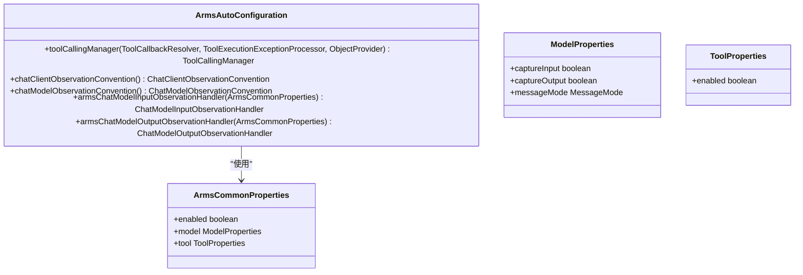
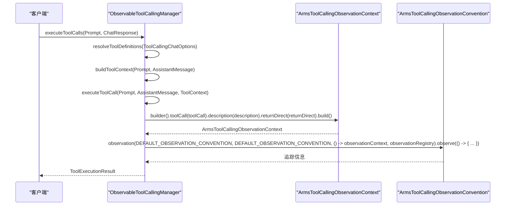
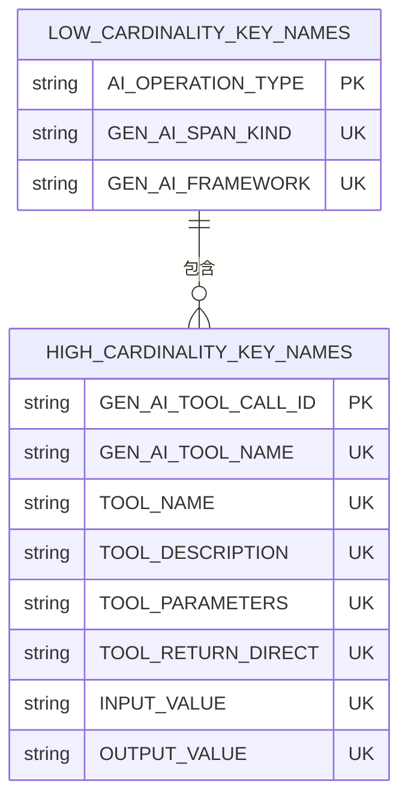
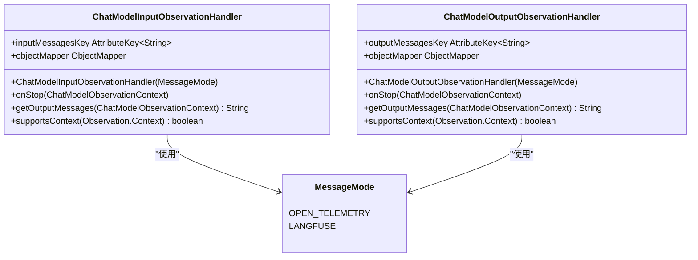
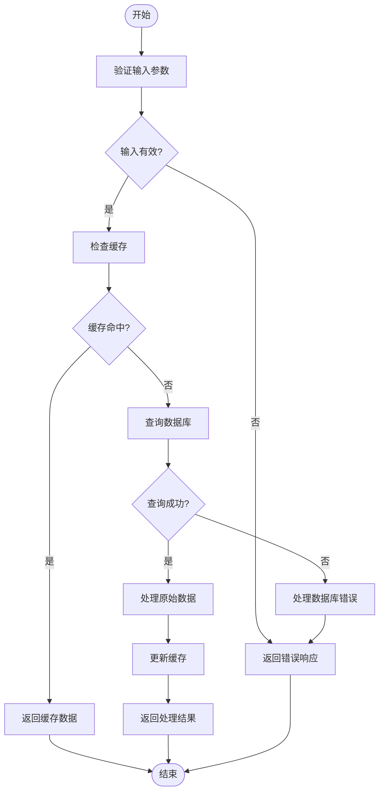
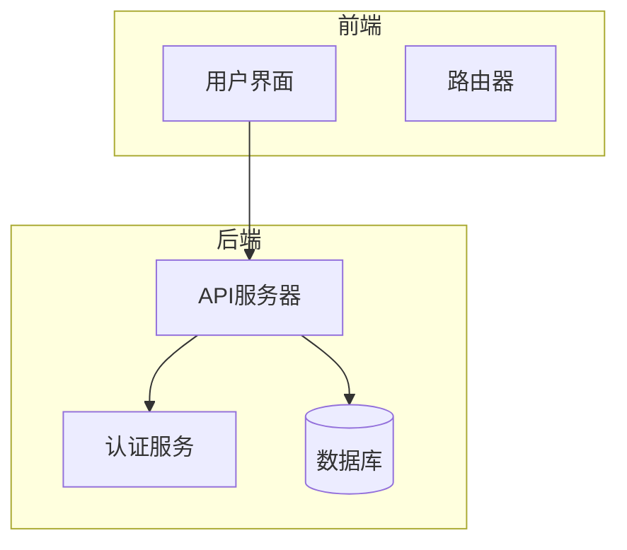

# 观测与监控

<cite>
**本文档引用的文件**
- [ArmsAutoConfiguration.java](file://auto-configurations/spring-ai-alibaba-autoconfigure-arms-observation/src/main/java/com/alibaba/cloud/ai/autoconfigure/arms/ArmsAutoConfiguration.java)
- [ArmsCommonProperties.java](file://auto-configurations/spring-ai-alibaba-autoconfigure-arms-observation/src/main/java/com/alibaba/cloud/ai/autoconfigure/arms/ArmsCommonProperties.java)
- [ArmsToolCallingObservationConvention.java](file://spring-ai-alibaba-core/src/main/java/com/alibaba/cloud/ai/tool/observation/ArmsToolCallingObservationConvention.java)
- [ArmsToolCallingObservationDocumentation.java](file://spring-ai-alibaba-core/src/main/java/com/alibaba/cloud/ai/tool/observation/ArmsToolCallingObservationDocumentation.java)
- [ObservableToolCallingManager.java](file://spring-ai-alibaba-core/src/main/java/com/alibaba/cloud/ai/tool/ObservableToolCallingManager.java)
- [ChatModelInputObservationHandler.java](file://spring-ai-alibaba-observation-extension/src/main/java/com/alibaba/cloud/ai/observation/model/ChatModelInputObservationHandler.java)
- [ChatModelOutputObservationHandler.java](file://spring-ai-alibaba-observation-extension/src/main/java/com/alibaba/cloud/ai/observation/model/ChatModelOutputObservationHandler.java)
- [MessageMode.java](file://spring-ai-alibaba-observation-extension/src/main/java/com/alibaba/cloud/ai/observation/model/semconv/MessageMode.java)
- [GraphObservationAutoConfiguration.java](file://auto-configurations/spring-ai-alibaba-autoconfigure-graph-observation/src/main/java/com/alibaba/cloud/ai/autoconfigure/graph/GraphObservationAutoConfiguration.java)
- [GraphObservationHandler.java](file://spring-ai-alibaba-graph-core/src/main/java/com/alibaba/cloud/ai/graph/observation/graph/GraphObservationHandler.java)
</cite>

## 目录
1. [引言](#引言)
2. [ARMS观测集成](#arms观测集成)
3. [Langfuse集成](#langfuse集成)
4. [配置与启用](#配置与启用)
5. [数据解读与分析](#数据解读与分析)
6. [最佳实践](#最佳实践)
7. [持续改进AI模型和应用性能](#持续改进ai模型和应用性能)

## 引言
本文档详细介绍了Spring AI Alibaba框架中的观测与监控功能，重点阐述了ARMS观测集成和Langfuse集成的实现方式。通过指标收集、分布式追踪和日志聚合，开发者可以全面了解应用的运行状况，进行有效的调试和优化。

## ARMS观测集成

### 指标收集
ARMS观测集成通过`ArmsAutoConfiguration`类实现，该类在满足条件时自动配置相关的观测组件。具体来说，当`ChatModel`类存在于类路径上，并且`spring.ai.arms.enabled`属性设置为`true`时，会启用ARMS观测。



**图表来源**
- [ArmsAutoConfiguration.java](file://auto-configurations/spring-ai-alibaba-autoconfigure-arms-observation/src/main/java/com/alibaba/cloud/ai/autoconfigure/arms/ArmsAutoConfiguration.java#L0-L87)
- [ArmsCommonProperties.java](file://auto-configurations/spring-ai-alibaba-autoconfigure-arms-observation/src/main/java/com/alibaba/cloud/ai/autoconfigure/arms/ArmsCommonProperties.java#L44-L121)

**章节来源**
- [ArmsAutoConfiguration.java](file://auto-configurations/spring-ai-alibaba-autoconfigure-arms-observation/src/main/java/com/alibaba/cloud/ai/autoconfigure/arms/ArmsAutoConfiguration.java#L0-L87)
- [ArmsCommonProperties.java](file://auto-configurations/spring-ai-alibaba-autoconfigure-arms-observation/src/main/java/com/alibaba/cloud/ai/autoconfigure/arms/ArmsCommonProperties.java#L44-L121)

### 分布式追踪
ARMS观测集成通过`ObservableToolCallingManager`类实现分布式追踪。该类在执行工具调用时，会创建一个`ArmsToolCallingObservationContext`对象，并通过`ArmsToolCallingObservationConvention`类生成相应的追踪信息。



**图表来源**
- [ObservableToolCallingManager.java](file://spring-ai-alibaba-core/src/main/java/com/alibaba/cloud/ai/tool/ObservableToolCallingManager.java#L0-L335)
- [ArmsToolCallingObservationContext.java](file://spring-ai-alibaba-core/src/main/java/com/alibaba/cloud/ai/tool/observation/ArmsToolCallingObservationContext.java#L0-L53)
- [ArmsToolCallingObservationConvention.java](file://spring-ai-alibaba-core/src/main/java/com/alibaba/cloud/ai/tool/observation/ArmsToolCallingObservationConvention.java#L0-L128)

**章节来源**
- [ObservableToolCallingManager.java](file://spring-ai-alibaba-core/src/main/java/com/alibaba/cloud/ai/tool/ObservableToolCallingManager.java#L0-L335)
- [ArmsToolCallingObservationContext.java](file://spring-ai-alibaba-core/src/main/java/com/alibaba/cloud/ai/tool/observation/ArmsToolCallingObservationContext.java#L0-L53)
- [ArmsToolCallingObservationConvention.java](file://spring-ai-alibaba-core/src/main/java/com/alibaba/cloud/ai/tool/observation/ArmsToolCallingObservationConvention.java#L0-L128)

### 日志聚合
ARMS观测集成通过`ArmsToolCallingObservationDocumentation`类定义了日志聚合的键名。这些键名分为低基数键名和高基数键名，分别用于记录操作类型、跨度种类、框架等信息。



**图表来源**
- [ArmsToolCallingObservationDocumentation.java](file://spring-ai-alibaba-core/src/main/java/com/alibaba/cloud/ai/tool/observation/ArmsToolCallingObservationDocumentation.java#L0-L199)

**章节来源**
- [ArmsToolCallingObservationDocumentation.java](file://spring-ai-alibaba-core/src/main/java/com/alibaba/cloud/ai/tool/observation/ArmsToolCallingObservationDocumentation.java#L0-L199)

## Langfuse集成

### 集成作用
Langfuse集成通过`ChatModelInputObservationHandler`和`ChatModelOutputObservationHandler`类实现。这两个类分别处理聊天模型输入和输出的观测信息，并将这些信息发送到Langfuse平台。



**图表来源**
- [ChatModelInputObservationHandler.java](file://spring-ai-alibaba-observation-extension/src/main/java/com/alibaba/cloud/ai/observation/model/ChatModelInputObservationHandler.java#L0-L96)
- [ChatModelOutputObservationHandler.java](file://spring-ai-alibaba-observation-extension/src/main/java/com/alibaba/cloud/ai/observation/model/ChatModelOutputObservationHandler.java#L0-L103)
- [MessageMode.java](file://spring-ai-alibaba-observation-extension/src/main/java/com/alibaba/cloud/ai/observation/model/semconv/MessageMode.java#L0-L23)

**章节来源**
- [ChatModelInputObservationHandler.java](file://spring-ai-alibaba-observation-extension/src/main/java/com/alibaba/cloud/ai/observation/model/ChatModelInputObservationHandler.java#L0-L96)
- [ChatModelOutputObservationHandler.java](file://spring-ai-alibaba-observation-extension/src/main/java/com/alibaba/cloud/ai/observation/model/ChatModelOutputObservationHandler.java#L0-L103)
- [MessageMode.java](file://spring-ai-alibaba-observation-extension/src/main/java/com/alibaba/cloud/ai/observation/model/semconv/MessageMode.java#L0-L23)

### 调试和优化
Langfuse集成可以帮助开发者进行LLM应用的调试和优化。通过观察输入和输出的消息，开发者可以更好地理解模型的行为，并进行相应的调整。



**图表来源**
- [ChatModelInputObservationHandler.java](file://spring-ai-alibaba-observation-extension/src/main/java/com/alibaba/cloud/ai/observation/model/ChatModelInputObservationHandler.java#L0-L96)
- [ChatModelOutputObservationHandler.java](file://spring-ai-alibaba-observation-extension/src/main/java/com/alibaba/cloud/ai/observation/model/ChatModelOutputObservationHandler.java#L0-L103)

**章节来源**
- [ChatModelInputObservationHandler.java](file://spring-ai-alibaba-observation-extension/src/main/java/com/alibaba/cloud/ai/observation/model/ChatModelInputObservationHandler.java#L0-L96)
- [ChatModelOutputObservationHandler.java](file://spring-ai-alibaba-observation-extension/src/main/java/com/alibaba/cloud/ai/observation/model/ChatModelOutputObservationHandler.java#L0-L103)

## 配置与启用

### 启用ARMS观测
要启用ARMS观测，需要在`application.properties`或`application.yml`文件中设置`spring.ai.arms.enabled`属性为`true`。

```properties
spring.ai.arms.enabled=true
```

此外，还可以配置模型和工具的观测选项：

```properties
spring.ai.arms.model.capture-input=true
spring.ai.arms.model.capture-output=true
spring.ai.arms.model.message-mode=OPEN_TELEMETRY
spring.ai.arms.tool.enabled=true
```

**章节来源**
- [ArmsCommonProperties.java](file://auto-configurations/spring-ai-alibaba-autoconfigure-arms-observation/src/main/java/com/alibaba/cloud/ai/autoconfigure/arms/ArmsCommonProperties.java#L44-L121)

### 启用Langfuse集成
要启用Langfuse集成，需要在`application.properties`或`application.yml`文件中设置`spring.ai.arms.model.message-mode`属性为`LANGFUSE`。

```properties
spring.ai.arms.model.message-mode=LANGFUSE
```

**章节来源**
- [MessageMode.java](file://spring-ai-alibaba-observation-extension/src/main/java/com/alibaba/cloud/ai/observation/model/semconv/MessageMode.java#L0-L23)

## 数据解读与分析

### 解读收集到的数据
收集到的数据可以通过ARMS控制台或Langfuse平台进行查看和分析。开发者可以查看每个请求的详细信息，包括输入消息、输出消息、工具调用等。



**图表来源**
- [ArmsToolCallingObservationConvention.java](file://spring-ai-alibaba-core/src/main/java/com/alibaba/cloud/ai/tool/observation/ArmsToolCallingObservationConvention.java#L0-L128)
- [ChatModelInputObservationHandler.java](file://spring-ai-alibaba-observation-extension/src/main/java/com/alibaba/cloud/ai/observation/model/ChatModelInputObservationHandler.java#L0-L96)
- [ChatModelOutputObservationHandler.java](file://spring-ai-alibaba-observation-extension/src/main/java/com/alibaba/cloud/ai/observation/model/ChatModelOutputObservationHandler.java#L0-L103)

**章节来源**
- [ArmsToolCallingObservationConvention.java](file://spring-ai-alibaba-core/src/main/java/com/alibaba/cloud/ai/tool/observation/ArmsToolCallingObservationConvention.java#L0-L128)
- [ChatModelInputObservationHandler.java](file://spring-ai-alibaba-observation-extension/src/main/java/com/alibaba/cloud/ai/observation/model/ChatModelInputObservationHandler.java#L0-L96)
- [ChatModelOutputObservationHandler.java](file://spring-ai-alibaba-observation-extension/src/main/java/com/alibaba/cloud/ai/observation/model/ChatModelOutputObservationHandler.java#L0-L103)

## 最佳实践

### 关键指标的选择
选择关键指标时，应考虑以下几点：
- **请求成功率**：衡量请求的成功率。
- **响应时间**：衡量请求的响应时间。
- **工具调用次数**：衡量工具调用的频率。
- **输入和输出消息长度**：衡量输入和输出消息的长度。

**章节来源**
- [ArmsToolCallingObservationDocumentation.java](file://spring-ai-alibaba-core/src/main/java/com/alibaba/cloud/ai/tool/observation/ArmsToolCallingObservationDocumentation.java#L0-L199)

### 告警规则的设置
设置告警规则时，应考虑以下几点：
- **请求失败率超过阈值**：当请求失败率超过一定阈值时触发告警。
- **响应时间过长**：当响应时间超过一定阈值时触发告警。
- **工具调用异常**：当工具调用出现异常时触发告警。

**章节来源**
- [ArmsToolCallingObservationConvention.java](file://spring-ai-alibaba-core/src/main/java/com/alibaba/cloud/ai/tool/observation/ArmsToolCallingObservationConvention.java#L0-L128)

### 性能瓶颈的识别
识别性能瓶颈时，应考虑以下几点：
- **慢查询**：查找执行时间较长的查询。
- **高并发**：查找并发量较高的请求。
- **资源消耗**：查找资源消耗较高的操作。

**章节来源**
- [ObservableToolCallingManager.java](file://spring-ai-alibaba-core/src/main/java/com/alibaba/cloud/ai/tool/ObservableToolCallingManager.java#L0-L335)

## 持续改进AI模型和应用性能

### 利用观测数据进行改进
利用观测数据进行改进时，应考虑以下几点：
- **分析用户行为**：通过分析用户的输入和输出消息，了解用户的需求和偏好。
- **优化模型参数**：根据观测数据调整模型的参数，提高模型的准确性和效率。
- **改进工具调用**：根据观测数据优化工具调用的逻辑，减少不必要的调用。

**章节来源**
- [ChatModelInputObservationHandler.java](file://spring-ai-alibaba-observation-extension/src/main/java/com/alibaba/cloud/ai/observation/model/ChatModelInputObservationHandler.java#L0-L96)
- [ChatModelOutputObservationHandler.java](file://spring-ai-alibaba-observation-extension/src/main/java/com/alibaba/cloud/ai/observation/model/ChatModelOutputObservationHandler.java#L0-L103)