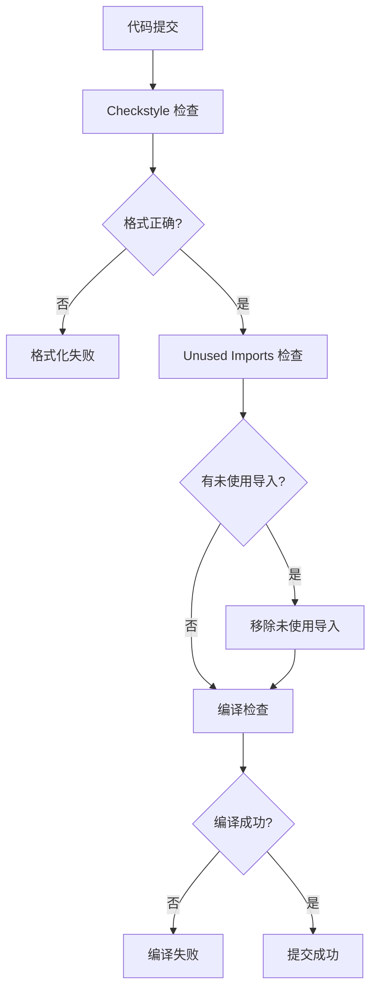
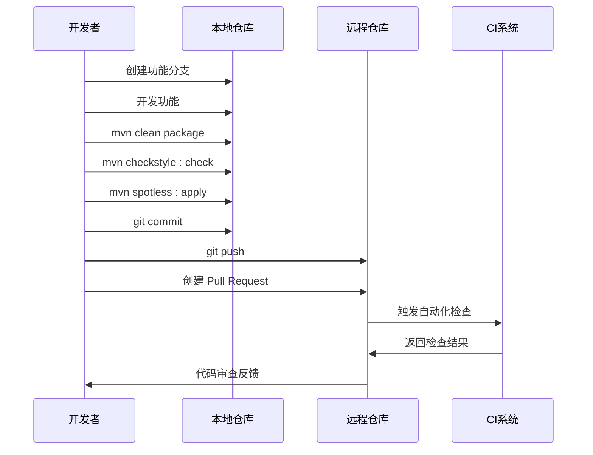
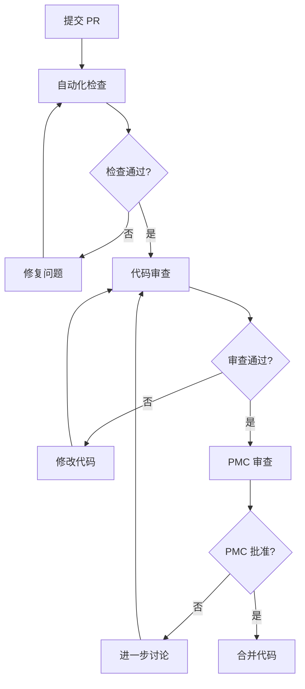
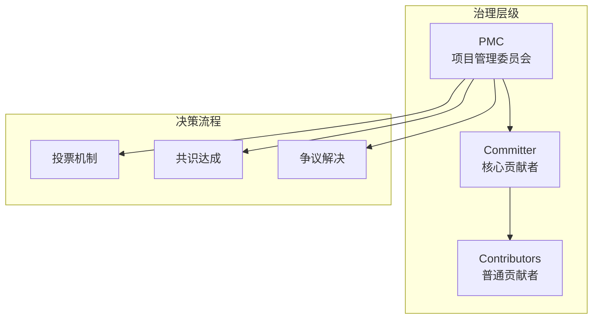
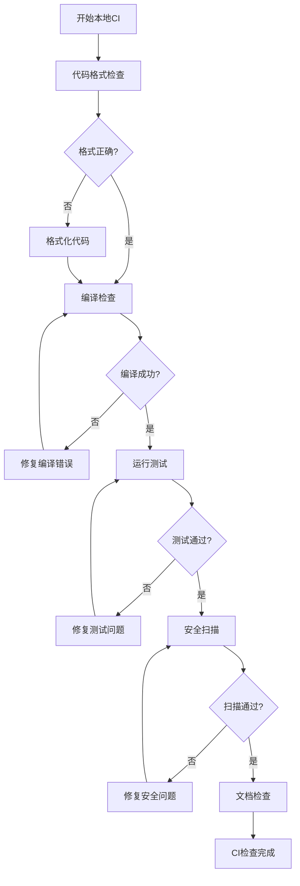

# Spring AI Alibaba 贡献指南

<cite>
**本文档引用的文件**
- [CONTRIBUTING.md](file://CONTRIBUTING.md)
- [CONTRIBUTING-zh.md](file://CONTRIBUTING-zh.md)
- [CODE_OF_CONDUCT.md](file://CODE_OF_CONDUCT.md)
- [GOVERNANCE.md](file://GOVERNANCE.md)
- [COMMITTERS.md](file://COMMITTERS.md)
- [PMC_MEMBERS.md](file://PMC_MEMBERS.md)
- [README.md](file://README.md)
- [README-zh.md](file://README-zh.md)
- [tools/src/checkstyle/checkstyle.xml](file://tools/src/checkstyle/checkstyle.xml)
- [tools/src/checkstyle/checkstyle-header.txt](file://tools/src/checkstyle/checkstyle-header.txt)
</cite>

## 目录
1. [项目简介](#项目简介)
2. [贡献方式](#贡献方式)
3. [代码规范](#代码规范)
4. [开发流程](#开发流程)
5. [Pull Request 流程](#pull-request-流程)
6. [项目治理结构](#项目治理结构)
7. [行为准则](#行为准则)
8. [测试要求](#测试要求)
9. [本地CI检查](#本地ci检查)
10. [常见问题解答](#常见问题解答)

## 项目简介

Spring AI Alibaba 是一个以 Spring AI 为基础，深度集成阿里云百炼平台的 AI 框架，支持 ChatBot、工作流、多智能体应用开发模式。该项目致力于为企业提供完整的 AI 生态集成解决方案，包括模型服务、RAG知识库、MCP工具集成、可观测性监控等功能。

项目采用 Apache License 2.0 开源协议，欢迎全球开发者参与贡献。作为一个活跃发展的开源项目，Spring AI Alibaba 正在不断扩展其功能边界，为开发者提供更强大的 AI 应用开发能力。

**章节来源**
- [README.md](file://README.md#L1-L144)
- [README-zh.md](file://README-zh.md#L1-L151)

## 贡献方式

### 贡献类型

Spring AI Alibaba 欢迎任何形式的贡献，包括但不限于：

- **Bug 修复**：修复现有问题和错误
- **功能增强**：新增功能特性
- **文档改进**：完善文档和示例
- **性能优化**：提升系统性能和效率
- **测试覆盖**：增加测试用例和覆盖率
- **工具集成**：与其他开源项目的整合

### 贡献入口

对于首次贡献者，建议从以下标签的任务开始：

- **Good First Issue**：适合新手的简单任务
- **Help Wanted**：社区需要帮助的任务

这些任务经过精心挑选，旨在帮助新贡献者熟悉项目结构和开发流程。

### 贡献前准备

在开始贡献之前，请确保：

1. **理解项目愿景**：阅读项目文档，了解项目目标和发展方向
2. **熟悉技术栈**：掌握 Java、Spring Boot、Maven 等核心技术
3. **了解架构**：熟悉 Spring AI Alibaba 的整体架构设计
4. **阅读规范**：仔细阅读代码规范和贡献指南

**章节来源**
- [CONTRIBUTING.md](file://CONTRIBUTING.md#L1-L90)
- [CONTRIBUTING-zh.md](file://CONTRIBUTING-zh.md#L1-L77)

## 代码规范

### 命名约定

Spring AI Alibaba 严格遵循 Java 编程最佳实践和 Spring 项目规范：

#### 类命名
- 使用 PascalCase 命名规则
- 类名应具有描述性，体现其职责
- 避免使用缩写，除非是广泛认可的术语

#### 方法命名
- 使用 camelCase 命名规则
- 方法名应清晰表达其功能
- 参数名应具有描述性

#### 变量命名
- 使用 camelCase 命名规则
- 常量使用 UPPER_CASE
- 私有字段使用小写字母开头

### 代码格式化

项目使用 Checkstyle 进行代码格式检查，确保代码风格的一致性：

#### 导入规范
- 按字母顺序排列导入
- 避免使用通配符导入
- 移除未使用的导入

#### 注释要求
- 类必须包含 Javadoc 注释
- 公共方法必须有详细注释
- 复杂逻辑需要添加内联注释
- 使用标准的 Javadoc 格式

#### 代码结构
- 方法长度不超过 50 行
- 类长度不超过 500 行
- 控制循环嵌套不超过 3 层
- 避免过长的方法链

### 特殊检查规则

项目实施了严格的代码质量检查：



**图表来源**
- [tools/src/checkstyle/checkstyle.xml](file://tools/src/checkstyle/checkstyle.xml#L1-L206)

**章节来源**
- [tools/src/checkstyle/checkstyle.xml](file://tools/src/checkstyle/checkstyle.xml#L1-L206)
- [tools/src/checkstyle/checkstyle-header.txt](file://tools/src/checkstyle/checkstyle-header.txt#L1-L18)

## 开发流程

### 环境准备

#### 开发工具配置
1. **JDK 版本**：要求 JDK 17 或更高版本
2. **IDE 推荐**：IntelliJ IDEA 或 Eclipse
3. **Maven**：确保 Maven 3.6+ 版本可用

#### Git 配置
```bash
# 检查当前配置
git config --list

# 设置用户名和邮箱
git config --global user.name "Your Name"
git config --global user.email "your.email@example.com"

# 为特定项目设置不同的配置
git config user.name "GitHub Username"
git config user.email "github@email.com"
```

### 项目克隆

```bash
# Fork 项目到你的 GitHub 账户
# 克隆你的 Fork 到本地
git clone https://github.com/YOUR_USERNAME/spring-ai-alibaba.git

# 添加上游仓库
cd spring-ai-alibaba
git remote add upstream https://github.com/alibaba/spring-ai-alibaba.git
```

### 代码开发

#### 功能开发流程



**图表来源**
- [CONTRIBUTING.md](file://CONTRIBUTING.md#L40-L89)

#### 代码提交规范

提交信息必须遵循以下格式：
```
type(module): description

示例：
feat(docs): update contribute-zh
fix(core): resolve memory leak in chat agent
refactor(api): improve model interface design
```

**章节来源**
- [CONTRIBUTING.md](file://CONTRIBUTING.md#L40-L89)
- [CONTRIBUTING-zh.md](file://CONTRIBUTING-zh.md#L40-L77)

## Pull Request 流程

### PR 创建前准备

#### 代码同步
在创建 PR 之前，必须确保代码是最新的：

```bash
# 获取最新的上游代码
git fetch upstream

# 切换到主分支
git checkout main

# rebase 最新代码
git rebase upstream/main

# 解决可能出现的冲突
# ... 解决冲突 ...

# 推送到你的 Fork
git push origin main
```

#### 代码质量检查
```bash
# 清理并编译项目
mvn clean package

# 检查代码风格
mvn checkstyle:check

# 自动格式化代码
mvn spotless:apply

# 移除未使用的导入
mvn spotless:apply
```

### PR 模板要求

创建 PR 时，必须填写以下信息：

1. **标题**：简洁描述 PR 的主要变更
2. **描述**：详细说明变更内容、原因和影响
3. **测试**：说明测试覆盖情况和测试方法
4. **相关问题**：关联相关的 Issue 编号
5. **变更类型**：标记为 feat、fix、docs、style、refactor、test、chore 等

### 代码审查流程



**图表来源**
- [CONTRIBUTING.md](file://CONTRIBUTING.md#L80-L89)

**章节来源**
- [CONTRIBUTING.md](file://CONTRIBUTING.md#L80-L89)
- [CONTRIBUTING-zh.md](file://CONTRIBUTING-zh.md#L70-L77)

## 项目治理结构

### PMC 成员角色

Spring AI Alibaba 采用 Project Management Committee (PMC) 制度进行治理：

#### PMC 成员职责
1. **技术决策**：制定项目技术路线和架构决策
2. **社区管理**：维护社区秩序和促进协作
3. **发布管理**：负责版本发布和里程碑规划
4. **安全审核**：处理安全漏洞报告和修复
5. **人员管理**：审批新的 Comitters 和 PMC 成员

#### PMC 成员列表
目前的 PMC 成员包括来自阿里巴巴集团的资深工程师和技术专家，他们具有丰富的开源项目管理经验。

### Committer 权限

#### Committer 职责
1. **代码贡献**：积极参与核心功能开发
2. **代码审查**：协助审查其他贡献者的代码
3. **问题解决**：帮助解决社区遇到的技术问题
4. **文档维护**：更新和完善项目文档

#### Committer 获得方式
新 Comitter 通过以下流程获得：
1. 现有 PMC 成员提名
2. PMC 成员投票（至少 3 票赞成）
3. 为期一周的投票期
4. 通过后添加到 COMMITTERS.md 文件

### 治理原则



**图表来源**
- [GOVERNANCE.md](file://GOVERNANCE.md#L1-L68)

**章节来源**
- [GOVERNANCE.md](file://GOVERNANCE.md#L1-L68)
- [COMMITTERS.md](file://COMMITTERS.md#L1-L16)
- [PMC_MEMBERS.md](file://PMC_MEMBERS.md#L1-L16)

## 行为准则

### 社区价值观

Spring AI Alibaba 坚持开放、包容、尊重的社区文化：

#### 核心原则
1. **尊重多样性**：尊重不同背景、经验和观点
2. **友善沟通**：保持专业和友好的交流态度
3. **建设性反馈**：提供建设性的意见和建议
4. **包容性**：欢迎所有水平的贡献者参与

#### 不当行为
以下行为被视为不可接受：
- 性别化语言或图像
- 人身攻击或恶意评论
- 公开或私下骚扰
- 未经许可发布他人隐私信息
- 其他不专业或不道德的行为

### 执行机制

#### 报告渠道
违反行为准则的行为可通过以下方式报告：
- 发送邮件至：spring-code-of-conduct@pivotal.io
- 通过 GitHub Issues 报告
- 联系 PMC 成员

#### 处理流程
1. **收到报告**：PMC 成员接收违规报告
2. **调查核实**：收集相关信息和证据
3. **决定处理**：根据情况采取适当措施
4. **通知结果**：向举报人和涉事方通报处理结果
5. **保密原则**：保护举报人的隐私

### 支持资源

项目提供多种支持渠道：
- **钉钉群**：群号 94405033092
- **微信公众号**：扫描二维码关注
- **GitHub Discussions**：技术讨论和问题交流
- **官方文档**：详细的使用和开发指南

**章节来源**
- [CODE_OF_CONDUCT.md](file://CODE_OF_CONDUCT.md#L1-L30)

## 测试要求

### 测试覆盖率目标

Spring AI Alibaba 要求达到以下测试覆盖率标准：

#### 最低要求
- **单元测试覆盖率**：≥ 80%
- **集成测试覆盖率**：≥ 70%
- **关键路径覆盖率**：≥ 90%

#### 推荐标准
- **核心模块覆盖率**：≥ 95%
- **新功能覆盖率**：100%
- **回归测试覆盖率**：≥ 90%

### 测试用例编写标准

#### 单元测试
1. **测试独立性**：每个测试用例应该独立运行
2. **清晰命名**：测试方法名应清楚描述测试目的
3. **完整覆盖**：覆盖正常路径、异常路径和边界条件
4. **断言明确**：使用有意义的断言消息

#### 集成测试
1. **真实环境**：尽可能使用真实的外部依赖
2. **数据隔离**：确保测试数据不会相互影响
3. **清理机制**：测试结束后清理临时数据
4. **性能考虑**：避免过度消耗系统资源

### 测试执行

```bash
# 运行所有测试
mvn test

# 运行特定模块测试
mvn test -pl spring-ai-alibaba-core

# 生成测试报告
mvn jacoco:report

# 检查测试覆盖率
mvn jacoco:check
```

## 本地CI检查

### CI 工具配置

项目提供了完整的本地 CI 检查工具链：

#### Make 命令
```bash
# 查看可用的 CI 命令
make help

# 运行完整的 CI 检查
make ci

# 运行特定的检查
make lint
make test
make build
```

#### 检查项目
本地 CI 检查包括以下项目：
1. **代码格式检查**：Checkstyle 验证
2. **编译检查**：Maven 编译验证
3. **测试执行**：单元测试和集成测试
4. **安全扫描**：代码安全漏洞检测
5. **文档检查**：文档格式和链接验证

### 检查流程



**图表来源**
- [CONTRIBUTING.md](file://CONTRIBUTING.md#L50-L60)

**章节来源**
- [CONTRIBUTING.md](file://CONTRIBUTING.md#L50-L60)
- [CONTRIBUTING-zh.md](file://CONTRIBUTING-zh.md#L50-L60)

## 常见问题解答

### 开发环境问题

#### Q: JDK 版本要求是什么？
A: 项目要求 JDK 17 或更高版本。建议使用 JDK 17 LTS 版本以获得最佳兼容性。

#### Q: 如何解决 Maven 依赖问题？
A: 如果遇到 spring-ai 相关依赖问题，请确保正确配置 spring-milestones Maven 仓库：
```xml
<repositories>
  <repository>
    <id>spring-milestones</id>
    <url>https://repo.spring.io/milestone</url>
  </repository>
</repositories>
```

### Git 操作问题

#### Q: 如何解决 rebase 冲突？
A: 当 rebase 过程中出现冲突时：
1. 识别冲突文件
2. 手动解决冲突
3. 标记冲突已解决：`git add <file>`
4. 继续 rebase：`git rebase --continue`

#### Q: 如何重置本地分支到最新状态？
A: 
```bash
# 获取最新代码
git fetch upstream

# 重置本地分支
git reset --hard upstream/main

# 强制推送到你的 Fork
git push origin main --force
```

### 代码质量问题

#### Q: Checkstyle 检查失败怎么办？
A: 
1. 查看具体的检查错误信息
2. 使用 `mvn spotless:apply` 自动格式化代码
3. 手动修复剩余的格式问题
4. 再次运行 `mvn checkstyle:check` 验证

#### Q: 如何提高测试覆盖率？
A: 
1. 为新功能编写对应的单元测试
2. 为现有代码添加边界条件测试
3. 使用 Mock 对象模拟外部依赖
4. 考虑使用参数化测试覆盖多种场景

### 贡献流程问题

#### Q: 如何申请成为 Comitter？
A: 
1. 积极参与项目贡献，提交高质量的 PR
2. 在社区中展示技术能力和责任心
3. 获得现有 Comitter 的推荐
4. 通过 PMC 成员投票批准

#### Q: PR 被拒绝的原因有哪些？
常见的被拒绝原因包括：
- 代码不符合项目规范
- 缺少必要的测试用例
- 影响现有功能的稳定性
- 设计方案不够合理
- 文档和注释不足

**章节来源**
- [CONTRIBUTING.md](file://CONTRIBUTING.md#L1-L90)
- [CONTRIBUTING-zh.md](file://CONTRIBUTING-zh.md#L1-L77)

## 结语

Spring AI Alibaba 作为一个活跃发展的开源项目，欢迎全球开发者参与贡献。通过遵循本指南中的规范和流程，您可以有效地参与到项目的开发中，为构建更好的 AI 应用开发框架贡献力量。

记住，开源不仅仅是代码贡献，还包括文档改进、问题报告、社区支持等多种形式的参与。无论您是初学者还是资深开发者，都有机会为这个项目带来价值。

让我们携手共建一个开放、包容、创新的 AI 开发生态系统！