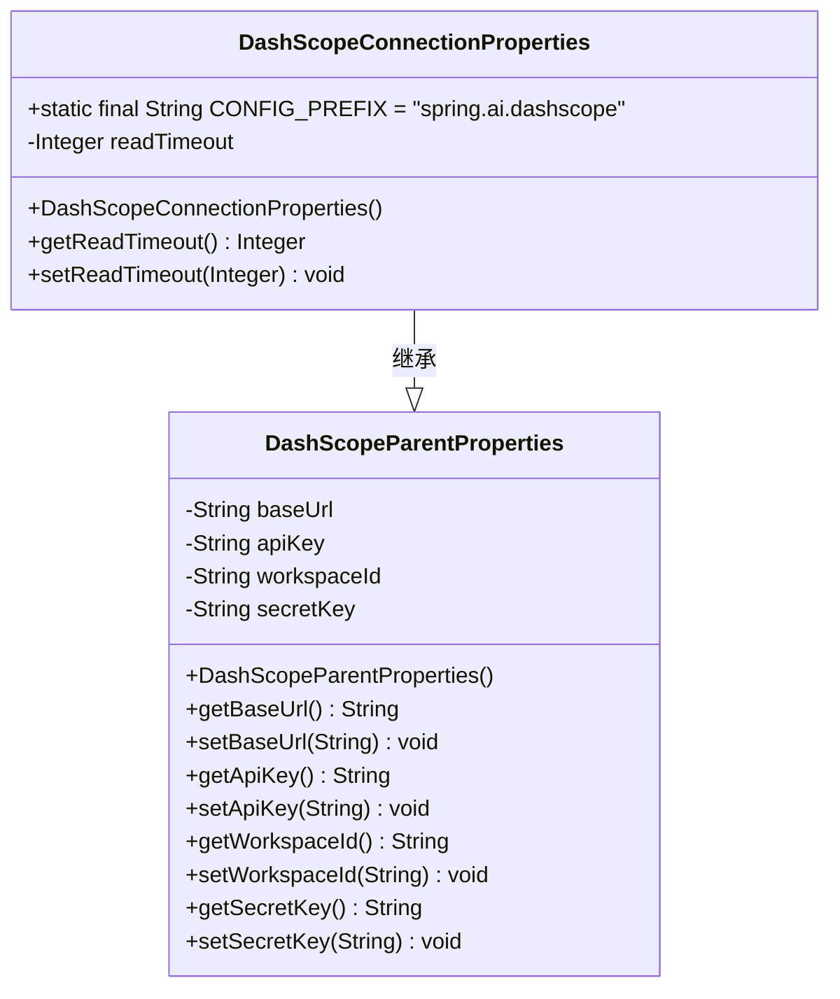
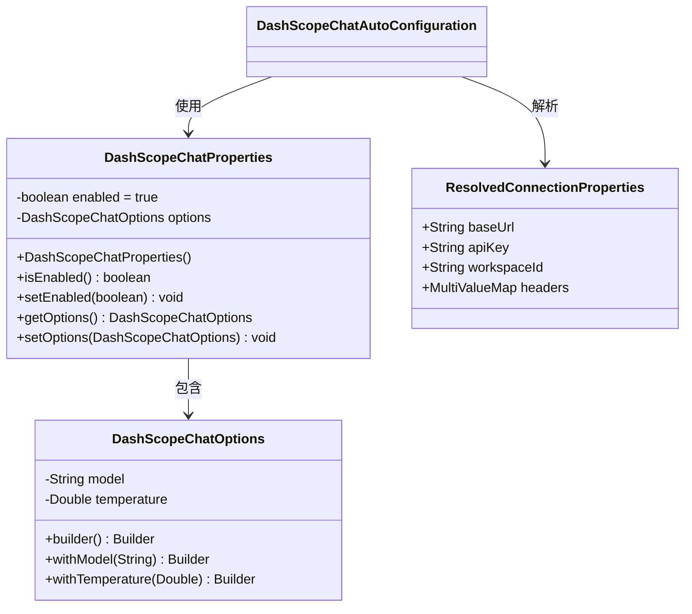
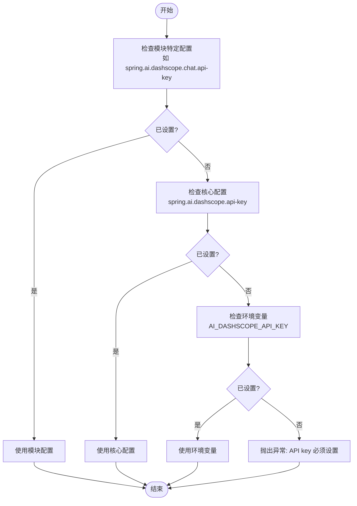

# 配置参考

<cite>
**本文档中引用的文件**   
- [additional-spring-configuration-metadata.json](file://auto-configurations/spring-ai-alibaba-autoconfigure-a2a-client/src/main/resources/META-INF/additional-spring-configuration-metadata.json)
- [spring-configuration-metadata.json](file://auto-configurations/spring-ai-alibaba-autoconfigure-dashscope/src/main/resources/META-INF/spring-configuration-metadata.json)
- [spring-configuration-metadata.json](file://auto-configurations/spring-ai-alibaba-autoconfigure-memory/src/main/resources/META-INF/spring-configuration-metadata.json)
- [spring-configuration-metadata.json](file://auto-configurations/spring-ai-alibaba-autoconfigure-mcp-registry/src/main/resources/META-INF/spring-configuration-metadata.json)
- [spring-configuration-metadata.json](file://auto-configurations/spring-ai-alibaba-autoconfigure-arms-observation/src/main/resources/META-INF/spring-configuration-metadata.json)
- [DashScopeConnectionProperties.java](file://auto-configurations/spring-ai-alibaba-autoconfigure-dashscope/src/main/java/com/alibaba/cloud/ai/autoconfigure/dashscope/DashScopeConnectionProperties.java)
- [DashScopeParentProperties.java](file://auto-configurations/spring-ai-alibaba-autoconfigure-dashscope/src/main/java/com/alibaba/cloud/ai/autoconfigure/dashscope/DashScopeParentProperties.java)
- [DashScopeChatProperties.java](file://auto-configurations/spring-ai-alibaba-autoconfigure-dashscope/src/main/java/com/alibaba/cloud/ai/autoconfigure/dashscope/DashScopeChatProperties.java)
</cite>

## 目录
1. [简介](#简介)
2. [核心配置](#核心配置)
3. [功能模块配置](#功能模块配置)
4. [内存存储配置](#内存存储配置)
5. [MCP 注册中心配置](#mcp-注册中心配置)
6. [A2A 客户端配置](#a2a-客户端配置)
7. [观察与监控配置](#观察与监控配置)
8. [配置依赖关系与冲突](#配置依赖关系与冲突)
9. [配置示例](#配置示例)
10. [动态配置修改](#动态配置修改)

## 简介
本配置参考文档旨在为 Spring AI Alibaba 框架提供一个权威的、全面的配置指南。文档系统地列出了框架中每个模块的所有可用配置选项，包括核心配置、各功能模块配置以及环境变量设置。对于每一个配置项，我们都提供了其完整路径、数据类型、默认值、有效范围和详细描述。

此外，本文档还深入解释了配置项之间的依赖关系和潜在的冲突，帮助开发者避免常见的配置错误。通过实际的配置文件示例，展示了在不同应用场景下的最佳配置实践。最后，文档说明了如何通过编程方式动态修改配置，以及配置变更的生效机制，确保开发者能够灵活地管理和调整应用行为。

## 核心配置
Spring AI Alibaba 的核心配置主要围绕 DashScope 服务的连接属性展开，这些属性定义了与阿里云通义千问大模型服务的基本通信参数。核心配置类 `DashScopeConnectionProperties` 继承自 `DashScopeParentProperties`，并使用 `@ConfigurationProperties` 注解将前缀为 `spring.ai.dashscope` 的配置项绑定到该类的实例上。

核心配置的主要作用是为所有基于 DashScope 的服务（如聊天、嵌入、图像生成等）提供统一的基础连接信息。当特定服务没有覆盖这些属性时，它们将继承核心配置中的值。这种层次化的配置结构允许开发者在全局层面设置默认值，同时在需要时为特定服务提供定制化的配置。



**图表来源**
- [DashScopeConnectionProperties.java](file://auto-configurations/spring-ai-alibaba-autoconfigure-dashscope/src/main/java/com/alibaba/cloud/ai/autoconfigure/dashscope/DashScopeConnectionProperties.java)
- [DashScopeParentProperties.java](file://auto-configurations/spring-ai-alibaba-autoconfigure-dashscope/src/main/java/com/alibaba/cloud/ai/autoconfigure/dashscope/DashScopeParentProperties.java)

**章节来源**
- [DashScopeConnectionProperties.java](file://auto-configurations/spring-ai-alibaba-autoconfigure-dashscope/src/main/java/com/alibaba/cloud/ai/autoconfigure/dashscope/DashScopeConnectionProperties.java)
- [DashScopeParentProperties.java](file://auto-configurations/spring-ai-alibaba-autoconfigure-dashscope/src/main/java/com/alibaba/cloud/ai/autoconfigure/dashscope/DashScopeParentProperties.java)

## 功能模块配置
Spring AI Alibaba 提供了多个功能模块的配置，每个模块都有其特定的配置属性，用于控制该模块的行为。这些配置通常以 `spring.ai.dashscope.<module>` 为前缀，其中 `<module>` 可以是 `chat`、`embedding`、`image`、`audio.synthesis` 等。

### 聊天模块配置
聊天模块配置 (`DashScopeChatProperties`) 控制着与通义千问聊天模型的交互。它允许开发者启用或禁用聊天客户端，并通过 `DashScopeChatOptions` 嵌套配置来微调模型的行为，例如设置模型名称、温度（temperature）等参数。



**图表来源**
- [DashScopeChatProperties.java](file://auto-configurations/spring-ai-alibaba-autoconfigure-dashscope/src/main/java/com/alibaba/cloud/ai/autoconfigure/dashscope/DashScopeChatProperties.java)
- [DashScopeChatAutoConfiguration.java](file://auto-configurations/spring-ai-alibaba-autoconfigure-dashscope/src/main/java/com/alibaba/cloud/ai/autoconfigure/dashscope/DashScopeChatAutoConfiguration.java)
- [ResolvedConnectionProperties.java](file://auto-configurations/spring-ai-alibaba-autoconfigure-dashscope/src/main/java/com/alibaba/cloud/ai/autoconfigure/dashscope/ResolvedConnectionProperties.java)

**章节来源**
- [DashScopeChatProperties.java](file://auto-configurations/spring-ai-alibaba-autoconfigure-dashscope/src/main/java/com/alibaba/cloud/ai/autoconfigure/dashscope/DashScopeChatProperties.java)

### 配置解析与优先级
在运行时，框架会通过 `DashScopeConnectionUtils` 类解析最终的连接属性。这个过程遵循一个明确的优先级顺序：首先检查模块特定的配置（如 `spring.ai.dashscope.chat.api-key`），如果未设置，则回退到核心配置（`spring.ai.dashscope.api-key`）。这确保了配置的灵活性和可重写性。



**图表来源**
- [DashScopeConnectionUtils.java](file://auto-configurations/spring-ai-alibaba-autoconfigure-dashscope/src/main/java/com/alibaba/cloud/ai/autoconfigure/dashscope/DashScopeConnectionUtils.java)

## 内存存储配置
Spring AI Alibaba 提供了多种内存存储后端的支持，允许开发者根据应用需求选择合适的持久化方案。内存存储配置主要集中在 `spring-ai-alibaba-autoconfigure-memory` 模块中，支持包括 Redis、Elasticsearch、MongoDB、各种关系型数据库（MySQL、PostgreSQL、Oracle 等）以及 Tablestore 和 Mem0。

### 主要内存存储配置项
以下表格列出了主要内存存储后端的关键配置属性：

| 配置项 | 数据类型 | 默认值 | 描述 |
| :--- | :--- | :--- | :--- |
| `spring.ai.memory.redis.host` | java.lang.String | 127.0.0.1 | Redis 服务器主机地址 |
| `spring.ai.memory.redis.port` | java.lang.Integer | 6379 | Redis 服务器端口 |
| `spring.ai.memory.redis.password` | java.lang.String | null | Redis 服务器密码 |
| `spring.ai.memory.redis.username` | java.lang.String | null | Redis 服务器用户名 |
| `spring.ai.memory.redis.timeout` | java.lang.Integer | 2000 | 连接超时时间（毫秒） |
| `spring.ai.memory.elasticsearch.host` | java.lang.String | localhost | Elasticsearch 主机 URL |
| `spring.ai.memory.elasticsearch.port` | java.lang.Integer | 9200 | Elasticsearch 端口 |
| `spring.ai.memory.elasticsearch.scheme` | java.lang.String | http | 连接协议 (http/https) |
| `spring.ai.memory.elasticsearch.nodes` | List<String> | null | 集群节点列表 (host:port) |
| `spring.ai.memory.mongodb.host` | java.lang.String | 127.0.0.1 | MongoDB 主机 URL |
| `spring.ai.memory.mongodb.port` | java.lang.Integer | 27017 | MongoDB 端口 |
| `spring.ai.memory.mongodb.database-name` | java.lang.String | spring_ai | MongoDB 数据库名称 |
| `spring.ai.memory.mongodb.user-name` | java.lang.String | null | MongoDB 用户名 |
| `spring.ai.memory.mongodb.password` | java.lang.String | null | MongoDB 密码 |
| `spring.ai.chat.memory.repository.jdbc.mysql.jdbc-url` | java.lang.String | null | MySQL JDBC URL |
| `spring.ai.chat.memory.repository.jdbc.mysql.username` | java.lang.String | null | MySQL 用户名 |
| `spring.ai.chat.memory.repository.jdbc.mysql.password` | java.lang.String | null | MySQL 密码 |

**章节来源**
- [spring-configuration-metadata.json](file://auto-configurations/spring-ai-alibaba-autoconfigure-memory/src/main/resources/META-INF/spring-configuration-metadata.json)

### Mem0 高级记忆配置
Mem0 是一个更高级的记忆管理解决方案，其配置分为客户端和服务端两部分。客户端配置主要涉及连接信息，而服务端配置则定义了底层向量存储和图存储的提供商及具体参数。

| 配置项 | 数据类型 | 默认值 | 描述 |
| :--- | :--- | :--- | :--- |
| `spring.ai.alibaba.mem0.client.base-url` | java.lang.String | http://localhost:8888 | Mem0 客户端服务基础 URL |
| `spring.ai.alibaba.mem0.client.timeout-seconds` | java.lang.Integer | 30 | 客户端操作超时时间（秒） |
| `spring.ai.alibaba.mem0.server.vector-store.provider` | java.lang.String | null | 向量存储提供商 (qdrant, chroma, pgvector 等) |
| `spring.ai.alibaba.mem0.server.vector-store.config` | Map<String, String> | null | 向量存储提供商的配置映射 |
| `spring.ai.alibaba.mem0.server.graph-store.provider` | java.lang.String | null | 图存储提供商 |
| `spring.ai.alibaba.mem0.server.graph-store.config.url` | java.lang.String | null | 图存储连接 URL |

**章节来源**
- [spring-configuration-metadata.json](file://auto-configurations/spring-ai-alibaba-autoconfigure-memory/src/main/resources/META-INF/spring-configuration-metadata.json)

## MCP 注册中心配置
MCP (Multi-Agent Collaboration Protocol) 注册中心配置用于管理多智能体系统中的服务发现和注册。该配置主要通过 Nacos 作为注册中心来实现。

### MCP 注册中心关键配置
| 配置项 | 数据类型 | 默认值 | 描述 |
| :--- | :--- | :--- | :--- |
| `spring.ai.alibaba.mcp.nacos.server-addr` | java.lang.String | localhost:8848 | Nacos 服务器地址 |
| `spring.ai.alibaba.mcp.nacos.namespace` | java.lang.String | public | Nacos 命名空间 |
| `spring.ai.alibaba.mcp.nacos.username` | java.lang.String | "" | Nacos 用户名 |
| `spring.ai.alibaba.mcp.nacos.password` | java.lang.String | "" | Nacos 密码 |
| `spring.ai.alibaba.mcp.nacos.register.enabled` | java.lang.Boolean | false | 是否将 MCP 服务器服务注册到 Nacos |
| `spring.ai.alibaba.mcp.nacos.register.service-name` | java.lang.String | mcp-server | MCP 服务器服务名称 |
| `spring.ai.mcp.server.enabled` | java.lang.Boolean | true | 是否启用 MCP 服务器 |
| `spring.ai.mcp.client.type` | java.lang.String | SYNC | MCP 客户端类型 (SYNC 或 ASYNC) |

**章节来源**
- [spring-configuration-metadata.json](file://auto-configurations/spring-ai-alibaba-autoconfigure-mcp-registry/src/main/resources/META-INF/spring-configuration-metadata.json)

## A2A 客户端配置
A2A (Agent-to-Agent) 客户端配置用于定义智能体卡（Agent Card）的元数据，这些元数据描述了智能体的能力、接口和安全要求。

### A2A 客户端配置项
| 配置项 | 数据类型 | 默认值 | 描述 |
| :--- | :--- | :--- | :--- |
| `spring.ai.alibaba.a2a.client.card.name` | java.lang.String | null | 智能体的名称 |
| `spring.ai.alibaba.a2a.client.card.description` | java.lang.String | null | 智能体的描述 |
| `spring.ai.alibaba.a2a.client.card.url` | java.lang.String | null | 智能体的 URL |
| `spring.ai.alibaba.a2a.client.card.provider` | io.a2a.spec.AgentProvider | null | 智能体的提供商信息 |
| `spring.ai.alibaba.a2a.client.card.capabilities` | AgentCapabilities | null | 智能体的能力 |
| `spring.ai.alibaba.a2a.client.card.skills` | List<AgentSkill> | null | 智能体的技能 |
| `spring.ai.alibaba.a2a.client.card.supports-authenticated-extended-card` | java.lang.Boolean | false | 是否支持认证扩展卡 |
| `spring.ai.alibaba.a2a.client.card.security-schemes` | Map<String, SecurityScheme> | null | 智能体的安全方案 |
| `spring.ai.alibaba.a2a.client.card.version` | java.lang.String | null | 智能体的版本 |
| `spring.ai.alibaba.a2a.client.card.preferred-transport` | java.lang.String | null | 智能体的首选传输协议 (JSONRPC, GRPC, HTTP+JSON) |

**章节来源**
- [additional-spring-configuration-metadata.json](file://auto-configurations/spring-ai-alibaba-autoconfigure-a2a-client/src/main/resources/META-INF/additional-spring-configuration-metadata.json)

## 观察与监控配置
观察与监控配置用于集成阿里巴巴的 ARMS (Application Real-Time Monitoring Service) 来进行应用性能监控和追踪。

### 观察与监控配置项
| 配置项 | 数据类型 | 默认值 | 描述 |
| :--- | :--- | :--- | :--- |
| `spring.ai.alibaba.arms.enabled` | java.lang.Boolean | false | 是否启用 ARMS 仪器化和约定 |

**章节来源**
- [spring-configuration-metadata.json](file://auto-configurations/spring-ai-alibaba-autoconfigure-arms-observation/src/main/resources/META-INF/spring-configuration-metadata.json)

## 配置依赖关系与冲突
理解配置项之间的依赖关系对于构建稳定的应用至关重要。Spring AI Alibaba 的配置设计遵循了清晰的层次结构和优先级规则，但也存在一些潜在的冲突点需要注意。

### 依赖关系
1.  **继承依赖**: 所有功能模块（如 `chat`, `embedding`）的连接属性都依赖于核心的 `DashScopeConnectionProperties`。如果模块未指定自己的 `api-key` 或 `base-url`，则会自动使用核心配置中的值。
2.  **条件依赖**: 许多配置项的存在依赖于其他配置项的启用状态。例如，只有当 `spring.ai.memory.redis.mode` 设置为 `cluster` 时，`spring.ai.memory.redis.cluster.nodes` 配置项才具有意义。
3.  **组件依赖**: 启用某些功能（如 MCP 服务器）可能依赖于底层基础设施的配置。例如，启用 `spring.ai.alibaba.mcp.nacos.register.enabled` 需要先正确配置 `spring.ai.alibaba.mcp.nacos.server-addr`。

### 潜在冲突
1.  **优先级冲突**: 当同一个配置项在多个层级被定义时，可能会产生混淆。例如，`spring.ai.dashscope.api-key` (核心) 和 `spring.ai.dashscope.chat.api-key` (模块)。虽然框架有明确的优先级（模块 > 核心），但开发者应避免不必要的重复配置以提高可读性。
2.  **资源竞争**: 在配置多个内存后端时，如果没有明确指定使用哪一个，可能会导致不确定的行为。建议在生产环境中只启用一个主要的内存后端。
3.  **版本不兼容**: `spring.ai.alibaba.a2a.client.card.protocol-version` 和 `spring.ai.alibaba.mem0.server.version` 等版本配置项必须与所连接的服务端版本兼容，否则会导致通信失败。

## 配置示例
以下是几个典型的配置文件示例，展示了在不同场景下的最佳实践。

### 示例 1: 基础 DashScope 配置
```yaml
spring:
  ai:
    dashscope:
      api-key: your-api-key-here
      base-url: https://dashscope.aliyuncs.com/api/v1
      # 全局读取超时
      read-timeout: 30000
```

### 示例 2: 自定义聊天模型配置
```yaml
spring:
  ai:
    dashscope:
      api-key: your-api-key-here
      base-url: https://dashscope.aliyuncs.com/api/v1
      
      chat:
        # 覆盖全局API key
        api-key: specific-chat-api-key
        # 启用聊天客户端
        enabled: true
        options:
          # 使用不同的模型
          model: qwen-max
          # 调整创造性
          temperature: 0.7
```

### 示例 3: Redis 内存存储配置
```yaml
spring:
  ai:
    memory:
      redis:
        host: redis.example.com
        port: 6379
        password: your-redis-password
        timeout: 5000
        mode: standalone # 或 cluster
```

### 示例 4: MCP 与 Nacos 集成配置
```yaml
spring:
  ai:
    mcp:
      server:
        enabled: true
      client:
        type: ASYNC
        
    alibaba:
      mcp:
        nacos:
          server-addr: nacos.example.com:8848
          namespace: production
          username: mcp-user
          password: mcp-password
          register:
            enabled: true
            service-name: my-mcp-service
```

## 动态配置修改
Spring AI Alibaba 支持通过编程方式动态修改配置。这通常是通过实现 `ConfigService` 类来完成的，该类可以监听配置变化并更新相应的 `@ConfigurationProperties` Bean。

### 配置变更生效机制
1.  **Bean 更新**: 当配置发生变化时，`ConfigService` 会找到所有带有 `@ConfigurationProperties` 注解的 Bean，并通过反射更新其字段值。
2.  **缓存失效**: 修改后的配置会立即更新到应用的内部缓存中，确保后续的请求能获取到最新的配置。
3.  **事件驱动**: 系统可以发布配置变更事件，允许其他组件订阅并做出相应反应。

此机制确保了配置的实时性和灵活性，使得应用能够在不重启的情况下适应环境变化。

**章节来源**
- [ConfigService.java](file://spring-ai-alibaba-jmanus/src/main/java/com/alibaba/cloud/ai/manus/config/ConfigService.java)