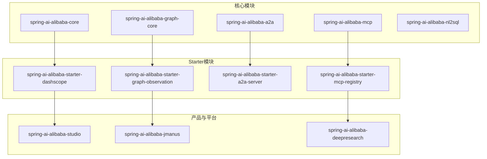
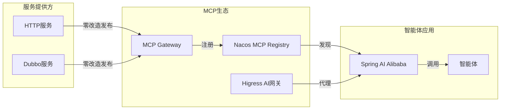
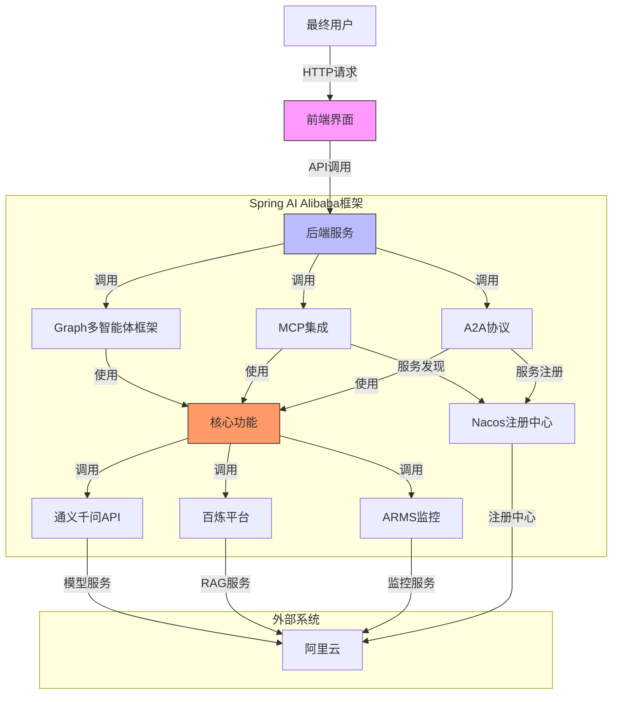
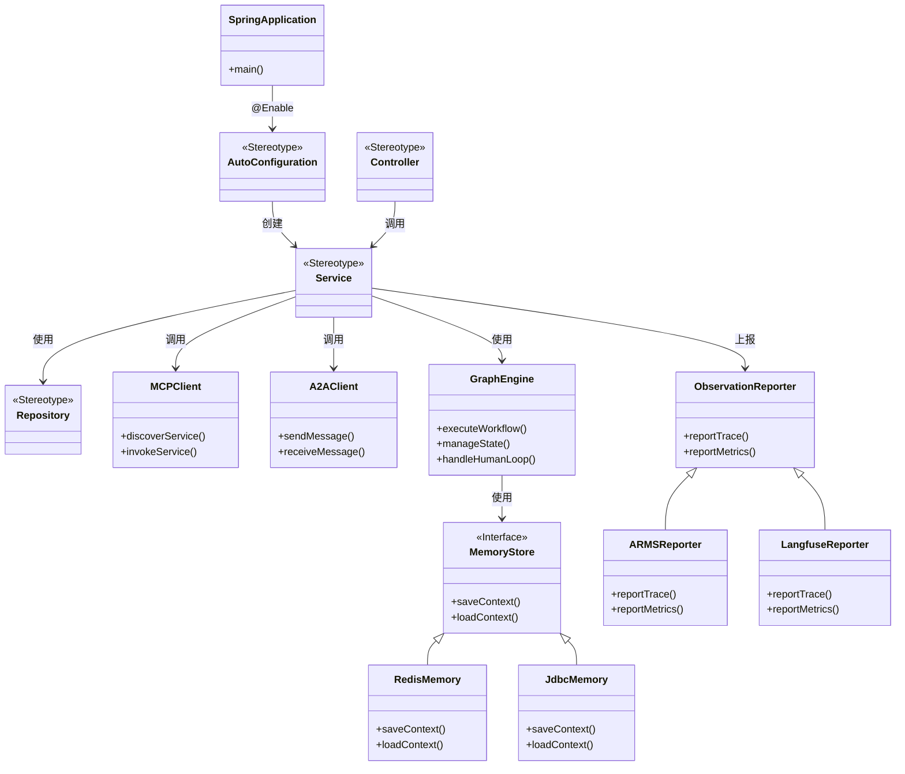

# 项目概述

<cite>
**本文档引用的文件**
- [README.md](file://README.md)
- [README-zh.md](file://README-zh.md)
- [pom.xml](file://pom.xml)
- [spring-ai-alibaba-core/pom.xml](file://spring-ai-alibaba-core/pom.xml)
- [spring-ai-alibaba-a2a/pom.xml](file://spring-ai-alibaba-a2a/pom.xml)
- [spring-ai-alibaba-mcp/pom.xml](file://spring-ai-alibaba-mcp/pom.xml)
- [spring-ai-alibaba-graph-core/pom.xml](file://spring-ai-alibaba-graph-core/pom.xml)
- [spring-ai-alibaba-spring-boot-starters/spring-ai-alibaba-starter-dashscope/pom.xml](file://spring-ai-alibaba-spring-boot-starters/spring-ai-alibaba-starter-dashscope/pom.xml)
- [spring-ai-alibaba-spring-boot-starters/spring-ai-alibaba-starter-graph-observation/pom.xml](file://spring-ai-alibaba-spring-boot-starters/spring-ai-alibaba-starter-graph-observation/pom.xml)
- [spring-ai-alibaba-spring-boot-starters/spring-ai-alibaba-starter-a2a-server/pom.xml](file://spring-ai-alibaba-spring-boot-starters/spring-ai-alibaba-starter-a2a-server/pom.xml)
- [spring-ai-alibaba-spring-boot-starters/spring-ai-alibaba-starter-mcp-registry/pom.xml](file://spring-ai-alibaba-spring-boot-starters/spring-ai-alibaba-starter-mcp-registry/pom.xml)
- [auto-configurations/spring-ai-alibaba-autoconfigure-dashscope/src/main/java/com/alibaba/cloud/ai/autoconfigure/dashscope/DashScopeChatAutoConfiguration.java](file://auto-configurations/spring-ai-alibaba-autoconfigure-dashscope/src/main/java/com/alibaba/cloud/ai/autoconfigure/dashscope/DashScopeChatAutoConfiguration.java)
</cite>

## 目录
1. [简介](#简介)
2. [核心特性](#核心特性)
3. [架构设计](#架构设计)
4. [Graph多智能体框架](#graph多智能体框架)
5. [企业级AI生态系统集成](#企业级ai生态系统集成)
6. [A2A协议与MCP集成](#a2a协议与mcp集成)
7. [通用智能体产品与平台](#通用智能体产品与平台)
8. [实际应用场景](#实际应用场景)
9. [系统上下文图](#系统上下文图)
10. [组件分解图](#组件分解图)

## 简介

Spring AI Alibaba 是一个基于 Spring AI 的企业级 AI 框架，旨在深度集成阿里云百炼平台，支持构建聊天机器人、工作流和多智能体应用。该项目为开发者提供了一套完整的工具链，帮助快速开发具备自主规划能力的通用智能体产品与平台。

该框架通过与百炼平台的深度集成，提供了模型接入、RAG知识库解决方案，并支持与ARMS、Langfuse等AI可观测性产品的无缝对接。同时，框架还支持企业级的MCP（Model Context Protocol）集成，包括Nacos MCP Registry的分布式注册与发现、自动路由等功能。

**Section sources**
- [README.md](file://README.md)
- [README-zh.md](file://README-zh.md)

## 核心特性

Spring AI Alibaba 提供了三大核心能力：

1. **Graph多智能体框架**：基于Spring AI Alibaba Graph，开发者可以快速构建工作流和多智能体应用，无需关心流程编排、上下文记忆管理等底层实现。支持Dify DSL自动生成Graph代码，支持可视化调试。
2. **企业级AI生态系统集成**：解决企业智能体落地过程中的痛点问题，包括与百炼平台的深度集成、AI可观测性产品接入、企业级MCP集成等。
3. **通用智能体产品与平台**：探索具备自主规划能力的通用智能体产品与平台，为开发者提供从低代码到零代码构建智能体的灵活选择。

框架要求JDK 17及以上版本运行，并通过BOM（Bill of Materials）方式管理依赖版本，确保依赖的一致性和稳定性。

**Section sources**
- [README.md](file://README.md)
- [README-zh.md](file://README-zh.md)
- [pom.xml](file://pom.xml)

## 架构设计

Spring AI Alibaba 采用模块化设计，主要由以下几个核心模块组成：

- **spring-ai-alibaba-core**：核心模块，提供DashScope与Spring AI的集成实现
- **spring-ai-alibaba-graph-core**：Graph多智能体框架核心
- **spring-ai-alibaba-mcp**：MCP协议相关实现
- **spring-ai-alibaba-a2a**：A2A协议相关实现
- **spring-ai-alibaba-nl2sql**：自然语言到SQL转换功能
- **spring-ai-alibaba-studio**：智能体开发平台
- **spring-ai-alibaba-jmanus**：通用智能体平台
- **spring-ai-alibaba-deepresearch**：深度研究智能体

这些模块通过Spring Boot Starter的方式提供给开发者使用，每个Starter都包含了相应的自动配置功能，简化了集成过程。



**Diagram sources**
- [pom.xml](file://pom.xml)
- [spring-ai-alibaba-core/pom.xml](file://spring-ai-alibaba-core/pom.xml)
- [spring-ai-alibaba-graph-core/pom.xml](file://spring-ai-alibaba-graph-core/pom.xml)

**Section sources**
- [pom.xml](file://pom.xml)

## Graph多智能体框架

Spring AI Alibaba Graph 是一个用于构建有状态、多参与者应用程序的库，其核心设计理念参考自LangGraph。该框架使开发者能够实现工作流和多智能体应用的编排。

### 核心能力

- **工作流支持**：内置工作流节点，与主流低代码平台对齐
- **多智能体模式**：内置ReAct Agent、Supervisor等模式
- **流式传输**：原生支持流式响应
- **人机协作**：支持人类确认节点，可修改状态并恢复执行
- **记忆与持久化**：支持上下文记忆和持久存储
- **流程快照**：支持Graph状态快照
- **复杂流程**：支持嵌套分支和并行分支
- **可视化导出**：支持PlantUML和Mermaid格式导出

该框架通过预置大量Node节点，简化了State定义过程，让开发者能够更好地与低代码平台集成，编写主流的多智能体应用模式。

**Section sources**
- [README.md](file://README.md)
- [README-zh.md](file://README-zh.md)

## 企业级AI生态系统集成

Spring AI Alibaba 通过与多个企业级服务的深度集成，解决了智能体从Demo到生产落地过程中的各种挑战。

### 集成方案

1. **百炼平台集成**：
   - 模型服务：通过百炼平台接入大模型服务
   - RAG知识库：利用百炼平台的数据清洗、切片、向量化能力，结合Spring AI Alibaba实现RAG检索
   - ChatBI：基于百炼析言ChatBI技术，实现自然语言到SQL的自动生成

2. **可观测性集成**：
   - 支持OpenTelemetry格式的tracing上报
   - 可接入Langfuse、阿里云ARMS等平台进行效果评估和监控

3. **AI网关集成**：
   - 使用Higress作为大模型代理
   - `spring-ai-starter-model-openai`可通过OpenAI标准接口接入Higress代理服务

4. **数据整合**：
   - 降低企业数据整合成本
   - 提升AI数据应用效果

这种集成方案使得企业能够将智能体从概念验证快速推进到生产环境，解决了评估、追踪、工具集成、提示词管理、Token限制等一系列实际问题。

**Section sources**
- [README.md](file://README.md)
- [README-zh.md](file://README-zh.md)

## A2A协议与MCP集成

### A2A协议

A2A（Agent-to-Agent）协议是Spring AI Alibaba中用于智能体间通信的重要协议。框架提供了完整的A2A协议支持，包括：

- **A2A Server**：提供A2A服务端实现
- **A2A Client**：提供A2A客户端实现
- **A2A Registry**：基于Nacos的A2A注册中心

通过`spring-ai-alibaba-starter-a2a-server`等Starter，开发者可以快速构建支持A2A协议的智能体应用。

### MCP集成

MCP（Model Context Protocol）是另一种重要的集成协议，Spring AI Alibaba提供了全面的企业级MCP解决方案：

1. **分布式发现与代理**：
   - 基于Nacos MCP Registry的分布式服务发现和负载均衡
   - 通过Spring AI Alibaba MCP Gateway和Higress，可实现零改造将HTTP/Dubbo服务发布为MCP服务

2. **MCP Router**：
   - 自动路由功能
   - 支持多种路由策略

3. **MCP Registry**：
   - 服务注册与发现
   - 健康检查

这些集成能力使得企业现有的服务可以轻松地被智能体调用，大大扩展了智能体的能力边界。



**Diagram sources**
- [spring-ai-alibaba-mcp/pom.xml](file://spring-ai-alibaba-mcp/pom.xml)
- [spring-ai-alibaba-a2a/pom.xml](file://spring-ai-alibaba-a2a/pom.xml)
- [spring-ai-alibaba-spring-boot-starters/spring-ai-alibaba-starter-a2a-server/pom.xml](file://spring-ai-alibaba-spring-boot-starters/spring-ai-alibaba-starter-a2a-server/pom.xml)
- [spring-ai-alibaba-spring-boot-starters/spring-ai-alibaba-starter-mcp-registry/pom.xml](file://spring-ai-alibaba-spring-boot-starters/spring-ai-alibaba-starter-mcp-registry/pom.xml)

**Section sources**
- [README.md](file://README.md)
- [README-zh.md](file://README-zh.md)

## 通用智能体产品与平台

### JManus智能体平台

JManus是基于Spring AI Alibaba框架实现的通用智能体平台，不仅对标Manus等通用智能体的产品能力，更致力于成为智能体开发平台，让用户能以最直观、低成本的方式构建属于自己的垂直领域智能体。

平台特点：
- 支持精细的计划调整
- 支持计划复用
- 针对企业场景的确定性需求，提供定制化工具和子智能体
- 稳定且确定性强的规划与流程

### DeepResearch智能体

DeepResearch是一款基于Spring AI Alibaba Graph开发的深度研究智能体，包含完整的前端Web UI（开发中）和后端实现。该智能体支持一系列精心设计的工具，如：

- Web Search（网络查询）
- Crawling（爬虫）
- Python脚本引擎
- MCP服务集成

借助大模型与这些工具的能力，DeepResearch可以帮助用户完成各类深度调研报告，是通用智能体在特定领域的优秀实践案例。

**Section sources**
- [README.md](file://README.md)
- [README-zh.md](file://README-zh.md)

## 实际应用场景

### ChatBot开发

通过引入`spring-ai-alibaba-starter-dashscope`依赖，开发者可以快速构建聊天机器人应用：

```xml
<dependencyManagement>
  <dependencies>
    <dependency>
      <groupId>com.alibaba.cloud.ai</groupId>
      <artifactId>spring-ai-alibaba-bom</artifactId>
      <version>1.0.0.3</version>
      <type>pom</type>
      <scope>import</scope>
    </dependency>
  </dependencies>
</dependencyManagement>

<dependencies>
  <dependency>
    <groupId>com.alibaba.cloud.ai</groupId>
    <artifactId>spring-ai-alibaba-starter-dashscope</artifactId>
  </dependency>
</dependencies>
```

### 工作流编排

利用Spring AI Alibaba Graph，可以轻松实现复杂的工作流编排，例如：

1. 用户输入自然语言查询
2. 系统分析查询意图
3. 调用适当的工具（搜索、数据库查询等）
4. 整合结果并生成最终回答
5. 支持人工干预和状态修改

### 多智能体协作

通过A2A协议和MCP集成，可以构建多智能体协作系统：

- 不同智能体负责不同专业领域
- 智能体间通过标准化协议通信
- 主控智能体协调各专业智能体完成复杂任务
- 所有交互过程可追踪、可观测

**Section sources**
- [README.md](file://README.md)
- [README-zh.md](file://README-zh.md)
- [auto-configurations/spring-ai-alibaba-autoconfigure-dashscope/src/main/java/com/alibaba/cloud/ai/autoconfigure/dashscope/DashScopeChatAutoConfiguration.java](file://auto-configurations/spring-ai-alibaba-autoconfigure-dashscope/src/main/java/com/alibaba/cloud/ai/autoconfigure/dashscope/DashScopeChatAutoConfiguration.java)

## 系统上下文图



**Diagram sources**
- [README.md](file://README.md)
- [README-zh.md](file://README-zh.md)

## 组件分解图



**Diagram sources**
- [spring-ai-alibaba-core/pom.xml](file://spring-ai-alibaba-core/pom.xml)
- [spring-ai-alibaba-graph-core/pom.xml](file://spring-ai-alibaba-graph-core/pom.xml)
- [spring-ai-alibaba-mcp/pom.xml](file://spring-ai-alibaba-mcp/pom.xml)
- [spring-ai-alibaba-a2a/pom.xml](file://spring-ai-alibaba-a2a/pom.xml)