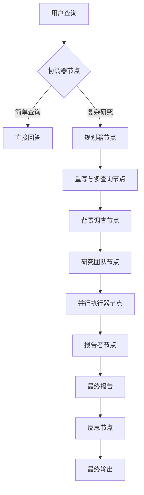
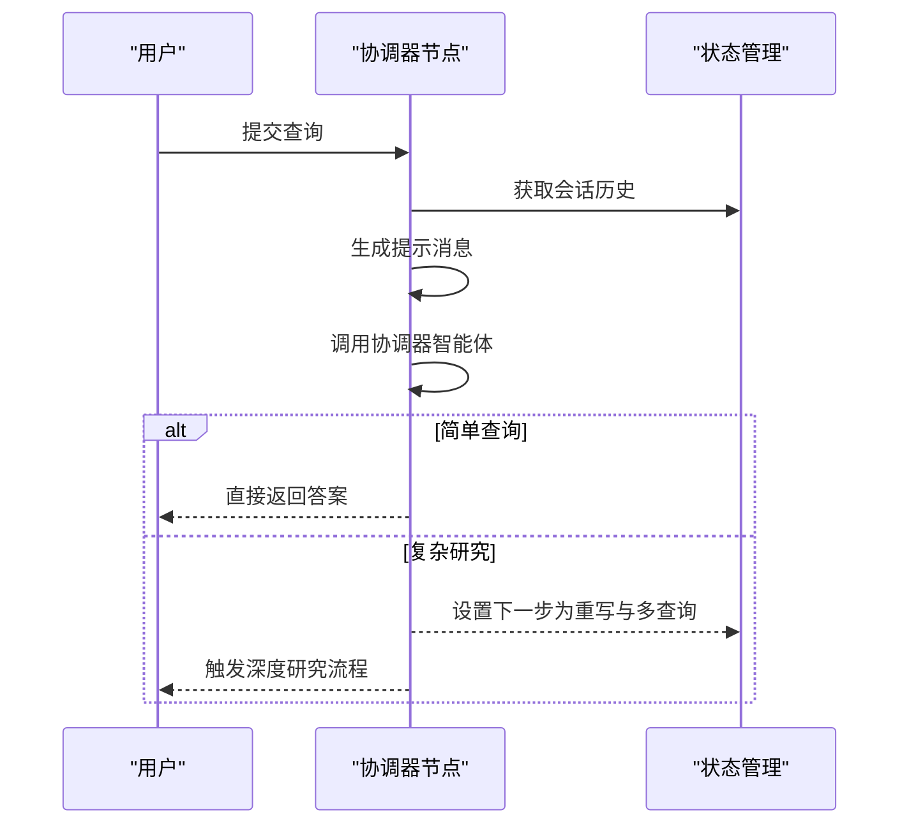
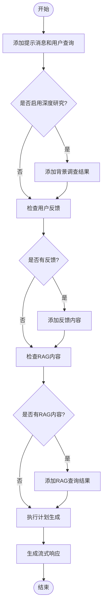
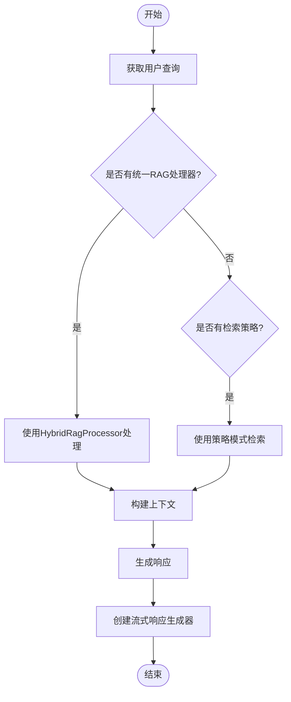
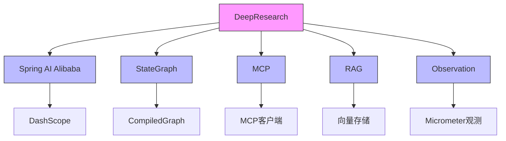

# DeepResearch深度研究代理

<cite>
**本文档引用的文件**  
- [DeepResearchApplication.java](file://spring-ai-alibaba-deepresearch/src/main/java/com/alibaba/cloud/ai/example/deepresearch/DeepResearchApplication.java)
- [AgentsConfiguration.java](file://spring-ai-alibaba-deepresearch/src/main/java/com/alibaba/cloud/ai/example/deepresearch/agents/AgentsConfiguration.java)
- [CoordinatorNode.java](file://spring-ai-alibaba-deepresearch/src/main/java/com/alibaba/cloud/ai/example/deepresearch/node/CoordinatorNode.java)
- [PlannerNode.java](file://spring-ai-alibaba-deepresearch/src/main/java/com/alibaba/cloud/ai/example/deepresearch/node/PlannerNode.java)
- [RagNode.java](file://spring-ai-alibaba-deepresearch/src/main/java/com/alibaba/cloud/ai/example/deepresearch/node/RagNode.java)
- [McpAssignNodeConfiguration.java](file://spring-ai-alibaba-deepresearch/src/main/java/com/alibaba/cloud/ai/example/deepresearch/agents/McpAssignNodeConfiguration.java)
- [ObservationConfiguration.java](file://spring-ai-alibaba-deepresearch/src/main/java/com/alibaba/cloud/ai/example/deepresearch/agents/ObservationConfiguration.java)
- [application.yml](file://spring-ai-alibaba-deepresearch/src/main/resources/application.yml)
- [AgentType.java](file://spring-ai-alibaba-deepresearch/src/main/java/com/alibaba/cloud/ai/example/deepresearch/model/multiagent/AgentType.java)
- [researcher.md](file://spring-ai-alibaba-deepresearch/src/main/resources/prompts/researcher.md)
</cite>

## 目录
1. [简介](#简介)
2. [项目结构](#项目结构)
3. [核心组件](#核心组件)
4. [架构概述](#架构概述)
5. [详细组件分析](#详细组件分析)
6. [依赖分析](#依赖分析)
7. [性能考虑](#性能考虑)
8. [故障排除指南](#故障排除指南)
9. [结论](#结论)

## 简介
DeepResearch深度研究代理是一个基于Spring AI Alibaba框架构建的多智能体工作流系统，专为处理复杂的研究任务而设计。该系统通过StateGraph编排机制协调多个AI智能体，实现复杂任务的分解、信息检索和报告生成。它支持流式响应、RAG（检索增强生成）和MCP（模型控制协议）集成，为开发者提供了一个强大的AI工作流框架。

## 项目结构
DeepResearch项目采用模块化设计，主要包含后端服务和前端UI两个部分。后端基于Spring Boot构建，实现了多智能体协作的核心逻辑；前端采用Vue3技术栈，提供了用户友好的交互界面。

```mermaid
graph TD
subgraph "后端服务"
A[DeepResearchApplication] --> B[AgentsConfiguration]
A --> C[Node节点]
A --> D[Service服务]
A --> E[Controller控制器]
end
subgraph "前端UI"
F[Vue3应用] --> G[Chat组件]
F --> H[Config组件]
F --> I[Knowledge组件]
end
A < --> F
```

**图表来源**
- [DeepResearchApplication.java](file://spring-ai-alibaba-deepresearch/src/main/java/com/alibaba/cloud/ai/example/deepresearch/DeepResearchApplication.java)
- [ui-vue3/package.json](file://spring-ai-alibaba-deepresearch/ui-vue3/package.json)

**本节来源**
- [DeepResearchApplication.java](file://spring-ai-alibaba-deepresearch/src/main/java/com/alibaba/cloud/ai/example/deepresearch/DeepResearchApplication.java)
- [ui-vue3/package.json](file://spring-ai-alibaba-deepresearch/ui-vue3/package.json)

## 核心组件
DeepResearch的核心组件包括多智能体系统、StateGraph编排器、RAG引擎和MCP集成模块。这些组件协同工作，实现了从任务接收、分解、执行到报告生成的完整工作流。

**本节来源**
- [AgentsConfiguration.java](file://spring-ai-alibaba-deepresearch/src/main/java/com/alibaba/cloud/ai/example/deepresearch/agents/AgentsConfiguration.java)
- [application.yml](file://spring-ai-alibaba-deepresearch/src/main/resources/application.yml)

## 架构概述
DeepResearch采用基于StateGraph的多智能体工作流架构，通过状态机的方式编排多个AI智能体的协作。系统接收用户查询后，首先由协调器智能体决定工作流走向，然后由规划器智能体制定详细的研究计划，最后由研究者、编码者、报告者等多个专业智能体并行执行任务。



**图表来源**
- [CoordinatorNode.java](file://spring-ai-alibaba-deepresearch/src/main/java/com/alibaba/cloud/ai/example/deepresearch/node/CoordinatorNode.java)
- [PlannerNode.java](file://spring-ai-alibaba-deepresearch/src/main/java/com/alibaba/cloud/ai/example/deepresearch/node/PlannerNode.java)
- [RagNode.java](file://spring-ai-alibaba-deepresearch/src/main/java/com/alibaba/cloud/ai/example/deepresearch/node/RagNode.java)

## 详细组件分析

### 协调器节点分析
协调器节点是DeepResearch工作流的入口点，负责判断用户查询的复杂程度并决定后续工作流的走向。如果查询较为简单，协调器会直接生成回答；如果查询需要深入研究，它会触发复杂的研究工作流。



**图表来源**
- [CoordinatorNode.java](file://spring-ai-alibaba-deepresearch/src/main/java/com/alibaba/cloud/ai/example/deepresearch/node/CoordinatorNode.java)

**本节来源**
- [CoordinatorNode.java](file://spring-ai-alibaba-deepresearch/src/main/java/com/alibaba/cloud/ai/example/deepresearch/node/CoordinatorNode.java)

### 规划器节点分析
规划器节点负责制定详细的研究计划，它接收用户查询和背景调查结果，生成一个结构化的研究方案。该节点支持流式响应，可以实时向用户反馈计划制定的进度。



**图表来源**
- [PlannerNode.java](file://spring-ai-alibaba-deepresearch/src/main/java/com/alibaba/cloud/ai/example/deepresearch/node/PlannerNode.java)

**本节来源**
- [PlannerNode.java](file://spring-ai-alibaba-deepresearch/src/main/java/com/alibaba/cloud/ai/example/deepresearch/node/PlannerNode.java)

### RAG节点分析
RAG节点实现了检索增强生成功能，通过整合多种检索策略和融合策略，从知识库中获取相关信息并生成回答。该节点支持传统的策略模式和统一的HybridRagProcessor两种实现方式。



**图表来源**
- [RagNode.java](file://spring-ai-alibaba-deepresearch/src/main/java/com/alibaba/cloud/ai/example/deepresearch/node/RagNode.java)

**本节来源**
- [RagNode.java](file://spring-ai-alibaba-deepresearch/src/main/java/com/alibaba/cloud/ai/example/deepresearch/node/RagNode.java)

## 依赖分析
DeepResearch系统依赖于多个核心模块和外部服务，这些依赖关系确保了系统的功能完整性和扩展性。



**图表来源**
- [AgentsConfiguration.java](file://spring-ai-alibaba-deepresearch/src/main/java/com/alibaba/cloud/ai/example/deepresearch/agents/AgentsConfiguration.java)
- [application.yml](file://spring-ai-alibaba-deepresearch/src/main/resources/application.yml)

**本节来源**
- [AgentsConfiguration.java](file://spring-ai-alibaba-deepresearch/src/main/java/com/alibaba/cloud/ai/example/deepresearch/agents/AgentsConfiguration.java)
- [application.yml](file://spring-ai-alibaba-deepresearch/src/main/resources/application.yml)

## 性能考虑
在设计和使用DeepResearch系统时，需要考虑以下几个性能方面：

1. **流式响应优化**：系统采用流式响应机制，可以实时向用户反馈处理进度，提升用户体验。
2. **并行执行**：研究团队节点支持并行执行多个子任务，充分利用计算资源。
3. **缓存策略**：通过配置Redis等缓存服务，可以减少重复查询的开销。
4. **超时控制**：对RAG等耗时操作设置了超时机制，防止请求长时间挂起。
5. **重试机制**：关键操作支持重试，提高系统的容错能力。

## 故障排除指南
在使用DeepResearch系统时，可能会遇到以下常见问题：

1. **MCP工具未加载**：检查`mcp-config.json`配置文件是否正确，确保MCP服务已启用。
2. **RAG检索失败**：确认向量存储服务是否正常运行，检查数据加载路径配置。
3. **流式响应中断**：检查网络连接，确保服务器和客户端之间的连接稳定。
4. **智能体响应不准确**：检查提示模板是否正确，确认使用的模型具有足够的能力。
5. **性能瓶颈**：监控系统资源使用情况，考虑增加并行执行的节点数量。

**本节来源**
- [McpAssignNodeConfiguration.java](file://spring-ai-alibaba-deepresearch/src/main/java/com/alibaba/cloud/ai/example/deepresearch/agents/McpAssignNodeConfiguration.java)
- [RagNode.java](file://spring-ai-alibaba-deepresearch/src/main/java/com/alibaba/cloud/ai/example/deepresearch/node/RagNode.java)
- [application.yml](file://spring-ai-alibaba-deepresearch/src/main/resources/application.yml)

## 结论
DeepResearch深度研究代理提供了一个功能强大且灵活的多智能体工作流框架，通过StateGraph编排机制实现了复杂任务的自动化处理。系统集成了RAG、MCP和观测功能，支持流式响应和并行执行，为构建复杂的AI应用提供了坚实的基础。开发者可以根据具体需求定制智能体、调整工作流和集成新的工具，从而创建出满足特定场景的智能研究系统。