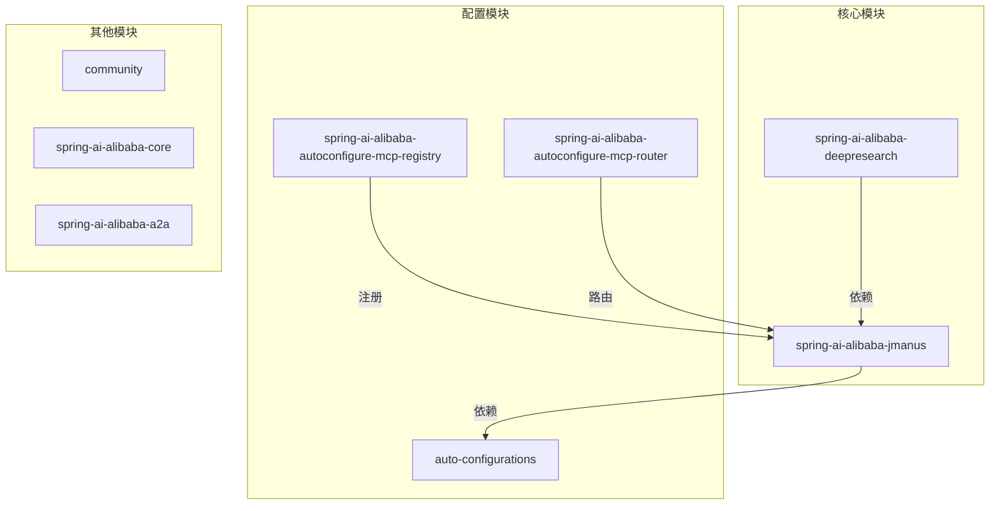
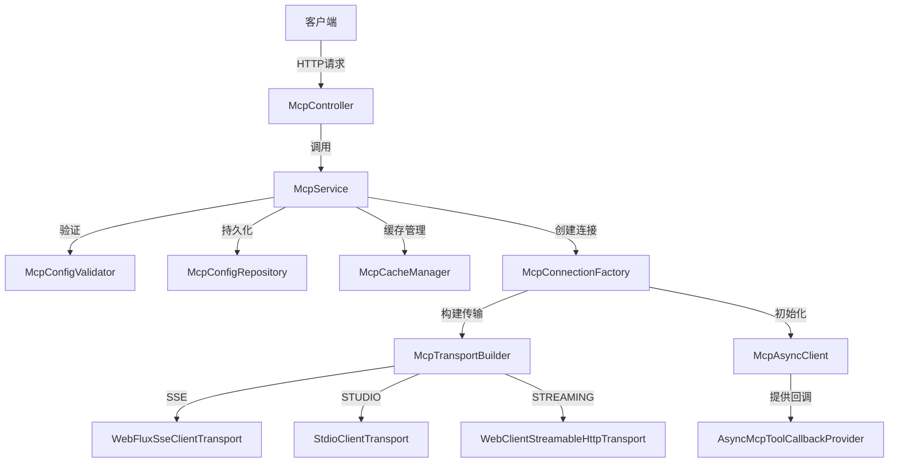
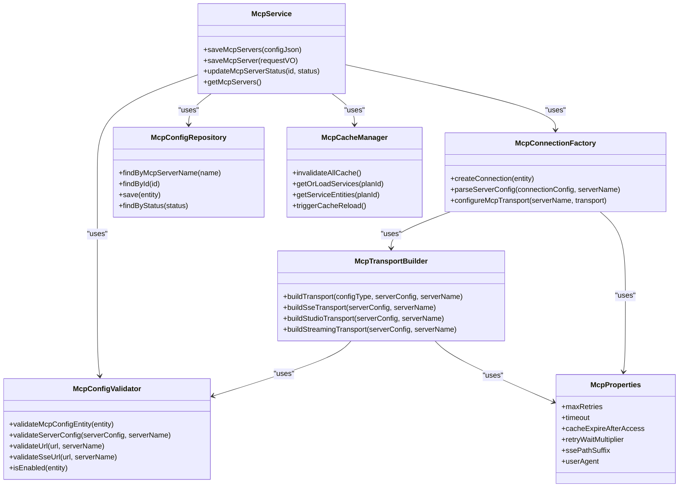

# MCP集成

<cite>
**本文档引用的文件**
- [McpService.java](file://spring-ai-alibaba-jmanus/src/main/java/com/alibaba/cloud/ai/manus/mcp/service/McpService.java)
- [McpProviderFactory.java](file://spring-ai-alibaba-deepresearch/src/main/java/com/alibaba/cloud/ai/example/deepresearch/service/McpProviderFactory.java)
- [McpConfigEntity.java](file://spring-ai-alibaba-jmanus/src/main/java/com/alibaba/cloud/ai/manus/mcp/model/po/McpConfigEntity.java)
- [McpServerConfig.java](file://spring-ai-alibaba-jmanus/src/main/java/com/alibaba/cloud/ai/manus/mcp/model/vo/McpServerConfig.java)
- [McpConnectionFactory.java](file://spring-ai-alibaba-jmanus/src/main/java/com/alibaba/cloud/ai/manus/mcp/service/McpConnectionFactory.java)
- [McpTransportBuilder.java](file://spring-ai-alibaba-jmanus/src/main/java/com/alibaba/cloud/ai/manus/mcp/service/McpTransportBuilder.java)
- [McpProperties.java](file://spring-ai-alibaba-jmanus/src/main/java/com/alibaba/cloud/ai/manus/mcp/config/McpProperties.java)
- [mcp-config.json](file://spring-ai-alibaba-deepresearch/src/main/resources/mcp-config.json)
- [McpController.java](file://spring-ai-alibaba-deepresearch/src/main/java/com/alibaba/cloud/ai/example/deepresearch/controller/McpController.java)
</cite>

## 目录
1. [引言](#引言)
2. [项目结构](#项目结构)
3. [核心组件](#核心组件)
4. [架构概述](#架构概述)
5. [详细组件分析](#详细组件分析)
6. [依赖分析](#依赖分析)
7. [性能考虑](#性能考虑)
8. [故障排除指南](#故障排除指南)
9. [结论](#结论)

## 引言
本文档旨在为开发者提供一个完整的指南，以实现DeepResearch与模型控制协议（MCP）的集成。我们将深入探讨McpService如何发现和调用外部工具和服务，以及McpProviderFactory的实现机制。此外，我们还将解释mcp-config.json配置文件的结构和用途，展示如何注册和管理MCP服务。文档将涵盖安全认证机制、错误处理策略和性能监控方法，确保开发者能够无缝地集成外部AI服务。

## 项目结构
该项目采用模块化设计，主要分为以下几个部分：
- **auto-configurations**: 包含各种自动配置类，如A2A客户端、服务器、Nacos注册等。
- **community**: 提供社区贡献的各种解析器、阅读器、记忆存储和向量存储。
- **spring-ai-alibaba-a2a**: 实现A2A（Agent to Agent）通信的核心模块。
- **spring-ai-alibaba-agent-nacos**: 基于Nacos的代理相关功能。
- **spring-ai-alibaba-core**: 核心AI功能，包括顾问、代理、模型等。
- **spring-ai-alibaba-deepresearch**: 深度研究相关的实现。
- **spring-ai-alibaba-jmanus**: JManus相关功能，包含MCP的核心实现。
- **spring-ai-alibaba-mcp**: MCP相关的通用和路由模块。
- **spring-ai-alibaba-nl2sql**: 自然语言到SQL转换的功能。
- **spring-ai-alibaba-observation-extension**: 观察扩展功能。
- **spring-ai-alibaba-prompt**: 提示模板相关功能。
- **spring-ai-alibaba-spring-boot-starters**: Spring Boot启动器。
- **spring-ai-alibaba-studio**: Studio相关功能。

其中，`spring-ai-alibaba-jmanus` 和 `spring-ai-alibaba-deepresearch` 是MCP集成的关键模块。



**图源**
- [McpService.java](file://spring-ai-alibaba-jmanus/src/main/java/com/alibaba/cloud/ai/manus/mcp/service/McpService.java)
- [McpProviderFactory.java](file://spring-ai-alibaba-deepresearch/src/main/java/com/alibaba/cloud/ai/example/deepresearch/service/McpProviderFactory.java)

**章节来源**
- [McpService.java](file://spring-ai-alibaba-jmanus/src/main/java/com/alibaba/cloud/ai/manus/mcp/service/McpService.java)
- [McpProviderFactory.java](file://spring-ai-alibaba-deepresearch/src/main/java/com/alibaba/cloud/ai/example/deepresearch/service/McpProviderFactory.java)

## 核心组件
### McpService
McpService是MCP集成的核心服务类，负责协调各个组件并提供统一的业务接口。它通过`saveMcpServers`方法批量保存MCP服务器配置，并在保存后清除缓存以重新加载服务。

```java
public List<McpConfigEntity> saveMcpServers(String configJson) throws IOException {
    // 解析JSON配置
    JsonNode jsonNode = objectMapper.readTree(configJson);
    
    // 验证是否包含mcpServers字段
    if (!jsonNode.has("mcpServers")) {
        throw new IllegalArgumentException("Missing 'mcpServers' field in JSON configuration");
    }
    
    // 转换为Map<String, McpServerConfig>
    Map<String, McpServerConfig> mcpServers = objectMapper.convertValue(mcpServersNode,
            new TypeReference<Map<String, McpServerConfig>>() {});
    
    // 遍历每个MCP服务器配置
    for (Map.Entry<String, McpServerConfig> entry : mcpServers.entrySet()) {
        String serverName = entry.getKey();
        McpServerConfig serverConfig = entry.getValue();
        
        // 验证服务器配置
        configValidator.validateServerConfig(serverConfig, serverName);
        
        // 获取连接类型
        McpConfigType connectionType = serverConfig.getConnectionType();
        
        // 转换为JSON
        String serverConfigJson = serverConfig.toJson();
        
        // 查找或创建实体
        McpConfigEntity mcpConfigEntity = mcpConfigRepository.findByMcpServerName(serverName);
        if (mcpConfigEntity == null) {
            mcpConfigEntity = new McpConfigEntity();
            mcpConfigEntity.setConnectionConfig(serverConfigJson);
            mcpConfigEntity.setMcpServerName(serverName);
            mcpConfigEntity.setConnectionType(connectionType);
            if (serverConfig.getStatus() != null) {
                mcpConfigEntity.setStatus(serverConfig.getStatus());
            } else {
                mcpConfigEntity.setStatus(McpConfigStatus.ENABLE);
            }
        } else {
            mcpConfigEntity.setConnectionConfig(serverConfigJson);
            mcpConfigEntity.setConnectionType(connectionType);
            if (serverConfig.getStatus() != null) {
                mcpConfigEntity.setStatus(serverConfig.getStatus());
            }
        }
        
        McpConfigEntity entity = mcpConfigRepository.save(mcpConfigEntity);
        entityList.add(entity);
        logger.info("MCP server '{}' has been saved to database with connection type: {}", serverName,
                connectionType);
    }
    
    // 清除缓存以重新加载服务
    cacheManager.invalidateAllCache();
    return entityList;
}
```

### McpProviderFactory
McpProviderFactory是一个服务类，用于创建和管理MCP提供者。它通过`createProvider`方法根据状态对象和代理名称创建MCP工具回调提供者。

```java
@Service
@ConditionalOnProperty(prefix = McpAssignNodeProperties.MCP_ASSIGN_NODE_PREFIX, name = "enabled", havingValue = "true")
public class McpProviderFactory {

    private final Function<OverAllState, Map<String, McpAssignNodeProperties.McpServerConfig>> mcpConfigProvider;

    private final McpAsyncClientConfigurer mcpAsyncClientConfigurer;

    private final McpClientCommonProperties commonProperties;

    private final WebClient.Builder webClientBuilderTemplate;

    private final ObjectMapper objectMapper;

    @Autowired
    public McpProviderFactory(
            @Qualifier("agent2mcpConfigWithRuntime") Function<OverAllState, Map<String, McpAssignNodeProperties.McpServerConfig>> mcpConfigProvider,
            McpAsyncClientConfigurer mcpAsyncClientConfigurer, McpClientCommonProperties commonProperties,
            WebClient.Builder webClientBuilderTemplate, ObjectMapper objectMapper) {
        this.mcpConfigProvider = mcpConfigProvider;
        this.mcpAsyncClientConfigurer = mcpAsyncClientConfigurer;
        this.commonProperties = commonProperties;
        this.webClientBuilderTemplate = webClientBuilderTemplate;
        this.objectMapper = objectMapper;
    }

    /**
     * 核心方法：直接创建MCP提供者
     * @param state 状态对象
     * @param agentName 代理名称
     * @return MCP工具回调提供者
     */
    public AsyncMcpToolCallbackProvider createProvider(OverAllState state, String agentName) {
        return McpClientUtil.createMcpProvider(state, agentName, mcpConfigProvider, mcpAsyncClientConfigurer,
                commonProperties, webClientBuilderTemplate, objectMapper);
    }
}
```

**章节来源**
- [McpService.java](file://spring-ai-alibaba-jmanus/src/main/java/com/alibaba/cloud/ai/manus/mcp/service/McpService.java)
- [McpProviderFactory.java](file://spring-ai-alibaba-deepresearch/src/main/java/com/alibaba/cloud/ai/example/deepresearch/service/McpProviderFactory.java)

## 架构概述
MCP集成的整体架构如下图所示：



**图源**
- [McpService.java](file://spring-ai-alibaba-jmanus/src/main/java/com/alibaba/cloud/ai/manus/mcp/service/McpService.java)
- [McpConnectionFactory.java](file://spring-ai-alibaba-jmanus/src/main/java/com/alibaba/cloud/ai/manus/mcp/service/McpConnectionFactory.java)
- [McpTransportBuilder.java](file://spring-ai-alibaba-jmanus/src/main/java/com/alibaba/cloud/ai/manus/mcp/service/McpTransportBuilder.java)

**章节来源**
- [McpService.java](file://spring-ai-alibaba-jmanus/src/main/java/com/alibaba/cloud/ai/manus/mcp/service/McpService.java)
- [McpConnectionFactory.java](file://spring-ai-alibaba-jmanus/src/main/java/com/alibaba/cloud/ai/manus/mcp/service/McpConnectionFactory.java)
- [McpTransportBuilder.java](file://spring-ai-alibaba-jmanus/src/main/java/com/alibaba/cloud/ai/manus/mcp/service/McpTransportBuilder.java)

## 详细组件分析
### McpService分析
McpService的主要职责是管理和协调MCP服务器的配置和连接。它提供了以下关键功能：
- 批量保存MCP服务器配置
- 单个保存MCP服务器配置
- 更新MCP服务器状态
- 获取所有MCP服务器信息

#### 批量保存MCP服务器配置
`saveMcpServers`方法接收一个JSON字符串作为输入，解析出MCP服务器配置，并将其保存到数据库中。该方法首先验证JSON格式是否正确，然后遍历每个服务器配置，进行验证和保存。

```java
@Override
public List<McpConfigEntity> saveMcpServers(String configJson) throws IOException {
    List<McpConfigEntity> entityList = new ArrayList<>();

    JsonNode jsonNode = objectMapper.readTree(configJson);

    // Check if contains mcpServers field
    if (!jsonNode.has("mcpServers")) {
        throw new IllegalArgumentException("Missing 'mcpServers' field in JSON configuration");
    }

    JsonNode mcpServersNode = jsonNode.get("mcpServers");
    if (!mcpServersNode.isObject()) {
        throw new IllegalArgumentException("'mcpServers' must be an object");
    }

    // Parse directly as Map<String, McpServerConfig>
    Map<String, McpServerConfig> mcpServers = objectMapper.convertValue(mcpServersNode,
            new TypeReference<Map<String, McpServerConfig>>() {
            });

    // Iterate through each MCP server configuration
    for (Map.Entry<String, McpServerConfig> entry : mcpServers.entrySet()) {
        String serverName = entry.getKey();
        McpServerConfig serverConfig = entry.getValue();

        // Validate server configuration
        configValidator.validateServerConfig(serverConfig, serverName);

        // Get connection type
        McpConfigType connectionType = serverConfig.getConnectionType();
        logger.info("Using connection type for server '{}': {}", serverName, connectionType);

        // Convert to JSON
        String serverConfigJson = serverConfig.toJson();

        // Find or create entity
        McpConfigEntity mcpConfigEntity = mcpConfigRepository.findByMcpServerName(serverName);
        if (mcpConfigEntity == null) {
            mcpConfigEntity = new McpConfigEntity();
            mcpConfigEntity.setConnectionConfig(serverConfigJson);
            mcpConfigEntity.setMcpServerName(serverName);
            mcpConfigEntity.setConnectionType(connectionType);
            // Set status, use from serverConfig if available, otherwise use default
            // value
            if (serverConfig.getStatus() != null) {
                mcpConfigEntity.setStatus(serverConfig.getStatus());
            }
            else {
                mcpConfigEntity.setStatus(McpConfigStatus.ENABLE);
            }
        }
        else {
            mcpConfigEntity.setConnectionConfig(serverConfigJson);
            mcpConfigEntity.setConnectionType(connectionType);
            // Update status, use from serverConfig if available, otherwise keep
            // original value
            if (serverConfig.getStatus() != null) {
                mcpConfigEntity.setStatus(serverConfig.getStatus());
            }
        }

        McpConfigEntity entity = mcpConfigRepository.save(mcpConfigEntity);
        entityList.add(entity);
        logger.info("MCP server '{}' has been saved to database with connection type: {}", serverName,
                connectionType);
    }

    // Clear cache to reload services
    cacheManager.invalidateAllCache();
    return entityList;
}
```

#### 更新MCP服务器状态
`updateMcpServerStatus`方法允许更新指定ID的MCP服务器的状态。如果服务器不存在，则抛出异常；如果状态已经相同，则直接返回成功。

```java
@Override
public boolean updateMcpServerStatus(Long id, McpConfigStatus status) {
    Optional<McpConfigEntity> optionalEntity = mcpConfigRepository.findById(id);
    if (optionalEntity.isEmpty()) {
        throw new IllegalArgumentException("MCP server not found with id: " + id);
    }

    McpConfigEntity entity = optionalEntity.get();
    if (entity.getStatus() == status) {
        logger.info("MCP server {} is already {}", entity.getMcpServerName(), status);
        return true;
    }

    try {
        entity.setStatus(status);
        mcpConfigRepository.save(entity);

        // Clear cache to reload services
        cacheManager.invalidateAllCache();

        logger.info("MCP server {} {} successfully", entity.getMcpServerName(), status);
        return true;
    }
    catch (Exception e) {
        logger.error("Failed to {} MCP server {}: {}", status, entity.getMcpServerName(), e.getMessage(), e);
        return false;
    }
}
```

**章节来源**
- [McpService.java](file://spring-ai-alibaba-jmanus/src/main/java/com/alibaba/cloud/ai/manus/mcp/service/McpService.java)

### McpProviderFactory分析
McpProviderFactory的主要职责是创建MCP工具回调提供者。它通过注入多个依赖项来完成这一任务，包括`mcpConfigProvider`、`mcpAsyncClientConfigurer`、`commonProperties`、`webClientBuilderTemplate`和`objectMapper`。

#### 创建MCP提供者
`createProvider`方法是McpProviderFactory的核心方法，它调用`McpClientUtil.createMcpProvider`来创建MCP工具回调提供者。

```java
public AsyncMcpToolCallbackProvider createProvider(OverAllState state, String agentName) {
    return McpClientUtil.createMcpProvider(state, agentName, mcpConfigProvider, mcpAsyncClientConfigurer,
            commonProperties, webClientBuilderTemplate, objectMapper);
}
```

**章节来源**
- [McpProviderFactory.java](file://spring-ai-alibaba-deepresearch/src/main/java/com/alibaba/cloud/ai/example/deepresearch/service/McpProviderFactory.java)

### mcp-config.json配置文件
mcp-config.json文件用于定义MCP服务器的配置。其结构如下：

```json
{
  "mcpServers": {
    "server1": {
      "url": "http://example.com/api",
      "command": "start-server",
      "args": ["--port", "8080"],
      "env": {
        "API_KEY": "your-api-key"
      },
      "status": "ENABLE"
    },
    "server2": {
      "url": "http://another-example.com/api",
      "status": "DISABLE"
    }
  }
}
```

该文件包含一个名为`mcpServers`的对象，其中每个键代表一个MCP服务器的名称，值是一个包含URL、命令、参数、环境变量和状态的配置对象。

**章节来源**
- [mcp-config.json](file://spring-ai-alibaba-deepresearch/src/main/resources/mcp-config.json)

## 依赖分析
MCP集成涉及多个组件之间的依赖关系。以下是主要的依赖关系图：



**图源**
- [McpService.java](file://spring-ai-alibaba-jmanus/src/main/java/com/alibaba/cloud/ai/manus/mcp/service/McpService.java)
- [McpConfigValidator.java](file://spring-ai-alibaba-jmanus/src/main/java/com/alibaba/cloud/ai/manus/mcp/service/McpConfigValidator.java)
- [McpConfigRepository.java](file://spring-ai-alibaba-jmanus/src/main/java/com/alibaba/cloud/ai/manus/mcp/repository/McpConfigRepository.java)
- [McpCacheManager.java](file://spring-ai-alibaba-jmanus/src/main/java/com/alibaba/cloud/ai/manus/mcp/service/McpCacheManager.java)
- [McpConnectionFactory.java](file://spring-ai-alibaba-jmanus/src/main/java/com/alibaba/cloud/ai/manus/mcp/service/McpConnectionFactory.java)
- [McpTransportBuilder.java](file://spring-ai-alibaba-jmanus/src/main/java/com/alibaba/cloud/ai/manus/mcp/service/McpTransportBuilder.java)
- [McpProperties.java](file://spring-ai-alibaba-jmanus/src/main/java/com/alibaba/cloud/ai/manus/mcp/config/McpProperties.java)

**章节来源**
- [McpService.java](file://spring-ai-alibaba-jmanus/src/main/java/com/alibaba/cloud/ai/manus/mcp/service/McpService.java)
- [McpConfigValidator.java](file://spring-ai-alibaba-jmanus/src/main/java/com/alibaba/cloud/ai/manus/mcp/service/McpConfigValidator.java)
- [McpConfigRepository.java](file://spring-ai-alibaba-jmanus/src/main/java/com/alibaba/cloud/ai/manus/mcp/repository/McpConfigRepository.java)
- [McpCacheManager.java](file://spring-ai-alibaba-jmanus/src/main/java/com/alibaba/cloud/ai/manus/mcp/service/McpCacheManager.java)
- [McpConnectionFactory.java](file://spring-ai-alibaba-jmanus/src/main/java/com/alibaba/cloud/ai/manus/mcp/service/McpConnectionFactory.java)
- [McpTransportBuilder.java](file://spring-ai-alibaba-jmanus/src/main/java/com/alibaba/cloud/ai/manus/mcp/service/McpTransportBuilder.java)
- [McpProperties.java](file://spring-ai-alibaba-jmanus/src/main/java/com/alibaba/cloud/ai/manus/mcp/config/McpProperties.java)

## 性能考虑
为了确保MCP集成的高性能，系统采用了多种优化措施：
- **缓存机制**：使用`McpCacheManager`来缓存MCP服务实例，减少重复创建连接的开销。
- **异步处理**：利用`McpAsyncClient`进行异步通信，提高响应速度。
- **重试机制**：在`McpConnectionFactory`中实现了重试逻辑，确保在网络不稳定的情况下仍能成功建立连接。
- **连接池**：通过`WebClient.Builder`配置连接池，复用HTTP连接，降低资源消耗。

这些措施共同作用，确保了MCP集成在高并发场景下的稳定性和高效性。

## 故障排除指南
### 常见问题及解决方案
1. **无法保存MCP服务器配置**
   - 检查JSON格式是否正确，特别是`mcpServers`字段是否存在且为对象类型。
   - 确认服务器名称是否唯一，避免重复。
   - 检查URL格式是否符合要求，特别是SSE连接需要正确的路径后缀。

2. **连接失败**
   - 确保目标服务器正在运行并且网络可达。
   - 检查防火墙设置，确保端口未被阻止。
   - 查看日志中的具体错误信息，根据提示进行调整。

3. **状态更新无效**
   - 确认服务器ID是否正确。
   - 检查数据库连接是否正常，确保更新操作能够持久化。

### 日志分析
系统记录了详细的日志信息，可以帮助诊断问题。重点关注以下几类日志：
- **INFO级别**：记录正常的操作流程，如服务器保存、状态更新等。
- **WARN级别**：记录潜在的问题，如重试尝试、配置跳过等。
- **ERROR级别**：记录严重的错误，如连接失败、数据保存异常等。

通过分析这些日志，可以快速定位问题根源并采取相应措施。

**章节来源**
- [McpService.java](file://spring-ai-alibaba-jmanus/src/main/java/com/alibaba/cloud/ai/manus/mcp/service/McpService.java)
- [McpConnectionFactory.java](file://spring-ai-alibaba-jmanus/src/main/java/com/alibaba/cloud/ai/manus/mcp/service/McpConnectionFactory.java)

## 结论
本文档详细介绍了DeepResearch与MCP集成的各个方面，包括McpService的工作原理、McpProviderFactory的实现机制、mcp-config.json配置文件的结构和用途，以及安全认证、错误处理和性能监控的方法。通过遵循本指南，开发者可以轻松地将外部AI服务集成到自己的应用中，实现更强大的功能和更高的效率。