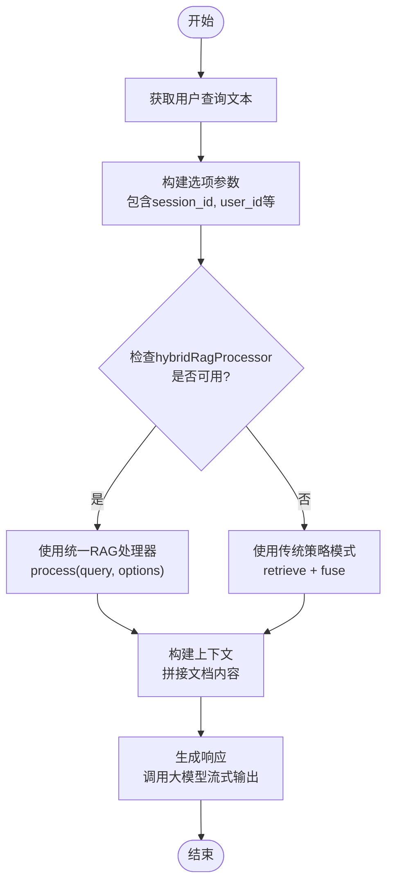
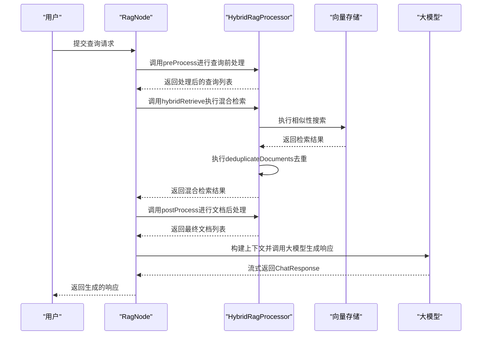
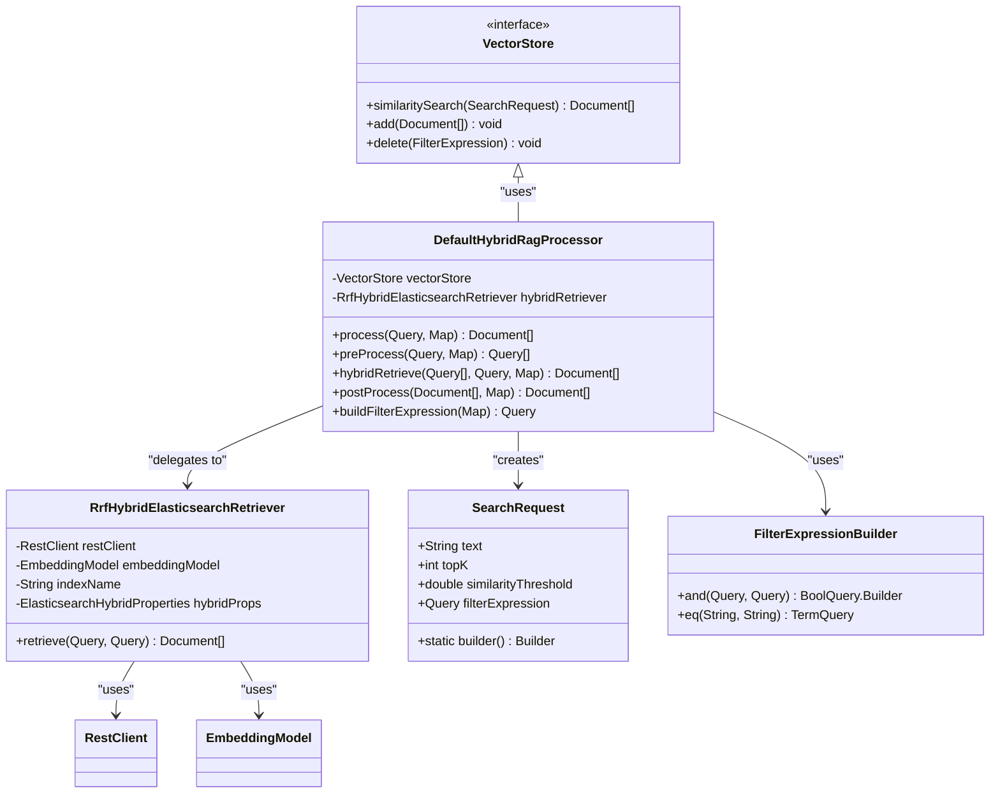
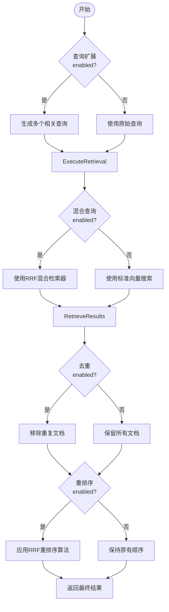
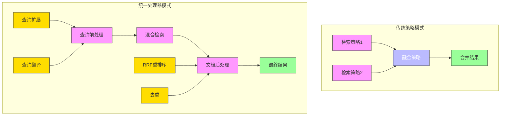

# RAG实现

<cite>
**本文档引用的文件**
- [RagNode.java](file://spring-ai-alibaba-deepresearch/src/main/java/com/alibaba/cloud/ai/example/deepresearch/node/RagNode.java)
- [DefaultHybridRagProcessor.java](file://spring-ai-alibaba-deepresearch/src/main/java/com/alibaba/cloud/ai/example/deepresearch/rag/core/DefaultHybridRagProcessor.java)
- [SourceTypeEnum.java](file://spring-ai-alibaba-deepresearch/src/main/java/com/alibaba/cloud/ai/example/deepresearch/rag/SourceTypeEnum.java)
- [RagProperties.java](file://spring-ai-alibaba-deepresearch/src/main/java/com/alibaba/cloud/ai/example/deepresearch/config/rag/RagProperties.java)
- [UserFileRetrievalStrategy.java](file://spring-ai-alibaba-deepresearch/src/main/java/com/alibaba/cloud/ai/example/deepresearch/rag/strategy/UserFileRetrievalStrategy.java)
- [ProfessionalKbEsStrategy.java](file://spring-ai-alibaba-deepresearch/src/main/java/com/alibaba/cloud/ai/example/deepresearch/rag/strategy/ProfessionalKbEsStrategy.java)
- [ProfessionalKbApiStrategy.java](file://spring-ai-alibaba-deepresearch/src/main/java/com/alibaba/cloud/ai/example/deepresearch/rag/strategy/ProfessionalKbApiStrategy.java)
- [FusionStrategy.java](file://spring-ai-alibaba-deepresearch/src/main/java/com/alibaba/cloud/ai/example/deepresearch/rag/strategy/FusionStrategy.java)
</cite>

## 目录
1. [简介](#简介)
2. [RagNode实现机制](#ragnode实现机制)
3. [知识库检索与信息整合](#知识库检索与信息整合)
4. [向量存储集成](#向量存储集成)
5. [数据源类型](#数据源类型)
6. [检索策略与重排序算法](#检索策略与重排序算法)
7. [结果融合技术](#结果融合技术)
8. [配置示例](#配置示例)
9. [最佳实践](#最佳实践)

## 简介
本文档详细描述了DeepResearch项目中RAG（Retrieval-Augmented Generation）功能的实现机制。重点介绍RagNode的核心实现，包括知识库检索、信息整合和生成过程。文档还解释了系统如何与向量存储集成，以及支持的不同数据源类型。涵盖了检索策略、重排序算法和结果融合技术，并提供配置示例展示如何自定义RAG流程。最后为开发者提供了优化检索质量和生成效果的最佳实践。

## RagNode实现机制
RagNode是DeepResearch项目中实现RAG功能的核心组件，负责协调检索、信息整合和生成过程。该节点通过统一的处理流程，将用户查询与相关知识库内容相结合，生成高质量的响应。

RagNode实现了两种构造模式：传统的策略模式和新的统一处理器模式。当`hybridRagProcessor`可用时，优先使用统一的RAG处理器进行完整的前后处理逻辑；否则回退到传统的策略模式，使用`retrievalStrategies`和`fusionStrategy`组合。



**图来源**
- [RagNode.java](file://spring-ai-alibaba-deepresearch/src/main/java/com/alibaba/cloud/ai/example/deepresearch/node/RagNode.java#L34-L121)

**本节来源**
- [RagNode.java](file://spring-ai-alibaba-deepresearch/src/main/java/com/alibaba/cloud/ai/example/deepresearch/node/RagNode.java#L34-L121)

## 知识库检索与信息整合
RagNode的知识库检索与信息整合过程分为四个主要阶段：查询前处理、混合检索、文档后处理和响应生成。

在查询前处理阶段，系统会对原始查询进行扩展和翻译。如果启用了查询扩展功能，系统会生成多个相关查询以提高检索覆盖率。如果启用了查询翻译功能，系统会将查询转换为目标语言（默认为英语），以便在多语言知识库中进行检索。

混合检索阶段根据配置选择适当的检索方式。当向量存储类型为Elasticsearch且启用了混合查询时，系统使用RRF混合Elasticsearch检索器进行检索；否则使用标准向量搜索。检索过程中会应用基于元数据的过滤表达式，确保只返回相关的内容。

文档后处理阶段对检索结果进行排序、去重和压缩。系统优先使用RRF重排序算法对文档进行重新排序，然后根据配置决定是否执行去重操作。最终的文档列表被拼接成上下文字符串，作为大模型生成响应的基础。



**图来源**
- [RagNode.java](file://spring-ai-alibaba-deepresearch/src/main/java/com/alibaba/cloud/ai/example/deepresearch/node/RagNode.java#L84-L121)
- [DefaultHybridRagProcessor.java](file://spring-ai-alibaba-deepresearch/src/main/java/com/alibaba/cloud/ai/example/deepresearch/rag/core/DefaultHybridRagProcessor.java#L115-L150)

**本节来源**
- [RagNode.java](file://spring-ai-alibaba-deepresearch/src/main/java/com/alibaba/cloud/ai/example/deepresearch/node/RagNode.java#L84-L121)
- [DefaultHybridRagProcessor.java](file://spring-ai-alibaba-deepresearch/src/main/java/com/alibaba/cloud/ai/example/deepresearch/rag/core/DefaultHybridRagProcessor.java#L115-L150)

## 向量存储集成
系统通过`VectorStore`接口与向量存储进行集成，支持多种向量数据库实现。当前主要支持Elasticsearch作为向量存储后端，同时也支持简单的本地存储。

向量存储的配置通过`RagProperties`类进行管理，其中`vectorStoreType`属性决定了使用的存储类型。当设置为"elasticsearch"时，系统会初始化Elasticsearch相关的组件；当设置为"simple"时，使用简单的本地JSON文件存储。

在Elasticsearch集成中，系统利用其混合查询能力，结合语义搜索和关键词搜索的优势。通过`RrfHybridElasticsearchRetriever`实现RRF（Reciprocal Rank Fusion）算法，将不同检索方法的结果进行融合，提高检索质量。



**图来源**
- [DefaultHybridRagProcessor.java](file://spring-ai-alibaba-deepresearch/src/main/java/com/alibaba/cloud/ai/example/deepresearch/rag/core/DefaultHybridRagProcessor.java#L79-L113)
- [RagProperties.java](file://spring-ai-alibaba-deepresearch/src/main/java/com/alibaba/cloud/ai/example/deepresearch/config/rag/RagProperties.java#L50-L60)

**本节来源**
- [DefaultHybridRagProcessor.java](file://spring-ai-alibaba-deepresearch/src/main/java/com/alibaba/cloud/ai/example/deepresearch/rag/core/DefaultHybridRagProcessor.java#L79-L113)
- [RagProperties.java](file://spring-ai-alibaba-deepresearch/src/main/java/com/alibaba/cloud/ai/example/deepresearch/config/rag/RagProperties.java#L50-L60)

## 数据源类型
系统通过`SourceTypeEnum`枚举定义了不同的数据源类型，用于区分知识库内容的来源。每种数据源类型都有对应的标识符，这些标识符作为元数据存储在向量数据库中，用于检索时的过滤。

目前支持三种主要的数据源类型：

- **USER_UPLOAD**: 用户上传文件，标识符为"user_upload"。这种类型代表用户个人上传的文档，通常与特定的session_id关联。
- **PROFESSIONAL_KB_ES**: 专业知识库 - Elasticsearch存储，标识符为"professional_kb_es"。这种类型代表存储在Elasticsearch中的专业领域知识库。
- **PROFESSIONAL_KB_API**: 专业知识库 - API接口，标识符为"professional_kb_api"。这种类型代表通过API接口获取的专业知识库内容。

每种数据源类型对应不同的检索策略。例如，`UserFileRetrievalStrategy`专门处理用户上传文件的检索，而`ProfessionalKbEsStrategy`和`ProfessionalKbApiStrategy`分别处理基于Elasticsearch和API的专业知识库检索。

```mermaid
erDiagram
SOURCE_TYPE ||--o{ DOCUMENT : "has"
SOURCE_TYPE {
string type PK
string description
}
DOCUMENT ||--o{ METADATA : "contains"
DOCUMENT {
string id PK
string text
string content
}
METADATA {
string key PK, FK
string value
}
class SOURCE_TYPE {
USER_UPLOAD: "user_upload"
PROFESSIONAL_KB_ES: "professional_kb_es"
PROFESSIONAL_KB_API: "professional_kb_api"
}
class METADATA {
source_type: string
session_id: string
user_id: string
kb_id: string
}
```

**图来源**
- [SourceTypeEnum.java](file://spring-ai-alibaba-deepresearch/src/main/java/com/alibaba/cloud/ai/example/deepresearch/rag/SourceTypeEnum.java#L15-L35)
- [UserFileRetrievalStrategy.java](file://spring-ai-alibaba-deepresearch/src/main/java/com/alibaba/cloud/ai/example/deepresearch/rag/strategy/UserFileRetrievalStrategy.java#L45-L55)
- [ProfessionalKbEsStrategy.java](file://spring-ai-alibaba-deepresearch/src/main/java/com/alibaba/cloud/ai/example/deepresearch/rag/strategy/ProfessionalKbEsStrategy.java#L45-L55)
- [ProfessionalKbApiStrategy.java](file://spring-ai-alibaba-deepresearch/src/main/java/com/alibaba/cloud/ai/example/deepresearch/rag/strategy/ProfessionalKbApiStrategy.java#L185-L190)

**本节来源**
- [SourceTypeEnum.java](file://spring-ai-alibaba-deepresearch/src/main/java/com/alibaba/cloud/ai/example/deepresearch/rag/SourceTypeEnum.java#L15-L35)
- [UserFileRetrievalStrategy.java](file://spring-ai-alibaba-deepresearch/src/main/java/com/alibaba/cloud/ai/example/deepresearch/rag/strategy/UserFileRetrievalStrategy.java#L45-L55)

## 检索策略与重排序算法
系统实现了多种检索策略和重排序算法，以提高RAG系统的检索质量和准确性。

### 检索策略
系统支持以下几种检索策略：
- **UserFileRetrievalStrategy**: 处理用户上传文件的检索，基于session_id进行过滤。
- **ProfessionalKbEsStrategy**: 处理存储在Elasticsearch中的专业知识库检索。
- **ProfessionalKbApiStrategy**: 处理通过API接口获取的专业知识库检索。

每种策略都实现了`RetrievalStrategy`接口，提供`retrieve`方法来执行具体的检索逻辑。策略之间可以并行执行，然后通过融合策略将结果合并。

### 重排序算法
系统主要使用RRF（Reciprocal Rank Fusion）算法进行结果重排序。RRF算法通过以下公式计算每个文档的综合得分：
```
score(d) = Σ(1/(k + rank(qi, d)))
```
其中，qi是查询扩展生成的第i个查询，rank(qi, d)是文档d在查询qi下的排名，k是一个常数（通常为60）。

当启用重排序功能时，系统会优先使用RRF融合策略对检索结果进行重新排序，确保最相关的文档排在前面。



**图来源**
- [DefaultHybridRagProcessor.java](file://spring-ai-alibaba-deepresearch/src/main/java/com/alibaba/cloud/ai/example/deepresearch/rag/core/DefaultHybridRagProcessor.java#L115-L193)
- [RagProperties.java](file://spring-ai-alibaba-deepresearch/src/main/java/com/alibaba/cloud/ai/example/deepresearch/config/rag/RagProperties.java#L150-L160)

**本节来源**
- [DefaultHybridRagProcessor.java](file://spring-ai-alibaba-deepresearch/src/main/java/com/alibaba/cloud/ai/example/deepresearch/rag/core/DefaultHybridRagProcessor.java#L115-L193)
- [RagProperties.java](file://spring-ai-alibaba-deepresearch/src/main/java/com/alibaba/cloud/ai/example/deepresearch/config/rag/RagProperties.java#L150-L160)

## 结果融合技术
系统采用灵活的结果融合技术，能够将来自不同检索策略的结果进行有效整合。融合过程主要通过`FusionStrategy`接口实现，该接口定义了`fuse`方法用于合并多个已排序的文档列表。

系统支持两种主要的融合模式：
1. **传统策略模式**: 当没有配置`hybridRagProcessor`时，系统使用独立的`retrievalStrategies`和`fusionStrategy`。每个检索策略独立执行，然后由融合策略将结果合并。
2. **统一处理器模式**: 当配置了`hybridRagProcessor`时，系统使用统一的处理流程，内部集成了查询前处理、混合检索和文档后处理。

在统一处理器模式下，系统实现了更高级的融合技术：
- **查询级融合**: 通过查询扩展和翻译生成多个变体查询，并将它们的检索结果合并。
- **检索级融合**: 在Elasticsearch中同时执行语义搜索和关键词搜索，并使用RRF算法融合结果。
- **文档级融合**: 对最终的文档列表进行去重和重排序，确保输出质量。



**图来源**
- [RagNode.java](file://spring-ai-alibaba-deepresearch/src/main/java/com/alibaba/cloud/ai/example/deepresearch/node/RagNode.java#L84-L105)
- [FusionStrategy.java](file://spring-ai-alibaba-deepresearch/src/main/java/com/alibaba/cloud/ai/example/deepresearch/rag/strategy/FusionStrategy.java#L15-L25)
- [DefaultHybridRagProcessor.java](file://spring-ai-alibaba-deepresearch/src/main/java/com/alibaba/cloud/ai/example/deepresearch/rag/core/DefaultHybridRagProcessor.java#L152-L193)

**本节来源**
- [RagNode.java](file://spring-ai-alibaba-deepresearch/src/main/java/com/alibaba/cloud/ai/example/deepresearch/node/RagNode.java#L84-L105)
- [FusionStrategy.java](file://spring-ai-alibaba-deepresearch/src/main/java/com/alibaba/cloud/ai/example/deepresearch/rag/strategy/FusionStrategy.java#L15-L25)

## 配置示例
以下是RAG功能的主要配置示例，展示了如何通过application.yml文件自定义RAG流程。

```yaml
spring:
  ai:
    alibaba:
      deepresearch:
        rag:
          # 启用RAG功能
          enabled: true
          
          # 向量存储类型，可选值：simple, elasticsearch
          vector-store-type: elasticsearch
          
          # 请求超时时间（秒）
          timeout-seconds: 60
          
          # 重试次数
          retry-times: 2
          
          # RAG增强配置
          pipeline:
            # 是否启用查询扩展
            query-expansion-enabled: true
            
            # 是否启用查询翻译
            query-translation-enabled: true
            
            # 查询翻译的目标语言
            query-translation-language: English
            
            # 是否启用后处理选择第一个结果
            post-processing-select-first-enabled: false
            
            # 搜索配置
            top-k: 5
            similarity-threshold: 0.7
            deduplication-enabled: true
            
            # 是否启用重排序
            rerank-enabled: true
          
          # Elasticsearch配置
          elasticsearch:
            # ES主机地址
            host: localhost
            port: 9200
            
            # 索引名称
            index-name: rag_documents
            
            # 混合查询配置
            hybrid:
              enabled: true
              keyword-fields:
                - "content"
                - "title"
              vector-fields:
                - "content_vector"
              rrf:
                k: 60
          
          # 专业知识库配置
          professional-knowledge-bases:
            knowledge-bases:
              - id: tech-docs
                name: 技术文档库
                description: 公司内部技术文档
                enabled: true
                type: es
                api-endpoint: http://kb-api.example.com/tech
```

此外，还可以通过Java配置类进一步定制RAG行为：

```java
@Configuration
@EnableConfigurationProperties(RagProperties.class)
public class RagConfiguration {

    @Bean
    @ConditionalOnProperty(prefix = "spring.ai.alibaba.deepresearch.rag", 
                          name = "enabled", havingValue = "true")
    public HybridRagProcessor hybridRagProcessor(
            @Qualifier("ragVectorStore") VectorStore vectorStore,
            RestClient restClient,
            EmbeddingModel embeddingModel,
            ChatClient.Builder chatClientBuilder,
            RagProperties ragProperties,
            RrfFusionStrategy rrfFusionStrategy) {
        return new DefaultHybridRagProcessor(vectorStore, restClient, 
                embeddingModel, chatClientBuilder, ragProperties, rrfFusionStrategy);
    }

    @Bean
    @ConditionalOnMissingBean
    public FusionStrategy fusionStrategy() {
        return new SimpleFusionStrategy();
    }
}
```

**本节来源**
- [RagProperties.java](file://spring-ai-alibaba-deepresearch/src/main/java/com/alibaba/cloud/ai/example/deepresearch/config/rag/RagProperties.java#L30-L200)

## 最佳实践
为了优化RAG系统的检索质量和生成效果，建议遵循以下最佳实践：

### 检索质量优化
1. **合理设置topK值**: 根据应用场景调整topK值。对于需要全面覆盖的场景，可以设置较高的topK值（如10-20）；对于需要精确匹配的场景，可以设置较低的topK值（如3-5）。
2. **调整相似度阈值**: 根据数据特性和需求调整similarity-threshold。较高的阈值（如0.8）能确保高相关性但可能遗漏相关信息；较低的阈值（如0.6）能提高召回率但可能引入噪声。
3. **启用查询扩展**: 对于复杂或模糊的查询，启用查询扩展功能可以帮助发现更多相关文档。
4. **使用混合查询**: 在Elasticsearch中启用混合查询，结合语义搜索和关键词搜索的优势，提高检索的准确性和覆盖率。

### 生成效果优化
1. **优化提示词设计**: 设计清晰的提示词模板，明确指示大模型如何使用检索到的文档。可以参考`DashScopeDocumentRetrievalAdvisor`中的提示词设计。
2. **控制上下文长度**: 注意拼接后的上下文长度不要超过大模型的上下文窗口限制。可以通过调整topK值或对文档进行摘要来控制上下文长度。
3. **启用流式响应**: 使用流式API获取响应，提供更好的用户体验，并及时处理生成的内容。
4. **添加引用标记**: 在生成的响应中添加引用标记，让用户知道信息来源，提高可信度。

### 性能与可靠性
1. **配置适当的超时和重试**: 设置合理的timeout-seconds和retry-times，平衡响应速度和可靠性。
2. **监控系统性能**: 监控RAG各阶段的执行时间，识别性能瓶颈。
3. **定期更新知识库**: 定期更新向量存储中的知识库内容，确保信息的时效性。
4. **实施缓存策略**: 对频繁查询的结果实施缓存策略，减少重复计算和外部调用。

### 安全与权限
1. **实施访问控制**: 基于user_id和session_id实施访问控制，确保用户只能访问授权的内容。
2. **敏感信息过滤**: 在检索和生成过程中实施敏感信息过滤，防止泄露机密信息。
3. **审计日志**: 记录关键操作的审计日志，便于问题排查和安全审查。

**本节来源**
- [RagNode.java](file://spring-ai-alibaba-deepresearch/src/main/java/com/alibaba/cloud/ai/example/deepresearch/node/RagNode.java#L100-L121)
- [DefaultHybridRagProcessor.java](file://spring-ai-alibaba-deepresearch/src/main/java/com/alibaba/cloud/ai/example/deepresearch/rag/core/DefaultHybridRagProcessor.java#L232-L264)
- [RagProperties.java](file://spring-ai-alibaba-deepresearch/src/main/java/com/alibaba/cloud/ai/example/deepresearch/config/rag/RagProperties.java#L100-L160)