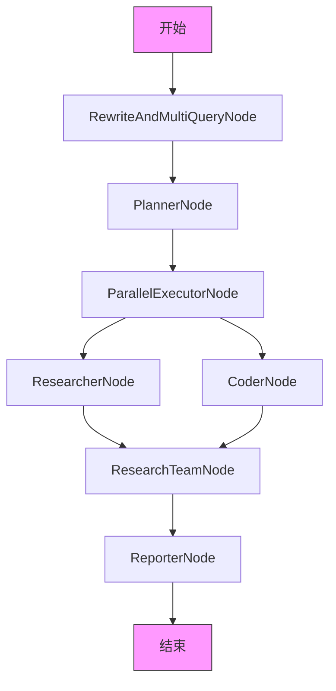
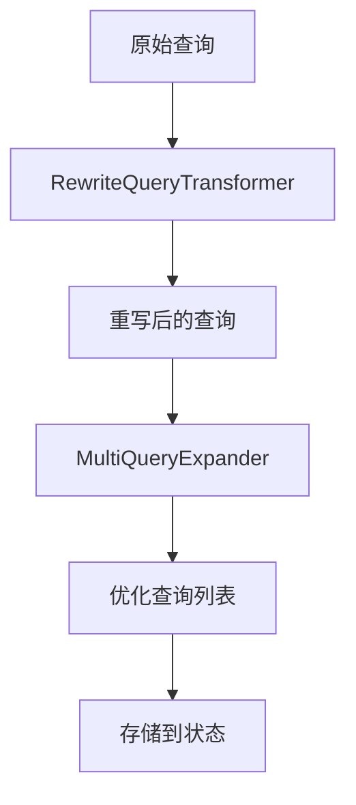

# 工作流编排

<cite>
**本文档引用的文件**
- [PlannerNode.java](file://spring-ai-alibaba-deepresearch/src/main/java/com/alibaba/cloud/ai/example/deepresearch/node/PlannerNode.java)
- [ResearcherNode.java](file://spring-ai-alibaba-deepresearch/src/main/java/com/alibaba/cloud/ai/example/deepresearch/node/ResearcherNode.java)
- [ReporterNode.java](file://spring-ai-alibaba-deepresearch/src/main/java/com/alibaba/cloud/ai/example/deepresearch/node/ReporterNode.java)
- [ParallelExecutorNode.java](file://spring-ai-alibaba-deepresearch/src/main/java/com/alibaba/cloud/ai/example/deepresearch/node/ParallelExecutorNode.java)
- [RewriteAndMultiQueryNode.java](file://spring-ai-alibaba-deepresearch/src/main/java/com/alibaba/cloud/ai/example/deepresearch/node/RewriteAndMultiQueryNode.java)
- [Plan.java](file://spring-ai-alibaba-deepresearch/src/main/java/com/alibaba/cloud/ai/example/deepresearch/model/dto/Plan.java)
- [StateUtil.java](file://spring-ai-alibaba-deepresearch/src/main/java/com/alibaba/cloud/ai/example/deepresearch/util/StateUtil.java)
- [DeepResearchConfiguration.java](file://spring-ai-alibaba-nl2sql/spring-ai-alibaba-nl2sql-chat/src/main/java/com/alibaba/cloud/ai/config/Nl2sqlConfiguration.java)
</cite>

## 目录
1. [引言](#引言)
2. [核心组件分析](#核心组件分析)
3. [工作流引擎架构](#工作流引擎架构)
4. [节点交互模式详解](#节点交互模式详解)
5. [并行执行机制](#并行执行机制)
6. [查询优化策略](#查询优化策略)
7. [异常处理与状态管理](#异常处理与状态管理)
8. [性能优化技巧](#性能优化技巧)

## 引言
本技术文档深入解析了DeepResearch工作流编排系统，重点阐述其基于StateGraph的工作流引擎。文档详细描述了PlannerNode、ResearcherNode、ReporterNode等核心节点的实现细节和交互模式，解释了ParallelExecutorNode如何实现并行任务执行，以及RewriteAndMultiQueryNode如何优化查询策略。通过具体的代码示例，展示了如何定义和配置复杂的研究工作流，并涵盖了异常处理机制、状态管理策略和性能优化技巧。

## 核心组件分析

### PlannerNode 实现细节
PlannerNode负责制定研究计划，是整个工作流的起点。该节点接收用户查询、背景调查结果、用户反馈和RAG查询结果作为输入，通过调用plannerAgent生成研究计划。节点使用StreamingChatGenerator实现流式响应，将生成的计划内容实时推送给前端。在执行过程中，节点会注册状态键`planner_content`用于跟踪进度。

**Section sources**
- [PlannerNode.java](file://spring-ai-alibaba-deepresearch/src/main/java/com/alibaba/cloud/ai/example/deepresearch/node/PlannerNode.java#L0-L112)

### ResearcherNode 实现细节
ResearcherNode负责执行具体的研究任务。该节点首先从当前计划中找到分配给自己的步骤，然后构建包含任务内容和引用提醒的消息。节点支持智能Agent选择，能够根据任务类型选择最合适的Agent进行处理。通过McpProviderFactory创建MCP提供者，集成搜索工具进行信息检索。节点使用StreamingChatGenerator实现流式响应，并将执行结果存储在状态中。

**Section sources**
- [ResearcherNode.java](file://spring-ai-alibaba-deepresearch/src/main/java/com/alibaba/cloud/ai/example/deepresearch/node/ResearcherNode.java#L0-L199)

### ReporterNode 实现细节
ReporterNode负责生成最终报告。该节点整合背景调查信息、各研究团队的执行结果以及专业知识库决策结果，通过reporterAgent生成结构化的研究报告。节点实现了会话历史记录功能，将生成的报告保存到SessionContextService中。使用StreamingChatGenerator实现流式响应，确保大报告的生成过程不会阻塞。

**Section sources**
- [ReporterNode.java](file://spring-ai-alibaba-deepresearch/src/main/java/com/alibaba/cloud/ai/example/deepresearch/node/ReporterNode.java#L0-L149)

## 工作流引擎架构



**Diagram sources**
- [Nl2sqlConfiguration.java](file://spring-ai-alibaba-nl2sql/spring-ai-alibaba-nl2sql-chat/src/main/java/com/alibaba/cloud/ai/config/Nl2sqlConfiguration.java#L183-L205)
- [PlannerNode.java](file://spring-ai-alibaba-deepresearch/src/main/java/com/alibaba/cloud/ai/example/deepresearch/node/PlannerNode.java#L0-L112)

## 节点交互模式详解

### PlannerNode 与 ResearcherNode 的交互
PlannerNode生成的研究计划被存储在OverAllState中，ResearcherNode通过StateUtil.getPlan()方法获取该计划。PlannerNode输出的计划内容作为ResearcherNode的输入，指导其执行具体的研究任务。

### ParallelExecutorNode 与 ResearcherNode 的协调
ParallelExecutorNode负责任务分配，它根据计划步骤的类型（RESEARCH或PROCESSING）将任务分配给不同的执行器。对于研究型任务，分配给ResearcherNode；对于处理型任务，分配给CoderNode。分配状态通过executionStatus字段标识，格式为"assigned_researcher_X"或"assigned_coder_X"。

**Section sources**
- [ParallelExecutorNode.java](file://spring-ai-alibaba-deepresearch/src/main/java/com/alibaba/cloud/ai/example/deepresearch/node/ParallelExecutorNode.java#L0-L101)
- [StateUtil.java](file://spring-ai-alibaba-deepresearch/src/main/java/com/alibaba/cloud/ai/example/deepresearch/util/StateUtil.java#L0-L129)

## 并行执行机制

### ParallelExecutorNode 实现原理
ParallelExecutorNode实现了并行任务执行的核心逻辑。该节点遍历当前计划的所有步骤，根据步骤类型进行角色分配：

```java
private String assignRole(Plan.StepType type, long executorId) {
    String role = type == Plan.StepType.PROCESSING ? ParallelEnum.CODER.getValue()
            : ParallelEnum.RESEARCHER.getValue();
    return StateUtil.EXECUTION_STATUS_ASSIGNED_PREFIX + role + "_" + executorId;
}
```

该机制确保了不同类型的任务可以并行执行，提高了整体研究效率。

### 状态同步与协调
ParallelExecutorNode通过检查所有研究步骤是否完成来决定何时启动处理型任务。`areAllResearchStepsCompleted()`方法确保了任务执行的正确顺序，避免了数据竞争和不一致状态。

**Section sources**
- [ParallelExecutorNode.java](file://spring-ai-alibaba-deepresearch/src/main/java/com/alibaba/cloud/ai/example/deepresearch/node/ParallelExecutorNode.java#L0-L101)

## 查询优化策略

### RewriteAndMultiQueryNode 功能
RewriteAndMultiQueryNode负责查询重写和多查询扩展。该节点首先使用RewriteQueryTransformer对原始查询进行重写，然后使用MultiQueryExpander生成多个优化后的查询。最多可生成5个优化查询，最少0个，数量由optimizeQueryNum参数控制。



**Diagram sources**
- [RewriteAndMultiQueryNode.java](file://spring-ai-alibaba-deepresearch/src/main/java/com/alibaba/cloud/ai/example/deepresearch/node/RewriteAndMultiQueryNode.java#L0-L97)

### 查询策略配置
查询优化的数量可以通过状态中的`optimize_query_num`参数进行配置，默认值为3。节点会将生成的优化查询列表存储在状态的`optimize_queries`键中，供后续节点使用。

**Section sources**
- [RewriteAndMultiQueryNode.java](file://spring-ai-alibaba-deepresearch/src/main/java/com/alibaba/cloud/ai/example/deepresearch/node/RewriteAndMultiQueryNode.java#L0-L97)
- [StateUtil.java](file://spring-ai-alibaba-deepresearch/src/main/java/com/alibaba/cloud/ai/example/deepresearch/util/StateUtil.java#L0-L129)

## 异常处理与状态管理

### 统一异常处理
系统通过StateUtil.handleStepError()方法实现统一的异常处理。当节点执行失败时，该方法会设置错误状态，记录错误信息，并进行日志记录。

```java
public static void handleStepError(Plan.Step step, String nodeName, Throwable error, org.slf4j.Logger logger) {
    String errorMessage = "ERROR: " + error.getMessage();
    step.setExecutionStatus(EXECUTION_STATUS_ERROR_PREFIX + nodeName);
    step.setExecutionRes(errorMessage);
    logger.error("{} failed: {}", nodeName, error.getMessage(), error);
}
```

### 状态管理策略
系统使用OverAllState作为全局状态容器，通过value()方法获取和设置状态值。关键状态包括：
- `current_plan`: 当前研究计划
- `query`: 用户查询
- `optimize_queries`: 优化后的查询列表
- `thread_id`: 线程ID
- `session_id`: 会话ID

**Section sources**
- [StateUtil.java](file://spring-ai-alibaba-deepresearch/src/main/java/com/alibaba/cloud/ai/example/deepresearch/util/StateUtil.java#L0-L129)
- [Plan.java](file://spring-ai-alibaba-deepresearch/src/main/java/com/alibaba/cloud/ai/example/deepresearch/model/dto/Plan.java#L0-L174)

## 性能优化技巧

### 流式响应优化
所有主要节点都使用StreamingChatGenerator实现流式响应，避免了大模型响应的延迟问题。通过注册特定的起始节点，前端可以实时接收处理进度。

### 缓存与复用
系统通过合理的状态管理避免了重复计算。例如，PlannerNode生成的计划被缓存在状态中，供后续所有节点复用。

### 并行化设计
通过ParallelExecutorNode的并行执行机制，系统能够同时处理多个研究任务，充分利用计算资源，显著提高了整体处理速度。