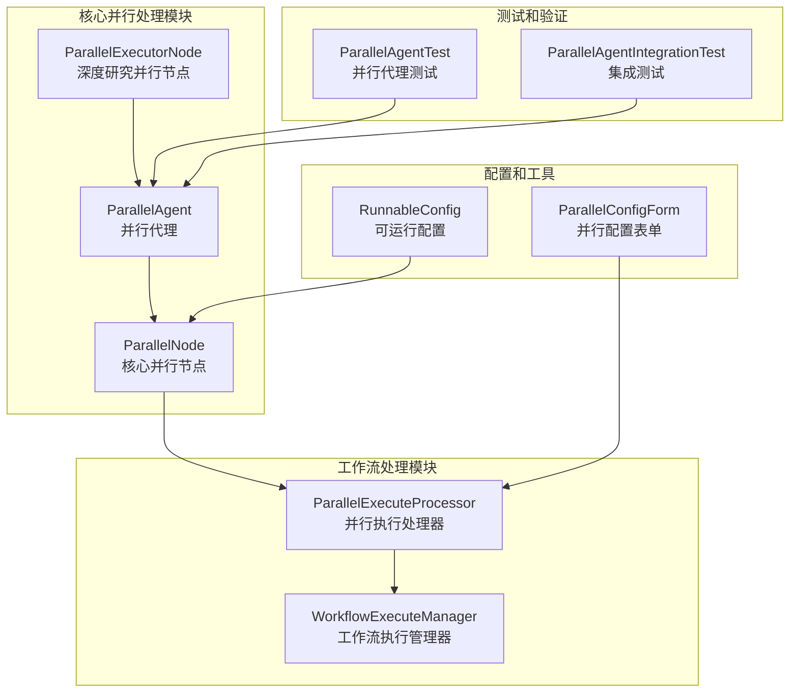
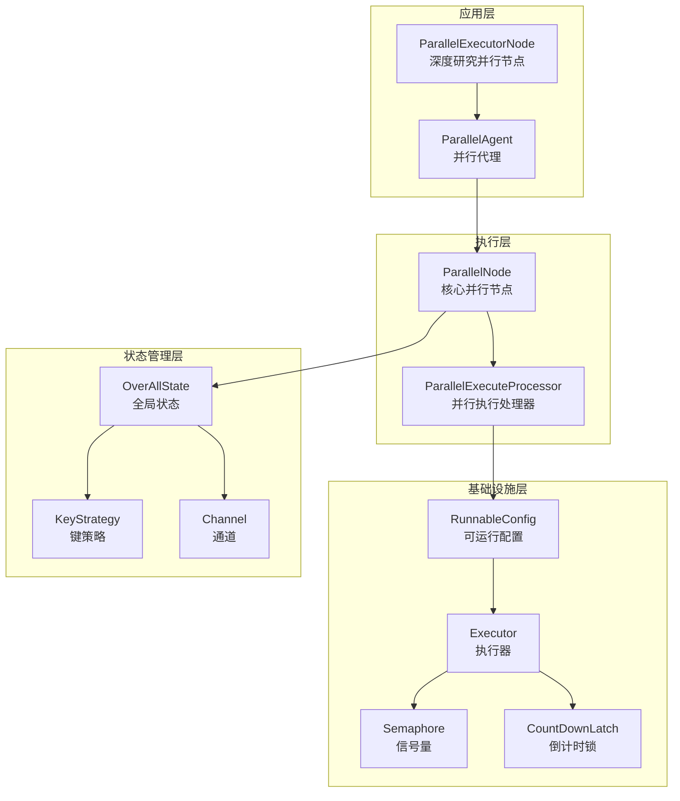
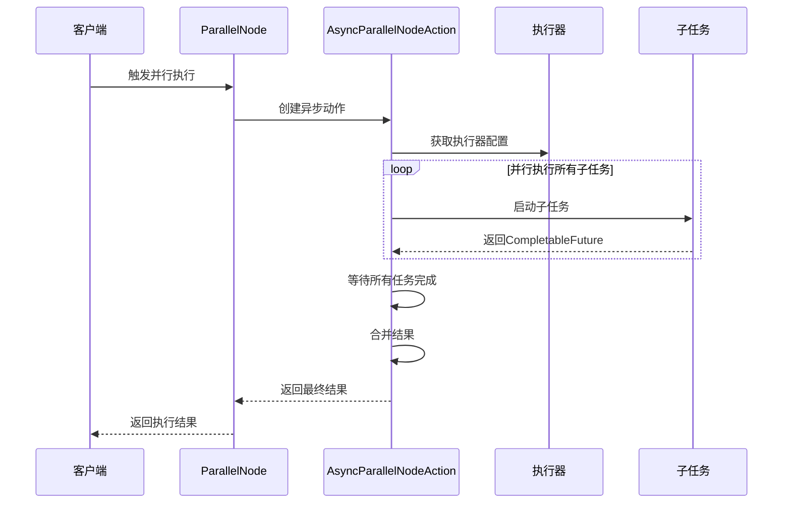
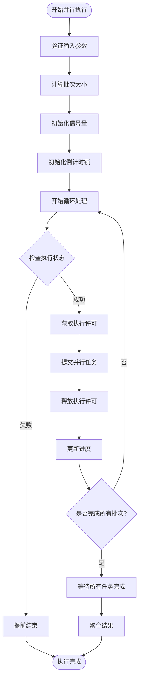
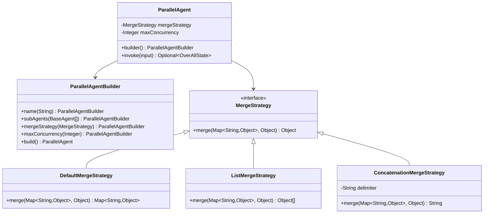
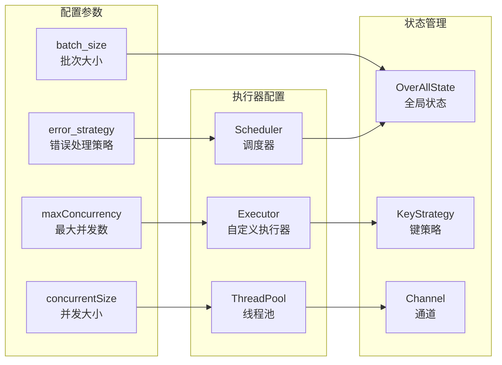
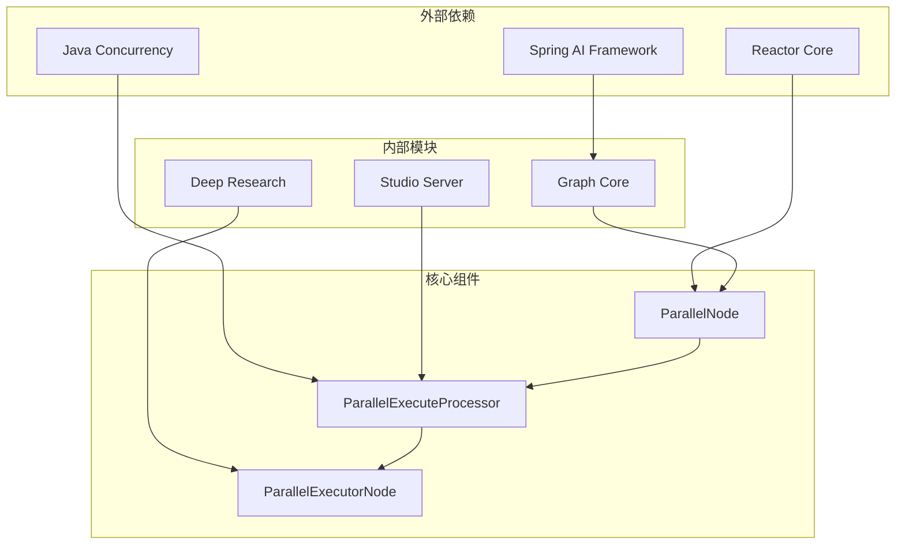

# 并行执行节点

<cite>
**本文档引用的文件**
- [ParallelExecutorNode.java](file://spring-ai-alibaba-deepresearch/src/main/java/com/alibaba/cloud/ai/example/deepresearch/node/ParallelExecutorNode.java)
- [ParallelNode.java](file://spring-ai-alibaba-graph-core/src/main/java/com/alibaba/cloud/ai/graph/internal/node/ParallelNode.java)
- [ParallelExecuteProcessor.java](file://spring-ai-alibaba-studio/spring-ai-alibaba-studio-server/spring-ai-alibaba-studio-server-core/src/main/java/com/alibaba/cloud/ai/studio/core/workflow/processor/impl/ParallelExecuteProcessor.java)
- [ParallelAgentTest.java](file://spring-ai-alibaba-graph-core/src/test/java/com/alibaba/cloud/ai/graph/agent/flow/ParallelAgentTest.java)
- [ParallelAgentIntegrationTest.java](file://spring-ai-alibaba-graph-core/src/test/java/com/alibaba/cloud/ai/graph/agent/ParallelAgentIntegrationTest.java)
- [ParallelAgent.java](file://spring-ai-alibaba-graph-core/src/main/java/com/alibaba/cloud/ai/graph/agent/flow/agent/ParallelAgent.java)
- [ParallelConfigForm.tsx](file://spring-ai-alibaba-studio/spring-ai-alibaba-studio-server/frontend/packages/main/src/pages/App/Workflow/nodes/Parallel/panel.tsx)
- [RunnableConfig.java](file://spring-ai-alibaba-graph-core/src/main/java/com/alibaba/cloud/ai/graph/RunnableConfig.java)
</cite>

## 目录
1. [简介](#简介)
2. [项目结构](#项目结构)
3. [核心组件](#核心组件)
4. [架构概览](#架构概览)
5. [详细组件分析](#详细组件分析)
6. [依赖关系分析](#依赖关系分析)
7. [性能考虑](#性能考虑)
8. [故障排除指南](#故障排除指南)
9. [结论](#结论)

## 简介

ParallelExecutorNode是Spring AI Alibaba框架中的核心并行处理组件，专门设计用于将复杂任务分解为多个子任务并行执行，以显著提高研究效率和系统吞吐量。该组件实现了真正的并行执行能力，支持多种并发控制策略、负载均衡机制和故障恢复功能。

ParallelExecutorNode通过智能的任务调度算法、高效的资源管理和强大的同步机制，为深度研究和复杂工作流提供了卓越的并行处理能力。它不仅支持传统的多线程并行执行，还集成了现代异步编程模型，能够处理复杂的流式数据和实时响应需求。

## 项目结构

ParallelExecutorNode在Spring AI Alibaba项目中分布在多个模块中，形成了完整的并行处理生态系统：



**图表来源**
- [ParallelNode.java](file://spring-ai-alibaba-graph-core/src/main/java/com/alibaba/cloud/ai/graph/internal/node/ParallelNode.java#L37-L149)
- [ParallelExecuteProcessor.java](file://spring-ai-alibaba-studio/spring-ai-alibaba-studio-server/spring-ai-alibaba-studio-server-core/src/main/java/com/alibaba/cloud/ai/studio/core/workflow/processor/impl/ParallelExecuteProcessor.java#L86-L630)

**章节来源**
- [ParallelNode.java](file://spring-ai-alibaba-graph-core/src/main/java/com/alibaba/cloud/ai/graph/internal/node/ParallelNode.java#L1-L149)
- [ParallelExecuteProcessor.java](file://spring-ai-alibaba-studio/spring-ai-alibaba-studio-server/spring-ai-alibaba-studio-server-core/src/main/java/com/alibaba/cloud/ai/studio/core/workflow/processor/impl/ParallelExecuteProcessor.java#L1-L630)

## 核心组件

### ParallelNode - 核心并行节点

ParallelNode是整个并行处理系统的核心组件，继承自基础Node类，专门负责并行任务的执行和管理。

```java
public class ParallelNode extends Node {
    public static final String PARALLEL_PREFIX = "__PARALLEL__";
    
    public static String formatNodeId(String nodeId) {
        return format("%s(%s)", PARALLEL_PREFIX, requireNonNull(nodeId, "nodeId cannot be null!"));
    }
}
```

ParallelNode的核心特性包括：
- **异步并行执行**：支持CompletableFuture异步执行模式
- **流式数据处理**：自动检测和合并Flux流式输出
- **生命周期监听**：完整的节点生命周期事件处理
- **通道管理**：智能的状态通道和数据流管理

### ParallelExecuteProcessor - 并行执行处理器

ParallelExecuteProcessor是工作流引擎中的并行任务处理器，负责协调和管理批量并行任务的执行。

```java
public class ParallelExecuteProcessor extends AbstractExecuteProcessor {
    private static final int MAX_BATCH_SIZE = 200;
    
    @Override
    public NodeResult innerExecute(DirectedAcyclicGraph<String, Edge> graph, 
                                  Node node, WorkflowContext context) {
        // 批量处理逻辑
        int concurrentSize = nodeParam.getConcurrentSize() > 0 
            ? nodeParam.getConcurrentSize() : 1;
        Semaphore semaphore = new Semaphore(concurrentSize);
        CountDownLatch latch = new CountDownLatch(maxIndex);
    }
}
```

**章节来源**
- [ParallelNode.java](file://spring-ai-alibaba-graph-core/src/main/java/com/alibaba/cloud/ai/graph/internal/node/ParallelNode.java#L37-L149)
- [ParallelExecuteProcessor.java](file://spring-ai-alibaba-studio/spring-ai-alibaba-studio-server/spring-ai-alibaba-studio-server-core/src/main/java/com/alibaba/cloud/ai/studio/core/workflow/processor/impl/ParallelExecuteProcessor.java#L86-L200)

## 架构概览

ParallelExecutorNode采用了分层架构设计，从底层的并行执行引擎到上层的工作流编排，形成了完整的并行处理生态系统：



**图表来源**
- [ParallelExecutorNode.java](file://spring-ai-alibaba-deepresearch/src/main/java/com/alibaba/cloud/ai/example/deepresearch/node/ParallelExecutorNode.java#L40-L102)
- [ParallelNode.java](file://spring-ai-alibaba-graph-core/src/main/java/com/alibaba/cloud/ai/graph/internal/node/ParallelNode.java#L37-L149)
- [ParallelExecuteProcessor.java](file://spring-ai-alibaba-studio/spring-ai-alibaba-studio-server/spring-ai-alibaba-studio-server-core/src/main/java/com/alibaba/cloud/ai/studio/core/workflow/processor/impl/ParallelExecuteProcessor.java#L86-L200)

## 详细组件分析

### ParallelNode异步并行执行机制

ParallelNode通过AsyncParallelNodeAction记录实现了高效的异步并行执行：



**图表来源**
- [ParallelNode.java](file://spring-ai-alibaba-graph-core/src/main/java/com/alibaba/cloud/ai/graph/internal/node/ParallelNode.java#L69-L149)

#### 异步执行策略

ParallelNode支持两种执行策略：

1. **同步执行**：适用于简单任务和调试场景
2. **异步执行**：通过CompletableFuture实现真正的并行执行

```java
private CompletableFuture<Map<String, Object>> evalNodeActionAsync(
    AsyncNodeActionWithConfig action,
    OverAllState state, 
    RunnableConfig config, 
    Executor executor) {
    return CompletableFuture.supplyAsync(() -> {
        try {
            return evalNodeActionSync(action, state, config).join();
        } catch (Exception e) {
            throw new RuntimeException(e);
        }
    }, executor);
}
```

### ParallelExecuteProcessor批量处理机制

ParallelExecuteProcessor实现了智能的批量处理和并发控制：



**图表来源**
- [ParallelExecuteProcessor.java](file://spring-ai-alibaba-studio/spring-ai-alibaba-studio-server/spring-ai-alibaba-studio-server-core/src/main/java/com/alibaba/cloud/ai/studio/core/workflow/processor/impl/ParallelExecuteProcessor.java#L151-L200)

#### 并发控制机制

ParallelExecuteProcessor使用多种并发控制机制：

```java
// 并发大小限制
int concurrentSize = nodeParam.getConcurrentSize() > 0 
    ? nodeParam.getConcurrentSize() : 1;

// 信号量控制并发访问
Semaphore semaphore = new Semaphore(concurrentSize);

// 倒计时锁等待所有任务完成
CountDownLatch latch = new CountDownLatch(maxIndex);

// 原子布尔值跟踪子任务状态
AtomicBoolean subTaskStatus = new AtomicBoolean(true);
```

### 流式数据处理和合并

ParallelNode具备强大的流式数据处理能力，能够自动检测和合并Flux流：

```java
// 检查是否有流式输出
boolean hasFlux = results.stream()
    .flatMap(map -> map.values().stream())
    .anyMatch(value -> value instanceof Flux);

if (hasFlux) {
    // 合并所有Flux流
    List<Flux<Object>> fluxList = new ArrayList<>();
    Flux<Object> mergedFlux = Flux.merge(fluxList);
    mergedState.put("__merged_stream__", mergedFlux);
}
```

**章节来源**
- [ParallelNode.java](file://spring-ai-alibaba-graph-core/src/main/java/com/alibaba/cloud/ai/graph/internal/node/ParallelNode.java#L69-L149)
- [ParallelExecuteProcessor.java](file://spring-ai-alibaba-studio/spring-ai-alibaba-studio-server/spring-ai-alibaba-studio-server-core/src/main/java/com/alibaba/cloud/ai/studio/core/workflow/processor/impl/ParallelExecuteProcessor.java#L151-L200)

### ParallelAgent并行代理

ParallelAgent实现了并行扇出/聚集模式，支持多种合并策略：



**图表来源**
- [ParallelAgent.java](file://spring-ai-alibaba-graph-core/src/main/java/com/alibaba/cloud/ai/graph/agent/flow/agent/ParallelAgent.java#L30-L68)
- [ParallelAgentTest.java](file://spring-ai-alibaba-graph-core/src/test/java/com/alibaba/cloud/ai/graph/agent/flow/ParallelAgentTest.java#L350-L448)

#### 合并策略详解

ParallelAgent支持三种主要的合并策略：

1. **DefaultMergeStrategy**：返回Map类型的合并结果
2. **ListMergeStrategy**：返回List类型的合并结果
3. **ConcatenationMergeStrategy**：返回字符串类型的合并结果

```java
// 默认合并策略 - 返回Map
ParallelAgent.DefaultMergeStrategy defaultStrategy = new ParallelAgent.DefaultMergeStrategy();
HashMap<String, Object> results = new HashMap<>();
results.put("key1", "value1");
results.put("key2", "value2");
Object merged = defaultStrategy.merge(results, null); // 返回Map

// 列表合并策略 - 返回List
ParallelAgent.ListMergeStrategy listStrategy = new ParallelAgent.ListMergeStrategy();
Object listResult = listStrategy.merge(results, null); // 返回List

// 连接合并策略 - 返回String
ParallelAgent.ConcatenationMergeStrategy concatStrategy = 
    new ParallelAgent.ConcatenationMergeStrategy(" | ");
Object concatResult = concatStrategy.merge(results, null); // 返回连接后的字符串
```

**章节来源**
- [ParallelAgent.java](file://spring-ai-alibaba-graph-core/src/main/java/com/alibaba/cloud/ai/graph/agent/flow/agent/ParallelAgent.java#L30-L68)
- [ParallelAgentTest.java](file://spring-ai-alibaba-graph-core/src/test/java/com/alibaba/cloud/ai/graph/agent/flow/ParallelAgentTest.java#L350-L448)

### 配置和参数管理

ParallelNode提供了丰富的配置选项和参数管理功能：



**图表来源**
- [ParallelConfigForm.tsx](file://spring-ai-alibaba-studio/spring-ai-alibaba-studio-server/frontend/packages/main/src/pages/App/Workflow/nodes/Parallel/panel.tsx#L95-L117)
- [RunnableConfig.java](file://spring-ai-alibaba-graph-core/src/main/java/com/alibaba/cloud/ai/graph/RunnableConfig.java#L286-L288)

#### 错误处理策略

ParallelNode支持三种错误处理策略：

1. **terminateOnError**：错误时终止所有并行任务
2. **continueOnError**：忽略错误并继续执行
3. **removeErrorOutput**：移除错误输出结果

```java
// 错误处理策略配置
ParallelConfigForm errorHandling = new ParallelConfigForm();
errorHandling.setErrorStrategy("continueOnError");
```

**章节来源**
- [ParallelConfigForm.tsx](file://spring-ai-alibaba-studio/spring-ai-alibaba-studio-server/frontend/packages/main/src/pages/App/Workflow/nodes/Parallel/panel.tsx#L10-L25)

## 依赖关系分析

ParallelExecutorNode的依赖关系体现了清晰的分层架构设计：



**图表来源**
- [ParallelNode.java](file://spring-ai-alibaba-graph-core/src/main/java/com/alibaba/cloud/ai/graph/internal/node/ParallelNode.java#L1-L30)
- [ParallelExecuteProcessor.java](file://spring-ai-alibaba-studio/spring-ai-alibaba-studio-server/spring-ai-alibaba-studio-server-core/src/main/java/com/alibaba/cloud/ai/studio/core/workflow/processor/impl/ParallelExecuteProcessor.java#L1-L50)

**章节来源**
- [ParallelNode.java](file://spring-ai-alibaba-graph-core/src/main/java/com/alibaba/cloud/ai/graph/internal/node/ParallelNode.java#L1-L149)
- [ParallelExecuteProcessor.java](file://spring-ai-alibaba-studio/spring-ai-alibaba-studio-server/spring-ai-alibaba-studio-server-core/src/main/java/com/alibaba/cloud/ai/studio/core/workflow/processor/impl/ParallelExecuteProcessor.java#L1-L630)

## 性能考虑

### 并发性能优化

ParallelExecutorNode在设计时充分考虑了性能优化：

1. **线程池优化**：使用自定义线程池避免资源竞争
2. **信号量控制**：精确控制并发度防止系统过载
3. **异步执行**：充分利用非阻塞I/O提升吞吐量
4. **内存管理**：及时释放不再使用的资源

### 负载均衡策略

系统实现了智能的负载均衡机制：

```java
// 动态负载均衡
int concurrentSize = nodeParam.getConcurrentSize() > 0 
    ? nodeParam.getConcurrentSize() : 1;

// 批次大小限制
int maxIndex = Math.min(maxIndex, MAX_BATCH_SIZE);
```

### 内存使用优化

- **流式处理**：减少大对象的内存占用
- **状态隔离**：每个子任务独立的状态管理
- **结果缓存**：智能的结果缓存机制

## 故障排除指南

### 常见问题和解决方案

1. **并发超限问题**
   - 症状：线程池拒绝异常
   - 解决方案：调整concurrentSize参数

2. **内存溢出问题**
   - 症状：OutOfMemoryError
   - 解决方案：减小batch_size或启用流式处理

3. **死锁问题**
   - 症状：任务长时间无响应
   - 解决方案：检查依赖关系和锁顺序

### 监控和诊断

ParallelExecutorNode提供了完善的监控机制：

```java
// 日志记录
log.info("ParallelExecuteProcessor is executing requestId:{}", context.getRequestId());

// 状态跟踪
AtomicBoolean subTaskStatus = new AtomicBoolean(true);
CountDownLatch latch = new CountDownLatch(maxIndex);
```

**章节来源**
- [ParallelExecuteProcessor.java](file://spring-ai-alibaba-studio/spring-ai-alibaba-studio-server/spring-ai-alibaba-studio-server-core/src/main/java/com/alibaba/cloud/ai/studio/core/workflow/processor/impl/ParallelExecuteProcessor.java#L151-L200)

## 结论

ParallelExecutorNode作为Spring AI Alibaba框架的核心并行处理组件，展现了卓越的设计理念和技术实现。通过分层架构、异步执行、智能调度和灵活配置，它为复杂任务的并行处理提供了强大而可靠的解决方案。

该组件的主要优势包括：

1. **高性能并行处理**：支持大规模并发执行和智能负载均衡
2. **灵活的配置选项**：丰富的参数配置满足不同业务需求
3. **强大的错误处理**：多种错误处理策略确保系统稳定性
4. **完善的监控机制**：全面的日志记录和状态跟踪
5. **优秀的扩展性**：清晰的架构设计便于功能扩展

ParallelExecutorNode不仅提升了系统的整体性能，还为开发者提供了简洁易用的API接口，大大降低了并行编程的复杂度。随着AI应用对并行处理需求的不断增长，ParallelExecutorNode将成为构建高效AI系统的重要基石。