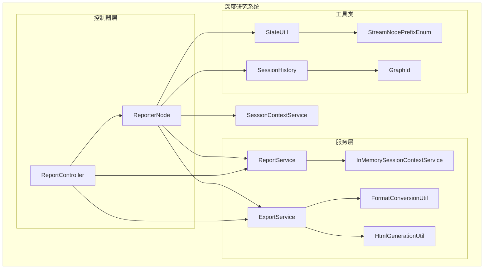
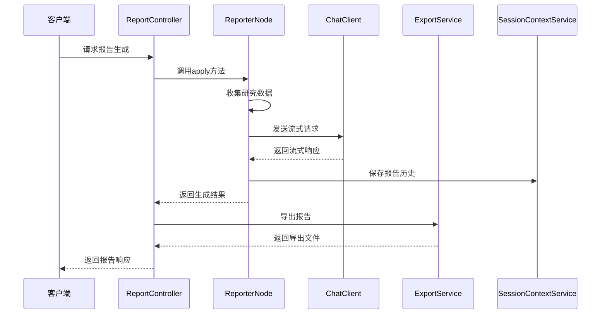
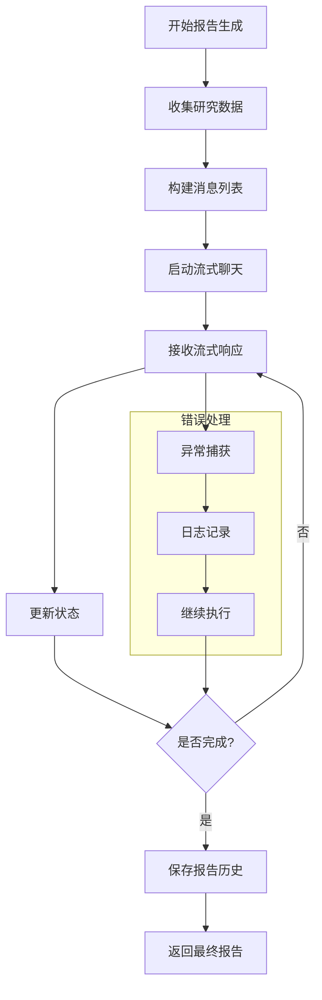
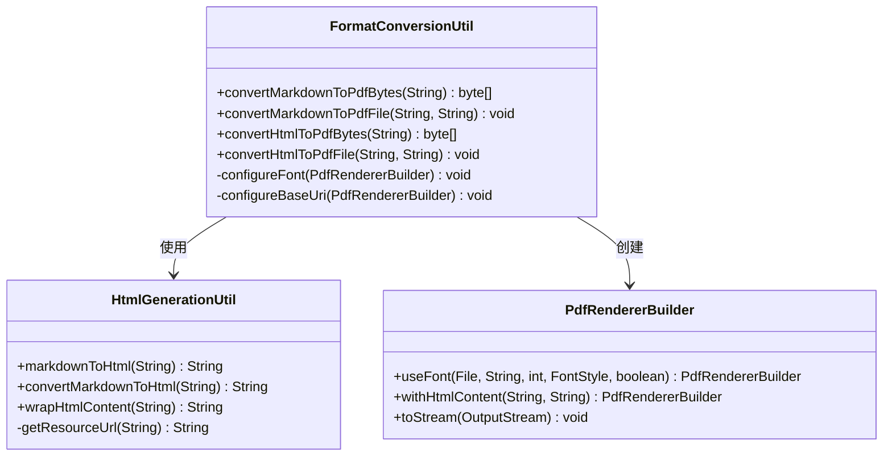
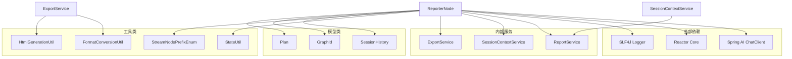

# 报告生成节点

<cite>
**本文档中引用的文件**
- [ReporterNode.java](file://spring-ai-alibaba-deepresearch/src/main/java/com/alibaba/cloud/ai/example/deepresearch/node/ReporterNode.java)
- [ReportService.java](file://spring-ai-alibaba-deepresearch/src/main/java/com/alibaba/cloud/ai/example/deepresearch/service/ReportService.java)
- [ExportService.java](file://spring-ai-alibaba-deepresearch/src/main/java/com/alibaba/cloud/ai/example/deepresearch/service/ExportService.java)
- [SessionContextService.java](file://spring-ai-alibaba-deepresearch/src/main/java/com/alibaba/cloud/ai/example/deepresearch/service/SessionContextService.java)
- [InMemorySessionContextService.java](file://spring-ai-alibaba-deepresearch/src/main/java/com/alibaba/cloud/ai/example/deepresearch/service/InMemorySessionContextService.java)
- [StreamNodePrefixEnum.java](file://spring-ai-alibaba-deepresearch/src/main/java/com/alibaba/cloud/ai/example/deepresearch/model/enums/StreamNodePrefixEnum.java)
- [StateUtil.java](file://spring-ai-alibaba-deepresearch/src/main/java/com/alibaba/cloud/ai/example/deepresearch/util/StateUtil.java)
- [SessionHistory.java](file://spring-ai-alibaba-deepresearch/src/main/java/com/alibaba/cloud/ai/example/deepresearch/model/SessionHistory.java)
- [FormatConversionUtil.java](file://spring-ai-alibaba-deepresearch/src/main/java/com/alibaba/cloud/ai/example/deepresearch/util/export/FormatConversionUtil.java)
- [HtmlGenerationUtil.java](file://spring-ai-alibaba-deepresearch/src/main/java/com/alibaba/cloud/ai/example/deepresearch/util/export/HtmlGenerationUtil.java)
- [ReportController.java](file://spring-ai-alibaba-deepresearch/src/main/java/com/alibaba/cloud/ai/example/deepresearch/controller/ReportController.java)
</cite>

## 目录
1. [简介](#简介)
2. [项目结构](#项目结构)
3. [核心组件](#核心组件)
4. [架构概览](#架构概览)
5. [详细组件分析](#详细组件分析)
6. [依赖关系分析](#依赖关系分析)
7. [性能考虑](#性能考虑)
8. [故障排除指南](#故障排除指南)
9. [结论](#结论)

## 简介

ReporterNode是Spring AI Alibaba深度研究系统中的最终报告生成器节点，负责整合来自其他节点的研究成果，并生成结构化的研究报告。该组件作为整个研究流程的终点，承担着将分散的研究信息整合为连贯、专业的报告的重要职责。

ReporterNode采用流式处理架构，能够实时接收和处理来自多个研究节点的数据输入，包括背景调查、深度研究、专业知识库等模块的输出。它不仅负责内容的整合，还提供了多种报告格式的导出功能，支持Markdown和PDF格式的自动生成。

## 项目结构

ReporterNode所在的深度研究系统采用了分层架构设计，主要包含以下关键目录：



**图表来源**
- [ReporterNode.java](file://spring-ai-alibaba-deepresearch/src/main/java/com/alibaba/cloud/ai/example/deepresearch/node/ReporterNode.java#L49-L79)
- [ReportService.java](file://spring-ai-alibaba-deepresearch/src/main/java/com/alibaba/cloud/ai/example/deepresearch/service/ReportService.java#L20-L55)

**章节来源**
- [ReporterNode.java](file://spring-ai-alibaba-deepresearch/src/main/java/com/alibaba/cloud/ai/example/deepresearch/node/ReporterNode.java#L1-L150)

## 核心组件

### ReporterNode类

ReporterNode实现了NodeAction接口，作为图计算框架中的一个节点，负责处理研究数据并生成最终报告。该类的核心功能包括：

- **数据收集**：从OverAllState中获取背景调查结果、深度研究信息和专业知识库内容
- **消息构建**：将收集到的数据组织成适合LLM处理的消息格式
- **流式生成**：通过ChatClient进行流式对话，逐步生成报告内容
- **结果处理**：将生成的报告保存到会话上下文中，并返回给调用方

### ReportService接口

ReportService定义了报告存储和检索的基本操作：

```java
public interface ReportService {
    void saveReport(String threadId, String report);
    String getReport(String threadId);
    boolean existsReport(String threadId);
    void deleteReport(String threadId);
}
```

该接口提供了报告生命周期管理的所有必要功能，支持按线程ID进行报告的存储、查询、检查存在性和删除操作。

**章节来源**
- [ReporterNode.java](file://spring-ai-alibaba-deepresearch/src/main/java/com/alibaba/cloud/ai/example/deepresearch/node/ReporterNode.java#L49-L79)
- [ReportService.java](file://spring-ai-alibaba-deepresearch/src/main/java/com/alibaba/cloud/ai/example/deepresearch/service/ReportService.java#L20-L55)

## 架构概览

ReporterNode在整个深度研究系统中扮演着最终整合者的角色，其架构设计体现了现代AI应用的最佳实践：



**图表来源**
- [ReporterNode.java](file://spring-ai-alibaba-deepresearch/src/main/java/com/alibaba/cloud/ai/example/deepresearch/node/ReporterNode.java#L61-L148)
- [ReportController.java](file://spring-ai-alibaba-deepresearch/src/main/java/com/alibaba/cloud/ai/example/deepresearch/controller/ReportController.java#L53-L95)

## 详细组件分析

### 数据收集与消息构建

ReporterNode通过StateUtil工具类从OverAllState中提取必要的研究数据：

```java
// 收集背景调查结果
List<String> backgroundInvestigationResults = state.value("background_investigation_results", (List<String>) null);
assert backgroundInvestigationResults != null && !backgroundInvestigationResults.isEmpty();
for (String backgroundInvestigationResult : backgroundInvestigationResults) {
    if (StringUtils.hasText(backgroundInvestigationResult)) {
        messages.add(new UserMessage(backgroundInvestigationResult));
    }
}

// 收集深度研究信息
if (state.value("enable_deepresearch", true)) {
    Plan currentPlan = StateUtil.getPlan(state);
    messages.add(new UserMessage(MessageFormat.format(RESEARCH_FORMAT, currentPlan.getTitle(), currentPlan.getThought())));
    
    // 收集研究团队节点返回的信息
    List<String> researcherTeam = List.of(ParallelEnum.RESEARCHER.getValue(), ParallelEnum.CODER.getValue());
    for (String content : StateUtil.getParallelMessages(state, researcherTeam, StateUtil.getMaxStepNum(state))) {
        messages.add(new UserMessage(content));
    }
    
    // 收集专业知识库内容
    if (state.value("use_professional_kb", false) && StringUtils.hasText(StateUtil.getRagContent(state))) {
        messages.add(new UserMessage(StateUtil.getRagContent(state)));
    }
}
```

这种设计允许ReporterNode灵活地处理来自不同研究阶段的数据，确保报告内容的全面性和准确性。

### 流式生成机制

ReporterNode采用流式处理架构，通过StreamingChatGenerator实现实时报告生成：



**图表来源**
- [ReporterNode.java](file://spring-ai-alibaba-deepresearch/src/main/java/com/alibaba/cloud/ai/example/deepresearch/node/ReporterNode.java#L113-L148)

### 报告导出功能

ExportService提供了丰富的报告导出功能，支持多种格式：

```java
public String saveAsMarkdown(String threadId) {
    String content = reportService.getReport(threadId);
    if (content == null) {
        logger.warn("No report content found for thread: {}", threadId);
        return null;
    }
    
    String filePath = getReportFilePath(threadId, "md");
    return saveContentToFile(content, filePath);
}

public String saveAsPdf(String threadId) {
    String content = reportService.getReport(threadId);
    if (content == null) {
        logger.warn("No report content found for thread: {}", threadId);
        return null;
    }
    
    String pdfFilePath = getReportFilePath(threadId, "pdf");
    FormatConversionUtil.convertMarkdownToPdfFile(content, pdfFilePath);
    return pdfFilePath;
}
```

### 格式转换引擎

FormatConversionUtil利用OpenHTMLTopDF库实现Markdown到PDF的转换：



**图表来源**
- [FormatConversionUtil.java](file://spring-ai-alibaba-deepresearch/src/main/java/com/alibaba/cloud/ai/example/deepresearch/util/export/FormatConversionUtil.java#L30-L184)
- [HtmlGenerationUtil.java](file://spring-ai-alibaba-deepresearch/src/main/java/com/alibaba/cloud/ai/example/deepresearch/util/export/HtmlGenerationUtil.java#L44-L154)

**章节来源**
- [ReporterNode.java](file://spring-ai-alibaba-deepresearch/src/main/java/com/alibaba/cloud/ai/example/deepresearch/node/ReporterNode.java#L61-L148)
- [ExportService.java](file://spring-ai-alibaba-deepresearch/src/main/java/com/alibaba/cloud/ai/example/deepresearch/service/ExportService.java#L77-L119)

### 会话上下文管理

SessionContextService负责管理用户的会话历史和报告状态：

```java
@Override
public void addSessionHistory(GraphId graphId, SessionHistory sessionHistory) {
    sessionThreadMap.putIfAbsent(graphId.sessionId(), new CopyOnWriteArrayList<>());
    sessionThreadMap.get(graphId.sessionId()).add(graphId.threadId());
    // 会话的报告信息由reportService维护
    reportService.saveReport(graphId.threadId(), sessionHistory.getReport());
    sessionHistory.setReport("");
    sessionHistoryMap.put(graphId.threadId(), sessionHistory);
}
```

这种设计确保了报告数据的持久化存储，同时保持了会话状态的高效管理。

**章节来源**
- [InMemorySessionContextService.java](file://spring-ai-alibaba-deepresearch/src/main/java/com/alibaba/cloud/ai/example/deepresearch/service/InMemorySessionContextService.java#L41-L84)

## 依赖关系分析

ReporterNode的依赖关系体现了清晰的分层架构：



**图表来源**
- [ReporterNode.java](file://spring-ai-alibaba-deepresearch/src/main/java/com/alibaba/cloud/ai/example/deepresearch/node/ReporterNode.java#L16-L47)

**章节来源**
- [ReporterNode.java](file://spring-ai-alibaba-deepresearch/src/main/java/com/alibaba/cloud/ai/example/deepresearch/node/ReporterNode.java#L16-L47)

## 性能考虑

ReporterNode在设计时充分考虑了性能优化：

### 流式处理优化
- 使用Reactor的Flux进行异步流式处理
- 实现了高效的内存管理，避免大量数据的全量加载
- 采用事件驱动的架构，减少阻塞等待时间

### 缓存策略
- InMemorySessionContextService使用ConcurrentHashMap提高并发访问性能
- CopyOnWriteArrayList确保线程安全的同时最小化锁竞争

### 错误恢复机制
- 完善的日志记录系统，便于问题诊断
- 异常捕获和优雅降级处理
- 自动重试机制确保关键操作的成功率

## 故障排除指南

### 常见问题及解决方案

1. **报告生成失败**
   - 检查ChatClient连接状态
   - 验证模型配置是否正确
   - 查看日志中的具体错误信息

2. **导出格式错误**
   - 确认支持的格式列表（markdown, pdf）
   - 检查文件权限和存储空间
   - 验证HTML转换过程中的编码问题

3. **内存溢出问题**
   - 监控大报告的处理情况
   - 考虑分块处理大型文档
   - 优化流式处理的缓冲区大小

**章节来源**
- [ReporterNode.java](file://spring-ai-alibaba-deepresearch/src/main/java/com/alibaba/cloud/ai/example/deepresearch/node/ReporterNode.java#L113-L148)

## 结论

ReporterNode作为Spring AI Alibaba深度研究系统的核心组件，展现了现代AI应用架构的设计精髓。它不仅实现了高效的报告生成功能，还提供了完整的导出和管理能力。

该组件的主要优势包括：
- **模块化设计**：清晰的职责分离和接口定义
- **流式处理**：实时响应和高效的资源利用
- **多格式支持**：满足不同场景下的报告需求
- **可扩展性**：易于添加新的导出格式和处理逻辑

通过深入理解ReporterNode的工作原理，开发者可以更好地利用这一强大的报告生成工具，为用户提供高质量的研究报告服务。