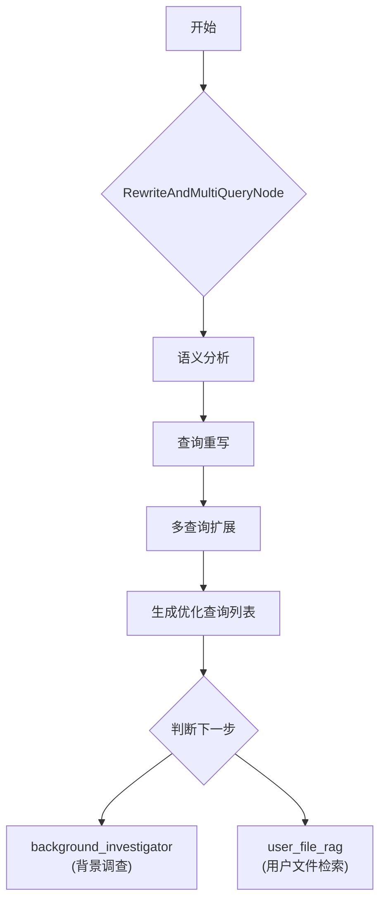
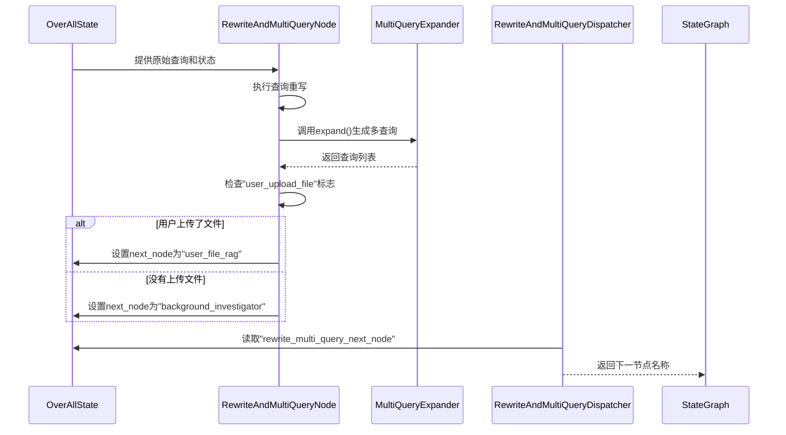

# 查询重写节点

<cite>
**本文档引用的文件**
- [RewriteAndMultiQueryNode.java](file://spring-ai-alibaba-deepresearch/src/main/java/com/alibaba/cloud/ai/example/deepresearch/node/RewriteAndMultiQueryNode.java)
- [DefaultHybridRagProcessor.java](file://spring-ai-alibaba-deepresearch/src/main/java/com/alibaba/cloud/ai/example/deepresearch/rag/core/DefaultHybridRagProcessor.java)
- [QueryRewriteNode.java](file://spring-ai-alibaba-nl2sql/spring-ai-alibaba-nl2sql-chat/src/main/java/com/alibaba/cloud/ai/node/QueryRewriteNode.java)
- [Nl2sqlConfiguration.java](file://spring-ai-alibaba-nl2sql/spring-ai-alibaba-nl2sql-chat/src/main/java/com/alibaba/cloud/ai/config/Nl2sqlConfiguration.java)
- [RewriteAndMultiQueryDispatcher.java](file://spring-ai-alibaba-deepresearch/src/main/java/com/alibaba/cloud/ai/example/deepresearch/dispatcher/RewriteAndMultiQueryDispatcher.java)
</cite>

## 目录
1. [简介](#简介)
2. [核心功能与架构](#核心功能与架构)
3. [查询重写机制](#查询重写机制)
4. [多查询生成策略](#多查询生成策略)
5. [相关性评估与流程控制](#相关性评估与流程控制)
6. [配置与自定义方法](#配置与自定义方法)
7. [性能影响分析](#性能影响分析)
8. [实际应用案例](#实际应用案例)
9. [结论](#结论)

## 简介

`RewriteAndMultiQueryNode` 是一个关键的图节点组件，专门设计用于在信息检索和深度研究场景中优化用户查询。该节点通过语义分析、查询重写和多查询生成等技术手段，显著提升检索结果的准确性和全面性。其主要目标是将原始的、可能模糊或不完整的用户输入转化为一组更精确、更具表达力的查询，从而从知识库或数据库中获取更高质量的相关信息。

该节点广泛应用于需要复杂推理和多角度信息收集的AI代理系统中，特别是在处理自然语言到SQL转换（NL2SQL）和深度研究任务时发挥着至关重要的作用。它作为整个工作流中的预处理环节，为后续的检索、分析和决策步骤奠定了坚实的基础。

## 核心功能与架构

`RewriteAndMultiQueryNode` 的核心功能可以概括为两个阶段：**查询重写**（Query Rewriting）和**多查询生成**（Multi-Query Generation）。这两个阶段协同工作，共同实现对原始查询的深度优化。

该节点实现了 `NodeAction` 接口，这意味着它可以被集成到基于状态图（State Graph）的工作流引擎中。当工作流执行到此节点时，其 `apply` 方法会被调用，并接收一个包含当前上下文信息的 `OverAllState` 对象。节点处理完成后，会返回一个更新后的状态映射，其中包含了优化后的查询列表和下一个要执行的节点名称。

**图来源**
- [RewriteAndMultiQueryNode.java](file://spring-ai-alibaba-deepresearch/src/main/java/com/alibaba/cloud/ai/example/deepresearch/node/RewriteAndMultiQueryNode.java)

**本节来源**
- [RewriteAndMultiQueryNode.java](file://spring-ai-alibaba-deepresearch/src/main/java/com/alibaba/cloud/ai/example/deepresearch/node/RewriteAndMultiQueryNode.java)

## 查询重写机制

查询重写是 `RewriteAndMultiQueryNode` 的第一个核心步骤，旨在澄清用户查询的意图并提高其语义清晰度。这一过程由 `RewriteQueryTransformer` 组件完成，该组件利用大语言模型（LLM）的强大能力来理解并重构原始查询。

在初始化时，`RewriteAndMultiQueryNode` 会接收一个 `ChatClient.Builder` 实例，并使用它来构建一个 `RewriteQueryTransformer`。这个转换器负责执行实际的重写逻辑。当 `apply` 方法被调用时，节点首先从 `OverAllState` 中提取原始查询文本，然后将其封装成一个 `Query` 对象。接着，该对象被传递给 `queryTransformer.transform()` 方法进行处理。

重写过程不仅仅是简单的同义词替换，而是深层次的语义理解和重构。例如，一个模糊的查询“最近的科技趋势”可能会被重写为“2024年第二季度全球范围内最热门的人工智能和量子计算发展动态”。这种重写极大地增强了查询的明确性和可检索性，确保了后续检索能够聚焦于最相关的信息。

**本节来源**
- [RewriteAndMultiQueryNode.java](file://spring-ai-alibaba-deepresearch/src/main/java/com/alibaba/cloud/ai/example/deepresearch/node/RewriteAndMultiQueryNode.java#L30-L71)

## 多查询生成策略

在完成查询重写后，`RewriteAndMultiQueryNode` 会进入多查询生成阶段。这一步骤通过 `MultiQueryExpander` 组件实现，其目的是从不同的角度生成多个变体查询，以覆盖更广泛的信息范围，避免因单一查询视角导致的信息遗漏。

`MultiQueryExpander` 同样依赖于 `ChatClient.Builder` 来调用LLM。它接收经过重写的查询作为输入，并根据配置的数量生成一系列语义等价但表达方式各异的查询。例如，针对重写后的查询“如何提高Java应用的性能”，扩展器可能会生成：
- “有哪些最佳实践可以优化Java应用程序的运行效率？”
- “Java性能调优的关键技术和工具是什么？”
- “解决Java应用高延迟问题的方法有哪些？”

生成的查询数量由 `optimizeQueryNum` 参数控制，该参数从 `OverAllState` 中读取，并被限制在0到5之间（由 `MinOptimizeQueryNum` 和 `MaxOptimizeQueryNum` 常量定义）。此外，`includeOriginal(true)` 配置确保了原始的重写查询也会被包含在最终的查询列表中。所有生成的查询都会被存储在状态中，键名为 `"optimize_queries"`，供后续的检索节点使用。

**本节来源**
- [RewriteAndMultiQueryNode.java](file://spring-ai-alibaba-deepresearch/src/main/java/com/alibaba/cloud/ai/example/deepresearch/node/RewriteAndMultiQueryNode.java#L73-L96)

## 相关性评估与流程控制

`RewriteAndMultiQueryNode` 不仅负责查询优化，还承担着工作流路由的职责。在生成优化查询列表后，节点会根据当前的状态决定下一步的执行路径。

这一决策逻辑非常简单直接：节点检查 `OverAllState` 中是否存在名为 `"user_upload_file"` 的标志位。如果该标志位为 `true`，则意味着用户上传了额外的文件资料，因此下一个节点应为 `"user_file_rag"`，以便优先检索这些用户提供的文档。反之，如果该标志位为 `false` 或不存在，则工作流将继续到 `"background_investigator"` 节点，进行常规的背景信息调查。

这个决策结果同样被写入状态，键名为 `"rewrite_multi_query_next_node"`。随后，一个名为 `RewriteAndMultiQueryDispatcher` 的分发器（实现了 `EdgeAction` 接口）会读取这个值，并据此引导工作流图的边（edge）走向正确的下一个节点。这种设计将业务逻辑与流程控制分离，使得系统更加灵活和可维护。

**图来源**
- [RewriteAndMultiQueryNode.java](file://spring-ai-alibaba-deepresearch/src/main/java/com/alibaba/cloud/ai/example/deepresearch/node/RewriteAndMultiQueryNode.java)
- [RewriteAndMultiQueryDispatcher.java](file://spring-ai-alibaba-deepresearch/src/main/java/com/alibaba/cloud/ai/example/deepresearch/dispatcher/RewriteAndMultiQueryDispatcher.java)

**本节来源**
- [RewriteAndMultiQueryNode.java](file://spring-ai-alibaba-deepresearch/src/main/java/com/alibaba/cloud/ai/example/deepresearch/node/RewriteAndMultiQueryNode.java#L73-L96)
- [RewriteAndMultiQueryDispatcher.java](file://spring-ai-alibaba-deepresearch/src/main/java/com/alibaba/cloud/ai/example/deepresearch/dispatcher/RewriteAndMultiQueryDispatcher.java#L0-L35)

## 配置与自定义方法

`RewriteAndMultiQueryNode` 的行为可以通过多种方式进行配置和定制，以适应不同的应用场景。

最直接的配置是通过 `OverAllState` 中的 `optimizeQueryNum` 参数来控制生成的查询数量。开发者可以在工作流的上游节点或通过API请求设置此参数，从而动态调整查询扩展的广度。

对于更深层次的自定义，开发者可以关注 `RewriteQueryTransformer` 和 `MultiQueryExpander` 的内部实现。虽然具体的提示词（prompt）模板未在搜索结果中直接显示，但可以推断它们是通过 `chatClientBuilder` 注入的。这意味着，通过修改底层 `ChatClient` 的配置或提供自定义的提示词模板，可以改变重写和扩展的具体行为。例如，可以设计一个提示词，要求LLM在重写时特别关注时间敏感性，或在扩展时侧重于技术细节而非商业影响。

此外，在 `spring-ai-alibaba-nl2sql` 模块中存在一个类似的 `QueryRewriteNode`，它通过 `BaseNl2SqlService` 的 `rewriteStream` 方法来实现流式重写，并提供了实时反馈。这表明系统支持多种重写策略，开发者可以根据需求选择或开发更适合特定场景的节点。

**本节来源**
- [RewriteAndMultiQueryNode.java](file://spring-ai-alibaba-deepresearch/src/main/java/com/alibaba/cloud/ai/example/deepresearch/node/RewriteAndMultiQueryNode.java)
- [QueryRewriteNode.java](file://spring-ai-alibaba-nl2sql/spring-ai-alibaba-nl2sql-chat/src/main/java/com/alibaba/cloud/ai/node/QueryRewriteNode.java)
- [Nl2sqlConfiguration.java](file://spring-ai-alibaba-nl2sql/spring-ai-alibaba-nl2sql-chat/src/main/java/com/alibaba/cloud/ai/config/Nl2sqlConfiguration.java)

## 性能影响分析

引入 `RewriteAndMultiQueryNode` 会对系统的整体性能产生双重影响，既有正面收益也有潜在开销。

正面影响是显而易见的：通过生成更精确和全面的查询，后续的检索步骤能够获得质量更高、相关性更强的结果。这减少了无效信息的处理，提高了整个AI代理系统的回答准确率和用户满意度。

然而，这种优化也带来了额外的计算开销。每次执行该节点都需要至少两次对大语言模型的调用——一次用于查询重写，另一次用于多查询扩展。这会增加端到端的响应延迟，尤其是在高并发场景下。此外，生成的多个查询会并行或串行地触发后续的检索操作，这可能会显著增加对向量数据库或其他数据源的负载。

为了平衡性能与效果，建议合理设置 `optimizeQueryNum` 参数。在大多数情况下，3-5个查询变体已经足够覆盖主要的语义角度，无需过度扩展。同时，可以考虑对频繁使用的查询模式实施缓存，避免重复进行重写和扩展。

## 实际应用案例

`RewriteAndMultiQueryNode` 在以下场景中表现出色：

1.  **深度研究助手**：当用户提出一个复杂的开放式问题，如“分析电动汽车行业的未来发展趋势”时，该节点可以将此宽泛的问题重写并扩展为多个具体问题，例如“过去五年全球电动汽车销量增长率”、“主要电池技术的成本下降曲线”以及“各国政府对电动车的补贴政策比较”。这使得系统能够系统性地收集信息，形成一份全面的报告。

2.  **企业知识库问答**：在企业内部，员工可能使用非正式的语言提问，如“怎么报销差旅费？”。`RewriteAndMultiQueryNode` 可以将其重写为“公司差旅费用报销流程、所需单据和审批权限”，并生成多个变体，确保从知识库中检索到所有相关的政策文档、表格模板和常见问题解答。

3.  **NL2SQL系统**：在将自然语言转换为SQL查询的系统中，用户的初始描述可能不够精确。该节点可以澄清模糊的表述，例如将“找一下销售额高的产品”重写为“查找上个季度销售额排名前10%的产品”，从而为后续的SQL生成提供更可靠的输入。

## 结论

`RewriteAndMultiQueryNode` 是一个功能强大且设计精巧的查询优化组件。它通过结合查询重写和多查询生成两种策略，有效解决了信息检索中的准确性和全面性难题。其模块化的架构允许轻松集成到复杂的工作流中，并通过简单的状态标志实现智能的流程路由。

尽管引入了额外的LLM调用开销，但其带来的信息质量提升通常远超性能成本。通过合理的配置和潜在的缓存优化，该节点能够在保证响应速度的同时，显著增强AI系统的认知和推理能力。它是构建高性能、高可靠性的AI代理不可或缺的一环。