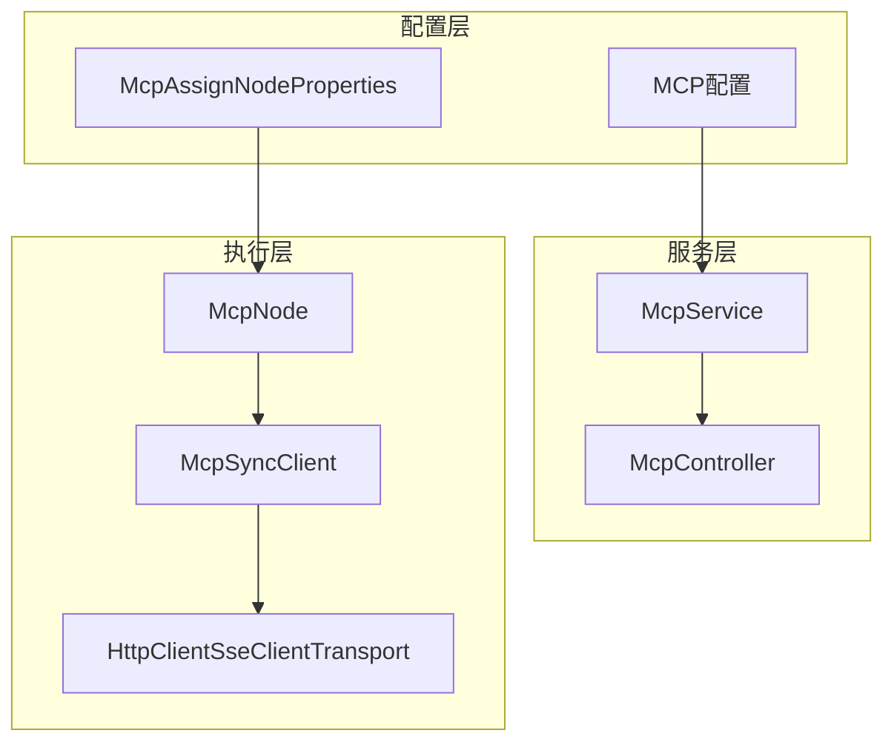
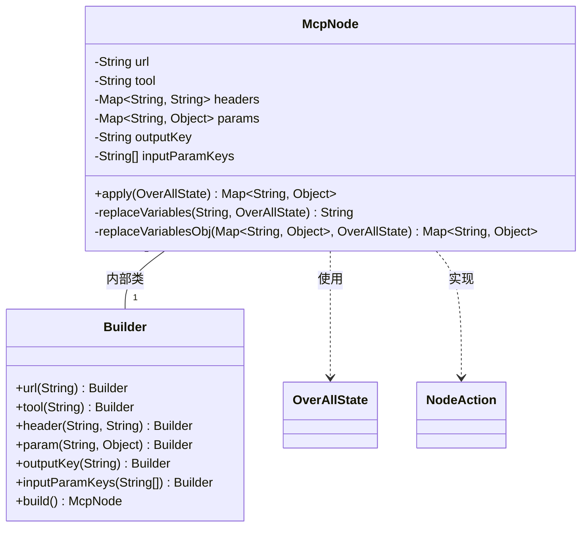
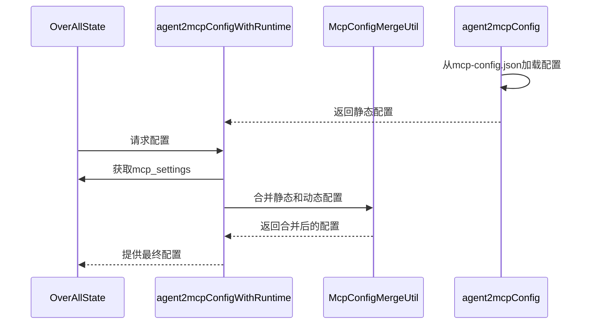
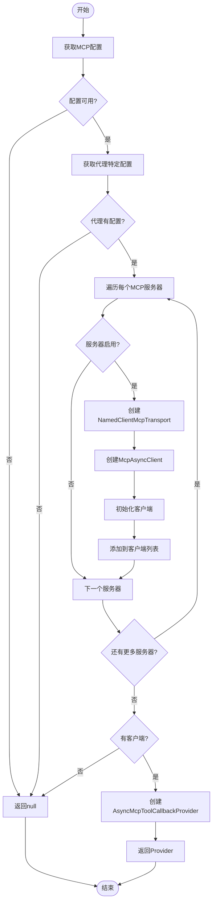
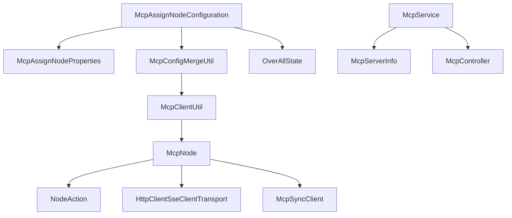

# 研究员节点

<cite>
**本文档引用的文件**
- [McpNode.java](file://spring-ai-alibaba-graph-core/src/main/java/com/alibaba/cloud/ai/graph/node/McpNode.java)
- [McpAssignNodeConfiguration.java](file://spring-ai-alibaba-deepresearch/src/main/java/com/alibaba/cloud/ai/example/deepresearch/agents/McpAssignNodeConfiguration.java)
- [McpAssignNodeProperties.java](file://spring-ai-alibaba-deepresearch/src/main/java/com/alibaba/cloud/ai/example/deepresearch/config/McpAssignNodeProperties.java)
- [McpClientUtil.java](file://spring-ai-alibaba-deepresearch/src/main/java/com/alibaba/cloud/ai/example/deepresearch/util/mcp/McpClientUtil.java)
- [McpConfigMergeUtil.java](file://spring-ai-alibaba-deepresearch/src/main/java/com/alibaba/cloud/ai/example/deepresearch/util/mcp/McpConfigMergeUtil.java)
- [McpController.java](file://spring-ai-alibaba-deepresearch/src/main/java/com/alibaba/cloud/ai/example/deepresearch/controller/McpController.java)
- [McpService.java](file://spring-ai-alibaba-deepresearch/src/main/java/com/alibaba/cloud/ai/example/deepresearch/service/McpService.java)
- [McpServerInfo.java](file://spring-ai-alibaba-deepresearch/src/main/java/com/alibaba/cloud/ai/example/deepresearch/model/dto/McpServerInfo.java)
</cite>

## 目录
1. [引言](#引言)
2. [核心组件分析](#核心组件分析)
3. [架构概述](#架构概述)
4. [详细组件分析](#详细组件分析)
5. [依赖关系分析](#依赖关系分析)
6. [性能考虑](#性能考虑)
7. [故障排除指南](#故障排除指南)
8. [结论](#结论)

## 引言
研究员节点是Spring AI Alibaba框架中用于信息收集和分析的核心组件，它通过Model Control Protocol（MCP）工具实现网络搜索、文档检索和数据分析等功能。该节点能够处理多源异构数据，并在DeepResearch应用中扮演关键角色。

## 核心组件分析
研究员节点主要由McpNode类实现，负责调用MCP服务器执行具体的研究任务。该节点支持变量替换、参数传递和结果处理等核心功能。

**本节来源**
- [McpNode.java](file://spring-ai-alibaba-graph-core/src/main/java/com/alibaba/cloud/ai/graph/node/McpNode.java#L38-L76)

## 架构概述
研究员节点采用模块化设计，通过配置驱动的方式集成MCP工具。系统整体架构包括配置管理、客户端创建、请求执行和结果处理四个主要部分。

**图表来源**
- [McpNode.java](file://spring-ai-alibaba-graph-core/src/main/java/com/alibaba/cloud/ai/graph/node/McpNode.java)
- [McpAssignNodeProperties.java](file://spring-ai-alibaba-deepresearch/src/main/java/com/alibaba/cloud/ai/example/deepresearch/config/McpAssignNodeProperties.java)
- [McpService.java](file://spring-ai-alibaba-deepresearch/src/main/java/com/alibaba/cloud/ai/example/deepresearch/service/McpService.java)
- [McpController.java](file://spring-ai-alibaba-deepresearch/src/main/java/com/alibaba/cloud/ai/example/deepresearch/controller/McpController.java)

## 详细组件分析

### McpNode分析
McpNode是研究员节点的核心实现类，负责执行MCP服务器调用。它通过Builder模式构建，支持URL、工具名称、请求头、参数、输出键和输入参数键等配置。

#### 类图

**图表来源**
- [McpNode.java](file://spring-ai-alibaba-graph-core/src/main/java/com/alibaba/cloud/ai/graph/node/McpNode.java)

**本节来源**
- [McpNode.java](file://spring-ai-alibaba-graph-core/src/main/java/com/alibaba/cloud/ai/graph/node/McpNode.java)

### 配置机制分析
McpAssignNodeConfiguration类提供了MCP节点的配置机制，支持从JSON文件加载静态配置，并能与运行时配置进行合并。

#### 序列图

**图表来源**
- [McpAssignNodeConfiguration.java](file://spring-ai-alibaba-deepresearch/src/main/java/com/alibaba/cloud/ai/example/deepresearch/agents/McpAssignNodeConfiguration.java)
- [McpConfigMergeUtil.java](file://spring-ai-alibaba-deepresearch/src/main/java/com/alibaba/cloud/ai/example/deepresearch/util/mcp/McpConfigMergeUtil.java)

**本节来源**
- [McpAssignNodeConfiguration.java](file://spring-ai-alibaba-deepresearch/src/main/java/com/alibaba/cloud/ai/example/deepresearch/agents/McpAssignNodeConfiguration.java)
- [McpConfigMergeUtil.java](file://spring-ai-alibaba-deepresearch/src/main/java/com/alibaba/cloud/ai/example/deepresearch/util/mcp/McpConfigMergeUtil.java)

### 客户端管理分析
McpClientUtil类负责MCP客户端的创建和管理，根据代理名称和配置动态创建相应的MCP异步客户端。

#### 流程图

**图表来源**
- [McpClientUtil.java](file://spring-ai-alibaba-deepresearch/src/main/java/com/alibaba/cloud/ai/example/deepresearch/util/mcp/McpClientUtil.java)

**本节来源**
- [McpClientUtil.java](file://spring-ai-alibaba-deepresearch/src/main/java/com/alibaba/cloud/ai/example/deepresearch/util/mcp/McpClientUtil.java)

## 依赖关系分析
研究员节点与其他组件存在明确的依赖关系，形成了一个完整的MCP生态系统。

**图表来源**
- [McpAssignNodeConfiguration.java](file://spring-ai-alibaba-deepresearch/src/main/java/com/alibaba/cloud/ai/example/deepresearch/agents/McpAssignNodeConfiguration.java)
- [McpAssignNodeProperties.java](file://spring-ai-alibaba-deepresearch/src/main/java/com/alibaba/cloud/ai/example/deepresearch/config/McpAssignNodeProperties.java)
- [McpConfigMergeUtil.java](file://spring-ai-alibaba-deepresearch/src/main/java/com/alibaba/cloud/ai/example/deepresearch/util/mcp/McpConfigMergeUtil.java)
- [McpClientUtil.java](file://spring-ai-alibaba-deepresearch/src/main/java/com/alibaba/cloud/ai/example/deepresearch/util/mcp/McpClientUtil.java)
- [McpService.java](file://spring-ai-alibaba-deepresearch/src/main/java/com/alibaba/cloud/ai/example/deepresearch/service/McpService.java)
- [McpServerInfo.java](file://spring-ai-alibaba-deepresearch/src/main/java/com/alibaba/cloud/ai/example/deepresearch/model/dto/McpServerInfo.java)
- [McpController.java](file://spring-ai-alibaba-deepresearch/src/main/java/com/alibaba/cloud/ai/example/deepresearch/controller/McpController.java)
- [McpNode.java](file://spring-ai-alibaba-graph-core/src/main/java/com/alibaba/cloud/ai/graph/node/McpNode.java)

**本节来源**
- 所有引用文件

## 性能考虑
研究员节点在设计时考虑了性能优化，包括：
- 使用Builder模式减少对象创建开销
- 支持批量MCP客户端创建
- 采用SSE（Server-Sent Events）协议提高通信效率
- 实现配置缓存避免重复解析
- 支持异步执行提高响应速度

## 故障排除指南
当研究员节点出现问题时，可以参考以下排查步骤：

**本节来源**
- [McpNode.java](file://spring-ai-alibaba-graph-core/src/main/java/com/alibaba/cloud/ai/graph/node/McpNode.java#L240-L247)
- [McpClientUtil.java](file://spring-ai-alibaba-deepresearch/src/main/java/com/alibaba/cloud/ai/example/deepresearch/util/mcp/McpClientUtil.java#L120-L140)

## 结论
研究员节点作为Spring AI Alibaba框架中的核心信息收集和分析组件，通过MCP协议实现了强大的数据采集能力。其模块化设计和灵活的配置机制使其能够适应各种研究场景的需求，为复杂的数据分析任务提供了可靠的基础。