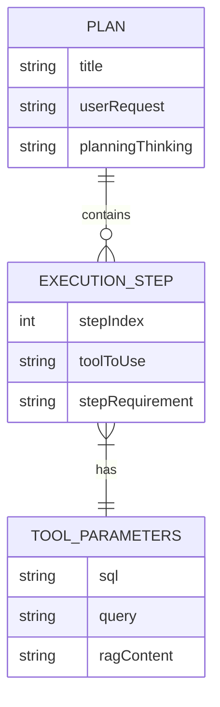
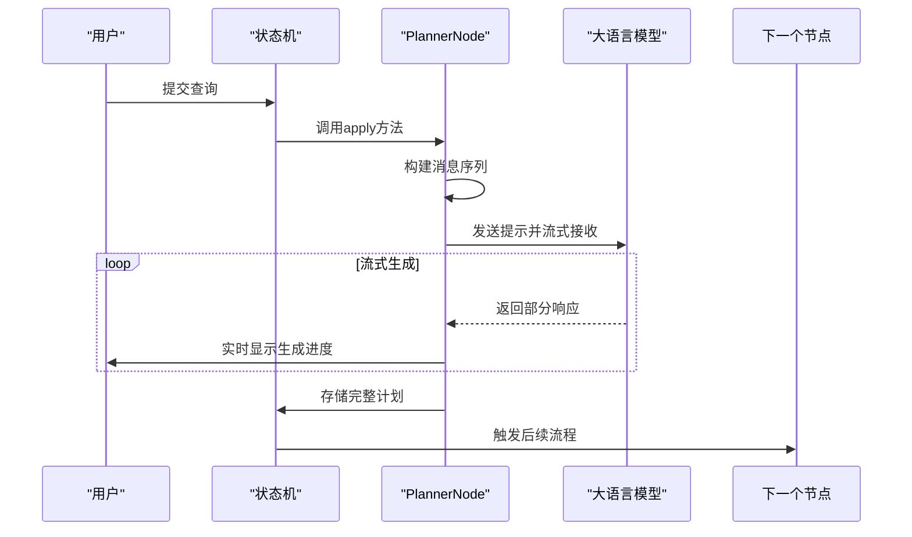
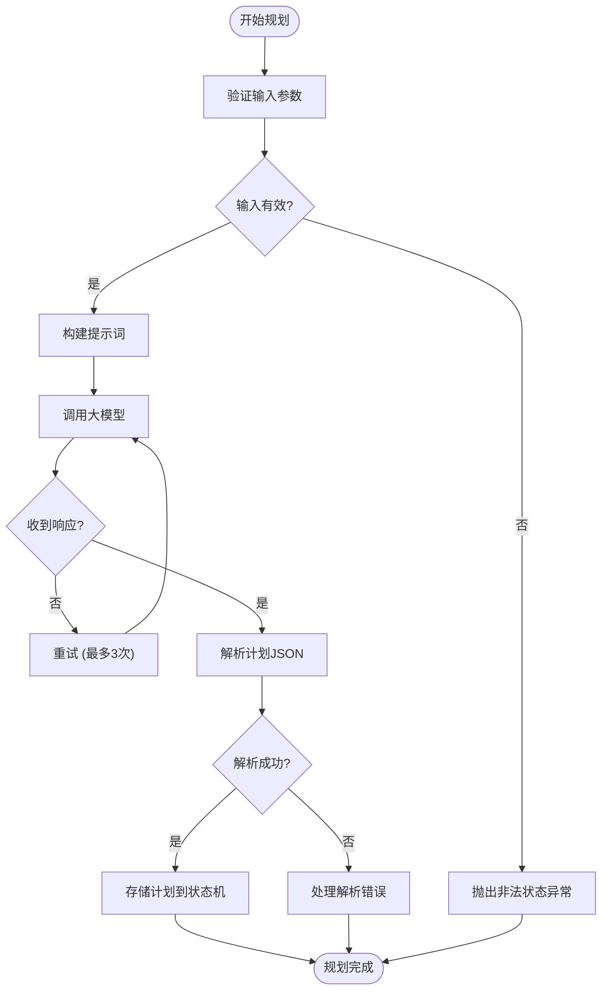
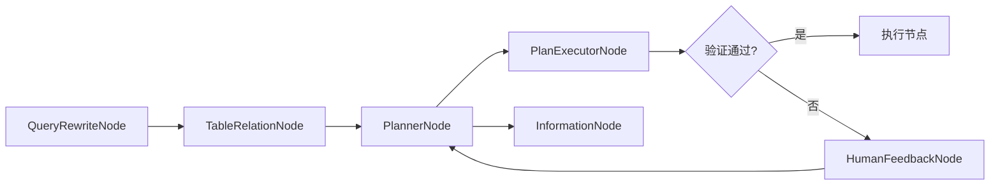

# 规划节点

<cite>
**本文档中引用的文件**   
- [PlannerNode.java](file://spring-ai-alibaba-deepresearch/src/main/java/com/alibaba/cloud/ai/example/deepresearch/node/PlannerNode.java)
- [PlannerNode.java](file://spring-ai-alibaba-nl2sql/spring-ai-alibaba-nl2sql-chat/src/main/java/com/alibaba/cloud/ai/node/PlannerNode.java)
- [AbstractPlanBasedNode.java](file://spring-ai-alibaba-nl2sql/spring-ai-alibaba-nl2sql-chat/src/main/java/com/alibaba/cloud/ai/node/AbstractPlanBasedNode.java)
- [Constant.java](file://spring-ai-alibaba-nl2sql/spring-ai-alibaba-nl2sql-chat/src/main/java/com/alibaba/cloud/ai/constant/Constant.java)
- [ExecutionStep.java](file://spring-ai-alibaba-nl2sql/spring-ai-alibaba-nl2sql-chat/src/main/java/com/alibaba/cloud/ai/model/execution/ExecutionStep.java)
- [PlanInterface.java](file://spring-ai-alibaba-jmanus/src/main/java/com/alibaba/cloud/ai/manus/runtime/entity/vo/PlanInterface.java)
- [PlanningToolInterface.java](file://spring-ai-alibaba-jmanus/src/main/java/com/alibaba/cloud/ai/manus/tool/PlanningToolInterface.java)
</cite>

## 目录
1. [引言](#引言)
2. [核心功能与角色](#核心功能与角色)
3. [输入输出格式](#输入输出格式)
4. [规划流程详解](#规划流程详解)
5. [与PlannerTool的集成](#与plannertool的集成)
6. [错误处理机制](#错误处理机制)
7. [与其他节点的交互模式](#与其他节点的交互模式)
8. [配置与使用示例](#配置与使用示例)
9. [总结](#总结)

## 引言

规划节点（PlannerNode）是研究任务工作流中的初始规划器，负责接收用户查询并生成初步的研究计划。该节点利用大语言模型（LLM）的能力，将复杂的用户请求分解为目标、步骤和资源分配，形成结构化的执行计划。本技术文档深入解析PlannerNode的设计原理、实现细节和使用方法，为开发者提供全面的技术参考。

## 核心功能与角色

PlannerNode作为研究任务的起点，承担着关键的规划职责。其主要功能包括：

- **目标分解**：将用户的高层次查询分解为具体、可执行的目标。
- **步骤规划**：根据分解后的目标，生成详细的执行步骤序列。
- **资源分配**：确定每个步骤所需的工具、代理和参数。
- **计划生成**：利用大模型生成符合预定义JSON Schema的结构化计划输出。

在系统架构中，PlannerNode通常位于工作流的起始位置，接收用户输入后生成计划，并将结果传递给后续的执行节点进行验证和执行。

## 输入输出格式

### 输入格式

PlannerNode接收一个包含用户查询和其他上下文信息的`OverAllState`对象。主要输入字段包括：

- `INPUT_KEY`：用户原始查询文本
- `BUSINESS_KNOWLEDGE`：业务知识上下文
- `SEMANTIC_MODEL`：语义模型信息
- `TABLE_RELATION_OUTPUT`：数据库表关系信息
- `PLAN_VALIDATION_ERROR`：计划验证错误信息（用于修复模式）

### 输出格式

PlannerNode的输出是一个流式生成器（StreamingChatGenerator），最终产生一个JSON格式的计划字符串，存储在状态的`PLANNER_NODE_OUTPUT`键下。计划结构遵循`Plan`类定义，包含执行步骤列表、工具调用参数等信息。



**图源**
- [ExecutionStep.java](file://spring-ai-alibaba-nl2sql/spring-ai-alibaba-nl2sql-chat/src/main/java/com/alibaba/cloud/ai/model/execution/ExecutionStep.java)
- [PlanInterface.java](file://spring-ai-alibaba-jmanus/src/main/java/com/alibaba/cloud/ai/manus/runtime/entity/vo/PlanInterface.java)

## 规划流程详解

PlannerNode的规划流程可分为以下几个阶段：

### 1. 消息构建

节点首先构建发送给大模型的消息序列，包括：
- 预置提示消息模板
- 用户提问内容
- 背景调查结果（如果启用深度研究）
- 用户反馈内容（如果是修复模式）
- RAG查询结果（如果有上传文档）

### 2. 提示工程

根据是否处于修复模式，构建不同的用户提示：
- **初始规划**：直接使用用户查询
- **修复模式**：包含前次被拒绝的计划和用户反馈，要求模型生成新计划

### 3. 计划生成

通过`ChatClient`调用大模型API，以流式方式生成计划。系统使用`StreamingChatGenerator`处理流式响应，实现实时输出。

### 4. 结果处理

将生成的计划字符串包装为流式生成器，存入状态机，供后续节点使用。



**图源**
- [PlannerNode.java](file://spring-ai-alibaba-deepresearch/src/main/java/com/alibaba/cloud/ai/example/deepresearch/node/PlannerNode.java)
- [PlannerNode.java](file://spring-ai-alibaba-nl2sql/spring-ai-alibaba-nl2sql-chat/src/main/java/com/alibaba/cloud/ai/node/PlannerNode.java)

## 与PlannerTool的集成

PlannerNode与PlannerTool通过函数调用（Function Calling）机制紧密集成。PlannerTool实现了`PlanningToolInterface`接口，提供了以下关键功能：

### 接口契约

```java
public interface PlanningToolInterface {
    String getCurrentPlanId();
    PlanInterface getCurrentPlan();
    FunctionToolCallback<?, ToolExecuteResult> getFunctionToolCallback();
    FunctionToolCallback<?, ToolExecuteResult> getFunctionToolCallback(PlanningToolInterface);
}
```

### 集成方式

1. **工具注册**：PlannerTool作为函数工具注册到LLM客户端
2. **回调机制**：当LLM决定创建计划时，触发PlannerTool的回调函数
3. **状态同步**：PlannerTool将生成的计划存储在其内部状态中
4. **结果获取**：PlannerNode通过`getCurrentPlan()`方法获取生成的计划

这种设计实现了关注点分离：PlannerNode负责协调和状态管理，而PlannerTool专注于计划的创建逻辑。

**节源**
- [PlanningToolInterface.java](file://spring-ai-alibaba-jmanus/src/main/java/com/alibaba/cloud/ai/manus/tool/PlanningToolInterface.java)
- [PlannerNode.java](file://spring-ai-alibaba-nl2sql/spring-ai-alibaba-nl2sql-chat/src/main/java/com/alibaba/cloud/ai/node/PlannerNode.java)

## 错误处理机制

PlannerNode实现了多层次的错误处理策略：

### 1. 输入验证

在处理开始前，验证必要输入是否存在：
```java
String input = (String) state.value(INPUT_KEY).orElseThrow();
```

### 2. 计划解析保护

使用`BeanOutputConverter`进行安全的JSON反序列化，捕获可能的解析异常。

### 3. 修复模式

当计划被用户拒绝时，自动进入修复模式：
- 保留前次计划作为上下文
- 将用户反馈整合到新的提示中
- 重新生成改进的计划

### 4. 重试机制

在底层的`PlanCreator`中实现了最多3次的重试机制，确保在临时故障时仍能成功生成计划。



**图源**
- [PlannerNode.java](file://spring-ai-alibaba-nl2sql/spring-ai-alibaba-nl2sql-chat/src/main/java/com/alibaba/cloud/ai/node/PlannerNode.java)
- [PlanCreator.java](file://spring-ai-alibaba-jmanus/src/main/java/com/alibaba/cloud/ai/manus/planning/service/PlanCreator.java)

## 与其他节点的交互模式

PlannerNode在工作流中与其他节点通过状态机进行协作：

### 1. 前驱节点

- **QueryRewriteNode**：可能接收经过重写的查询
- **TableRelationNode**：接收数据库表关系信息作为规划上下文

### 2. 后继节点

- **PlanExecutorNode**：将生成的计划传递给执行器进行验证和执行
- **HumanFeedbackNode**：当需要人工审核时，跳转到反馈节点
- **InformationNode**：在某些工作流中，将计划传递给信息聚合节点

### 3. 状态键约定

使用统一的状态键进行通信：
- `PLANNER_NODE_OUTPUT`：存储计划输出
- `PLAN_CURRENT_STEP`：跟踪当前执行步骤
- `PLAN_VALIDATION_ERROR`：存储验证错误信息



**图源**
- [Nl2sqlConfiguration.java](file://spring-ai-alibaba-nl2sql/spring-ai-alibaba-nl2sql-chat/src/main/java/com/alibaba/cloud/ai/config/Nl2sqlConfiguration.java)
- [Constant.java](file://spring-ai-alibaba-nl2sql/spring-ai-alibaba-nl2sql-chat/src/main/java/com/alibaba/cloud/ai/constant/Constant.java)

## 配置与使用示例

### 基本配置

```java
@Configuration
public class PlannerConfig {
    
    @Bean
    public PlannerNode plannerNode(ChatClient.Builder chatClientBuilder) {
        return new PlannerNode(chatClientBuilder);
    }
}
```

### 使用方法

```java
// 创建PlannerNode实例
PlannerNode plannerNode = new PlannerNode(chatClientBuilder);

// 准备状态
OverAllState state = new OverAllState();
state.updateState(Map.of("input", "如何提高用户留存率？"));

// 执行规划
Map<String, Object> result = plannerNode.apply(state);

// 获取生成的计划
String planOutput = (String) state.value("PLANNER_NODE_OUTPUT").orElse("");
```

### 自定义提示模板

可以通过覆盖默认的提示常量来自定义规划行为：
```java
// 在配置中设置自定义提示
PromptConstant.setPlannerPromptTemplate(customTemplate);
```

**节源**
- [PlannerNode.java](file://spring-ai-alibaba-nl2sql/spring-ai-alibaba-nl2sql-chat/src/main/java/com/alibaba/cloud/ai/node/PlannerNode.java)
- [PromptConstant.java](file://spring-ai-alibaba-nl2sql/spring-ai-alibaba-nl2sql-chat/src/main/java/com/alibaba/cloud/ai/prompt/PromptConstant.java)

## 总结

PlannerNode作为研究任务的初始规划器，通过巧妙的设计实现了复杂任务的自动化分解。它利用大语言模型的强大能力，结合结构化的输出格式和稳健的错误处理机制，为后续的执行流程奠定了坚实的基础。通过与PlannerTool的紧密集成，系统实现了规划逻辑与执行逻辑的解耦，提高了代码的可维护性和扩展性。开发者可以根据具体需求定制提示模板和规划流程，灵活应对各种研究场景。