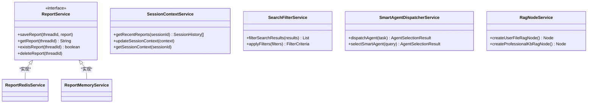

# DeepResearch深度研究代理架构设计文档

<cite>
**本文档引用的文件**
- [DeepResearchApplication.java](file://spring-ai-alibaba-deepresearch/src/main/java/com/alibaba/cloud/ai/example/deepresearch/DeepResearchApplication.java)
- [DeepResearchConfiguration.java](file://spring-ai-alibaba-deepresearch/src/main/java/com/alibaba/cloud/ai/example/deepresearch/config/DeepResearchConfiguration.java)
- [StateGraph.java](file://spring-ai-alibaba-graph-core/src/main/java/com/alibaba/cloud/ai/graph/StateGraph.java)
- [CoordinatorNode.java](file://spring-ai-alibaba-deepresearch/src/main/java/com/alibaba/cloud/ai/example/deepresearch/node/CoordinatorNode.java)
- [ResearcherNode.java](file://spring-ai-alibaba-deepresearch/src/main/java/com/alibaba/cloud/ai/example/deepresearch/node/ResearcherNode.java)
- [ChatController.java](file://spring-ai-alibaba-deepresearch/src/main/java/com/alibaba/cloud/ai/example/deepresearch/controller/ChatController.java)
- [DeepResearchProperties.java](file://spring-ai-alibaba-deepresearch/src/main/java/com/alibaba/cloud/ai/example/deepresearch/config/DeepResearchProperties.java)
- [ReportService.java](file://spring-ai-alibaba-deepresearch/src/main/java/com/alibaba/cloud/ai/example/deepresearch/service/ReportService.java)
- [app-application.yml](file://spring-ai-alibaba-deepresearch/dockerConfig/app-application.yml)
- [package.json](file://spring-ai-alibaba-deepresearch/ui-vue3/package.json)
</cite>

## 目录
1. [简介](#简介)
2. [项目结构概览](#项目结构概览)
3. [核心架构组件](#核心架构组件)
4. [StateGraph工作流编排](#stategraph工作流编排)
5. [多智能体协作机制](#多智能体协作机制)
6. [系统上下文图](#系统上下文图)
7. [组件交互关系](#组件交互关系)
8. [技术选型与设计决策](#技术选型与设计决策)
9. [部署拓扑](#部署拓扑)
10. [性能考虑](#性能考虑)
11. [故障排除指南](#故障排除指南)
12. [总结](#总结)

## 简介

DeepResearch深度研究代理是一个基于Spring Boot的微服务架构系统，专门设计用于处理复杂的深度研究任务。该系统采用先进的StateGraph工作流编排技术，结合多智能体协作机制，能够高效地完成信息收集、分析、整合和报告生成等复杂任务。

系统的核心特点包括：
- 基于Spring Boot的现代化微服务架构
- 利用StateGraph进行灵活的工作流编排
- 多智能体协作的分布式处理能力
- 支持实时流式响应的SSE（Server-Sent Events）通信
- 完整的前后端分离架构
- 可扩展的插件化组件设计

## 项目结构概览

DeepResearch项目采用模块化的Maven项目结构，主要包含以下核心模块：


**图表来源**
- [DeepResearchApplication.java](file://spring-ai-alibaba-deepresearch/src/main/java/com/alibaba/cloud/ai/example/deepresearch/DeepResearchApplication.java#L1-L34)
- [StateGraph.java](file://spring-ai-alibaba-graph-core/src/main/java/com/alibaba/cloud/ai/graph/StateGraph.java#L1-L50)

**章节来源**
- [DeepResearchApplication.java](file://spring-ai-alibaba-deepresearch/src/main/java/com/alibaba/cloud/ai/example/deepresearch/DeepResearchApplication.java#L1-L34)
- [package.json](file://spring-ai-alibaba-deepresearch/ui-vue3/package.json#L1-L79)

## 核心架构组件

### 控制器层（Controller Layer）

控制器层负责处理HTTP请求和WebSocket连接，是系统的入口点：


**图表来源**
- [ChatController.java](file://spring-ai-alibaba-deepresearch/src/main/java/com/alibaba/cloud/ai/example/deepresearch/controller/ChatController.java#L1-L181)

### 服务层（Service Layer）

服务层包含各种业务逻辑服务，支持多智能体协作：



**图表来源**
- [ReportService.java](file://spring-ai-alibaba-deepresearch/src/main/java/com/alibaba/cloud/ai/example/deepresearch/service/ReportService.java#L1-L55)

### 节点层（Node Layer）

节点层是StateGraph的核心组件，每个节点代表一个特定的功能单元：


**图表来源**
- [CoordinatorNode.java](file://spring-ai-alibaba-deepresearch/src/main/java/com/alibaba/cloud/ai/example/deepresearch/node/CoordinatorNode.java#L1-L111)
- [ResearcherNode.java](file://spring-ai-alibaba-deepresearch/src/main/java/com/alibaba/cloud/ai/example/deepresearch/node/ResearcherNode.java#L1-L287)

**章节来源**
- [CoordinatorNode.java](file://spring-ai-alibaba-deepresearch/src/main/java/com/alibaba/cloud/ai/example/deepresearch/node/CoordinatorNode.java#L1-L111)
- [ResearcherNode.java](file://spring-ai-alibaba-deepresearch/src/main/java/com/alibaba/cloud/ai/example/deepresearch/node/ResearcherNode.java#L1-L287)
- [ReportService.java](file://spring-ai-alibaba-deepresearch/src/main/java/com/alibaba/cloud/ai/example/deepresearch/service/ReportService.java#L1-L55)

## StateGraph工作流编排

### StateGraph核心概念

StateGraph是DeepResearch系统的核心工作流编排引擎，它基于状态机模式实现了灵活的任务调度和状态管理：


**图表来源**
- [DeepResearchConfiguration.java](file://spring-ai-alibaba-deepresearch/src/main/java/com/alibaba/cloud/ai/example/deepresearch/config/DeepResearchConfiguration.java#L200-L309)

### 状态管理机制

StateGraph通过键策略（KeyStrategy）来管理状态数据的存储和检索：


**图表来源**
- [ChatController.java](file://spring-ai-alibaba-deepresearch/src/main/java/com/alibaba/cloud/ai/example/deepresearch/controller/ChatController.java#L80-L150)
- [StateGraph.java](file://spring-ai-alibaba-graph-core/src/main/java/com/alibaba/cloud/ai/graph/StateGraph.java#L427-L459)

**章节来源**
- [DeepResearchConfiguration.java](file://spring-ai-alibaba-deepresearch/src/main/java/com/alibaba/cloud/ai/example/deepresearch/config/DeepResearchConfiguration.java#L200-L309)
- [ChatController.java](file://spring-ai-alibaba-deepresearch/src/main/java/com/alibaba/cloud/ai/example/deepresearch/controller/ChatController.java#L80-L150)

## 多智能体协作机制

### 智能体类型与职责

DeepResearch系统支持多种类型的智能体，每种智能体都有特定的职责和能力：


### 智能体选择与调度

系统通过SmartAgentDispatcherService实现智能体的选择和调度：


**图表来源**
- [DeepResearchConfiguration.java](file://spring-ai-alibaba-deepresearch/src/main/java/com/alibaba/cloud/ai/example/deepresearch/config/DeepResearchConfiguration.java#L270-L309)

### 并行执行机制

系统支持多个智能体并行执行相同或相关任务：


**图表来源**
- [DeepResearchConfiguration.java](file://spring-ai-alibaba-deepresearch/src/main/java/com/alibaba/cloud/ai/example/deepresearch/config/DeepResearchConfiguration.java#L270-L309)

**章节来源**
- [DeepResearchConfiguration.java](file://spring-ai-alibaba-deepresearch/src/main/java/com/alibaba/cloud/ai/example/deepresearch/config/DeepResearchConfiguration.java#L270-L309)
- [ResearcherNode.java](file://spring-ai-alibaba-deepresearch/src/main/java/com/alibaba/cloud/ai/example/deepresearch/node/ResearcherNode.java#L80-L150)

## 系统上下文图

### 整体系统架构


**图表来源**
- [app-application.yml](file://spring-ai-alibaba-deepresearch/dockerConfig/app-application.yml#L1-L31)
- [package.json](file://spring-ai-alibaba-deepresearch/ui-vue3/package.json#L1-L79)

### 数据流架构


**图表来源**
- [ChatController.java](file://spring-ai-alibaba-deepresearch/src/main/java/com/alibaba/cloud/ai/example/deepresearch/controller/ChatController.java#L80-L150)

## 组件交互关系

### 核心组件依赖图


**图表来源**
- [DeepResearchConfiguration.java](file://spring-ai-alibaba-deepresearch/src/main/java/com/alibaba/cloud/ai/example/deepresearch/config/DeepResearchConfiguration.java#L1-L309)
- [ChatController.java](file://spring-ai-alibaba-deepresearch/src/main/java/com/alibaba/cloud/ai/example/deepresearch/controller/ChatController.java#L1-L181)

### 状态流转图


**图表来源**
- [DeepResearchConfiguration.java](file://spring-ai-alibaba-deepresearch/src/main/java/com/alibaba/cloud/ai/example/deepresearch/config/DeepResearchConfiguration.java#L200-L309)

**章节来源**
- [DeepResearchConfiguration.java](file://spring-ai-alibaba-deepresearch/src/main/java/com/alibaba/cloud/ai/example/deepresearch/config/DeepResearchConfiguration.java#L1-L309)
- [ChatController.java](file://spring-ai-alibaba-deepresearch/src/main/java/com/alibaba/cloud/ai/example/deepresearch/controller/ChatController.java#L1-L181)

## 技术选型与设计决策

### 核心技术栈

1. **Spring Boot生态系统**
   - 基础框架：Spring Boot 3.x
   - 依赖注入：Spring Framework
   - Web层：Spring WebFlux（响应式编程）
   - 配置管理：Spring Boot Starter

2. **状态图编排引擎**
   - StateGraph：自研工作流编排框架
   - 支持异步执行和流式处理
   - 基于状态机的设计模式

3. **实时通信**
   - SSE（Server-Sent Events）：流式响应
   - WebSocket：双向通信
   - Reactor：响应式编程模型

4. **前端技术栈**
   - Vue3：现代JavaScript框架
   - Ant Design Vue：UI组件库
   - Pinia：状态管理
   - TypeScript：类型安全

### 关键设计决策

1. **StateGraph vs 传统工作流引擎**
   - 优势：轻量级、可扩展、易于调试
   - 特性：支持条件分支、并行执行、状态持久化
   - 应用场景：复杂的多智能体协作任务

2. **响应式编程模型**
   - 优势：非阻塞I/O、高并发处理
   - 实现：Spring WebFlux + Reactor
   - 场景：实时流式响应和大量并发请求

3. **微服务架构**
   - 优势：模块化、可独立部署、易于维护
   - 实现：Spring Cloud生态
   - 场景：大型分布式系统

4. **智能体协作机制**
   - 优势：专业化分工、并行处理、质量保证
   - 实现：多AgentDispatcher + 智能选择算法
   - 场景：复杂研究任务的分解和执行

**章节来源**
- [DeepResearchProperties.java](file://spring-ai-alibaba-deepresearch/src/main/java/com/alibaba/cloud/ai/example/deepresearch/config/DeepResearchProperties.java#L1-L87)
- [package.json](file://spring-ai-alibaba-deepresearch/ui-vue3/package.json#L1-L79)

## 部署拓扑

### 容器化部署架构


**图表来源**
- [app-application.yml](file://spring-ai-alibaba-deepresearch/dockerConfig/app-application.yml#L1-L31)

### Docker Compose配置

系统提供了完整的Docker Compose配置，支持一键部署：

```yaml
version: '3.8'
services:
  deep-research-app:
    build: .
    ports:
      - "8080:8080"
    depends_on:
      - deep-research-redis
      - deep-research-es
    environment:
      - SPRING_PROFILES_ACTIVE=docker
      - SPRING_DATA_REDIS_HOST=deep-research-redis
      - SPRING_AI_ALIBABA_DEEPRESEARCH_RAG_ELASTICSEARCH_URIS=http://deep-research-es:9200
  
  deep-research-redis:
    image: redis:7-alpine
    ports:
      - "6379:6379"
  
  deep-research-es:
    image: docker.elastic.co/elasticsearch/elasticsearch:8.11.0
    ports:
      - "9200:9200"
    environment:
      - discovery.type=single-node
      - xpack.security.enabled=false
```

**章节来源**
- [app-application.yml](file://spring-ai-alibaba-deepresearch/dockerConfig/app-application.yml#L1-L31)

## 性能考虑

### 并发处理能力

1. **响应式编程模型**
   - 支持数千个并发连接
   - 非阻塞I/O操作
   - 内存高效利用

2. **智能体并行执行**
   - 动态调整并行数量
   - 资源限制和保护
   - 负载均衡策略

3. **缓存机制**
   - Redis缓存热点数据
   - Elasticsearch加速搜索
   - 内存缓存常用配置

### 性能优化策略

1. **状态序列化优化**
   - Jackson序列化器
   - 自定义状态序列化器
   - 增量状态更新

2. **流式处理**
   - SSE流式响应
   - 分块传输编码
   - 实时进度反馈

3. **资源管理**
   - 连接池配置
   - 内存使用监控
   - JVM参数调优

## 故障排除指南

### 常见问题诊断

1. **StateGraph执行异常**
   ```java
   // 检查节点配置
   GraphStateException exception = new GraphStateException("节点配置错误");
   exception.printStackTrace();
   
   // 检查状态序列化
   DeepResearchStateSerializer serializer = new DeepResearchStateSerializer();
   OverAllState state = serializer.deserialize(serializedState);
   ```

2. **智能体调度失败**
   ```java
   // 检查智能体可用性
   SmartAgentDispatcherService dispatcher = new SmartAgentDispatcherService();
   AgentSelectionResult result = dispatcher.dispatchAgent(task);
   
   if (result.getSelectedAgent() == null) {
       logger.error("智能体调度失败: {}", result.getErrorReason());
   }
   ```

3. **并行执行超时**
   ```java
   // 配置超时时间
   DeepResearchProperties properties = new DeepResearchProperties();
   properties.setMaxIterations(100); // 增加最大迭代次数
   
   // 监控并行节点状态
   ParallelExecutorNode node = new ParallelExecutorNode(properties);
   Map<String, Object> result = node.apply(state);
   ```

### 监控指标

1. **系统健康检查**
   - CPU使用率
   - 内存占用
   - 网络连接数
   - 数据库连接池状态

2. **应用性能指标**
   - 请求响应时间
   - 并发用户数
   - StateGraph执行时间
   - 智能体调度成功率

3. **业务指标**
   - 研究任务完成率
   - 报告生成时间
   - 用户满意度评分
   - 系统可用性

**章节来源**
- [DeepResearchConfiguration.java](file://spring-ai-alibaba-deepresearch/src/main/java/com/alibaba/cloud/ai/example/deepresearch/config/DeepResearchConfiguration.java#L100-L150)

## 总结

DeepResearch深度研究代理系统是一个高度集成的微服务架构解决方案，具有以下核心优势：

### 技术架构优势

1. **StateGraph工作流编排**
   - 灵活的状态管理和流转控制
   - 支持复杂的多智能体协作
   - 易于扩展和维护的模块化设计

2. **响应式编程模型**
   - 高并发处理能力
   - 实时流式响应
   - 资源高效利用

3. **智能体协作机制**
   - 专业化分工和并行处理
   - 智能的任务分配和调度
   - 质量保证和反思机制

### 系统特性

1. **可扩展性**
   - 模块化设计支持功能扩展
   - 插件化架构便于集成新组件
   - 容器化部署简化运维

2. **可靠性**
   - 完善的错误处理和恢复机制
   - 状态持久化确保数据安全
   - 监控和告警体系保障系统稳定

3. **易用性**
   - RESTful API接口
   - 实时流式响应
   - 完整的前后端分离架构

### 应用场景

DeepResearch系统特别适用于以下场景：
- 复杂的研究项目管理
- 多学科交叉的知识整合
- 高质量报告的自动化生成
- 大规模数据的智能分析

该系统通过先进的技术架构和设计理念，为深度研究任务提供了强大而灵活的解决方案，能够有效提升研究效率和质量，是现代AI应用开发的优秀实践案例。