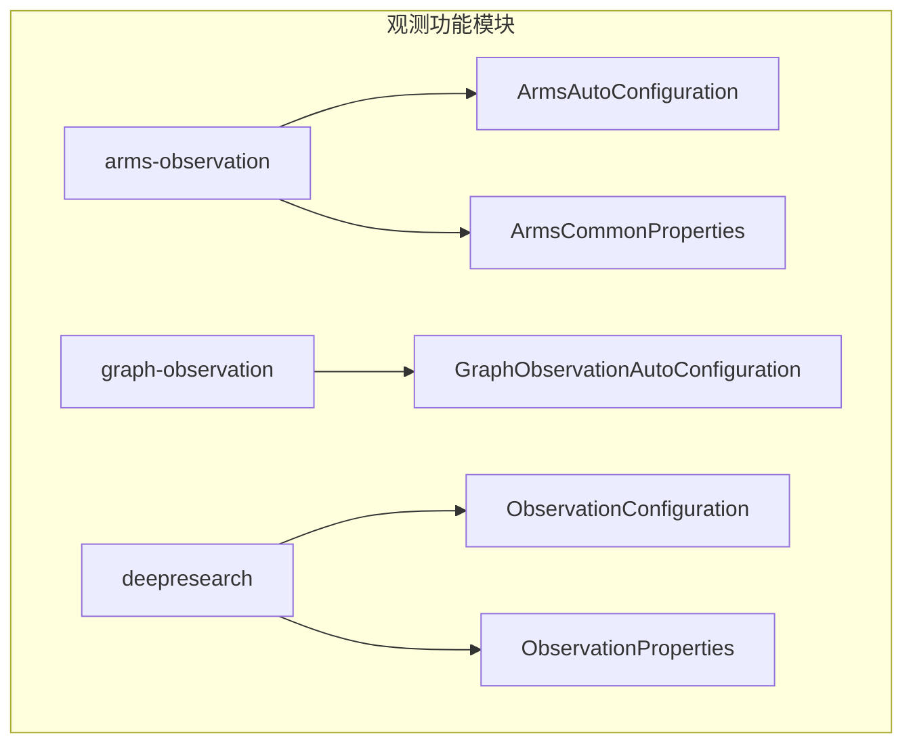
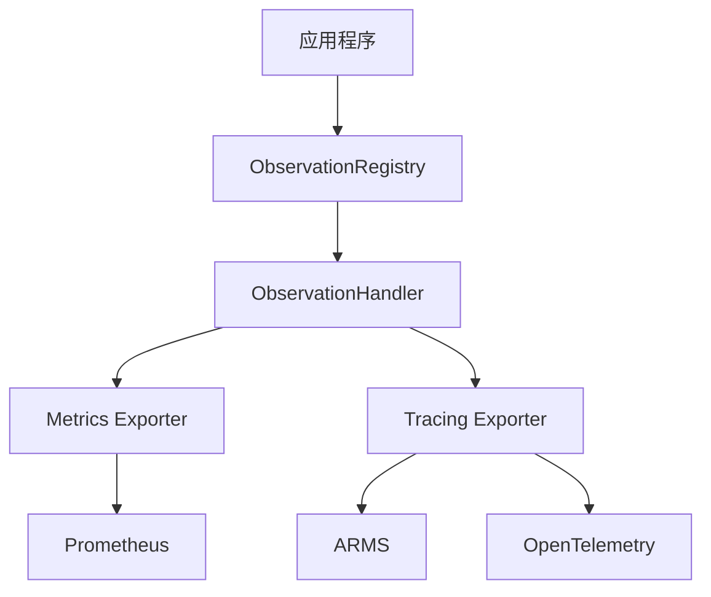
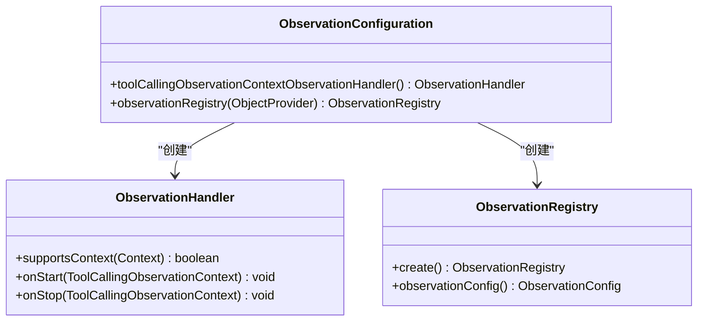
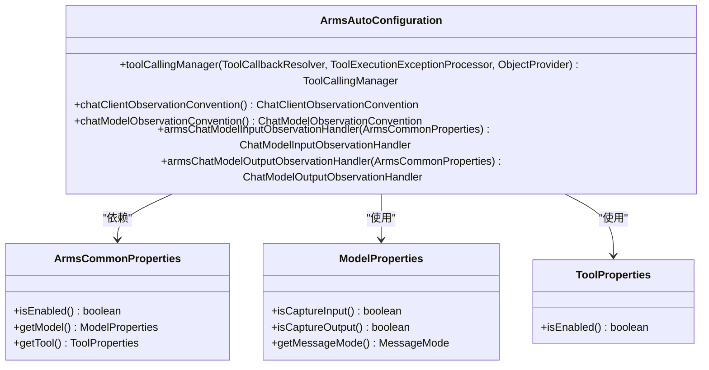
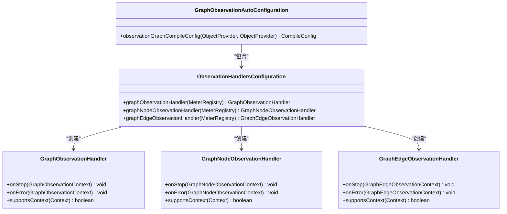

# 观测功能

<cite>
**本文档引用的文件**
- [ArmsAutoConfiguration.java](file://auto-configurations/spring-ai-alibaba-autoconfigure-arms-observation/src/main/java/com/alibaba/cloud/ai/autoconfigure/arms/ArmsAutoConfiguration.java)
- [ArmsCommonProperties.java](file://auto-configurations/spring-ai-alibaba-autoconfigure-arms-observation/src/main/java/com/alibaba/cloud/ai/autoconfigure/arms/ArmsCommonProperties.java)
- [ObservationConfiguration.java](file://spring-ai-alibaba-deepresearch/src/main/java/com/alibaba/cloud/ai/example/deepresearch/agents/ObservationConfiguration.java)
- [ObservationProperties.java](file://spring-ai-alibaba-deepresearch/src/main/java/com/alibaba/cloud/ai/example/deepresearch/config/ObservationProperties.java)
- [application-observability.yml](file://spring-ai-alibaba-deepresearch/src/main/resources/application-observability.yml)
- [GraphObservationAutoConfiguration.java](file://auto-configurations/spring-ai-alibaba-autoconfigure-graph-observation/src/main/java/com/alibaba/cloud/ai/autoconfigure/graph/GraphObservationAutoConfiguration.java)
- [ArmsToolCallingObservationConvention.java](file://spring-ai-alibaba-core/src/main/java/com/alibaba/cloud/ai/tool/observation/ArmsToolCallingObservationConvention.java)
- [ArmsToolCallingObservationContext.java](file://spring-ai-alibaba-core/src/main/java/com/alibaba/cloud/ai/tool/observation/ArmsToolCallingObservationContext.java)
</cite>

## 目录
1. [引言](#引言)
2. [项目结构](#项目结构)
3. [核心组件](#核心组件)
4. [架构概述](#架构概述)
5. [详细组件分析](#详细组件分析)
6. [依赖分析](#依赖分析)
7. [性能考虑](#性能考虑)
8. [故障排除指南](#故障排除指南)
9. [结论](#结论)

## 引言
本文档详细介绍了Spring AI Alibaba项目中的观测功能，重点阐述了基于Spring Observability的监控体系。文档涵盖了ObservationConfiguration如何配置追踪和指标收集，以及ObservationProperties支持的配置选项。系统通过记录关键操作的性能数据和调用链路，为问题诊断和性能优化提供支持。同时，文档提供了与ARMS、Prometheus等监控系统的集成方案，以及自定义指标和追踪的开发指南。

## 项目结构
Spring AI Alibaba项目的观测功能主要分布在多个模块中，包括arms-observation、graph-observation等自动配置模块，以及deepresearch示例项目中的具体实现。这些模块共同构成了完整的监控体系。

**图表来源**
- [ArmsAutoConfiguration.java](file://auto-configurations/spring-ai-alibaba-autoconfigure-arms-observation/src/main/java/com/alibaba/cloud/ai/autoconfigure/arms/ArmsAutoConfiguration.java)
- [ArmsCommonProperties.java](file://auto-configurations/spring-ai-alibaba-autoconfigure-arms-observation/src/main/java/com/alibaba/cloud/ai/autoconfigure/arms/ArmsCommonProperties.java)
- [GraphObservationAutoConfiguration.java](file://auto-configurations/spring-ai-alibaba-autoconfigure-graph-observation/src/main/java/com/alibaba/cloud/ai/autoconfigure/graph/GraphObservationAutoConfiguration.java)
- [ObservationConfiguration.java](file://spring-ai-alibaba-deepresearch/src/main/java/com/alibaba/cloud/ai/example/deepresearch/agents/ObservationConfiguration.java)
- [ObservationProperties.java](file://spring-ai-alibaba-deepresearch/src/main/java/com/alibaba/cloud/ai/example/deepresearch/config/ObservationProperties.java)

**章节来源**
- [ArmsAutoConfiguration.java](file://auto-configurations/spring-ai-alibaba-autoconfigure-arms-observation/src/main/java/com/alibaba/cloud/ai/autoconfigure/arms/ArmsAutoConfiguration.java)
- [ArmsCommonProperties.java](file://auto-configurations/spring-ai-alibaba-autoconfigure-arms-observation/src/main/java/com/alibaba/cloud/ai/autoconfigure/arms/ArmsCommonProperties.java)
- [GraphObservationAutoConfiguration.java](file://auto-configurations/spring-ai-alibaba-autoconfigure-graph-observation/src/main/java/com/alibaba/cloud/ai/autoconfigure/graph/GraphObservationAutoConfiguration.java)

## 核心组件
观测功能的核心组件包括ObservationConfiguration、ObservationProperties、ArmsAutoConfiguration和ArmsCommonProperties。这些组件共同实现了监控体系的配置和管理。

**章节来源**
- [ObservationConfiguration.java](file://spring-ai-alibaba-deepresearch/src/main/java/com/alibaba/cloud/ai/example/deepresearch/agents/ObservationConfiguration.java)
- [ObservationProperties.java](file://spring-ai-alibaba-deepresearch/src/main/java/com/alibaba/cloud/ai/example/deepresearch/config/ObservationProperties.java)
- [ArmsAutoConfiguration.java](file://auto-configurations/spring-ai-alibaba-autoconfigure-arms-observation/src/main/java/com/alibaba/cloud/ai/autoconfigure/arms/ArmsAutoConfiguration.java)
- [ArmsCommonProperties.java](file://auto-configurations/spring-ai-alibaba-autoconfigure-arms-observation/src/main/java/com/alibaba/cloud/ai/autoconfigure/arms/ArmsCommonProperties.java)

## 架构概述
Spring AI Alibaba的观测功能基于Spring Observability构建，通过自动配置和属性配置实现灵活的监控能力。系统支持与ARMS、Prometheus等多种监控系统的集成，能够全面记录AI应用的关键性能指标和调用链路。

**图表来源**
- [ArmsAutoConfiguration.java](file://auto-configurations/spring-ai-alibaba-autoconfigure-arms-observation/src/main/java/com/alibaba/cloud/ai/autoconfigure/arms/ArmsAutoConfiguration.java)
- [ObservationConfiguration.java](file://spring-ai-alibaba-deepresearch/src/main/java/com/alibaba/cloud/ai/example/deepresearch/agents/ObservationConfiguration.java)

## 详细组件分析

### ObservationConfiguration分析
ObservationConfiguration类负责配置观测功能的核心组件，包括ObservationRegistry和自定义的ObservationHandler。

**图表来源**
- [ObservationConfiguration.java](file://spring-ai-alibaba-deepresearch/src/main/java/com/alibaba/cloud/ai/example/deepresearch/agents/ObservationConfiguration.java)

**章节来源**
- [ObservationConfiguration.java](file://spring-ai-alibaba-deepresearch/src/main/java/com/alibaba/cloud/ai/example/deepresearch/agents/ObservationConfiguration.java)

### ArmsAutoConfiguration分析
ArmsAutoConfiguration类提供了ARMS监控的自动配置功能，包括工具调用管理器、聊天客户端和模型的观测约定。

**图表来源**
- [ArmsAutoConfiguration.java](file://auto-configurations/spring-ai-alibaba-autoconfigure-arms-observation/src/main/java/com/alibaba/cloud/ai/autoconfigure/arms/ArmsAutoConfiguration.java)
- [ArmsCommonProperties.java](file://auto-configurations/spring-ai-alibaba-autoconfigure-arms-observation/src/main/java/com/alibaba/cloud/ai/autoconfigure/arms/ArmsCommonProperties.java)

**章节来源**
- [ArmsAutoConfiguration.java](file://auto-configurations/spring-ai-alibaba-autoconfigure-arms-observation/src/main/java/com/alibaba/cloud/ai/autoconfigure/arms/ArmsAutoConfiguration.java)
- [ArmsCommonProperties.java](file://auto-configurations/spring-ai-alibaba-autoconfigure-arms-observation/src/main/java/com/alibaba/cloud/ai/autoconfigure/arms/ArmsCommonProperties.java)

### GraphObservationAutoConfiguration分析
GraphObservationAutoConfiguration类为图计算提供了观测功能的自动配置，包括图、节点和边的观测处理器。

**图表来源**
- [GraphObservationAutoConfiguration.java](file://auto-configurations/spring-ai-alibaba-autoconfigure-graph-observation/src/main/java/com/alibaba/cloud/ai/autoconfigure/graph/GraphObservationAutoConfiguration.java)

**章节来源**
- [GraphObservationAutoConfiguration.java](file://auto-configurations/spring-ai-alibaba-autoconfigure-graph-observation/src/main/java/com/alibaba/cloud/ai/autoconfigure/graph/GraphObservationAutoConfiguration.java)

## 依赖分析
观测功能的实现依赖于多个核心组件和外部库，包括Spring Observability、Micrometer、OpenTelemetry等。

```mermaid
graph TD
A[ObservationConfiguration] --> B[ObservationRegistry]
A --> C[ObservationHandler]
D[ArmsAutoConfiguration] --> E[ArmsCommonProperties]
D --> F[ChatClientObservationConvention]
D --> G[ChatModelObservationConvention]
H[GraphObservationAutoConfiguration] --> I[GraphObservationHandler]
H --> J[GraphNodeObservationHandler]
H --> K[GraphEdgeObservationHandler]
L[ObservationRegistry] --> M[Spring Observability]
N[ChatClientObservationConvention] --> O[Micrometer]
P[GraphObservationHandler] --> Q[OpenTelemetry]
```

**图表来源**
- [ArmsAutoConfiguration.java](file://auto-configurations/spring-ai-alibaba-autoconfigure-arms-observation/src/main/java/com/alibaba/cloud/ai/autoconfigure/arms/ArmsAutoConfiguration.java)
- [ObservationConfiguration.java](file://spring-ai-alibaba-deepresearch/src/main/java/com/alibaba/cloud/ai/example/deepresearch/agents/ObservationConfiguration.java)
- [GraphObservationAutoConfiguration.java](file://auto-configurations/spring-ai-alibaba-autoconfigure-graph-observation/src/main/java/com/alibaba/cloud/ai/autoconfigure/graph/GraphObservationAutoConfiguration.java)

**章节来源**
- [ArmsAutoConfiguration.java](file://auto-configurations/spring-ai-alibaba-autoconfigure-arms-observation/src/main/java/com/alibaba/cloud/ai/autoconfigure/arms/ArmsAutoConfiguration.java)
- [ObservationConfiguration.java](file://spring-ai-alibaba-deepresearch/src/main/java/com/alibaba/cloud/ai/example/deepresearch/agents/ObservationConfiguration.java)
- [GraphObservationAutoConfiguration.java](file://auto-configurations/spring-ai-alibaba-autoconfigure-graph-observation/src/main/java/com/alibaba/cloud/ai/autoconfigure/graph/GraphObservationAutoConfiguration.java)

## 性能考虑
观测功能在提供全面监控能力的同时，也需要考虑性能影响。系统通过条件化配置和懒加载机制来优化性能。

- **条件化配置**：通过@ConditionalOnProperty等注解实现功能的按需启用
- **懒加载**：ObservationHandler等组件采用懒加载方式创建
- **性能监控**：系统自身也提供了性能监控能力，可以跟踪观测功能的性能开销

## 故障排除指南
在使用观测功能时，可能会遇到一些常见问题，以下是一些故障排除建议：

**章节来源**
- [ArmsAutoConfiguration.java](file://auto-configurations/spring-ai-alibaba-autoconfigure-arms-observation/src/main/java/com/alibaba/cloud/ai/autoconfigure/arms/ArmsAutoConfiguration.java)
- [ObservationConfiguration.java](file://spring-ai-alibaba-deepresearch/src/main/java/com/alibaba/cloud/ai/example/deepresearch/agents/ObservationConfiguration.java)
- [application-observability.yml](file://spring-ai-alibaba-deepresearch/src/main/resources/application-observability.yml)

### 配置问题
- 确保在application.yml中正确配置了spring.ai.alibaba.arms.enabled=true
- 检查相关依赖是否已正确添加到项目中
- 验证配置文件的语法是否正确

### 集成问题
- 确认ARMS、Prometheus等监控系统的连接配置正确
- 检查网络连接是否正常
- 验证认证信息是否正确

### 性能问题
- 监控观测功能自身的性能开销
- 根据实际需求调整采样率
- 考虑在生产环境中关闭不必要的观测功能

## 结论
Spring AI Alibaba的观测功能提供了一套完整的监控解决方案，通过灵活的配置和强大的集成能力，能够有效支持AI应用的性能监控和问题诊断。系统基于Spring Observability构建，具有良好的扩展性和兼容性，可以与多种监控系统集成，为AI应用的稳定运行提供有力保障。