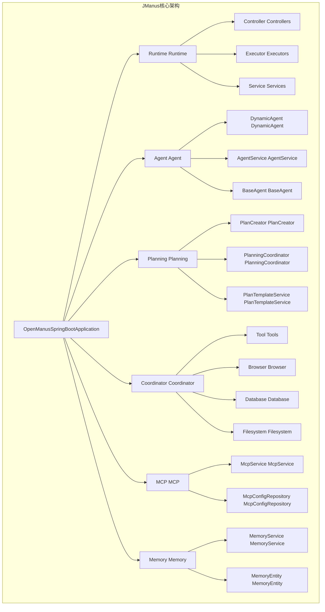
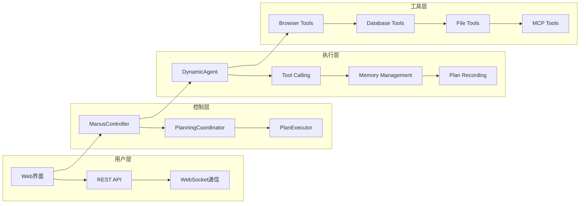
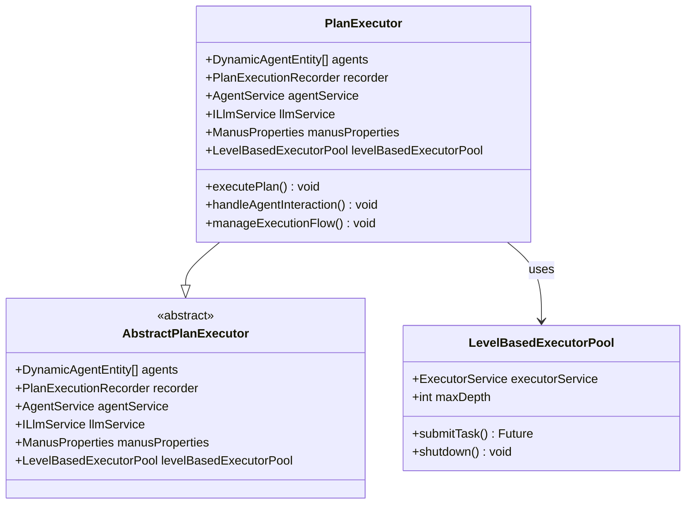
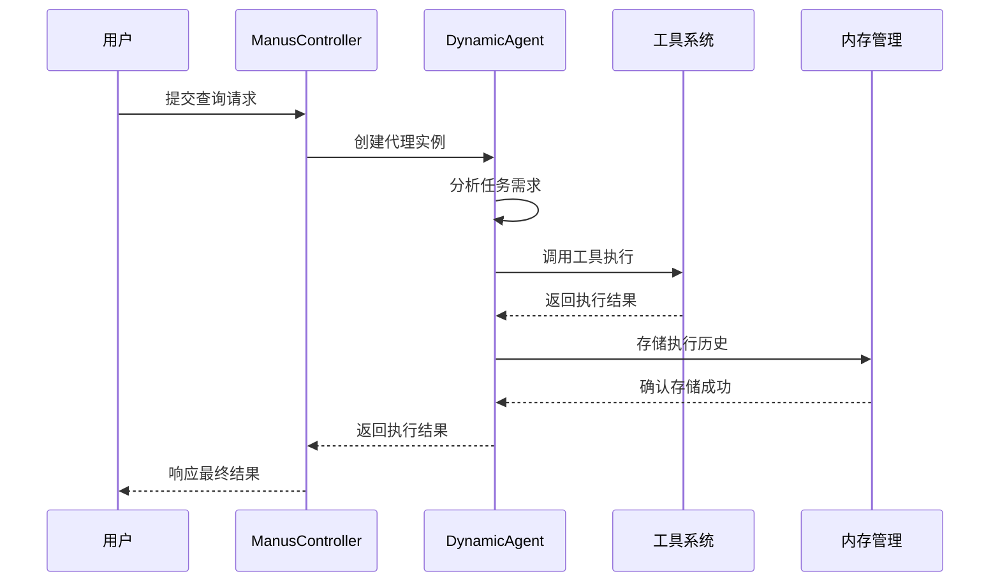
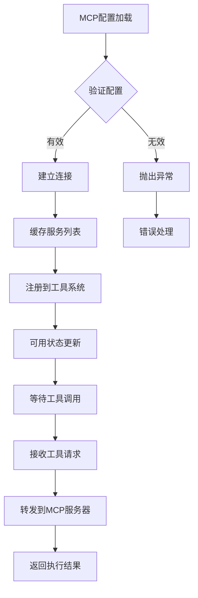
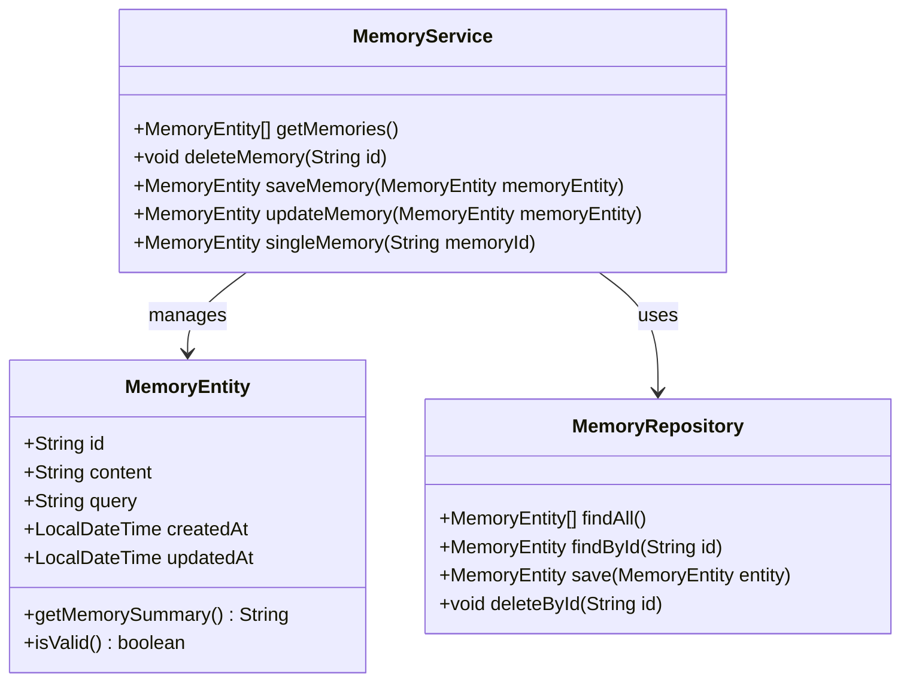
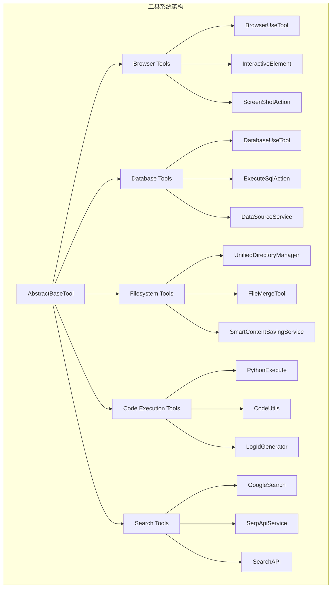
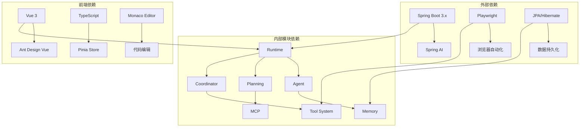

# JManus智能体平台

<cite>
**本文档引用的文件**
- [README.md](file://spring-ai-alibaba-jmanus/README.md)
- [OpenManusSpringBootApplication.java](file://spring-ai-alibaba-jmanus/src/main/java/com/alibaba/cloud/ai/manus/OpenManusSpringBootApplication.java)
- [ManusProperties.java](file://spring-ai-alibaba-jmanus/src/main/java/com/alibaba/cloud/ai/manus/config/ManusProperties.java)
- [ManusController.java](file://spring-ai-alibaba-jmanus/src/main/java/com/alibaba/cloud/ai/manus/runtime/controller/ManusController.java)
- [PlanExecutor.java](file://spring-ai-alibaba-jmanus/src/main/java/com/alibaba/cloud/ai/manus/runtime/executor/PlanExecutor.java)
- [McpService.java](file://spring-ai-alibaba-jmanus/src/main/java/com/alibaba/cloud/ai/manus/mcp/service/McpService.java)
- [MemoryService.java](file://spring-ai-alibaba-jmanus/src/main/java/com/alibaba/cloud/ai/manus/memory/service/MemoryService.java)
- [main.ts](file://spring-ai-alibaba-jmanus/ui-vue3/src/main.ts)
</cite>

## 目录
1. [简介](#简介)
2. [项目结构](#项目结构)
3. [核心组件](#核心组件)
4. [架构概览](#架构概览)
5. [详细组件分析](#详细组件分析)
6. [依赖关系分析](#依赖关系分析)
7. [性能考虑](#性能考虑)
8. [故障排除指南](#故障排除指南)
9. [结论](#结论)

## 简介

JManus是阿里巴巴集团内部广泛使用的Java版Manus智能体平台，专门用于处理需要一定确定性的探索性任务。该平台提供了完整的多智能体协作解决方案，支持HTTP服务调用，适合Java开发者进行二次集成。

### 核心特性

- **纯Java实现的Manus**：提供完整的HTTP调用接口，适合Java开发者集成
- **Plan-Act模式**：精确控制每个执行细节，提供极高的执行确定性
- **MCP集成**：原生支持模型上下文协议(MCP)，实现与外部服务和工具的无缝集成
- **Web界面代理配置**：通过直观的Web管理界面轻松配置代理，无需修改代码
- **无限上下文处理**：支持从海量内容中精准提取目标信息，不依赖特定长上下文模型

## 项目结构

JManus采用模块化的微服务架构，主要包含以下核心模块：



**图表来源**
- [OpenManusSpringBootApplication.java](file://spring-ai-alibaba-jmanus/src/main/java/com/alibaba/cloud/ai/manus/OpenManusSpringBootApplication.java#L1-L48)
- [ManusController.java](file://spring-ai-alibaba-jmanus/src/main/java/com/alibaba/cloud/ai/manus/runtime/controller/ManusController.java#L1-L50)

**章节来源**
- [README.md](file://spring-ai-alibaba-jmanus/README.md#L1-L100)
- [OpenManusSpringBootApplication.java](file://spring-ai-alibaba-jmanus/src/main/java/com/alibaba/cloud/ai/manus/OpenManusSpringBootApplication.java#L1-L48)

## 核心组件

### 启动应用程序

JManus的主应用程序类负责整个系统的初始化和启动：

```java
@SpringBootApplication
@EnableScheduling
@EnableJpaRepositories(basePackages = { "com.alibaba.cloud.ai.manus" })
@EntityScan(basePackages = { "com.alibaba.cloud.ai.manus" })
@ComponentScan(basePackages = { "com.alibaba.cloud.ai.manus" })
public class OpenManusSpringBootApplication {
    
    public static void main(String[] args) throws IOException, InterruptedException {
        if (args != null && args.length >= 1 && args[0].equals("playwright-init")) {
            Playwright.create();
            System.out.println("Playwright init finished");
            System.exit(0);
        }
        else {
            SpringApplication.run(OpenManusSpringBootApplication.class, args);
        }
    }
}
```

### 配置属性管理

ManusProperties类提供了全面的系统配置管理：

```java
@Component
@ConfigurationProperties(prefix = "manus")
public class ManusProperties implements IManusProperties {
    
    // 浏览器设置
    @ConfigProperty(group = "manus", subGroup = "browser", key = "headless")
    private volatile Boolean browserHeadless;
    
    // 代理设置
    @ConfigProperty(group = "manus", subGroup = "agent", key = "maxSteps")
    private volatile Integer maxSteps;
    
    // 交互设置
    @ConfigProperty(group = "manus", subGroup = "interaction", key = "openBrowser")
    private volatile Boolean openBrowserAuto;
}
```

**章节来源**
- [OpenManusSpringBootApplication.java](file://spring-ai-alibaba-jmanus/src/main/java/com/alibaba/cloud/ai/manus/OpenManusSpringBootApplication.java#L30-L48)
- [ManusProperties.java](file://spring-ai-alibaba-jmanus/src/main/java/com/alibaba/cloud/ai/manus/config/ManusProperties.java#L25-L100)

## 架构概览

JManus采用分层架构设计，支持Plan-Act执行模式和MCP协议集成：



**图表来源**
- [ManusController.java](file://spring-ai-alibaba-jmanus/src/main/java/com/alibaba/cloud/ai/manus/runtime/controller/ManusController.java#L45-L90)
- [PlanExecutor.java](file://spring-ai-alibaba-jmanus/src/main/java/com/alibaba/cloud/ai/manus/runtime/executor/PlanExecutor.java#L30-L45)

## 详细组件分析

### 计划执行器(PlanExecutor)

PlanExecutor是JManus的核心执行引擎，负责协调多个动态代理的执行：



**图表来源**
- [PlanExecutor.java](file://spring-ai-alibaba-jmanus/src/main/java/com/alibaba/cloud/ai/manus/runtime/executor/PlanExecutor.java#L30-L45)

### 动态代理(DynamicAgent)

动态代理是JManus的核心智能体组件，支持ReAct模式和自定义行为：



**图表来源**
- [ManusController.java](file://spring-ai-alibaba-jmanus/src/main/java/com/alibaba/cloud/ai/manus/runtime/controller/ManusController.java#L80-L120)

### MCP服务集成

MCP(Machine Context Protocol)服务提供了与外部工具和服务的标准化集成：



**图表来源**
- [McpService.java](file://spring-ai-alibaba-jmanus/src/main/java/com/alibaba/cloud/ai/manus/mcp/service/McpService.java#L60-L120)

### 内存管理系统

内存管理系统负责维护代理的对话历史和执行状态：



**图表来源**
- [MemoryService.java](file://spring-ai-alibaba-jmanus/src/main/java/com/alibaba/cloud/ai/manus/memory/service/MemoryService.java#L20-L40)

**章节来源**
- [PlanExecutor.java](file://spring-ai-alibaba-jmanus/src/main/java/com/alibaba/cloud/ai/manus/runtime/executor/PlanExecutor.java#L1-L48)
- [McpService.java](file://spring-ai-alibaba-jmanus/src/main/java/com/alibaba/cloud/ai/manus/mcp/service/McpService.java#L1-L100)
- [MemoryService.java](file://spring-ai-alibaba-jmanus/src/main/java/com/alibaba/cloud/ai/manus/memory/service/MemoryService.java#L1-L40)

### 工具系统架构

JManus提供了丰富的工具集，支持浏览器自动化、数据库操作、文件处理等多种功能：



**章节来源**
- [README.md](file://spring-ai-alibaba-jmanus/README.md#L50-L100)

## 依赖关系分析

JManus的依赖关系体现了其模块化设计和可扩展性：



**图表来源**
- [OpenManusSpringBootApplication.java](file://spring-ai-alibaba-jmanus/src/main/java/com/alibaba/cloud/ai/manus/OpenManusSpringBootApplication.java#L25-L35)

**章节来源**
- [OpenManusSpringBootApplication.java](file://spring-ai-alibaba-jmanus/src/main/java/com/alibaba/cloud/ai/manus/OpenManusSpringBootApplication.java#L25-L48)

## 性能考虑

JManus在设计时充分考虑了性能优化：

### 并发执行策略
- 使用LevelBasedExecutorPool实现分层级的线程池管理
- 支持异步任务处理和并发执行
- 提供任务优先级调度机制

### 内存管理
- 实现了高效的内存回收机制
- 支持内存限制配置(maxMemory参数)
- 提供内存使用监控和告警

### 缓存机制
- 使用Guava Cache缓存频繁访问的数据
- 实现MCP服务配置缓存
- 提供响应式数据缓存策略

## 故障排除指南

### 常见问题及解决方案

1. **浏览器自动化失败**
   - 检查Playwright驱动程序是否正确初始化
   - 验证浏览器头设置(headless模式)
   - 确认网络连接和超时配置

2. **MCP连接问题**
   - 验证MCP服务器配置
   - 检查网络连通性和防火墙设置
   - 确认认证凭据的有效性

3. **内存溢出问题**
   - 调整maxMemory配置参数
   - 清理过期的执行记录
   - 优化代理的最大步数限制

**章节来源**
- [ManusProperties.java](file://spring-ai-alibaba-jmanus/src/main/java/com/alibaba/cloud/ai/manus/config/ManusProperties.java#L120-L180)

## 结论

JManus智能体平台是一个功能完整、架构清晰的企业级AI智能体解决方案。它通过模块化设计实现了高度的可扩展性和可维护性，通过Plan-Act模式确保了执行的确定性，通过MCP协议实现了与外部系统的无缝集成。

### 主要优势

1. **技术先进性**：采用最新的Spring Boot技术和AI框架
2. **架构合理性**：模块化设计便于维护和扩展
3. **功能完整性**：提供从基础代理到高级工具的完整功能栈
4. **易用性**：通过Web界面和REST API提供友好的用户接口

### 应用场景

- 企业级AI助手系统
- 自动化业务流程处理
- 数据分析和报告生成
- 多智能体协作任务

JManus为开发者提供了一个强大而灵活的平台，可以快速构建和部署各种AI驱动的应用程序，是企业数字化转型的重要工具。