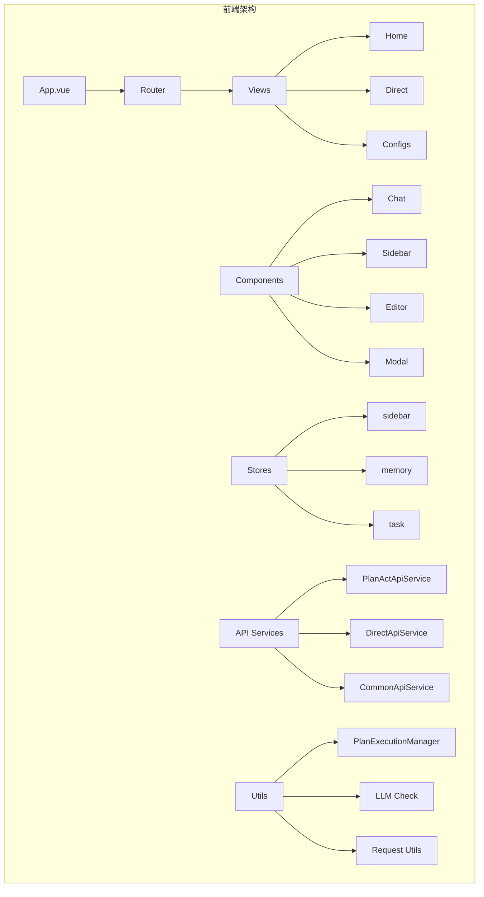
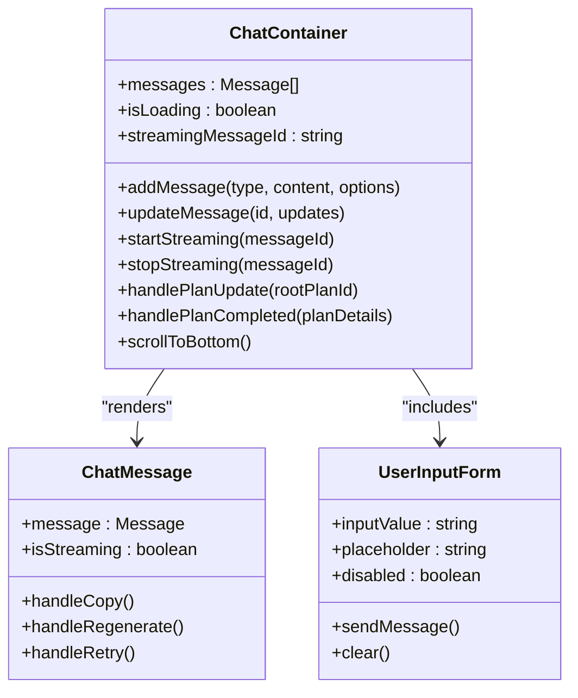
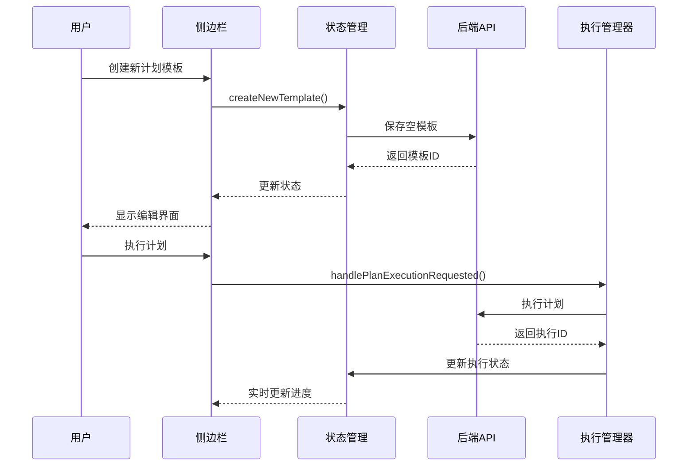
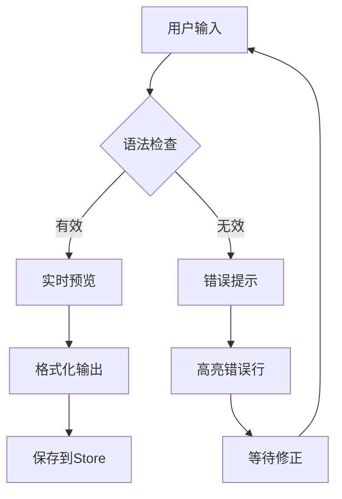
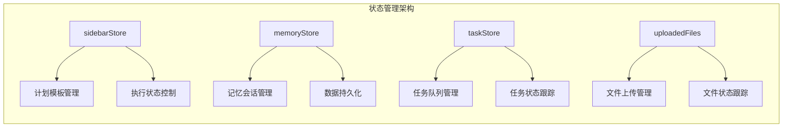
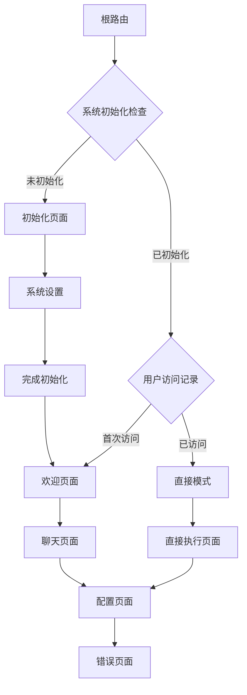
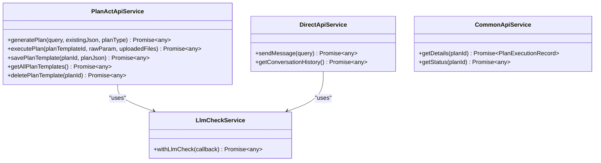
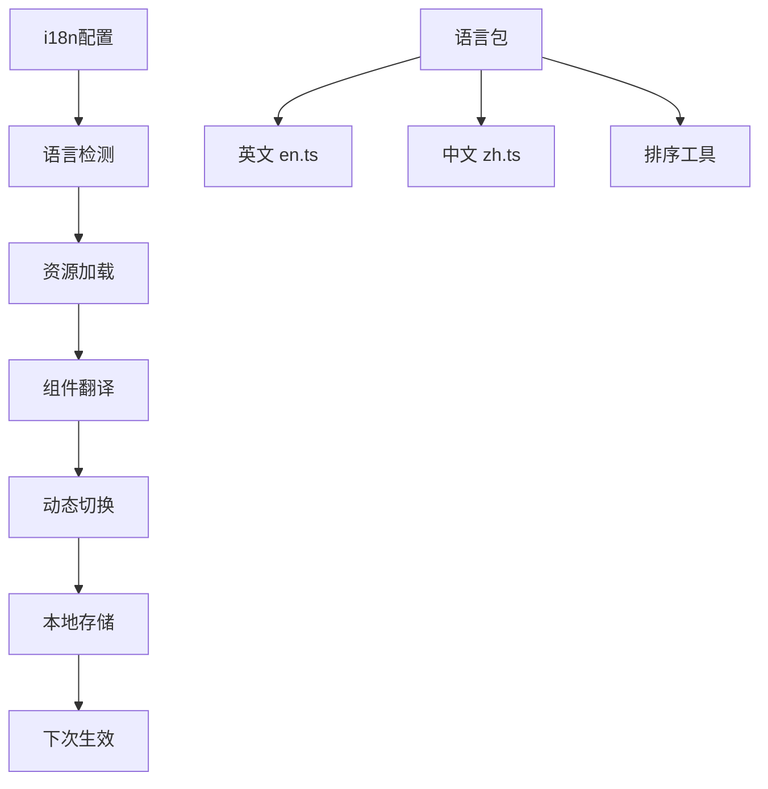
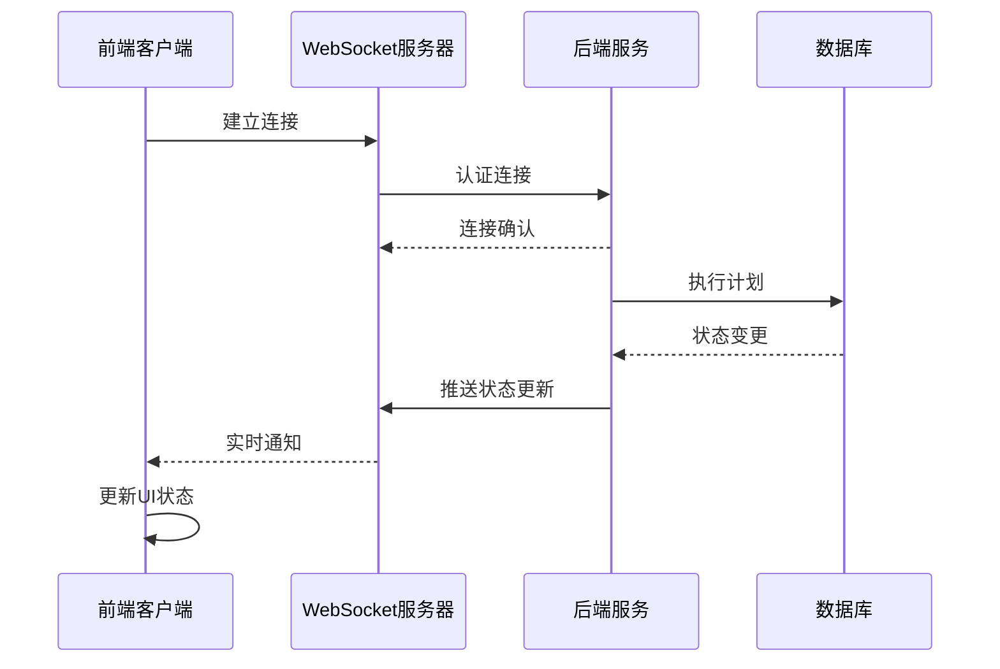
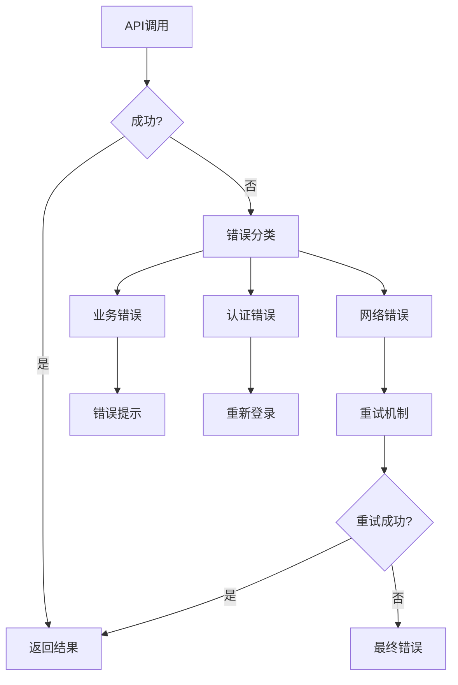

# JManus平台前端UI组件详细使用文档

<cite>
**本文档引用的文件**
- [main.ts](file://spring-ai-alibaba-jmanus/ui-vue3/src/main.ts)
- [App.vue](file://spring-ai-alibaba-jmanus/ui-vue3/src/App.vue)
- [router/index.ts](file://spring-ai-alibaba-jmanus/ui-vue3/src/router/index.ts)
- [router/defaultRoutes.ts](file://spring-ai-alibaba-jmanus/ui-vue3/src/router/defaultRoutes.ts)
- [views/home/index.vue](file://spring-ai-alibaba-jmanus/ui-vue3/src/views/home/index.vue)
- [views/direct/index.vue](file://spring-ai-alibaba-jmanus/ui-vue3/src/views/direct/index.vue)
- [components/chat/ChatContainer.vue](file://spring-ai-alibaba-jmanus/ui-vue3/src/components/chat/ChatContainer.vue)
- [components/sidebar/Sidebar.vue](file://spring-ai-alibaba-jmanus/ui-vue3/src/components/sidebar/Sidebar.vue)
- [stores/sidebar.ts](file://spring-ai-alibaba-jmanus/ui-vue3/src/stores/sidebar.ts)
- [api/plan-act-api-service.ts](file://spring-ai-alibaba-jmanus/ui-vue3/src/api/plan-act-api-service.ts)
- [utils/plan-execution-manager.ts](file://spring-ai-alibaba-jmanus/ui-vue3/src/utils/plan-execution-manager.ts)
- [types/plan-execution-record.ts](file://spring-ai-alibaba-jmanus/ui-vue3/src/types/plan-execution-record.ts)
- [base/i18n/index.ts](file://spring-ai-alibaba-jmanus/ui-vue3/src/base/i18n/index.ts)
</cite>

## 目录
1. [简介](#简介)
2. [项目架构概览](#项目架构概览)
3. [核心组件系统](#核心组件系统)
4. [状态管理模式](#状态管理模式)
5. [路由配置与导航](#路由配置与导航)
6. [API服务层](#api服务层)
7. [国际化支持](#国际化支持)
8. [组件定制化指南](#组件定制化指南)
9. [前后端交互机制](#前后端交互机制)
10. [最佳实践建议](#最佳实践建议)

## 简介

JManus平台是一个基于Vue3构建的现代化AI智能体开发与执行平台，提供了完整的前端UI组件系统。该平台采用模块化的架构设计，集成了智能体调试面板、执行监控视图、配置编辑器等核心功能，为用户提供直观、高效的AI应用开发体验。

## 项目架构概览

JManus前端采用现代化的Vue3 Composition API架构，结合TypeScript提供强类型支持，使用Pinia进行状态管理，通过Ant Design Vue组件库构建统一的UI风格。



**图表来源**
- [main.ts](file://spring-ai-alibaba-jmanus/ui-vue3/src/main.ts#L1-L34)
- [App.vue](file://spring-ai-alibaba-jmanus/ui-vue3/src/App.vue#L1-L77)

**章节来源**
- [main.ts](file://spring-ai-alibaba-jmanus/ui-vue3/src/main.ts#L1-L34)
- [App.vue](file://spring-ai-alibaba-jmanus/ui-vue3/src/App.vue#L1-L77)

## 核心组件系统

### 智能体调试面板（ChatContainer）

智能体调试面板是JManus的核心组件之一，负责处理AI对话和计划执行的可视化展示。



**图表来源**
- [components/chat/ChatContainer.vue](file://spring-ai-alibaba-jmanus/ui-vue3/src/components/chat/ChatContainer.vue#L1-L445)

#### 主要功能特性

1. **实时消息渲染**：支持用户消息和助手消息的动态渲染
2. **流式响应处理**：实现AI响应的渐进式显示效果
3. **计划执行监控**：集成计划执行状态的可视化展示
4. **滚动行为管理**：智能控制消息容器的滚动行为

### 执行监控视图（Sidebar）

侧边栏组件提供计划模板管理和执行控制功能。



**图表来源**
- [components/sidebar/Sidebar.vue](file://spring-ai-alibaba-jmanus/ui-vue3/src/components/sidebar/Sidebar.vue#L1-L1034)
- [stores/sidebar.ts](file://spring-ai-alibaba-jmanus/ui-vue3/src/stores/sidebar.ts#L1-L431)

#### 组件功能模块

1. **模板列表管理**：支持计划模板的创建、编辑、删除操作
2. **版本控制**：提供模板版本历史管理和回滚功能
3. **参数配置**：支持执行参数的动态配置和验证
4. **工具集成**：与各种AI工具和服务的无缝集成

### 配置编辑器（MonacoEditor）

基于Monaco Editor的高级代码编辑器，提供语法高亮、自动补全等功能。



**图表来源**
- [components/editor/MonacoEditor.ts](file://spring-ai-alibaba-jmanus/ui-vue3/src/components/editor/MonacoEditor.ts)
- [components/sidebar/JsonEditor.vue](file://spring-ai-alibaba-jmanus/ui-vue3/src/components/sidebar/JsonEditor.vue)

**章节来源**
- [components/chat/ChatContainer.vue](file://spring-ai-alibaba-jmanus/ui-vue3/src/components/chat/ChatContainer.vue#L1-L445)
- [components/sidebar/Sidebar.vue](file://spring-ai-alibaba-jmanus/ui-vue3/src/components/sidebar/Sidebar.vue#L1-L1034)

## 状态管理模式

JManus采用Pinia作为状态管理解决方案，实现了清晰的状态分离和组件间通信。



**图表来源**
- [stores/sidebar.ts](file://spring-ai-alibaba-jmanus/ui-vue3/src/stores/sidebar.ts#L1-L431)

### 核心状态管理特性

1. **响应式状态**：所有状态变化都会触发UI自动更新
2. **模块化设计**：不同业务领域的状态独立管理
3. **持久化支持**：关键状态自动保存到localStorage
4. **类型安全**：完整的TypeScript类型定义

**章节来源**
- [stores/sidebar.ts](file://spring-ai-alibaba-jmanus/ui-vue3/src/stores/sidebar.ts#L1-L431)

## 路由配置与导航

JManus使用Vue Router实现单页应用的路由管理，支持初始化检查和页面权限控制。



**图表来源**
- [router/index.ts](file://spring-ai-alibaba-jmanus/ui-vue3/src/router/index.ts#L1-L62)
- [router/defaultRoutes.ts](file://spring-ai-alibaba-jmanus/ui-vue3/src/router/defaultRoutes.ts#L1-L116)

### 路由守卫机制

系统实现了全局路由守卫，确保只有在系统初始化完成后才能访问主页面：

1. **初始化检查**：每次页面加载时检查系统初始化状态
2. **本地存储同步**：维护初始化状态的一致性
3. **错误处理**：网络异常时的降级处理逻辑

**章节来源**
- [router/index.ts](file://spring-ai-alibaba-jmanus/ui-vue3/src/router/index.ts#L1-L62)
- [router/defaultRoutes.ts](file://spring-ai-alibaba-jmanus/ui-vue3/src/router/defaultRoutes.ts#L1-L116)

## API服务层

JManus提供了完整的API服务层，封装了与后端的所有交互逻辑。



**图表来源**
- [api/plan-act-api-service.ts](file://spring-ai-alibaba-jmanus/ui-vue3/src/api/plan-act-api-service.ts#L1-L186)

### API服务特性

1. **统一错误处理**：所有API调用都经过统一的错误处理机制
2. **LLM检查集成**：在关键操作前进行模型可用性检查
3. **文件上传支持**：完整的文件上传和管理功能
4. **异步操作管理**：支持长时间运行的操作和轮询机制

**章节来源**
- [api/plan-act-api-service.ts](file://spring-ai-alibaba-jmanus/ui-vue3/src/api/plan-act-api-service.ts#L1-L186)

## 国际化支持

JManus提供了完整的国际化支持，包括语言切换、多语言资源管理和动态语言加载。



**图表来源**
- [base/i18n/index.ts](file://spring-ai-alibaba-jmanus/ui-vue3/src/base/i18n/index.ts#L1-L104)

### 国际化功能

1. **双语支持**：同时支持英文和中文界面
2. **动态切换**：运行时切换语言而不刷新页面
3. **资源管理**：统一的语言资源管理和排序工具
4. **后端同步**：语言切换时同步更新后端提示语言

**章节来源**
- [base/i18n/index.ts](file://spring-ai-alibaba-jmanus/ui-vue3/src/base/i18n/index.ts#L1-L104)

## 组件定制化指南

### 自定义主题样式

JManus支持通过CSS变量和Less预处理器进行主题定制：

```typescript
// 自定义主题变量
const customTheme = {
  primaryColor: '#667eea',
  secondaryColor: '#764ba2',
  backgroundColor: '#0a0a0a',
  textColor: '#ffffff'
}
```

### 组件扩展方法

1. **继承现有组件**：通过Vue的extend方法创建新的组件变体
2. **插槽扩展**：利用Vue的插槽系统添加自定义内容
3. **组合式API**：使用composables实现功能复用

### 插件系统

JManus支持插件扩展，允许开发者添加自定义功能：

```typescript
// 插件注册示例
app.use(customPlugin, {
  components: {
    CustomComponent: CustomComponent
  },
  services: {
    customApi: customApiService
  }
})
```

## 前后端交互机制

### WebSocket实时更新

系统支持WebSocket连接，实现实时的消息推送和状态更新：



### REST API调用

传统的REST API调用机制，支持同步和异步操作：

1. **同步请求**：适用于简单的数据查询和配置操作
2. **异步请求**：支持长时间运行的任务和批处理操作
3. **轮询机制**：对于无法实时推送的场景使用轮询获取状态

### 错误处理策略



## 最佳实践建议

### 性能优化

1. **组件懒加载**：使用Vue的异步组件实现按需加载
2. **虚拟滚动**：对于大量消息列表使用虚拟滚动技术
3. **缓存策略**：合理使用浏览器缓存和内存缓存
4. **防抖节流**：对频繁触发的操作使用防抖和节流

### 可访问性

1. **键盘导航**：确保所有功能都可以通过键盘访问
2. **屏幕阅读器**：为重要元素添加适当的ARIA标签
3. **颜色对比度**：保证文本和背景的颜色对比度符合标准
4. **焦点管理**：正确管理键盘焦点的移动

### 安全考虑

1. **输入验证**：对所有用户输入进行严格的验证和清理
2. **CSRF保护**：实施跨站请求伪造防护措施
3. **XSS防护**：对用户生成的内容进行适当的转义
4. **权限控制**：基于角色的访问控制和权限验证

### 开发规范

1. **代码组织**：遵循Vue官方的最佳实践和代码组织规范
2. **类型安全**：充分利用TypeScript的类型系统
3. **测试覆盖**：编写单元测试和集成测试
4. **文档维护**：保持代码注释和文档的及时更新

### 用户体验优化

1. **加载状态**：为所有异步操作提供明确的加载指示
2. **错误恢复**：提供友好的错误处理和恢复选项
3. **反馈机制**：及时向用户提供操作反馈
4. **性能监控**：监控应用性能并及时优化

通过遵循这些最佳实践，可以确保JManus平台的前端组件系统具有良好的可维护性、可扩展性和用户体验。