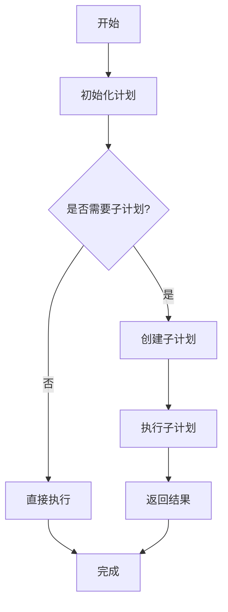
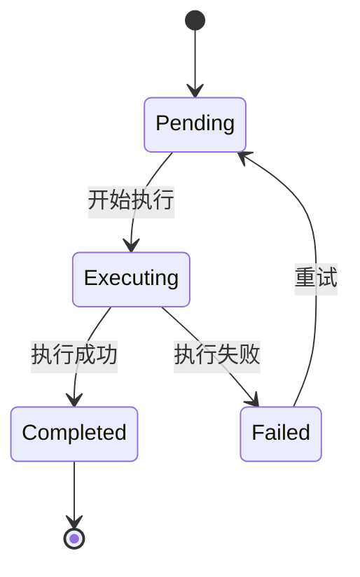
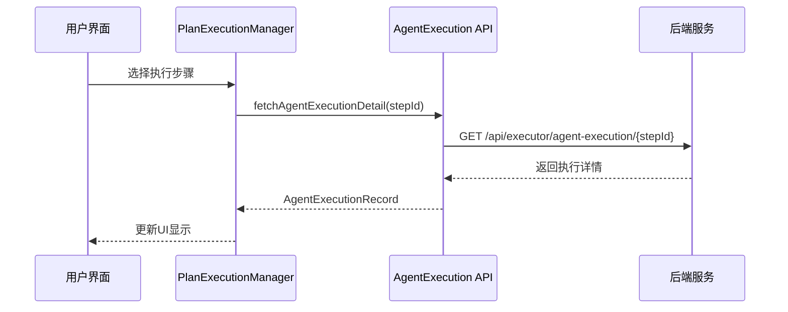
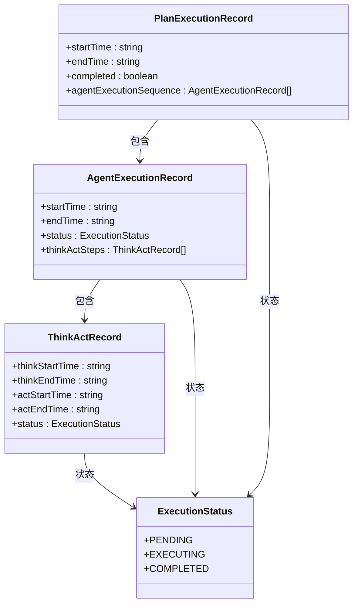
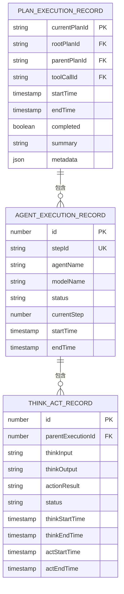
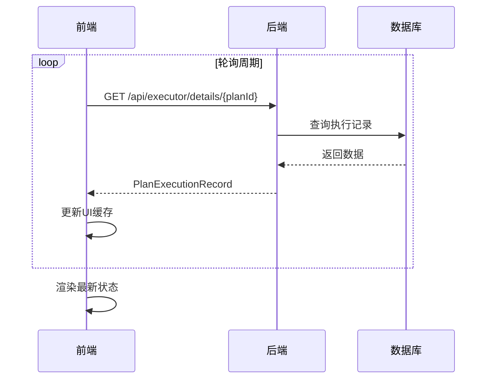

# 执行监控视图

<cite>
**本文档引用的文件**
- [RightPanel.vue](file://spring-ai-alibaba-jmanus/ui-vue3/src/components/right-panel/RightPanel.vue)
- [plan-execution-manager.ts](file://spring-ai-alibaba-jmanus/ui-vue3/src/utils/plan-execution-manager.ts)
- [agent-execution.ts](file://spring-ai-alibaba-jmanus/ui-vue3/src/api/agent-execution.ts)
- [plan-execution-record.ts](file://spring-ai-alibaba-jmanus/ui-vue3/src/types/plan-execution-record.ts)
- [ExecutionDetails.vue](file://spring-ai-alibaba-jmanus/ui-vue3/src/components/chat/ExecutionDetails.vue)
- [NewRepoPlanExecutionRecorder.java](file://spring-ai-alibaba-jmanus/src/main/java/com/alibaba/cloud/ai/manus/recorder/service/NewRepoPlanExecutionRecorder.java)
- [application.yml](file://spring-ai-alibaba-jmanus/src/main/resources/application.yml)
</cite>

## 目录
1. [简介](#简介)
2. [架构设计](#架构设计)
3. [核心功能](#核心功能)
4. [任务执行流程可视化](#任务执行流程可视化)
5. [节点状态跟踪](#节点状态跟踪)
6. [资源消耗监控](#资源消耗监控)
7. [数据更新机制](#数据更新机制)
8. [最佳实践](#最佳实践)
9. [结论](#结论)

## 简介

JManus平台执行监控视图是一个全面的智能体工作流监控系统，旨在为用户提供实时、可视化的任务执行洞察。该视图为用户提供了从宏观到微观的多层级监控能力，使用户能够深入理解智能体的工作流程，识别潜在瓶颈和异常情况。

执行监控视图的核心价值在于其能够将复杂的AI代理执行过程转化为直观、可理解的可视化信息。通过该视图，用户可以清晰地看到每个任务的执行进度、各个节点的状态变化以及资源使用情况。这种透明度不仅有助于调试和优化工作流，还能增强用户对系统行为的信任。

该视图的设计充分考虑了用户体验，采用了现代化的前端技术栈（Vue 3 + TypeScript），结合后端Spring Boot服务，实现了高效的数据交互和实时更新。无论是简单的单步任务还是复杂的嵌套子计划，执行监控视图都能提供一致且详细的监控体验。

**Section sources**
- [RightPanel.vue](file://spring-ai-alibaba-jmanus/ui-vue3/src/components/right-panel/RightPanel.vue#L0-L1334)
- [ExecutionDetails.vue](file://spring-ai-alibaba-jmanus/ui-vue3/src/components/chat/ExecutionDetails.vue#L0-L964)

## 架构设计

执行监控视图采用前后端分离的架构设计，前端负责数据展示和用户交互，后端负责数据处理和持久化。整个系统通过REST API进行通信，确保了良好的解耦性和可扩展性。

```mermaid
graph TB
subgraph "前端"
A[执行监控视图] --> B[PlanExecutionManager]
B --> C[API Service]
C --> D[后端服务]
end
subgraph "后端"
D --> E[ExecutorController]
E --> F[PlanExecutionRecorder]
F --> G[数据库]
end
A < --> C
C < --> D
```

**Diagram sources**
- [plan-execution-manager.ts](file://spring-ai-alibaba-jmanus/ui-vue3/src/utils/plan-execution-manager.ts#L0-L505)
- [NewRepoPlanExecutionRecorder.java](file://spring-ai-alibaba-jmanus/src/main/java/com/alibaba/cloud/ai/manus/recorder/service/NewRepoPlanExecutionRecorder.java#L0-L836)

前端部分以`PlanExecutionManager`为核心，作为单例模式管理器，负责协调所有与执行监控相关的操作。它维护着当前活动的计划ID、轮询状态和缓存数据，确保在整个应用生命周期内保持一致的状态。

后端部分以`NewRepoPlanExecutionRecorder`服务为核心，实现了`PlanExecutionRecorder`接口，负责记录和检索计划执行的详细信息。该服务与多个数据库实体（如`PlanExecutionRecordEntity`、`AgentExecutionRecordEntity`等）交互，确保执行数据的完整性和一致性。

**Section sources**
- [plan-execution-manager.ts](file://spring-ai-alibaba-jmanus/ui-vue3/src/utils/plan-execution-manager.ts#L0-L505)
- [NewRepoPlanExecutionRecorder.java](file://spring-ai-alibaba-jmanus/src/main/java/com/alibaba/cloud/ai/manus/recorder/service/NewRepoPlanExecutionRecorder.java#L0-L836)

## 核心功能

执行监控视图提供了三大核心功能：任务执行流程可视化、节点状态跟踪和资源消耗监控。这些功能共同构成了一个完整的监控解决方案，帮助用户全面了解智能体工作流的执行情况。

### 任务执行流程可视化

任务执行流程可视化功能将复杂的执行过程分解为清晰的步骤序列，使用户能够直观地理解任务的执行逻辑。该功能支持主计划和嵌套子计划的可视化，能够展示多层级的执行结构。



**Diagram sources**
- [ExecutionDetails.vue](file://spring-ai-alibaba-jmanus/ui-vue3/src/components/chat/ExecutionDetails.vue#L0-L964)
- [RightPanel.vue](file://spring-ai-alibaba-jmanus/ui-vue3/src/components/right-panel/RightPanel.vue#L0-L1334)

### 节点状态跟踪

节点状态跟踪功能实时监控每个执行节点的状态变化，包括"等待中"、"执行中"和"已完成"三种主要状态。通过颜色编码和动态指示器，用户可以快速识别当前执行位置和整体进度。



**Diagram sources**
- [RightPanel.vue](file://spring-ai-alibaba-jmanus/ui-vue3/src/components/right-panel/RightPanel.vue#L0-L1334)
- [plan-execution-record.ts](file://spring-ai-alibaba-jmanus/ui-vue3/src/types/plan-execution-record.ts#L0-L286)

### 资源消耗监控

资源消耗监控功能虽然在当前代码中未完全实现，但已预留了相应的数据结构和接口。未来可以通过扩展`PlanExecutionRecord`实体来添加CPU、内存等资源使用指标，为性能分析提供数据支持。

**Section sources**
- [plan-execution-record.ts](file://spring-ai-alibaba-jmanus/ui-vue3/src/types/plan-execution-record.ts#L0-L286)
- [NewRepoPlanExecutionRecorder.java](file://spring-ai-alibaba-jmanus/src/main/java/com/alibaba/cloud/ai/manus/recorder/service/NewRepoPlanExecutionRecorder.java#L0-L836)

## 任务执行流程可视化

任务执行流程可视化是执行监控视图的核心功能之一，它将抽象的执行过程转化为直观的图形化表示。该功能主要通过右侧面板组件（RightPanel.vue）和执行详情组件（ExecutionDetails.vue）实现。

当用户选择一个执行步骤时，系统会通过`fetchAgentExecutionDetail` API获取详细的执行记录。这个记录包含了完整的思考-行动循环（Think-Act Cycle）信息，包括输入上下文、思考输出、工具调用参数和执行结果。



**Diagram sources**
- [agent-execution.ts](file://spring-ai-alibaba-jmanus/ui-vue3/src/api/agent-execution.ts#L0-L40)
- [RightPanel.vue](file://spring-ai-alibaba-jmanus/ui-vue3/src/components/right-panel/RightPanel.vue#L0-L1334)

对于包含子计划的任务，系统能够递归地展示子计划的执行结构。每个子计划都有自己的执行ID、标题和状态，用户可以逐层展开查看详细的执行过程。这种树状结构的可视化方式特别适合处理复杂的、多层次的智能体协作场景。

**Section sources**
- [RightPanel.vue](file://spring-ai-alibaba-jmanus/ui-vue3/src/components/right-panel/RightPanel.vue#L0-L1334)
- [ExecutionDetails.vue](file://spring-ai-alibaba-jmanus/ui-vue3/src/components/chat/ExecutionDetails.vue#L0-L964)

## 节点状态跟踪

节点状态跟踪功能通过多种视觉元素实时反映执行节点的状态变化。系统定义了三种基本状态：`pending`（等待中）、`executing`（执行中）和`completed`（已完成），每种状态都有对应的颜色编码和图标表示。

在右侧面板中，选中的步骤会显示详细的状态信息，包括执行代理名称、调用模型和当前状态。当步骤正在执行时，系统会显示动态的波浪动画效果，增强用户的实时感知。



**Diagram sources**
- [plan-execution-record.ts](file://spring-ai-alibaba-jmanus/ui-vue3/src/types/plan-execution-record.ts#L0-L286)
- [RightPanel.vue](file://spring-ai-alibaba-jmanus/ui-vue3/src/components/right-panel/RightPanel.vue#L0-L1334)

状态同步策略基于轮询机制实现。`PlanExecutionManager`会定期（默认每5秒）调用`pollPlanStatus`方法检查计划执行状态，确保UI显示与后端实际状态保持一致。用户也可以手动触发刷新操作，立即获取最新的执行信息。

**Section sources**
- [plan-execution-manager.ts](file://spring-ai-alibaba-jmanus/ui-vue3/src/utils/plan-execution-manager.ts#L0-L505)
- [plan-execution-record.ts](file://spring-ai-alibaba-jmanus/ui-vue3/src/types/plan-execution-record.ts#L0-L286)

## 资源消耗监控

资源消耗监控功能目前处于基础阶段，主要通过执行时间和步骤计数来间接反映资源使用情况。`PlanExecutionRecord`实体中包含了`startTime`和`endTime`字段，可以计算出整个计划的执行耗时。

虽然当前代码中没有直接的CPU或内存监控指标，但系统架构为未来的扩展预留了空间。`PlanExecutionRecord`中的`metadata`字段可以用来存储额外的性能指标，而`PlanExecutionRecorder`接口也可以轻松扩展以支持新的监控数据类型。



**Diagram sources**
- [NewRepoPlanExecutionRecorder.java](file://spring-ai-alibaba-jmanus/src/main/java/com/alibaba/cloud/ai/manus/recorder/service/NewRepoPlanExecutionRecorder.java#L0-L836)
- [plan-execution-record.ts](file://spring-ai-alibaba-jmanus/ui-vue3/src/types/plan-execution-record.ts#L0-L286)

未来可以通过集成ARMS观测模块（arms-observation）来实现更全面的资源监控。该模块可以收集详细的性能指标，并与执行监控视图集成，提供更丰富的性能分析能力。

**Section sources**
- [NewRepoPlanExecutionRecorder.java](file://spring-ai-alibaba-jmanus/src/main/java/com/alibaba/cloud/ai/manus/recorder/service/NewRepoPlanExecutionRecorder.java#L0-L836)
- [plan-execution-record.ts](file://spring-ai-alibaba-jmanus/ui-vue3/src/types/plan-execution-record.ts#L0-L286)

## 数据更新机制

执行监控视图的数据更新机制基于REST API和轮询策略实现。前端通过`CommonApiService`和`AgentExecution` API与后端服务通信，获取最新的执行数据。



**Diagram sources**
- [plan-execution-manager.ts](file://spring-ai-alibaba-jmanus/ui-vue3/src/utils/plan-execution-manager.ts#L0-L505)
- [agent-execution.ts](file://spring-ai-alibaba-jmanus/ui-vue3/src/api/agent-execution.ts#L0-L40)

轮询间隔在`application.yml`配置文件中定义，当前设置为2000毫秒（2秒）。这个值可以在不影响系统性能的前提下，平衡实时性和网络开销。

```yaml
manus:
  plan:
    polling:
      enable-polling: true
      max-attempts: 60
      poll-interval: 2000
      connect-timeout: 5000
      read-timeout: 10000
```

为了提高效率，系统实现了两级缓存机制。`PlanExecutionManager`维护着内存缓存，存储最近获取的执行记录，避免重复请求相同数据。同时，浏览器的localStorage也被用来持久化最后执行的计划ID，确保页面刷新后仍能恢复之前的监控状态。

**Section sources**
- [plan-execution-manager.ts](file://spring-ai-alibaba-jmanus/ui-vue3/src/utils/plan-execution-manager.ts#L0-L505)
- [application.yml](file://spring-ai-alibaba-jmanus/src/main/resources/application.yml#L0-L84)

## 最佳实践

为了有效利用执行监控视图进行系统性能分析和优化，建议遵循以下最佳实践：

1. **定期检查执行流程**：通过可视化流程图识别执行路径中的瓶颈环节，特别是那些频繁调用外部工具或需要长时间思考的步骤。

2. **关注错误状态**：及时发现并处理标记为"失败"或"阻塞"的执行节点，这些通常是系统问题的主要来源。

3. **分析嵌套结构**：对于复杂的多层计划，逐层展开分析子计划的执行情况，确保每个子任务都按预期执行。

4. **利用缓存机制**：理解系统的缓存策略，合理设置轮询间隔，在保证实时性的同时减少不必要的网络请求。

5. **结合日志分析**：将执行监控视图与后端日志相结合，获取更全面的调试信息。例如，当某个步骤失败时，可以查看对应的后端日志获取详细错误堆栈。

6. **性能基准测试**：记录关键任务的执行时间，建立性能基准，以便在系统升级或配置变更后评估影响。

7. **用户反馈闭环**：利用`userInputWaitState`机制，设计良好的用户交互流程，确保在需要用户输入时能够及时响应。

**Section sources**
- [plan-execution-manager.ts](file://spring-ai-alibaba-jmanus/ui-vue3/src/utils/plan-execution-manager.ts#L0-L505)
- [plan-execution-record.ts](file://spring-ai-alibaba-jmanus/ui-vue3/src/types/plan-execution-record.ts#L0-L286)
- [NewRepoPlanExecutionRecorder.java](file://spring-ai-alibaba-jmanus/src/main/java/com/alibaba/cloud/ai/manus/recorder/service/NewRepoPlanExecutionRecorder.java#L0-L836)

## 结论

JManus平台执行监控视图提供了一个强大而直观的工具，用于监控和分析智能体工作流的执行情况。通过任务执行流程可视化、节点状态跟踪和基础的资源消耗监控，用户可以获得对系统行为的深入洞察。

该视图的架构设计合理，前后端职责分明，通过REST API实现高效的数据交互。轮询机制和缓存策略确保了数据的实时性和系统的性能。尽管当前的资源监控功能还有待完善，但系统的可扩展性为未来的功能增强提供了坚实的基础。

通过遵循最佳实践，用户可以充分利用执行监控视图进行系统性能分析和优化，提高智能体工作流的可靠性和效率。随着ARMS观测模块等高级监控功能的集成，执行监控视图将成为JManus平台不可或缺的核心组件。