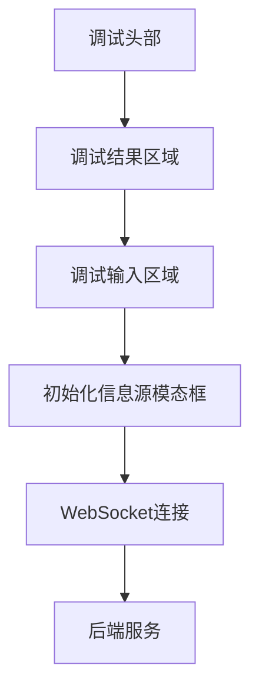
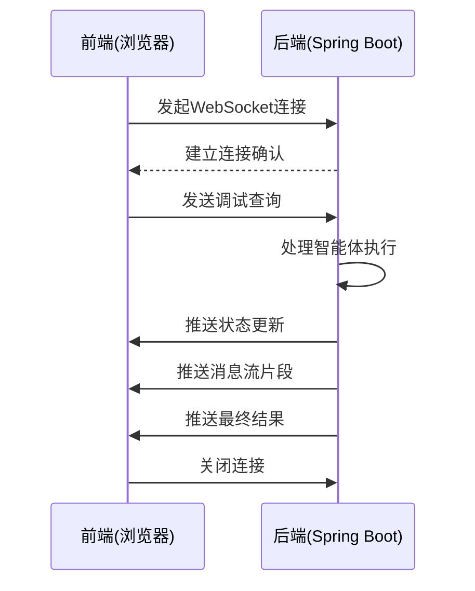

# 智能体调试面板

<cite>
**本文档引用文件**   
- [AgentDebugPanel.vue](file://spring-ai-alibaba-nl2sql/spring-ai-alibaba-nl2sql-web-ui/src/components/AgentDebugPanel.vue)
- [Nl2sqlForGraphController.java](file://spring-ai-alibaba-nl2sql/spring-ai-alibaba-nl2sql-management/src/main/java/com/alibaba/cloud/ai/controller/Nl2sqlForGraphController.java)
- [agent-execution.ts](file://spring-ai-alibaba-jmanus/ui-vue3/src/api/agent-execution.ts)
- [NewRepoPlanExecutionRecorder.java](file://spring-ai-alibaba-jmanus/src/main/java/com/alibaba/cloud/ai/manus/recorder/service/NewRepoPlanExecutionRecorder.java)
- [DashScopeWebSocketClient.java](file://spring-ai-alibaba-core/src/main/java/com/alibaba/cloud/ai/dashscope/protocol/DashScopeWebSocketClient.java)
</cite>

## 目录
1. [简介](#简介)
2. [界面元素说明](#界面元素说明)
3. [核心功能详解](#核心功能详解)
4. [前后端数据交互机制](#前后端数据交互机制)
5. [操作指南](#操作指南)
6. [实际使用案例](#实际使用案例)
7. [常见问题解决方案](#常见问题解决方案)
8. [性能调优建议](#性能调优建议)

## 简介

智能体调试面板是JManus平台中用于开发和调试智能体的核心工具。该面板提供了一个直观的用户界面，使开发者能够实时监控智能体的执行状态、查看消息流和日志输出，并进行行为分析和问题诊断。通过集成WebSocket连接管理和实时消息推送技术，调试面板实现了与后端服务的高效通信，确保了调试过程中的低延迟和高可靠性。

**Section sources**
- [README.md](file://spring-ai-alibaba-jmanus/README.md#L0-L282)

## 界面元素说明

智能体调试面板由多个关键区域组成，每个区域都有特定的功能：

1. **调试头部**：显示"智能体调试"标题和子标题，提供整体调试环境的概览。
2. **调试结果区域**：展示智能体响应的详细信息，包括状态指示器和内容展示区。
3. **调试输入区域**：包含输入框和控制按钮，用于提交测试查询和管理调试流程。
4. **初始化信息源模态框**：用于配置和初始化数据源，确保智能体在正确的上下文中运行。

这些界面元素共同构成了一个完整的调试工作流，从问题输入到结果展示，再到数据源管理，为开发者提供了全方位的调试支持。



**Diagram sources **
- [AgentDebugPanel.vue](file://spring-ai-alibaba-nl2sql/spring-ai-alibaba-nl2sql-web-ui/src/components/AgentDebugPanel.vue#L0-L21)

## 核心功能详解

### 消息流展示

智能体调试面板能够实时展示智能体处理过程中的完整消息流。这包括从初始查询解析、关键词提取、计划生成到SQL生成和执行的各个阶段。每个阶段的消息都以结构化的方式呈现，便于开发者理解智能体的决策过程。

消息流展示的关键特性包括：
- **分阶段显示**：将复杂的处理流程分解为可识别的阶段，如需求理解、关键词提取、计划生成等。
- **实时更新**：利用Server-Sent Events (SSE) 技术实现消息的实时推送和更新。
- **格式化输出**：对不同类型的内容（如SQL、JSON、Markdown）进行适当的格式化和语法高亮。

### 执行状态监控

执行状态监控功能提供了智能体当前运行状态的可视化表示。通过状态指示器，开发者可以快速了解智能体是处于"处理中"、"完成"还是"错误"状态。

状态监控的实现基于以下机制：
- **状态分类**：定义了多种状态类型，包括成功、警告、错误和信息状态。
- **动态样式**：根据不同的状态应用相应的CSS类，使状态变化一目了然。
- **时间戳记录**：为每个状态变更添加时间戳，便于追踪执行进度。

### 实时日志输出

实时日志输出功能允许开发者查看智能体内部的详细操作日志。这些日志包含了从方法调用到异常处理的完整信息流，对于问题诊断至关重要。

日志系统的特点包括：
- **分级显示**：支持不同级别的日志信息（info、warning、error）。
- **自动滚动**：日志容器会自动滚动到底部，确保最新的日志条目始终可见。
- **搜索过滤**：提供基本的搜索功能，帮助开发者快速定位特定的日志条目。

**Section sources**
- [AgentDebugPanel.vue](file://spring-ai-alibaba-nl2sql/spring-ai-alibaba-nl2sql-web-ui/src/components/AgentDebugPanel.vue#L266-L310)

## 前后端数据交互机制

### WebSocket连接管理

智能体调试面板采用WebSocket协议实现前后端之间的双向通信。这种连接方式相比传统的HTTP请求具有更低的延迟和更高的效率，特别适合需要实时数据传输的应用场景。

WebSocket连接的管理流程如下：
1. **连接建立**：前端通过`EventSource` API发起连接请求。
2. **心跳维持**：定期发送心跳包以保持连接活跃。
3. **异常处理**：监听连接错误事件并尝试自动重连。
4. **优雅关闭**：在调试结束或页面卸载时正确关闭连接。



**Diagram sources **
- [DashScopeWebSocketClient.java](file://spring-ai-alibaba-core/src/main/java/com/alibaba/cloud/ai/dashscope/protocol/DashScopeWebSocketClient.java#L40-L101)

### 实时消息推送实现

实时消息推送基于Server-Sent Events (SSE) 技术实现。后端服务通过`Flux<ServerSentEvent<String>>`返回一个持续的数据流，前端则通过`EventSource`接收并处理这些事件。

具体实现细节包括：
- **响应式编程**：使用Project Reactor的`Flux`和`Sinks.Many`来管理异步数据流。
- **背压处理**：通过`onBackpressureBuffer()`策略处理可能的背压问题。
- **错误恢复**：在发生错误时发送错误事件并关闭流。

后端控制器中的关键代码路径：
```java
@GetMapping(value = "/stream/search", produces = MediaType.TEXT_EVENT_STREAM_VALUE)
public Flux<ServerSentEvent<String>> streamSearch(@RequestParam String query, 
                                                @RequestParam String agentId,
                                                HttpServletResponse response) {
    // 设置SSE相关HTTP头
    response.setCharacterEncoding("UTF-8");
    response.setContentType("text/event-stream");
    response.setHeader("Cache-Control", "no-cache");
    response.setHeader("Connection", "keep-alive");
    
    Sinks.Many<ServerSentEvent<String>> sink = Sinks.many().unicast().onBackpressureBuffer();
    
    Flux<NodeOutput> generator = compiledGraph.fluxStream(
        Map.of(INPUT_KEY, query, AGENT_ID, agentId), 
        RunnableConfig.builder().build());
        
    generator.subscribe(
        output -> processStreamingOutput(output, sink),
        error -> handleStreamError(error, sink), 
        () -> handleStreamComplete(sink)
    );
    
    return sink.asFlux();
}
```

**Section sources**
- [Nl2sqlForGraphController.java](file://spring-ai-alibaba-nl2sql/spring-ai-alibaba-nl2sql-management/src/main/java/com/alibaba/cloud/ai/controller/Nl2sqlForGraphController.java#L170-L203)

## 操作指南

### 基本调试流程

1. **打开调试面板**：导航到智能体管理界面，选择目标智能体并点击"调试"按钮。
2. **输入测试查询**：在输入框中键入要测试的自然语言查询。
3. **启动调试**：点击"开始调试"按钮，系统将开始处理查询并实时显示结果。
4. **监控执行过程**：观察消息流展示区域，跟踪智能体的各个处理阶段。
5. **分析结果**：查看最终生成的SQL查询和执行结果，评估智能体的表现。

### 数据源初始化

在进行调试之前，可能需要先初始化数据源：

1. **点击"初始化信息源"按钮**：打开配置模态框。
2. **选择数据源**：从下拉列表中选择合适的数据源。
3. **选择表**：勾选需要包含在向量数据库中的表。
4. **执行初始化**：点击"初始化信息源"按钮，系统将开始构建向量索引。

### 高级功能使用

- **示例查询**：点击预设的示例问题快速测试常见场景。
- **状态检查**：使用"检查初始化状态"按钮验证数据源是否已正确配置。
- **结果复制**：点击SQL结果旁边的复制按钮将生成的SQL语句复制到剪贴板。

**Section sources**
- [AgentDebugPanel.vue](file://spring-ai-alibaba-nl2sql/spring-ai-alibaba-nl2sql-web-ui/src/components/AgentDebugPanel.vue#L1064-L1134)

## 实际使用案例

### 案例一：SQL生成准确性测试

**场景描述**：验证智能体能否准确地将自然语言转换为正确的SQL查询。

**操作步骤**：
1. 在调试面板中输入查询："查询每个分类下已经成交且销量最高的商品及其销售总量"
2. 点击"开始调试"按钮
3. 观察消息流展示，确认系统正确识别了"分类"、"成交"、"销量"等关键词
4. 检查生成的SQL语句是否包含正确的JOIN条件和聚合函数
5. 验证执行结果是否符合预期

**预期结果**：生成的SQL应正确地连接products、categories和order_items表，并使用适当的GROUP BY和ORDER BY子句。

### 案例二：复杂查询优化

**场景描述**：分析智能体在处理复杂多条件查询时的性能表现。

**操作步骤**：
1. 输入复杂的查询："找出过去一个月内，在北京地区购买过电子产品且消费金额超过1000元的VIP客户"
2. 启动调试并监控各阶段的处理时间
3. 记录从查询接收到结果返回的总耗时
4. 分析消息流，确定哪个阶段耗时最长
5. 根据分析结果调整智能体配置或提示词模板

**优化建议**：如果发现Schema召回阶段耗时过长，可以考虑增加向量索引的维度或优化相似度搜索算法。

**Section sources**
- [agent-execution.ts](file://spring-ai-alibaba-jmanus/ui-vue3/src/api/agent-execution.ts#L0-L38)

## 常见问题解决方案

### 问题一：连接超时或失败

**症状**：调试面板显示"连接出错"或长时间停留在"正在连接..."状态。

**可能原因**：
- 后端服务未启动或崩溃
- 网络防火墙阻止了WebSocket连接
- API密钥配置不正确

**解决方案**：
1. 检查后端服务日志，确认服务是否正常运行
2. 验证DASHSCOPE_API_KEY环境变量是否正确设置
3. 检查网络配置，确保WebSocket端口（通常是80或443）未被阻止
4. 尝试重启服务并重新连接

### 问题二：SQL生成错误

**症状**：生成的SQL语法错误或逻辑不正确。

**可能原因**：
- 提示词模板设计不合理
- 数据库Schema信息不完整
- LLM模型理解能力有限

**解决方案**：
1. 检查向量数据库中的Schema信息是否完整准确
2. 优化提示词模板，增加更多上下文信息和约束条件
3. 考虑使用更强大的LLM模型或调整模型参数
4. 添加后处理规则对生成的SQL进行校验和修正

### 问题三：性能瓶颈

**症状**：调试过程响应缓慢，各阶段处理时间过长。

**可能原因**：
- 数据库查询效率低下
- 向量搜索耗时过长
- 网络延迟较高

**解决方案**：
1. 优化数据库索引，特别是经常用于JOIN和WHERE条件的字段
2. 调整向量搜索的相似度阈值和返回结果数量
3. 使用缓存机制存储频繁访问的结果
4. 考虑升级硬件资源或使用分布式架构

**Section sources**
- [NewRepoPlanExecutionRecorder.java](file://spring-ai-alibaba-jmanus/src/main/java/com/alibaba/cloud/ai/manus/recorder/service/NewRepoPlanExecutionRecorder.java#L505-L546)

## 性能调优建议

### 前端优化

1. **减少DOM操作**：批量更新UI元素，避免频繁的单个元素修改。
2. **虚拟滚动**：对于长日志列表，使用虚拟滚动技术只渲染可见区域的内容。
3. **防抖输入**：对输入框添加防抖处理，避免频繁触发调试请求。

### 后端优化

1. **连接池管理**：合理配置数据库连接池大小，避免连接泄漏。
2. **异步处理**：将耗时的操作（如向量搜索）放入独立线程池中执行。
3. **缓存策略**：对频繁访问的Schema信息和查询结果进行缓存。

### 网络优化

1. **压缩传输**：启用GZIP压缩减少数据传输量。
2. **连接复用**：尽量复用现有的WebSocket连接，避免频繁重建。
3. **心跳间隔**：合理设置心跳间隔，在保持连接活跃和减少网络开销之间取得平衡。

通过综合运用这些优化策略，可以显著提升智能体调试面板的整体性能和用户体验。