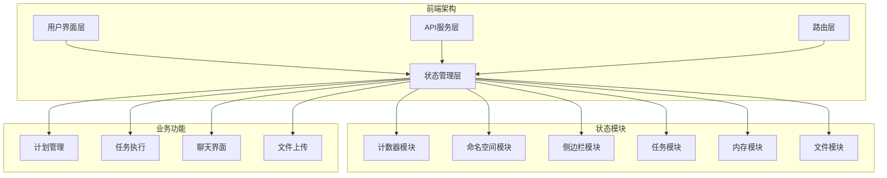
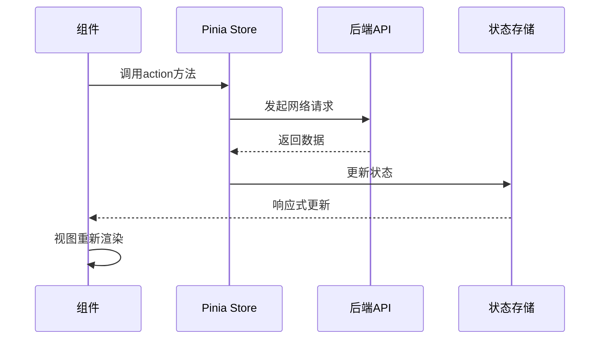
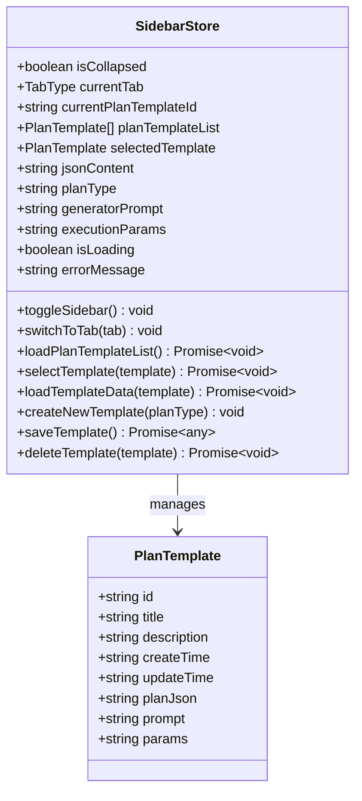
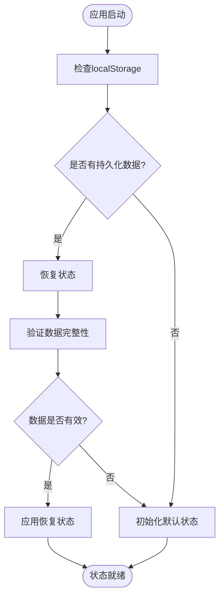
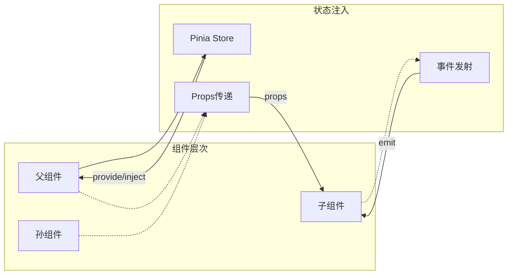
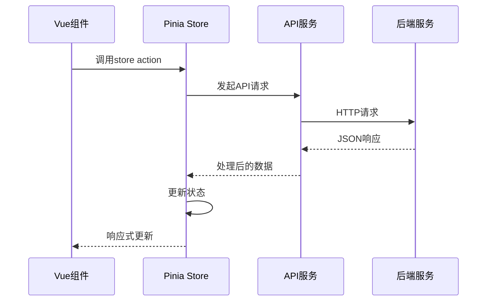

# JManus平台前端状态管理机制

<cite>
**本文档引用的文件**
- [main.ts](file://spring-ai-alibaba-jmanus/ui-vue3/src/main.ts)
- [counter.ts](file://spring-ai-alibaba-jmanus/ui-vue3/src/stores/counter.ts)
- [namespace.ts](file://spring-ai-alibaba-jmanus/ui-vue3/src/stores/namespace.ts)
- [sidebar.ts](file://spring-ai-alibaba-jmanus/ui-vue3/src/stores/sidebar.ts)
- [task.ts](file://spring-ai-alibaba-jmanus/ui-vue3/src/stores/task.ts)
- [memory.ts](file://spring-ai-alibaba-jmanus/ui-vue3/src/stores/memory.ts)
- [uploadedFiles.ts](file://spring-ai-alibaba-jmanus/ui-vue3/src/stores/uploadedFiles.ts)
- [index.ts](file://spring-ai-alibaba-jmanus/ui-vue3/src/router/index.ts)
- [home/index.vue](file://spring-ai-alibaba-jmanus/ui-vue3/src/views/home/index.vue)
- [direct/index.vue](file://spring-ai-alibaba-jmanus/ui-vue3/src/views/direct/index.vue)
- [Sidebar.vue](file://spring-ai-alibaba-jmanus/ui-vue3/src/components/sidebar/Sidebar.vue)
- [plan-act-api-service.ts](file://spring-ai-alibaba-jmanus/ui-vue3/src/api/plan-act-api-service.ts)
- [plan-template.ts](file://spring-ai-alibaba-jmanus/ui-vue3/src/types/plan-template.ts)
- [useRequest.ts](file://spring-ai-alibaba-jmanus/ui-vue3/src/composables/useRequest.ts)
</cite>

## 目录
1. [简介](#简介)
2. [项目架构概览](#项目架构概览)
3. [Pinia状态管理模式](#pinia状态管理模式)
4. [核心状态模块详解](#核心状态模块详解)
5. [状态持久化机制](#状态持久化机制)
6. [跨组件通信模式](#跨组件通信模式)
7. [API集成与数据流](#api集成与数据流)
8. [最佳实践建议](#最佳实践建议)
9. [性能优化策略](#性能优化策略)
10. [故障排除指南](#故障排除指南)

## 简介

JManus平台采用现代化的Vue 3 + TypeScript技术栈，基于Pinia状态管理库构建了一套完整的前端状态管理系统。该系统通过模块化的store设计，实现了复杂业务逻辑的状态管理，支持计划模板管理、任务调度、内存管理和文件上传等功能。

系统的核心特点包括：
- 基于Composition API的状态管理
- 模块化的store组织结构
- 完整的TypeScript类型支持
- 实时的数据同步和持久化
- 组件间高效的状态共享

## 项目架构概览

JManus前端采用分层架构设计，状态管理层位于应用的核心位置，为各个业务模块提供统一的状态管理服务。



**图表来源**
- [main.ts](file://spring-ai-alibaba-jmanus/ui-vue3/src/main.ts#L1-L34)
- [index.ts](file://spring-ai-alibaba-jmanus/ui-vue3/src/router/index.ts#L1-L62)

## Pinia状态管理模式

JManus平台采用Pinia作为主要的状态管理解决方案，相比Vuex提供了更好的TypeScript支持和更简洁的API设计。

### 核心特性

1. **模块化设计**：每个功能模块独立定义store
2. **TypeScript友好**：完整的类型推断和智能提示
3. **开发工具支持**：内置的时间旅行调试功能
4. **组合式API**：与Vue 3 Composition API完美集成

### 状态管理流程



**图表来源**
- [sidebar.ts](file://spring-ai-alibaba-jmanus/ui-vue3/src/stores/sidebar.ts#L80-L120)
- [plan-act-api-service.ts](file://spring-ai-alibaba-jmanus/ui-vue3/src/api/plan-act-api-service.ts#L91-L122)

**章节来源**
- [main.ts](file://spring-ai-alibaba-jmanus/ui-vue3/src/main.ts#L25-L30)
- [sidebar.ts](file://spring-ai-alibaba-jmanus/ui-vue3/src/stores/sidebar.ts#L1-L50)

## 核心状态模块详解

### 计数器模块 (Counter Store)

计数器模块展示了Pinia的基本使用方式，是最简单的状态管理示例。

```typescript
export const useCounterStore = defineStore('counter', () => {
  const count = ref(0)
  const doubleCount = computed(() => count.value * 2)
  function increment() {
    count.value++
  }

  return { count, doubleCount, increment }
})
```

**特点**：
- 使用ref创建响应式状态
- 使用computed计算派生状态
- 提供纯函数式的action方法

### 命名空间模块 (Namespace Store)

命名空间模块负责管理应用的命名空间配置，支持多环境切换。

```typescript
export const usenameSpaceStore = defineStore('namespace', () => {
  const namespace = ref<string>('default')
  function setCurrentNs(value: string) {
    namespace.value = value
  }

  const namespaces = ref<Array<{ name: string; id: string ;host?: string}>>([])
  function setNamespaces(datasource: Array<{ name: string; id: string }>) {
    namespaces.value = datasource
  }

  return { namespace, namespaces, setCurrentNs, setNamespaces }
})
```

**功能特性**：
- 支持动态命名空间切换
- 集成命名空间列表管理
- 类型安全的参数验证

### 侧边栏模块 (Sidebar Store)

侧边栏模块是系统中最复杂的store之一，负责管理计划模板的完整生命周期。



**图表来源**
- [sidebar.ts](file://spring-ai-alibaba-jmanus/ui-vue3/src/stores/sidebar.ts#L25-L100)
- [plan-template.ts](file://spring-ai-alibaba-jmanus/ui-vue3/src/types/plan-template.ts#L15-L30)

**核心功能**：
- 计划模板列表管理
- 模板选择和编辑
- 版本控制和回滚
- 执行参数配置

### 任务模块 (Task Store)

任务模块负责管理用户的输入任务，支持任务队列和状态跟踪。

```typescript
export interface TaskPayload {
  prompt: string
  timestamp: number
  processed?: boolean
}

export const useTaskStore = defineStore('task', () => {
  const currentTask = ref<TaskPayload | null>(null)
  const taskToInput = ref<string>('')
  const hasVisitedHome = ref(false)

  // 设置新任务
  const setTask = (prompt: string) => {
    const newTask = {
      prompt,
      timestamp: Date.now(),
      processed: false
    }
    currentTask.value = newTask
  }

  // 获取并清除任务到输入
  const getAndClearTaskToInput = () => {
    const task = taskToInput.value
    taskToInput.value = ''
    return task
  }

  // 标记任务已处理
  const markTaskAsProcessed = () => {
    if (currentTask.value) {
      currentTask.value.processed = true
    }
  }

  return {
    currentTask,
    taskToInput,
    hasVisitedHome,
    setTask,
    setTaskToInput,
    getAndClearTaskToInput,
    markTaskAsProcessed,
    clearTask,
    hasUnprocessedTask,
    markHomeVisited,
    checkHomeVisited,
    resetHomeVisited,
    emitPlanExecutionRequested
  }
})
```

**设计亮点**：
- 任务状态的原子性操作
- 自动时间戳记录
- 任务处理状态跟踪
- 事件驱动的组件通信

### 内存模块 (Memory Store)

内存模块采用类式设计，提供更丰富的状态管理能力。

```typescript
export class MemoryStore {
    // 基础状态
    isCollapsed = false
    selectMemoryId = ''
    loadMessages = () => {}
    intervalId: number | undefined = undefined

    toggleSidebar() {
        this.isCollapsed = !this.isCollapsed
        if (this.isCollapsed) {
            this.loadMessages();
            this.intervalId = window.setInterval(() => {
                this.loadMessages();
            }, 3000);
        } else {
            clearInterval(this.intervalId);
        }
    }

    selectMemory(memoryId: string) {
        this.toggleSidebar()
        this.selectMemoryId = memoryId
    }
}

export const memoryStore = reactive(new MemoryStore())
```

**创新点**：
- 类式状态管理
- 自动定时刷新机制
- 响应式状态转换

### 文件上传模块 (Uploaded Files Store)

文件上传模块专门处理文件相关的状态管理。

```typescript
export interface UploadedFile {
  name: string
  size: number
  type: string
  planId?: string
  relativePath?: string
}

// 全局状态管理
const uploadedFilesState = ref<UploadedFile[]>([])

// 辅助函数
export const setUploadedFiles = (files: UploadedFile[]) => {
  uploadedFilesState.value = [...files]
}

export const addUploadedFiles = (files: UploadedFile[]) => {
  uploadedFilesState.value = [...uploadedFilesState.value, ...files]
}

export const clearUploadedFiles = () => {
  uploadedFilesState.value = []
}

export const getUploadedFiles = () => {
  return uploadedFilesState.value
}

export const hasUploadedFiles = () => {
  return uploadedFilesState.value.length > 0
}
```

**特点**：
- 类型安全的文件对象定义
- 批量文件操作支持
- 状态查询和验证功能

**章节来源**
- [counter.ts](file://spring-ai-alibaba-jmanus/ui-vue3/src/stores/counter.ts#L17-L28)
- [namespace.ts](file://spring-ai-alibaba-jmanus/ui-vue3/src/stores/namespace.ts#L19-L32)
- [sidebar.ts](file://spring-ai-alibaba-jmanus/ui-vue3/src/stores/sidebar.ts#L25-L150)
- [task.ts](file://spring-ai-alibaba-jmanus/ui-vue3/src/stores/task.ts#L20-L124)
- [memory.ts](file://spring-ai-alibaba-jmanus/ui-vue3/src/stores/memory.ts#L25-L73)
- [uploadedFiles.ts](file://spring-ai-alibaba-jmanus/ui-vue3/src/stores/uploadedFiles.ts#L18-L49)

## 状态持久化机制

JManus平台实现了多层次的状态持久化机制，确保用户体验的连续性和数据的安全性。

### 本地存储集成

```typescript
// 任务访问状态持久化
const markHomeVisited = () => {
  hasVisitedHome.value = true
  // 保存到localStorage
  localStorage.setItem('hasVisitedHome', 'true')
}

const checkHomeVisited = () => {
  const stored = localStorage.getItem('hasVisitedHome')
  hasVisitedHome.value = stored === 'true'
  return hasVisitedHome.value
}

const resetHomeVisited = () => {
  hasVisitedHome.value = false
  localStorage.removeItem('hasVisitedHome')
}
```

### 状态恢复机制



**图表来源**
- [task.ts](file://spring-ai-alibaba-jmanus/ui-vue3/src/stores/task.ts#L75-L95)

### API同步机制

对于需要服务器同步的状态，系统实现了自动化的数据同步机制：

```typescript
async loadPlanTemplateList() {
  this.isLoading = true
  this.errorMessage = ''
  try {
    console.log('[SidebarStore] Starting to load plan template list...')
    const response = await PlanActApiService.getAllPlanTemplates()
    if (response?.templates && Array.isArray(response.templates)) {
      this.planTemplateList = response.templates
      console.log(`[SidebarStore] Successfully loaded ${response.templates.length} plan templates`)
    } else {
      this.planTemplateList = []
      console.warn('[SidebarStore] API returned abnormal data format, using empty list', response)
    }
  } catch (error: any) {
    console.error('[SidebarStore] Failed to load plan template list:', error)
    this.planTemplateList = []
    this.errorMessage = `Load failed: ${error.message}`
  } finally {
    this.isLoading = false
  }
}
```

**章节来源**
- [task.ts](file://spring-ai-alibaba-jmanus/ui-vue3/src/stores/task.ts#L75-L95)
- [sidebar.ts](file://spring-ai-alibaba-jmanus/ui-vue3/src/stores/sidebar.ts#L80-L120)

## 跨组件通信模式

JManus平台采用了多种跨组件通信模式，确保状态在不同层级的组件间高效传递。

### 事件总线模式

```typescript
// 事件发射
const emitPlanExecutionRequested = (payload: { title: string; planData: any; params?: string }) => {
  console.log('[TaskStore] emitPlanExecutionRequested called with payload:', payload)
  // 用户在直接页面，直接发送事件
  window.dispatchEvent(new CustomEvent('plan-execution-requested', { detail: payload }))
}

// 事件监听
window.addEventListener('plan-execution-requested', (event) => {
  const { detail } = event as CustomEvent
  // 处理计划执行请求
})
```

### 组合式函数模式

```typescript
export function useRequest() {
  const loading = ref(false)

  const executeRequest = async <T>(
    requestFn: () => Promise<ApiResponse<T>>,
    successMessage?: string,
    errorMessage?: string
  ): Promise<ApiResponse<T> | null> => {
    try {
      loading.value = true
      const result = await requestFn()

      if (result.success && successMessage) {
        console.log(successMessage)
      } else if (!result.success && errorMessage) {
        console.error(errorMessage)
      }

      return result
    } catch (error) {
      console.error('Request execution failed:', error)
      if (errorMessage) {
        console.error(errorMessage)
      }
      return null
    } finally {
      loading.value = false
    }
  }

  return {
    loading,
    executeRequest
  }
}
```

### 组件间依赖注入



**图表来源**
- [home/index.vue](file://spring-ai-alibaba-jmanus/ui-vue3/src/views/home/index.vue#L150-L180)
- [direct/index.vue](file://spring-ai-alibaba-jmanus/ui-vue3/src/views/direct/index.vue#L100-L150)

**章节来源**
- [task.ts](file://spring-ai-alibaba-jmanus/ui-vue3/src/stores/task.ts#L95-L105)
- [useRequest.ts](file://spring-ai-alibaba-jmanus/ui-vue3/src/composables/useRequest.ts#L5-L39)

## API集成与数据流

JManus平台通过精心设计的API服务层，实现了前后端数据的无缝集成。

### API服务架构



**图表来源**
- [plan-act-api-service.ts](file://spring-ai-alibaba-jmanus/ui-vue3/src/api/plan-act-api-service.ts#L91-L122)

### 数据类型定义

```typescript
// 计划模板类型定义
export interface PlanTemplate {
  id: string
  title?: string
  description?: string
  createTime: string
  updateTime?: string
  planJson?: string
  prompt?: string
  params?: string
}

// API响应类型
export interface PlanTemplateListResponse {
  count: number
  templates: PlanTemplate[]
}

export interface PlanVersionsResponse {
  versions: string[]
}
```

### 错误处理机制

```typescript
// 统一错误处理
public static async savePlanTemplate(planId: string, planJson: string): Promise<any> {
  const response = await fetch(`${this.PLAN_TEMPLATE_URL}/save`, {
    method: 'POST',
    headers: { 'Content-Type': 'application/json' },
    body: JSON.stringify({ planId, planJson })
  })
  if (!response.ok) throw new Error(`Failed to save plan: ${response.status}`)
  return await response.json()
}
```

**章节来源**
- [plan-act-api-service.ts](file://spring-ai-alibaba-jmanus/ui-vue3/src/api/plan-act-api-service.ts#L91-L122)
- [plan-template.ts](file://spring-ai-alibaba-jmanus/ui-vue3/src/types/plan-template.ts#L15-L50)

## 最佳实践建议

### 1. 状态模块设计原则

**单一职责原则**：
- 每个store只负责一个明确的功能领域
- 避免状态的过度耦合
- 保持模块间的低依赖性

**状态规范化**：
```typescript
// 推荐：规范化状态结构
interface UserState {
  currentUser: User | null
  userList: User[]
  loading: boolean
  error: string | null
}

// 避免：嵌套过深的状态
interface BadState {
  user: {
    profile: {
      personal: {
        name: string
        age: number
      }
    }
  }
}
```

### 2. 性能优化策略

**计算属性缓存**：
```typescript
// 利用computed的缓存特性
const sortedTemplates = computed(() => {
  return [...sidebarStore.planTemplateList].sort((a, b) => {
    const timeA = parseDateTime(a.updateTime ?? a.createTime)
    const timeB = parseDateTime(b.updateTime ?? b.createTime)
    return timeB.getTime() - timeA.getTime()
  })
})
```

**异步操作优化**：
```typescript
// 使用async/await避免回调地狱
async loadTemplateData(template: PlanTemplate) {
  try {
    const versionsResponse = await PlanActApiService.getPlanVersions(template.id)
    this.planVersions = versionsResponse.versions || []
    // 处理版本数据...
  } catch (error) {
    console.error('Failed to load template data:', error)
    throw error
  }
}
```

### 3. 类型安全实践

**接口定义**：
```typescript
// 定义清晰的接口
export interface TaskPayload {
  prompt: string
  timestamp: number
  processed?: boolean
}

// 使用类型断言确保类型安全
const task = currentTask.value as TaskPayload
```

**章节来源**
- [sidebar.ts](file://spring-ai-alibaba-jmanus/ui-vue3/src/stores/sidebar.ts#L60-L80)
- [task.ts](file://spring-ai-alibaba-jmanus/ui-vue3/src/stores/task.ts#L20-L40)

## 性能优化策略

### 1. 状态更新优化

**批量更新**：
```typescript
// 使用$patch进行批量状态更新
sidebarStore.$patch({
  jsonContent: newJson,
  generatorPrompt: newPrompt,
  executionParams: newParams
})
```

**条件更新**：
```typescript
// 只在必要时更新状态
if (this.currentPlanTemplateId !== template.id) {
  this.currentPlanTemplateId = template.id
}
```

### 2. 组件渲染优化

**细粒度状态分离**：
```typescript
// 将频繁变化的状态与稳定状态分离
const sidebarStore = useSidebarStore()
const { isCollapsed, currentTab } = storeToRefs(sidebarStore)
```

**计算属性缓存**：
```typescript
// 利用计算属性的缓存机制
const computedLeftPanelWidth = computed(() => {
  if (sidebarStore.isCollapsed) {
    return leftPanelWidth.value
  }
  // 复杂计算逻辑
  return Math.max(20, Math.min(maxAvailableWidth, leftPanelWidth.value))
})
```

### 3. 内存管理

**及时清理资源**：
```typescript
// 清理定时器和事件监听器
onUnmounted(() => {
  if (this.intervalId) {
    clearInterval(this.intervalId)
  }
  window.removeEventListener('resize', this.handleResize)
})
```

## 故障排除指南

### 常见问题诊断

**状态不更新问题**：
1. 检查是否正确使用了ref或reactive
2. 确认是否在正确的响应式上下文中
3. 验证计算属性的依赖关系

**API调用失败**：
```typescript
// 添加详细的错误日志
async loadPlanTemplateList() {
  try {
    this.isLoading = true
    const response = await PlanActApiService.getAllPlanTemplates()
    // 检查响应格式
    if (!response || !Array.isArray(response.templates)) {
      throw new Error('Invalid response format')
    }
    this.planTemplateList = response.templates
  } catch (error) {
    console.error('Failed to load plan templates:', {
      error,
      response: await response?.clone().text(),
      timestamp: new Date().toISOString()
    })
  } finally {
    this.isLoading = false
  }
}
```

**组件通信问题**：
```typescript
// 使用事件总线进行调试
window.addEventListener('plan-execution-requested', (event) => {
  console.log('Received plan execution event:', {
    detail: event.detail,
    target: event.target,
    timeStamp: event.timeStamp
  })
})
```

### 调试技巧

**Pinia DevTools使用**：
- 监控状态变化历史
- 分析状态树结构
- 追踪action调用轨迹

**日志记录策略**：
```typescript
// 在关键路径添加日志
console.log('[SidebarStore] Selected plan template:', {
  templateId: template.id,
  templateTitle: template.title,
  currentTime: new Date().toISOString()
})
```

**章节来源**
- [sidebar.ts](file://spring-ai-alibaba-jmanus/ui-vue3/src/stores/sidebar.ts#L80-L120)
- [direct/index.vue](file://spring-ai-alibaba-jmanus/ui-vue3/src/views/direct/index.vue#L100-L150)

## 结论

JManus平台的前端状态管理机制展现了现代Vue应用的最佳实践。通过合理的模块划分、完善的类型系统和高效的API集成，构建了一个可维护、可扩展的状态管理架构。

**主要优势**：
- 模块化的设计使得代码易于理解和维护
- TypeScript的强类型支持减少了运行时错误
- Pinia的响应式特性和开发工具支持提升了开发效率
- 完善的错误处理和调试机制保证了系统的稳定性

**未来发展方向**：
- 进一步优化大型状态的性能表现
- 增强状态的序列化和反序列化能力
- 扩展离线支持和数据同步机制
- 完善单元测试和集成测试覆盖

这套状态管理方案为构建复杂的AI应用界面提供了坚实的基础，值得在类似项目中推广和应用。