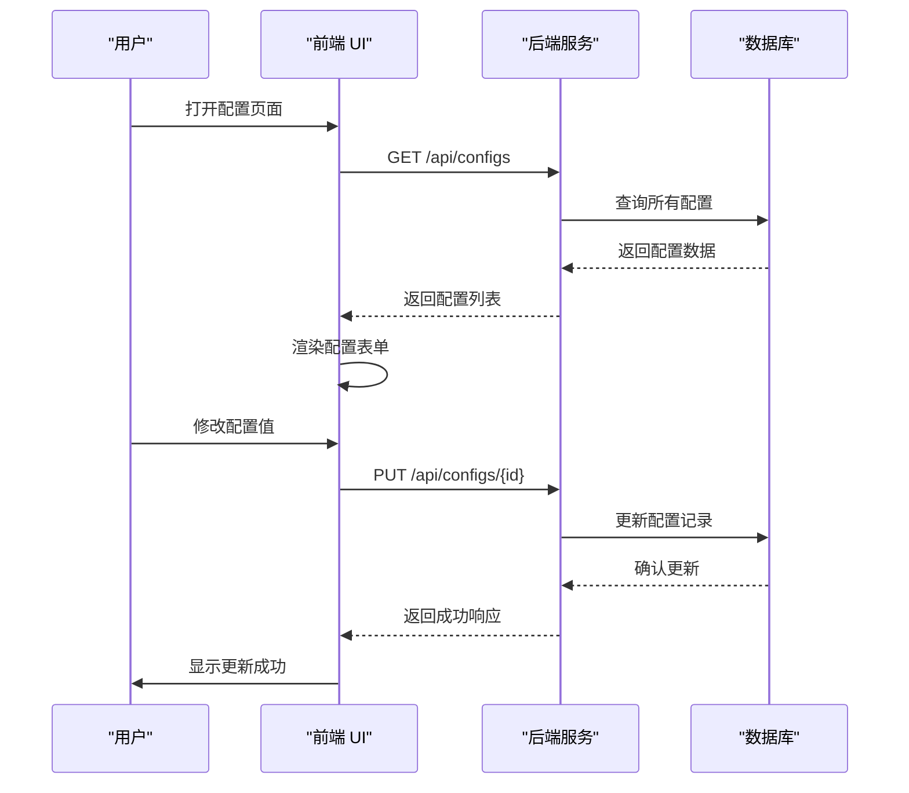
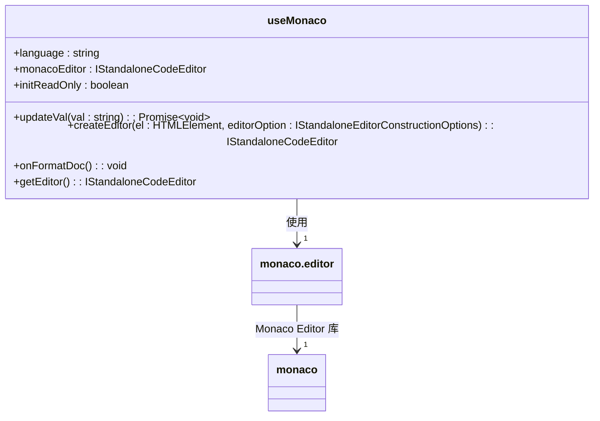
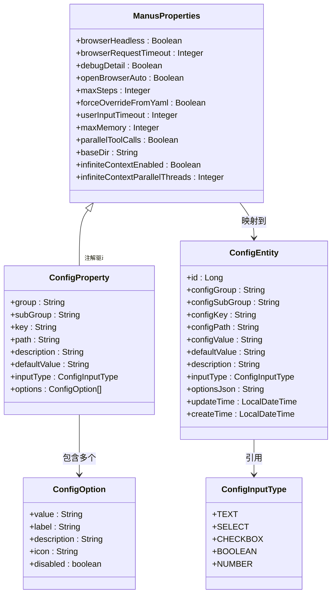
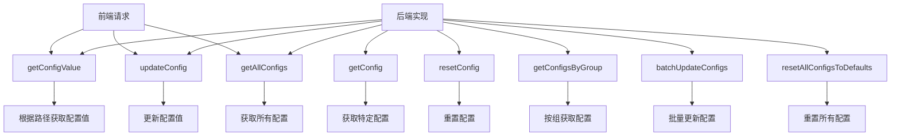

# 配置编辑器

<cite>
**本文档引用文件**  
- [MonacoEditor.ts](file://spring-ai-alibaba-jmanus/ui-vue3/src/components/editor/MonacoEditor.ts)
- [ManusProperties.java](file://spring-ai-alibaba-jmanus/src/main/java/com/alibaba/cloud/ai/manus/config/ManusProperties.java)
- [IConfigService.java](file://spring-ai-alibaba-jmanus/src/main/java/com/alibaba/cloud/ai/manus/config/IConfigService.java)
- [ConfigEntity.java](file://spring-ai-alibaba-jmanus/src/main/java/com/alibaba/cloud/ai/manus/config/entity/ConfigEntity.java)
- [ConfigInputType.java](file://spring-ai-alibaba-jmanus/src/main/java/com/alibaba/cloud/ai/manus/config/entity/ConfigInputType.java)
- [ConfigOption.java](file://spring-ai-alibaba-jmanus/src/main/java/com/alibaba/cloud/ai/manus/config/ConfigOption.java)
- [ConfigProperty.java](file://spring-ai-alibaba-jmanus/src/main/java/com/alibaba/cloud/ai/manus/config/ConfigProperty.java)
- [index.vue](file://spring-ai-alibaba-jmanus/ui-vue3/src/views/configs/index.vue)
- [basicConfig.vue](file://spring-ai-alibaba-jmanus/ui-vue3/src/views/configs/basicConfig.vue)
- [admin-api-service.ts](file://spring-ai-alibaba-jmanus/ui-vue3/src/api/admin-api-service.ts)
</cite>

## 目录
1. [简介](#简介)
2. [项目结构](#项目结构)
3. [核心组件](#核心组件)
4. [架构概述](#架构概述)
5. [详细组件分析](#详细组件分析)
6. [依赖分析](#依赖分析)
7. [性能考虑](#性能考虑)
8. [故障排除指南](#故障排除指南)
9. [结论](#结论)

## 简介
JManus平台配置编辑器是基于Monaco Editor构建的高级代码编辑解决方案，为用户提供完整的智能体配置、提示词模板编辑和工作流定义功能。该编辑器集成了语法高亮、智能提示和错误检查等开发体验增强特性，通过与后端配置管理服务的紧密集成，实现了配置保存、版本控制和变更通知等关键功能。

## 项目结构
JManus平台的配置编辑器主要位于前端UI模块中，采用Vue 3框架构建，结合TypeScript提供类型安全。编辑器功能由专门的组件实现，并与后端Spring Boot应用进行交互。

```mermaid
graph TB
subgraph "前端 (UI-Vue3)"
A[MonacoEditor] --> B[Configs页面]
B --> C[BasicConfig]
B --> D[AgentConfig]
B --> E[ModelConfig]
F[API Service] --> G[Admin API]
end
subgraph "后端 (Java)"
H[ManusProperties] --> I[IConfigService]
I --> J[ConfigEntity]
K[ConfigProperty] --> H
L[ConfigOption] --> M[ConfigInputType]
end
F < --> H
```

**图示来源**
- [MonacoEditor.ts](file://spring-ai-alibaba-jmanus/ui-vue3/src/components/editor/MonacoEditor.ts)
- [ManusProperties.java](file://spring-ai-alibaba-jmanus/src/main/java/com/alibaba/cloud/ai/manus/config/ManusProperties.java)
- [IConfigService.java](file://spring-ai-alibaba-jmanus/src/main/java/com/alibaba/cloud/ai/manus/config/IConfigService.java)

## 核心组件
配置编辑器的核心功能由Monaco Editor组件提供，该组件封装了代码编辑的所有基本操作，包括创建编辑器实例、更新值、格式化文档等。后端配置管理系统通过属性类和配置服务接口实现配置的读取、更新和管理。

**章节来源**
- [MonacoEditor.ts](file://spring-ai-alibaba-jmanus/ui-vue3/src/components/editor/MonacoEditor.ts#L0-L63)
- [ManusProperties.java](file://spring-ai-alibaba-jmanus/src/main/java/com/alibaba/cloud/ai/manus/config/ManusProperties.java#L0-L300)

## 架构概述
JManus配置编辑器采用前后端分离架构，前端使用Vue 3和Monaco Editor提供用户界面，后端使用Spring Boot提供配置管理服务。系统通过REST API进行通信，实现了配置数据的持久化存储和动态更新。



**图示来源**
- [admin-api-service.ts](file://spring-ai-alibaba-jmanus/ui-vue3/src/api/admin-api-service.ts#L96-L137)
- [IConfigService.java](file://spring-ai-alibaba-jmanus/src/main/java/com/alibaba/cloud/ai/manus/config/IConfigService.java#L0-L79)

## 详细组件分析

### Monaco 编辑器组件分析
Monaco Editor组件是JManus平台配置编辑功能的核心，提供了专业的代码编辑体验。

#### 组件实现


**图示来源**
- [MonacoEditor.ts](file://spring-ai-alibaba-jmanus/ui-vue3/src/components/editor/MonacoEditor.ts#L0-L63)

**章节来源**
- [MonacoEditor.ts](file://spring-ai-alibaba-jmanus/ui-vue3/src/components/editor/MonacoEditor.ts#L0-L63)

### 配置管理系统分析
配置管理系统负责管理JManus平台的所有配置项，提供统一的配置访问和更新接口。

#### 配置属性与实体


**图示来源**
- [ManusProperties.java](file://spring-ai-alibaba-jmanus/src/main/java/com/alibaba/cloud/ai/manus/config/ManusProperties.java#L0-L300)
- [ConfigEntity.java](file://spring-ai-alibaba-jmanus/src/main/java/com/alibaba/cloud/ai/manus/config/entity/ConfigEntity.java#L0-L217)
- [ConfigInputType.java](file://spring-ai-alibaba-jmanus/src/main/java/com/alibaba/cloud/ai/manus/config/entity/ConfigInputType.java#L0-L45)
- [ConfigOption.java](file://spring-ai-alibaba-jmanus/src/main/java/com/alibaba/cloud/ai/manus/config/ConfigOption.java#L0-L63)
- [ConfigProperty.java](file://spring-ai-alibaba-jmanus/src/main/java/com/alibaba/cloud/ai/manus/config/ConfigProperty.java#L0-L88)

**章节来源**
- [ManusProperties.java](file://spring-ai-alibaba-jmanus/src/main/java/com/alibaba/cloud/ai/manus/config/ManusProperties.java#L0-L300)
- [ConfigEntity.java](file://spring-ai-alibaba-jmanus/src/main/java/com/alibaba/cloud/ai/manus/config/entity/ConfigEntity.java#L0-L217)

### 配置服务接口分析
配置服务接口定义了配置管理的核心操作，为前后端交互提供了标准化的契约。

#### 服务接口设计


**图示来源**
- [IConfigService.java](file://spring-ai-alibaba-jmanus/src/main/java/com/alibaba/cloud/ai/manus/config/IConfigService.java#L0-L79)

**章节来源**
- [IConfigService.java](file://spring-ai-alibaba-jmanus/src/main/java/com/alibaba/cloud/ai/manus/config/IConfigService.java#L0-L79)

## 依赖分析
JManus配置编辑器的依赖关系清晰地分为前端和后端两个部分，通过REST API进行通信。

```mermaid
graph TD
subgraph Frontend
A[MonacoEditor] --> B[Vue 3]
A --> C[TypeScript]
A --> D[Monaco Editor]
E[Configs Page] --> A
F[API Service] --> G[Fetch API]
end
subgraph Backend
H[ManusProperties] --> I[Spring Boot]
J[IConfigService] --> H
K[ConfigEntity] --> L[JPA]
J --> K
end
F < --> J[REST API]
```

**图示来源**
- [package.json](file://spring-ai-alibaba-jmanus/ui-vue3/package.json)
- [pom.xml](file://spring-ai-alibaba-jmanus/pom.xml)

## 性能考虑
JManus配置编辑器在设计时考虑了多项性能优化措施：
- 使用Monaco Editor的自动布局功能，确保编辑器自适应容器大小
- 配置值更新采用异步处理，避免阻塞UI线程
- 后端配置服务采用缓存机制，减少数据库查询次数
- 前端采用懒加载策略，按需加载配置页面

## 故障排除指南
当配置编辑器出现问题时，可以按照以下步骤进行排查：

**章节来源**
- [MonacoEditor.ts](file://spring-ai-alibaba-jmanus/ui-vue3/src/components/editor/MonacoEditor.ts#L0-L63)
- [admin-api-service.ts](file://spring-ai-alibaba-jmanus/ui-vue3/src/api/admin-api-service.ts#L96-L137)

## 结论
JManus平台配置编辑器通过集成Monaco Editor提供了强大的代码编辑功能，结合后端配置管理系统实现了完整的配置管理解决方案。系统采用现代化的技术栈，具有良好的可扩展性和维护性，为用户提供了优秀的配置编辑体验。