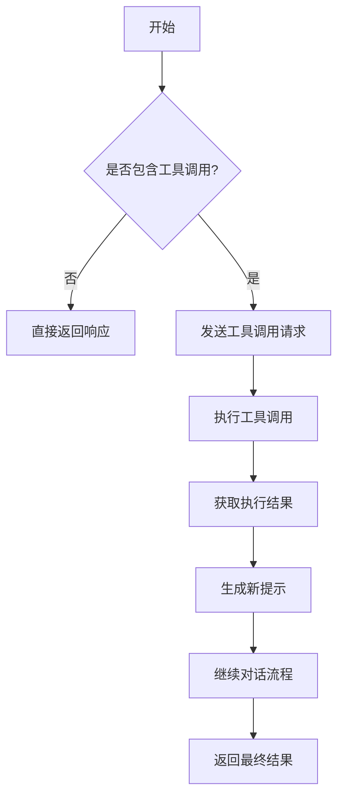
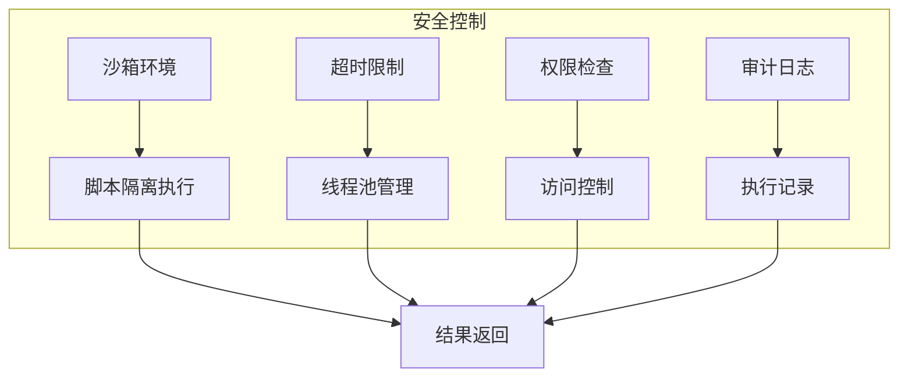
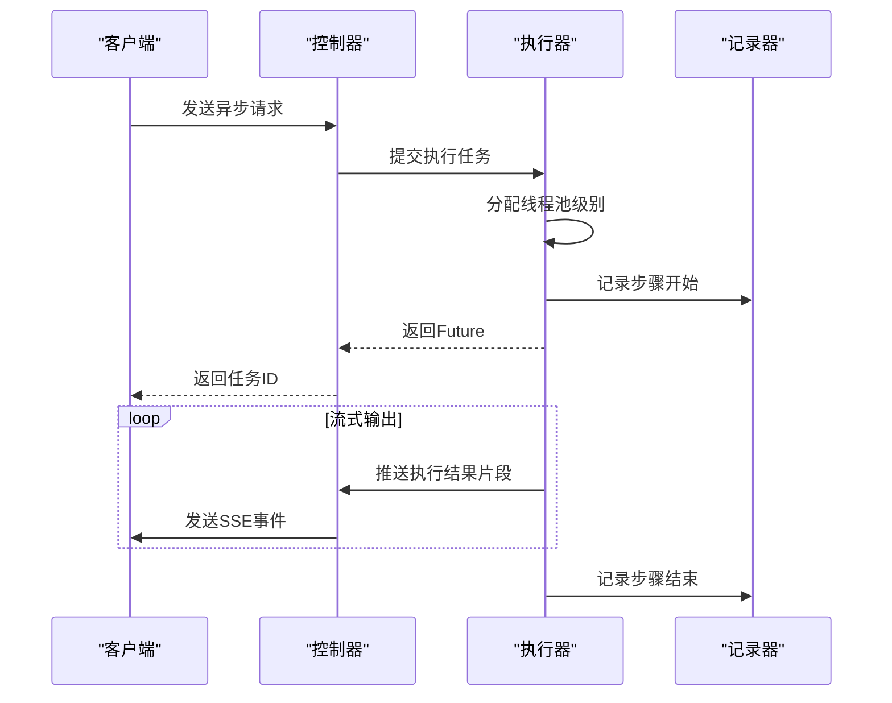
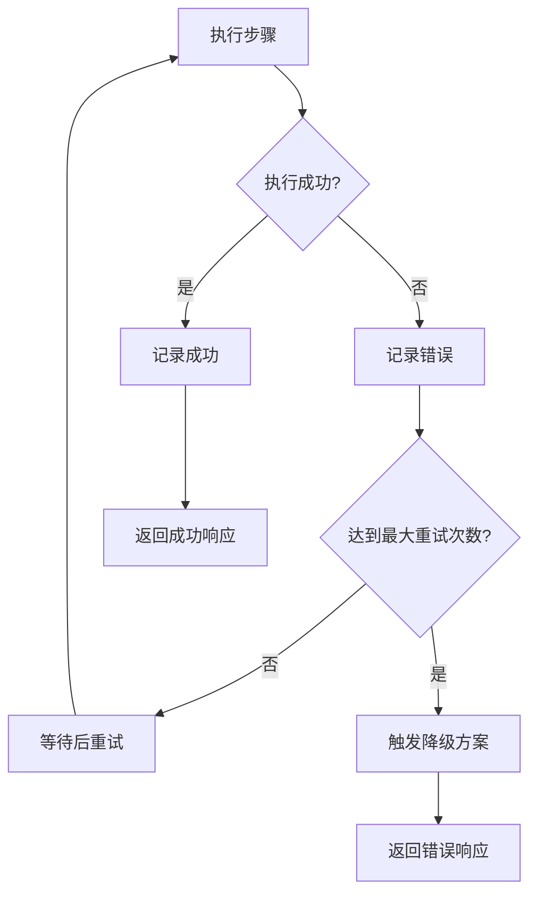
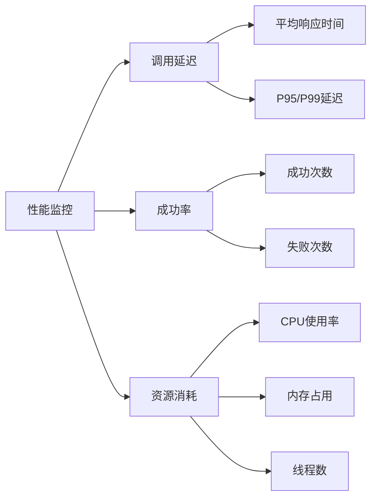

# 工具执行与安全

<cite>
**本文档引用的文件**  
- [PlanExecutorInterface.java](file://spring-ai-alibaba-jmanus/src/main/java/com/alibaba/cloud/ai/manus/runtime/executor/PlanExecutorInterface.java)
- [AbstractPlanExecutor.java](file://spring-ai-alibaba-jmanus/src/main/java/com/alibaba/cloud/ai/manus/runtime/executor/AbstractPlanExecutor.java)
- [PlanExecutor.java](file://spring-ai-alibaba-jmanus/src/main/java/com/alibaba/cloud/ai/manus/runtime/executor/PlanExecutor.java)
- [LevelBasedExecutorPool.java](file://spring-ai-alibaba-jmanus/src/main/java/com/alibaba/cloud/ai/manus/runtime/executor/LevelBasedExecutorPool.java)
- [AbstractBaseTool.java](file://spring-ai-alibaba-jmanus/src/main/java/com/alibaba/cloud/ai/manus/tool/AbstractBaseTool.java)
- [ScriptExecuteProcessor.java](file://spring-ai-alibaba-studio/spring-ai-alibaba-studio-server/spring-ai-alibaba-studio-server-core/src/main/java/com/alibaba/cloud/ai/studio/core/workflow/processor/impl/ScriptExecuteProcessor.java)
- [A2aNodeWithConfig.java](file://spring-ai-alibaba-graph-core/src/main/java/com/alibaba/cloud/ai/graph/agent/a2a/A2aNodeWithConfig.java)
- [BasicAgentExecutor.java](file://spring-ai-alibaba-studio/spring-ai-alibaba-studio-server/spring-ai-alibaba-studio-server-core/src/main/java/com/alibaba/cloud/ai/studio/core/agent/BasicAgentExecutor.java)
- [ChatController.java](file://spring-ai-alibaba-studio/spring-ai-alibaba-studio-server/spring-ai-alibaba-studio-server-openapi/src/main/java/com/alibaba/cloud/ai/studio/controller/ChatController.java)
</cite>

## 目录
1. [引言](#引言)
2. [工具调用执行流程](#工具调用执行流程)
3. [安全控制策略](#安全控制策略)
4. [异步调用与流式响应](#异步调用与流式响应)
5. [错误处理机制](#错误处理机制)
6. [性能监控指标](#性能监控指标)

## 引言
JManus平台提供了一套完整的工具执行机制，支持复杂的AI代理工作流。该系统通过分层执行器、沙箱环境和流式响应等技术，确保了工具调用的安全性、可靠性和高性能。

## 工具调用执行流程

JManus平台的工具执行机制基于计划驱动的架构，通过`PlanExecutorInterface`接口定义执行契约，并由`AbstractPlanExecutor`提供核心实现。

工具调用的完整执行流程如下：
1. **参数验证**：在执行前，系统会验证输入参数的完整性和合法性
2. **权限检查**：根据当前执行上下文验证工具访问权限
3. **资源隔离**：为每个执行任务分配独立的资源环境
4. **结果返回**：将执行结果结构化并返回给调用方

执行过程中使用`ExecutionContext`对象维护执行上下文，包含用户请求信息、计划状态和执行参数等关键数据。

**图示来源**
- [BasicAgentExecutor.java](file://spring-ai-alibaba-studio/spring-ai-alibaba-studio-server/spring-ai-alibaba-studio-server-core/src/main/java/com/alibaba/cloud/ai/studio/core/agent/BasicAgentExecutor.java#L660-L688)

**本节来源**
- [PlanExecutorInterface.java](file://spring-ai-alibaba-jmanus/src/main/java/com/alibaba/cloud/ai/manus/runtime/executor/PlanExecutorInterface.java#L1-L35)
- [AbstractPlanExecutor.java](file://spring-ai-alibaba-jmanus/src/main/java/com/alibaba/cloud/ai/manus/runtime/executor/AbstractPlanExecutor.java#L1-L275)

## 安全控制策略

JManus平台实施多层次的安全控制策略，确保工具执行过程的安全性。

### 沙箱环境
系统采用沙箱机制隔离脚本执行环境，防止恶意代码对主系统造成影响。对于Python脚本使用GraalVM Python执行，JavaScript脚本则通过传统方法执行。

### 执行超时限制
通过`LevelBasedExecutorPool`管理不同深度级别的线程池，每个级别都有独立的执行队列和容量限制，有效防止资源耗尽。

### 敏感操作审计
所有工具执行操作都会被记录到`PlanExecutionRecorder`中，包括步骤开始、结束和异常情况，便于后续审计和问题排查。

**图示来源**
- [ScriptExecuteProcessor.java](file://spring-ai-alibaba-studio/spring-ai-alibaba-studio-server/spring-ai-alibaba-studio-server-core/src/main/java/com/alibaba/cloud/ai/studio/core/workflow/processor/impl/ScriptExecuteProcessor.java#L119-L130)
- [LevelBasedExecutorPool.java](file://spring-ai-alibaba-jmanus/src/main/java/com/alibaba/cloud/ai/manus/runtime/executor/LevelBasedExecutorPool.java#L1-L260)

**本节来源**
- [ScriptExecuteProcessor.java](file://spring-ai-alibaba-studio/spring-ai-alibaba-studio-server/spring-ai-alibaba-studio-server-core/src/main/java/com/alibaba/cloud/ai/studio/core/workflow/processor/impl/ScriptExecuteProcessor.java#L119-L130)
- [LevelBasedExecutorPool.java](file://spring-ai-alibaba-jmanus/src/main/java/com/alibaba/cloud/ai/manus/runtime/executor/LevelBasedExecutorPool.java#L1-L260)

## 异步调用与流式响应

JManus平台支持异步工具调用和流式响应处理，提升用户体验和系统效率。

### 异步调用
通过`CompletableFuture`实现异步执行，`PlanExecutor`的`executeAllStepsAsync`方法返回一个`CompletableFuture<PlanExecutionResult>`，允许非阻塞调用。

### 流式响应
系统支持SSE（Server-Sent Events）格式的流式响应，能够实时推送执行结果。`createRealTimeSseStreamingGenerator`方法逐行处理SSE响应数据，实现真正的流式传输。

**图示来源**
- [A2aNodeWithConfig.java](file://spring-ai-alibaba-graph-core/src/main/java/com/alibaba/cloud/ai/graph/agent/a2a/A2aNodeWithConfig.java#L244-L279)
- [ChatController.java](file://spring-ai-alibaba-studio/spring-ai-alibaba-studio-server/spring-ai-alibaba-studio-server-openapi/src/main/java/com/alibaba/cloud/ai/studio/controller/ChatController.java#L273-L308)

**本节来源**
- [A2aNodeWithConfig.java](file://spring-ai-alibaba-graph-core/src/main/java/com/alibaba/cloud/ai/graph/agent/a2a/A2aNodeWithConfig.java#L244-L279)
- [ChatController.java](file://spring-ai-alibaba-studio/spring-ai-alibaba-studio-server/spring-ai-alibaba-studio-server-openapi/src/main/java/com/alibaba/cloud/ai/studio/controller/ChatController.java#L273-L308)

## 错误处理机制

JManus平台实现了完善的错误处理模式，确保系统的稳定性和可靠性。

### 重试策略
当工具执行失败时，系统会根据配置的重试策略进行自动重试，避免临时性故障导致整体失败。

### 降级方案
在关键服务不可用时，系统会自动切换到备用方案或返回默认值，保证基本功能可用。

### 异常传播规则
异常信息会通过`PlanExceptionEvent`事件进行传播，并在最终响应中包含详细的错误信息。

**本节来源**
- [AbstractPlanExecutor.java](file://spring-ai-alibaba-jmanus/src/main/java/com/alibaba/cloud/ai/manus/runtime/executor/AbstractPlanExecutor.java#L1-L275)
- [PlanException.java](file://spring-ai-alibaba-jmanus/src/main/java/com/alibaba/cloud/ai/manus/exception/PlanException.java)

## 性能监控指标

JManus平台提供了全面的性能监控能力，关键指标包括：

### 调用延迟
通过`LevelBasedExecutorPool`的统计功能，可以获取各层级线程池的任务执行时间、队列大小等指标。

### 成功率
系统记录每个工具调用的成功与失败状态，计算整体成功率。

### 资源消耗
监控线程池的活跃线程数、完成任务数和总任务数，评估系统资源使用情况。

**本节来源**
- [LevelBasedExecutorPool.java](file://spring-ai-alibaba-jmanus/src/main/java/com/alibaba/cloud/ai/manus/runtime/executor/LevelBasedExecutorPool.java#L1-L260)