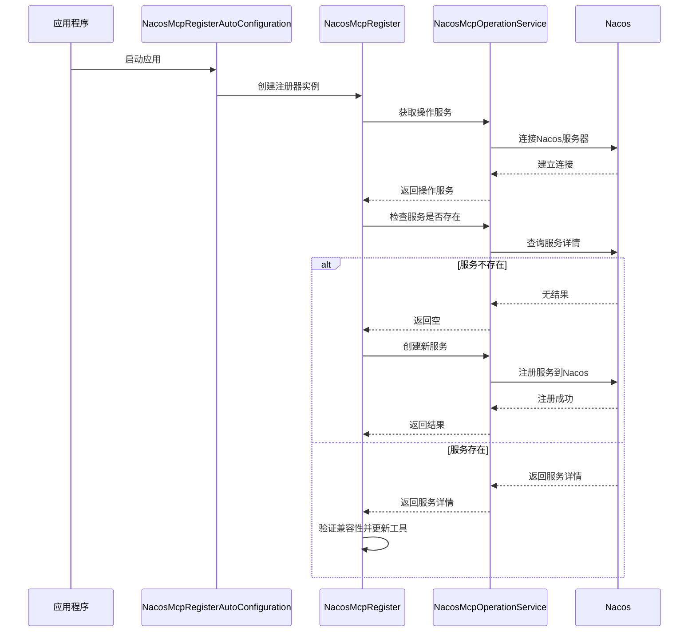
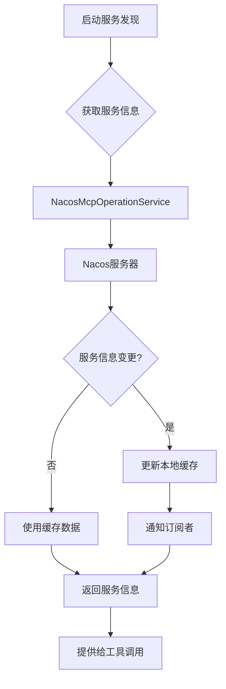
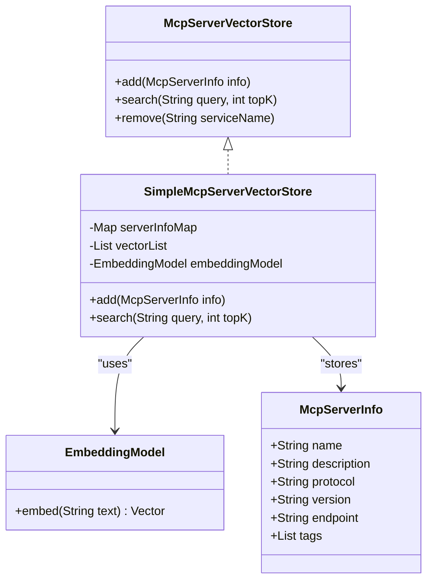

# 工具注册与发现

<cite>
**本文档引用的文件**
- [NacosMcpRegisterAutoConfiguration.java](file://auto-configurations/spring-ai-alibaba-autoconfigure-mcp-registry/src/main/java/com/alibaba/cloud/ai/autoconfigure/mcp/register/NacosMcpRegisterAutoConfiguration.java)
- [NacosMcpRegister.java](file://spring-ai-alibaba-mcp/spring-ai-alibaba-mcp-registry/src/main/java/com/alibaba/cloud/ai/mcp/register/NacosMcpRegister.java)
- [NacosMcpOperationService.java](file://spring-ai-alibaba-mcp/spring-ai-alibaba-mcp-common/src/main/java/com/alibaba/cloud/ai/mcp/nacos/service/NacosMcpOperationService.java)
- [NacosMcpGatewayToolsInitializer.java](file://spring-ai-alibaba-agent-nacos/src/main/java/com/alibaba/cloud/ai/agent/nacos/tools/NacosMcpGatewayToolsInitializer.java)
- [NacosMcpGatewayToolCallback.java](file://spring-ai-alibaba-agent-nacos/src/main/java/com/alibaba/cloud/ai/agent/nacos/tools/NacosMcpGatewayToolCallback.java)
- [NacosMcpServiceDiscovery.java](file://spring-ai-alibaba-mcp/spring-ai-alibaba-mcp-router/src/main/java/com/alibaba/cloud/ai/mcp/router/nacos/NacosMcpServiceDiscovery.java)
- [NacosMcpRouterAutoConfiguration.java](file://auto-configurations/spring-ai-alibaba-autoconfigure-mcp-router/src/main/java/com/alibaba/cloud/ai/autoconfigure/mcp/router/NacosMcpRouterAutoConfiguration.java)
- [NacosMcpRegisterProperties.java](file://spring-ai-alibaba-mcp/spring-ai-alibaba-mcp-registry/src/main/java/com/alibaba/cloud/ai/mcp/register/NacosMcpRegisterProperties.java)
- [NacosMcpProperties.java](file://spring-ai-alibaba-mcp/spring-ai-alibaba-mcp-common/src/main/java/com/alibaba/cloud/ai/mcp/nacos/NacosMcpProperties.java)
- [McpRouterProperties.java](file://spring-ai-alibaba-mcp/spring-ai-alibaba-mcp-router/src/main/java/com/alibaba/cloud/ai/mcp/router/config/McpRouterProperties.java)
</cite>

## 目录
1. [引言](#引言)
2. [工具注册机制](#工具注册机制)
3. [服务发现机制](#服务发现机制)
4. [工具分类体系与搜索索引](#工具分类体系与搜索索引)
5. [REST API规范](#rest-api规范)
6. [故障排查指南](#故障排查指南)
7. [结论](#结论)

## 引言

JManus平台提供了一套完整的工具注册与发现机制，支持本地工具和远程MCP（Model Context Protocol）服务的动态管理。该机制基于Nacos作为服务注册中心，实现了工具的元数据定义、能力描述和服务端点配置。通过这套机制，系统能够实现动态工具列表更新，为AI代理提供灵活的工具调用能力。

本文档详细解释了工具注册与发现的完整流程，包括注册机制、服务发现、分类体系、API规范以及常见问题的解决方案。

## 工具注册机制

### 本地工具与远程MCP服务注册流程

JManus平台的工具注册机制分为两个主要部分：本地工具注册和远程MCP服务注册。对于本地工具，系统通过`NacosMcpRegisterAutoConfiguration`自动配置类进行注册；对于远程MCP服务，则通过服务发现机制动态加载。



**图示来源**
- [NacosMcpRegisterAutoConfiguration.java](file://auto-configurations/spring-ai-alibaba-autoconfigure-mcp-registry/src/main/java/com/alibaba/cloud/ai/autoconfigure/mcp/register/NacosMcpRegisterAutoConfiguration.java)
- [NacosMcpRegister.java](file://spring-ai-alibaba-mcp/spring-ai-alibaba-mcp-registry/src/main/java/com/alibaba/cloud/ai/mcp/register/NacosMcpRegister.java)
- [NacosMcpOperationService.java](file://spring-ai-alibaba-mcp/spring-ai-alibaba-mcp-common/src/main/java/com/alibaba/cloud/ai/mcp/nacos/service/NacosMcpOperationService.java)

### 元数据定义与能力描述

工具的元数据定义包含在`McpServerDetailInfo`对象中，主要包括以下信息：

- **服务基本信息**：名称、版本、描述
- **协议类型**：支持stdio、sse等通信协议
- **工具规格**：包含所有可用工具的定义
- **端点配置**：服务暴露的网络端点信息

每个工具都有详细的元数据描述，包括：
- 工具名称和描述
- 输入参数的JSON Schema定义
- 工具是否启用的状态
- 扩展的元信息（如分类标签）

这些元数据在注册过程中被序列化并存储在Nacos配置中心，供后续的服务发现使用。

**代码片段路径**
- [McpServerDetailInfo](file://spring-ai-alibaba-mcp/spring-ai-alibaba-mcp-common/src/main/java/com/alibaba/cloud/ai/mcp/nacos/service/model/NacosMcpServerEndpoint.java#L1-L20)
- [McpToolSpecification](file://spring-ai-alibaba-mcp/spring-ai-alibaba-mcp-common/src/main/java/com/alibaba/cloud/ai/mcp/nacos/service/model/NacosMcpServerEndpoint.java#L21-L40)

### 服务端点配置

服务端点配置由`NacosMcpRegister`类处理，主要涉及以下几个方面：

1. **协议选择**：根据传输方式确定使用stdio还是sse协议
2. **服务分组**：通过`serviceGroup`属性指定服务所属的Nacos分组
3. **上下文路径**：配置SSE导出的上下文路径
4. **健康检查**：配置服务的健康检查机制

配置参数通过`NacosMcpRegisterProperties`类进行管理，支持通过Spring Boot配置文件进行自定义设置。

**代码片段路径**
- [NacosMcpRegisterProperties.java](file://spring-ai-alibaba-mcp/spring-ai-alibaba-mcp-registry/src/main/java/com/alibaba/cloud/ai/mcp/register/NacosMcpRegisterProperties.java#L1-L50)

## 服务发现机制

### 基于Nacos的服务发现实现

JManus平台使用Nacos作为服务发现中心，通过`NacosMcpServiceDiscovery`类实现动态工具列表更新。服务发现机制的核心是定期轮询Nacos服务器，获取最新的服务信息并缓存到本地。



**图示来源**
- [NacosMcpServiceDiscovery.java](file://spring-ai-alibaba-mcp/spring-ai-alibaba-mcp-router/src/main/java/com/alibaba/cloud/ai/mcp/router/nacos/NacosMcpServiceDiscovery.java)
- [NacosMcpOperationService.java](file://spring-ai-alibaba-mcp/spring-ai-alibaba-mcp-common/src/main/java/com/alibaba/cloud/ai/mcp/nacos/service/NacosMcpOperationService.java)

### 动态工具列表更新

动态工具列表更新通过以下步骤实现：

1. **初始化**：在应用启动时，`NacosMcpRouterAutoConfiguration`创建服务发现实例
2. **注册**：将Nacos服务发现注册到`McpServiceDiscoveryFactory`
3. **轮询**：通过`McpRouterWatcher`定时任务定期检查服务变更
4. **更新**：当检测到服务变更时，更新本地缓存并通知相关组件

这种机制确保了工具列表的实时性和一致性，避免了因服务变更导致的调用失败。

**代码片段路径**
- [NacosMcpRouterAutoConfiguration.java](file://auto-configurations/spring-ai-alibaba-autoconfigure-mcp-router/src/main/java/com/alibaba/cloud/ai/autoconfigure/mcp/router/NacosMcpRouterAutoConfiguration.java#L1-L50)
- [McpRouterWatcher.java](file://spring-ai-alibaba-mcp/spring-ai-alibaba-mcp-router/src/main/java/com/alibaba/cloud/ai/mcp/router/core/McpRouterWatcher.java#L1-L20)

## 工具分类体系与搜索索引

### 工具分类体系

JManus平台的工具分类体系基于服务描述中的标签信息。系统会自动解析服务描述中的关键词，并将其作为分类标签。例如，一个天气查询工具可能会被标记为"weather"、"query"等标签。

分类体系的主要特点包括：
- **自动分类**：基于服务描述自动生成分类标签
- **多标签支持**：一个工具可以属于多个分类
- **动态更新**：当服务描述变更时，分类信息也会相应更新

### 搜索索引构建方式

搜索索引的构建依赖于向量存储技术，具体实现如下：

1. **嵌入模型**：使用DashScope的文本嵌入模型将工具描述转换为向量
2. **向量存储**：将工具信息及其向量表示存储在`SimpleMcpServerVectorStore`中
3. **相似度搜索**：通过计算查询向量与工具向量的相似度来实现语义搜索



**图示来源**
- [McpServerVectorStore.java](file://spring-ai-alibaba-mcp/spring-ai-alibaba-mcp-router/src/main/java/com/alibaba/cloud/ai/mcp/router/core/vectorstore/McpServerVectorStore.java)
- [SimpleMcpServerVectorStore.java](file://spring-ai-alibaba-mcp/spring-ai-alibaba-mcp-router/src/main/java/com/alibaba/cloud/ai/mcp/router/core/vectorstore/SimpleMcpServerVectorStore.java)
- [EmbeddingModel.java](file://spring-ai-alibaba-core/src/main/java/com/alibaba/cloud/ai/model/EmbeddingModel.java)

## REST API规范

### 工具查询接口

#### GET /tools
获取所有可用工具列表

**请求参数**
- 无

**响应格式**
```json
{
  "tools": [
    {
      "name": "string",
      "description": "string",
      "protocol": "string",
      "version": "string",
      "endpoint": "string",
      "tags": ["string"]
    }
  ]
}
```

**状态码**
- 200: 成功获取工具列表
- 500: 服务器内部错误

### 状态检查接口

#### GET /tools/{toolName}/status
检查指定工具的运行状态

**路径参数**
- toolName: 工具名称

**响应格式**
```json
{
  "name": "string",
  "status": "ACTIVE|INACTIVE",
  "lastHeartbeat": "timestamp",
  "version": "string"
}
```

**状态码**
- 200: 成功获取状态信息
- 404: 工具不存在
- 500: 服务器内部错误

### 健康监测接口

#### GET /health
系统健康检查

**响应格式**
```json
{
  "status": "UP|DOWN",
  "components": {
    "nacos": {
      "status": "UP|DOWN",
      "details": {}
    },
    "mcp-router": {
      "status": "UP|DOWN",
      "details": {}
    }
  }
}
```

**状态码**
- 200: 系统健康
- 503: 系统不健康

## 故障排查指南

### 服务注册失败

**症状**
- 应用启动日志中出现注册失败的错误信息
- Nacos控制台中看不到对应的服务

**可能原因及解决方案**

1. **Nacos连接问题**
   - 检查`spring.ai.alibaba.mcp.nacos.server-addr`配置是否正确
   - 确认Nacos服务器是否正常运行
   - 检查网络连通性

2. **认证信息错误**
   - 检查用户名、密码或AK/SK配置是否正确
   - 确认Nacos的权限配置是否允许注册

3. **版本号缺失**
   - 确保`mcp.server.version`已正确配置
   - 版本号不能为空

4. **服务名称冲突**
   - 检查是否有同名服务正在运行
   - 尝试修改服务名称

**代码片段路径**
- [NacosMcpRegister.java](file://spring-ai-alibaba-mcp/spring-ai-alibaba-mcp-registry/src/main/java/com/alibaba/cloud/ai/mcp/register/NacosMcpRegister.java#L100-L150)

### 元数据不一致

**症状**
- 工具调用时参数不匹配
- 工具描述与实际功能不符

**可能原因及解决方案**

1. **缓存未更新**
   - 重启应用以刷新本地缓存
   - 检查服务发现的轮询间隔是否过长

2. **配置未生效**
   - 确认配置文件中的更改已保存
   - 检查配置属性前缀是否正确

3. **版本兼容性问题**
   - 检查新旧版本的元数据定义是否兼容
   - 使用`CheckCompatibleResult`验证兼容性

**代码片段路径**
- [NacosMcpGatewayToolsInitializer.java](file://spring-ai-alibaba-agent-nacos/src/main/java/com/alibaba/cloud/ai/agent/nacos/tools/NacosMcpGatewayToolsInitializer.java#L50-L80)

### 工具调用失败

**症状**
- 工具调用返回错误
- 超时或连接拒绝

**可能原因及解决方案**

1. **服务不可达**
   - 检查目标服务是否正常运行
   - 确认网络连接是否正常

2. **协议不匹配**
   - 检查客户端和服务端的协议是否一致
   - 确认SSE或stdio配置正确

3. **参数验证失败**
   - 检查输入参数是否符合JSON Schema定义
   - 查看详细的错误信息以定位问题

**代码片段路径**
- [NacosMcpGatewayToolCallback.java](file://spring-ai-alibaba-agent-nacos/src/main/java/com/alibaba/cloud/ai/agent/nacos/tools/NacosMcpGatewayToolCallback.java#L100-L150)

## 结论

JManus平台的工具注册与发现机制提供了一套完整、可靠的解决方案，支持本地工具和远程MCP服务的动态管理。通过基于Nacos的服务发现机制，系统能够实现实时的工具列表更新，确保AI代理始终能够访问最新的工具集合。

该机制的主要优势包括：
- **高可用性**：基于Nacos的分布式架构确保了服务的高可用性
- **灵活性**：支持多种协议和部署方式
- **可扩展性**：易于添加新的工具和服务
- **易维护性**：统一的配置管理和监控

未来可以进一步优化的方向包括增强安全认证机制、完善监控告警系统以及提升搜索算法的准确性。