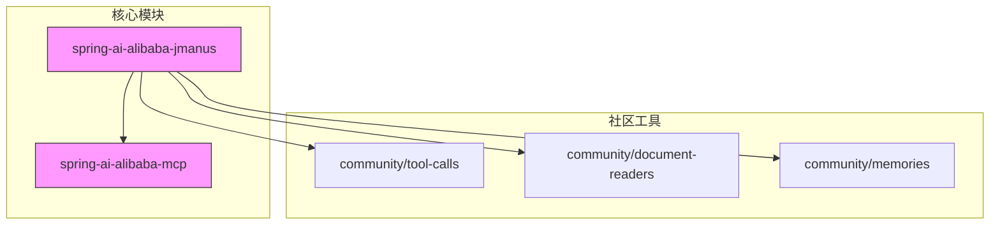
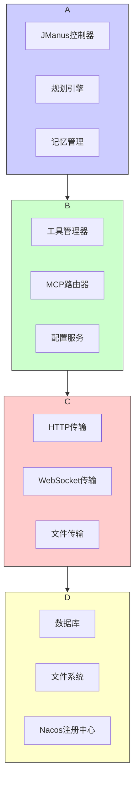
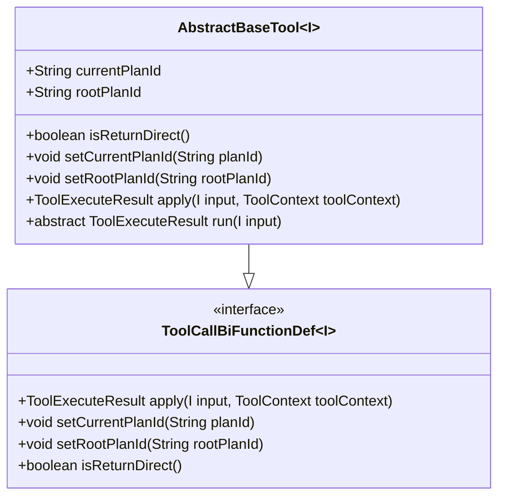
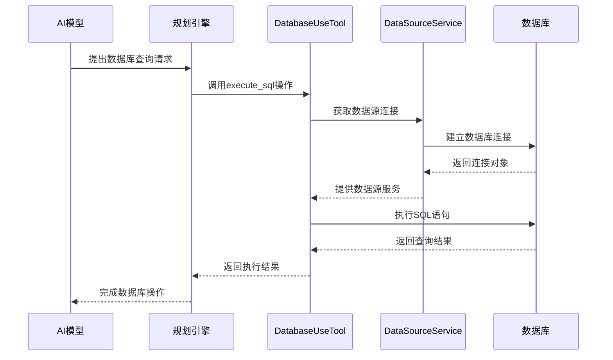
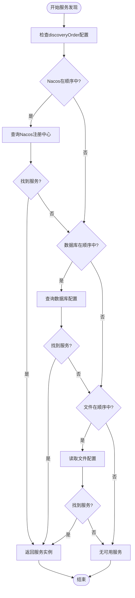
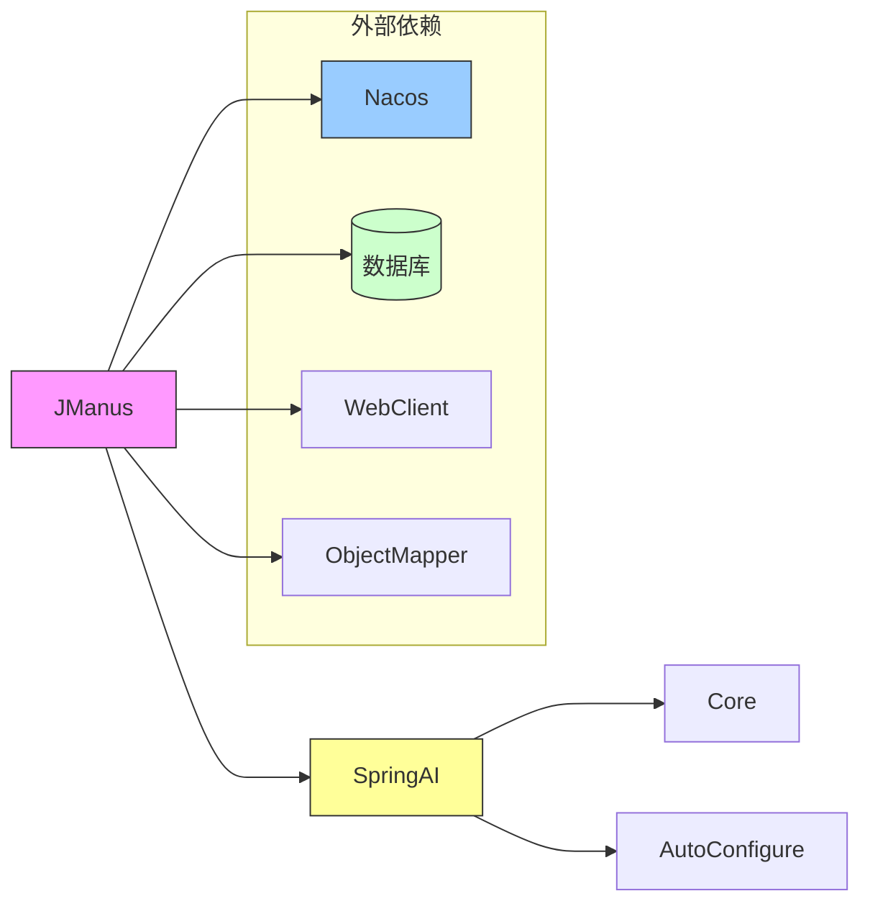

# 工具集成

<cite>
**本文档引用的文件**
- [AbstractBaseTool.java](file://spring-ai-alibaba-jmanus/src/main/java/com/alibaba/cloud/ai/manus/tool/AbstractBaseTool.java)
- [DatabaseUseTool.java](file://spring-ai-alibaba-jmanus/src/main/java/com/alibaba/cloud/ai/manus/tool/database/DatabaseUseTool.java)
- [McpRouterProperties.java](file://spring-ai-alibaba-mcp/spring-ai-alibaba-mcp-router/src/main/java/com/alibaba/cloud/ai/mcp/router/config/McpRouterProperties.java)
- [McpGatewayToolManager.java](file://spring-ai-alibaba-mcp/spring-ai-alibaba-mcp-router/src/main/java/com/alibaba/cloud/ai/mcp/gateway/core/McpGatewayToolManager.java)
- [ManusProperties.java](file://spring-ai-alibaba-jmanus/src/main/java/com/alibaba/cloud/ai/manus/config/ManusProperties.java)
- [McpConnectionFactory.java](file://spring-ai-alibaba-jmanus/src/main/java/com/alibaba/cloud/ai/manus/mcp/service/McpConnectionFactory.java)
- [CommonToolCallAutoConfiguration.java](file://community/tool-calls/spring-ai-alibaba-starter-tool-calling-common/src/main/java/com/alibaba/cloud/ai/toolcalling/common/CommonToolCallAutoConfiguration.java)
- [JsonParseTool.java](file://community/tool-calls/spring-ai-alibaba-starter-tool-calling-common/src/main/java/com/alibaba/cloud/ai/toolcalling/common/JsonParseTool.java)
- [RestClientTool.java](file://community/tool-calls/spring-ai-alibaba-starter-tool-calling-common/src/main/java/com/alibaba/cloud/ai/toolcalling/common/RestClientTool.java)
- [WebClientTool.java](file://community/tool-calls/spring-ai-alibaba-starter-tool-calling-common/src/main/java/com/alibaba/cloud/ai/toolcalling/common/WebClientTool.java)
</cite>

## 目录
1. [简介](#简介)
2. [项目结构](#项目结构)
3. [核心组件](#核心组件)
4. [架构概述](#架构概述)
5. [详细组件分析](#详细组件分析)
6. [依赖分析](#依赖分析)
7. [性能考虑](#性能考虑)
8. [故障排查指南](#故障排查指南)
9. [结论](#结论)

## 简介
JManus平台提供了一套完整的工具集成解决方案，支持本地工具和远程MCP服务的调用。本平台通过统一的工具注册中心实现运行时发现机制，并实施严格的安全控制策略来确保工具执行的安全性。文档将详细介绍内置工具的使用方法、自定义工具开发教程、性能监控指标以及最佳实践建议。

## 项目结构
JManus平台的工具集成功能主要分布在多个模块中，形成了清晰的分层架构。核心功能由`spring-ai-alibaba-jmanus`模块提供，而MCP相关功能则由独立的`spring-ai-alibaba-mcp`模块管理。

**图示来源**
- [spring-ai-alibaba-jmanus](file://spring-ai-alibaba-jmanus)
- [spring-ai-alibaba-mcp](file://spring-ai-alibaba-mcp)

**章节来源**
- [spring-ai-alibaba-jmanus](file://spring-ai-alibaba-jmanus)
- [spring-ai-alibaba-mcp](file://spring-ai-alibaba-mcp)

## 核心组件
JManus平台的工具集成系统由几个关键组件构成：工具基类`AbstractBaseTool`为所有工具提供统一接口；`DatabaseUseTool`实现了数据库操作功能；MCP路由配置`McpRouterProperties`管理远程服务连接；`McpGatewayToolManager`负责网关工具的生命周期管理。

**章节来源**
- [AbstractBaseTool.java](file://spring-ai-alibaba-jmanus/src/main/java/com/alibaba/cloud/ai/manus/tool/AbstractBaseTool.java)
- [DatabaseUseTool.java](file://spring-ai-alibaba-jmanus/src/main/java/com/alibaba/cloud/ai/manus/tool/database/DatabaseUseTool.java)
- [McpRouterProperties.java](file://spring-ai-alibaba-mcp/spring-ai-alibaba-mcp-router/src/main/java/com/alibaba/cloud/ai/mcp/router/config/McpRouterProperties.java)
- [McpGatewayToolManager.java](file://spring-ai-alibaba-mcp/spring-ai-alibaba-mcp-router/src/main/java/com/alibaba/cloud/ai/mcp/gateway/core/McpGatewayToolManager.java)

## 架构概述
JManus平台的工具集成架构采用分层设计模式，从上到下分为应用层、服务层、传输层和数据层。这种设计使得本地工具调用与远程MCP服务调用具有相同的抽象接口，同时保持了良好的扩展性和可维护性。

**图示来源**
- [McpConnectionFactory.java](file://spring-ai-alibaba-jmanus/src/main/java/com/alibaba/cloud/ai/manus/mcp/service/McpConnectionFactory.java)
- [ManusProperties.java](file://spring-ai-alibaba-jmanus/src/main/java/com/alibaba/cloud/ai/manus/config/ManusProperties.java)

## 详细组件分析

### 工具基类分析
`AbstractBaseTool`是所有工具实现的基础类，它定义了工具执行的基本契约和上下文管理机制。该类通过泛型参数化输入类型，提供了计划ID管理和直接返回标志等通用功能。

**图示来源**
- [AbstractBaseTool.java](file://spring-ai-alibaba-jmanus/src/main/java/com/alibaba/cloud/ai/manus/tool/AbstractBaseTool.java)

**章节来源**
- [AbstractBaseTool.java](file://spring-ai-alibaba-jmanus/src/main/java/com/alibaba/cloud/ai/manus/tool/AbstractBaseTool.java)

### 数据库工具分析
`DatabaseUseTool`是一个典型的内置工具实现，支持多种数据库操作，包括SQL执行、表结构查询、索引信息获取等。该工具通过`DataSourceService`管理数据源连接，并在执行完成后进行资源清理。

**图示来源**
- [DatabaseUseTool.java](file://spring-ai-alibaba-jmanus/src/main/java/com/alibaba/cloud/ai/manus/tool/database/DatabaseUseTool.java)
- [DataSourceService.java](file://spring-ai-alibaba-jmanus/src/main/java/com/alibaba/cloud/ai/manus/tool/database/DataSourceService.java)

**章节来源**
- [DatabaseUseTool.java](file://spring-ai-alibaba-jmanus/src/main/java/com/alibaba/cloud/ai/manus/tool/database/DatabaseUseTool.java)

### MCP服务发现分析
MCP服务发现机制支持多种配置方式，包括Nacos、数据库和文件配置。`McpRouterProperties`中的`discoveryOrder`属性定义了服务发现的优先级顺序，默认使用Nacos作为首选发现方式。

**图示来源**
- [McpRouterProperties.java](file://spring-ai-alibaba-mcp/spring-ai-alibaba-mcp-router/src/main/java/com/alibaba/cloud/ai/mcp/router/config/McpRouterProperties.java)
- [FileMcpRouterAutoConfiguration.java](file://auto-configurations/spring-ai-alibaba-autoconfigure-mcp-router/src/main/java/com/alibaba/cloud/ai/autoconfigure/mcp/router/FileMcpRouterAutoConfiguration.java)
- [DbMcpRouterAutoConfiguration.java](file://auto-configurations/spring-ai-alibaba-autoconfigure-mcp-router/src/main/java/com/alibaba/cloud/ai/autoconfigure/mcp/router/DbMcpRouterAutoConfiguration.java)

**章节来源**
- [McpRouterProperties.java](file://spring-ai-alibaba-mcp/spring-ai-alibaba-mcp-router/src/main/java/com/alibaba/cloud/ai/mcp/router/config/McpRouterProperties.java)

## 依赖分析
JManus平台的工具集成系统依赖于多个核心模块和服务，这些依赖关系确保了系统的完整性和功能性。

**图示来源**
- [pom.xml](file://spring-ai-alibaba-jmanus/pom.xml)
- [pom.xml](file://spring-ai-alibaba-mcp/pom.xml)

**章节来源**
- [pom.xml](file://spring-ai-alibaba-jmanus/pom.xml)
- [pom.xml](file://spring-ai-alibaba-mcp/pom.xml)

## 性能考虑
JManus平台在工具集成方面实施了多项性能优化措施，以确保高效稳定的运行。

### 连接池配置
平台通过`ManusProperties`中的配置项对MCP服务连接进行精细化控制：

- **最大并发连接数**: 默认值为10，可通过`mcpMaxConcurrentConnections`配置
- **连接超时时间**: 可通过`mcpConnectionTimeoutSeconds`设置
- **最大重试次数**: 默认值为1，可通过`mcpMaxRetryCount`调整

这些配置有助于平衡系统资源利用率和响应性能。

### 缓存机制
平台实现了多级缓存策略：
1. 工具定义缓存
2. 服务发现结果缓存  
3. 数据库连接池缓存
4. 配置属性缓存

缓存机制显著减少了重复计算和网络开销，提高了整体系统性能。

**章节来源**
- [ManusProperties.java](file://spring-ai-alibaba-jmanus/src/main/java/com/alibaba/cloud/ai/manus/config/ManusProperties.java)
- [McpConnectionFactory.java](file://spring-ai-alibaba-jmanus/src/main/java/com/alibaba/cloud/ai/manus/mcp/service/McpConnectionFactory.java)

## 故障排查指南
当遇到工具集成相关问题时，可以按照以下步骤进行排查：

### 常见问题及解决方案
1. **工具无法注册**
   - 检查是否正确添加了`@Component`注解
   - 确认Spring容器能够扫描到工具类
   - 验证工具名称的唯一性

2. **MCP服务连接失败**
   - 检查`McpRouterProperties`中的服务配置
   - 验证网络连通性和端口开放情况
   - 查看日志中的具体错误信息

3. **数据库工具执行异常**
   - 确认数据源配置正确
   - 检查数据库连接状态
   - 验证SQL语句的语法正确性

4. **性能瓶颈**
   - 检查连接池配置是否合理
   - 分析慢查询日志
   - 监控系统资源使用情况

**章节来源**
- [DatabaseUseTool.java](file://spring-ai-alibaba-jmanus/src/main/java/com/alibaba/cloud/ai/manus/tool/database/DatabaseUseTool.java)
- [McpConnectionFactory.java](file://spring-ai-alibaba-jmanus/src/main/java/com/alibaba/cloud/ai/manus/mcp/service/McpConnectionFactory.java)
- [ManusProperties.java](file://spring-ai-alibaba-jmanus/src/main/java/com/alibaba/cloud/ai/manus/config/ManusProperties.java)

## 结论
JManus平台提供了一个强大而灵活的工具集成框架，支持本地工具和远程MCP服务的无缝集成。通过统一的工具基类设计、灵活的服务发现机制和完善的配置管理，平台能够满足各种复杂场景下的工具调用需求。建议在实际使用中充分利用内置工具，并根据业务需要开发自定义工具，同时注意合理配置性能参数以获得最佳运行效果。