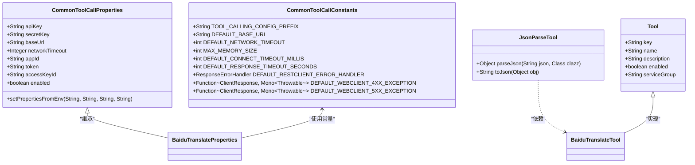
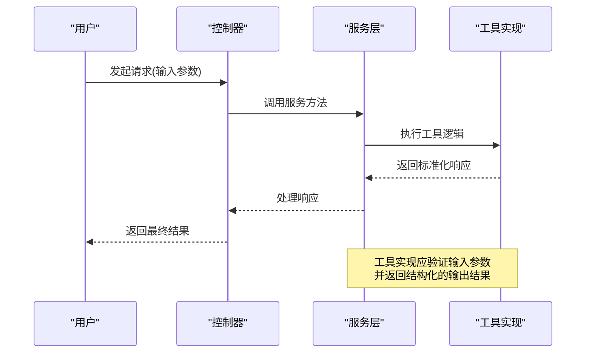
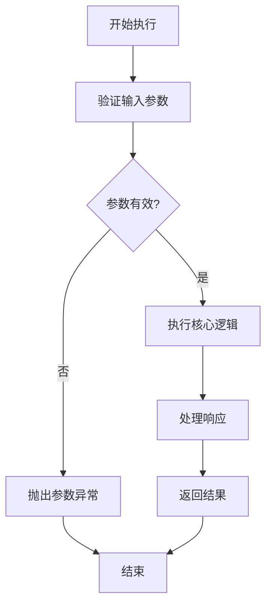
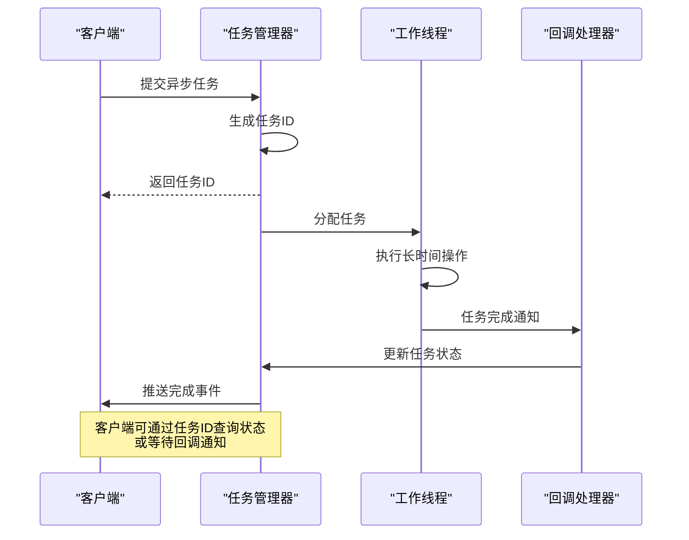
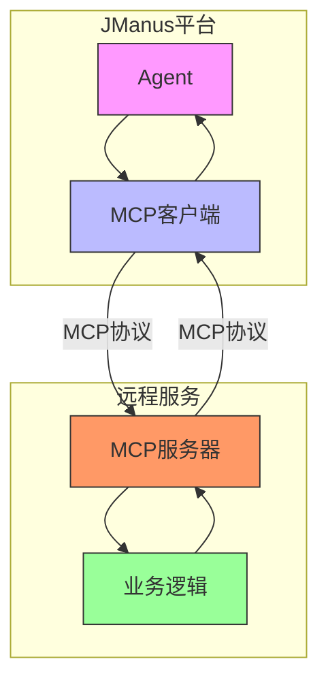

# 自定义工具开发

<cite>
**本文档引用的文件**
- [CommonToolCallProperties.java](file://community/tool-calls/spring-ai-alibaba-starter-tool-calling-common/src/main/java/com/alibaba/cloud/ai/toolcalling/common/CommonToolCallProperties.java)
- [CommonToolCallConstants.java](file://community/tool-calls/spring-ai-alibaba-starter-tool-calling-common/src/main/java/com/alibaba/cloud/ai/toolcalling/common/CommonToolCallConstants.java)
- [CommonToolCallAutoConfiguration.java](file://community/tool-calls/spring-ai-alibaba-starter-tool-calling-common/src/main/java/com/alibaba/cloud/ai/toolcalling/common/CommonToolCallAutoConfiguration.java)
- [Tool.java](file://spring-ai-alibaba-jmanus/src/main/java/com/alibaba/cloud/ai/manus/agent/model/Tool.java)
- [PlanTemplateController.java](file://spring-ai-alibaba-jmanus/src/main/java/com/alibaba/cloud/ai/manus/planning/controller/PlanTemplateController.java)
</cite>

## 目录
1. [简介](#简介)
2. [项目结构搭建](#项目结构搭建)
3. [工具类继承与实现](#工具类继承与实现)
4. [元数据配置](#元数据配置)
5. [工具接口规范](#工具接口规范)
6. [同步与异步工具实现](#同步与异步工具实现)
7. [本地与远程工具实现](#本地与远程工具实现)
8. [工具测试方法](#工具测试方法)
9. [调试技巧与常见问题](#调试技巧与常见问题)

## 简介
JManus平台是一个基于Spring Boot架构的智能化多智能体工作流系统，支持计划生成、异步执行、状态跟踪和配置管理等功能。本指南将详细介绍如何在JManus平台上从零开始创建自定义工具，包括项目结构搭建、工具类继承、元数据配置和部署发布等完整流程。

JManus平台原生支持MCP（Model Context Protocol）协议，能够无缝集成外部服务和工具，同时提供PLAN-ACT模式，让智能体具备复杂推理、分步执行和动态调整的能力。通过本指南，开发者可以快速掌握自定义工具开发的核心技术要点，构建符合特定业务需求的智能助手。

## 项目结构搭建
在JManus平台上创建新工具的第一步是搭建正确的项目结构。建议遵循以下目录结构：

```
spring-ai-alibaba-starter-tool-calling-{tool-name}/
├── src/
│   ├── main/
│   │   ├── java/
│   │   │   └── com/alibaba/cloud/ai/toolcalling/{tool-name}/
│   │   │       ├── {ToolName}Tool.java
│   │   │       ├── {ToolName}Properties.java
│   │   │       └── {ToolName}AutoConfiguration.java
│   │   └── resources/
│   │       └── META-INF/
│   │           └── spring-configuration-metadata.json
│   └── test/
│       └── java/
│           └── com/alibaba/cloud/ai/toolcalling/{tool-name}/
│               └── {ToolName}ToolTests.java
└── pom.xml
```

项目根目录应以`spring-ai-alibaba-starter-tool-calling-`为前缀，后接工具名称。Java源代码位于`src/main/java`目录下，按照包名`com.alibaba.cloud.ai.toolcalling.{tool-name}`组织。每个工具模块都应包含三个核心类：工具实现类、属性配置类和自动配置类。

**Section sources**
- [CommonToolCallAutoConfiguration.java](file://community/tool-calls/spring-ai-alibaba-starter-tool-calling-common/src/main/java/com/alibaba/cloud/ai/toolcalling/common/CommonToolCallAutoConfiguration.java)

## 工具类继承与实现
在JManus平台中，所有自定义工具都应继承或实现通用工具调用框架中的基础组件。核心基类和接口位于`spring-ai-alibaba-starter-tool-calling-common`模块中。

工具实现需要关注以下几个关键组件：

1. **CommonToolCallProperties**: 所有工具属性类都应继承此类，它提供了API密钥、基础URL、网络超时等通用配置项。
2. **CommonToolCallConstants**: 包含工具调用的常量定义，如配置前缀、默认超时时间等。
3. **JsonParseTool**: 提供JSON解析功能的工具类，可通过自动配置注入使用。



**Diagram sources**
- [CommonToolCallProperties.java](file://community/tool-calls/spring-ai-alibaba-starter-tool-calling-common/src/main/java/com/alibaba/cloud/ai/toolcalling/common/CommonToolCallProperties.java)
- [CommonToolCallConstants.java](file://community/tool-calls/spring-ai-alibaba-starter-tool-calling-common/src/main/java/com/alibaba/cloud/ai/toolcalling/common/CommonToolCallConstants.java)
- [CommonToolCallAutoConfiguration.java](file://community/tool-calls/spring-ai-alibaba-starter-tool-calling-common/src/main/java/com/alibaba/cloud/ai/toolcalling/common/CommonToolCallAutoConfiguration.java)
- [Tool.java](file://spring-ai-alibaba-jmanus/src/main/java/com/alibaba/cloud/ai/manus/agent/model/Tool.java)

**Section sources**
- [CommonToolCallProperties.java](file://community/tool-calls/spring-ai-alibaba-starter-tool-calling-common/src/main/java/com/alibaba/cloud/ai/toolcalling/common/CommonToolCallProperties.java)
- [CommonToolCallConstants.java](file://community/tool-calls/spring-ai-alibaba-starter-tool-calling-common/src/main/java/com/alibaba/cloud/ai/toolcalling/common/CommonToolCallConstants.java)
- [CommonToolCallAutoConfiguration.java](file://community/tool-calls/spring-ai-alibaba-starter-tool-calling-common/src/main/java/com/alibaba/cloud/ai/toolcalling/common/CommonToolCallAutoConfiguration.java)
- [Tool.java](file://spring-ai-alibaba-jmanus/src/main/java/com/alibaba/cloud/ai/manus/agent/model/Tool.java)

## 元数据配置
JManus平台的自定义工具需要正确配置元数据，以便系统能够识别和管理这些工具。元数据配置主要包括两个方面：属性配置和自动配置。

### 属性配置
每个工具都需要一个属性类来定义其配置项。该类应继承`CommonToolCallProperties`并添加特定于该工具的配置属性。例如，百度翻译工具的属性类可能如下所示：

```java
@ConfigurationProperties(prefix = "spring.ai.alibaba.toolcalling.baidu-translate")
public class BaiduTranslateProperties extends CommonToolCallProperties {
    private String fromLang = "auto";
    private String toLang = "zh";
    
    // getters and setters
}
```

### 自动配置
自动配置类负责创建和注册工具实例。它使用Spring的条件化配置机制，只有在启用相应工具时才会创建Bean。

```java
@Configuration
@EnableConfigurationProperties(BaiduTranslateProperties.class)
@ConditionalOnProperty(name = "spring.ai.alibaba.toolcalling.baidu-translate.enabled", havingValue = "true", matchIfMissing = true)
public class BaiduTranslateAutoConfiguration {

    @Bean
    @ConditionalOnMissingBean
    public BaiduTranslateTool baiduTranslateTool(BaiduTranslateProperties properties) {
        return new BaiduTranslateTool(properties);
    }
}
```

此外，还需要在`META-INF/spring-configuration-metadata.json`文件中定义配置属性的元数据，以便IDE提供代码补全和文档提示。

```json
{
  "properties": [
    {
      "name": "spring.ai.alibaba.toolcalling.baidu-translate.api-key",
      "type": "java.lang.String",
      "description": "Baidu Translate API密钥"
    },
    {
      "name": "spring.ai.alibaba.toolcalling.baidu-translate.from-lang",
      "type": "java.lang.String",
      "description": "源语言",
      "defaultValue": "auto"
    }
  ]
}
```

**Section sources**
- [CommonToolCallProperties.java](file://community/tool-calls/spring-ai-alibaba-starter-tool-calling-common/src/main/java/com/alibaba/cloud/ai/toolcalling/common/CommonToolCallProperties.java)
- [CommonToolCallAutoConfiguration.java](file://community/tool-calls/spring-ai-alibaba-starter-tool-calling-common/src/main/java/com/alibaba/cloud/ai/toolcalling/common/CommonToolCallAutoConfiguration.java)

## 工具接口规范
为了确保JManus平台中所有工具的一致性和可互操作性，必须遵循统一的接口规范。这些规范涵盖了输入输出格式、错误码定义和文档生成要求。

### 输入输出格式
所有工具的输入参数应使用标准的Map<String, Object>类型，输出结果应返回标准化的响应对象。输入参数中的敏感信息（如API密钥）不应直接传递，而应通过配置属性获取。



**Diagram sources**
- [PlanTemplateController.java](file://spring-ai-alibaba-jmanus/src/main/java/com/alibaba/cloud/ai/manus/planning/controller/PlanTemplateController.java)

### 错误码定义
JManus平台采用统一的错误码体系，所有工具在发生异常时应抛出带有标准错误码的运行时异常。常见的错误码包括：

- `TOOL_001`: 工具未启用
- `TOOL_002`: 配置参数缺失
- `TOOL_003`: 网络连接超时
- `TOOL_004`: API调用失败
- `TOOL_005`: 响应解析错误

### 文档生成要求
每个工具必须提供完整的文档说明，包括：
1. 工具功能描述
2. 配置参数说明
3. 使用示例
4. 性能指标
5. 安全注意事项

文档应以Markdown格式编写，并包含在项目的README文件中。

**Section sources**
- [PlanTemplateController.java](file://spring-ai-alibaba-jmanus/src/main/java/com/alibaba/cloud/ai/manus/planning/controller/PlanTemplateController.java)

## 同步与异步工具实现
JManus平台支持同步和异步两种工具执行模式，开发者可以根据具体需求选择合适的实现方式。

### 同步工具实现
同步工具适用于执行时间较短、确定性高的操作。其实现简单直接，方法调用后立即返回结果。



同步工具的优点是实现简单、调用直观，但缺点是会阻塞调用线程，不适合长时间运行的任务。

### 异步工具实现
异步工具适用于执行时间较长或需要后台处理的操作。JManus平台通过任务队列和回调机制支持异步执行。



异步工具的优点是可以处理耗时操作而不阻塞主线程，支持进度跟踪和状态查询，但实现相对复杂，需要考虑任务状态管理和错误恢复。

**Diagram sources**
- [PlanTemplateController.java](file://spring-ai-alibaba-jmanus/src/main/java/com/alibaba/cloud/ai/manus/planning/controller/PlanTemplateController.java)

**Section sources**
- [PlanTemplateController.java](file://spring-ai-alibaba-jmanus/src/main/java/com/alibaba/cloud/ai/manus/planning/controller/PlanTemplateController.java)

## 本地与远程工具实现
JManus平台支持本地工具和远程工具两种部署模式，满足不同场景的需求。

### 本地工具实现
本地工具直接集成在JManus应用内部，作为Spring Bean存在。它们可以直接访问应用上下文和共享资源，性能较高。

```java
@Component
public class LocalFileProcessorTool implements ToolInterface {
    
    @Autowired
    private FileStorageService fileStorage;
    
    @Override
    public Object execute(Map<String, Object> parameters) {
        // 直接访问本地服务
        String filePath = (String) parameters.get("filePath");
        return fileStorage.processFile(filePath);
    }
}
```

本地工具适合处理与系统紧密耦合的功能，如数据库操作、文件处理等。

### 远程工具实现
远程工具通过HTTP API或其他网络协议提供服务，可以独立部署和扩展。JManus平台通过MCP协议与远程工具通信。



远程工具的优点是解耦性强、易于独立升级和扩展，适合第三方服务集成或微服务架构。

**Diagram sources**
- [PlanTemplateController.java](file://spring-ai-alibaba-jmanus/src/main/java/com/alibaba/cloud/ai/manus/planning/controller/PlanTemplateController.java)

**Section sources**
- [PlanTemplateController.java](file://spring-ai-alibaba-jmanus/src/main/java/com/alibaba/cloud/ai/manus/planning/controller/PlanTemplateController.java)

## 工具测试方法
为确保自定义工具的质量和可靠性，需要建立完善的测试体系，包括单元测试和集成测试。

### 单元测试最佳实践
单元测试应覆盖工具的所有核心逻辑路径，使用Mockito等框架模拟依赖组件。

```java
@Test
public void testTranslateSuccess() {
    // 准备测试数据
    BaiduTranslateProperties properties = new BaiduTranslateProperties();
    properties.setApiKey("test-key");
    
    // 创建被测对象
    BaiduTranslateTool tool = new BaiduTranslateTool(properties);
    
    // 设置mock行为
    when(restClient.post()).thenReturn(requestSpec);
    when(requestSpec.uri(any())).thenReturn(requestSpec);
    when(requestSpec.header(any(), any())).thenReturn(requestSpec);
    when(requestSpec.body(any())).thenReturn(responseSpec);
    when(responseSpec.retrieve()).thenReturn(response);
    when(response.bodyToMono(String.class)).thenReturn(Mono.just("{\"trans_result\":[{\"dst\":\"你好\"}]}"));
    
    // 执行测试
    Map<String, Object> params = new HashMap<>();
    params.put("text", "hello");
    params.put("from", "en");
    params.put("to", "zh");
    
    Object result = tool.execute(params);
    
    // 验证结果
    assertNotNull(result);
    assertTrue(result.toString().contains("你好"));
}
```

### 集成测试最佳实践
集成测试应在接近生产环境的条件下验证工具的整体行为，包括配置加载、依赖注入和实际网络调用。

```java
@SpringBootTest
@ActiveProfiles("test")
class BaiduTranslateToolIntegrationTest {
    
    @Autowired
    private BaiduTranslateTool tool;
    
    @Test
    void testEndToEndTranslation() {
        // 使用真实API密钥进行测试
        Map<String, Object> params = new HashMap<>();
        params.put("text", "Hello World");
        params.put("from", "en");
        params.put("to", "zh");
        
        Object result = tool.execute(params);
        
        // 验证翻译结果
        assertThat(result).isNotNull();
        assertThat(result.toString()).contains("世界");
    }
}
```

测试应覆盖正常流程、异常情况和边界条件，确保工具在各种场景下都能正确工作。

**Section sources**
- [PlanTemplateController.java](file://spring-ai-alibaba-jmanus/src/main/java/com/alibaba/cloud/ai/manus/planning/controller/PlanTemplateController.java)

## 调试技巧与常见问题
在开发和使用JManus平台自定义工具时，可能会遇到各种问题。以下是常用的调试技巧和常见问题解决方案。

### 调试技巧
1. **日志分析**: 启用DEBUG级别日志，查看工具执行的详细过程。
2. **断点调试**: 在关键方法上设置断点，逐步跟踪执行流程。
3. **配置验证**: 使用`@Validated`注解验证配置属性的正确性。
4. **网络监控**: 使用Wireshark或浏览器开发者工具监控HTTP请求。

### 常见问题及解决方案
1. **工具未注册**: 确保自动配置类被正确扫描，检查`@ComponentScan`范围。
2. **配置不生效**: 验证配置前缀是否正确，检查`application.yml`中的配置项。
3. **网络超时**: 调整`networkTimeout`配置，增加超时时间。
4. **序列化错误**: 检查JSON格式是否正确，确保对象可序列化。
5. **权限问题**: 验证API密钥的有效性，检查服务端权限设置。

通过遵循本指南中的最佳实践，开发者可以高效地创建高质量的自定义工具，充分发挥JManus平台的强大能力。

**Section sources**
- [PlanTemplateController.java](file://spring-ai-alibaba-jmanus/src/main/java/com/alibaba/cloud/ai/manus/planning/controller/PlanTemplateController.java)