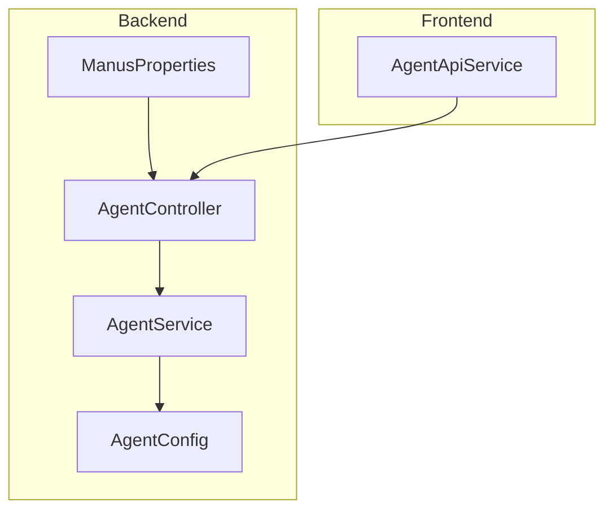
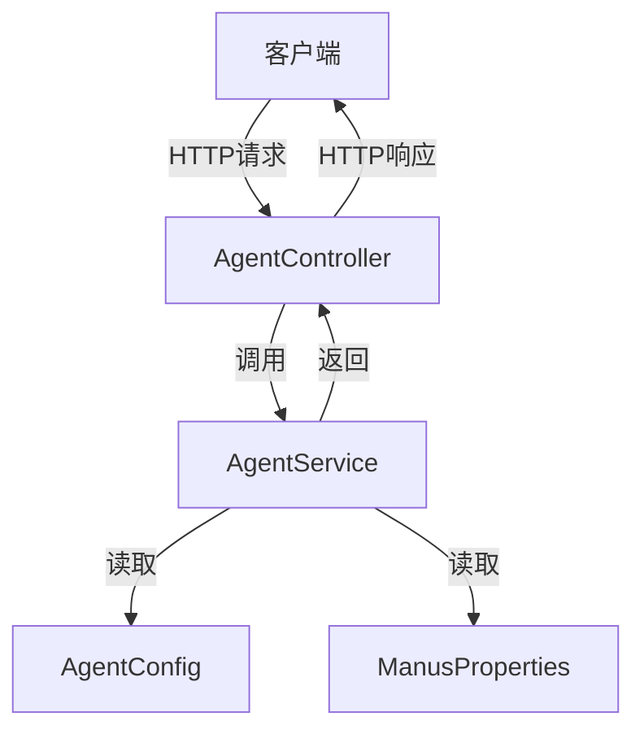
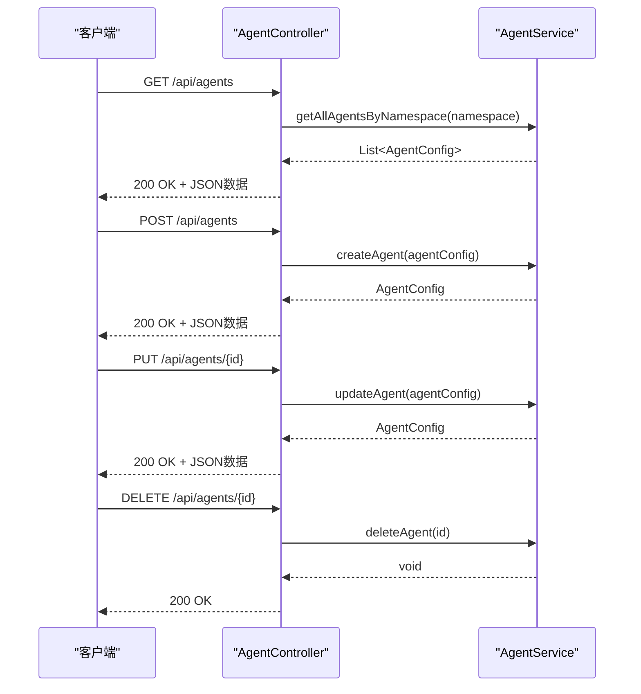
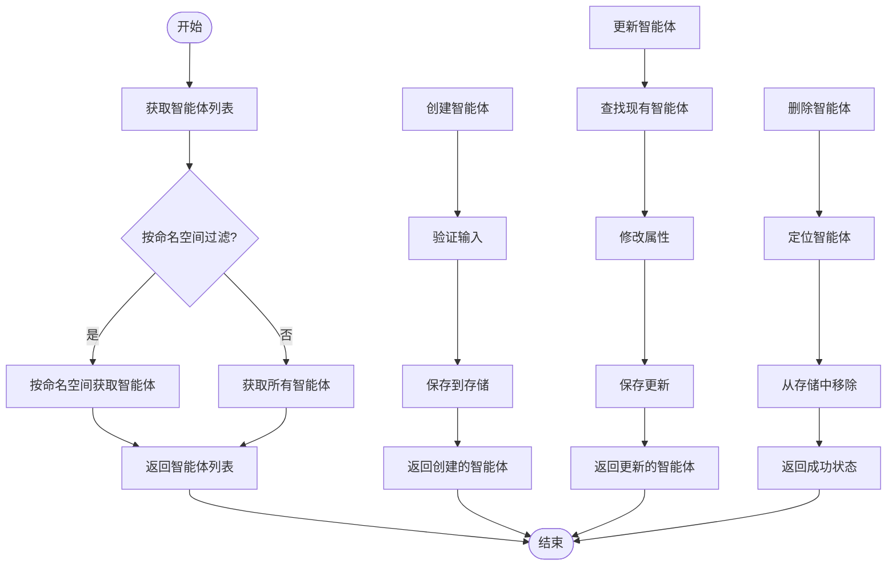
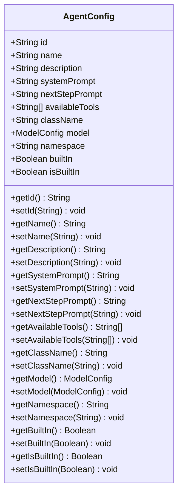
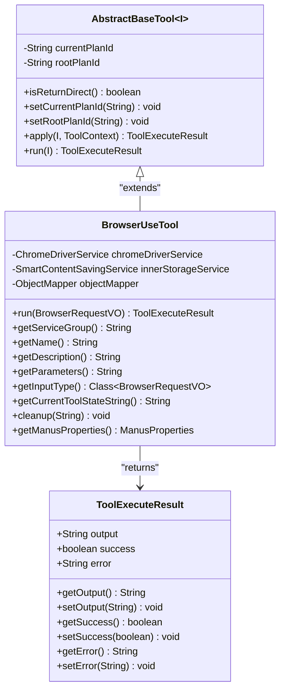
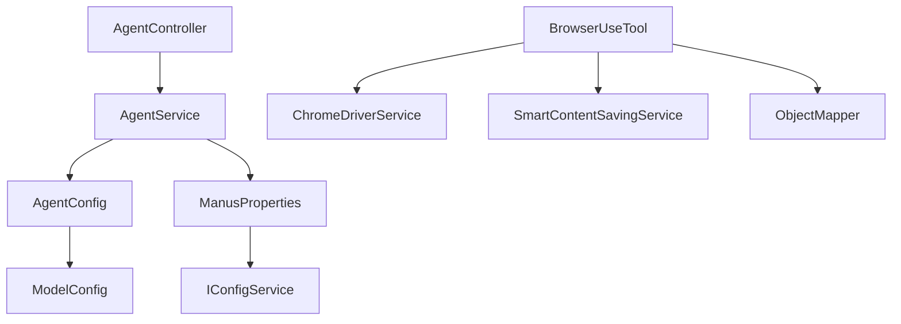

# API接口

<cite>
**本文档引用的文件**
- [AgentController.java](file://spring-ai-alibaba-jmanus/src/main/java/com/alibaba/cloud/ai/manus/agent/controller/AgentController.java)
- [AgentService.java](file://spring-ai-alibaba-jmanus/src/main/java/com/alibaba/cloud/ai/manus/agent/service/AgentService.java)
- [AgentConfig.java](file://spring-ai-alibaba-jmanus/src/main/java/com/alibaba/cloud/ai/manus/agent/service/AgentConfig.java)
- [AbstractBaseTool.java](file://spring-ai-alibaba-jmanus/src/main/java/com/alibaba/cloud/ai/manus/tool/AbstractBaseTool.java)
- [BrowserUseTool.java](file://spring-ai-alibaba-jmanus/src/main/java/com/alibaba/cloud/ai/manus/tool/browser/BrowserUseTool.java)
- [ManusProperties.java](file://spring-ai-alibaba-jmanus/src/main/java/com/alibaba/cloud/ai/manus/config/ManusProperties.java)
- [application.yml](file://spring-ai-alibaba-jmanus/src/main/resources/application.yml)
- [agent-api-service.ts](file://spring-ai-alibaba-jmanus/ui-vue3/src/api/agent-api-service.ts)
</cite>

## 目录
1. [简介](#简介)
2. [项目结构](#项目结构)
3. [核心组件](#核心组件)
4. [架构概述](#架构概述)
5. [详细组件分析](#详细组件分析)
6. [依赖分析](#依赖分析)
7. [性能考虑](#性能考虑)
8. [故障排除指南](#故障排除指南)
9. [结论](#结论)

## 简介
JManus平台提供了一套完整的智能体管理API，用于创建、查询、更新和删除智能体。该API基于RESTful设计原则，提供了对智能体生命周期的全面控制。API支持命名空间隔离，允许在不同环境中管理智能体配置。通过这些API，用户可以动态地配置智能体的行为，包括其系统提示、可用工具、关联模型等。API还提供了对可用工具的查询功能，使客户端能够了解当前系统支持的功能。

## 项目结构
JManus平台的智能体管理API主要位于`spring-ai-alibaba-jmanus`模块中，具体实现分布在多个包下。核心API控制器位于`com.alibaba.cloud.ai.manus.agent.controller`包中，服务层逻辑在`com.alibaba.cloud.ai.manus.agent.service`包中，而相关的数据模型则定义在相应的实体和服务类中。前端UI通过TypeScript服务类与后端API进行交互，这些服务类位于`ui-vue3/src/api`目录下。整个项目的配置通过Spring Boot的配置机制进行管理，主要配置文件为`application.yml`。

**图表来源**
- [AgentController.java](file://spring-ai-alibaba-jmanus/src/main/java/com/alibaba/cloud/ai/manus/agent/controller/AgentController.java)
- [AgentService.java](file://spring-ai-alibaba-jmanus/src/main/java/com/alibaba/cloud/ai/manus/agent/service/AgentService.java)
- [AgentConfig.java](file://spring-ai-alibaba-jmanus/src/main/java/com/alibaba/cloud/ai/manus/agent/service/AgentConfig.java)
- [ManusProperties.java](file://spring-ai-alibaba-jmanus/src/main/java/com/alibaba/cloud/ai/manus/config/ManusProperties.java)
- [agent-api-service.ts](file://spring-ai-alibaba-jmanus/ui-vue3/src/api/agent-api-service.ts)

**章节来源**
- [AgentController.java](file://spring-ai-alibaba-jmanus/src/main/java/com/alibaba/cloud/ai/manus/agent/controller/AgentController.java)
- [application.yml](file://spring-ai-alibaba-jmanus/src/main/resources/application.yml)

## 核心组件
智能体管理API的核心组件包括`AgentController`、`AgentService`和`AgentConfig`三个主要部分。`AgentController`作为RESTful API的入口点，处理所有HTTP请求并将其委托给`AgentService`进行业务逻辑处理。`AgentService`接口定义了智能体管理的所有操作，包括获取、创建、更新和删除智能体，以及获取可用工具列表。`AgentConfig`类作为数据传输对象(DTO)，封装了智能体的所有配置属性，如名称、描述、系统提示、可用工具等。这些组件共同构成了智能体管理功能的基础。

**章节来源**
- [AgentController.java](file://spring-ai-alibaba-jmanus/src/main/java/com/alibaba/cloud/ai/manus/agent/controller/AgentController.java)
- [AgentService.java](file://spring-ai-alibaba-jmanus/src/main/java/com/alibaba/cloud/ai/manus/agent/service/AgentService.java)
- [AgentConfig.java](file://spring-ai-alibaba-jmanus/src/main/java/com/alibaba/cloud/ai/manus/agent/service/AgentConfig.java)

## 架构概述
JManus平台的智能体管理API采用典型的分层架构设计。最上层是`AgentController`，负责处理HTTP请求和响应，实现了RESTful API的各个端点。中间层是`AgentService`，包含业务逻辑，处理来自控制器的请求，并与底层的数据访问层交互。底层是数据模型和配置管理，其中`AgentConfig`类定义了智能体的配置结构，而`ManusProperties`类则管理系统的全局配置。这种分层设计确保了关注点分离，使得代码更易于维护和扩展。API通过JSON格式进行数据交换，支持跨域请求(CORS)，并且可以通过命名空间对智能体进行组织和隔离。

**图表来源**
- [AgentController.java](file://spring-ai-alibaba-jmanus/src/main/java/com/alibaba/cloud/ai/manus/agent/controller/AgentController.java)
- [AgentService.java](file://spring-ai-alibaba-jmanus/src/main/java/com/alibaba/cloud/ai/manus/agent/service/AgentService.java)
- [AgentConfig.java](file://spring-ai-alibaba-jmanus/src/main/java/com/alibaba/cloud/ai/manus/agent/service/AgentConfig.java)
- [ManusProperties.java](file://spring-ai-alibaba-jmanus/src/main/java/com/alibaba/cloud/ai/manus/config/ManusProperties.java)

## 详细组件分析

### 智能体控制器分析
`AgentController`是智能体管理API的主要入口点，提供了对智能体的CRUD操作。它通过`@RestController`和`@RequestMapping("/api/agents")`注解定义了一个RESTful控制器，所有智能体相关的API端点都以此路径为基础。控制器使用`@CrossOrigin(origins = "*")`注解支持跨域请求，使其能够被不同源的前端应用访问。每个API方法都使用相应的HTTP方法注解（如`@GetMapping`、`@PostMapping`等）来映射到特定的HTTP动词。

#### 对于API/服务组件：

**图表来源**
- [AgentController.java](file://spring-ai-alibaba-jmanus/src/main/java/com/alibaba/cloud/ai/manus/agent/controller/AgentController.java)
- [AgentService.java](file://spring-ai-alibaba-jmanus/src/main/java/com/alibaba/cloud/ai/manus/agent/service/AgentService.java)

**章节来源**
- [AgentController.java](file://spring-ai-alibaba-jmanus/src/main/java/com/alibaba/cloud/ai/manus/agent/controller/AgentController.java)

### 智能体服务分析
`AgentService`接口定义了智能体管理的核心业务逻辑。它提供了一系列方法来处理智能体的生命周期操作，包括获取所有智能体、根据ID获取单个智能体、创建新智能体、更新现有智能体和删除智能体。此外，它还提供了获取可用工具列表的功能，这对于客户端了解系统能力至关重要。服务接口的设计遵循了清晰的职责分离原则，每个方法都有明确的目的和契约。实现类将负责具体的持久化逻辑和业务规则验证。

#### 对于复杂逻辑组件：

**图表来源**
- [AgentService.java](file://spring-ai-alibaba-jmanus/src/main/java/com/alibaba/cloud/ai/manus/agent/service/AgentService.java)

**章节来源**
- [AgentService.java](file://spring-ai-alibaba-jmanus/src/main/java/com/alibaba/cloud/ai/manus/agent/service/AgentService.java)

### 智能体配置模型分析
`AgentConfig`类是智能体配置的数据模型，它包含了智能体的所有可配置属性。这个类作为数据传输对象(DTO)，在控制器和服务层之间传递智能体的配置信息。它包含了诸如ID、名称、描述、系统提示、下一步提示、可用工具列表、类名、模型配置和命名空间等属性。每个属性都有相应的getter和setter方法，遵循JavaBean规范。这个类的设计考虑到了序列化的需要，确保了配置可以在不同系统组件之间正确传输。

#### 对于对象导向组件：

**图表来源**
- [AgentConfig.java](file://spring-ai-alibaba-jmanus/src/main/java/com/alibaba/cloud/ai/manus/agent/service/AgentConfig.java)

**章节来源**
- [AgentConfig.java](file://spring-ai-alibaba-jmanus/src/main/java/com/alibaba/cloud/ai/manus/agent/service/AgentConfig.java)

### 工具系统分析
JManus平台的工具系统基于`AbstractBaseTool`抽象基类构建，所有具体的工具实现都继承自这个基类。`AbstractBaseTool`提供了工具执行的基本框架，包括计划ID管理、直接返回标志和执行方法。具体的工具如`BrowserUseTool`实现了特定的功能，例如浏览器自动化操作。`BrowserUseTool`支持多种浏览器操作，包括导航、点击、输入文本、截图、获取HTML内容等。每个工具都有明确的名称、描述和参数定义，这些信息用于向智能体系统注册工具并生成适当的函数调用。

#### 对于对象导向组件：

**图表来源**
- [AbstractBaseTool.java](file://spring-ai-alibaba-jmanus/src/main/java/com/alibaba/cloud/ai/manus/tool/AbstractBaseTool.java)
- [BrowserUseTool.java](file://spring-ai-alibaba-jmanus/src/main/java/com/alibaba/cloud/ai/manus/tool/browser/BrowserUseTool.java)

**章节来源**
- [AbstractBaseTool.java](file://spring-ai-alibaba-jmanus/src/main/java/com/alibaba/cloud/ai/manus/tool/AbstractBaseTool.java)
- [BrowserUseTool.java](file://spring-ai-alibaba-jmanus/src/main/java/com/alibaba/cloud/ai/manus/tool/browser/BrowserUseTool.java)

## 依赖分析
JManus平台的智能体管理API依赖于多个内部和外部组件。在内部，`AgentController`依赖于`AgentService`来执行业务逻辑，而`AgentService`又可能依赖于其他服务和数据访问组件。`AgentConfig`类依赖于`ModelConfig`类来表示关联的AI模型配置。在外部，系统依赖于Spring Framework提供的各种功能，如依赖注入、Web MVC、数据访问等。工具系统依赖于Playwright库进行浏览器自动化，以及Jackson库进行JSON序列化。配置管理依赖于Spring Boot的配置属性机制，允许通过YAML文件或环境变量进行灵活配置。

**图表来源**
- [AgentController.java](file://spring-ai-alibaba-jmanus/src/main/java/com/alibaba/cloud/ai/manus/agent/controller/AgentController.java)
- [AgentService.java](file://spring-ai-alibaba-jmanus/src/main/java/com/alibaba/cloud/ai/manus/agent/service/AgentService.java)
- [AgentConfig.java](file://spring-ai-alibaba-jmanus/src/main/java/com/alibaba/cloud/ai/manus/agent/service/AgentConfig.java)
- [ManusProperties.java](file://spring-ai-alibaba-jmanus/src/main/java/com/alibaba/cloud/ai/manus/config/ManusProperties.java)
- [BrowserUseTool.java](file://spring-ai-alibaba-jmanus/src/main/java/com/alibaba/cloud/ai/manus/tool/browser/BrowserUseTool.java)

**章节来源**
- [AgentController.java](file://spring-ai-alibaba-jmanus/src/main/java/com/alibaba/cloud/ai/manus/agent/controller/AgentController.java)
- [AgentService.java](file://spring-ai-alibaba-jmanus/src/main/java/com/alibaba/cloud/ai/manus/agent/service/AgentService.java)
- [ManusProperties.java](file://spring-ai-alibaba-jmanus/src/main/java/com/alibaba/cloud/ai/manus/config/ManusProperties.java)

## 性能考虑
JManus平台的智能体管理API在设计时考虑了性能因素。首先，API采用了分页和过滤机制，避免一次性返回大量数据，从而减少网络传输开销和内存占用。其次，系统支持命名空间隔离，这有助于在大型部署中分散负载。对于工具执行，特别是像浏览器自动化这样的资源密集型操作，系统实现了超时机制和资源清理策略，防止资源泄漏。`ManusProperties`中的配置项如`browserRequestTimeout`和`maxSteps`允许管理员根据实际需求调整性能相关参数。此外，系统通过智能内容处理机制，对长输出进行摘要处理，减少了数据传输量。

## 故障排除指南
当遇到智能体管理API的问题时，可以按照以下步骤进行排查：首先检查API端点是否正确，确保使用了正确的HTTP方法和URL路径。其次，验证请求体的JSON格式是否正确，特别是`AgentConfig`对象的字段类型和结构。如果收到400错误，可能是由于输入验证失败；如果是500错误，则可能是服务器内部问题。对于工具执行失败的情况，检查相关服务（如浏览器驱动）是否正常运行。查看日志文件（默认位于`./logs/info.log`）可以帮助定位具体问题。此外，确认`namespace.value`配置是否正确设置，因为这会影响智能体的可见性和操作范围。

**章节来源**
- [AgentController.java](file://spring-ai-alibaba-jmanus/src/main/java/com/alibaba/cloud/ai/manus/agent/controller/AgentController.java)
- [application.yml](file://spring-ai-alibaba-jmanus/src/main/resources/application.yml)

## 结论
JManus平台的智能体管理API提供了一套完整且灵活的RESTful接口，用于管理和操作智能体。通过清晰的分层架构和良好的设计原则，API实现了高内聚低耦合，便于维护和扩展。核心组件`AgentController`、`AgentService`和`AgentConfig`协同工作，提供了对智能体生命周期的全面控制。工具系统的设计允许轻松集成新的功能，而配置管理机制则提供了高度的可定制性。总体而言，这套API为构建和管理复杂的AI智能体应用提供了坚实的基础。