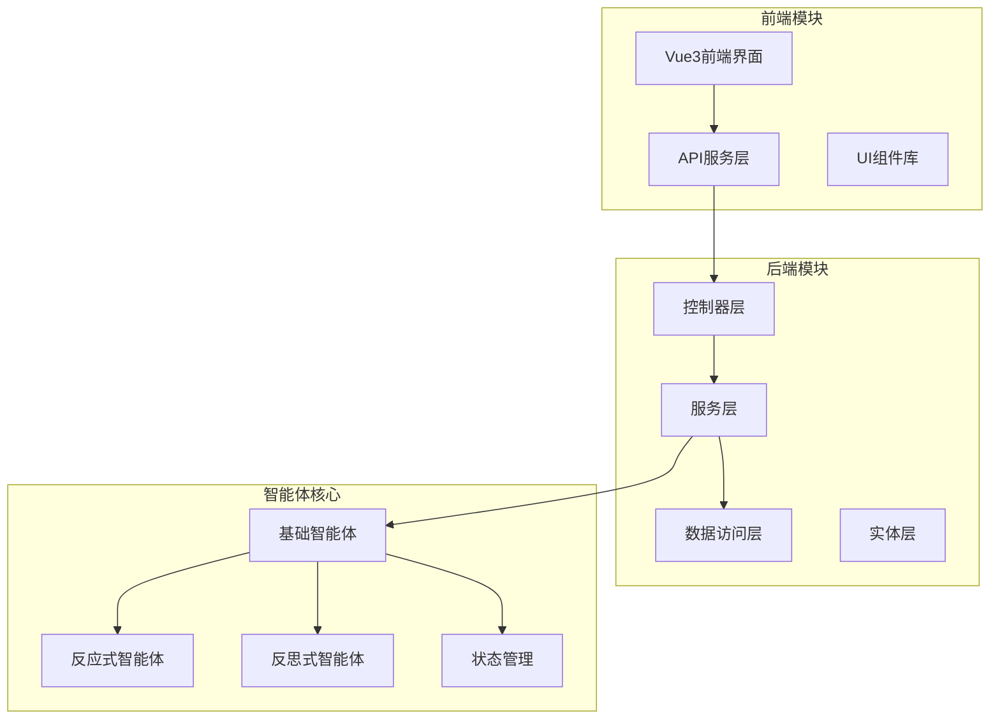
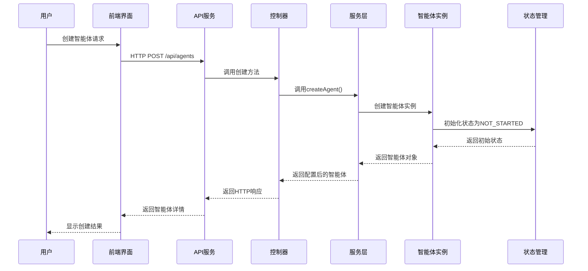
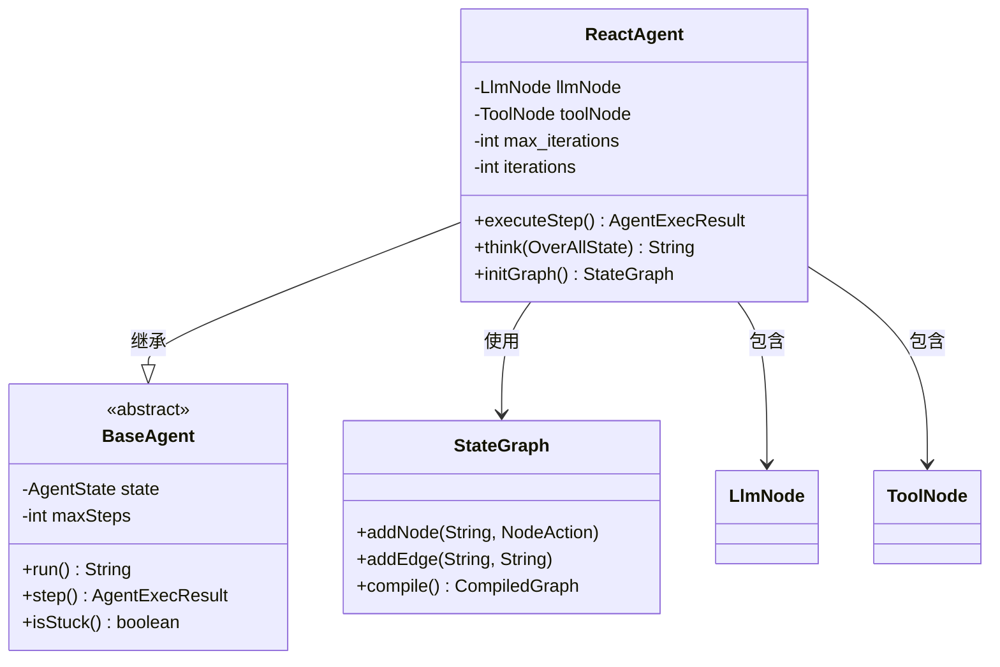
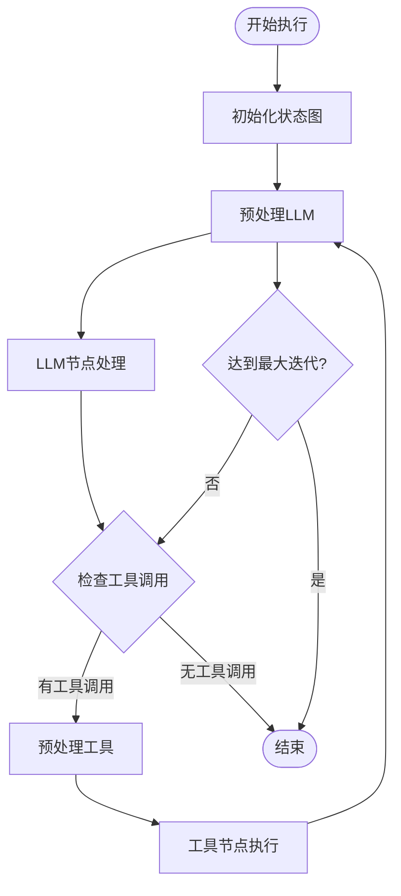
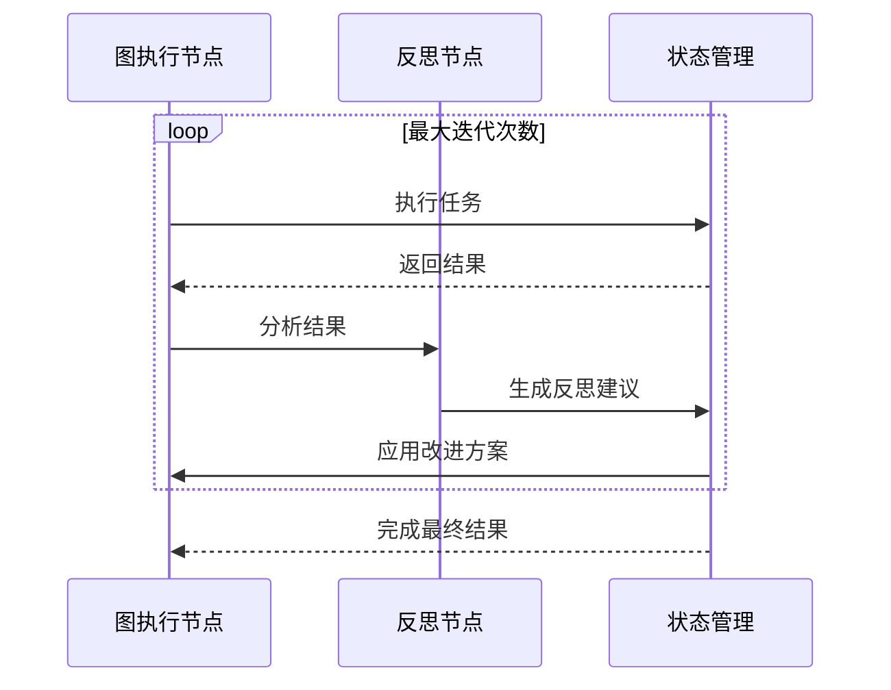
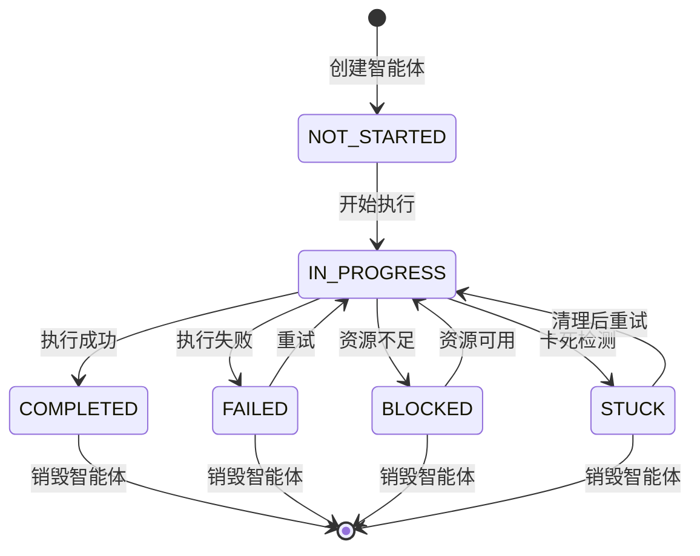
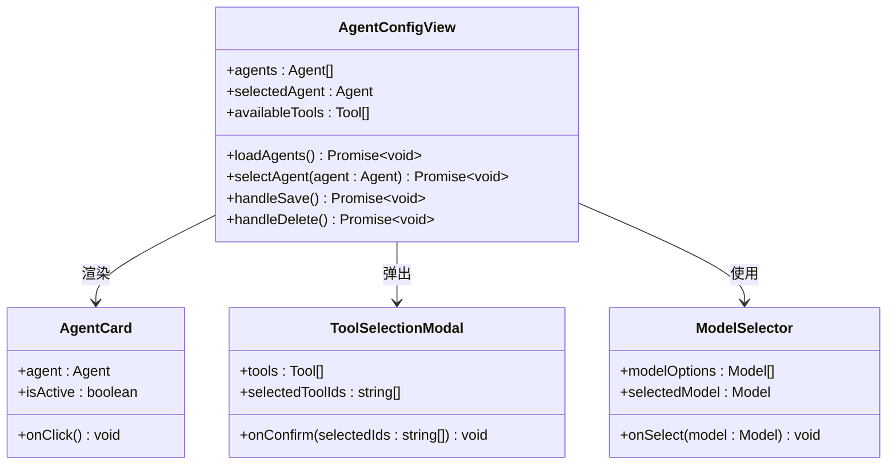
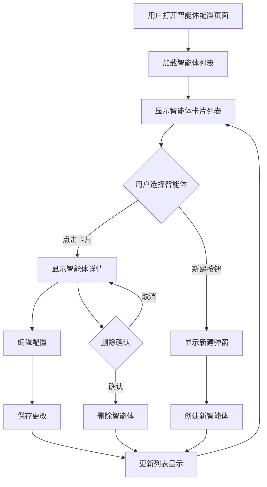
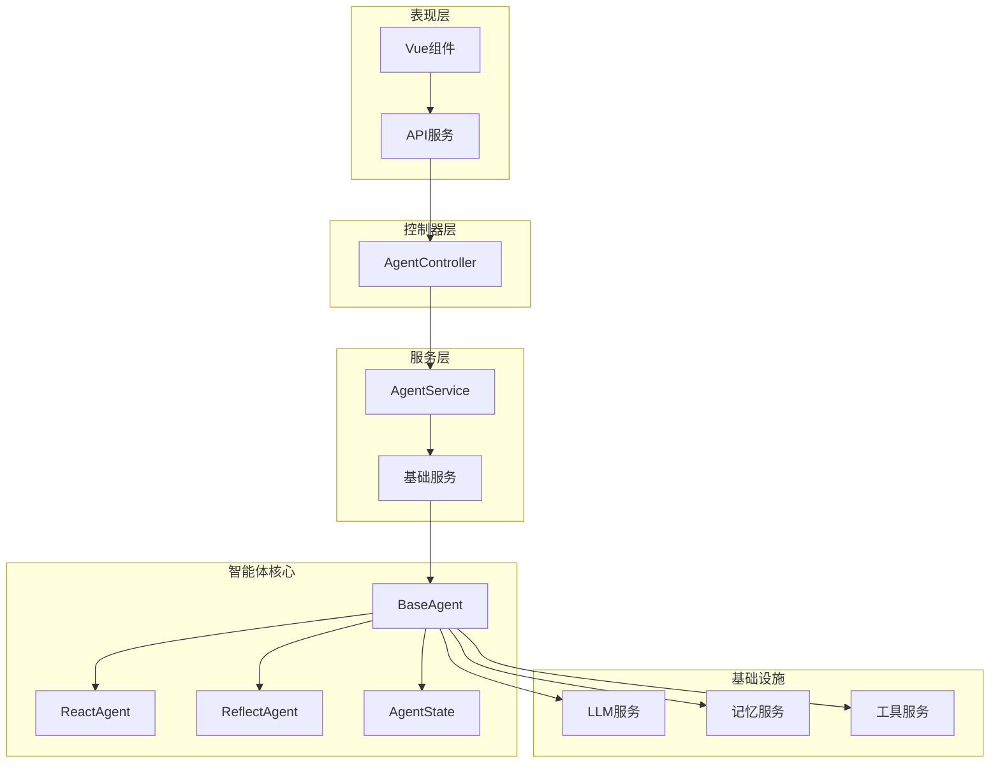

# 智能体管理

<cite>
**本文档引用的文件**
- [BaseAgent.java](file://spring-ai-alibaba-jmanus/src/main/java/com/alibaba/cloud/ai/manus/agent/BaseAgent.java)
- [AgentService.java](file://spring-ai-alibaba-jmanus/src/main/java/com/alibaba/cloud/ai/manus/agent/service/AgentService.java)
- [AgentController.java](file://spring-ai-alibaba-jmanus/src/main/java/com/alibaba/cloud/ai/manus/agent/controller/AgentController.java)
- [ReactAgent.java](file://spring-ai-alibaba-graph-core/src/main/java/com/alibaba/cloud/ai/graph/agent/ReactAgent.java)
- [ReflectAgent.java](file://spring-ai-alibaba-graph-core/src/main/java/com/alibaba/cloud/ai/graph/agent/ReflectAgent.java)
- [agentConfig.vue](file://spring-ai-alibaba-jmanus/ui-vue3/src/views/configs/agentConfig.vue)
- [agent-api-service.ts](file://spring-ai-alibaba-jmanus/ui-vue3/src/api/agent-api-service.ts)
- [AgentState.java](file://spring-ai-alibaba-jmanus/src/main/java/com/alibaba/cloud/ai/manus/agent/AgentState.java)
</cite>

## 目录
1. [简介](#简介)
2. [项目结构](#项目结构)
3. [核心组件](#核心组件)
4. [架构概览](#架构概览)
5. [详细组件分析](#详细组件分析)
6. [依赖关系分析](#依赖关系分析)
7. [性能考虑](#性能考虑)
8. [故障排除指南](#故障排除指南)
9. [结论](#结论)

## 简介

JManus平台是一个基于Spring AI Alibaba的企业级智能体管理系统，提供了完整的智能体生命周期管理功能。该系统支持多种类型的智能体（如ReactAgent、ReflectAgent），并提供了丰富的REST API接口和直观的前端用户界面，使用户能够轻松创建、配置、启动、暂停和销毁智能体。

智能体管理系统的核心特性包括：
- 支持多种智能体类型和行为模式
- 完整的生命周期管理
- 状态机驱动的状态管理
- 工具集成和会话持久化
- 前后端分离的架构设计
- 多语言支持和国际化

## 项目结构

JManus平台采用模块化的微服务架构，主要包含以下核心模块：



**图表来源**
- [BaseAgent.java](file://spring-ai-alibaba-jmanus/src/main/java/com/alibaba/cloud/ai/manus/agent/BaseAgent.java#L1-L50)
- [AgentController.java](file://spring-ai-alibaba-jmanus/src/main/java/com/alibaba/cloud/ai/manus/agent/controller/AgentController.java#L1-L30)

**章节来源**
- [BaseAgent.java](file://spring-ai-alibaba-jmanus/src/main/java/com/alibaba/cloud/ai/manus/agent/BaseAgent.java#L1-L100)
- [AgentController.java](file://spring-ai-alibaba-jmanus/src/main/java/com/alibaba/cloud/ai/manus/agent/controller/AgentController.java#L1-L92)

## 核心组件

### BaseAgent - 基础智能体抽象类

BaseAgent是所有智能体的核心抽象类，提供了智能体生命周期管理的基础框架：

```java
public abstract class BaseAgent {
    private AgentState state = AgentState.NOT_STARTED;
    private int maxSteps;
    private int currentStep = 0;
    
    protected abstract AgentExecResult step();
    protected abstract Message getNextStepWithEnvMessage();
}
```

核心功能包括：
- **状态管理**：维护智能体的运行状态（未开始、进行中、已完成、阻塞、失败）
- **步骤限制**：防止无限循环执行
- **内存管理**：自动清理执行历史
- **异常处理**：检测和处理卡死状态

### AgentService - 智能体服务接口

AgentService定义了智能体管理的核心业务逻辑：

```java
public interface AgentService {
    List<AgentConfig> getAllAgentsByNamespace(String namespace);
    AgentConfig getAgentById(String id);
    AgentConfig createAgent(AgentConfig agentConfig);
    AgentConfig updateAgent(AgentConfig agentConfig);
    void deleteAgent(String id);
    List<Tool> getAvailableTools();
    BaseAgent createDynamicBaseAgent(...);
}
```

**章节来源**
- [BaseAgent.java](file://spring-ai-alibaba-jmanus/src/main/java/com/alibaba/cloud/ai/manus/agent/BaseAgent.java#L50-L150)
- [AgentService.java](file://spring-ai-alibaba-jmanus/src/main/java/com/alibaba/cloud/ai/manus/agent/service/AgentService.java#L20-L65)

## 架构概览

JManus智能体管理系统采用分层架构设计，确保了系统的可扩展性和可维护性：



**图表来源**
- [AgentController.java](file://spring-ai-alibaba-jmanus/src/main/java/com/alibaba/cloud/ai/manus/agent/controller/AgentController.java#L50-L70)
- [agent-api-service.ts](file://spring-ai-alibaba-jmanus/ui-vue3/src/api/agent-api-service.ts#L101-L139)

## 详细组件分析

### ReactAgent - 反应式智能体

ReactAgent实现了经典的"思考-行动"循环模式，是最常用的智能体类型：



**图表来源**
- [ReactAgent.java](file://spring-ai-alibaba-graph-core/src/main/java/com/alibaba/cloud/ai/graph/agent/ReactAgent.java#L50-L100)
- [BaseAgent.java](file://spring-ai-alibaba-jmanus/src/main/java/com/alibaba/cloud/ai/manus/agent/BaseAgent.java#L50-L100)

ReactAgent的核心执行流程：



**图表来源**
- [ReactAgent.java](file://spring-ai-alibaba-graph-core/src/main/java/com/alibaba/cloud/ai/graph/agent/ReactAgent.java#L120-L180)

### ReflectAgent - 反思式智能体

ReflectAgent提供了自我反思和改进的能力，适用于需要高质量输出的任务：

```java
public class ReflectAgent {
    private NodeAction graph;
    private NodeAction reflection;
    private int maxIterations;
    
    public String graphCount(OverAllState state) throws Exception {
        Integer iterationNum = (Integer) state.value(ITERATION_NUM).orElse(0);
        if (iterationNum >= maxIterations) {
            return END; // 达到最大迭代次数，停止
        }
        state.updateState(Map.of(ITERATION_NUM, iterationNum + 1));
        return REFLECTION_NODE_ID; // 进入反思阶段
    }
}
```

反思式智能体的工作流程：



**图表来源**
- [ReflectAgent.java](file://spring-ai-alibaba-graph-core/src/main/java/com/alibaba/cloud/ai/graph/agent/ReflectAgent.java#L150-L200)

### AgentState - 状态机设计

智能体状态机定义了智能体的生命周期状态转换：



**图表来源**
- [AgentState.java](file://spring-ai-alibaba-jmanus/src/main/java/com/alibaba/cloud/ai/manus/agent/AgentState.java#L20-L35)

**章节来源**
- [ReactAgent.java](file://spring-ai-alibaba-graph-core/src/main/java/com/alibaba/cloud/ai/graph/agent/ReactAgent.java#L1-L200)
- [ReflectAgent.java](file://spring-ai-alibaba-graph-core/src/main/java/com/alibaba/cloud/ai/graph/agent/ReflectAgent.java#L1-L150)
- [AgentState.java](file://spring-ai-alibaba-jmanus/src/main/java/com/alibaba/cloud/ai/manus/agent/AgentState.java#L1-L35)

### REST API接口规范

系统提供了完整的REST API接口用于智能体管理：

#### 智能体管理API

| 方法 | 路径 | 描述 |
|------|------|------|
| GET | `/api/agents` | 获取命名空间下的所有智能体 |
| GET | `/api/agents/{id}` | 获取指定ID的智能体详情 |
| POST | `/api/agents` | 创建新的智能体 |
| PUT | `/api/agents/{id}` | 更新现有智能体 |
| DELETE | `/api/agents/{id}` | 删除指定ID的智能体 |
| GET | `/api/agents/tools` | 获取可用工具列表 |

#### 请求/响应格式

**创建智能体请求示例：**
```json
{
  "name": "数据分析助手",
  "description": "负责数据清洗和分析的智能体",
  "nextStepPrompt": "请分析提供的数据集并生成报告",
  "availableTools": ["data_cleaning", "visualization"],
  "model": {
    "type": "openai",
    "modelName": "gpt-4"
  }
}
```

**响应格式：**
```json
{
  "id": "agent_001",
  "name": "数据分析助手",
  "description": "负责数据清洗和分析的智能体",
  "status": "active",
  "createdTime": "2024-01-15T10:30:00Z",
  "updatedTime": "2024-01-15T10:30:00Z"
}
```

#### 错误处理

API遵循统一的错误处理规范：

```typescript
// 错误响应格式
interface ErrorResponse {
  code: number;
  message: string;
  timestamp: string;
}

// 示例错误响应
{
  "code": 400,
  "message": "Invalid agent configuration",
  "timestamp": "2024-01-15T10:30:00Z"
}
```

**章节来源**
- [AgentController.java](file://spring-ai-alibaba-jmanus/src/main/java/com/alibaba/cloud/ai/manus/agent/controller/AgentController.java#L40-L92)
- [agent-api-service.ts](file://spring-ai-alibaba-jmanus/ui-vue3/src/api/agent-api-service.ts#L51-L194)

### 前端UI组件

前端采用Vue3+TypeScript技术栈，提供了直观的智能体管理界面：

#### 主要UI组件



**图表来源**
- [agentConfig.vue](file://spring-ai-alibaba-jmanus/ui-vue3/src/views/configs/agentConfig.vue#L1-L100)

#### 用户操作流程



**图表来源**
- [agentConfig.vue](file://spring-ai-alibaba-jmanus/ui-vue3/src/views/configs/agentConfig.vue#L400-L500)

**章节来源**
- [agentConfig.vue](file://spring-ai-alibaba-jmanus/ui-vue3/src/views/configs/agentConfig.vue#L1-L200)
- [agent-api-service.ts](file://spring-ai-alibaba-jmanus/ui-vue3/src/api/agent-api-service.ts#L1-L100)

## 依赖关系分析

智能体管理系统的依赖关系体现了清晰的分层架构：



**图表来源**
- [BaseAgent.java](file://spring-ai-alibaba-jmanus/src/main/java/com/alibaba/cloud/ai/manus/agent/BaseAgent.java#L1-L50)
- [AgentController.java](file://spring-ai-alibaba-jmanus/src/main/java/com/alibaba/cloud/ai/manus/agent/controller/AgentController.java#L1-L30)

**章节来源**
- [BaseAgent.java](file://spring-ai-alibaba-jmanus/src/main/java/com/alibaba/cloud/ai/manus/agent/BaseAgent.java#L300-L393)
- [AgentService.java](file://spring-ai-alibaba-jmanus/src/main/java/com/alibaba/cloud/ai/manus/agent/service/AgentService.java#L1-L65)

## 性能考虑

### 内存管理

智能体系统实现了多层次的内存管理策略：

1. **智能体内存清理**：每次执行完成后自动清理历史记录
2. **工具调用优化**：避免重复的工具调用
3. **状态压缩**：定期压缩长期运行的智能体状态

### 并发处理

系统支持并发智能体执行，通过以下机制保证线程安全：
- 不可变数据结构
- 状态锁机制
- 异步执行队列

### 缓存策略

- 智能体配置缓存
- 工具列表缓存
- 模型参数缓存

## 故障排除指南

### 常见问题及解决方案

#### 智能体卡死问题

**症状**：智能体长时间无响应，无法继续执行
**原因**：工具调用缺失或LLM响应异常
**解决**：系统自动检测卡死状态，触发清理机制

#### 状态同步问题

**症状**：智能体状态不一致
**原因**：并发操作导致状态冲突
**解决**：使用乐观锁机制，重试失败的操作

#### 工具调用失败

**症状**：智能体无法正确调用工具
**原因**：工具配置错误或权限不足
**解决**：验证工具配置，检查权限设置

**章节来源**
- [BaseAgent.java](file://spring-ai-alibaba-jmanus/src/main/java/com/alibaba/cloud/ai/manus/agent/BaseAgent.java#L250-L300)

## 结论

JManus平台的智能体管理系统提供了一个完整、灵活且易于使用的智能体生命周期管理解决方案。通过模块化的架构设计、丰富的API接口和直观的用户界面，系统能够满足企业级应用的各种需求。

### 主要优势

1. **多样化智能体类型**：支持ReactAgent和ReflectAgent等多种智能体类型
2. **完整的生命周期管理**：从创建到销毁的全流程管理
3. **强大的状态管理**：基于状态机的设计确保系统稳定性
4. **前后端分离架构**：便于维护和扩展
5. **多语言支持**：国际化友好设计

### 未来发展方向

1. **增强AI能力**：集成更多先进的AI模型和算法
2. **扩展工具生态**：支持更多第三方工具和服务
3. **优化性能**：提升大规模并发处理能力
4. **增强安全性**：加强访问控制和数据保护

该系统为企业提供了构建智能应用的强大基础，是现代AI应用开发的理想选择。