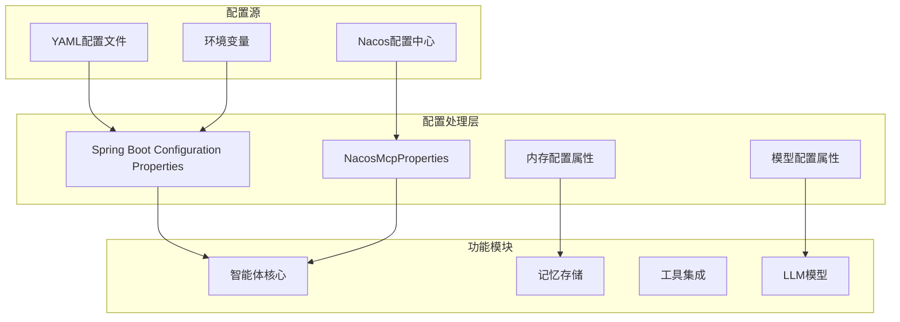
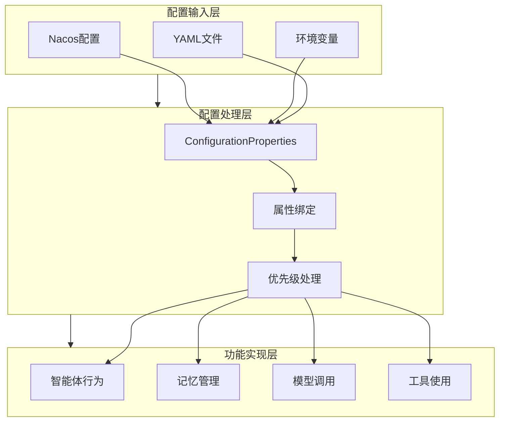
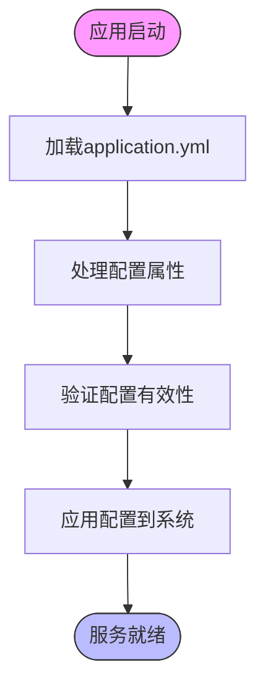
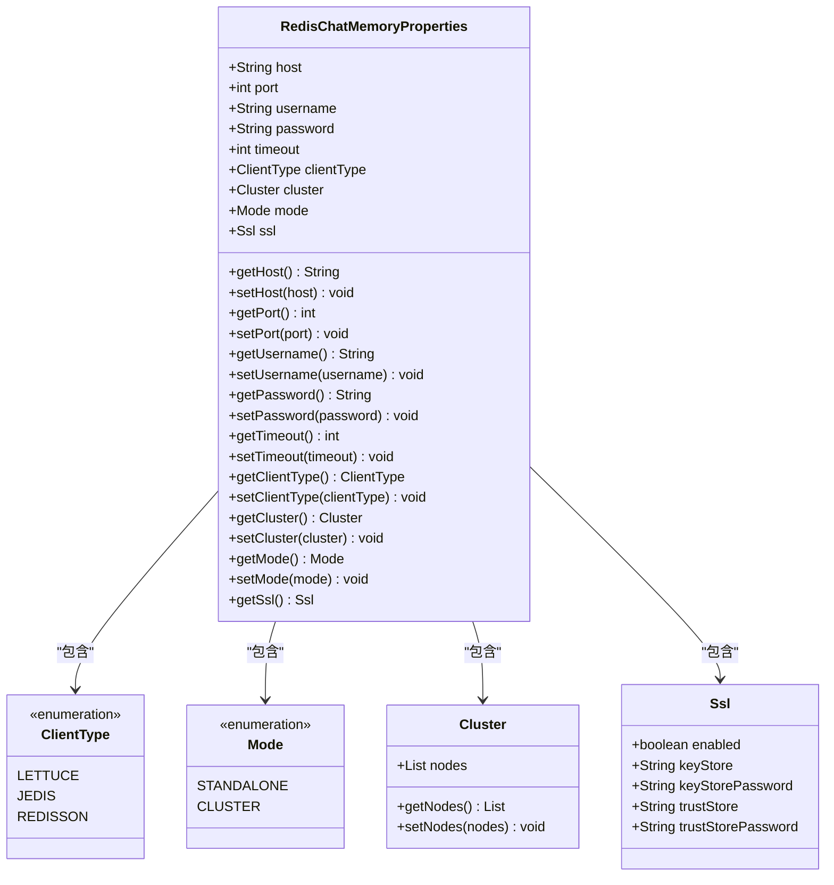
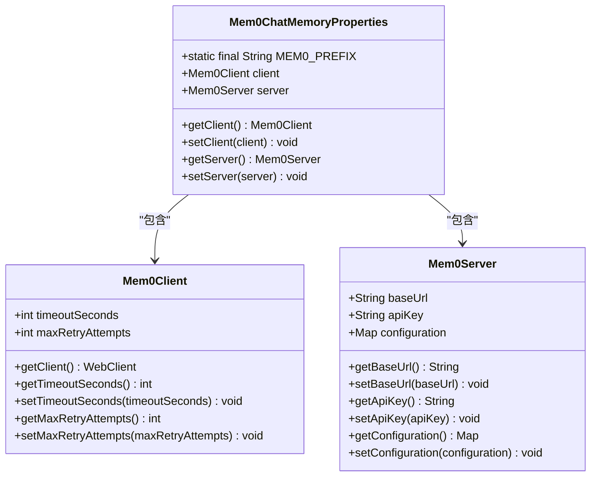
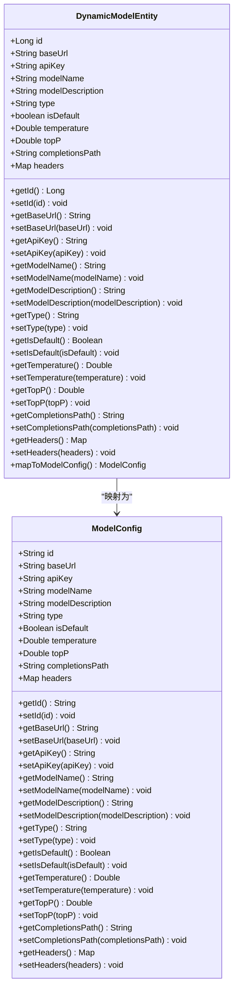
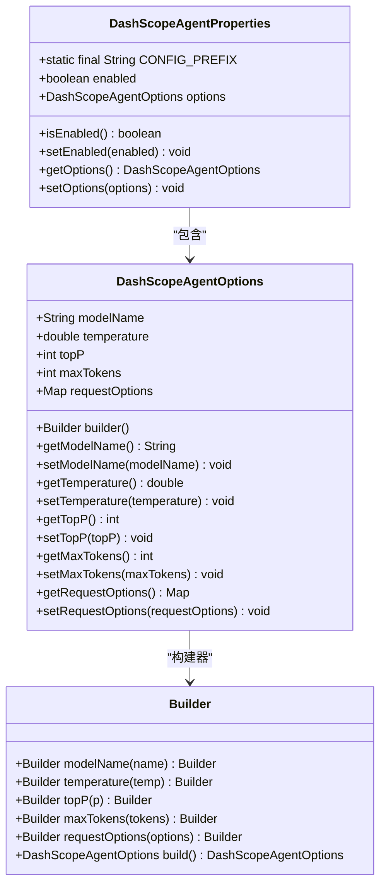
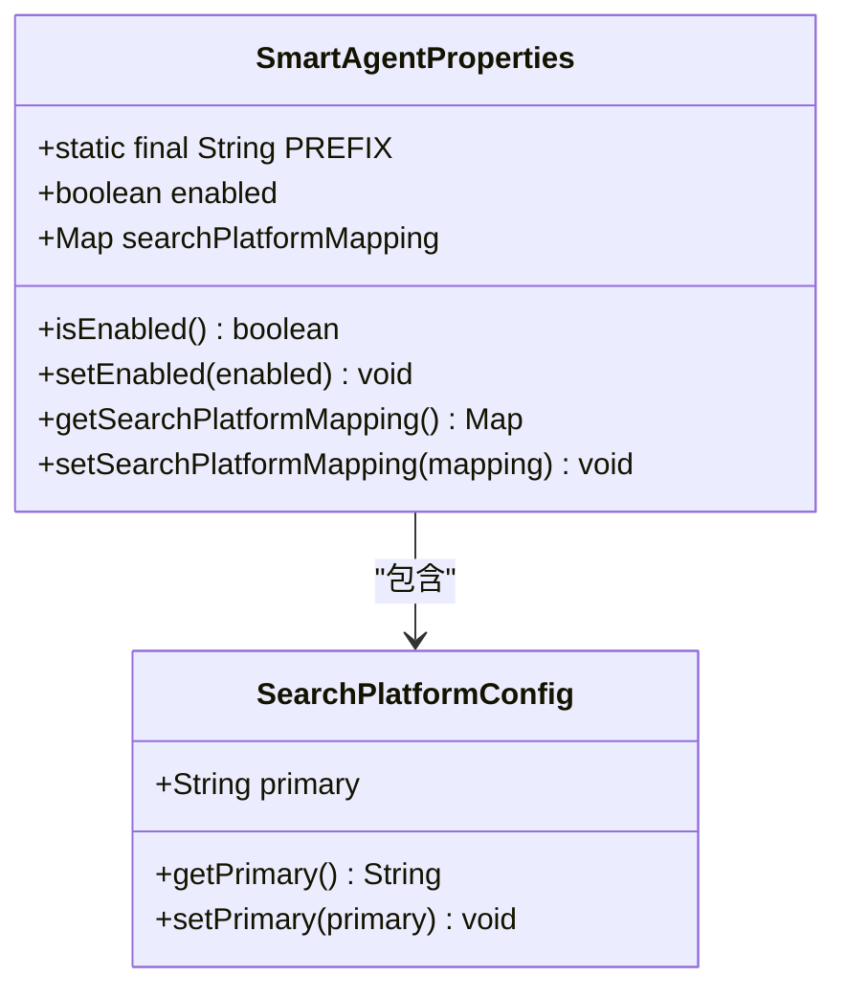
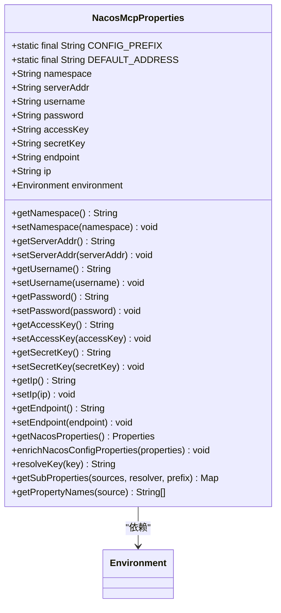
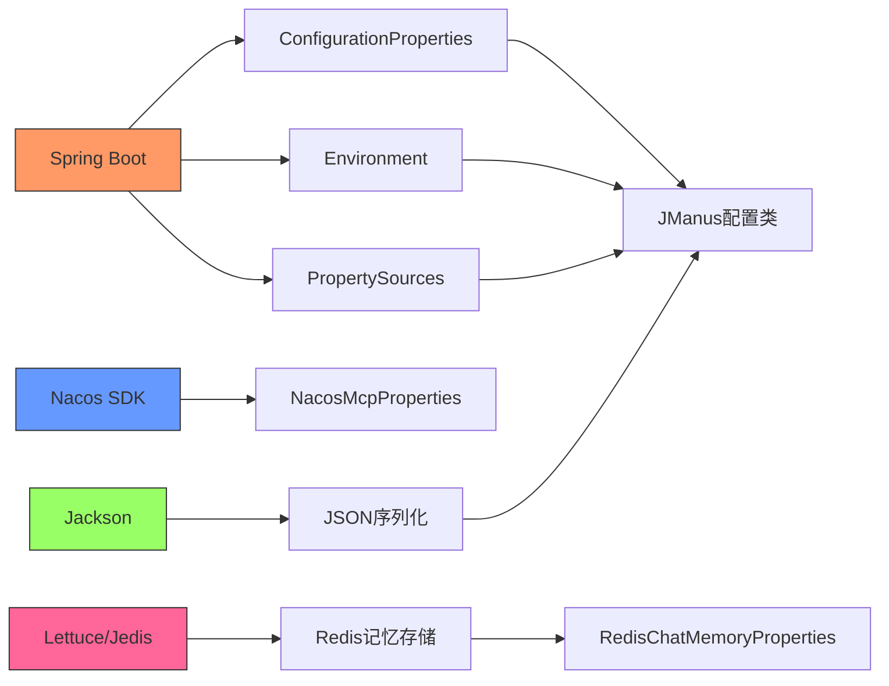

# 智能体配置

<cite>
**本文档引用的文件**
- [application.yml](file://spring-ai-alibaba-jmanus/src/main/resources/application.yml)
- [NacosMcpProperties.java](file://spring-ai-alibaba-mcp/spring-ai-alibaba-mcp-common/src/main/java/com/alibaba/cloud/ai/mcp/nacos/NacosMcpProperties.java)
- [RedisChatMemoryProperties.java](file://auto-configurations/spring-ai-alibaba-autoconfigure-memory/src/main/java/com/alibaba/cloud/ai/autoconfigure/memory/redis/RedisChatMemoryProperties.java)
- [Mem0ChatMemoryProperties.java](file://auto-configurations/spring-ai-alibaba-autoconfigure-memory-long/src/main/java/com/alibaba/cloud/ai/autoconfigure/memory/Mem0ChatMemoryProperties.java)
- [DashScopeAgentProperties.java](file://auto-configurations/spring-ai-alibaba-autoconfigure-dashscope/src/main/java/com/alibaba/cloud/ai/autoconfigure/dashscope/DashScopeAgentProperties.java)
- [SmartAgentProperties.java](file://spring-ai-alibaba-deepresearch/src/main/java/com/alibaba/cloud/ai/example/deepresearch/config/SmartAgentProperties.java)
- [DynamicModelEntity.java](file://spring-ai-alibaba-jmanus/src/main/java/com/alibaba/cloud/ai/manus/model/entity/DynamicModelEntity.java)
</cite>

## 目录
1. [引言](#引言)
2. [项目结构](#项目结构)
3. [核心组件](#核心组件)
4. [架构概述](#架构概述)
5. [详细组件分析](#详细组件分析)
6. [依赖分析](#依赖分析)
7. [性能考虑](#性能考虑)
8. [故障排除指南](#故障排除指南)
9. [结论](#结论)

## 引言
JManus平台提供了一套完整的智能体配置体系，支持通过YAML文件、环境变量和Nacos配置中心等多种方式管理智能体的各项参数。本文档深入解析了该配置系统的架构设计、关键配置项、加载机制和最佳实践。

## 项目结构
JManus平台的智能体配置功能分布在多个模块中，形成了一个分层的配置管理体系：

**图示来源**
- [application.yml](file://spring-ai-alibaba-jmanus/src/main/resources/application.yml)
- [NacosMcpProperties.java](file://spring-ai-alibaba-mcp/spring-ai-alibaba-mcp-common/src/main/java/com/alibaba/cloud/ai/mcp/nacos/NacosMcpProperties.java)

**章节来源**
- [application.yml](file://spring-ai-alibaba-jmanus/src/main/resources/application.yml)
- [NacosMcpProperties.java](file://spring-ai-alibaba-mcp/spring-ai-alibaba-mcp-common/src/main/java/com/alibaba/cloud/ai/mcp/nacos/NacosMcpProperties.java)

## 核心组件
JManus平台的智能体配置系统由几个核心组件构成：基础配置、记忆存储配置、模型配置和工具集成配置。这些组件共同定义了智能体的行为特征和能力范围。

**章节来源**
- [application.yml](file://spring-ai-alibaba-jmanus/src/main/resources/application.yml)
- [NacosMcpProperties.java](file://spring-ai-alibaba-mcp/spring-ai-alibaba-mcp-common/src/main/java/com/alibaba/cloud/ai/mcp/nacos/NacosMcpProperties.java)

## 架构概述
JManus平台采用分层的配置架构，将不同类型的配置分离管理，同时保持良好的集成性：

**图示来源**
- [NacosMcpProperties.java](file://spring-ai-alibaba-mcp/spring-ai-alibaba-mcp-common/src/main/java/com/alibaba/cloud/ai/mcp/nacos/NacosMcpProperties.java)
- [RedisChatMemoryProperties.java](file://auto-configurations/spring-ai-alibaba-autoconfigure-memory/src/main/java/com/alibaba/cloud/ai/autoconfigure/memory/redis/RedisChatMemoryProperties.java)

## 详细组件分析

### 基础配置分析
JManus平台的基础配置主要通过YAML文件进行管理，定义了服务器端口、数据源、日志等基本设置。

**图示来源**
- [application.yml](file://spring-ai-alibaba-jmanus/src/main/resources/application.yml)

**章节来源**
- [application.yml](file://spring-ai-alibaba-jmanus/src/main/resources/application.yml)

### 记忆存储配置分析
记忆存储配置是智能体的重要组成部分，支持多种存储后端，包括Redis和Mem0等。

#### Redis记忆存储配置

**图示来源**
- [RedisChatMemoryProperties.java](file://auto-configurations/spring-ai-alibaba-autoconfigure-memory/src/main/java/com/alibaba/cloud/ai/autoconfigure/memory/redis/RedisChatMemoryProperties.java)

#### Mem0记忆存储配置

**图示来源**
- [Mem0ChatMemoryProperties.java](file://auto-configurations/spring-ai-alibaba-autoconfigure-memory-long/src/main/java/com/alibaba/cloud/ai/autoconfigure/memory/Mem0ChatMemoryProperties.java)

**章节来源**
- [RedisChatMemoryProperties.java](file://auto-configurations/spring-ai-alibaba-autoconfigure-memory/src/main/java/com/alibaba/cloud/ai/autoconfigure/memory/redis/RedisChatMemoryProperties.java)
- [Mem0ChatMemoryProperties.java](file://auto-configurations/spring-ai-alibaba-autoconfigure-memory-long/src/main/java/com/alibaba/cloud/ai/autoconfigure/memory/Mem0ChatMemoryProperties.java)

### 模型配置分析
模型配置定义了智能体使用的LLM模型参数，支持动态创建和管理。

#### 模型实体配置

**图示来源**
- [DynamicModelEntity.java](file://spring-ai-alibaba-jmanus/src/main/java/com/alibaba/cloud/ai/manus/model/entity/DynamicModelEntity.java)

**章节来源**
- [DynamicModelEntity.java](file://spring-ai-alibaba-jmanus/src/main/java/com/alibaba/cloud/ai/manus/model/entity/DynamicModelEntity.java)

### 智能体行为配置分析
智能体行为配置定义了智能体的核心功能和特性。

#### DashScope智能体配置

**图示来源**
- [DashScopeAgentProperties.java](file://auto-configurations/spring-ai-alibaba-autoconfigure-dashscope/src/main/java/com/alibaba/cloud/ai/autoconfigure/dashscope/DashScopeAgentProperties.java)

#### SmartAgent智能体配置

**图示来源**
- [SmartAgentProperties.java](file://spring-ai-alibaba-deepresearch/src/main/java/com/alibaba/cloud/ai/example/deepresearch/config/SmartAgentProperties.java)

**章节来源**
- [DashScopeAgentProperties.java](file://auto-configurations/spring-ai-alibaba-autoconfigure-dashscope/src/main/java/com/alibaba/cloud/ai/autoconfigure/dashscope/DashScopeAgentProperties.java)
- [SmartAgentProperties.java](file://spring-ai-alibaba-deepresearch/src/main/java/com/alibaba/cloud/ai/example/deepresearch/config/SmartAgentProperties.java)

### Nacos配置分析
Nacos作为分布式配置中心，在JManus平台中扮演着重要角色。

#### Nacos MCP 配置

**图示来源**
- [NacosMcpProperties.java](file://spring-ai-alibaba-mcp/spring-ai-alibaba-mcp-common/src/main/java/com/alibaba/cloud/ai/mcp/nacos/NacosMcpProperties.java)

**章节来源**
- [NacosMcpProperties.java](file://spring-ai-alibaba-mcp/spring-ai-alibaba-mcp-common/src/main/java/com/alibaba/cloud/ai/mcp/nacos/NacosMcpProperties.java)

## 依赖分析
JManus平台的配置系统依赖于多个Spring Boot和阿里巴巴云的技术组件：

**图示来源**
- [NacosMcpProperties.java](file://spring-ai-alibaba-mcp/spring-ai-alibaba-mcp-common/src/main/java/com/alibaba/cloud/ai/mcp/nacos/NacosMcpProperties.java)
- [RedisChatMemoryProperties.java](file://auto-configurations/spring-ai-alibaba-autoconfigure-memory/src/main/java/com/alibaba/cloud/ai/autoconfigure/memory/redis/RedisChatMemoryProperties.java)

**章节来源**
- [NacosMcpProperties.java](file://spring-ai-alibaba-mcp/spring-ai-alibaba-mcp-common/src/main/java/com/alibaba/cloud/ai/mcp/nacos/NacosMcpProperties.java)
- [RedisChatMemoryProperties.java](file://auto-configurations/spring-ai-alibaba-autoconfigure-memory/src/main/java/com/alibaba/cloud/ai/autoconfigure/memory/redis/RedisChatMemoryProperties.java)

## 性能考虑
在配置JManus平台的智能体时，需要考虑以下性能因素：
- 记忆存储的选择对响应时间有显著影响，Redis通常比数据库存储更快
- 模型的temperature和topP参数会影响生成质量和响应速度
- Nacos配置中心的网络延迟可能影响配置加载时间
- 大量的工具集成会增加智能体的初始化时间

## 故障排除指南
当遇到配置相关问题时，可以按照以下步骤进行排查：

1. **检查配置文件语法**：确保YAML文件格式正确，没有缩进错误
2. **验证配置前缀**：确认@ConfigurationProperties的prefix设置正确
3. **检查环境变量**：确保环境变量名称与配置属性匹配
4. **查看日志输出**：检查应用启动日志中的配置加载信息
5. **测试Nacos连接**：如果使用Nacos，确保网络连接正常且凭据正确

**章节来源**
- [application.yml](file://spring-ai-alibaba-jmanus/src/main/resources/application.yml)
- [NacosMcpProperties.java](file://spring-ai-alibaba-mcp/spring-ai-alibaba-mcp-common/src/main/java/com/alibaba/cloud/ai/mcp/nacos/NacosMcpProperties.java)

## 结论
JManus平台的智能体配置系统设计合理，支持多种配置方式和存储后端。通过YAML文件、环境变量和Nacos配置中心的组合使用，可以灵活地管理智能体的各项参数。建议在生产环境中使用Nacos作为主要配置源，以实现配置的集中管理和动态更新。