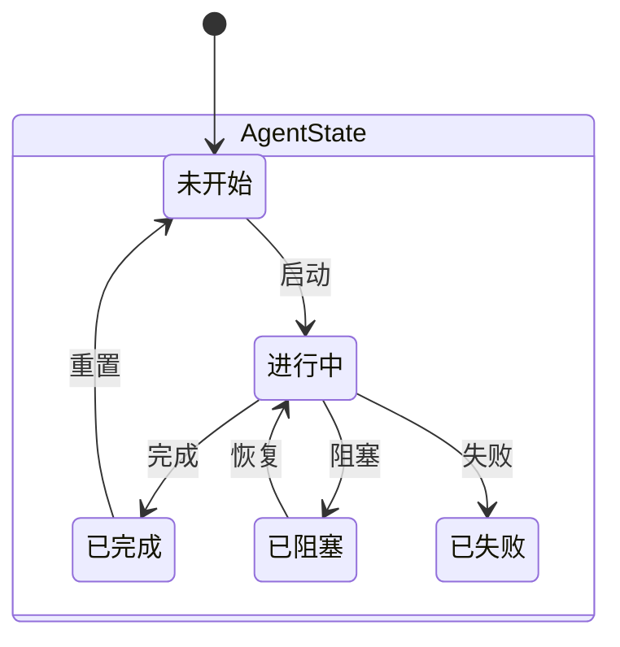
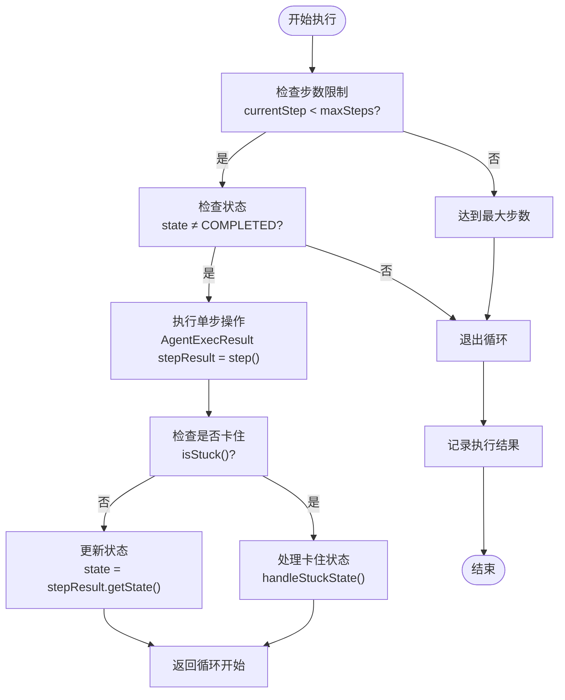
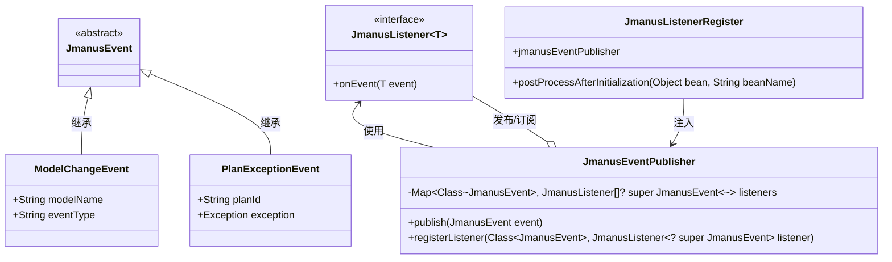
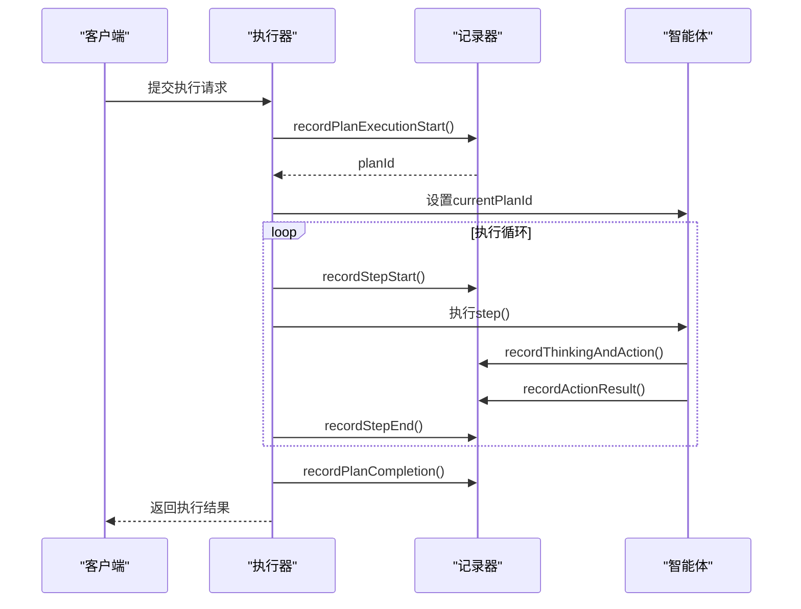

# 生命周期管理

<cite>
**本文档引用的文件**
- [AgentState.java](file://spring-ai-alibaba-jmanus/src/main/java/com/alibaba/cloud/ai/manus/agent/AgentState.java)
- [BaseAgent.java](file://spring-ai-alibaba-jmanus/src/main/java/com/alibaba/cloud/ai/manus/agent/BaseAgent.java)
- [DynamicAgent.java](file://spring-ai-alibaba-jmanus/src/main/java/com/alibaba/cloud/ai/manus/agent/DynamicAgent.java)
- [PlanExecutionRecorder.java](file://spring-ai-alibaba-jmanus/src/main/java/com/alibaba/cloud/ai/manus/recorder/service/PlanExecutionRecorder.java)
- [PlanIdDispatcher.java](file://spring-ai-alibaba-jmanus/src/main/java/com/alibaba/cloud/ai/manus/runtime/service/PlanIdDispatcher.java)
- [StartupAgentConfigLoader.java](file://spring-ai-alibaba-jmanus/src/main/java/com/alibaba/cloud/ai/manus/agent/startupAgent/StartupAgentConfigLoader.java)
- [JmanusEventPublisher.java](file://spring-ai-alibaba-jmanus/src/main/java/com/alibaba/cloud/ai/manus/event/JmanusEventPublisher.java)
- [PlanException.java](file://spring-ai-alibaba-jmanus/src/main/java/com/alibaba/cloud/ai/manus/exception/PlanException.java)
</cite>

## 目录
1. [引言](#引言)
2. [智能体生命周期状态](#智能体生命周期状态)
3. [核心组件与架构](#核心组件与架构)
4. [生命周期阶段详解](#生命周期阶段详解)
5. [事件系统与监听机制](#事件系统与监听机制)
6. [异常处理与故障恢复](#异常处理与故障恢复)
7. [监控与执行记录](#监控与执行记录)
8. [编程接口示例](#编程接口示例)
9. [结论](#结论)

## 引言

JManus平台中的智能体生命周期管理是整个系统的核心功能之一，它负责管理智能体从创建到销毁的完整过程。本文档全面阐述了智能体在JManus平台中的生命周期管理机制，包括初始化、启动、运行、暂停、恢复和终止等各个阶段的状态转换机制。

通过分析代码库，我们发现JManus平台采用了一套完整的面向对象设计模式来实现智能体的生命周期管理。系统基于`BaseAgent`抽象基类构建，所有具体类型的智能体都继承自该基类，并实现了统一的状态管理和执行流程。智能体的生命周期被划分为多个明确的状态，通过状态机模式进行管理，确保了系统的稳定性和可预测性。

本文档将深入探讨每个生命周期阶段的内部处理流程、事件触发机制和资源管理策略，解释异常处理和故障恢复机制，以及如何监控智能体的运行状态，并提供实际代码示例展示生命周期管理的编程接口使用方法。

## 智能体生命周期状态

JManus平台中的智能体生命周期由`AgentState`枚举类定义，该类位于`com.alibaba.cloud.ai.manus.agent.AgentState`中，定义了智能体可能处于的各种状态：



**状态说明：**

- **NOT_STARTED (未开始)**：智能体已创建但尚未开始执行的状态。这是智能体的初始状态。
- **IN_PROGRESS (进行中)**：智能体正在执行任务的状态。在此状态下，智能体会按照预设的逻辑进行思考和行动。
- **COMPLETED (已完成)**：智能体成功完成所有任务的状态。当智能体达到目标或主动终止时进入此状态。
- **BLOCKED (已阻塞)**：智能体因等待外部输入或其他条件而暂时无法继续执行的状态。
- **FAILED (已失败)**：智能体在执行过程中遇到不可恢复的错误而失败的状态。

这些状态通过`toString()`方法返回对应的字符串表示（如"not_started"、"in_progress"等），便于日志记录和状态持久化。

**状态转换规则：**

智能体的状态转换遵循严格的规则：
1. 只有在`NOT_STARTED`状态下的智能体才能被启动
2. `IN_PROGRESS`状态可以转换为`COMPLETED`、`BLOCKED`或`FAILED`
3. `BLOCKED`状态可以通过外部事件恢复为`IN_PROGRESS`
4. `COMPLETED`和`FAILED`是最终状态，通常需要重新初始化才能再次执行

这种状态管理模式确保了智能体行为的可预测性和系统的稳定性。

**Section sources**
- [AgentState.java](file://spring-ai-alibaba-jmanus/src/main/java/com/alibaba/cloud/ai/manus/agent/AgentState.java#L0-L33)

## 核心组件与架构

JManus平台的智能体生命周期管理依赖于一组核心组件，这些组件协同工作以实现完整的生命周期管理功能。系统架构采用了分层设计模式，各组件职责分明，松耦合高内聚。

### 主要组件关系

```mermaid
classDiagram
class BaseAgent {
+String currentPlanId
+String rootPlanId
+AgentState state
+ILlmService llmService
+ManusProperties manusProperties
+PromptService promptService
+ExecutionStep step
+PlanIdDispatcher planIdDispatcher
+int maxSteps
+int currentStep
+Map~String, Object~ initSettingData
+Map~String, Object~ envData
+PlanExecutionRecorder planExecutionRecorder
+abstract String getName()
+abstract String getDescription()
+abstract Message getThinkMessage()
+abstract Message getNextStepWithEnvMessage()
+abstract ToolCallback[] getToolCallList()
+abstract ToolCallBackContext getToolCallBackContext(String toolKey)
+abstract AgentExecResult step()
+void clearUp(String planId)
+String run()
+void setState(AgentState state)
+AgentState getState()
}
class DynamicAgent {
+String agentName
+String agentDescription
+String nextStepPrompt
+ToolCallbackProvider toolCallbackProvider
+String[] availableToolKeys
+ChatResponse response
+StreamingResult streamResult
+Prompt userPrompt
+ActToolParam[] actToolInfoList
+ToolCallingManager toolCallingManager
+UserInputService userInputService
+DynamicModelEntity model
+StreamingResponseHandler streamingResponseHandler
+void clearUp(String planId)
+boolean think()
+boolean executeWithRetry(int maxRetries)
}
class PlanExecutionRecorder {
+recordPlanExecutionStart(currentPlanId, title, userRequset, executionSteps, parentPlanId, rootPlanId, toolcallId)
+recordPlanCompletion(currentPlanId, summary)
+recordStepStart(step, currentPlanId)
+recordStepEnd(step, currentPlanId)
+recordCompleteAgentExecution(step)
+recordThinkingAndAction(step, params)
+recordActionResult(actToolParamList)
class ThinkActRecordParams {
+String thinkActId
+String stepId
+String thinkInput
+String thinkOutput
+String errorMessage
+ActToolParam[] actToolInfoList
}
class ActToolParam {
+String name
+String parameters
+String result
+String toolCallId
+setResult(result)
}
}
class PlanIdDispatcher {
+isPlanTemplateId(id)
+isPlanId(id)
+toPlanId(planTemplateId)
+toPlanTemplateId(planId)
+generatePlanTemplateId()
+generatePlanId()
+convertId(id)
+generateSubPlanId(parentPlanId)
+generateToolCallId()
+generateStepId()
+generateThinkActId()
}
class StartupAgentConfigLoader {
+CONFIG_BASE_PATH = "prompts/startup-agents/"
+cache : Map~String, String~
+clearCache()
+getCacheSize()
+loadAgentConfig(agentName, language)
+scanAvailableAgents()
class AgentConfig {
+String agentName
+String agentDescription
+String nextStepPrompt
+String[] availableToolKeys
+Boolean builtIn
}
}
BaseAgent <|-- DynamicAgent : 继承
BaseAgent --> PlanExecutionRecorder : 使用
BaseAgent --> PlanIdDispatcher : 使用
DynamicAgent --> ToolCallbackProvider : 使用
DynamicAgent --> UserInputService : 使用
DynamicAgent --> StreamingResponseHandler : 使用
DynamicAgent --> ToolCallingManager : 使用
StartupAgentConfigLoader --> PlanExecutionRecorder : 注入
StartupAgentConfigLoader --> JmanusEventPublisher : 注入
```

### 组件职责说明

#### BaseAgent (基础智能体)

`BaseAgent`是所有智能体的抽象基类，位于`com.alibaba.cloud.ai.manus.agent.BaseAgent`中。它定义了智能体的基本结构和通用行为：

- **状态管理**：维护智能体的当前状态(`state`)、计划ID(`currentPlanId`)和根计划ID(`rootPlanId`)
- **配置注入**：通过构造函数接收必要的服务依赖，如LLM服务、执行记录器、属性配置等
- **执行框架**：提供统一的`run()`方法框架，控制智能体的执行流程
- **步骤限制**：支持最大执行步数限制，防止无限循环
- **内存管理**：集成聊天记忆功能，保持上下文连贯性

#### DynamicAgent (动态智能体)

`DynamicAgent`继承自`ReActAgent`（又继承自`BaseAgent`），代表一种具体的智能体实现。它的主要特点包括：

- **动态配置**：支持在运行时加载智能体配置，包括名称、描述、提示词和可用工具列表
- **重试机制**：内置`executeWithRetry`方法，支持最多3次重试以应对临时性故障
- **流式响应**：集成`StreamingResponseHandler`，支持实时流式输出，提升用户体验
- **工具调用**：通过`ToolCallingManager`管理工具调用，支持复杂的多工具协作场景

#### PlanExecutionRecorder (执行记录器)

`PlanExecutionRecorder`接口定义了智能体执行过程的记录功能，确保所有执行细节都被完整追踪：

- **全生命周期记录**：从计划开始到结束的完整记录
- **步骤级追踪**：详细记录每个执行步骤的开始和结束
- **思考-行动循环**：专门记录"思考-行动"循环的详细信息
- **参数封装**：通过`ThinkActRecordParams`和`ActToolParam`类封装复杂的记录参数

#### PlanIdDispatcher (ID分发器)

`PlanIdDispatcher`负责管理和生成各种唯一标识符，确保系统中各类实体的ID唯一性和可追溯性：

- **计划ID生成**：为每个执行计划生成唯一的`planId`
- **子计划ID生成**：为子任务生成独立的`subplanId`，避免与父计划冲突
- **工具调用ID**：为每次工具调用生成唯一的`toolcallId`
- **步骤ID**：为每个执行步骤生成唯一的`stepId`
- **思考-行动ID**：为每个"思考-行动"循环生成唯一的`thinkactId`

#### StartupAgentConfigLoader (启动智能体配置加载器)

该组件负责加载预定义的启动智能体配置，支持灵活的配置管理和多语言支持：

- **YAML配置解析**：从YAML文件中加载智能体配置
- **多语言支持**：支持按语言代码加载不同语言的配置文件
- **缓存机制**：使用`ConcurrentHashMap`缓存已加载的配置，提高性能
- **自动扫描**：能够自动扫描配置目录，发现所有可用的启动智能体

**Diagram sources**
- [BaseAgent.java](file://spring-ai-alibaba-jmanus/src/main/java/com/alibaba/cloud/ai/manus/agent/BaseAgent.java#L0-L392)
- [DynamicAgent.java](file://spring-ai-alibaba-jmanus/src/main/java/com/alibaba/cloud/ai/manus/agent/DynamicAgent.java#L0-L629)
- [PlanExecutionRecorder.java](file://spring-ai-alibaba-jmanus/src/main/java/com/alibaba/cloud/ai/manus/recorder/service/PlanExecutionRecorder.java#L0-L221)
- [PlanIdDispatcher.java](file://spring-ai-alibaba-jmanus/src/main/java/com/alibaba/cloud/ai/manus/runtime/service/PlanIdDispatcher.java#L0-L267)
- [StartupAgentConfigLoader.java](file://spring-ai-alibaba-jmanus/src/main/java/com/alibaba/cloud/ai/manus/agent/startupAgent/StartupAgentConfigLoader.java#L0-L297)

**Section sources**
- [BaseAgent.java](file://spring-ai-alibaba-jmanus/src/main/java/com/alibaba/cloud/ai/manus/agent/BaseAgent.java#L0-L392)
- [DynamicAgent.java](file://spring-ai-alibaba-jmanus/src/main/java/com/alibaba/cloud/ai/manus/agent/DynamicAgent.java#L0-L629)
- [PlanExecutionRecorder.java](file://spring-ai-alibaba-jmanus/src/main/java/com/alibaba/cloud/ai/manus/recorder/service/PlanExecutionRecorder.java#L0-L221)
- [PlanIdDispatcher.java](file://spring-ai-alibaba-jmanus/src/main/java/com/alibaba/cloud/ai/manus/runtime/service/PlanIdDispatcher.java#L0-L267)
- [StartupAgentConfigLoader.java](file://spring-ai-alibaba-jmanus/src/main/java/com/alibaba/cloud/ai/manus/agent/startupAgent/StartupAgentConfigLoader.java#L0-L297)

## 生命周期阶段详解

JManus平台中的智能体生命周期包含多个关键阶段，每个阶段都有明确的触发条件、处理流程和资源管理策略。以下是对各个生命周期阶段的详细分析。

### 初始化阶段

智能体的初始化发生在`BaseAgent`的构造函数中，这是生命周期的第一个阶段：

```java
public BaseAgent(ILlmService llmService, PlanExecutionRecorder planExecutionRecorder,
        ManusProperties manusProperties, Map<String, Object> initialAgentSetting, 
        PromptService promptService, ExecutionStep step, PlanIdDispatcher planIdDispatcher) {
    this.llmService = llmService;
    this.planExecutionRecorder = planExecutionRecorder;
    this.manusProperties = manusProperties;
    this.promptService = promptService;
    this.maxSteps = manusProperties.getMaxSteps();
    this.step = step;
    this.planIdDispatcher = planIdDispatcher;
    this.initSettingData = Collections.unmodifiableMap(new HashMap<>(initialAgentSetting));
}
```

**初始化要点：**
- 所有依赖服务通过构造函数注入，实现依赖倒置原则
- 初始设置数据被包装为不可变映射，确保线程安全
- 最大步数从系统属性中获取，支持配置化
- 状态默认为`NOT_STARTED`

对于`DynamicAgent`，其构造函数进一步扩展了初始化过程，增加了动态配置参数：

```java
public DynamicAgent(ILlmService llmService, PlanExecutionRecorder planExecutionRecorder,
        ManusProperties manusProperties, String name, String description, String nextStepPrompt,
        List<String> availableToolKeys, ToolCallingManager toolCallingManager,
        Map<String, Object> initialAgentSetting, UserInputService userInputService, 
        PromptService promptService, DynamicModelEntity model, 
        StreamingResponseHandler streamingResponseHandler, ExecutionStep step,
        PlanIdDispatcher planIdDispatcher) {
    super(llmService, planExecutionRecorder, manusProperties, initialAgentSetting, 
          promptService, step, planIdDispatcher);
    this.agentName = name;
    this.agentDescription = description;
    this.nextStepPrompt = nextStepPrompt;
    this.availableToolKeys = availableToolKeys;
    this.toolCallingManager = toolCallingManager;
    this.userInputService = userInputService;
    this.model = model;
    this.streamingResponseHandler = streamingResponseHandler;
}
```

### 启动阶段

启动阶段由`run()`方法触发，标志着智能体从`NOT_STARTED`状态进入`IN_PROGRESS`状态：

```java
public String run() {
    currentStep = 0;
    if (state != AgentState.IN_PROGRESS) {
        throw new IllegalStateException("Cannot run agent from state: " + state);
    }

    LocalDateTime startTime = LocalDateTime.now();
    List<String> results = new ArrayList<>();
    boolean completed = false;
    boolean stuck = false;
    String errorMessage = null;
    String finalResult = null;

    try {
        state = AgentState.IN_PROGRESS;
        // ... 执行循环 ...
    } catch (Exception e) {
        // ... 异常处理 ...
    } finally {
        state = AgentState.COMPLETED; // 重置状态
        llmService.clearAgentMemory(currentPlanId);
    }
}
```

**启动流程：**
1. 重置当前步数计数器
2. 验证当前状态是否允许启动
3. 记录开始时间
4. 将状态设置为`IN_PROGRESS`
5. 进入主执行循环

### 运行阶段

运行阶段是智能体生命周期中最复杂的部分，包含一个主执行循环：



**运行机制特点：**
- **步数限制**：通过`maxSteps`属性限制最大执行步数，防止无限循环
- **卡住检测**：`isStuck()`方法检测连续三次没有工具调用的情况，防止智能体陷入无效循环
- **状态更新**：每步执行后更新智能体状态，反映最新执行情况
- **结果收集**：收集每步的执行结果，用于最终汇总

### 暂停与恢复

虽然代码中没有显式的暂停/恢复API，但系统通过状态管理间接支持这些概念：

- **阻塞状态(BLOCKED)**：当智能体需要等待用户输入时，可以进入`BLOCKED`状态
- **环境数据**：通过`envData`字段保存中间状态，为恢复执行提供上下文
- **记忆管理**：LLM服务的记忆功能保持对话上下文，支持长时间会话

### 终止阶段

终止阶段发生在执行循环结束时，无论是正常完成还是异常中断：

```java
finally {
    state = AgentState.COMPLETED; // 重置状态
    llmService.clearAgentMemory(currentPlanId);
}
```

**终止处理：**
- 将状态重置为`COMPLETED`
- 清理与该计划相关的记忆数据
- 确保资源释放，防止内存泄漏
- 记录完整的执行结果

**Section sources**
- [BaseAgent.java](file://spring-ai-alibaba-jmanus/src/main/java/com/alibaba/cloud/ai/manus/agent/BaseAgent.java#L0-L392)
- [DynamicAgent.java](file://spring-ai-alibaba-jmanus/src/main/java/com/alibaba/cloud/ai/manus/agent/DynamicAgent.java#L0-L629)

## 事件系统与监听机制

JManus平台实现了基于发布-订阅模式的事件系统，用于解耦智能体生命周期中的各种事件处理逻辑。该系统由`JmanusEventPublisher`和`JmanusListener`两个核心组件构成。

### 事件系统架构



### 事件发布流程

事件系统的运作流程如下：

1. **事件定义**：创建继承自`JmanusEvent`的具体事件类
2. **监听器注册**：实现`JmanusListener`接口并注册到`JmanusEventPublisher`
3. **事件发布**：调用`publish()`方法发布事件
4. **事件处理**：匹配的监听器接收并处理事件

```java
@Component
public class JmanusEventPublisher {
    private Map<Class<? extends JmanusEvent>, List<JmanusListener<? super JmanusEvent>>> listeners = new HashMap<>();

    public void publish(JmanusEvent event) {
        Class<? extends JmanusEvent> eventClass = event.getClass();
        for (Map.Entry<Class<? extends JmanusEvent>, List<JmanusListener<? super JmanusEvent>>> entry : listeners.entrySet()) {
            if (entry.getKey().isAssignableFrom(eventClass)) {
                for (JmanusListener<? super JmanusEvent> listener : entry.getValue()) {
                    try {
                        listener.onEvent(event);
                    } catch (Exception e) {
                        logger.error("Error occurred while processing event: {}", e.getMessage(), e);
                    }
                }
            }
        }
    }

    void registerListener(Class<? extends JmanusEvent> eventClass, JmanusListener<? super JmanusEvent> listener) {
        List<JmanusListener<? super JmanusEvent>> jmanusListeners = listeners.get(eventClass);
        if (jmanusListeners == null) {
            List<JmanusListener<? super JmanusEvent>> list = new ArrayList<>();
            list.add(listener);
            listeners.put(eventClass, list);
        } else {
            jmanusListeners.add(listener);
        }
    }
}
```

### 事件类型

目前系统支持多种事件类型，包括但不限于：

- **模型变更事件(ModelChangeEvent)**：当模型配置发生变化时触发
- **计划异常事件(PlanExceptionEvent)**：当执行计划出现异常时触发
- **其他自定义事件**：可根据业务需求扩展更多事件类型

### 监听器注册机制

系统通过`JmanusListenerRegister`组件自动注册监听器：

```java
@Component
public class JmanusListenerRegister implements BeanPostProcessor {
    @Autowired
    private JmanusEventPublisher jmanusEventPublisher;

    @Override
    public Object postProcessAfterInitialization(Object bean, String beanName) throws BeansException {
        if (bean instanceof JmanusListener) {
            Type[] genericInterfaces = bean.getClass().getGenericInterfaces();
            for (Type genericInterface : genericInterfaces) {
                if (genericInterface instanceof ParameterizedType parameterizedType) {
                    Type actualTypeArgument = parameterizedType.getActualTypeArguments()[0];
                    if (actualTypeArgument instanceof Class<?> eventClass && JmanusEvent.class.isAssignableFrom(eventClass)) {
                        jmanusEventPublisher.registerListener((Class<? extends JmanusEvent>) eventClass, (JmanusListener<? super JmanusEvent>) bean);
                    }
                }
            }
        }
        return bean;
    }
}
```

这种自动注册机制使得开发者只需实现`JmanusListener`接口，无需手动注册，大大简化了事件处理的开发工作。

**Diagram sources**
- [JmanusEventPublisher.java](file://spring-ai-alibaba-jmanus/src/main/java/com/alibaba/cloud/ai/manus/event/JmanusEventPublisher.java#L0-L65)

**Section sources**
- [JmanusEventPublisher.java](file://spring-ai-alibaba-jmanus/src/main/java/com/alibaba/cloud/ai/manus/event/JmanusEventPublisher.java#L0-L65)

## 异常处理与故障恢复

JManus平台的异常处理机制设计周密，涵盖了从底层异常捕获到上层故障恢复的完整链条。系统不仅能够妥善处理各种异常情况，还提供了相应的恢复策略。

### 异常类型体系

系统定义了专门的异常类`PlanException`，作为所有执行相关异常的基类：

```java
public class PlanException extends RuntimeException {
    public PlanException() {
        super();
    }

    public PlanException(Throwable cause) {
        super(cause);
    }

    public PlanException(String message) {
        super(message);
    }

    public PlanException(String message, Throwable cause) {
        super(message, cause);
    }

    protected PlanException(String message, Throwable cause, boolean enableSuppression, boolean writableStackTrace) {
        super(message, cause, enableSuppression, writableStackTrace);
    }
}
```

### 异常捕获与处理

在`BaseAgent.run()`方法中，系统通过try-catch-finally块捕获和处理异常：

```java
try {
    state = AgentState.IN_PROGRESS;
    // ... 执行循环 ...
}
catch (Exception e) {
    log.error("Agent execution failed", e);
    errorMessage = e.getMessage();
    completed = false;
    LocalDateTime endTime = LocalDateTime.now();
    finalResult = String.format("Execution failed [Error: %s]", e.getMessage());
    results.add("Execution failed: " + e.getMessage());

    // 记录执行 - 即使失败也要记录
    if (currentPlanId != null && planExecutionRecorder != null) {
        planExecutionRecorder.recordCompleteAgentExecution(step);
    }

    throw e; // 重新抛出异常，让调用者知道发生了错误
}
finally {
    state = AgentState.COMPLETED; // 重置状态
    llmService.clearAgentMemory(currentPlanId);
}
```

**异常处理策略：**
- **日志记录**：详细记录异常信息，便于问题排查
- **状态更新**：将智能体状态设置为`COMPLETED`，防止后续操作
- **资源清理**：在finally块中清理记忆资源，确保不会发生内存泄漏
- **异常传播**：重新抛出异常，让上层调用者能够感知到执行失败

### 故障恢复机制

系统提供了多层次的故障恢复能力：

#### 1. 重试机制

`DynamicAgent`实现了内置的重试逻辑：

```java
private boolean executeWithRetry(int maxRetries) throws Exception {
    int attempt = 0;
    Exception lastException = null;

    while (attempt < maxRetries) {
        attempt++;
        try {
            log.info("Attempt {}/{}: Executing agent thinking process", attempt, maxRetries);
            // ... 执行逻辑 ...
            return true;
        }
        catch (Exception e) {
            lastException = e;
            log.warn("Attempt {}/{} failed: {}", attempt, maxRetries, e.getMessage());
            if (attempt < maxRetries) {
                Thread.sleep(1000 * attempt); // 指数退避
            }
        }
    }
    
    throw lastException;
}
```

#### 2. 卡住检测与处理

系统能够检测智能体是否陷入无效循环：

```java
protected boolean isStuck() {
    List<Message> memoryEntries = llmService.getAgentMemory(manusProperties.getMaxMemory()).get(getCurrentPlanId());
    int zeroToolCallCount = 0;
    for (Message msg : memoryEntries) {
        if (msg instanceof AssistantMessage) {
            AssistantMessage assistantMsg = (AssistantMessage) msg;
            if (assistantMsg.getToolCalls() == null || assistantMsg.getToolCalls().isEmpty()) {
                zeroToolCallCount++;
            }
        }
    }
    return zeroToolCallCount >= 3;
}

private void handleStuckState() {
    log.warn("Agent stuck detected - Missing tool calls");
    setState(AgentState.COMPLETED);
    String stuckPrompt = """
        Agent response detected missing required tool calls.
        Please ensure each response includes at least one tool call to progress the task.
        Current step: %d
        Execution status: Force terminated
        """.formatted(currentStep);
    log.error(stuckPrompt);
}
```

#### 3. 回退策略

当主要智能体失败时，系统可以切换到备用方案：

```java
// 在SmartAgentSelectionHelperService中实现的回退逻辑
public AgentSelectionResult selectSmartAgent(String questionContent, OverAllState state, ChatClient fallbackAgent) {
    if (!AgentIntegrationUtil.isSmartAgentAvailable(smartAgentProperties, smartAgentDispatcher)) {
        logger.debug("智能Agent功能未开启或服务不可用，使用默认Agent");
        return new AgentSelectionResult(fallbackAgent, AgentType.GENERAL_RESEARCH, false, "智能Agent功能未开启或服务不可用");
    }

    try {
        AgentDispatchResult dispatchResult = smartAgentDispatcher.dispatchToAgent(questionContent, state);
        if (dispatchResult.isSuccess() && dispatchResult.getAgent() != null) {
            return new AgentSelectionResult(dispatchResult.getAgent(), dispatchResult.getAgentType(), true, "智能Agent选择成功", dispatchResult.getStateUpdate());
        } else {
            return new AgentSelectionResult(fallbackAgent, AgentType.GENERAL_RESEARCH, false, "智能Agent分派失败: " + dispatchResult.getErrorMessage());
        }
    } catch (Exception e) {
        return new AgentSelectionResult(fallbackAgent, AgentType.GENERAL_RESEARCH, false, "智能Agent选择异常: " + e.getMessage());
    }
}
```

**Section sources**
- [BaseAgent.java](file://spring-ai-alibaba-jmanus/src/main/java/com/alibaba/cloud/ai/manus/agent/BaseAgent.java#L0-L392)
- [DynamicAgent.java](file://spring-ai-alibaba-jmanus/src/main/java/com/alibaba/cloud/ai/manus/agent/DynamicAgent.java#L0-L629)
- [PlanException.java](file://spring-ai-alibaba-jmanus/src/main/java/com/alibaba/cloud/ai/manus/exception/PlanException.java#L0-L45)

## 监控与执行记录

JManus平台提供了完善的监控和执行记录功能，确保智能体的每一次执行都能被完整追踪和审计。这一功能主要通过`PlanExecutionRecorder`接口及其实现来完成。

### 执行记录数据模型

系统定义了详细的执行记录数据结构，涵盖从计划级别到步骤级别的完整信息：

```mermaid
erDiagram
AGENT_EXECUTION_RECORD ||--o{ THINK_ACT_RECORD : 包含
THINK_ACT_RECORD ||--o{ ACT_TOOL_INFO : 包含
AGENT_EXECUTION_RECORD {
string agentName PK
string agentDescription
datetime startTime
datetime endTime
int maxSteps
int currentStep
ExecutionStatus status
string agentRequest
string result
}
THINK_ACT_RECORD {
string thinkActId PK
string stepId FK
string thinkInput
string thinkOutput
string errorMessage
}
ACT_TOOL_INFO {
string name PK,FK
string parameters
string result
string toolCallId PK,FK
}
enum ExecutionStatus {
IDLE
RUNNING
FINISHED
}
```

### 记录流程

智能体的执行记录遵循严格的流程，确保每个重要时刻都被准确记录：



### 记录接口详解

`PlanExecutionRecorder`接口定义了多个记录方法，覆盖了执行过程的各个关键点：

#### 1. 计划级记录

```java
/**
 * 记录计划执行开始
 */
Long recordPlanExecutionStart(String currentPlanId, String title, String userRequset,
        List<ExecutionStep> executionSteps, String parentPlanId, String rootPlanId, String toolcallId);

/**
 * 记录计划完成
 */
void recordPlanCompletion(String currentPlanId, String summary);
```

#### 2. 步骤级记录

```java
/**
 * 记录步骤开始
 */
void recordStepStart(ExecutionStep step, String currentPlanId);

/**
 * 记录步骤结束
 */
void recordStepEnd(ExecutionStep step, String currentPlanId);
```

#### 3. 思考-行动循环记录

```java
/**
 * 记录思考和行动执行过程
 */
Long recordThinkingAndAction(ExecutionStep step, ThinkActRecordParams params);

/**
 * 记录行动执行结果
 */
void recordActionResult(List<ActToolParam> actToolParamList);
```

### 参数封装

为了简化复杂参数的传递，系统使用了专门的参数类：

#### ThinkActRecordParams

```java
public static class ThinkActRecordParams {
    private final String thinkActId;
    private final String stepId;
    private final String thinkInput;
    private final String thinkOutput;
    private final String errorMessage;
    private final List<ActToolParam> actToolInfoList;
    // getters...
}
```

#### ActToolParam

```java
public static class ActToolParam {
    private final String name;
    private final String parameters;
    private String result;
    private final String toolCallId;
    
    public void setResult(String result) {
        this.result = result;
    }
    // getters...
}
```

这种设计模式将复杂的记录参数封装起来，提高了代码的可读性和可维护性。

**Diagram sources**
- [PlanExecutionRecorder.java](file://spring-ai-alibaba-jmanus/src/main/java/com/alibaba/cloud/ai/manus/recorder/service/PlanExecutionRecorder.java#L0-L221)
- [AgentExecutionRecordEntity.java](file://spring-ai-alibaba-jmanus/src/main/java/com/alibaba/cloud/ai/manus/recorder/entity/po/AgentExecutionRecordEntity.java#L153-L224)

**Section sources**
- [PlanExecutionRecorder.java](file://spring-ai-alibaba-jmanus/src/main/java/com/alibaba/cloud/ai/manus/recorder/service/PlanExecutionRecorder.java#L0-L221)

## 编程接口示例

本节提供实际的编程接口使用示例，展示如何在JManus平台中管理智能体的生命周期。

### 创建和配置智能体

```java
// 创建智能体配置
Map<String, Object> initialSettings = new HashMap<>();
initialSettings.put("temperature", 0.7);
initialSettings.put("maxTokens", 1000);

// 获取必要服务
@Autowired
private ILlmService llmService;

@Autowired
private PlanExecutionRecorder planExecutionRecorder;

@Autowired
private ManusProperties manusProperties;

@Autowired
private PromptService promptService;

@Autowired
private PlanIdDispatcher planIdDispatcher;

// 创建动态智能体
DynamicAgent agent = new DynamicAgent(
    llmService,
    planExecutionRecorder,
    manusProperties,
    "researchAgent",
    "A research-oriented agent that can search and analyze information",
    "Please conduct thorough research on the given topic...",
    Arrays.asList("webSearch", "documentReader", "dataAnalyzer"),
    toolCallingManager,
    initialSettings,
    userInputService,
    promptService,
    null,
    streamingResponseHandler,
    executionStep,
    planIdDispatcher
);
```

### 启动和执行智能体

```java
// 设置计划ID
String planId = planIdDispatcher.generatePlanId();
agent.setCurrentPlanId(planId);

// 启动智能体执行
try {
    String result = agent.run();
    System.out.println("Agent execution completed with result: " + result);
} catch (Exception e) {
    System.err.println("Agent execution failed: " + e.getMessage());
}
```

### 监听智能体事件

```java
// 创建事件监听器
@Component
public class MyAgentEventListener implements JmanusListener<ModelChangeEvent> {
    
    @Override
    public void onEvent(ModelChangeEvent event) {
        System.out.println("Model changed: " + event.getModelName() + 
                          ", type: " + event.getEventType());
        // 处理模型变更事件
    }
}

// 或者监听异常事件
@Component
public class MyExceptionListener implements JmanusListener<PlanExceptionEvent> {
    
    @Override
    public void onEvent(PlanExceptionEvent event) {
        System.err.println("Plan execution error in plan " + event.getPlanId() + 
                          ": " + event.getException().getMessage());
        // 记录错误日志或发送告警
    }
}
```

### 查询执行记录

```java
// 记录执行开始
String planId = planIdDispatcher.generatePlanId();
Long recordId = planExecutionRecorder.recordPlanExecutionStart(
    planId,
    "Research Task",
    "Find information about quantum computing",
    executionSteps,
    null,
    planId,
    planIdDispatcher.generateToolCallId()
);

// 在执行过程中记录思考-行动循环
ThinkActRecordParams thinkParams = new ThinkActRecordParams(
    planIdDispatcher.generateThinkActId(),
    planIdDispatcher.generateStepId(),
    "What should I do next?",
    "I will search for recent papers on quantum computing",
    null,
    new ArrayList<>()
);

Long thinkActId = planExecutionRecorder.recordThinkingAndAction(executionStep, thinkParams);

// 记录工具调用结果
ActToolParam toolParam = new ActToolParam(
    "webSearch",
    "{\"query\": \"quantum computing research papers 2025\"}",
    "[{\"title\": \"Breakthrough in Quantum Computing\", \"url\": \"https://example.com/paper1\"}]",
    planIdDispatcher.generateToolCallId()
);

List<ActToolParam> toolParams = new ArrayList<>();
toolParams.add(toolParam);
planExecutionRecorder.recordActionResult(toolParams);

// 记录计划完成
planExecutionRecorder.recordPlanCompletion(planId, "Found 5 relevant research papers");
```

### 状态查询与监控

```java
// 查询智能体当前状态
AgentState currentState = agent.getState();
System.out.println("Current agent state: " + currentState);

// 检查是否完成
if (currentState == AgentState.COMPLETED) {
    System.out.println("Agent has completed its task");
} else if (currentState == AgentState.FAILED) {
    System.out.println("Agent execution failed");
}

// 获取执行统计信息
int currentStep = agent.getCurrentStep();
int maxSteps = agent.getMaxSteps();
System.out.println("Progress: " + currentStep + "/" + maxSteps + " steps");
```

这些示例展示了JManus平台智能体生命周期管理的主要编程接口，开发者可以根据具体需求进行定制和扩展。

**Section sources**
- [BaseAgent.java](file://spring-ai-alibaba-jmanus/src/main/java/com/alibaba/cloud/ai/manus/agent/BaseAgent.java#L0-L392)
- [DynamicAgent.java](file://spring-ai-alibaba-jmanus/src/main/java/com/alibaba/cloud/ai/manus/agent/DynamicAgent.java#L0-L629)
- [PlanExecutionRecorder.java](file://spring-ai-alibaba-jmanus/src/main/java/com/alibaba/cloud/ai/manus/recorder/service/PlanExecutionRecorder.java#L0-L221)
- [PlanIdDispatcher.java](file://spring-ai-alibaba-jmanus/src/main/java/com/alibaba/cloud/ai/manus/runtime/service/PlanIdDispatcher.java#L0-L267)

## 结论

JManus平台的智能体生命周期管理机制设计精良，功能完备，为智能体的可靠运行提供了坚实的基础。通过对代码库的深入分析，我们可以总结出以下关键特点：

首先，系统采用了清晰的状态管理模式，通过`AgentState`枚举类明确定义了智能体的各个生命周期状态，并通过严格的状态转换规则确保了系统的稳定性和可预测性。这种状态机模式使得智能体的行为更加可控，便于调试和监控。

其次，核心组件设计体现了良好的面向对象原则。`BaseAgent`作为抽象基类提供了统一的执行框架和状态管理，而具体的智能体类型（如`DynamicAgent`）则通过继承和扩展实现特定功能。这种设计既保证了代码的复用性，又保持了足够的灵活性。

再者，系统的事件机制采用发布-订阅模式，实现了组件间的松耦合。`JmanusEventPublisher`和`JmanusListener`的组合使得各种事件处理逻辑可以独立开发和部署，提高了系统的可扩展性和可维护性。

在异常处理方面，系统提供了多层次的防护机制。从基本的try-catch异常捕获，到智能的卡住检测，再到重试机制和回退策略，形成了完整的故障恢复链条。特别是`PlanException`异常体系的设计，为错误处理提供了统一的接口。

监控和执行记录功能是系统的另一大亮点。通过`PlanExecutionRecorder`接口，系统能够完整追踪智能体的每一次执行，从计划级别到步骤级别，再到具体的思考-行动循环，所有关键信息都被详细记录。这不仅为问题排查提供了有力支持，也为性能优化和用户体验改进提供了数据基础。

最后，系统的编程接口设计友好，文档齐全。从智能体的创建、配置、执行到状态查询和事件监听，每个环节都有清晰的API可供使用。参数封装类（如`ThinkActRecordParams`和`ActToolParam`）的使用，进一步提高了代码的可读性和可维护性。

综上所述，JManus平台的智能体生命周期管理机制是一个成熟、稳定、可扩展的解决方案，为构建复杂的智能体应用提供了强大的支持。未来可以在此基础上进一步优化，例如增加更精细的状态划分、引入机器学习算法进行智能调度、或者扩展更多的事件类型以支持更复杂的业务场景。