# 架构设计

<cite>
**本文档引用的文件**
- [OpenManusSpringBootApplication.java](file://spring-ai-alibaba-jmanus/src/main/java/com/alibaba/cloud/ai/manus/OpenManusSpringBootApplication.java)
- [ManusProperties.java](file://spring-ai-alibaba-jmanus/src/main/java/com/alibaba/cloud/ai/manus/config/ManusProperties.java)
- [BaseAgent.java](file://spring-ai-alibaba-jmanus/src/main/java/com/alibaba/cloud/ai/manus/agent/BaseAgent.java)
- [PlanningCoordinator.java](file://spring-ai-alibaba-jmanus/src/main/java/com/alibaba/cloud/ai/manus/runtime/service/PlanningCoordinator.java)
- [AbstractPlanExecutor.java](file://spring-ai-alibaba-jmanus/src/main/java/com/alibaba/cloud/ai/manus/runtime/executor/AbstractPlanExecutor.java)
- [McpService.java](file://spring-ai-alibaba-jmanus/src/main/java/com/alibaba/cloud/ai/manus/mcp/service/McpService.java)
- [NacosAgentInjector.java](file://spring-ai-alibaba-agent-nacos/src/main/java/com/alibaba/cloud/ai/agent/nacos/NacosAgentInjector.java)
- [A2aServerAutoConfiguration.java](file://auto-configurations/spring-ai-alibaba-autoconfigure-a2a-server/src/main/java/com/alibaba/cloud/ai/autoconfigure/a2a/server/A2aServerAutoConfiguration.java)
</cite>

## 目录
1. [系统概述](#系统概述)
2. [分层架构设计](#分层架构设计)
3. [核心模块协同工作机制](#核心模块协同工作机制)
4. [系统上下文图](#系统上下文图)
5. [组件交互图](#组件交互图)
6. [部署拓扑图](#部署拓扑图)
7. [外部系统集成机制](#外部系统集成机制)
8. [配置管理设计模式](#配置管理设计模式)
9. [关键设计决策实现](#关键设计决策实现)

## 系统概述

JManus智能体平台是一个基于Java实现的多智能体协作系统，旨在处理需要一定确定性的探索性任务。该平台通过agent、coordinator和planning等核心模块的协同工作，实现了自主规划能力。JManus支持HTTP服务调用接口，便于与现有项目集成，并提供了Web界面进行代理配置。

平台的主要特性包括：纯Java实现的Manus、Plan-Act模式、MCP协议集成、Web界面代理配置以及无限上下文处理能力。这些特性使得JManus能够精确控制每个执行细节，提供高执行确定性，并能从海量内容中精确提取目标信息。

**Section sources**
- [README.md](file://spring-ai-alibaba-jmanus/README.md)

## 分层架构设计

JManus平台采用清晰的分层架构设计，分为适配器层、业务逻辑层和数据访问层三个主要层次。

### 适配器层

适配器层负责处理外部系统的通信和协议转换。该层包含OpenAI兼容控制器，允许平台与OpenAI API进行交互。此外，还支持其他AI模型提供商的集成。

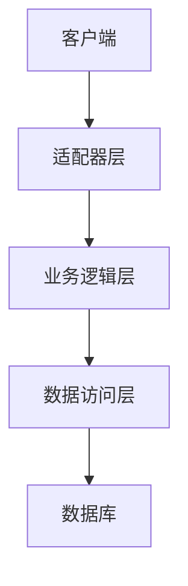

**Diagram sources**
- [OpenAICompatibleController.java](file://spring-ai-alibaba-jmanus/src/main/java/com/alibaba/cloud/ai/manus/adapter/controller/OpenAICompatibleController.java)

### 业务逻辑层

业务逻辑层是平台的核心，包含了agent、coordinator和planning等关键模块。这一层负责处理所有业务规则和流程控制。

### 数据访问层

数据访问层负责与底层存储系统进行交互，支持H2、MySQL和PostgreSQL等多种数据库。该层使用JPA进行对象关系映射，确保了数据访问的一致性和可维护性。

**Section sources**
- [OpenManusSpringBootApplication.java](file://spring-ai-alibaba-jmanus/src/main/java/com/alibaba/cloud/ai/manus/OpenManusSpringBootApplication.java)
- [application.yml](file://spring-ai-alibaba-jmanus/src/main/resources/application.yml)

## 核心模块协同工作机制

JManus平台的核心功能由agent、coordinator和planning三个模块协同实现，形成了一个完整的自主规划系统。

### Agent模块

Agent模块是平台的基本执行单元，负责具体任务的执行。`BaseAgent`类作为所有agent的抽象基类，定义了agent状态管理、对话跟踪和步骤限制等核心功能。

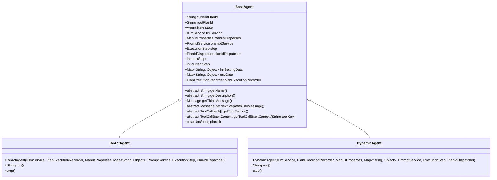

**Diagram sources**
- [BaseAgent.java](file://spring-ai-alibaba-jmanus/src/main/java/com/alibaba/cloud/ai/manus/agent/BaseAgent.java)

### Coordinator模块

Coordinator模块负责协调多个agent的工作，管理计划的执行流程。`PlanningCoordinator`类作为核心协调器，使用`PlanExecutorFactory`动态选择适当的执行器来处理不同类型的计划。

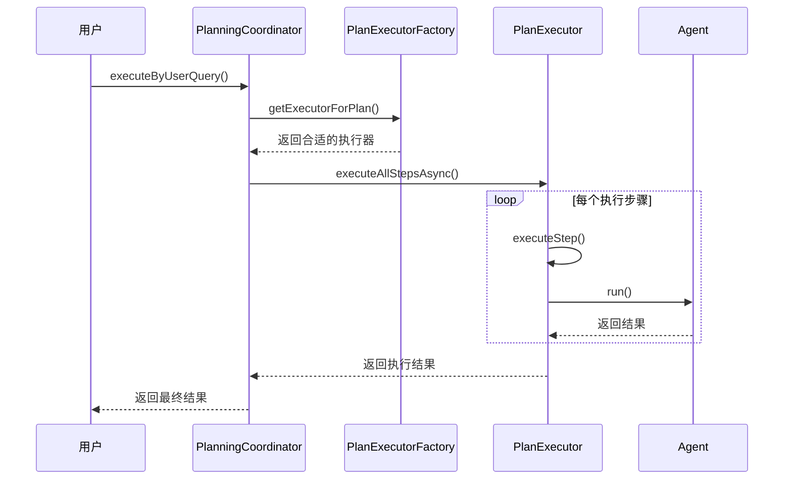

**Diagram sources**
- [PlanningCoordinator.java](file://spring-ai-alibaba-jmanus/src/main/java/com/alibaba/cloud/ai/manus/runtime/service/PlanningCoordinator.java)

### Planning模块

Planning模块负责创建和管理执行计划。它通过`IPlanningFactory`接口提供计划相关对象的创建功能，包括工具回调映射、RestClient和空工具回调提供者等。

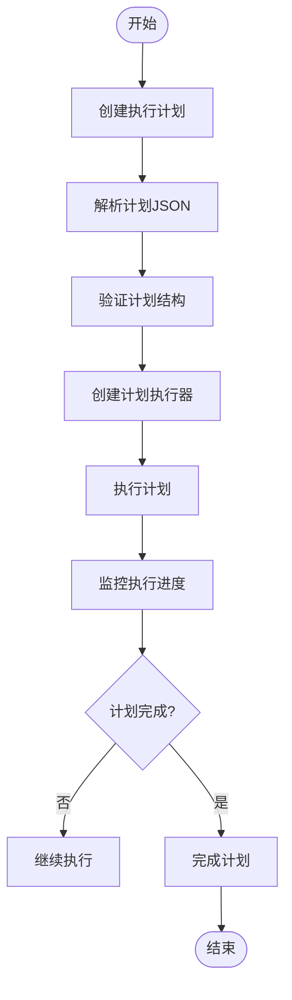

**Diagram sources**
- [IPlanningFactory.java](file://spring-ai-alibaba-jmanus/src/main/java/com/alibaba/cloud/ai/manus/planning/IPlanningFactory.java)

## 系统上下文图

JManus平台的系统上下文图展示了平台与外部系统之间的交互关系。

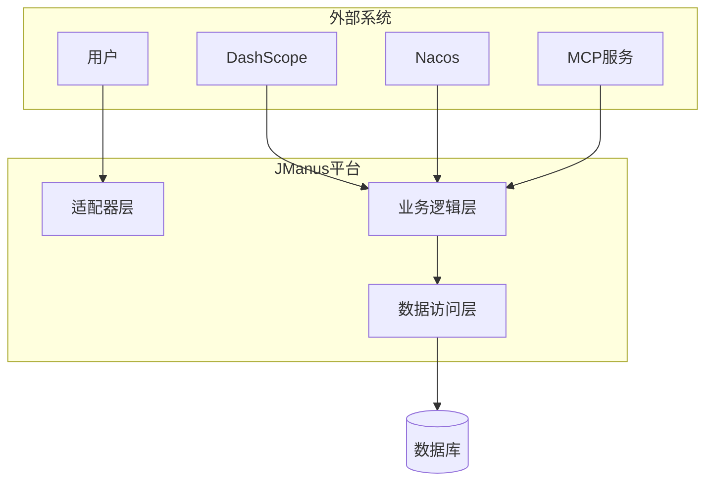

**Diagram sources**
- [McpService.java](file://spring-ai-alibaba-jmanus/src/main/java/com/alibaba/cloud/ai/manus/mcp/service/McpService.java)
- [NacosAgentInjector.java](file://spring-ai-alibaba-agent-nacos/src/main/java/com/alibaba/cloud/ai/agent/nacos/NacosAgentInjector.java)

## 组件交互图

组件交互图详细展示了JManus平台内部各组件之间的交互方式和数据流。

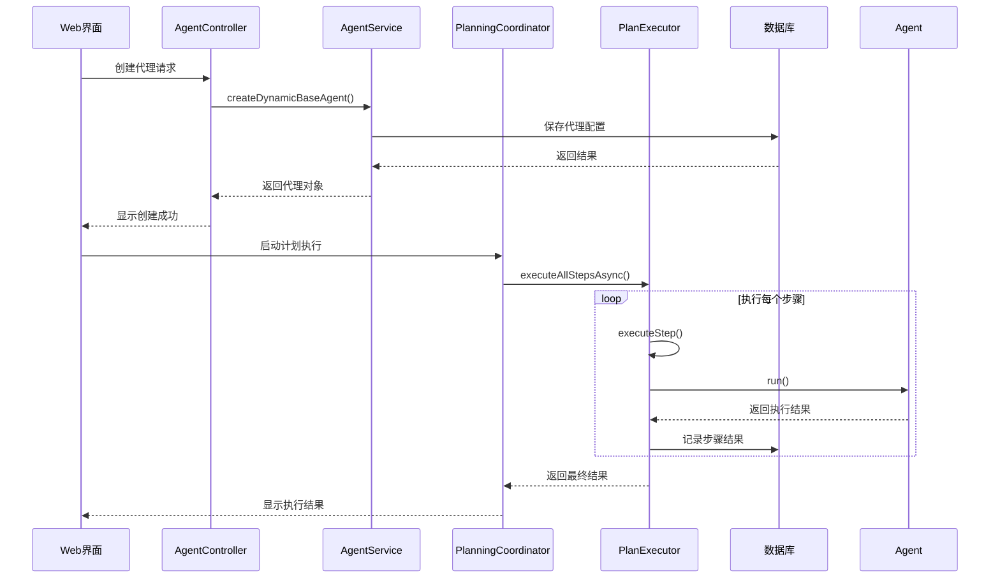

**Diagram sources**
- [AgentController.java](file://spring-ai-alibaba-jmanus/src/main/java/com/alibaba/cloud/ai/manus/agent/controller/AgentController.java)
- [PlanningCoordinator.java](file://spring-ai-alibaba-jmanus/src/main/java/com/alibaba/cloud/ai/manus/runtime/service/PlanningCoordinator.java)

## 部署拓扑图

部署拓扑图展示了JManus平台的物理部署结构和网络拓扑。

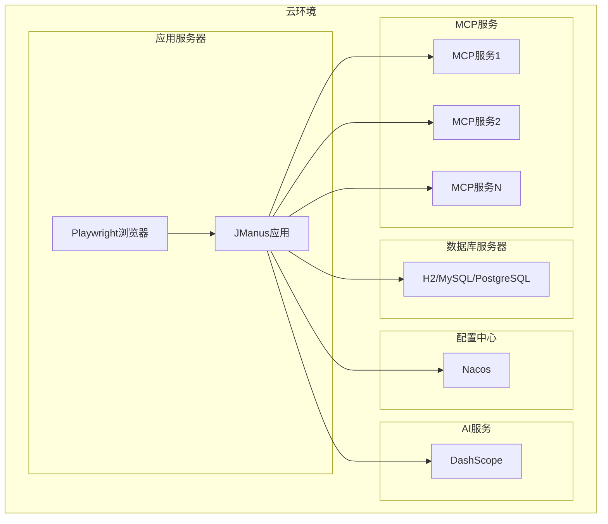

**Diagram sources**
- [A2aServerAutoConfiguration.java](file://auto-configurations/spring-ai-alibaba-autoconfigure-a2a-server/src/main/java/com/alibaba/cloud/ai/autoconfigure/a2a/server/A2aServerAutoConfiguration.java)

## 外部系统集成机制

JManus平台通过多种机制与外部系统进行集成，确保了平台的灵活性和扩展性。

### MCP集成

平台原生支持Model Context Protocol (MCP)，可以无缝集成外部服务和工具。`McpService`类负责协调组件并提供统一的业务接口。

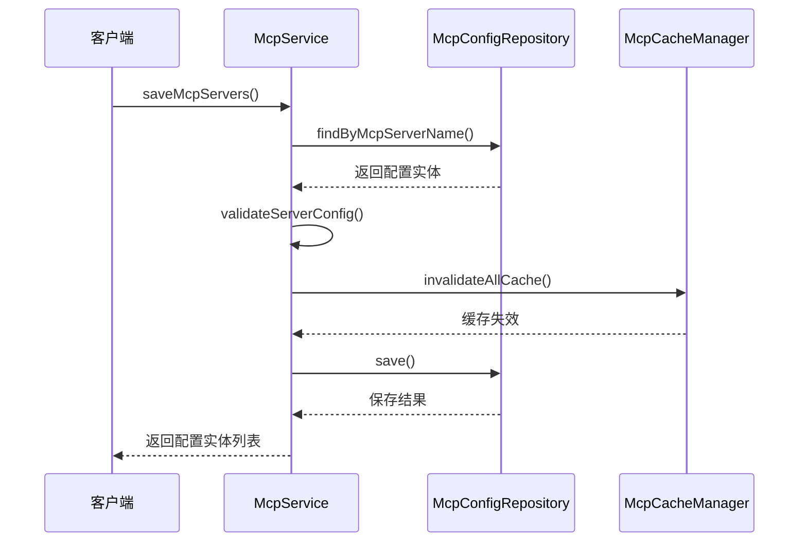

**Diagram sources**
- [McpService.java](file://spring-ai-alibaba-jmanus/src/main/java/com/alibaba/cloud/ai/manus/mcp/service/McpService.java)

### Nacos集成

平台通过Nacos进行配置管理，实现了动态配置加载和热更新。`NacosAgentInjector`类负责从Nacos加载代理配置。

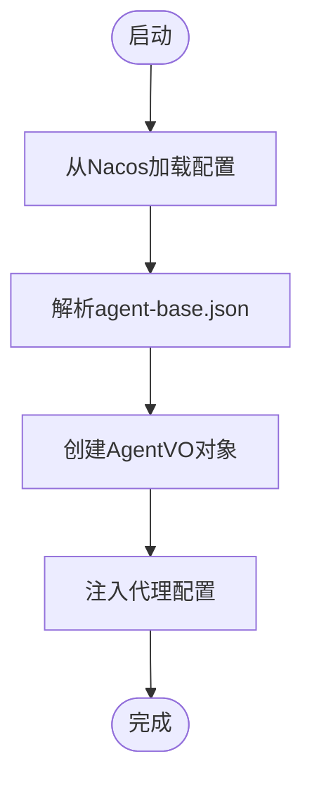

**Diagram sources**
- [NacosAgentInjector.java](file://spring-ai-alibaba-agent-nacos/src/main/java/com/alibaba/cloud/ai/agent/nacos/NacosAgentInjector.java)

## 配置管理设计模式

JManus平台采用了一套完善的配置管理设计模式，确保了配置的灵活性和可维护性。

### 配置属性设计

`ManusProperties`类使用`@ConfigurationProperties`注解实现了类型安全的配置绑定，通过`@ConfigProperty`注解定义了各种配置项。

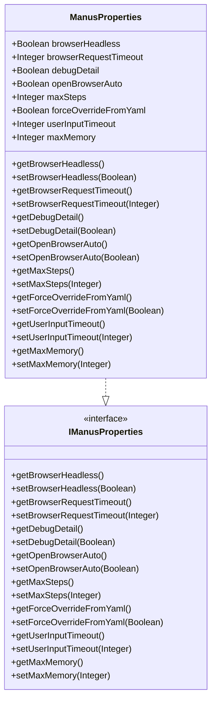

**Diagram sources**
- [ManusProperties.java](file://spring-ai-alibaba-jmanus/src/main/java/com/alibaba/cloud/ai/manus/config/ManusProperties.java)

### 配置监听机制

平台实现了配置变更监听机制，当配置发生变化时能够自动刷新相关组件的状态。

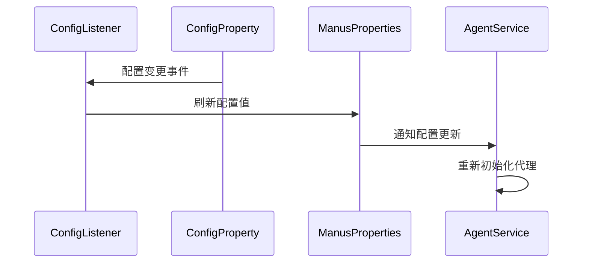

**Section sources**
- [ManusProperties.java](file://spring-ai-alibaba-jmanus/src/main/java/com/alibaba/cloud/ai/manus/config/ManusProperties.java)
- [ConfigProperty.java](file://spring-ai-alibaba-jmanus/src/main/java/com/alibaba/cloud/ai/manus/config/ConfigProperty.java)

## 关键设计决策实现

### 异步执行框架

平台采用异步执行框架处理长时间运行的任务，确保了系统的响应性和可伸缩性。

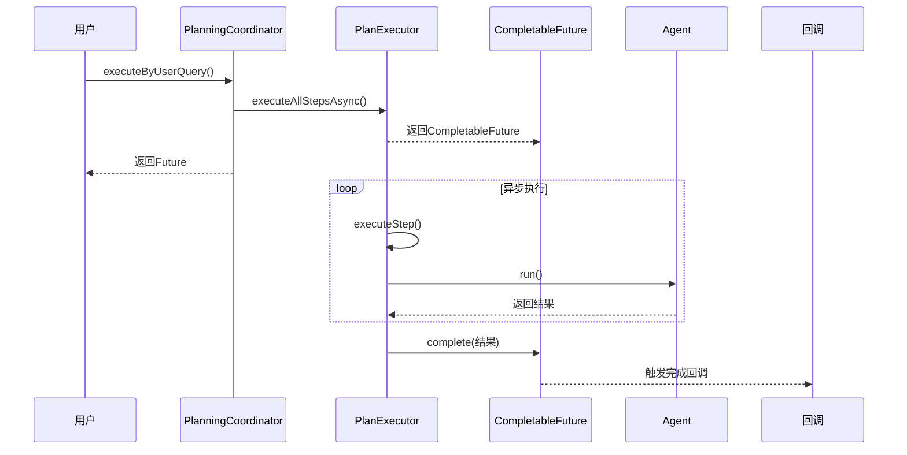

**Section sources**
- [PlanningCoordinator.java](file://spring-ai-alibaba-jmanus/src/main/java/com/alibaba/cloud/ai/manus/runtime/service/PlanningCoordinator.java)
- [AbstractPlanExecutor.java](file://spring-ai-alibaba-jmanus/src/main/java/com/alibaba/cloud/ai/manus/runtime/executor/AbstractPlanExecutor.java)

### 错误处理机制

平台实现了全面的错误处理机制，确保了系统的稳定性和可靠性。

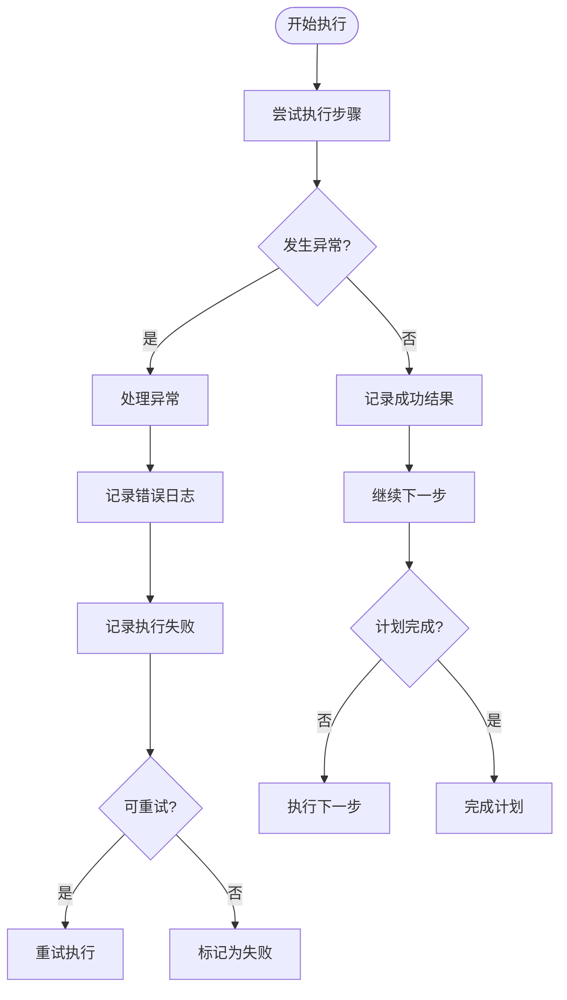

**Section sources**
- [AbstractPlanExecutor.java](file://spring-ai-alibaba-jmanus/src/main/java/com/alibaba/cloud/ai/manus/runtime/executor/AbstractPlanExecutor.java)
- [PlanException.java](file://spring-ai-alibaba-jmanus/src/main/java/com/alibaba/cloud/ai/manus/exception/PlanException.java)