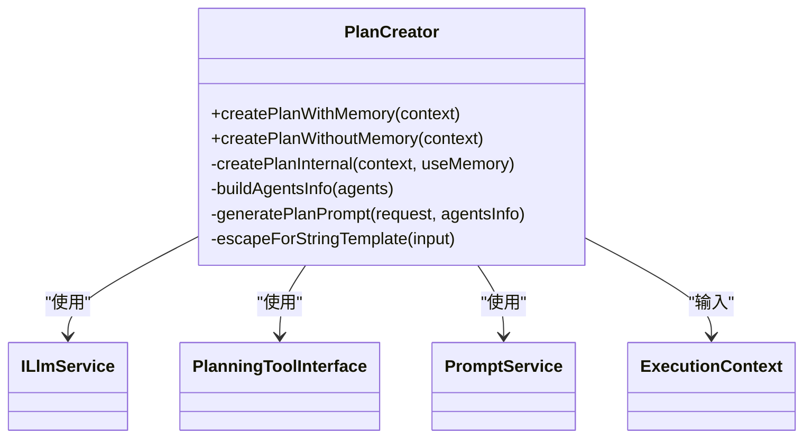
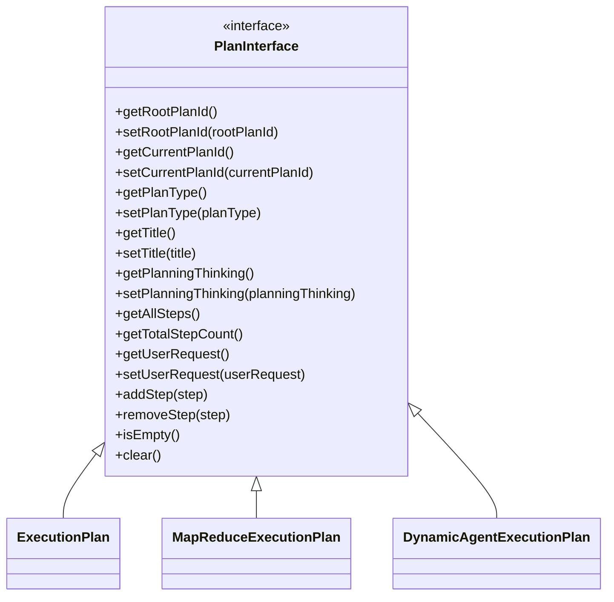
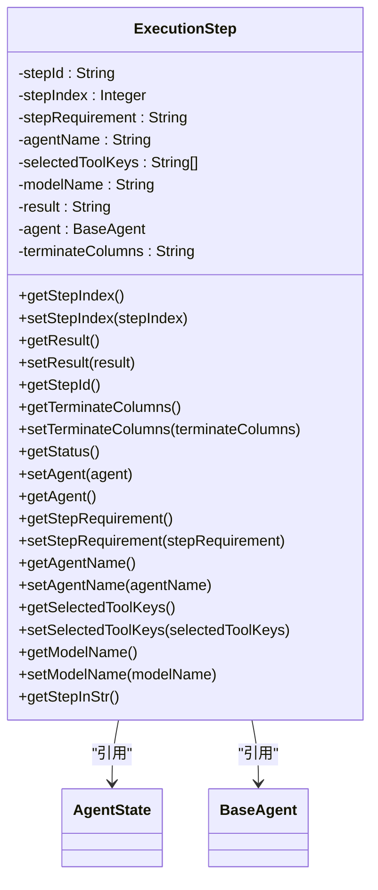
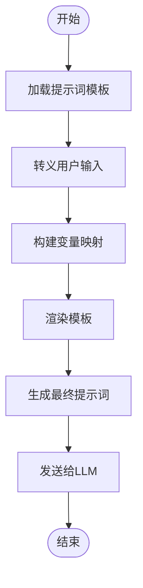
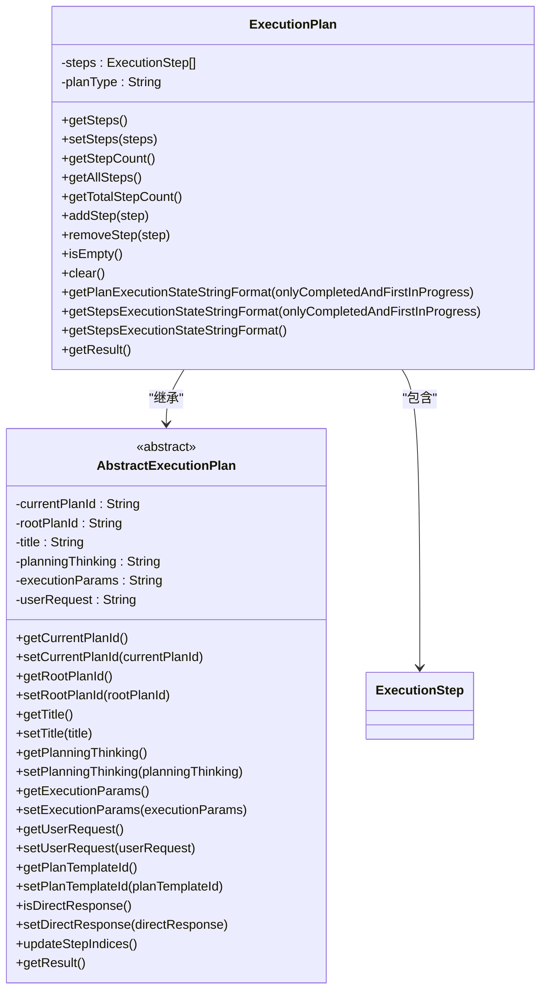
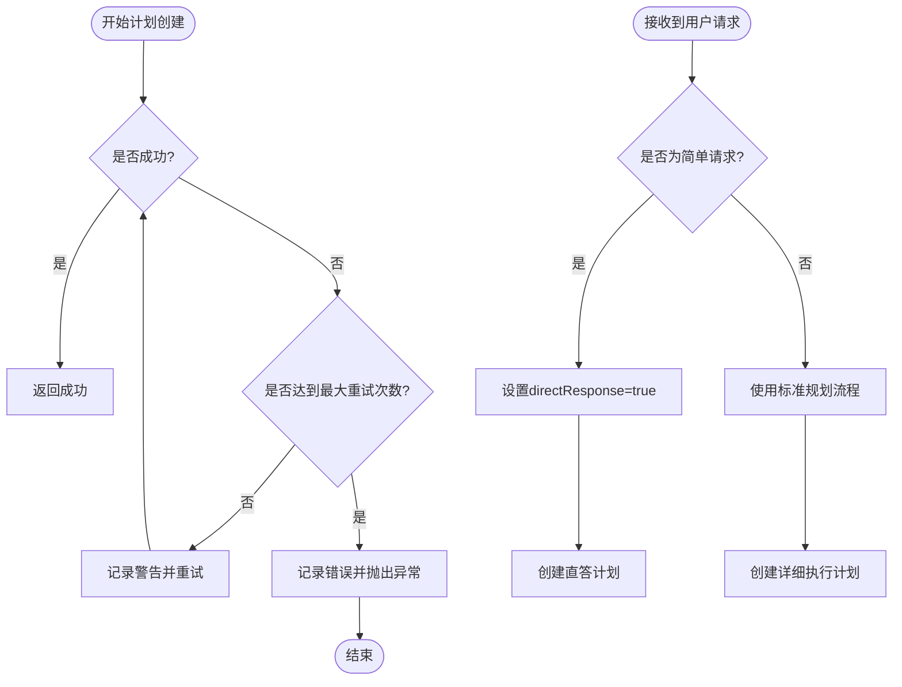

# 任务分解

<cite>
**本文档引用的文件**
- [PlanCreator.java](file://spring-ai-alibaba-jmanus/src/main/java/com/alibaba/cloud/ai/manus/planning/service/PlanCreator.java)
- [PlanningFactory.java](file://spring-ai-alibaba-jmanus/src/main/java/com/alibaba/cloud/ai/manus/planning/PlanningFactory.java)
- [PlanningTool.java](file://spring-ai-alibaba-jmanus/src/main/java/com/alibaba/cloud/ai/manus/tool/PlanningTool.java)
- [ExecutionPlan.java](file://spring-ai-alibaba-jmanus/src/main/java/com/alibaba/cloud/ai/manus/runtime/entity/vo/ExecutionPlan.java)
- [ExecutionStep.java](file://spring-ai-alibaba-jmanus/src/main/java/com/alibaba/cloud/ai/manus/runtime/entity/vo/ExecutionStep.java)
- [PlanInterface.java](file://spring-ai-alibaba-jmanus/src/main/java/com/alibaba/cloud/ai/manus/runtime/entity/vo/PlanInterface.java)
- [plan-creation.txt](file://spring-ai-alibaba-jmanus/src/main/resources/prompts/zh/planning/plan-creation.txt)
- [plan-dynamic-agent-creation.txt](file://spring-ai-alibaba-jmanus/src/main/resources/prompts/zh/planning/plan-dynamic-agent-creation.txt)
</cite>

## 目录
1. [引言](#引言)
2. [任务分解机制概述](#任务分解机制概述)
3. [核心组件分析](#核心组件分析)
4. [任务分解流程详解](#任务分解流程详解)
5. [提示词模板与推理逻辑](#提示词模板与推理逻辑)
6. [任务依赖关系与执行顺序](#任务依赖关系与执行顺序)
7. [异常处理与重分解机制](#异常处理与重分解机制)
8. [结论](#结论)

## 引言
JManus平台的任务分解机制是其智能任务处理能力的核心。该机制能够将用户提出的复杂请求自动拆解为一系列可执行的子任务序列，通过智能化的规划和调度实现高效的任务完成。本技术文档深入解析了这一机制的实现原理、核心算法和关键组件。

## 任务分解机制概述
JManus平台的任务分解机制采用基于大语言模型（LLM）的智能规划方法，将用户请求转化为结构化的执行计划。系统首先分析用户需求，然后利用专门的规划工具和提示词模板引导LLM生成详细的执行步骤序列。每个步骤都包含明确的操作指令、指定的执行代理和必要的工具调用信息。

该机制支持多种任务类型和复杂度，能够根据上下文动态调整分解策略。对于简单任务，系统可能直接进入直答模式；对于复杂任务，则会创建包含多个步骤的详细执行计划。整个过程体现了从宏观规划到微观执行的完整闭环。

**Section sources**
- [PlanCreator.java](file://spring-ai-alibaba-jmanus/src/main/java/com/alibaba/cloud/ai/manus/planning/service/PlanCreator.java#L1-L249)
- [PlanningFactory.java](file://spring-ai-alibaba-jmanus/src/main/java/com/alibaba/cloud/ai/manus/planning/PlanningFactory.java#L1-L355)

## 核心组件分析

### 规划创建器（PlanCreator）
`PlanCreator`类是任务分解的核心组件，负责创建执行计划。它通过与LLM交互，结合用户请求和可用代理信息，生成结构化的执行计划。该组件实现了重试机制，在首次尝试失败时会进行最多三次重试，确保计划创建的可靠性。



**Diagram sources**
- [PlanCreator.java](file://spring-ai-alibaba-jmanus/src/main/java/com/alibaba/cloud/ai/manus/planning/service/PlanCreator.java#L1-L249)

### 执行计划接口（PlanInterface）
`PlanInterface`定义了所有执行计划的基本操作和属性，采用Jackson多态序列化机制支持不同类型的计划实现。该接口通过`@JsonTypeInfo`和`@JsonSubTypes`注解实现了运行时的类型识别和实例化。



**Diagram sources**
- [PlanInterface.java](file://spring-ai-alibaba-jmanus/src/main/java/com/alibaba/cloud/ai/manus/runtime/entity/vo/PlanInterface.java#L1-L196)

### 执行步骤（ExecutionStep）
`ExecutionStep`类表示单个执行步骤的所有信息，包括步骤要求、执行代理、选择的工具等。每个步骤都有唯一的ID和索引，便于跟踪和管理执行状态。



**Diagram sources**
- [ExecutionStep.java](file://spring-ai-alibaba-jmanus/src/main/java/com/alibaba/cloud/ai/manus/runtime/entity/vo/ExecutionStep.java#L1-L159)

**Section sources**
- [ExecutionStep.java](file://spring-ai-alibaba-jmanus/src/main/java/com/alibaba/cloud/ai/manus/runtime/entity/vo/ExecutionStep.java#L1-L159)
- [PlanInterface.java](file://spring-ai-alibaba-jmanus/src/main/java/com/alibaba/cloud/ai/manus/runtime/entity/vo/PlanInterface.java#L1-L196)
- [ExecutionPlan.java](file://spring-ai-alibaba-jmanus/src/main/java/com/alibaba/cloud/ai/manus/runtime/entity/vo/ExecutionPlan.java#L1-L221)

## 任务分解流程详解
JManus平台的任务分解流程始于用户请求的接收，随后进入规划阶段。`PlanCreator`组件首先构建包含用户请求和可用代理信息的提示词，然后将其发送给LLM进行处理。LLM根据提示词生成结构化的执行计划，该计划由`PlanningTool`捕获并转换为内部数据结构。

在创建计划时，系统会区分是否使用记忆功能。如果启用记忆，系统会在第一次尝试时将对话历史作为上下文提供给LLM，帮助生成更连贯的计划。整个过程包含一个三重重试机制，当LLM返回无效或空的计划时，系统会自动重试，最多三次。

一旦获得有效的执行计划，系统会将其与执行上下文关联，并设置相关的元数据，如计划ID、根计划ID和规划思考过程。这个完整的执行计划随后被用于指导后续的步骤执行。

```mermaid
sequenceDiagram
participant 用户 as "用户"
participant PlanCreator as "PlanCreator"
participant LLM as "大语言模型"
participant PlanningTool as "PlanningTool"
用户->>PlanCreator : 提交用户请求
PlanCreator->>PlanCreator : 构建代理信息
PlanCreator->>PlanCreator : 生成计划提示词
PlanCreator->>LLM : 发送提示词并请求计划
loop 最多3次重试
LLM-->>PlanCreator : 返回计划内容
PlanCreator->>PlanningTool : 解析计划
alt 计划有效
PlanningTool-->>PlanCreator : 返回执行计划
break 成功
else 计划无效
PlanCreator->>PlanCreator : 记录警告并重试
end
end
PlanCreator->>PlanCreator : 设置计划元数据
PlanCreator-->>用户 : 返回创建的执行计划
```

**Diagram sources**
- [PlanCreator.java](file://spring-ai-alibaba-jmanus/src/main/java/com/alibaba/cloud/ai/manus/planning/service/PlanCreator.java#L1-L249)
- [PlanningTool.java](file://spring-ai-alibaba-jmanus/src/main/java/com/alibaba/cloud/ai/manus/tool/PlanningTool.java#L1-L319)

**Section sources**
- [PlanCreator.java](file://spring-ai-alibaba-jmanus/src/main/java/com/alibaba/cloud/ai/manus/planning/service/PlanCreator.java#L1-L249)
- [PlanningTool.java](file://spring-ai-alibaba-jmanus/src/main/java/com/alibaba/cloud/ai/manus/tool/PlanningTool.java#L1-L319)

## 提示词模板与推理逻辑
JManus平台使用精心设计的提示词模板来引导LLM进行任务分解。这些模板位于`src/main/resources/prompts/zh/planning/`目录下，其中`plan-creation.txt`是主要的计划创建模板。

提示词模板采用结构化格式，包含介绍、目标、任务处理方法、可用代理信息和具体任务等部分。这种结构化的提示设计有助于LLM理解其角色和任务要求，从而生成符合预期的输出。模板中特别强调了输出格式的要求：每个步骤必须以"[AGENT]"开头，且代理名称必须来自预定义的可用代理列表。

系统还实现了动态的提示词生成机制。`PlanCreator`类中的`generatePlanPrompt`方法会先转义用户请求中的特殊字符，防止字符串模板解析错误，然后将转义后的请求和代理信息注入到模板中，生成最终的提示词。这种设计既保证了安全性，又保持了灵活性。



**Diagram sources**
- [plan-creation.txt](file://spring-ai-alibaba-jmanus/src/main/resources/prompts/zh/planning/plan-creation.txt#L1-L31)
- [PlanCreator.java](file://spring-ai-alibaba-jmanus/src/main/java/com/alibaba/cloud/ai/manus/planning/service/PlanCreator.java#L1-L249)

**Section sources**
- [plan-creation.txt](file://spring-ai-alibaba-jmanus/src/main/resources/prompts/zh/planning/plan-creation.txt#L1-L31)
- [plan-dynamic-agent-creation.txt](file://spring-ai-alibaba-jmanus/src/main/resources/prompts/zh/planning/plan-dynamic-agent-creation.txt#L1-L30)
- [PlanCreator.java](file://spring-ai-alibaba-jmanus/src/main/java/com/alibaba/cloud/ai/manus/planning/service/PlanCreator.java#L1-L249)

## 任务依赖关系与执行顺序
JManus平台通过`ExecutionPlan`类中的步骤列表来建立任务依赖关系和确定执行顺序。所有步骤按顺序存储在`steps`列表中，执行顺序即为列表中的顺序。系统通过`updateStepIndices`方法为每个步骤分配连续的索引号，确保执行顺序的明确性。

对于复杂的MapReduce类型计划，系统采用了更精细的依赖管理机制。除了主步骤列表外，还包含了数据准备、Map、Reduce和后处理等阶段的专用步骤列表。这种分层结构使得复杂的并行和聚合操作得以有效组织。

在执行过程中，系统会跟踪每个步骤的状态（未开始、进行中、已完成、阻塞），并通过`getPlanExecutionStateStringFormat`方法生成当前执行状态的文本表示。这不仅有助于监控进度，也为后续步骤提供了上下文信息。



**Diagram sources**
- [ExecutionPlan.java](file://spring-ai-alibaba-jmanus/src/main/java/com/alibaba/cloud/ai/manus/runtime/entity/vo/ExecutionPlan.java#L1-L221)
- [AbstractExecutionPlan.java](file://spring-ai-alibaba-jmanus/src/main/java/com/alibaba/cloud/ai/manus/runtime/entity/vo/AbstractExecutionPlan.java#L1-L122)

**Section sources**
- [ExecutionPlan.java](file://spring-ai-alibaba-jmanus/src/main/java/com/alibaba/cloud/ai/manus/runtime/entity/vo/ExecutionPlan.java#L1-L221)
- [AbstractExecutionPlan.java](file://spring-ai-alibaba-jmanus/src/main/java/com/alibaba/cloud/ai/manus/runtime/entity/vo/AbstractExecutionPlan.java#L1-L122)

## 异常处理与重分解机制
JManus平台的任务分解机制内置了完善的异常处理和重分解策略。当计划创建失败时，系统会自动触发重试机制。`PlanCreator`类中的`createPlanInternal`方法实现了最多三次的重试逻辑，每次重试都会记录警告日志，最后一次失败则抛出异常。

对于LLM响应解析失败的情况，系统采用了防御性编程。`PlanningTool`在处理输入时会验证必要参数的存在性，如果缺少必需参数（如标题或步骤列表），会返回相应的错误信息而不是崩溃。这种设计确保了系统的健壮性。

在面对不同类型任务时，系统表现出良好的适应性。通过`directResponse`标志，系统可以识别简单的问候和闲聊请求，直接进入直答模式而不进行复杂的计划分解。对于需要动态代理的任务，则使用专门的`DynamicAgentPlanCreator`和相应的提示词模板进行处理。



**Diagram sources**
- [PlanCreator.java](file://spring-ai-alibaba-jmanus/src/main/java/com/alibaba/cloud/ai/manus/planning/service/PlanCreator.java#L1-L249)
- [PlanningTool.java](file://spring-ai-alibaba-jmanus/src/main/java/com/alibaba/cloud/ai/manus/tool/PlanningTool.java#L1-L319)

**Section sources**
- [PlanCreator.java](file://spring-ai-alibaba-jmanus/src/main/java/com/alibaba/cloud/ai/manus/planning/service/PlanCreator.java#L1-L249)
- [PlanningTool.java](file://spring-ai-alibaba-jmanus/src/main/java/com/alibaba/cloud/ai/manus/tool/PlanningTool.java#L1-L319)

## 结论
JManus平台的任务分解机制是一个高度工程化的智能规划系统，它巧妙地结合了大语言模型的强大生成能力和结构化的软件设计模式。通过`PlanCreator`、`PlanningTool`和`ExecutionPlan`等核心组件的协同工作，系统能够可靠地将用户请求转化为可执行的步骤序列。

该机制的设计体现了几个关键优势：首先，通过提示词模板和约束条件确保了输出的一致性和可控性；其次，重试机制和异常处理提高了系统的鲁棒性；最后，灵活的扩展架构支持未来添加新的计划类型和处理模式。

未来的发展方向可能包括更复杂的依赖关系管理、动态调整分解策略的能力，以及基于执行反馈的自适应学习机制。这些改进将进一步提升JManus平台处理复杂任务的能力。