# 执行调度

<cite>
**本文档引用的文件**
- [ManusController.java](file://spring-ai-alibaba-jmanus/src/main/java/com/alibaba/cloud/ai/manus/runtime/controller/ManusController.java)
- [PlanningCoordinator.java](file://spring-ai-alibaba-jmanus/src/main/java/com/alibaba/cloud/ai/manus/runtime/service/PlanningCoordinator.java)
- [PlanExecutorFactory.java](file://spring-ai-alibaba-jmanus/src/main/java/com/alibaba/cloud/ai/manus/runtime/executor/factory/PlanExecutorFactory.java)
- [PlanExecutor.java](file://spring-ai-alibaba-jmanus/src/main/java/com/alibaba/cloud/ai/manus/runtime/executor/PlanExecutor.java)
- [AbstractPlanExecutor.java](file://spring-ai-alibaba-jmanus/src/main/java/com/alibaba/cloud/ai/manus/runtime/executor/AbstractPlanExecutor.java)
- [ExecutionContext.java](file://spring-ai-alibaba-jmanus/src/main/java/com/alibaba/cloud/ai/manus/runtime/entity/vo/ExecutionContext.java)
- [ExecutionStep.java](file://spring-ai-alibaba-jmanus/src/main/java/com/alibaba/cloud/ai/manus/runtime/entity/vo/ExecutionStep.java)
- [PlanExecutionResult.java](file://spring-ai-alibaba-jmanus/src/main/java/com/alibaba/cloud/ai/manus/runtime/entity/vo/PlanExecutionResult.java)
- [StepResult.java](file://spring-ai-alibaba-jmanus/src/main/java/com/alibaba/cloud/ai/manus/runtime/entity/vo/StepResult.java)
</cite>

## 目录
1. [引言](#引言)
2. [执行调度架构](#执行调度架构)
3. [执行模式实现](#执行模式实现)
4. [执行上下文管理](#执行上下文管理)
5. [任务通信与数据传递](#任务通信与数据传递)
6. [依赖关系处理](#依赖关系处理)
7. [执行监控与进度跟踪](#执行监控与进度跟踪)
8. [中断恢复机制](#中断恢复机制)
9. [规划引擎协同工作](#规划引擎协同工作)
10. [复杂工作流案例](#复杂工作流案例)

## 引言
JManus平台执行调度系统是AI代理协调和执行的核心组件，负责将多步规划转化为实际执行流程。该系统支持串行、并行和条件分支等多种执行模式，通过灵活的执行器工厂模式选择合适的执行策略。执行上下文在执行过程中维护状态信息，确保各步骤间的数据一致性。系统还提供了完善的执行监控、进度跟踪和中断恢复功能，能够处理复杂的依赖关系，并与规划引擎协同实现动态调整。

## 执行调度架构

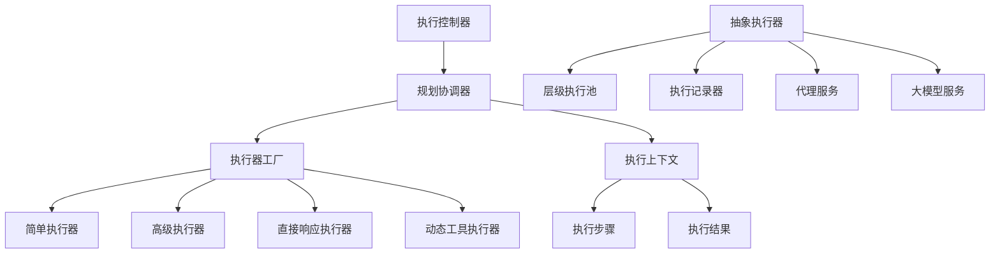

**图示来源**
- [ManusController.java](file://spring-ai-alibaba-jmanus/src/main/java/com/alibaba/cloud/ai/manus/runtime/controller/ManusController.java)
- [PlanningCoordinator.java](file://spring-ai-alibaba-jmanus/src/main/java/com/alibaba/cloud/ai/manus/runtime/service/PlanningCoordinator.java)
- [PlanExecutorFactory.java](file://spring-ai-alibaba-jmanus/src/main/java/com/alibaba/cloud/ai/manus/runtime/executor/factory/PlanExecutorFactory.java)
- [AbstractPlanExecutor.java](file://spring-ai-alibaba-jmanus/src/main/java/com/alibaba/cloud/ai/manus/runtime/executor/AbstractPlanExecutor.java)

**本节来源**
- [ManusController.java](file://spring-ai-alibaba-jmanus/src/main/java/com/alibaba/cloud/ai/manus/runtime/controller/ManusController.java#L36-L93)
- [PlanningCoordinator.java](file://spring-ai-alibaba-jmanus/src/main/java/com/alibaba/cloud/ai/manus/runtime/service/PlanningCoordinator.java#L0-L254)

## 执行模式实现

### 串行执行模式
串行执行模式是最基本的执行方式，按照预定义的步骤顺序依次执行。每个步骤完成后才会开始下一个步骤，确保了执行的确定性和可预测性。

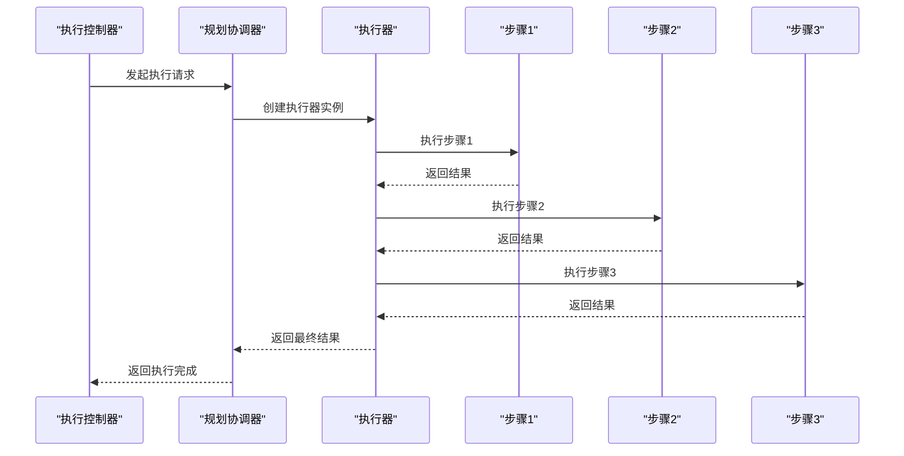

**图示来源**
- [AbstractPlanExecutor.java](file://spring-ai-alibaba-jmanus/src/main/java/com/alibaba/cloud/ai/manus/runtime/executor/AbstractPlanExecutor.java#L207-L246)
- [PlanExecutor.java](file://spring-ai-alibaba-jmanus/src/main/java/com/alibaba/cloud/ai/manus/runtime/executor/PlanExecutor.java#L0-L48)

### 并行执行模式
并行执行模式利用层级执行池(LevelBasedExecutorPool)实现不同深度计划的并发执行。系统根据计划深度选择相应的线程池，提高执行效率。

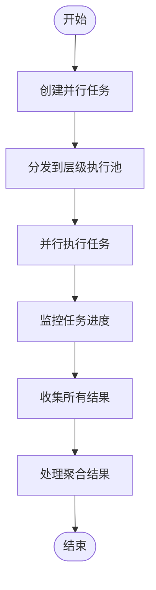

**图示来源**
- [AbstractPlanExecutor.java](file://spring-ai-alibaba-jmanus/src/main/java/com/alibaba/cloud/ai/manus/runtime/executor/AbstractPlanExecutor.java#L207-L246)
- [LevelBasedExecutorPool.java](file://spring-ai-alibaba-jmanus/src/main/java/com/alibaba/cloud/ai/manus/runtime/executor/LevelBasedExecutorPool.java)

### 条件分支执行模式
条件分支执行模式通过检查执行上下文中的状态信息来决定执行路径。系统支持基于条件的动态分支，实现复杂的决策逻辑。

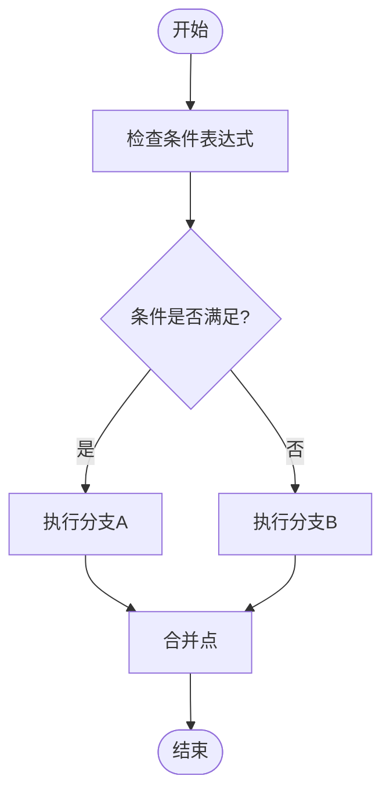

**图示来源**
- [ExecutionContext.java](file://spring-ai-alibaba-jmanus/src/main/java/com/alibaba/cloud/ai/manus/runtime/entity/vo/ExecutionContext.java#L0-L271)
- [AbstractPlanExecutor.java](file://spring-ai-alibaba-jmanus/src/main/java/com/alibaba/cloud/ai/manus/runtime/executor/AbstractPlanExecutor.java#L72-L110)

**本节来源**
- [PlanExecutorFactory.java](file://spring-ai-alibaba-jmanus/src/main/java/com/alibaba/cloud/ai/manus/runtime/executor/factory/PlanExecutorFactory.java#L0-L176)
- [AbstractPlanExecutor.java](file://spring-ai-alibaba-jmanus/src/main/java/com/alibaba/cloud/ai/manus/runtime/executor/AbstractPlanExecutor.java#L0-L275)

## 执行上下文管理

### 上下文结构
执行上下文(ExecutionContext)是贯穿整个执行过程的核心数据载体，负责维护执行过程中的各种状态信息。

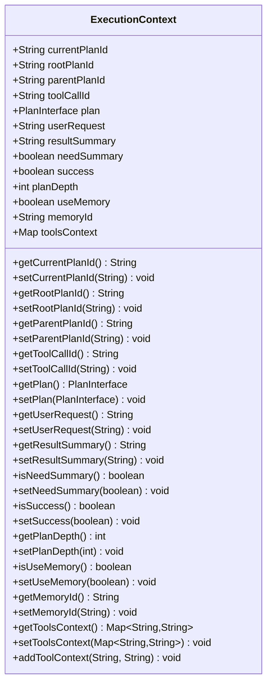

**图示来源**
- [ExecutionContext.java](file://spring-ai-alibaba-jmanus/src/main/java/com/alibaba/cloud/ai/manus/runtime/entity/vo/ExecutionContext.java#L0-L271)

### 状态维护机制
执行上下文通过以下机制维护状态信息：
1. **层次化状态管理**：通过planDepth字段记录计划的嵌套深度
2. **内存隔离**：为每个执行实例分配独立的memoryId
3. **工具上下文**：使用toolsContext映射存储特定工具的上下文信息
4. **执行状态追踪**：通过success标志位记录执行成功与否

**本节来源**
- [ExecutionContext.java](file://spring-ai-alibaba-jmanus/src/main/java/com/alibaba/cloud/ai/manus/runtime/entity/vo/ExecutionContext.java#L0-L271)
- [AbstractPlanExecutor.java](file://spring-ai-alibaba-jmanus/src/main/java/com/alibaba/cloud/ai/manus/runtime/executor/AbstractPlanExecutor.java#L207-L246)

## 任务通信与数据传递

### 数据传递方式
系统通过执行上下文和执行步骤之间的数据传递实现任务间的通信。

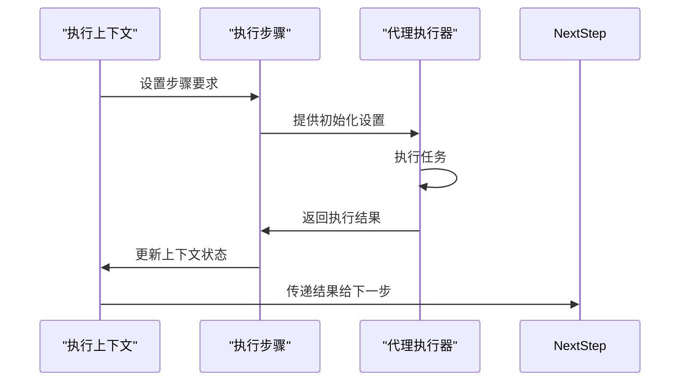

**图示来源**
- [ExecutionContext.java](file://spring-ai-alibaba-jmanus/src/main/java/com/alibaba/cloud/ai/manus/runtime/entity/vo/ExecutionContext.java#L0-L271)
- [ExecutionStep.java](file://spring-ai-alibaba-jmanus/src/main/java/com/alibaba/cloud/ai/manus/runtime/entity/vo/ExecutionStep.java#L0-L159)

### 通信机制
任务间通信主要通过以下几种方式实现：
1. **上下文共享**：所有步骤共享同一个执行上下文
2. **结果传递**：前一步骤的结果作为后一步骤的输入
3. **状态同步**：通过执行记录器同步执行状态
4. **事件通知**：使用事件发布机制进行跨组件通信

**本节来源**
- [ExecutionStep.java](file://spring-ai-alibaba-jmanus/src/main/java/com/alibaba/cloud/ai/manus/runtime/entity/vo/ExecutionStep.java#L0-L159)
- [AbstractPlanExecutor.java](file://spring-ai-alibaba-jmanus/src/main/java/com/alibaba/cloud/ai/manus/runtime/executor/AbstractPlanExecutor.java#L72-L110)

## 依赖关系处理

### 依赖管理
系统通过执行步骤的顺序和条件判断来处理任务间的依赖关系。

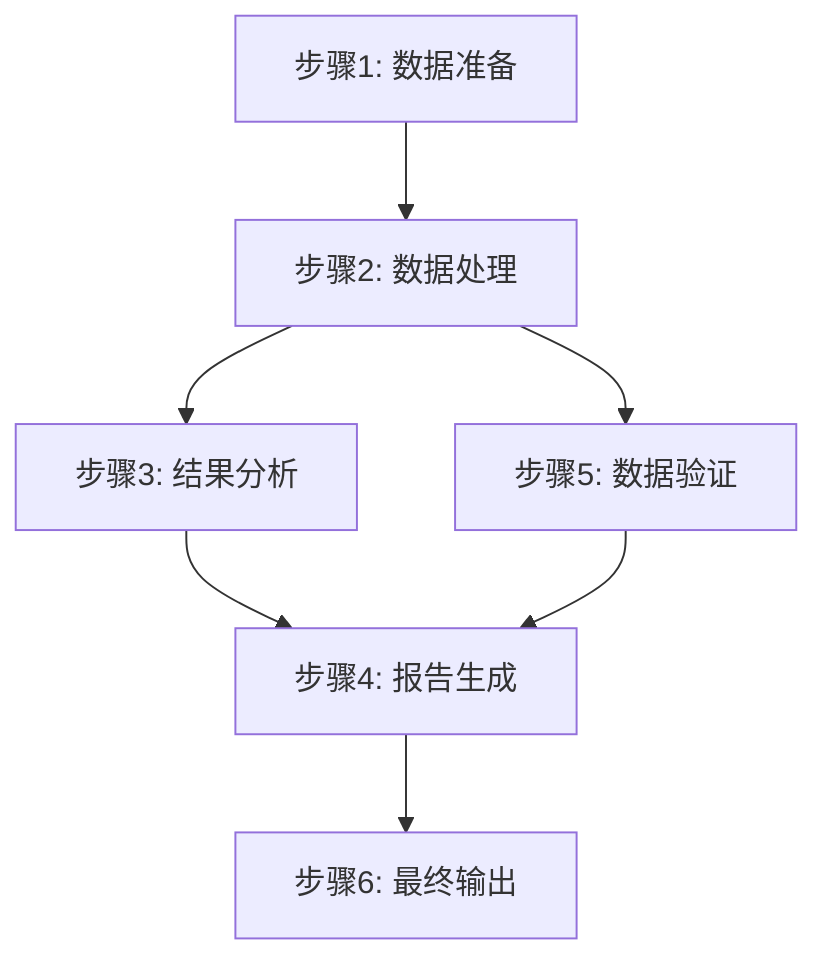

**图示来源**
- [ExecutionStep.java](file://spring-ai-alibaba-jmanus/src/main/java/com/alibaba/cloud/ai/manus/runtime/entity/vo/ExecutionStep.java#L0-L159)
- [PlanInterface.java](file://spring-ai-alibaba-jmanus/src/main/java/com/alibaba/cloud/ai/manus/runtime/entity/vo/PlanInterface.java)

### 依赖解析
依赖关系处理的关键机制包括：
1. **顺序依赖**：通过步骤索引(stepIndex)确定执行顺序
2. **条件依赖**：通过terminateColumns字段指定终止条件
3. **数据依赖**：前序步骤的结果作为后续步骤的输入
4. **资源依赖**：通过执行器池管理共享资源

**本节来源**
- [ExecutionStep.java](file://spring-ai-alibaba-jmanus/src/main/java/com/alibaba/cloud/ai/manus/runtime/entity/vo/ExecutionStep.java#L0-L159)
- [AbstractPlanExecutor.java](file://spring-ai-alibaba-jmanus/src/main/java/com/alibaba/cloud/ai/manus/runtime/executor/AbstractPlanExecutor.java#L112-L151)

## 执行监控与进度跟踪

### 监控机制
系统提供全面的执行监控功能，实时跟踪执行进度和状态。

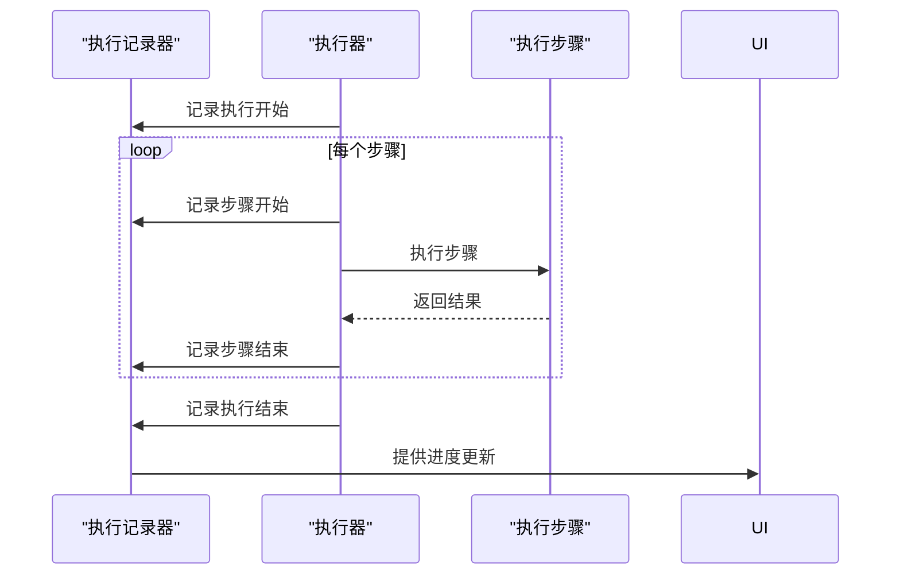

**图示来源**
- [AbstractPlanExecutor.java](file://spring-ai-alibaba-jmanus/src/main/java/com/alibaba/cloud/ai/manus/runtime/executor/AbstractPlanExecutor.java#L72-L110)
- [NewRepoPlanExecutionRecorder.java](file://spring-ai-alibaba-jmanus/src/main/java/com/alibaba/cloud/ai/manus/recorder/service/NewRepoPlanExecutionRecorder.java)

### 进度跟踪
进度跟踪通过以下方式实现：
1. **步骤级跟踪**：记录每个步骤的开始和结束时间
2. **状态更新**：实时更新步骤执行状态
3. **结果收集**：汇总所有步骤的执行结果
4. **异常捕获**：记录执行过程中的任何异常

**本节来源**
- [PlanExecutionRecorder.java](file://spring-ai-alibaba-jmanus/src/main/java/com/alibaba/cloud/ai/manus/recorder/service/PlanExecutionRecorder.java)
- [AbstractPlanExecutor.java](file://spring-ai-alibaba-jmanus/src/main/java/com/alibaba/cloud/ai/manus/runtime/executor/AbstractPlanExecutor.java#L207-L246)

## 中断恢复机制

### 中断处理
系统支持优雅的中断处理和恢复机制，确保执行的可靠性。

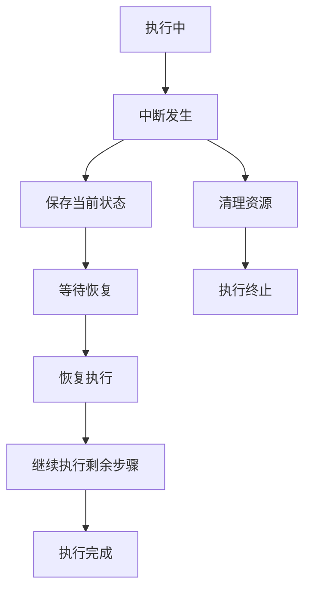

**图示来源**
- [ExecutionContext.java](file://spring-ai-alibaba-jmanus/src/main/java/com/alibaba/cloud/ai/manus/runtime/entity/vo/ExecutionContext.java#L0-L271)
- [PlanExecutionResult.java](file://spring-ai-alibaba-jmanus/src/main/java/com/alibaba/cloud/ai/manus/runtime/entity/vo/PlanExecutionResult.java#L0-L72)

### 恢复策略
中断恢复机制的关键特性包括：
1. **状态持久化**：将执行上下文保存到持久化存储
2. **断点续传**：从最后一个成功步骤继续执行
3. **资源清理**：确保中断时正确释放资源
4. **错误重试**：支持配置重试策略

**本节来源**
- [ExecutionContext.java](file://spring-ai-alibaba-jmanus/src/main/java/com/alibaba/cloud/ai/manus/runtime/entity/vo/ExecutionContext.java#L0-L271)
- [PlanExecutionResult.java](file://spring-ai-alibaba-jmanus/src/main/java/com/alibaba/cloud/ai/manus/runtime/entity/vo/PlanExecutionResult.java#L0-L72)

## 规划引擎协同工作

### 协同机制
执行调度系统与规划引擎紧密协作，实现动态调整和优化。

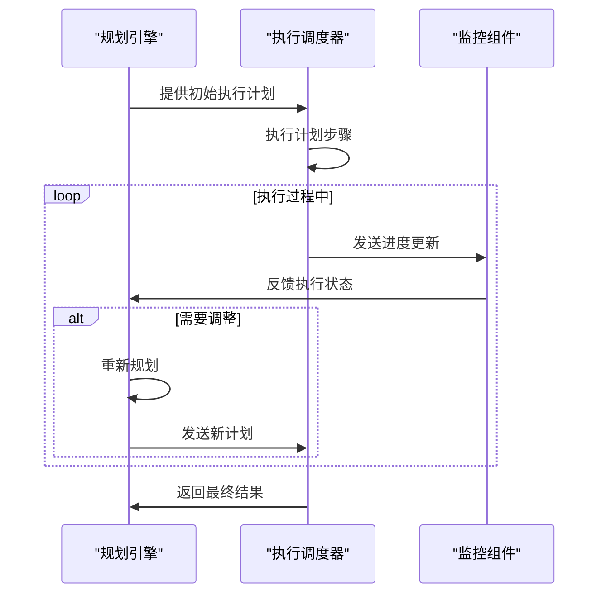

**图示来源**
- [PlanningCoordinator.java](file://spring-ai-alibaba-jmanus/src/main/java/com/alibaba/cloud/ai/manus/runtime/service/PlanningCoordinator.java#L0-L254)
- [PlanExecutorFactory.java](file://spring-ai-alibaba-jmanus/src/main/java/com/alibaba/cloud/ai/manus/runtime/executor/factory/PlanExecutorFactory.java#L0-L176)

### 动态调整
协同工作的关键特性包括：
1. **实时反馈**：执行状态实时反馈给规划引擎
2. **动态重规划**：根据执行情况动态调整计划
3. **参数优化**：基于执行结果优化后续步骤参数
4. **资源调配**：根据负载情况动态调整资源分配

**本节来源**
- [PlanningCoordinator.java](file://spring-ai-alibaba-jmanus/src/main/java/com/alibaba/cloud/ai/manus/runtime/service/PlanningCoordinator.java#L0-L254)
- [PlanExecutorFactory.java](file://spring-ai-alibaba-jmanus/src/main/java/com/alibaba/cloud/ai/manus/runtime/executor/factory/PlanExecutorFactory.java#L0-L176)

## 复杂工作流案例

### MapReduce工作流
以MapReduce为例，展示复杂工作流的调度过程。

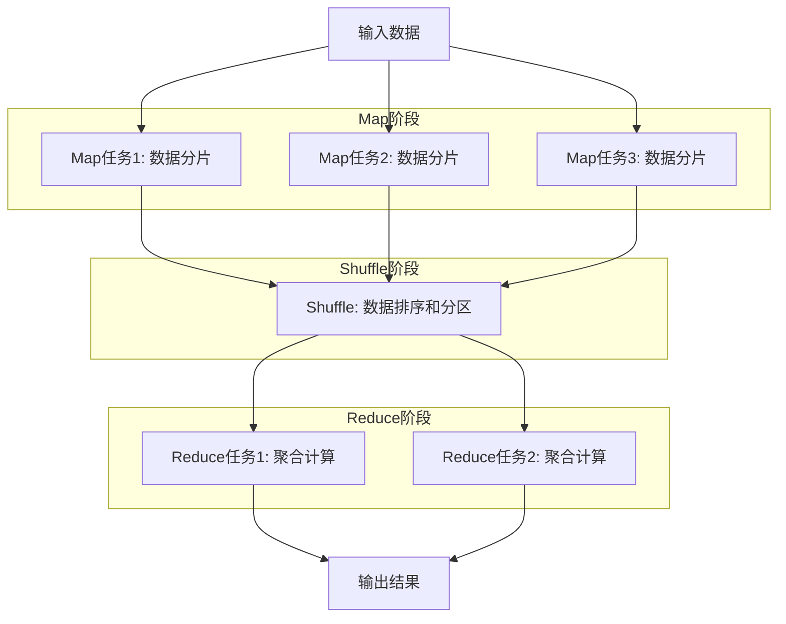

**图示来源**
- [MapReducePlanExecutor.java](file://spring-ai-alibaba-jmanus/src/main/java/com/alibaba/cloud/ai/manus/runtime/executor/MapReducePlanExecutor.java)
- [MapReducePlanningTool.java](file://spring-ai-alibaba-jmanus/src/main/java/com/alibaba/cloud/ai/manus/tool/MapReducePlanningTool.java)

### 实际执行流程
复杂工作流的实际执行流程如下：
1. **计划创建**：规划引擎创建MapReduce执行计划
2. **执行器选择**：执行器工厂选择MapReduce执行器
3. **并行Map**：在层级执行池中并行执行Map任务
4. **数据Shuffle**：对Map结果进行排序和分区
5. **并行Reduce**：并行执行Reduce任务
6. **结果聚合**：收集所有Reduce结果并生成最终输出

**本节来源**
- [MapReducePlanExecutor.java](file://spring-ai-alibaba-jmanus/src/main/java/com/alibaba/cloud/ai/manus/runtime/executor/MapReducePlanExecutor.java)
- [PlanExecutorFactory.java](file://spring-ai-alibaba-jmanus/src/main/java/com/alibaba/cloud/ai/manus/runtime/executor/factory/PlanExecutorFactory.java#L0-L176)