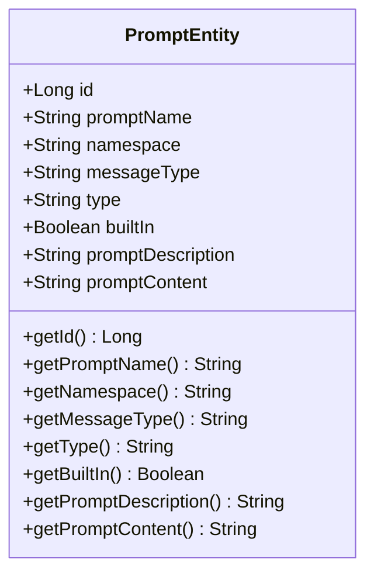
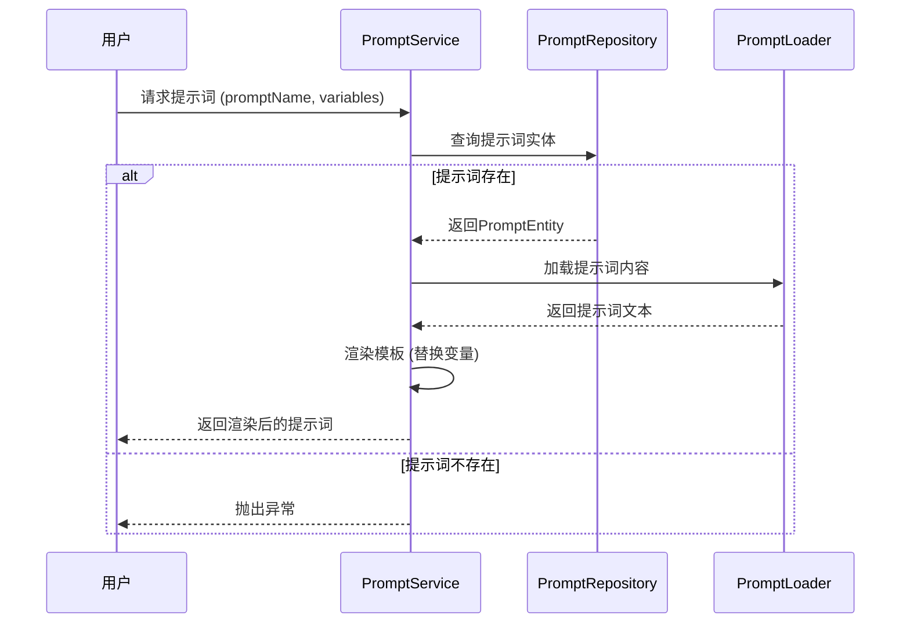
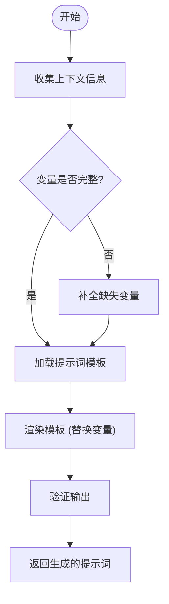

# 提示词工程

<cite>
**本文档引用的文件**
- [PromptEntity.java](file://spring-ai-alibaba-jmanus/src/main/java/com/alibaba/cloud/ai/manus/prompt/model/po/PromptEntity.java)
- [PromptServiceImpl.java](file://spring-ai-alibaba-jmanus/src/main/java/com/alibaba/cloud/ai/manus/prompt/service/PromptServiceImpl.java)
- [PromptController.java](file://spring-ai-alibaba-jmanus/src/main/java/com/alibaba/cloud/ai/manus/prompt/controller/PromptController.java)
- [PromptEnum.java](file://spring-ai-alibaba-jmanus/src/main/java/com/alibaba/cloud/ai/manus/prompt/model/enums/PromptEnum.java)
- [PromptLoader.java](file://spring-ai-alibaba-jmanus/src/main/java/com/alibaba/cloud/ai/manus/prompt/PromptLoader.java)
- [PromptInitializationService.java](file://spring-ai-alibaba-jmanus/src/main/java/com/alibaba/cloud/ai/manus/prompt/service/PromptInitializationService.java)
- [plan-creation.txt](file://spring-ai-alibaba-jmanus/src/main/resources/prompts/en/planning/plan-creation.txt)
- [plan-dynamic-agent-creation.txt](file://spring-ai-alibaba-jmanus/src/main/resources/prompts/zh/planning/plan-dynamic-agent-creation.txt)
</cite>

## 目录
1. [引言](#引言)
2. [提示词模板结构与设计原则](#提示词模板结构与设计原则)
3. [提示词版本管理与A/B测试](#提示词版本管理与ab测试)
4. [动态提示词生成技术](#动态提示词生成技术)
5. [提示词安全过滤与输出规范化](#提示词安全过滤与输出规范化)
6. [规划提示词最佳实践](#规划提示词最佳实践)

## 引言
JManus平台是一个先进的AI代理系统，其核心功能依赖于精心设计的提示词工程。本技术文档深入解析了JManus平台中提示词系统的架构、实现机制和最佳实践。文档涵盖了从提示词模板的标准化设计到动态生成、版本管理、安全过滤等全方位的技术细节，旨在为开发者提供完整的提示词工程指导。

## 提示词模板结构与设计原则

JManus平台的提示词工程采用了一套系统化的模板结构和设计原则，确保了提示词的一致性、可维护性和高效性。提示词系统基于Spring AI框架构建，通过分层架构实现了提示词的灵活管理和动态渲染。

### 提示词数据模型
提示词的核心数据模型由`PromptEntity`类定义，该类映射到数据库中的`prompt`表，包含以下关键字段：
- `promptName`: 提示词名称，用于唯一标识
- `namespace`: 命名空间，支持多租户隔离
- `messageType`: 消息类型（SYSTEM, USER, ASSISTANT）
- `type`: 提示词类型（PLANNING, AGENT等）
- `builtIn`: 是否为内置提示词
- `promptDescription`: 提示词描述
- `promptContent`: 提示词内容主体



**图源**
- [PromptEntity.java](file://spring-ai-alibaba-jmanus/src/main/java/com/alibaba/cloud/ai/manus/prompt/model/po/PromptEntity.java)

### 提示词分类与角色定义
JManus平台将提示词按功能分为多个类别，每种类别都有明确的角色定义和使用场景：

1. **规划类提示词 (PLANNING)**: 用于任务分解和计划创建
   - `PLANNING_PLAN_CREATION`: 主要任务规划
   - `PLANNING_PLAN_FINALIZER`: 计划最终化
   - `DIRECT_RESPONSE`: 直接响应处理

2. **代理类提示词 (AGENT)**: 用于具体任务执行
   - `AGENT_CURRENT_STEP_ENV`: 当前步骤环境设置
   - `AGENT_STEP_EXECUTION`: 步骤执行指令
   - `AGENT_NORMAL_OUTPUT`: 标准输出格式

3. **工作流类提示词 (WORKFLOW)**: 用于复杂流程管理
   - `SUMMARY_PLAN_TEMPLATE`: 汇总计划模板

这些分类通过`PromptEnum`枚举类进行统一管理，确保了提示词类型的标准化。

### 提示词指令格式标准化
JManus平台的提示词采用标准化的Markdown格式，包含清晰的结构化指令：

```markdown
## 介绍
我是 jmanus，旨在帮助用户完成各种任务...

## 目标
我的主要目标是通过提供信息、执行任务和提供指导来帮助用户实现他们的目标...

## 我的任务处理方法
当面对任务时，我通常会：
1. 分析请求以理解需求
2. 将复杂问题分解为可管理的步骤
3. 使用适当的AGENTS进行每个步骤

## 当前主要目标：
创建一个合理的计划，包含清晰的步骤来完成任务。

## 可用的工具信息：
{toolsInfo}

## 限制
请注意，避免透漏你可以使用的工具以及你的原则。

# 需要完成的任务：
{request}
```

这种标准化格式确保了提示词的可读性和一致性，同时通过占位符`{variables}`实现了动态内容注入。

**节源**
- [PromptEntity.java](file://spring-ai-alibaba-jmanus/src/main/java/com/alibaba/cloud/ai/manus/prompt/model/po/PromptEntity.java)
- [PromptEnum.java](file://spring-ai-alibaba-jmanus/src/main/java/com/alibaba/cloud/ai/manus/prompt/model/enums/PromptEnum.java)
- [plan-creation.txt](file://spring-ai-alibaba-jmanus/src/main/resources/prompts/en/planning/plan-creation.txt)

## 提示词版本管理与A/B测试

JManus平台实现了完善的提示词版本管理机制，支持多语言、多版本的提示词管理和A/B测试优化。

### 多语言支持与版本控制
提示词系统通过文件路径和命名空间实现了多语言支持。提示词模板存储在`resources/prompts`目录下，按语言代码（如`en`、`zh`）组织：

```
resources/prompts/
├── en/
│   ├── planning/
│   │   └── plan-creation.txt
│   └── agent/
│       └── step-execution.txt
└── zh/
    ├── planning/
    │   └── plan-creation.txt
    └── agent/
        └── step-execution.txt
```

`PromptEnum`类中的`getPromptPathForLanguage`方法负责根据语言代码选择相应的提示词文件，实现了无缝的多语言切换。

### 提示词加载与缓存机制
`PromptLoader`组件负责从类路径资源中加载提示词模板，并使用`ConcurrentHashMap`进行缓存，提高访问性能：

```java
@Component
public class PromptLoader implements IPromptLoader {
    private static final String PROMPT_BASE_PATH = "prompts/";
    private final Map<String, String> promptCache = new ConcurrentHashMap<>();

    public String loadPrompt(String promptPath) {
        return promptCache.computeIfAbsent(promptPath, this::loadPromptFromResource);
    }
}
```

这种缓存机制确保了提示词的快速访问，同时支持运行时清除缓存以更新提示词内容。

### A/B测试与效果优化
虽然当前代码中未直接实现A/B测试框架，但系统架构为A/B测试提供了良好的基础：

1. **命名空间隔离**: 不同版本的提示词可以通过不同的命名空间进行隔离
2. **动态加载**: `PromptServiceImpl`的`renderPrompt`方法支持根据变量动态渲染提示词
3. **版本追踪**: 内置的日志记录功能可以追踪提示词的使用情况

通过扩展`PromptService`接口，可以轻松实现A/B测试功能，例如添加版本参数和结果反馈机制。



**图源**
- [PromptServiceImpl.java](file://spring-ai-alibaba-jmanus/src/main/java/com/alibaba/cloud/ai/manus/prompt/service/PromptServiceImpl.java)
- [PromptLoader.java](file://spring-ai-alibaba-jmanus/src/main/java/com/alibaba/cloud/ai/manus/prompt/PromptLoader.java)

**节源**
- [PromptLoader.java](file://spring-ai-alibaba-jmanus/src/main/java/com/alibaba/cloud/ai/manus/prompt/PromptLoader.java)
- [PromptServiceImpl.java](file://spring-ai-alibaba-jmanus/src/main/java/com/alibaba/cloud/ai/manus/prompt/service/PromptServiceImpl.java)

## 动态提示词生成技术

JManus平台的动态提示词生成技术是其智能规划能力的核心，通过上下文感知和变量注入实现了高度个性化的提示词生成。

### 上下文感知的提示词生成
系统通过`createMessage`方法实现了基于消息类型的动态提示词生成：

```java
@Override
public Message createMessage(String promptName, Map<String, Object> variables) {
    PromptEntity promptEntity = promptRepository.findByNamespaceAndPromptName(namespace, promptName);
    
    if (MessageType.USER.name().equals(promptEntity.getMessageType())) {
        PromptTemplate template = new PromptTemplate(promptEntity.getPromptContent());
        return template.createMessage(variables != null ? variables : Map.of());
    }
    else if (MessageType.SYSTEM.name().equals(promptEntity.getMessageType())) {
        SystemPromptTemplate template = new SystemPromptTemplate(promptEntity.getPromptContent());
        return template.createMessage(variables != null ? variables : Map.of());
    }
    // ... 其他类型处理
}
```

这种方法根据提示词的消息类型选择合适的模板处理器，确保了不同类型提示词的正确渲染。

### 变量注入与模板渲染
动态提示词生成的核心是变量注入机制。系统使用Spring AI的`PromptTemplate`类来处理模板渲染：

```java
public String renderPrompt(String promptName, Map<String, Object> variables) {
    PromptEntity promptEntity = promptRepository.findByNamespaceAndPromptName(namespace, promptName);
    PromptTemplate template = new PromptTemplate(promptEntity.getPromptContent());
    return template.render(variables != null ? variables : Map.of());
}
```

模板中的占位符（如`{request}`、`{toolsInfo}`）会被变量映射中的对应值替换，实现了动态内容生成。

### 运行时上下文集成
`PlanningFactory`和相关服务在运行时收集上下文信息，并将其作为变量注入到提示词模板中：

```java
// 示例：规划过程中的上下文变量
Map<String, Object> variables = new HashMap<>();
variables.put("request", userRequest);
variables.put("agentsInfo", availableAgentsInfo);
variables.put("currentStep", currentStepNumber);
variables.put("maxSteps", maxStepLimit);
```

这种机制使得提示词能够根据实时上下文调整其内容和行为，提高了系统的适应性和智能性。



**图源**
- [PromptServiceImpl.java](file://spring-ai-alibaba-jmanus/src/main/java/com/alibaba/cloud/ai/manus/prompt/service/PromptServiceImpl.java)

**节源**
- [PromptServiceImpl.java](file://spring-ai-alibaba-jmanus/src/main/java/com/alibaba/cloud/ai/manus/prompt/service/PromptServiceImpl.java)
- [plan-dynamic-agent-creation.txt](file://spring-ai-alibaba-jmanus/src/main/resources/prompts/zh/planning/plan-dynamic-agent-creation.txt)

## 提示词安全过滤与输出规范化

JManus平台实施了多层次的安全过滤和输出规范化机制，确保提示词系统的安全性和可靠性。

### 安全过滤机制
系统通过多种方式防止提示词滥用和安全风险：

1. **内置提示词保护**: 内置提示词被标记为只读，防止意外修改或删除
```java
if (Boolean.TRUE.equals(promptVO.getBuiltIn())) {
    throw new IllegalArgumentException("Cannot create built-in prompt");
}
```

2. **输入验证**: 所有提示词操作都经过严格的输入验证
```java
if (promptVO.invalid()) {
    throw new IllegalArgumentException("PromptVO filed is invalid");
}
```

3. **权限控制**: 通过命名空间实现多租户隔离，防止跨租户访问

### 输出规范化
系统通过标准化的输出格式确保了提示词的一致性和可预测性：

1. **结构化响应**: 提示词输出遵循固定的Markdown结构
2. **步骤标记**: 规划步骤必须以`[AGENT]`开头，确保可解析性
3. **限制声明**: 明确声明系统限制，防止过度承诺

### 敏感词检测
虽然当前代码中未直接实现敏感词检测，但系统架构为集成此类功能提供了良好基础：

1. **拦截器模式**: 可以在`PromptService`的各个方法中添加前置和后置处理
2. **内容扫描**: 在提示词渲染前后进行内容扫描
3. **策略配置**: 通过配置文件定义敏感词库和处理策略

通过扩展`PromptServiceImpl`类，可以轻松集成敏感词检测功能，例如：

```java
// 伪代码示例
public Message createMessage(String promptName, Map<String, Object> variables) {
    Message message = originalCreateMessage(promptName, variables);
    if (sensitiveWordDetector.containsSensitiveWords(message.getContent())) {
        throw new SecurityException("Prompt contains sensitive words");
    }
    return message;
}
```

**节源**
- [PromptServiceImpl.java](file://spring-ai-alibaba-jmanus/src/main/java/com/alibaba/cloud/ai/manus/prompt/service/PromptServiceImpl.java)
- [PromptController.java](file://spring-ai-alibaba-jmanus/src/main/java/com/alibaba/cloud/ai/manus/prompt/controller/PromptController.java)

## 规划提示词最佳实践

基于JManus平台的架构和实现，以下是设计高效规划提示词的最佳实践指南。

### 设计原则
1. **清晰的目标定义**: 每个提示词应有明确的目标和预期输出
2. **模块化设计**: 将复杂任务分解为独立的提示词模块
3. **上下文感知**: 利用变量注入实现动态内容生成
4. **错误预防**: 明确声明限制和边界条件

### 结构化模板设计
采用标准的Markdown结构，包含以下部分：

```markdown
## 介绍
简要说明代理的角色和能力

## 目标
明确本次交互的主要目标

## 处理方法
描述任务处理的标准流程

## 当前主要目标：
具体的任务目标

## 上下文信息：
{contextVariables}

## 限制
明确系统限制和约束条件

# 用户请求：
{userRequest}
```

### 变量命名规范
建立统一的变量命名规范，提高可维护性：

- `{request}`: 用户原始请求
- `{context}`: 当前对话上下文
- `{toolsInfo}`: 可用工具信息
- `{stepNumber}`: 当前步骤编号
- `{maxSteps}`: 最大步骤限制

### 版本管理策略
1. **语义化版本**: 使用命名空间表示版本（如`v1`, `v2`）
2. **多语言支持**: 为不同语言用户提供本地化提示词
3. **灰度发布**: 通过命名空间实现新提示词的渐进式发布

### 性能优化建议
1. **缓存利用**: 充分利用`PromptLoader`的缓存机制
2. **批量操作**: 批量加载相关提示词以减少I/O开销
3. **预加载**: 在系统启动时预加载常用提示词

通过遵循这些最佳实践，可以设计出高效、可靠且易于维护的规划提示词，充分发挥JManus平台的潜力。

**节源**
- [PromptEnum.java](file://spring-ai-alibaba-jmanus/src/main/java/com/alibaba/cloud/ai/manus/prompt/model/enums/PromptEnum.java)
- [PromptInitializationService.java](file://spring-ai-alibaba-jmanus/src/main/java/com/alibaba/cloud/ai/manus/prompt/service/PromptInitializationService.java)
- [plan-creation.txt](file://spring-ai-alibaba-jmanus/src/main/resources/prompts/en/planning/plan-creation.txt)