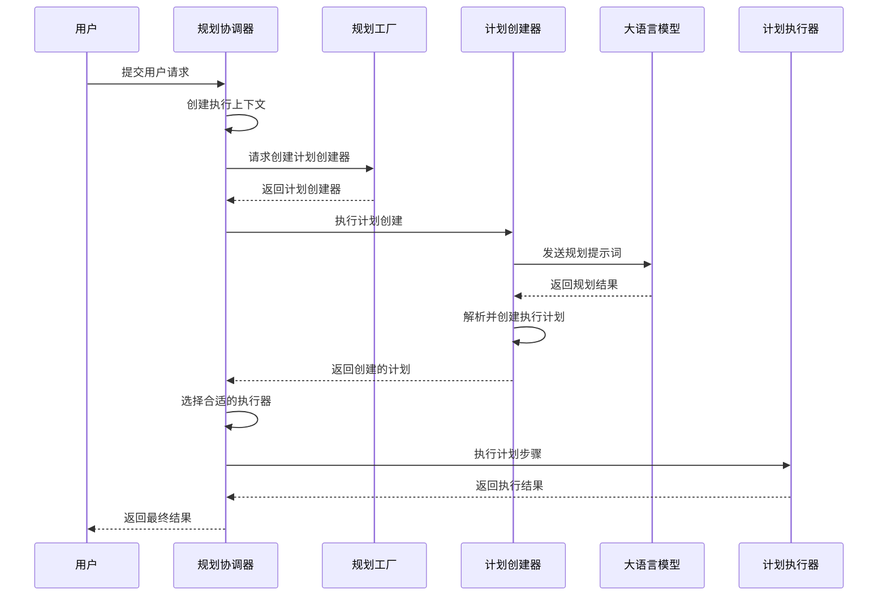
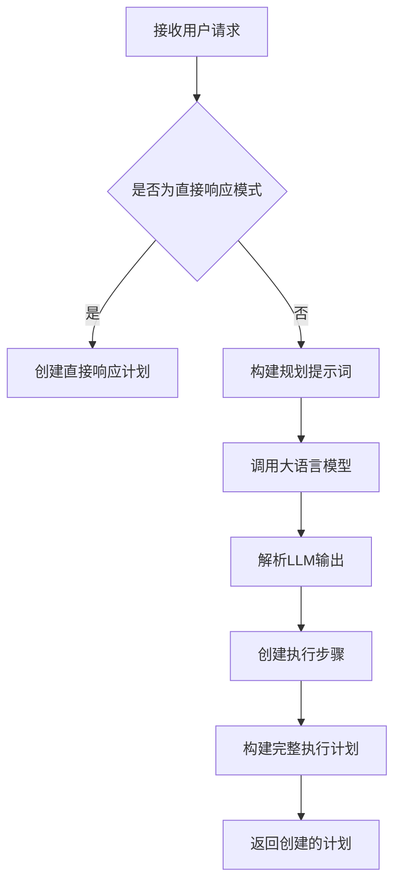
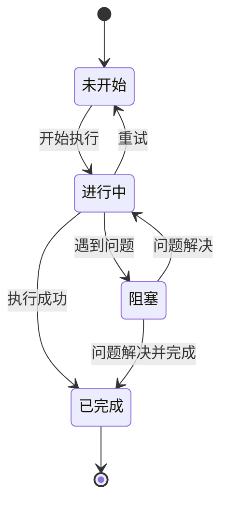
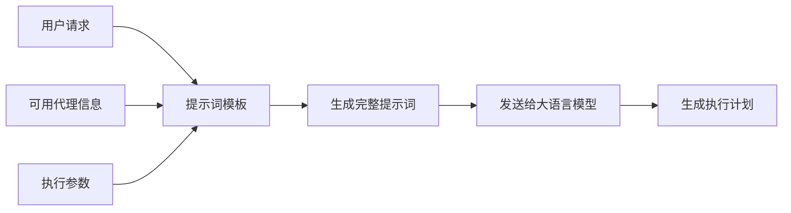
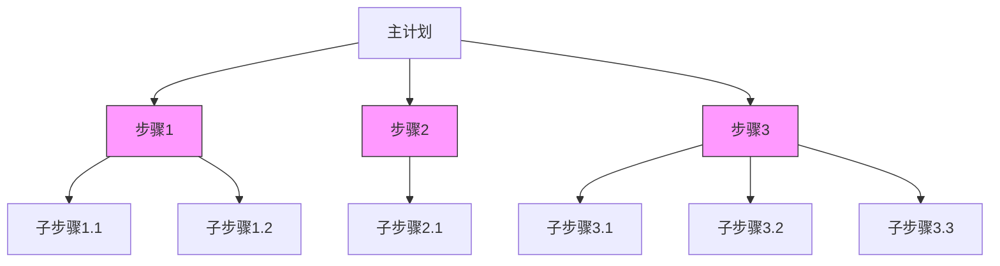
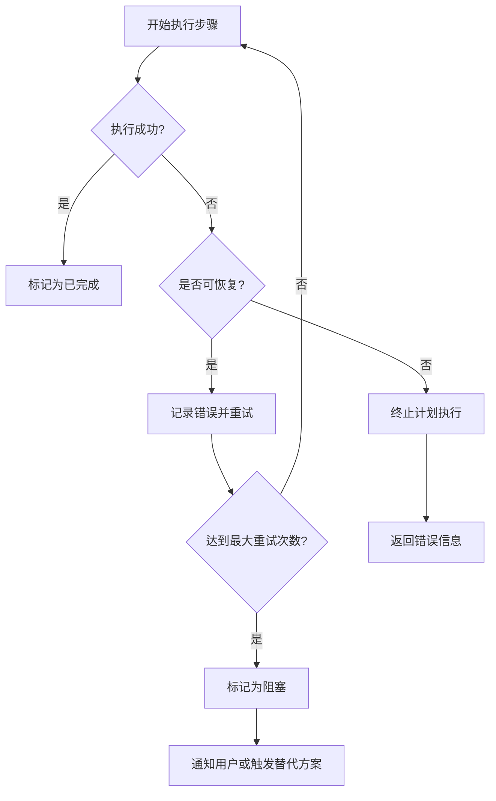
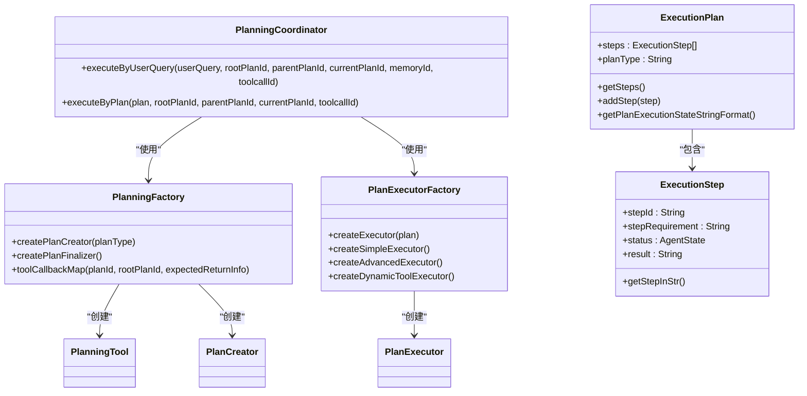

# 规划系统

<cite>
**本文档引用的文件**   
- [PlanningCoordinator.java](file://spring-ai-alibaba-jmanus/src/main/java/com/alibaba/cloud/ai/manus/runtime/service/PlanningCoordinator.java)
- [PlanningFactory.java](file://spring-ai-alibaba-jmanus/src/main/java/com/alibaba/cloud/ai/manus/planning/PlanningFactory.java)
- [PlanningTool.java](file://spring-ai-alibaba-jmanus/src/main/java/com/alibaba/cloud/ai/manus/tool/PlanningTool.java)
- [ExecutionPlan.java](file://spring-ai-alibaba-jmanus/src/main/java/com/alibaba/cloud/ai/manus/runtime/entity/vo/ExecutionPlan.java)
- [ExecutionStep.java](file://spring-ai-alibaba-jmanus/src/main/java/com/alibaba/cloud/ai/manus/runtime/entity/vo/ExecutionStep.java)
- [PlanExecutorFactory.java](file://spring-ai-alibaba-jmanus/src/main/java/com/alibaba/cloud/ai/manus/runtime/executor/factory/PlanExecutorFactory.java)
- [PromptService.java](file://spring-ai-alibaba-jmanus/src/main/java/com/alibaba/cloud/ai/manus/prompt/service/PromptService.java)
- [ManusProperties.java](file://spring-ai-alibaba-jmanus/src/main/java/com/alibaba/cloud/ai/manus/config/ManusProperties.java)
- [PlanCreator.java](file://spring-ai-alibaba-jmanus/src/main/java/com/alibaba/cloud/ai/manus/planning/service/PlanCreator.java)
- [MapReducePlanningTool.java](file://spring-ai-alibaba-jmanus/src/main/java/com/alibaba/cloud/ai/manus/tool/MapReducePlanningTool.java)
</cite>

## 目录
1. [引言](#引言)
2. [核心组件](#核心组件)
3. [规划引擎工作流程](#规划引擎工作流程)
4. [任务分解与目标导向推理](#任务分解与目标导向推理)
5. [动态调整策略](#动态调整策略)
6. [提示词工程在规划中的作用](#提示词工程在规划中的作用)
7. [多步规划与并行执行](#多步规划与并行执行)
8. [异常处理机制](#异常处理机制)
9. [高级特性与实际案例](#高级特性与实际案例)
10. [结论](#结论)

## 引言
JManus平台规划系统是一个先进的自主规划能力实现框架，旨在通过智能化的任务分解、目标导向的推理过程和动态调整策略，将用户请求转化为可执行的详细计划。本技术文档深入解析了该系统的实现机制，详细描述了从接收用户请求到生成可执行计划的完整工作流程。系统通过优化的提示词工程和灵活的规划策略，支持多步规划、并行执行和复杂的异常处理，为复杂任务的自动化执行提供了强大的支持。

## 核心组件

JManus规划系统由多个核心组件构成，这些组件协同工作以实现完整的规划功能。系统的核心包括规划协调器（PlanningCoordinator）、规划工厂（PlanningFactory）、规划工具（PlanningTool）、执行计划（ExecutionPlan）和执行步骤（ExecutionStep）等关键类。规划协调器负责整体流程的协调和执行，规划工厂负责创建和管理各种规划工具，而规划工具则负责具体的任务分解和计划创建。执行计划和执行步骤实体类用于表示和管理规划过程中的状态和进度。

**本节引用的文件**
- [PlanningCoordinator.java](file://spring-ai-alibaba-jmanus/src/main/java/com/alibaba/cloud/ai/manus/runtime/service/PlanningCoordinator.java#L0-L254)
- [PlanningFactory.java](file://spring-ai-alibaba-jmanus/src/main/java/com/alibaba/cloud/ai/manus/planning/PlanningFactory.java#L0-L355)
- [PlanningTool.java](file://spring-ai-alibaba-jmanus/src/main/java/com/alibaba/cloud/ai/manus/tool/PlanningTool.java#L0-L319)

## 规划引擎工作流程

JManus规划引擎的工作流程从接收用户请求开始，经过任务分解、计划创建、执行调度到最终结果生成的完整过程。当用户提交请求时，规划协调器（PlanningCoordinator）首先创建执行上下文（ExecutionContext），然后通过规划工厂（PlanningFactory）创建相应的计划创建器（PlanCreator）。计划创建器利用大语言模型（LLM）和规划工具（PlanningTool）生成具体的执行计划。一旦计划创建完成，规划协调器会根据计划类型选择合适的执行器（Executor）来执行计划的各个步骤。

**图表来源**
- [PlanningCoordinator.java](file://spring-ai-alibaba-jmanus/src/main/java/com/alibaba/cloud/ai/manus/runtime/service/PlanningCoordinator.java#L0-L254)
- [PlanningFactory.java](file://spring-ai-alibaba-jmanus/src/main/java/com/alibaba/cloud/ai/manus/planning/PlanningFactory.java#L0-L355)
- [PlanCreator.java](file://spring-ai-alibaba-jmanus/src/main/java/com/alibaba/cloud/ai/manus/planning/service/PlanCreator.java#L0-L249)

**本节引用的文件**
- [PlanningCoordinator.java](file://spring-ai-alibaba-jmanus/src/main/java/com/alibaba/cloud/ai/manus/runtime/service/PlanningCoordinator.java#L0-L254)
- [PlanningFactory.java](file://spring-ai-alibaba-jmanus/src/main/java/com/alibaba/cloud/ai/manus/planning/PlanningFactory.java#L0-L355)
- [PlanCreator.java](file://spring-ai-alibaba-jmanus/src/main/java/com/alibaba/cloud/ai/manus/planning/service/PlanCreator.java#L0-L249)

## 任务分解与目标导向推理

JManus平台的自主规划能力核心在于其先进的任务分解算法和目标导向的推理过程。系统通过规划工具（PlanningTool）实现任务分解，将复杂的用户请求分解为一系列可执行的步骤。规划工具定义了创建计划的输入参数，包括命令、标题和步骤列表等。当接收到"create"命令时，规划工具会创建一个包含多个执行步骤的执行计划（ExecutionPlan）。

目标导向的推理过程通过大语言模型（LLM）和提示词工程实现。系统使用专门的规划提示词模板，引导LLM进行有效的任务分解和推理。在创建计划时，系统会构建包含可用代理信息和用户请求的完整提示词，发送给LLM进行处理。LLM根据提示词生成具体的执行步骤，这些步骤被封装在执行计划中，形成一个有序的任务序列。

**图表来源**
- [PlanningTool.java](file://spring-ai-alibaba-jmanus/src/main/java/com/alibaba/cloud/ai/manus/tool/PlanningTool.java#L0-L319)
- [PlanCreator.java](file://spring-ai-alibaba-jmanus/src/main/java/com/alibaba/cloud/ai/manus/planning/service/PlanCreator.java#L0-L249)
- [ExecutionPlan.java](file://spring-ai-alibaba-jmanus/src/main/java/com/alibaba/cloud/ai/manus/runtime/entity/vo/ExecutionPlan.java#L0-L221)

**本节引用的文件**
- [PlanningTool.java](file://spring-ai-alibaba-jmanus/src/main/java/com/alibaba/cloud/ai/manus/tool/PlanningTool.java#L0-L319)
- [PlanCreator.java](file://spring-ai-alibaba-jmanus/src/main/java/com/alibaba/cloud/ai/manus/planning/service/PlanCreator.java#L0-L249)
- [ExecutionPlan.java](file://spring-ai-alibaba-jmanus/src/main/java/com/alibaba/cloud/ai/manus/runtime/entity/vo/ExecutionPlan.java#L0-L221)

## 动态调整策略

JManus规划系统实现了灵活的动态调整策略，能够根据执行过程中的实际情况进行实时调整。系统通过执行上下文（ExecutionContext）和执行步骤（ExecutionStep）的状态管理，实现了对规划过程的动态监控和调整。每个执行步骤都有明确的状态标识，包括未开始、进行中、已完成和阻塞等状态，这使得系统能够准确地跟踪计划的执行进度。

当某个步骤执行失败或遇到阻塞时，系统可以自动触发重试机制或调整后续步骤的执行策略。规划协调器（PlanningCoordinator）负责监控整个执行过程，并在必要时进行干预。例如，当检测到某个步骤连续失败多次时，系统可能会选择跳过该步骤或采用替代方案。此外，系统还支持在执行过程中动态添加新的步骤或修改现有步骤，以适应不断变化的环境和需求。

**图表来源**
- [ExecutionStep.java](file://spring-ai-alibaba-jmanus/src/main/java/com/alibaba/cloud/ai/manus/runtime/entity/vo/ExecutionStep.java#L0-L159)
- [ExecutionContext.java](file://spring-ai-alibaba-jmanus/src/main/java/com/alibaba/cloud/ai/manus/runtime/entity/vo/ExecutionContext.java)
- [PlanningCoordinator.java](file://spring-ai-alibaba-jmanus/src/main/java/com/alibaba/cloud/ai/manus/runtime/service/PlanningCoordinator.java#L0-L254)

**本节引用的文件**
- [ExecutionStep.java](file://spring-ai-alibaba-jmanus/src/main/java/com/alibaba/cloud/ai/manus/runtime/entity/vo/ExecutionStep.java#L0-L159)
- [ExecutionContext.java](file://spring-ai-alibaba-jmanus/src/main/java/com/alibaba/cloud/ai/manus/runtime/entity/vo/ExecutionContext.java)
- [PlanningCoordinator.java](file://spring-ai-alibaba-jmanus/src/main/java/com/alibaba/cloud/ai/manus/runtime/service/PlanningCoordinator.java#L0-L254)

## 提示词工程在规划中的作用

提示词工程在JManus规划系统中扮演着至关重要的角色，它是连接用户请求和具体执行计划的桥梁。系统通过精心设计的提示词模板，引导大语言模型（LLM）进行有效的任务分解和推理。提示词服务（PromptService）负责管理和提供各种提示词模板，包括规划创建、计划最终化等不同阶段所需的提示词。

在规划过程中，系统会根据用户请求和可用代理信息动态生成具体的提示词内容。提示词中包含了详细的上下文信息，如可用代理的描述、执行参数和期望的输出格式等，这些信息帮助LLM更好地理解任务需求并生成高质量的执行计划。通过优化提示词模板，系统能够显著提升规划的质量和准确性，确保生成的计划既符合用户需求又具有良好的可执行性。

**图表来源**
- [PromptService.java](file://spring-ai-alibaba-jmanus/src/main/java/com/alibaba/cloud/ai/manus/prompt/service/PromptService.java#L0-L58)
- [PlanCreator.java](file://spring-ai-alibaba-jmanus/src/main/java/com/alibaba/cloud/ai/manus/planning/service/PlanCreator.java#L0-L249)
- [PlanningFactory.java](file://spring-ai-alibaba-jmanus/src/main/java/com/alibaba/cloud/ai/manus/planning/PlanningFactory.java#L0-L355)

**本节引用的文件**
- [PromptService.java](file://spring-ai-alibaba-jmanus/src/main/java/com/alibaba/cloud/ai/manus/prompt/service/PromptService.java#L0-L58)
- [PlanCreator.java](file://spring-ai-alibaba-jmanus/src/main/java/com/alibaba/cloud/ai/manus/planning/service/PlanCreator.java#L0-L249)
- [PlanningFactory.java](file://spring-ai-alibaba-jmanus/src/main/java/com/alibaba/cloud/ai/manus/planning/PlanningFactory.java#L0-L355)

## 多步规划与并行执行

JManus规划系统支持复杂的多步规划和并行执行能力，能够处理需要多个步骤协同完成的复杂任务。系统通过执行计划（ExecutionPlan）和执行步骤（ExecutionStep）的层次结构，实现了对多步任务的有效管理。每个执行计划包含一个有序的执行步骤列表，系统按照顺序或并行方式执行这些步骤。

对于可以并行执行的任务，系统通过配置参数控制并行执行的行为。ManusProperties配置类中的parallelToolCalls参数决定了是否启用并行工具调用。当启用并行执行时，系统可以同时处理多个独立的执行步骤，显著提高执行效率。规划执行器工厂（PlanExecutorFactory）根据计划类型选择合适的执行器，如简单执行器（SimpleExecutor）用于顺序执行，而高级执行器（AdvancedExecutor）支持MapReduce等复杂的并行处理模式。

**图表来源**
- [ExecutionPlan.java](file://spring-ai-alibaba-jmanus/src/main/java/com/alibaba/cloud/ai/manus/runtime/entity/vo/ExecutionPlan.java#L0-L221)
- [ExecutionStep.java](file://spring-ai-alibaba-jmanus/src/main/java/com/alibaba/cloud/ai/manus/runtime/entity/vo/ExecutionStep.java#L0-L159)
- [PlanExecutorFactory.java](file://spring-ai-alibaba-jmanus/src/main/java/com/alibaba/cloud/ai/manus/runtime/executor/factory/PlanExecutorFactory.java#L0-L176)

**本节引用的文件**
- [ExecutionPlan.java](file://spring-ai-alibaba-jmanus/src/main/java/com/alibaba/cloud/ai/manus/runtime/entity/vo/ExecutionPlan.java#L0-L221)
- [ExecutionStep.java](file://spring-ai-alibaba-jmanus/src/main/java/com/alibaba/cloud/ai/manus/runtime/entity/vo/ExecutionStep.java#L0-L159)
- [PlanExecutorFactory.java](file://spring-ai-alibaba-jmanus/src/main/java/com/alibaba/cloud/ai/manus/runtime/executor/factory/PlanExecutorFactory.java#L0-L176)

## 异常处理机制

JManus规划系统具备完善的异常处理机制，能够有效应对执行过程中的各种异常情况。系统通过规划协调器（PlanningCoordinator）的异常捕获和处理逻辑，确保在遇到错误时能够优雅地降级或恢复。当执行过程中发生异常时，系统会记录详细的错误信息，并根据异常类型采取相应的处理策略。

对于可恢复的异常，系统会尝试重试机制，最多进行三次重试以确保任务的最终成功。如果重试仍然失败，系统会将步骤状态标记为阻塞，并通知用户或触发替代方案。对于不可恢复的异常，系统会终止当前计划的执行，并返回详细的错误信息。此外，系统还实现了执行结果（PlanExecutionResult）的封装，包含成功状态、错误消息和执行数据等信息，便于上层应用进行错误处理和用户反馈。

**图表来源**
- [PlanningCoordinator.java](file://spring-ai-alibaba-jmanus/src/main/java/com/alibaba/cloud/ai/manus/runtime/service/PlanningCoordinator.java#L0-L254)
- [PlanExecutionResult.java](file://spring-ai-alibaba-jmanus/src/main/java/com/alibaba/cloud/ai/manus/runtime/entity/vo/PlanExecutionResult.java)
- [PlanCreator.java](file://spring-ai-alibaba-jmanus/src/main/java/com/alibaba/cloud/ai/manus/planning/service/PlanCreator.java#L0-L249)

**本节引用的文件**
- [PlanningCoordinator.java](file://spring-ai-alibaba-jmanus/src/main/java/com/alibaba/cloud/ai/manus/runtime/service/PlanningCoordinator.java#L0-L254)
- [PlanExecutionResult.java](file://spring-ai-alibaba-jmanus/src/main/java/com/alibaba/cloud/ai/manus/runtime/entity/vo/PlanExecutionResult.java)
- [PlanCreator.java](file://spring-ai-alibaba-jmanus/src/main/java/com/alibaba/cloud/ai/manus/planning/service/PlanCreator.java#L0-L249)

## 高级特性与实际案例

JManus规划系统提供了多种高级特性，包括MapReduce规划、动态代理规划和子计划工具等，能够处理极其复杂的任务场景。MapReduce规划工具（MapReducePlanningTool）实现了分布式处理模式，将大数据处理任务分解为"映射"和"归约"两个阶段，支持大规模数据的并行处理。动态代理规划允许系统根据任务需求动态创建和配置代理，实现高度灵活的任务执行。

在实际应用中，这些高级特性可以组合使用以解决复杂问题。例如，一个数据分析任务可以首先使用MapReduce规划工具将数据分割并行处理，然后使用动态代理规划创建专门的数据分析代理，最后通过子计划工具协调各个子任务的执行。系统还支持通过配置文件（ManusProperties）灵活调整各种行为参数，如最大步骤数、用户输入超时时间等，以适应不同的应用场景和性能需求。

**图表来源**
- [PlanningFactory.java](file://spring-ai-alibaba-jmanus/src/main/java/com/alibaba/cloud/ai/manus/planning/PlanningFactory.java#L0-L355)
- [PlanningCoordinator.java](file://spring-ai-alibaba-jmanus/src/main/java/com/alibaba/cloud/ai/manus/runtime/service/PlanningCoordinator.java#L0-L254)
- [PlanExecutorFactory.java](file://spring-ai-alibaba-jmanus/src/main/java/com/alibaba/cloud/ai/manus/runtime/executor/factory/PlanExecutorFactory.java#L0-L176)
- [ExecutionPlan.java](file://spring-ai-alibaba-jmanus/src/main/java/com/alibaba/cloud/ai/manus/runtime/entity/vo/ExecutionPlan.java#L0-L221)
- [ExecutionStep.java](file://spring-ai-alibaba-jmanus/src/main/java/com/alibaba/cloud/ai/manus/runtime/entity/vo/ExecutionStep.java#L0-L159)

**本节引用的文件**
- [PlanningFactory.java](file://spring-ai-alibaba-jmanus/src/main/java/com/alibaba/cloud/ai/manus/planning/PlanningFactory.java#L0-L355)
- [PlanningCoordinator.java](file://spring-ai-alibaba-jmanus/src/main/java/com/alibaba/cloud/ai/manus/runtime/service/PlanningCoordinator.java#L0-L254)
- [PlanExecutorFactory.java](file://spring-ai-alibaba-jmanus/src/main/java/com/alibaba/cloud/ai/manus/runtime/executor/factory/PlanExecutorFactory.java#L0-L176)
- [ExecutionPlan.java](file://spring-ai-alibaba-jmanus/src/main/java/com/alibaba/cloud/ai/manus/runtime/entity/vo/ExecutionPlan.java#L0-L221)
- [ExecutionStep.java](file://spring-ai-alibaba-jmanus/src/main/java/com/alibaba/cloud/ai/manus/runtime/entity/vo/ExecutionStep.java#L0-L159)
- [MapReducePlanningTool.java](file://spring-ai-alibaba-jmanus/src/main/java/com/alibaba/cloud/ai/manus/tool/MapReducePlanningTool.java)

## 结论
JManus平台规划系统通过其先进的自主规划能力，为复杂任务的自动化执行提供了强大的支持。系统通过任务分解算法、目标导向的推理过程和动态调整策略，实现了从用户请求到可执行计划的完整转化。规划引擎的工作流程设计合理，各组件职责清晰，协同高效。提示词工程在提升规划质量方面发挥了关键作用，而多步规划、并行执行和完善的异常处理机制则确保了系统的可靠性和灵活性。这些高级特性使得JManus平台能够应对各种复杂的实际应用场景，为用户提供高效、智能的规划服务。