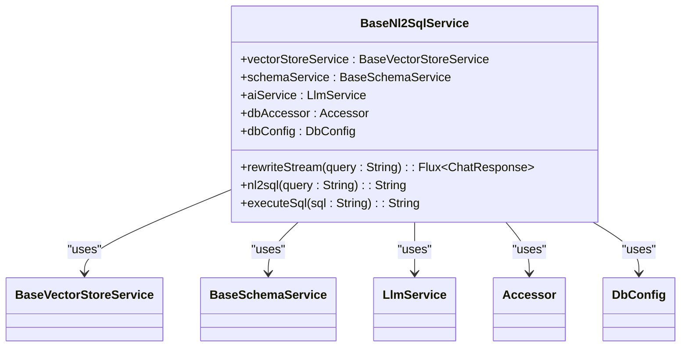
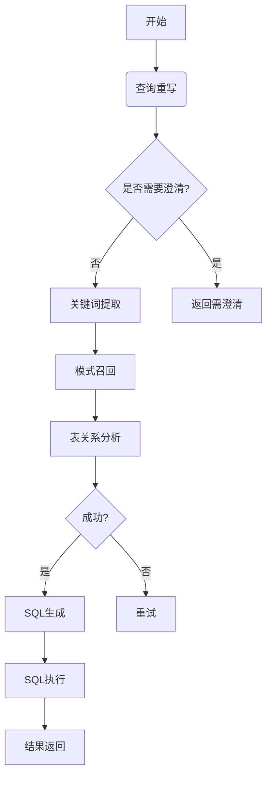
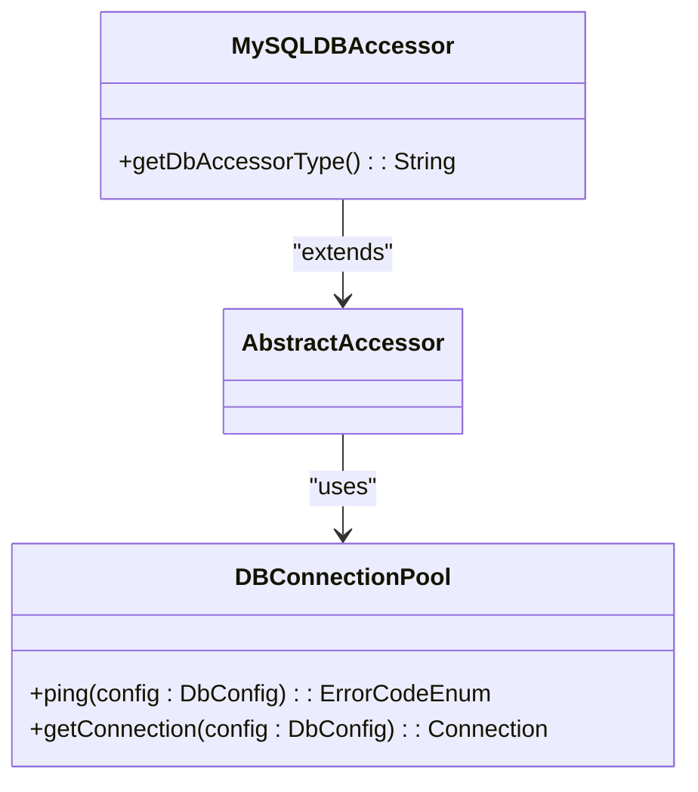

# NL2SQL自然语言转SQL

<cite>
**本文档引用的文件**
- [Nl2sqlConfiguration.java](file://spring-ai-alibaba-nl2sql/spring-ai-alibaba-nl2sql-chat/src/main/java/com/alibaba/cloud/ai/config/Nl2sqlConfiguration.java)
- [BaseNl2SqlService.java](file://spring-ai-alibaba-nl2sql/spring-ai-alibaba-nl2sql-chat/src/main/java/com/alibaba/cloud/ai/service/base/BaseNl2SqlService.java)
- [SqlExecutor.java](file://spring-ai-alibaba-nl2sql/spring-ai-alibaba-nl2sql-common/src/main/java/com/alibaba/cloud/ai/connector/SqlExecutor.java)
- [DBConnectionPool.java](file://spring-ai-alibaba-nl2sql/spring-ai-alibaba-nl2sql-common/src/main/java/com/alibaba/cloud/ai/connector/DBConnectionPool.java)
- [MySQLDBAccessor.java](file://spring-ai-alibaba-nl2sql/spring-ai-alibaba-nl2sql-common/src/main/java/com/alibaba/cloud/ai/connector/mysql/MySQLDBAccessor.java)
- [ChatController.java](file://spring-ai-alibaba-nl2sql/spring-ai-alibaba-nl2sql-management/src/main/java/com/alibaba/cloud/ai/controller/ChatController.java)
- [SimpleChatController.java](file://spring-ai-alibaba-nl2sql/spring-ai-alibaba-nl2sql-management/src/main/java/com/alibaba/cloud/ai/controller/SimpleChatController.java)
</cite>

## 目录
1. [简介](#简介)
2. [项目结构](#项目结构)
3. [核心组件](#核心组件)
4. [架构设计](#架构设计)
5. [数据库支持与连接管理](#数据库支持与连接管理)
6. [查询优化策略](#查询优化策略)
7. [使用示例](#使用示例)
8. [Spring AI框架集成](#spring-ai框架集成)
9. [安全考虑](#安全考虑)
10. [性能优化建议](#性能优化建议)

## 简介
NL2SQL自然语言转SQL功能是基于Spring AI Alibaba框架构建的一项先进技术，旨在让用户能够通过自然语言直接查询数据库，而无需编写复杂的SQL语句。该功能利用大语言模型（LLM）将用户的自然语言查询转换为结构化的数据库查询，并支持多种数据库类型，包括MySQL和PostgreSQL等。

## 项目结构
本项目采用模块化设计，主要由三个部分组成：

```
spring-ai-alibaba-nl2sql/
├── spring-ai-alibaba-nl2sql-management    # 管理端（可直接启动的Web应用）
├── spring-ai-alibaba-nl2sql-chat         # 核心功能（不能独立启动，供集成使用）
└── spring-ai-alibaba-nl2sql-common       # 公共代码
```

其中，`management`模块提供了一个完整的Web界面用于管理和调试智能体；`chat`模块包含了NL2SQL的核心逻辑和服务；`common`模块则封装了通用的数据访问对象（DAO）、配置类和其他共享资源。

**Section sources**
- [README.md](file://spring-ai-alibaba-nl2sql/README.md)

## 核心组件
NL2SQL功能的核心组件主要包括以下几个关键类：

- **NL2SQLChatModel**: 负责处理自然语言到SQL的转换过程。
- **NL2SQLChatMemory**: 管理会话状态和上下文信息。
- **NL2SQLToolCall**: 提供工具调用接口以执行特定任务。

这些组件协同工作，确保从用户输入到最终SQL生成的整个流程高效且准确。

### NL2SQLChatModel分析
`NL2SQLChatModel` 是实现自然语言到SQL转换的核心服务类。它依赖于大语言模型（LLM）来解析用户查询并生成相应的SQL语句。此模型通过一系列步骤完成转换，包括意图识别、关键词提取、模式选择以及最终的SQL生成。

#### 关键方法说明
- `rewriteStream(String query)`: 对输入的自然语言查询进行重写，以便更好地理解其含义。
- `nl2sql(String query)`: 将自然语言查询转换成SQL语句。
- `executeSql(String sql)`: 执行生成的SQL语句并返回结果。



**Diagram sources**
- [BaseNl2SqlService.java](file://spring-ai-alibaba-nl2sql/spring-ai-alibaba-nl2sql-chat/src/main/java/com/alibaba/cloud/ai/service/base/BaseNl2SqlService.java)

**Section sources**
- [BaseNl2SqlService.java](file://spring-ai-alibaba-nl2sql/spring-ai-alibaba-nl2sql-chat/src/main/java/com/alibaba/cloud/ai/service/base/BaseNl2SqlService.java)

### NL2SQLChatMemory分析
`NL2SQLChatMemory` 组件负责维护会话期间的状态信息，如历史对话记录、当前上下文等。这有助于提高后续查询的理解准确性，尤其是在涉及多轮交互的情况下。

### NL2SQLToolCall分析
`NL2SQLToolCall` 模块提供了扩展能力，允许开发者定义额外的工具函数来增强系统的功能性。例如，可以添加数据验证或格式化输出等功能。

## 架构设计
NL2SQL的整体架构采用了状态图（State Graph）的方式组织各个处理节点，每个节点代表一个具体的处理阶段。这种设计使得系统具有良好的可扩展性和灵活性。



**Diagram sources**
- [Nl2sqlConfiguration.java](file://spring-ai-alibaba-nl2sql/spring-ai-alibaba-nl2sql-chat/src/main/java/com/alibaba/cloud/ai/config/Nl2sqlConfiguration.java)

**Section sources**
- [Nl2sqlConfiguration.java](file://spring-ai-alibaba-nl2sql/spring-ai-alibaba-nl2sql-chat/src/main/java/com/alibaba/cloud/ai/config/Nl2sqlConfiguration.java)

## 数据库支持与连接管理
NL2SQL功能支持多种主流数据库，包括但不限于MySQL和PostgreSQL。为了有效管理不同类型的数据库连接，系统引入了抽象层`DBConnectionPool`，它定义了一套标准API用于获取和释放数据库连接。

### MySQL支持
对于MySQL数据库的支持，实现了专门的`MySQLDBAccessor`类，该类继承自通用的`AbstractAccessor`基类，并针对MySQL特性进行了优化。



**Diagram sources**
- [DBConnectionPool.java](file://spring-ai-alibaba-nl2sql/spring-ai-alibaba-nl2sql-common/src/main/java/com/alibaba/cloud/ai/connector/DBConnectionPool.java)
- [MySQLDBAccessor.java](file://spring-ai-alibaba-nl2sql/spring-ai-alibaba-nl2sql-common/src/main/java/com/alibaba/cloud/ai/connector/mysql/MySQLDBAccessor.java)

**Section sources**
- [DBConnectionPool.java](file://spring-ai-alibaba-nl2sql/spring-ai-alibaba-nl2sql-common/src/main/java/com/alibaba/cloud/ai/connector/DBConnectionPool.java)
- [MySQLDBAccessor.java](file://spring-ai-alibaba-nl2sql/spring-ai-alibaba-nl2sql-common/src/main/java/com/alibaba/cloud/ai/connector/mysql/MySQLDBAccessor.java)

### PostgreSQL支持
虽然目前没有找到具体的PostgreSQL适配器实现，但根据现有架构推测，应该存在类似的`PostgreSQLDBAccessor`类来处理PostgreSQL相关的操作。

## 查询优化策略
为了提升查询效率和准确性，NL2SQL采用了多种优化策略：
- **缓存机制**: 利用向量存储技术对常用查询模式进行索引，加快响应速度。
- **错误修复**: 当生成的SQL出现语法错误时，自动尝试修正并重新执行。
- **语义一致性检查**: 在生成SQL后对其进行语义层面的一致性验证，确保逻辑正确无误。

## 使用示例
以下是如何配置和调用NL2SQL功能的具体示例。

### 配置步骤
1. 准备业务数据库，并导入必要的测试数据。
2. 在`application.yml`中配置数据库连接信息。
3. 设置API密钥等相关参数。

### 调用示例
```java
@RestController
@RequestMapping("nl2sql")
public class Nl2sqlController {

    private final CompiledGraph compiledGraph;

    @Autowired
    public Nl2sqlController(@Qualifier("nl2sqlGraph") StateGraph stateGraph) throws GraphStateException {
        this.compiledGraph = stateGraph.compile();
        this.compiledGraph.setMaxIterations(100);
    }

    @GetMapping("/search")
    public String search(@RequestParam String query) throws Exception {
        Optional<OverAllState> call = compiledGraph.call(Map.of(INPUT_KEY, query));
        OverAllState overAllState = call.get();
        return overAllState.value(RESULT).get().toString();
    }
}
```

**Section sources**
- [Nl2sqlController.java](file://spring-ai-alibaba-nl2sql/spring-ai-alibaba-nl2sql-chat/src/main/java/com/alibaba/cloud/ai/graph/Nl2sqlController.java)

## Spring AI框架集成
NL2SQL功能紧密集成了Spring AI框架，利用其提供的聊天客户端（ChatClient）构建器来自动生成所需的图形结构。此外，还利用了Spring Boot的自动配置特性简化了部署过程。

## 安全考虑
在安全性方面，NL2SQL采取了多项措施防止潜在威胁：
- **SQL注入防护**: 通过对输入内容进行严格校验和清理，避免恶意代码注入。
- **权限控制**: 实施细粒度的访问控制策略，限制非授权用户的操作范围。

## 性能优化建议
为了进一步提升性能，建议采取以下措施：
- **合理设置超时时间**: 根据实际需求调整SQL执行的最大等待时间。
- **批量处理请求**: 对于大量并发请求，考虑使用批处理方式减少数据库负担。
- **定期维护索引**: 保持数据库索引处于最佳状态，有助于加速查询速度。