# NL2SQL使用示例文档

<cite>
**本文档引用的文件**
- [README.md](file://spring-ai-alibaba-nl2sql/README.md)
- [Nl2sqlConfiguration.java](file://spring-ai-alibaba-nl2sql/spring-ai-alibaba-nl2sql-chat/src/main/java/com/alibaba/cloud/ai/config/Nl2sqlConfiguration.java)
- [BaseNl2SqlService.java](file://spring-ai-alibaba-nl2sql/spring-ai-alibaba-nl2sql-chat/src/main/java/com/alibaba/cloud/ai/service/base/BaseNl2SqlService.java)
- [Nl2SqlController.java](file://spring-ai-alibaba-nl2sql/spring-ai-alibaba-nl2sql-management/src/main/java/com/alibaba/cloud/ai/controller/Nl2SqlController.java)
- [Application.java](file://spring-ai-alibaba-nl2sql/spring-ai-alibaba-nl2sql-management/src/main/java/com/alibaba/cloud/ai/Application.java)
- [product_db.sql](file://spring-ai-alibaba-nl2sql/docker-file/config/mysql/product_db.sql)
- [china_population_db.sql](file://spring-ai-alibaba-nl2sql/docker-file/config/postgres/china_population_db.sql)
- [application.yml](file://spring-ai-alibaba-nl2sql/spring-ai-alibaba-nl2sql-chat/README.md)
</cite>

## 目录
1. [简介](#简介)
2. [项目结构](#项目结构)
3. [核心组件](#核心组件)
4. [配置指南](#配置指南)
5. [使用示例](#使用示例)
6. [查询示例](#查询示例)
7. [故障排除](#故障排除)
8. [总结](#总结)

## 简介

NL2SQL（Natural Language to SQL）是一个基于Spring AI Alibaba的自然语言转SQL项目，能够让您用自然语言直接查询数据库，无需编写复杂的SQL语句。该项目将阿里云析言GBI中的核心能力进行了模块化改造，提供了一个轻量级的自然语言查询转SQL语句服务。

### 主要特性

- 🔍 基于用户输入的自然语言问题
- 📊 结合数据库Schema和业务逻辑解释（evidence）
- 🤖 通过大模型推理生成精准的SQL查询
- 📈 支持执行SQL并返回格式化结果
- 💻 根据用户问题和SQL查询结果，生成Python数据分析代码

## 项目结构

NL2SQL项目分为三个主要部分：

```mermaid
graph TB
subgraph "NL2SQL项目结构"
A[spring-ai-alibaba-nl2sql-management<br/>管理端应用] --> B[NL2SQL核心功能]
C[spring-ai-alibaba-nl2sql-chat<br/>核心功能模块] --> B
D[spring-ai-alibaba-nl2sql-common<br/>公共代码库] --> B
E[spring-ai-alibaba-nl2sql-web-ui<br/>Web界面] --> A
end
subgraph "核心功能"
F[NL2SQL服务] --> G[Schema召回]
F --> H[SQL生成]
F --> I[SQL执行]
F --> J[Python代码生成]
end
```



**图表来源**
- [README.md](file://spring-ai-alibaba-nl2sql/README.md#L1-L50)

## 核心组件

### NL2SQL服务架构

NL2SQL模块采用Graph状态机设计，包含多个处理节点：

```mermaid
flowchart TD
A[开始] --> B[查询重写]
B --> C[关键词提取]
C --> D[Schema召回]
D --> E[表关系分析]
E --> F[SQL生成]
F --> G[SQL验证]
G --> H[语义一致性检查]
H --> I[SQL执行]
I --> J[Python代码生成]
J --> K[结束]
F --> F1[SQL生成失败]
F1 --> C
G --> G1[SQL语法错误]
G1 --> F
H --> H1[语义不一致]
H1 --> F
```



**图表来源**
- [Nl2sqlConfiguration.java](file://spring-ai-alibaba-nl2sql/spring-ai-alibaba-nl2sql-chat/src/main/java/com/alibaba/cloud/ai/config/Nl2sqlConfiguration.java#L76-L239)

### 核心服务类

#### BaseNl2SqlService

这是主要的对外接口服务类，负责自然语言到SQL的转换流程：

```java
public String nl2sql(String query) throws Exception {
    logger.info("Starting nl2sql conversion for query: {}", query);
    List<String> evidences = extractEvidences(query);
    logger.debug("Extracted {} evidences for nl2sql", evidences.size());
    SchemaDTO schemaDTO = select(query, evidences);
    String sql = generateSql(evidences, query, schemaDTO);
    logger.info("Nl2sql conversion completed. Generated SQL: {}", sql);
    return sql;
}
```

**章节来源**
- [BaseNl2SqlService.java](file://spring-ai-alibaba-nl2sql/spring-ai-alibaba-nl2sql-chat/src/main/java/com/alibaba/cloud/ai/service/base/BaseNl2SqlService.java#L128-L161)

## 配置指南

### 数据库配置

首先需要配置数据库连接信息：

```yaml
spring:
  datasource:
    url: jdbc:mysql://127.0.0.1:3306/nl2sql?useUnicode=true&characterEncoding=utf-8&zeroDateTimeBehavior=convertToNull&transformedBitIsBoolean=true&allowMultiQueries=true&allowPublicKeyRetrieval=true&useSSL=false&serverTimezone=Asia/Shanghai
    username: ${MYSQL_USERNAME:root}
    password: ${MYSQL_PASSWORD:root}
    driver-class-name: com.mysql.cj.jdbc.Driver
    type: com.alibaba.druid.pool.DruidDataSource
```

### AI服务配置

配置大模型服务，支持多种提供商：

```yaml
spring:
  ai:
    # DashScope 配置
    openai:
      base-url: https://dashscope.aliyuncs.com/compatible-mode
      api-key: ${DASHSCOPE_API_KEY}
      model: qwen-max    # 推荐：复杂任务用 qwen-max，一般任务用 qwen-plus
      embedding:
        model: text-embedding-ada-002  # OpenAI Embedding 模型
    
    dashscope:
      api-key: ${DASHSCOPE_API_KEY}
      embedding:
        model: text-embedding-v2  # DashScope Embedding 模型，默认值

# 数据库配置
chatbi:
  dbconfig:
    # 数据源配置
    url: ${JDBC_URL}        # 如：jdbc:mysql://host:port/database
    username: ${DB_USER}
    password: ${DB_PASSWORD}
    
    # 连接参数
    connectiontype: jdbc
    dialecttype: mysql      # 可选：mysql、postgresql
    schema: ${DB_SCHEMA}    # PostgreSQL需要
```

**章节来源**
- [application.yml](file://spring-ai-alibaba-nl2sql/spring-ai-alibaba-nl2sql-chat/README.md#L188-L242)

## 使用示例

### Spring Boot应用集成

#### 1. 添加依赖

在pom.xml中添加NL2SQL Starter依赖：

```xml
<dependency>
    <groupId>com.alibaba.cloud.ai</groupId>
    <artifactId>spring-ai-alibaba-starter-nl2sql</artifactId>
    <version>${spring-ai-alibaba.version}</version>
</dependency>
```

#### 2. 创建NL2SQL控制器

```java
@RestController
@RequestMapping("nl2sql")
public class Nl2sqlController {

    private final Nl2SqlService nl2SqlService;

    @Autowired
    public Nl2sqlController(Nl2SqlService nl2SqlService) {
        this.nl2SqlService = nl2SqlService;
    }

    @GetMapping("/nl2sql")
    public String nl2sql(@RequestParam String query) {
        try {
            return nl2SqlService.nl2sql(query);
        } catch (Exception e) {
            return "Error: " + e.getMessage();
        }
    }
}
```

#### 3. 注入NL2SQLChatModel并调用

```java
@Service
public class MyService {

    private final Nl2SqlService nl2SqlService;

    @Autowired
    public MyService(Nl2SqlService nl2SqlService) {
        this.nl2SqlService = nl2SqlService;
    }

    public String processNaturalLanguageQuery(String naturalLanguage) {
        try {
            // 调用NL2SQL服务生成SQL
            String sql = nl2SqlService.nl2sql(naturalLanguage);
            
            // 执行SQL并获取结果
            String result = executeSqlAndGetResult(sql);
            
            return result;
        } catch (Exception e) {
            throw new RuntimeException("NL2SQL处理失败", e);
        }
    }
}
```

### 完整Spring Boot应用示例

```java
@SpringBootApplication
public class Nl2SqlApplication {

    public static void main(String[] args) {
        SpringApplication.run(Nl2SqlApplication.class, args);
    }

    @Bean
    public CommandLineRunner commandLineRunner(Nl2SqlService nl2SqlService) {
        return args -> {
            // 示例查询
            String query = "查找价格最高的产品";
            
            // 生成SQL
            String sql = nl2SqlService.nl2sql(query);
            System.out.println("生成的SQL: " + sql);
            
            // 执行SQL并获取结果
            String result = nl2SqlService.executeSql(sql);
            System.out.println("查询结果: " + result);
        };
    }
}
```

**章节来源**
- [Nl2SqlController.java](file://spring-ai-alibaba-nl2sql/spring-ai-alibaba-nl2sql-management/src/main/java/com/alibaba/cloud/ai/controller/Nl2SqlController.java#L32-L73)

## 查询示例

### 产品数据库查询示例

基于`product_db.sql`中的表结构，以下是不同复杂度的查询示例：

#### 1. 简单查询

**自然语言**: "查找价格最高的产品"

**生成的SQL**:
```sql
SELECT id, name, price 
FROM products 
ORDER BY price DESC 
LIMIT 1
```

**自然语言**: "查询所有用户的邮箱地址"

**生成的SQL**:
```sql
SELECT email 
FROM users
```

#### 2. 多表连接查询

**自然语言**: "查询每个分类下已经成交且销量最高的商品及其销售总量"

**生成的SQL**:
```sql
WITH CategorySales AS (
    SELECT
        c.id AS category_id,
        c.name AS category_name,
        p.id AS product_id,
        p.name AS product_name,
        SUM(oi.quantity) AS total_sales
    FROM
        categories c
    JOIN
        product_categories pc ON c.id = pc.category_id
    JOIN
        products p ON pc.product_id = p.id
    JOIN
        order_items oi ON p.id = oi.product_id
    JOIN
        orders o ON oi.order_id = o.id
    WHERE
        o.status = 'completed'
    GROUP BY
        c.id, c.name, p.id, p.name
),
MaxSalesPerCategory AS (
    SELECT
        category_id,
        MAX(total_sales) AS max_sales
    FROM
        CategorySales
    GROUP BY
        category_id
)
SELECT
    cs.category_id,
    cs.category_name,
    cs.product_id,
    cs.product_name,
    cs.total_sales
FROM
    CategorySales cs
JOIN
    MaxSalesPerCategory ms ON cs.category_id = ms.category_id AND cs.total_sales = ms.max_sales
```

#### 3. 聚合函数查询

**自然语言**: "统计每个用户的订单总数和总金额"

**生成的SQL**:
```sql
SELECT 
    u.id AS user_id,
    u.username,
    COUNT(o.id) AS order_count,
    SUM(o.total_amount) AS total_spent
FROM 
    users u
LEFT JOIN 
    orders o ON u.id = o.user_id
GROUP BY 
    u.id, u.username
ORDER BY 
    total_spent DESC
```

#### 4. 条件过滤查询

**自然语言**: "查询库存大于100的商品名称和价格"

**生成的SQL**:
```sql
SELECT name, price 
FROM products 
WHERE stock > 100
```

#### 5. 时间范围查询

**自然语言**: "查询2025年6月的所有订单信息"

**生成的SQL**:
```sql
SELECT * 
FROM orders 
WHERE order_date BETWEEN '2025-06-01 00:00:00' AND '2025-06-30 23:59:59'
```

### 中国人口数据库查询示例

基于`china_population_db.sql`中的表结构：

#### 1. 基本统计查询

**自然语言**: "查询2020年中国的人口总数"

**生成的SQL**:
```sql
SELECT total_population 
FROM population_total 
WHERE year = 2020
```

#### 2. 多表关联查询

**自然语言**: "查询2020年广东省的人口总数和城镇化率"

**生成的SQL**:
```sql
SELECT 
    pp.total_population,
    ur.urban_percentage
FROM 
    province_population pp
JOIN 
    urban_rural_distribution ur ON pp.year = ur.year
WHERE 
    pp.province_name = '广东省' AND pp.year = 2020
```

#### 3. 复杂聚合查询

**自然语言**: "按年龄段统计2020年中国的人口分布情况"

**生成的SQL**:
```sql
SELECT 
    age_group,
    SUM(population) AS total_population,
    SUM(population) * 100.0 / (SELECT SUM(population) FROM age_structure WHERE year = 2020) AS percentage
FROM 
    age_structure
WHERE 
    year = 2020
GROUP BY 
    age_group
ORDER BY 
    CASE 
        WHEN age_group = '0-14' THEN 1
        WHEN age_group = '15-64' THEN 2
        WHEN age_group = '65+' THEN 3
    END
```

**章节来源**
- [product_db.sql](file://spring-ai-alibaba-nl2sql/docker-file/config/mysql/product_db.sql#L1-L152)
- [china_population_db.sql](file://spring-ai-alibaba-nl2sql/docker-file/config/postgres/china_population_db.sql#L1-L199)

## 故障排除

### 常见问题及解决方案

#### 1. 数据库连接问题

**问题**: NL2SQL服务无法连接到数据库

**解决方案**:
```yaml
# 检查数据库连接配置
spring:
  datasource:
    url: jdbc:mysql://localhost:3306/product_db
    username: root
    password: your_password
    driver-class-name: com.mysql.cj.jdbc.Driver
```

#### 2. AI模型配置问题

**问题**: 生成的SQL语法错误

**解决方案**:
- 检查AI模型配置
- 确保API密钥正确
- 验证模型参数设置

#### 3. Schema召回问题

**问题**: 查询结果不准确，可能是Schema召回不完整

**解决方案**:
```java
// 手动初始化Schema
SchemaInitRequest schemaInitRequest = new SchemaInitRequest();
schemaInitRequest.setDbConfig(dbConfig);
schemaInitRequest.setTables(Arrays.asList(
    "categories", "order_items", "orders", 
    "products", "users", "product_categories"
));
simpleVectorStoreService.schema(schemaInitRequest);
```

#### 4. 性能优化

**问题**: 查询响应时间过长

**解决方案**:
- 优化数据库索引
- 调整向量检索参数
- 使用AnalyticDB替代SimpleVector

### 日志分析

NL2SQL模块提供了详细的日志输出，可以帮助诊断问题：

```java
// 启用详细日志
logging:
  level:
    com.alibaba.cloud.ai: DEBUG
    com.alibaba.cloud.ai.node: DEBUG
```

## 总结

NL2SQL是一个功能强大的自然语言转SQL工具，通过合理的配置和使用，可以大大简化数据库查询的开发工作。主要优势包括：

1. **易用性**: 无需编写复杂SQL，只需输入自然语言即可
2. **准确性**: 基于大模型和向量检索，生成准确的SQL语句
3. **灵活性**: 支持多种数据库和AI模型提供商
4. **扩展性**: 可以轻松集成到现有的Spring Boot应用中

### 最佳实践建议

1. **合理配置向量存储**: 生产环境推荐使用AnalyticDB
2. **优化Schema召回**: 确保数据库表结构信息完整
3. **监控性能指标**: 关注查询响应时间和成功率
4. **安全考虑**: 使用环境变量管理敏感配置信息

通过本文档的指导，您可以快速上手NL2SQL功能，并将其应用于实际项目中，显著提升数据查询的效率和准确性。