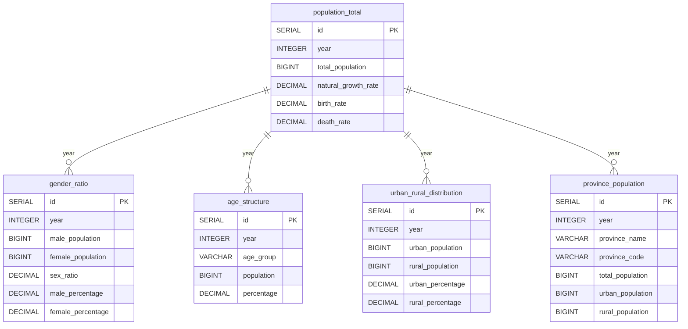
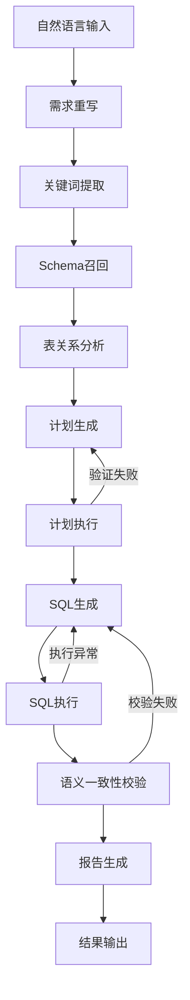
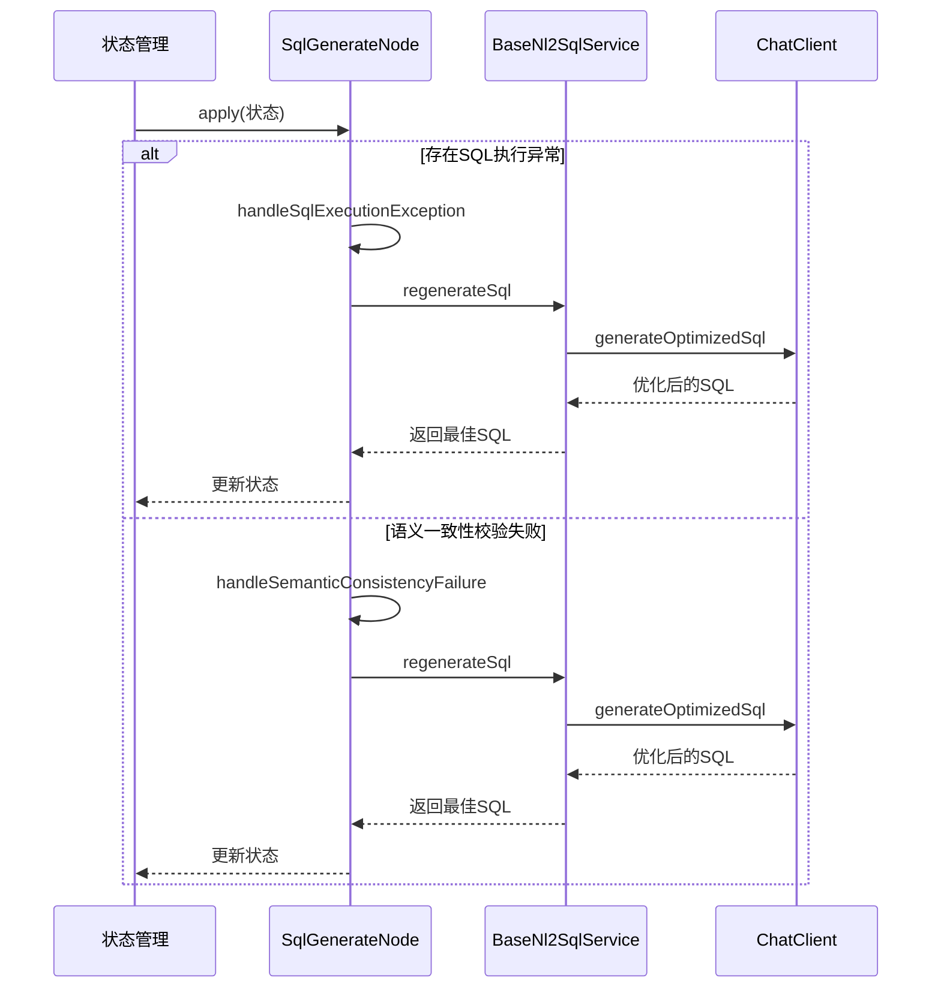
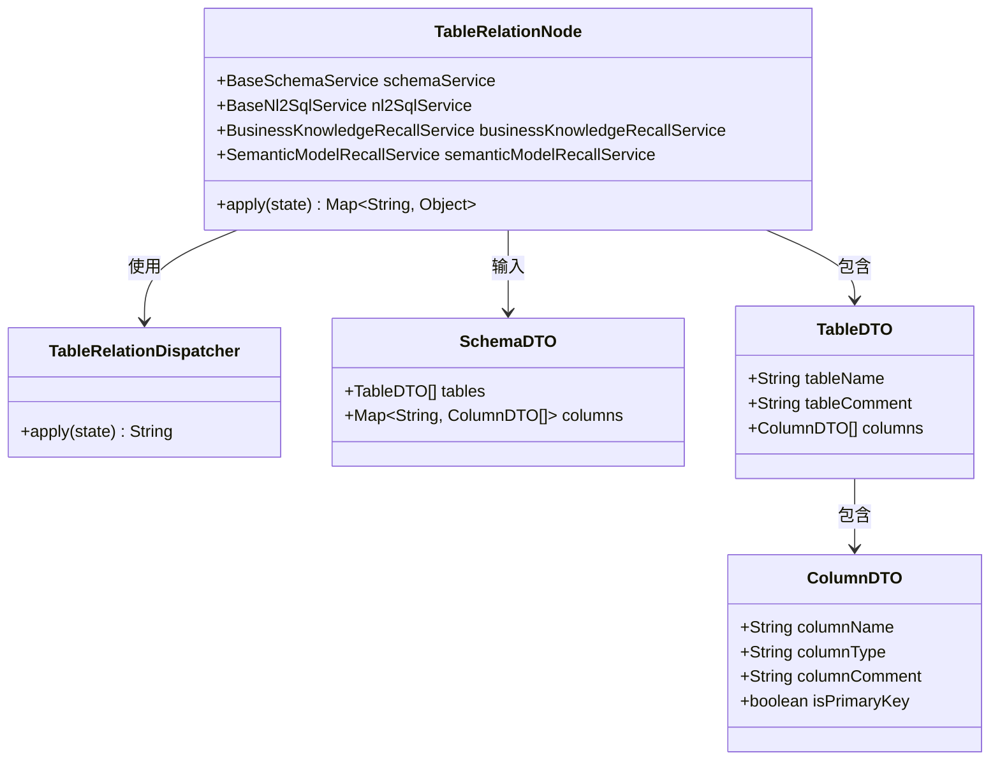

# 复杂查询示例

<cite>
**本文档引用的文件**  
- [china_population_db.sql](file://docker-file/config/postgres/china_population_db.sql)
- [Nl2SqlService.java](file://spring-ai-alibaba-nl2sql/spring-ai-alibaba-nl2sql-chat/src/main/java/com/alibaba/cloud/ai/service/Nl2SqlService.java)
- [SqlGenerateNode.java](file://spring-ai-alibaba-nl2sql/spring-ai-alibaba-nl2sql-chat/src/main/java/com/alibaba/cloud/ai/node/SqlGenerateNode.java)
- [Nl2sqlConfiguration.java](file://spring-ai-alibaba-nl2sql/spring-ai-alibaba-nl2sql-chat/src/main/java/com/alibaba/cloud/ai/config/Nl2sqlConfiguration.java)
- [mix-sql-generator.txt](file://spring-ai-alibaba-nl2sql/spring-ai-alibaba-nl2sql-chat/src/main/resources/prompts/mix-sql-generator.txt)
- [DBConnectionPool.java](file://spring-ai-alibaba-nl2sql/spring-ai-alibaba-nl2sql-common/src/main/java/com/alibaba/cloud/ai/connector/DBConnectionPool.java)
- [Accessor.java](file://spring-ai-alibaba-nl2sql/spring-ai-alibaba-nl2sql-common/src/main/java/com/alibaba/cloud/ai/connector/accessor/Accessor.java)
- [application.yml](file://spring-ai-alibaba-nl2sql/spring-ai-alibaba-nl2sql-management/src/main/resources/application.yml)
</cite>

## 目录
1. [引言](#引言)
2. [数据库结构分析](#数据库结构分析)
3. [复杂查询处理流程](#复杂查询处理流程)
4. [模型参数配置](#模型参数配置)
5. [查询优化器工作流程](#查询优化器工作流程)
6. [表间关系理解与JOIN生成](#表间关系理解与join生成)
7. [性能考虑](#性能考虑)
8. [故障排除指南](#故障排除指南)
9. [结论](#结论)

## 引言
本文档旨在展示如何使用NL2SQL系统处理涉及多表连接、聚合函数和子查询的复杂自然语言请求。基于`china_population_db.sql`中的多表结构，我们将详细说明系统如何将自然语言转换为高效的SQL查询，并解释其内部工作机制。

## 数据库结构分析
`china_population_db.sql`定义了一个包含中国人口统计数据的多表结构，主要表包括：

- **population_total**: 人口总数统计表
- **gender_ratio**: 性别比例统计表
- **age_structure**: 年龄结构统计表
- **urban_rural_distribution**: 城乡分布统计表
- **province_population**: 省份人口统计表

这些表通过年份字段相互关联，形成了一个完整的统计体系。



**图表来源**
- [china_population_db.sql](file://docker-file/config/postgres/china_population_db.sql)

**章节来源**
- [china_population_db.sql](file://docker-file/config/postgres/china_population_db.sql)

## 复杂查询处理流程
当用户提出"找出人口超过1000万的省份及其平均年龄"这样的复杂查询时，系统会经历以下处理流程：

1. 自然语言解析
2. 关键词提取
3. Schema召回
4. 表关系分析
5. SQL生成
6. 查询执行
7. 结果返回

该流程由`Nl2sqlConfiguration`中定义的状态图驱动，确保了查询处理的完整性和可靠性。



**图表来源**
- [Nl2sqlConfiguration.java](file://spring-ai-alibaba-nl2sql/spring-ai-alibaba-nl2sql-chat/src/main/java/com/alibaba/cloud/ai/config/Nl2sqlConfiguration.java)

**章节来源**
- [Nl2sqlConfiguration.java](file://spring-ai-alibaba-nl2sql/spring-ai-alibaba-nl2sql-chat/src/main/java/com/alibaba/cloud/ai/config/Nl2sqlConfiguration.java)

## 模型参数配置
系统通过`application.yml`文件进行核心参数配置，包括AI模型设置和数据库连接信息：

```yaml
spring:
  ai:
    openai:
      base-url: https://dashscope.aliyuncs.com/compatible-mode
      api-key: ${AI_DASHSCOPE_API_KEY}
      model: qwen-max
      embedding:
        model: text-embedding-v4
```

这些配置决定了NL2SQL系统使用的AI模型类型和API访问方式，对查询生成的质量有重要影响。

**章节来源**
- [application.yml](file://spring-ai-alibaba-nl2sql/spring-ai-alibaba-nl2sql-management/src/main/resources/application.yml)

## 查询优化器工作流程
`SqlGenerateNode`实现了复杂的SQL优化流程，能够处理执行异常并重新生成更优的SQL语句。其工作流程如下：



**图表来源**
- [SqlGenerateNode.java](file://spring-ai-alibaba-nl2sql/spring-ai-alibaba-nl2sql-chat/src/main/java/com/alibaba/cloud/ai/node/SqlGenerateNode.java)

**章节来源**
- [SqlGenerateNode.java](file://spring-ai-alibaba-nl2sql/spring-ai-alibaba-nl2sql-chat/src/main/java/com/alibaba/cloud/ai/node/SqlGenerateNode.java)

## 表间关系理解与JOIN生成
系统通过`TableRelationNode`和`TableRelationDispatcher`组件来理解和分析表间关系。对于"人口超过1000万的省份及其平均年龄"这样的查询，系统需要理解`province_population`和`age_structure`两个表之间的关系，并生成适当的JOIN语句。



**图表来源**
- [SqlGenerateNode.java](file://spring-ai-alibaba-nl2sql/spring-ai-alibaba-nl2sql-chat/src/main/java/com/alibaba/cloud/ai/node/SqlGenerateNode.java)
- [Nl2sqlConfiguration.java](file://spring-ai-alibaba-nl2sql/spring-ai-alibaba-nl2sql-chat/src/main/java/com/alibaba/cloud/ai/config/Nl2sqlConfiguration.java)

**章节来源**
- [SqlGenerateNode.java](file://spring-ai-alibaba-nl2sql/spring-ai-alibaba-nl2sql-chat/src/main/java/com/alibaba/cloud/ai/node/SqlGenerateNode.java)
- [Nl2sqlConfiguration.java](file://spring-ai-alibaba-nl2sql/spring-ai-alibaba-nl2sql-chat/src/main/java/com/alibaba/cloud/ai/config/Nl2sqlConfiguration.java)

## 性能考虑
系统在多个层面进行了性能优化：

1. **数据库层面**: 在关键字段上创建索引以提高查询性能
2. **缓存机制**: 支持多种缓存策略减少重复计算
3. **流式处理**: 使用流式响应避免大结果集的内存压力
4. **连接池**: 使用数据库连接池管理数据库连接

数据库索引创建示例如下：
```sql
CREATE INDEX idx_province_year ON province_population(year);
CREATE INDEX idx_province_code ON province_population(province_code);
```

**章节来源**
- [china_population_db.sql](file://docker-file/config/postgres/china_population_db.sql)

## 故障排除指南
当遇到复杂查询问题时，可以按照以下步骤进行排查：

1. 检查数据库连接是否正常
2. 验证表结构和数据是否存在
3. 检查AI模型配置是否正确
4. 查看日志中的错误信息
5. 确认自然语言请求是否清晰明确

系统提供了详细的日志记录功能，可以帮助定位问题所在。

**章节来源**
- [Nl2SqlService.java](file://spring-ai-alibaba-nl2sql/spring-ai-alibaba-nl2sql-chat/src/main/java/com/alibaba/cloud/ai/service/Nl2SqlService.java)
- [SqlGenerateNode.java](file://spring-ai-alibaba-nl2sql/spring-ai-alibaba-nl2sql-chat/src/main/java/com/alibaba/cloud/ai/node/SqlGenerateNode.java)

## 结论
本文档展示了NL2SQL系统处理复杂查询的能力，从多表结构分析到查询优化器的工作流程，全面介绍了系统如何将自然语言转换为高效的SQL查询。通过合理的配置和优化，系统能够准确理解用户意图并生成高质量的SQL语句，为数据分析提供了强大的支持。