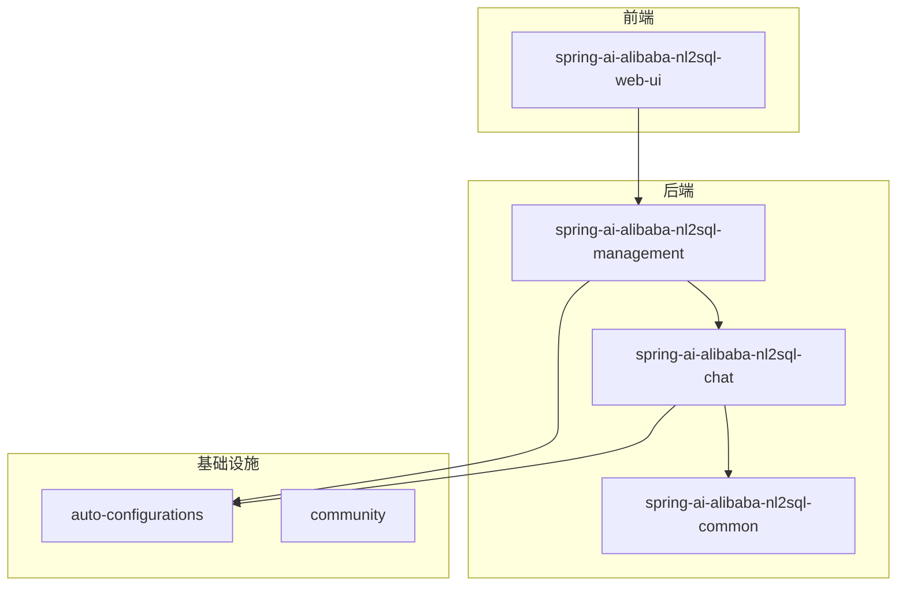
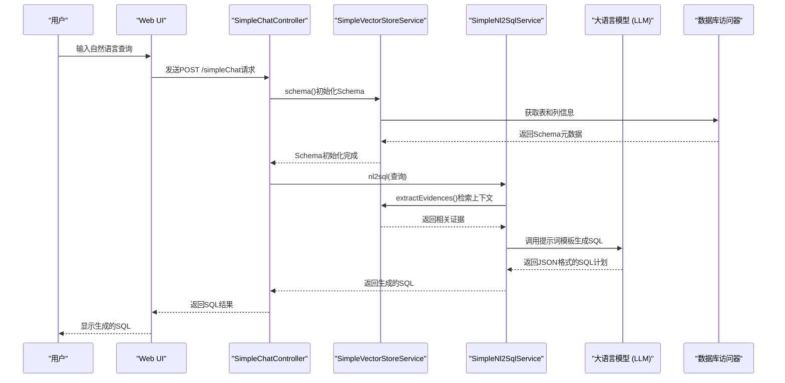
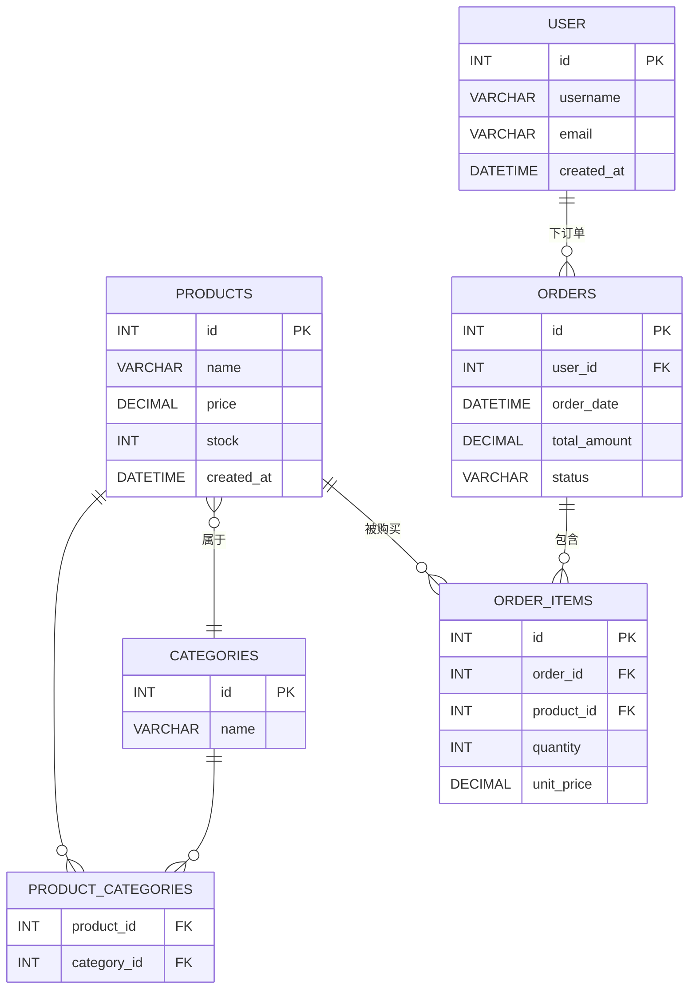

# 简单查询示例

<cite>
**本文档引用的文件**
- [product_db.sql](file://spring-ai-alibaba-nl2sql/docker-file/config/mysql/product_db.sql)
- [SimpleChatController.java](file://spring-ai-alibaba-nl2sql/spring-ai-alibaba-nl2sql-management/src/main/java/com/alibaba/cloud/ai/controller/SimpleChatController.java)
- [BaseNl2SqlService.java](file://spring-ai-alibaba-nl2sql/spring-ai-alibaba-nl2sql-chat/src/main/java/com/alibaba/cloud/ai/service/base/BaseNl2SqlService.java)
- [SimpleNl2SqlService.java](file://spring-ai-alibaba-nl2sql/spring-ai-alibaba-nl2sql-chat/src/main/java/com/alibaba/cloud/ai/service/simple/SimpleNl2SqlService.java)
- [application.yml](file://spring-ai-alibaba-nl2sql/spring-ai-alibaba-nl2sql-management/src/main/resources/application.yml)
- [planner-nl2sql-only.txt](file://spring-ai-alibaba-nl2sql/spring-ai-alibaba-nl2sql-chat/src/main/resources/prompts/planner-nl2sql-only.txt)
- [PromptConstant.java](file://spring-ai-alibaba-nl2sql/spring-ai-alibaba-nl2sql-chat/src/main/java/com/alibaba/cloud/ai/prompt/PromptConstant.java)
</cite>

## 目录
1. [简介](#简介)
2. [项目结构](#项目结构)
3. [核心组件](#核心组件)
4. [架构概述](#架构概述)
5. [详细组件分析](#详细组件分析)
6. [依赖分析](#依赖分析)
7. [性能考虑](#性能考虑)
8. [故障排除指南](#故障排除指南)
9. [结论](#结论)

## 简介
本文档旨在为基于`product_db.sql`产品表结构的NL2SQL简单查询功能提供使用示例。文档将展示如何将“查找价格最高的产品”、“列出所有电子产品”等自然语言查询转换为对应的SELECT语句，并提供完整的Spring Boot代码示例，包括`application.yml`配置和NL2SQLChatModel的调用方式。此外，文档还将详细说明提示词模板在简单查询中的作用机制，以及如何通过调整temperature等参数影响生成的SQL质量。

## 项目结构
本项目是一个典型的Spring Boot多模块应用，专注于实现自然语言到SQL（NL2SQL）的转换功能。项目主要由以下几个模块组成：

- **spring-ai-alibaba-nl2sql**: 核心模块，包含NL2SQL的主要功能实现。
  - **spring-ai-alibaba-nl2sql-chat**: 包含NL2SQL服务的核心业务逻辑、提示词模板和向量存储服务。
  - **spring-ai-alibaba-nl2sql-common**: 共享的枚举、请求对象和工具类。
  - **spring-ai-alibaba-nl2sql-management**: 后端管理模块，提供REST API和Web UI的后端支持。
  - **spring-ai-alibaba-nl2sql-web-ui**: 前端用户界面，使用Vue.js构建。
- **auto-configurations**: 包含各种自动配置类，如DashScope模型、内存管理和Nacos提示模板等。
- **community**: 包含社区贡献的各种启动器，如文档解析器、数据读取器和向量存储。

数据库脚本位于`spring-ai-alibaba-nl2sql/docker-file/config/mysql/product_db.sql`，定义了`product_db`数据库及其相关的表结构。



**图表来源**
- [product_db.sql](file://spring-ai-alibaba-nl2sql/docker-file/config/mysql/product_db.sql)
- [pom.xml](file://spring-ai-alibaba-nl2sql/pom.xml)

**章节来源**
- [pom.xml](file://spring-ai-alibaba-nl2sql/pom.xml)

## 核心组件
本节介绍NL2SQL功能的核心组件，这些组件协同工作以实现从自然语言到SQL的转换。

- **SimpleChatController**: 提供`/simpleChat` REST API端点，是外部系统与NL2SQL服务交互的主要入口。
- **SimpleNl2SqlService**: 继承自`BaseNl2SqlService`，是执行NL2SQL转换的核心服务类。
- **BaseNl2SqlService**: 定义了NL2SQL转换的基础流程，包括提取证据、选择模式和生成SQL。
- **SimpleVectorStoreService**: 负责将数据库Schema信息初始化并存储到向量库中，以便后续进行检索。
- **LlmService**: 封装了对大语言模型（LLM）的调用，用于生成SQL和重写查询。
- **Accessor**: 数据库访问器，用于执行最终生成的SQL语句并返回结果。

**章节来源**
- [SimpleChatController.java](file://spring-ai-alibaba-nl2sql/spring-ai-alibaba-nl2sql-management/src/main/java/com/alibaba/cloud/ai/controller/SimpleChatController.java)
- [SimpleNl2SqlService.java](file://spring-ai-alibaba-nl2sql/spring-ai-alibaba-nl2sql-chat/src/main/java/com/alibaba/cloud/ai/service/simple/SimpleNl2SqlService.java)
- [BaseNl2SqlService.java](file://spring-ai-alibaba-nl2sql/spring-ai-alibaba-nl2sql-chat/src/main/java/com/alibaba/cloud/ai/service/base/BaseNl2SqlService.java)

## 架构概述
NL2SQL系统的整体架构遵循一个清晰的流程：接收自然语言输入 -> 初始化数据库Schema -> 检索相关上下文 -> 生成SQL -> 执行SQL并返回结果。



**图表来源**
- [SimpleChatController.java](file://spring-ai-alibaba-nl2sql/spring-ai-alibaba-nl2sql-management/src/main/java/com/alibaba/cloud/ai/controller/SimpleChatController.java)
- [BaseNl2SqlService.java](file://spring-ai-alibaba-nl2sql/spring-ai-alibaba-nl2sql-chat/src/main/java/com/alibaba/cloud/ai/service/base/BaseNl2SqlService.java)
- [SimpleVectorStoreService.java](file://spring-ai-alibaba-nl2sql/spring-ai-alibaba-nl2sql-chat/src/main/java/com/alibaba/cloud/ai/service/simple/SimpleVectorStoreService.java)

## 详细组件分析
### SimpleChatController 分析
`SimpleChatController`是NL2SQL功能的API网关。它暴露了一个`/simpleChat`端点来处理用户的自然语言查询。

当收到查询时，控制器首先会调用`SimpleVectorStoreService`的`schema()`方法来确保数据库的Schema信息已经加载到向量库中。这一步骤对于后续的上下文检索至关重要。然后，控制器将查询委托给`SimpleNl2SqlService`的`nl2sql()`方法来生成最终的SQL语句。

```java
@PostMapping("/simpleChat")
public String simpleNl2Sql(@RequestBody String input) throws Exception {
    // ... 初始化Schema ...
    return simpleNl2SqlService.nl2sql(input);
}
```

**图表来源**
- [SimpleChatController.java](file://spring-ai-alibaba-nl2sql/spring-ai-alibaba-nl2sql-management/src/main/java/com/alibaba/cloud/ai/controller/SimpleChatController.java#L33-L54)

**章节来源**
- [SimpleChatController.java](file://spring-ai-alibaba-nl2sql/spring-ai-alibaba-nl2sql-management/src/main/java/com/alibaba/cloud/ai/controller/SimpleChatController.java)

### BaseNl2SqlService 分析
`BaseNl2SqlService`是NL2SQL转换逻辑的核心。其`nl2sql()`方法定义了标准的处理流程：
1.  **提取证据 (extractEvidences)**: 使用向量检索技术，根据用户查询从向量库中找出最相关的数据库Schema片段（如表名、列名、注释）。
2.  **选择模式 (select)**: 结合原始查询和检索到的证据，确定需要操作的具体数据库表和字段。
3.  **生成SQL (generateSql)**: 利用大语言模型（LLM），结合检索到的Schema信息，生成符合要求的SQL查询语句。

该服务还提供了`rewrite()`方法，用于对模糊或闲聊性质的查询进行重写或拒绝。

```java
public String nl2sql(String query) throws Exception {
    List<String> evidences = extractEvidences(query);
    SchemaDTO schemaDTO = select(query, evidences);
    String sql = generateSql(evidences, query, schemaDTO);
    return sql;
}
```

**图表来源**
- [BaseNl2SqlService.java](file://spring-ai-alibaba-nl2sql/spring-ai-alibaba-nl2sql-chat/src/main/java/com/alibaba/cloud/ai/service/base/BaseNl2SqlService.java#L128-L161)

**章节来源**
- [BaseNl2SqlService.java](file://spring-ai-alibaba-nl2sql/spring-ai-alibaba-nl2sql-chat/src/main/java/com/alibaba/cloud/ai/service/base/BaseNl2SqlService.java)

### 提示词模板分析
提示词模板是引导大语言模型生成正确SQL的关键。`planner-nl2sql-only.txt`模板定义了严格的输出格式和思考过程。

该模板要求LLM必须仅输出一个有效的JSON对象，其中包含`thought_process`（思维过程）和`execution_plan`（执行计划）。执行计划中指定了要使用的工具（`SQL_EXECUTE_NODE`）和具体的SQL查询。

例如，对于查询“查找价格最高的产品”，提示词会结合`products`表的Schema，引导LLM生成如下JSON：
```json
{
  "thought_process": "用户想找到价格最高的产品。我确认了`products`表中有`price`字段。因此，我构造了一个SQL查询，按价格降序排列并限制只返回一条记录。",
  "execution_plan": [
    {
      "step": 1,
      "tool_to_use": "SQL_EXECUTE_NODE",
      "tool_parameters": {
        "sql_query": "SELECT * FROM products ORDER BY price DESC LIMIT 1;",
        "description": "查询价格最高的产品。"
      }
    }
  ]
}
```

**图表来源**
- [planner-nl2sql-only.txt](file://spring-ai-alibaba-nl2sql/spring-ai-alibaba-nl2sql-chat/src/main/resources/prompts/planner-nl2sql-only.txt)
- [PromptConstant.java](file://spring-ai-alibaba-nl2sql/spring-ai-alibaba-nl2sql-chat/src/main/java/com/alibaba/cloud/ai/prompt/PromptConstant.java#L44-L82)

**章节来源**
- [planner-nl2sql-only.txt](file://spring-ai-alibaba-nl2sql/spring-ai-alibaba-nl2sql-chat/src/main/resources/prompts/planner-nl2sql-only.txt)

## 依赖分析
本系统依赖于多个关键组件和库来实现其功能。



**图表来源**
- [product_db.sql](file://spring-ai-alibaba-nl2sql/docker-file/config/mysql/product_db.sql)

**章节来源**
- [product_db.sql](file://spring-ai-alibaba-nl2sql/docker-file/config/mysql/product_db.sql)

## 性能考虑
- **向量库初始化**: `SimpleVectorStoreService.schema()`方法在每次查询前都会被调用，但实际的Schema加载可能只需要在应用启动时执行一次。可以考虑优化此逻辑，避免重复初始化。
- **LLM调用延迟**: 生成SQL的核心步骤依赖于对大语言模型的远程调用，这通常是整个流程中最耗时的部分。启用流式响应（streaming）可以改善用户体验。
- **数据库连接池**: 配置中使用了Druid作为数据库连接池，这是一个高性能的选择，有助于管理数据库连接。

## 故障排除指南
- **问题**: 查询返回错误或空结果。
  - **检查**: 确保`SimpleVectorStoreService.schema()`已成功执行，数据库Schema已正确加载。
  - **检查**: 验证`application.yml`中的数据库连接配置是否正确。
- **问题**: 生成的SQL语法错误。
  - **检查**: 检查提示词模板是否正确地传递了数据库Schema信息。
  - **检查**: 考虑调整LLM的`temperature`参数。较低的值（如0.3）会使输出更确定和一致，而较高的值（如0.8）会增加创造性但也可能导致更多错误。
- **问题**: LLM调用超时。
  - **检查**: 确认`AI_DASHSCOPE_API_KEY`环境变量已正确设置，并且网络可以访问DashScope API。

**章节来源**
- [application.yml](file://spring-ai-alibaba-nl2sql/spring-ai-alibaba-nl2sql-management/src/main/resources/application.yml)

## 结论
本文档详细介绍了Spring AI Alibaba项目中NL2SQL简单查询功能的实现。通过分析`product_db.sql`中的表结构，我们展示了如何将自然语言查询转换为精确的SQL语句。核心流程涉及使用向量存储来检索数据库Schema上下文，并利用精心设计的提示词模板引导大语言模型生成正确的SQL。提供的Spring Boot代码示例和配置说明为开发者集成和使用此功能提供了清晰的指导。未来的工作可以集中在优化性能、增强错误处理和扩展对更复杂查询的支持上。