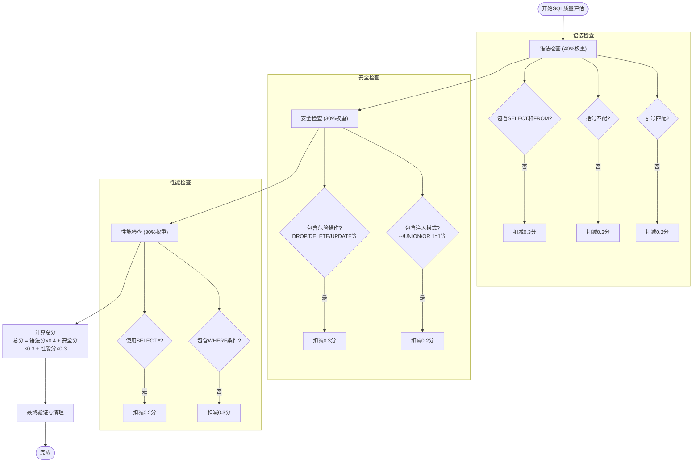

# 安全与防护

<cite>
**本文档中引用的文件**
- [SqlGenerateNode.java](file://spring-ai-alibaba-nl2sql/spring-ai-alibaba-nl2sql-chat/src/main/java/com/alibaba/cloud/ai/node/SqlGenerateNode.java)
- [ErrorCodeEnum.java](file://spring-ai-alibaba-nl2sql/spring-ai-alibaba-nl2sql-common/src/main/java/com/alibaba/cloud/ai/enums/ErrorCodeEnum.java)
</cite>

## 目录
1. [SQL注入防护机制](#sql注入防护机制)
2. [错误码定义与处理策略](#错误码定义与处理策略)
3. [安全验证流程](#安全验证流程)
4. [最佳实践建议](#最佳实践建议)

## SQL注入防护机制

NL2SQL系统通过多层安全检测机制来防止SQL注入攻击，主要由`SqlGenerateNode`类中的`validateSqlSecurity`方法实现。该机制结合了正则表达式匹配和语法分析技术，对生成的SQL语句进行全面的安全性评估。

系统采用基于权重的评分体系，其中安全检查占总分的30%。防护机制主要包括两个层面：

1. **危险操作检测**：系统会检测常见的危险SQL关键字，包括DROP、DELETE、UPDATE、INSERT、ALTER、CREATE和TRUNCATE等数据修改或结构变更操作。一旦发现这些关键字，将扣除0.3分的安全分值，并记录警告日志。

2. **SQL注入模式检测**：系统识别常见的SQL注入攻击模式，如注释符"--"、"/*"、"*/"，以及典型的绕过认证的注入模式"UNION"、"OR 1=1"、"OR '1'='1'"等。检测到这些模式时，将扣除0.2分的安全分值。

这种双重检测机制确保了即使攻击者尝试使用编码、混淆或其他变体技术进行SQL注入，系统也能有效识别并阻止潜在的恶意查询。

**Section sources**
- [SqlGenerateNode.java](file://spring-ai-alibaba-nl2sql/spring-ai-alibaba-nl2sql-chat/src/main/java/com/alibaba/cloud/ai/node/SqlGenerateNode.java#L321-L379)

## 错误码定义与处理策略

系统通过`ErrorCodeEnum`枚举类定义了全面的错误码体系，用于标准化异常处理和用户反馈。每个错误码都包含标准的SQLState代码和对应的中文提示信息，便于开发者和用户理解问题本质。

### 主要错误类别及处理策略

| 错误码 | 错误类型 | 处理策略 |
|--------|---------|---------|
| 08S01, 08001 | 数据源连接失败 | 检查网络配置，确认IP/域名正确性，或将服务IP加入数据库白名单 |
| 28P01, 28000 | 密码错误 | 验证凭据信息，重新输入正确的密码 |
| 3D000, 42000 | 数据库不存在 | 确认数据库名称是否正确，检查数据库实例状态 |
| 42501 | 权限不足 | 联系数据库管理员获取必要的访问权限 |
| 3D070 | 模式不存在 | 验证模式名称，确认模式在目标数据库中已创建 |
| 01S00 | 时区参数错误 | 检查时区配置参数，确保格式正确 |
| 08P01 | SSL连接错误 | 验证SSL配置，检查证书有效性 |

系统提供了两种错误码查找方法：
- `fromCode(String code)`：根据错误码查找对应的枚举值，若未找到则返回OTHERS（未知错误）
- `fromCodeWithSuccess(String code)`：根据错误码查找对应的枚举值，若未找到则返回SUCCESS（操作成功）

这种设计既保证了错误处理的完整性，又提供了灵活的默认行为选择。

**Section sources**
- [ErrorCodeEnum.java](file://spring-ai-alibaba-nl2sql/spring-ai-alibaba-nl2sql-common/src/main/java/com/alibaba/cloud/ai/enums/ErrorCodeEnum.java#L10-L167)

## 安全验证流程

NL2SQL系统的安全验证是一个多阶段的过程，确保生成的SQL语句在执行前经过全面的质量评估。验证流程由`evaluateSqlQuality`方法协调，综合考虑语法、安全性和性能三个维度。

**Diagram sources**
- [SqlGenerateNode.java](file://spring-ai-alibaba-nl2sql/spring-ai-alibaba-nl2sql-chat/src/main/java/com/alibaba/cloud/ai/node/SqlGenerateNode.java#L266-L379)

**Section sources**
- [SqlGenerateNode.java](file://spring-ai-alibaba-nl2sql/spring-ai-alibaba-nl2sql-chat/src/main/java/com/alibaba/cloud/ai/node/SqlGenerateNode.java#L266-L379)

## 最佳实践建议

为了确保NL2SQL系统的安全稳定运行，建议开发者遵循以下最佳实践：

### 安全规则配置建议
1. **自定义危险关键字列表**：根据实际业务需求扩展`dangerousKeywords`数组，添加特定于业务场景的限制性操作。
2. **调整评分权重**：在`evaluateSqlQuality`方法中，可根据安全要求调整语法、安全和性能检查的权重比例。
3. **增强注入模式检测**：定期更新`injectionPatterns`数组，纳入新发现的SQL注入变体模式。

### 异常处理最佳实践
1. **分级响应策略**：根据错误码分类实施不同的响应措施，如连接失败可自动重试，而权限问题应引导用户联系管理员。
2. **用户友好提示**：利用`ErrorCodeEnum`中的中文消息为用户提供清晰的问题描述和解决方案建议。
3. **日志监控**：重点关注安全检查中的警告日志，建立实时告警机制以快速响应潜在的安全威胁。

### 系统优化建议
1. **多轮优化机制**：利用系统内置的多轮SQL优化功能（MAX_OPTIMIZATION_ROUNDS），持续改进生成的SQL质量。
2. **缓存策略**：对频繁执行的查询结果实施适当的缓存策略，同时确保缓存数据的安全性。
3. **定期审计**：定期审查生成的SQL语句和安全日志，及时发现并修复潜在的安全漏洞。

通过遵循这些最佳实践，可以最大限度地发挥NL2SQL系统的安全防护能力，确保自然语言到SQL转换过程的安全可靠。

**Section sources**
- [SqlGenerateNode.java](file://spring-ai-alibaba-nl2sql/spring-ai-alibaba-nl2sql-chat/src/main/java/com/alibaba/cloud/ai/node/SqlGenerateNode.java#L266-L379)
- [ErrorCodeEnum.java](file://spring-ai-alibaba-nl2sql/spring-ai-alibaba-nl2sql-common/src/main/java/com/alibaba/cloud/ai/enums/ErrorCodeEnum.java#L10-L167)