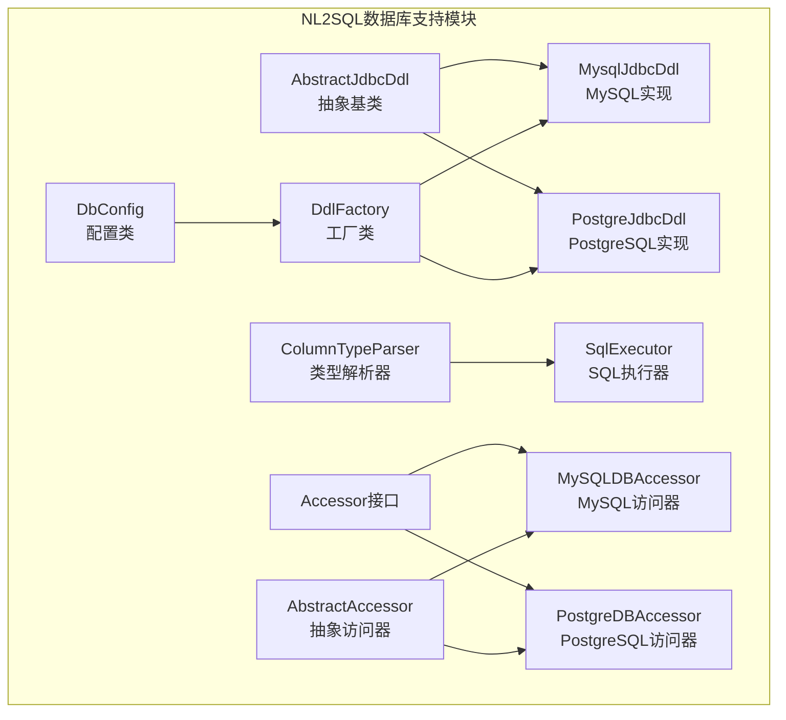
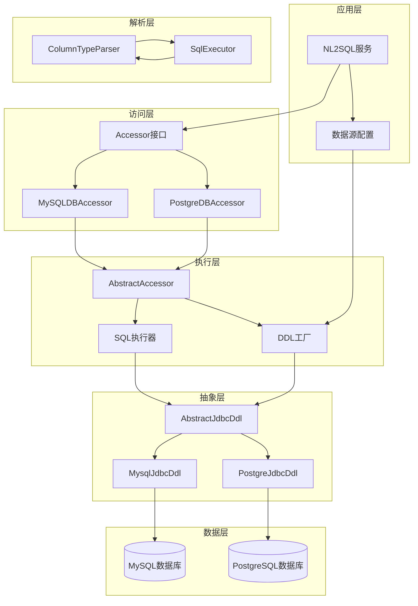
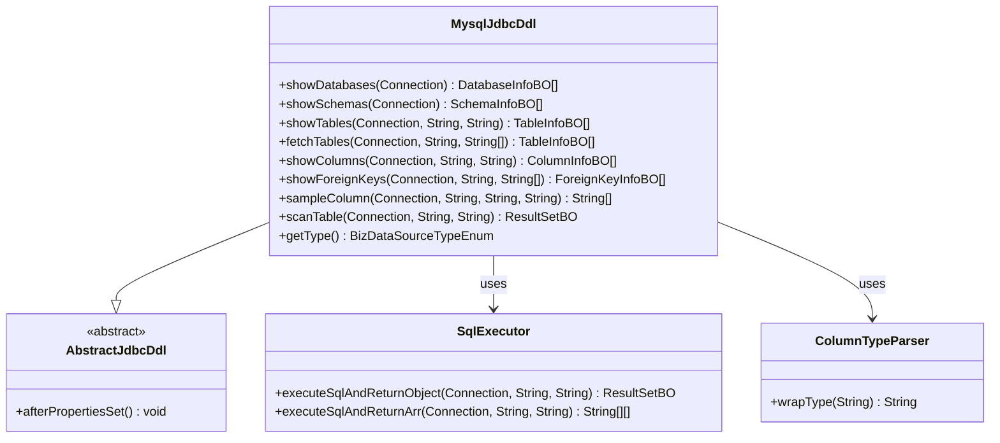
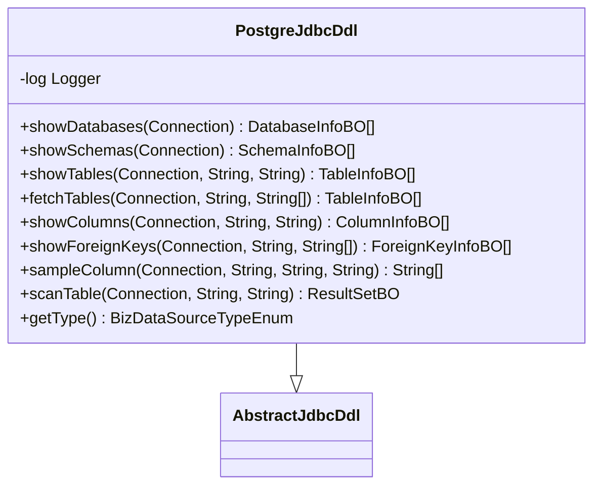
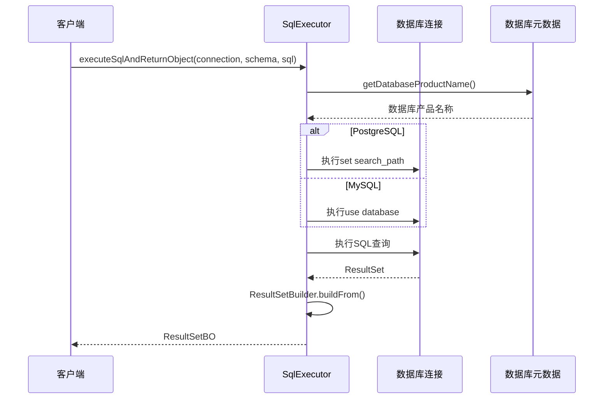
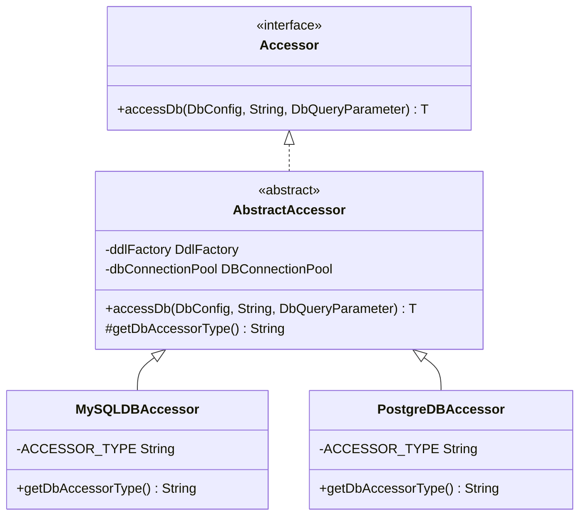
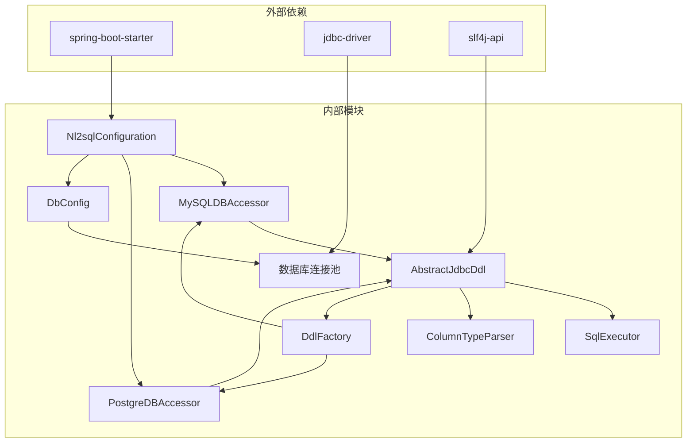

# 数据库支持

<cite>
**本文档中引用的文件**
- [AbstractJdbcDdl.java](file://spring-ai-alibaba-nl2sql/spring-ai-alibaba-nl2sql-common/src/main/java/com/alibaba/cloud/ai/connector/AbstractJdbcDdl.java)
- [MysqlJdbcDdl.java](file://spring-ai-alibaba-nl2sql/spring-ai-alibaba-nl2sql-common/src/main/java/com/alibaba/cloud/ai/connector/mysql/MysqlJdbcDdl.java)
- [PostgreJdbcDdl.java](file://spring-ai-alibaba-nl2sql/spring-ai-alibaba-nl2sql-common/src/main/java/com/alibaba/cloud/ai/connector/postgre/PostgreJdbcDdl.java)
- [ColumnTypeParser.java](file://spring-ai-alibaba-nl2sql/spring-ai-alibaba-nl2sql-common/src/main/java/com/alibaba/cloud/ai/connector/ColumnTypeParser.java)
- [SqlExecutor.java](file://spring-ai-alibaba-nl2sql/spring-ai-alibaba-nl2sql-common/src/main/java/com/alibaba/cloud/ai/connector/SqlExecutor.java)
- [DbConfig.java](file://spring-ai-alibaba-nl2sql/spring-ai-alibaba-nl2sql-common/src/main/java/com/alibaba/cloud/ai/connector/config/DbConfig.java)
- [DatabaseDialectEnum.java](file://spring-ai-alibaba-nl2sql/spring-ai-alibaba-nl2sql-common/src/main/java/com/alibaba/cloud/ai/enums/DatabaseDialectEnum.java)
- [BizDataSourceTypeEnum.java](file://spring-ai-alibaba-nl2sql/spring-ai-alibaba-nl2sql-common/src/main/java/com/alibaba/cloud/ai/enums/BizDataSourceTypeEnum.java)
- [MySQLDBAccessor.java](file://spring-ai-alibaba-nl2sql/spring-ai-alibaba-nl2sql-common/src/main/java/com/alibaba/cloud/ai/connector/mysql/MySQLDBAccessor.java)
- [PostgreDBAccessor.java](file://spring-ai-alibaba-nl2sql/spring-ai-alibaba-nl2sql-common/src/main/java/com/alibaba/cloud/ai/connector/postgre/PostgreDBAccessor.java)
- [AbstractAccessor.java](file://spring-ai-alibaba-nl2sql/spring-ai-alibaba-nl2sql-common/src/main/java/com/alibaba/cloud/ai/connector/accessor/defaults/AbstractAccessor.java)
- [DdlFactory.java](file://spring-ai-alibaba-nl2sql/spring-ai-alibaba-nl2sql-common/src/main/java/com/alibaba/cloud/ai/connector/support/DdlFactory.java)
- [Nl2sqlConfiguration.java](file://spring-ai-alibaba-nl2sql/spring-ai-alibaba-nl2sql-chat/src/main/java/com/alibaba/cloud/ai/config/Nl2sqlConfiguration.java)
</cite>

## 目录
1. [简介](#简介)
2. [项目结构](#项目结构)
3. [核心组件](#核心组件)
4. [架构概览](#架构概览)
5. [详细组件分析](#详细组件分析)
6. [依赖关系分析](#依赖关系分析)
7. [性能考虑](#性能考虑)
8. [故障排除指南](#故障排除指南)
9. [结论](#结论)

## 简介

NL2SQL系统通过精心设计的数据库抽象层，为MySQL和PostgreSQL数据库提供了全面的支持。该系统采用面向对象的设计模式，通过AbstractJdbcDdl基类为不同数据库提供统一的DDL操作接口，并通过MysqlDdl和PostgreDdl实现特定于数据库的方言处理。

系统的核心设计理念是通过工厂模式和策略模式，实现数据库无关的操作接口，同时保持各数据库特有功能的完整性。这种设计使得NL2SQL能够无缝支持多种数据库类型，为用户提供一致的使用体验。

## 项目结构

NL2SQL数据库支持模块的项目结构如下：



**图表来源**
- [AbstractJdbcDdl.java](file://spring-ai-alibaba-nl2sql/spring-ai-alibaba-nl2sql-common/src/main/java/com/alibaba/cloud/ai/connector/AbstractJdbcDdl.java#L1-L55)
- [MysqlJdbcDdl.java](file://spring-ai-alibaba-nl2sql/spring-ai-alibaba-nl2sql-common/src/main/java/com/alibaba/cloud/ai/connector/mysql/MysqlJdbcDdl.java#L1-L250)
- [PostgreJdbcDdl.java](file://spring-ai-alibaba-nl2sql/spring-ai-alibaba-nl2sql-common/src/main/java/com/alibaba/cloud/ai/connector/postgre/PostgreJdbcDdl.java#L1-L293)

**章节来源**
- [AbstractJdbcDdl.java](file://spring-ai-alibaba-nl2sql/spring-ai-alibaba-nl2sql-common/src/main/java/com/alibaba/cloud/ai/connector/AbstractJdbcDdl.java#L1-L55)
- [DbConfig.java](file://spring-ai-alibaba-nl2sql/spring-ai-alibaba-nl2sql-common/src/main/java/com/alibaba/cloud/ai/connector/config/DbConfig.java#L1-L93)

## 核心组件

### AbstractJdbcDdl 抽象基类

AbstractJdbcDdl是所有数据库DDL操作的基础抽象类，它定义了统一的接口规范，确保不同数据库实现的一致性：

```java
public abstract class AbstractJdbcDdl extends AbstractDdl implements InitializingBean {
    
    @Override
    public void afterPropertiesSet() throws Exception {
        DdlFactory.registry(this);
    }
    
    public abstract List<DatabaseInfoBO> showDatabases(Connection connection);
    public abstract List<SchemaInfoBO> showSchemas(Connection connection);
    public abstract List<TableInfoBO> showTables(Connection connection, String schema, String tablePattern);
    public abstract List<TableInfoBO> fetchTables(Connection connection, String schema, List<String> tables);
    public abstract List<ColumnInfoBO> showColumns(Connection connection, String schema, String table);
    public abstract List<ForeignKeyInfoBO> showForeignKeys(Connection connection, String schema, List<String> tables);
    public abstract List<String> sampleColumn(Connection connection, String schema, String table, String column);
    public abstract ResultSetBO scanTable(Connection connection, String schema, String table);
}
```

### 数据库方言枚举

系统支持的数据库类型通过枚举类进行管理：

```java
public enum DatabaseDialectEnum {
    MYSQL("MySQL"),
    SQLite("SQLite"),
    POSTGRESQL("PostgreSQL");
    
    public String code;
    
    DatabaseDialectEnum(String code) {
        this.code = code;
    }
}
```

**章节来源**
- [AbstractJdbcDdl.java](file://spring-ai-alibaba-nl2sql/spring-ai-alibaba-nl2sql-common/src/main/java/com/alibaba/cloud/ai/connector/AbstractJdbcDdl.java#L25-L55)
- [DatabaseDialectEnum.java](file://spring-ai-alibaba-nl2sql/spring-ai-alibaba-nl2sql-common/src/main/java/com/alibaba/cloud/ai/enums/DatabaseDialectEnum.java#L18-L35)

## 架构概览

NL2SQL数据库支持系统采用分层架构设计，通过多层抽象实现数据库无关性和可扩展性：



**图表来源**
- [Nl2sqlConfiguration.java](file://spring-ai-alibaba-nl2sql/spring-ai-alibaba-nl2sql-chat/src/main/java/com/alibaba/cloud/ai/config/Nl2sqlConfiguration.java#L50-L100)
- [AbstractAccessor.java](file://spring-ai-alibaba-nl2sql/spring-ai-alibaba-nl2sql-common/src/main/java/com/alibaba/cloud/ai/connector/accessor/defaults/AbstractAccessor.java#L34-L61)

## 详细组件分析

### MysqlJdbcDdl 实现

MySQL实现类提供了完整的DDL操作支持，针对MySQL特有的语法和特性进行了优化：



**图表来源**
- [MysqlJdbcDdl.java](file://spring-ai-alibaba-nl2sql/spring-ai-alibaba-nl2sql-common/src/main/java/com/alibaba/cloud/ai/connector/mysql/MysqlJdbcDdl.java#L31-L250)
- [AbstractJdbcDdl.java](file://spring-ai-alibaba-nl2sql/spring-ai-alibaba-nl2sql-common/src/main/java/com/alibaba/cloud/ai/connector/AbstractJdbcDdl.java#L25-L55)

#### MySQL DDL操作特点

1. **数据库发现**：使用`SHOW DATABASES`语句获取可用数据库列表
2. **模式管理**：MySQL不支持传统意义上的模式概念，因此返回空列表
3. **表发现**：通过INFORMATION_SCHEMA.TABLES获取表信息
4. **列信息**：利用INFORMATION_SCHEMA.COLUMNS获取详细列信息
5. **外键约束**：通过KEY_COLUMN_USAGE视图获取外键信息
6. **数据采样**：使用LIMIT子句限制采样数据量

### PostgreJdbcDdl 实现

PostgreSQL实现类充分利用了PostgreSQL丰富的元数据系统：



**图表来源**
- [PostgreJdbcDdl.java](file://spring-ai-alibaba-nl2sql/spring-ai-alibaba-nl2sql-common/src/main/java/com/alibaba/cloud/ai/connector/postgre/PostgreJdbcDdl.java#L43-L293)

#### PostgreSQL DDL操作特点

1. **数据库发现**：通过pg_database系统目录获取数据库列表
2. **模式管理**：利用information_schema.schemata获取模式信息
3. **表发现**：结合information_schema.tables和pg_class系统表
4. **列信息**：使用col_description函数获取列描述
5. **数据类型映射**：通过format_type函数获取格式化的数据类型
6. **主键检测**：利用pg_index系统表检测主键约束

**章节来源**
- [MysqlJdbcDdl.java](file://spring-ai-alibaba-nl2sql/spring-ai-alibaba-nl2sql-common/src/main/java/com/alibaba/cloud/ai/connector/mysql/MysqlJdbcDdl.java#L70-L250)
- [PostgreJdbcDdl.java](file://spring-ai-alibaba-nl2sql/spring-ai-alibaba-nl2sql-common/src/main/java/com/alibaba/cloud/ai/connector/postgre/PostgreJdbcDdl.java#L90-L293)

### ColumnTypeParser 类型解析器

ColumnTypeParser负责将数据库特定的数据类型转换为通用的类型标识符：

```java
public class ColumnTypeParser {
    public static String wrapType(String s) {
        if (s.equalsIgnoreCase("decimal") || s.equalsIgnoreCase("int") || 
            s.equalsIgnoreCase("bigint") || s.equalsIgnoreCase("bool") ||
            s.equalsIgnoreCase("bit") || s.equalsIgnoreCase("boolean") ||
            s.equalsIgnoreCase("double")) {
            return "number";
        }
        else if (s.startsWith("varchar") || s.startsWith("char")) {
            return "text";
        }
        return s;
    }
}
```

该解析器将MySQL和PostgreSQL的原始数据类型映射到统一的类型系统：
- 数值类型（int、bigint、decimal等）映射为"number"
- 字符串类型（varchar、char等）映射为"text"
- 其他类型保持原样

### SqlExecutor SQL执行器

SqlExecutor是SQL执行的核心组件，负责处理不同数据库的执行差异：



**图表来源**
- [SqlExecutor.java](file://spring-ai-alibaba-nl2sql/spring-ai-alibaba-nl2sql-common/src/main/java/com/alibaba/cloud/ai/connector/SqlExecutor.java#L40-L80)

#### SQL执行器特性

1. **数据库方言适配**：根据数据库类型自动选择合适的SQL方言
2. **模式切换**：PostgreSQL使用search_path，MySQL使用use语句
3. **结果限制**：默认限制结果集大小为1000行
4. **超时控制**：设置30秒查询超时时间
5. **异常处理**：统一的SQLException处理机制

**章节来源**
- [ColumnTypeParser.java](file://spring-ai-alibaba-nl2sql/spring-ai-alibaba-nl2sql-common/src/main/java/com/alibaba/cloud/ai/connector/ColumnTypeParser.java#L20-L32)
- [SqlExecutor.java](file://spring-ai-alibaba-nl2sql/spring-ai-alibaba-nl2sql-common/src/main/java/com/alibaba/cloud/ai/connector/SqlExecutor.java#L40-L124)

### 访问器模式

NL2SQL采用访问器模式来封装不同数据库的访问逻辑：



**图表来源**
- [AbstractAccessor.java](file://spring-ai-alibaba-nl2sql/spring-ai-alibaba-nl2sql-common/src/main/java/com/alibaba/cloud/ai/connector/accessor/defaults/AbstractAccessor.java#L34-L61)
- [MySQLDBAccessor.java](file://spring-ai-alibaba-nl2sql/spring-ai-alibaba-nl2sql-common/src/main/java/com/alibaba/cloud/ai/connector/mysql/MySQLDBAccessor.java#L30-L46)
- [PostgreDBAccessor.java](file://spring-ai-alibaba-nl2sql/spring-ai-alibaba-nl2sql-common/src/main/java/com/alibaba/cloud/ai/connector/postgre/PostgreDBAccessor.java#L30-L46)

**章节来源**
- [AbstractAccessor.java](file://spring-ai-alibaba-nl2sql/spring-ai-alibaba-nl2sql-common/src/main/java/com/alibaba/cloud/ai/connector/accessor/defaults/AbstractAccessor.java#L34-L61)
- [MySQLDBAccessor.java](file://spring-ai-alibaba-nl2sql/spring-ai-alibaba-nl2sql-common/src/main/java/com/alibaba/cloud/ai/connector/mysql/MySQLDBAccessor.java#L30-L46)
- [PostgreDBAccessor.java](file://spring-ai-alibaba-nl2sql/spring-ai-alibaba-nl2sql-common/src/main/java/com/alibaba/cloud/ai/connector/postgre/PostgreDBAccessor.java#L30-L46)

## 依赖关系分析

NL2SQL数据库支持系统的依赖关系体现了清晰的分层架构：



**图表来源**
- [DdlFactory.java](file://spring-ai-alibaba-nl2sql/spring-ai-alibaba-nl2sql-common/src/main/java/com/alibaba/cloud/ai/connector/support/DdlFactory.java#L25-L50)
- [Nl2sqlConfiguration.java](file://spring-ai-alibaba-nl2sql/spring-ai-alibaba-nl2sql-chat/src/main/java/com/alibaba/cloud/ai/config/Nl2sqlConfiguration.java#L50-L100)

### 关键依赖说明

1. **DdlFactory**：负责DDL执行器的注册和获取
2. **DbConfig**：数据库连接配置管理
3. **AbstractAccessor**：抽象访问器基类
4. **SqlExecutor**：SQL执行器核心组件

**章节来源**
- [DdlFactory.java](file://spring-ai-alibaba-nl2sql/spring-ai-alibaba-nl2sql-common/src/main/java/com/alibaba/cloud/ai/connector/support/DdlFactory.java#L25-L50)
- [DbConfig.java](file://spring-ai-alibaba-nl2sql/spring-ai-alibaba-nl2sql-common/src/main/java/com/alibaba/cloud/ai/connector/config/DbConfig.java#L20-L93)

## 性能考虑

### 连接池管理

NL2SQL系统通过连接池来优化数据库连接性能：

1. **连接复用**：避免频繁创建和销毁数据库连接
2. **资源限制**：控制最大连接数，防止资源耗尽
3. **健康检查**：定期检查连接有效性

### 查询优化

1. **结果集限制**：默认限制结果集大小为1000行
2. **查询超时**：设置30秒查询超时时间
3. **索引利用**：合理使用数据库索引提高查询效率

### 内存管理

1. **流式处理**：对于大数据集采用流式处理
2. **缓存策略**：合理使用查询结果缓存
3. **垃圾回收**：及时释放不再使用的资源

## 故障排除指南

### 常见问题及解决方案

#### 1. 数据库连接失败

**症状**：无法建立数据库连接或连接超时

**解决方案**：
- 检查数据库URL、用户名和密码配置
- 验证网络连通性
- 确认数据库服务是否正常运行

#### 2. SQL语法错误

**症状**：执行SQL时出现语法错误

**解决方案**：
- 检查数据库方言配置是否正确
- 验证SQL语句是否符合目标数据库语法
- 使用数据库客户端工具验证SQL语句

#### 3. 类型映射问题

**症状**：数据类型转换异常或数据丢失

**解决方案**：
- 检查ColumnTypeParser的类型映射规则
- 验证数据库字段类型与预期类型的一致性
- 调整类型映射配置

**章节来源**
- [SqlExecutor.java](file://spring-ai-alibaba-nl2sql/spring-ai-alibaba-nl2sql-common/src/main/java/com/alibaba/cloud/ai/connector/SqlExecutor.java#L40-L80)

## 结论

NL2SQL数据库支持系统通过精心设计的架构，成功实现了对MySQL和PostgreSQL数据库的全面支持。系统的主要优势包括：

1. **统一接口**：通过AbstractJdbcDdl提供统一的DDL操作接口
2. **方言适配**：针对不同数据库的特有语法进行优化
3. **类型解析**：统一的数据类型映射机制
4. **访问器模式**：清晰的访问层设计
5. **配置灵活**：支持多种数据库配置方式

该系统为NL2SQL提供了强大的数据库支持能力，能够满足企业级应用对多数据库环境的需求。通过持续的优化和扩展，该系统将继续为用户提供更好的数据库交互体验。