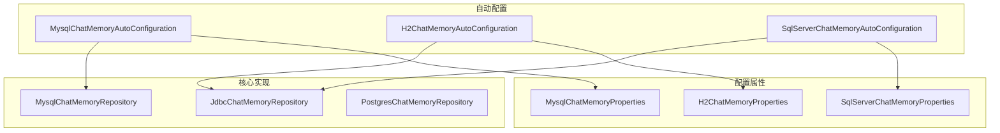
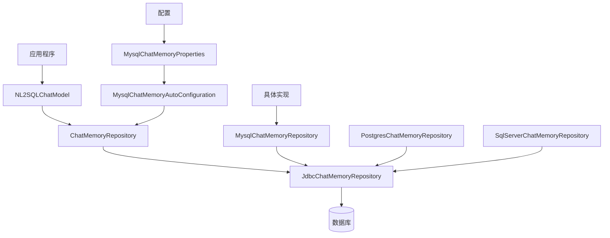
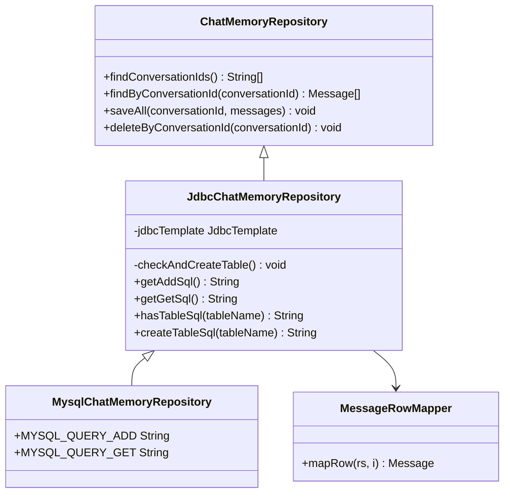
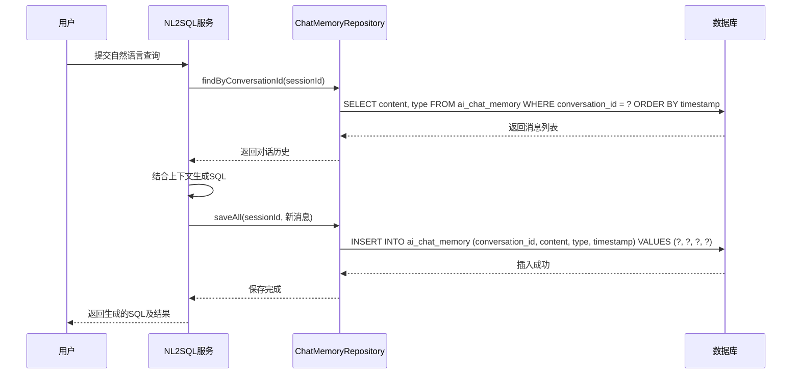
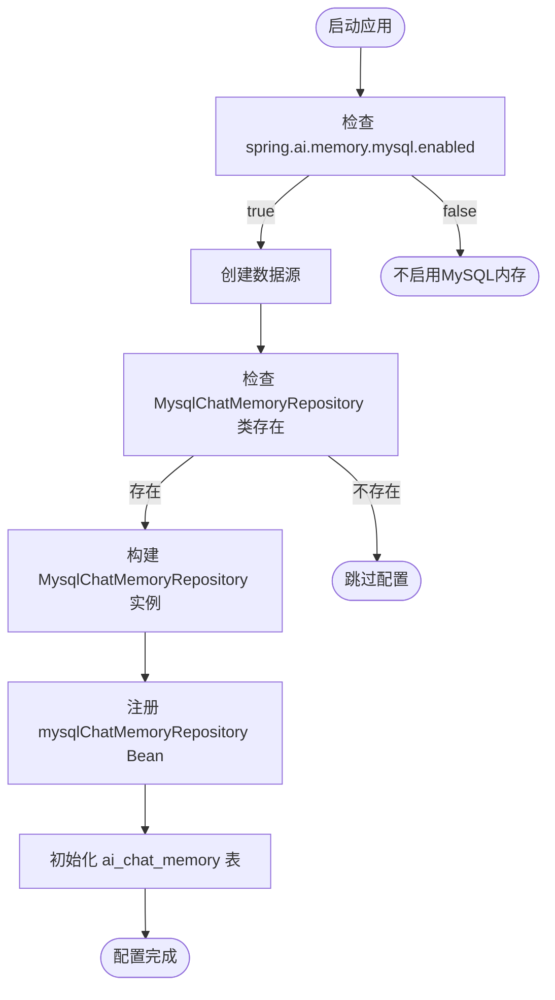
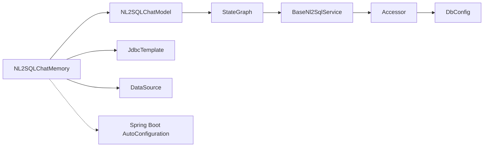

# NL2SQLChatMemory组件

<cite>
**本文档引用的文件**
- [MysqlChatMemoryAutoConfiguration.java](file://auto-configurations/spring-ai-alibaba-autoconfigure-memory/src/main/java/com/alibaba/cloud/ai/autoconfigure/memory/MysqlChatMemoryAutoConfiguration.java)
- [MysqlChatMemoryProperties.java](file://auto-configurations/spring-ai-alibaba-autoconfigure-memory/src/main/java/com/alibaba/cloud/ai/autoconfigure/memory/MysqlChatMemoryProperties.java)
- [JdbcChatMemoryRepository.java](file://community/memories/spring-ai-alibaba-starter-memory-jdbc/src/main/java/com/alibaba/cloud/ai/memory/jdbc/JdbcChatMemoryRepository.java)
- [MysqlChatMemoryRepository.java](file://spring-ai-alibaba-jmanus/src/main/java/com/alibaba/cloud/ai/manus/memory/repository/MysqlChatMemoryRepository.java)
- [Nl2sqlConfiguration.java](file://spring-ai-alibaba-nl2sql/spring-ai-alibaba-nl2sql-chat/src/main/java/com/alibaba/cloud/ai/config/Nl2sqlConfiguration.java)
- [BaseNl2SqlService.java](file://spring-ai-alibaba-nl2sql/spring-ai-alibaba-nl2sql-chat/src/main/java/com/alibaba/cloud/ai/service/base/BaseNl2SqlService.java)
</cite>

## 目录
1. [简介](#简介)
2. [项目结构](#项目结构)
3. [核心组件](#核心组件)
4. [架构概述](#架构概述)
5. [详细组件分析](#详细组件分析)
6. [依赖分析](#依赖分析)
7. [性能考虑](#性能考虑)
8. [故障排除指南](#故障排除指南)
9. [结论](#结论)

## 简介
NL2SQLChatMemory组件是Spring AI Alibaba框架中的关键组成部分，负责维护用户与系统之间的对话上下文和历史查询记录。该组件通过存储和检索自然语言问题、生成的SQL语句以及执行结果，确保在多轮对话中保持上下文一致性。它与NL2SQLChatModel协同工作，为更准确的查询生成提供支持。

## 项目结构
NL2SQLChatMemory组件主要分布在`community/memories`和`auto-configurations`目录下，采用模块化设计，支持多种数据存储后端。其核心功能由JDBC基础的聊天内存库实现，并通过自动配置类集成到Spring应用中。

**图表来源**
- [MysqlChatMemoryAutoConfiguration.java](file://auto-configurations/spring-ai-alibaba-autoconfigure-memory/src/main/java/com/alibaba/cloud/ai/autoconfigure/memory/MysqlChatMemoryAutoConfiguration.java)
- [JdbcChatMemoryRepository.java](file://community/memories/spring-ai-alibaba-starter-memory-jdbc/src/main/java/com/alibaba/cloud/ai/memory/jdbc/JdbcChatMemoryRepository.java)
- [MysqlChatMemoryRepository.java](file://spring-ai-alibaba-jmanus/src/main/java/com/alibaba/cloud/ai/manus/memory/repository/MysqlChatMemoryRepository.java)

**章节来源**
- [MysqlChatMemoryAutoConfiguration.java](file://auto-configurations/spring-ai-alibaba-autoconfigure-memory/src/main/java/com/alibaba/cloud/ai/autoconfigure/memory/MysqlChatMemoryAutoConfiguration.java)
- [JdbcChatMemoryRepository.java](file://community/memories/spring-ai-alibaba-starter-memory-jdbc/src/main/java/com/alibaba/cloud/ai/memory/jdbc/JdbcChatMemoryRepository.java)

## 核心组件
NL2SQLChatMemory组件的核心在于其分层架构设计，其中`JdbcChatMemoryRepository`作为抽象基类提供了通用的数据库操作方法，而具体的数据库实现（如MySQL、PostgreSQL）则继承并扩展这些功能以适应特定数据库的特性。

**章节来源**
- [JdbcChatMemoryRepository.java](file://community/memories/spring-ai-alibaba-starter-memory-jdbc/src/main/java/com/alibaba/cloud/ai/memory/jdbc/JdbcChatMemoryRepository.java)
- [MysqlChatMemoryRepository.java](file://spring-ai-alibaba-jmanus/src/main/java/com/alibaba/cloud/ai/manus/memory/repository/MysqlChatMemoryRepository.java)

## 架构概述
NL2SQLChatMemory组件采用典型的分层架构，包括配置层、自动配置层和数据访问层。这种设计使得组件既灵活又易于扩展，能够支持多种关系型数据库作为后端存储。

**图表来源**
- [MysqlChatMemoryAutoConfiguration.java](file://auto-configurations/spring-ai-alibaba-autoconfigure-memory/src/main/java/com/alibaba/cloud/ai/autoconfigure/memory/MysqlChatMemoryAutoConfiguration.java)
- [JdbcChatMemoryRepository.java](file://community/memories/spring-ai-alibaba-starter-memory-jdbc/src/main/java/com/alibaba/cloud/ai/memory/jdbc/JdbcChatMemoryRepository.java)

## 详细组件分析

### 数据存储机制分析
NL2SQLChatMemory组件通过统一的接口与底层数据库交互，实现了对话历史的持久化存储。所有消息类型（用户、助手、系统、工具）都被序列化并保存在专门的表中。

#### 类图展示

**图表来源**
- [JdbcChatMemoryRepository.java](file://community/memories/spring-ai-alibaba-starter-memory-jdbc/src/main/java/com/alibaba/cloud/ai/memory/jdbc/JdbcChatMemoryRepository.java)
- [MysqlChatMemoryRepository.java](file://spring-ai-alibaba-jmanus/src/main/java/com/alibaba/cloud/ai/manus/memory/repository/MysqlChatMemoryRepository.java)

**章节来源**
- [JdbcChatMemoryRepository.java](file://community/memories/spring-ai-alibaba-starter-memory-jdbc/src/main/java/com/alibaba/cloud/ai/memory/jdbc/JdbcChatMemoryRepository.java)
- [MysqlChatMemoryRepository.java](file://spring-ai-alibaba-jmanus/src/main/java/com/alibaba/cloud/ai/manus/memory/repository/MysqlChatMemoryRepository.java)

### 对话上下文管理流程
当NL2SQL系统处理用户请求时，会通过ChatMemoryRepository获取之前的对话历史，从而保持上下文的一致性。

#### 序列图展示

**图表来源**
- [JdbcChatMemoryRepository.java](file://community/memories/spring-ai-alibaba-starter-memory-jdbc/src/main/java/com/alibaba/cloud/ai/memory/jdbc/JdbcChatMemoryRepository.java)
- [BaseNl2SqlService.java](file://spring-ai-alibaba-nl2sql/spring-ai-alibaba-nl2sql-chat/src/main/java/com/alibaba/cloud/ai/service/base/BaseNl2SqlService.java)

**章节来源**
- [BaseNl2SqlService.java](file://spring-ai-alibaba-nl2sql/spring-ai-alibaba-nl2sql-chat/src/main/java/com/alibaba/cloud/ai/service/base/BaseNl2SqlService.java)
- [JdbcChatMemoryRepository.java](file://community/memories/spring-ai-alibaba-starter-memory-jdbc/src/main/java/com/alibaba/cloud/ai/memory/jdbc/JdbcChatMemoryRepository.java)

### 配置与自动装配机制
组件利用Spring Boot的自动配置特性，根据应用配置动态创建相应的内存存储实例。

#### 流程图展示

**图表来源**
- [MysqlChatMemoryAutoConfiguration.java](file://auto-configurations/spring-ai-alibaba-autoconfigure-memory/src/main/java/com/alibaba/cloud/ai/autoconfigure/memory/MysqlChatMemoryAutoConfiguration.java)
- [MysqlChatMemoryProperties.java](file://auto-configurations/spring-ai-alibaba-autoconfigure-memory/src/main/java/com/alibaba/cloud/ai/autoconfigure/memory/MysqlChatMemoryProperties.java)

**章节来源**
- [MysqlChatMemoryAutoConfiguration.java](file://auto-configurations/spring-ai-alibaba-autoconfigure-memory/src/main/java/com/alibaba/cloud/ai/autoconfigure/memory/MysqlChatMemoryAutoConfiguration.java)
- [MysqlChatMemoryProperties.java](file://auto-configurations/spring-ai-alibaba-autoconfigure-memory/src/main/java/com/alibaba/cloud/ai/autoconfigure/memory/MysqlChatMemoryProperties.java)

## 依赖分析
NL2SQLChatMemory组件与其他系统组件紧密协作，形成完整的NL2SQL解决方案。

**图表来源**
- [Nl2sqlConfiguration.java](file://spring-ai-alibaba-nl2sql/spring-ai-alibaba-nl2sql-chat/src/main/java/com/alibaba/cloud/ai/config/Nl2sqlConfiguration.java)
- [BaseNl2SqlService.java](file://spring-ai-alibaba-nl2sql/spring-ai-alibaba-nl2sql-chat/src/main/java/com/alibaba/cloud/ai/service/base/BaseNl2SqlService.java)

**章节来源**
- [Nl2sqlConfiguration.java](file://spring-ai-alibaba-nl2sql/spring-ai-alibaba-nl2sql-chat/src/main/java/com/alibaba/cloud/ai/config/Nl2sqlConfiguration.java)
- [BaseNl2SqlService.java](file://spring-ai-alibaba-nl2sql/spring-ai-alibaba-nl2sql-chat/src/main/java/com/alibaba/cloud/ai/service/base/BaseNl2SqlService.java)

## 性能考虑
NL2SQLChatMemory组件在设计时充分考虑了性能优化，通过以下措施确保高效运行：
- 自动表创建：首次使用时自动创建所需的数据库表结构
- 批量操作：使用batchUpdate进行批量消息插入，提高写入效率
- 索引优化：在conversation_id字段上建立索引，加速查询性能
- 连接池集成：与Spring的JdbcTemplate集成，充分利用数据库连接池

虽然本节讨论的是通用性能建议，但未直接分析特定文件，因此无需列出来源。

## 故障排除指南
常见问题及解决方案：

1. **表不存在错误**：确保`spring.ai.memory.mysql.initialize-schema=true`（或其他相应数据库配置）
2. **连接失败**：检查数据库URL、用户名和密码配置是否正确
3. **权限不足**：确认数据库用户具有创建表和读写数据的权限
4. **字符集问题**：对于中文内容存储，建议使用utf8mb4字符集

**章节来源**
- [MysqlChatMemoryProperties.java](file://auto-configurations/spring-ai-alibaba-autoconfigure-memory/src/main/java/com/alibaba/cloud/ai/autoconfigure/memory/MysqlChatMemoryProperties.java)
- [JdbcChatMemoryRepository.java](file://community/memories/spring-ai-alibaba-starter-memory-jdbc/src/main/java/com/alibaba/cloud/ai/memory/jdbc/JdbcChatMemoryRepository.java)

## 结论
NL2SQLChatMemory组件通过精心设计的分层架构和灵活的配置机制，有效地维护了对话上下文和历史查询记录。它不仅支持多种数据库后端，还与NL2SQLChatModel紧密集成，为复杂的多轮对话场景提供了可靠的上下文管理能力。该组件的设计体现了高内聚、低耦合的原则，既保证了功能的完整性，又保持了良好的可扩展性和可维护性。